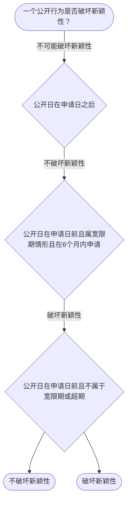

# 专家 B 教学草稿

> 专家：expert_b ｜ 风格：accessible

## 教学模块选择清单

- 当前教学节点：`patent-law-foundation`
- 板块预算：自适应 None/None，总计 9/9

| # | 模块 (block_type) | 类型 | 触发原因 (trigger) | 对应正文段 | 归属 |
|---:|---|:--:|---|---|:--:|
| 1 | `anchor_scenario` | 自适应 | perception=sensing(0.86) / cold_start | 场景导入｜在智能制造领域，一家科技公司研发新型AI工业机器人关节模组，计划申请专利，但担心在政府主办的… | [B] |
| 2 | `legal_anchor` | 必选 | mandatory | 法条锚定｜《专利法》第二条 | [B] |
| 3 | `worked_example` | 自适应 | cognition.apply=0.39<0.4 / cold_start | 判定链演示｜甲公司在2024年5月1日政府主办国际博览会上展示新AI机器人，2024年10月15日申请专… | [B] |
| 4 | `decision_flow` | 自适应 | input=visual(0.82) | 新颖性判断决策流程｜一个公开行为是否破坏新颖性？ | [B] |
| 5 | `common_pitfall` | 自适应 | weak_points(专利法律制度基础) | 常见误区辨析｜‘宽限期’就是申请前公开都不算事，专利照样能拿。 | [B] |
| 6 | `reflect_prompt` | 自适应 | processing=reflective(0.67) | 反思提示｜如果客户同时做了博览会展示和论文发表，你会怎么排时间表？ | [B] |
| 7 | `assessment` | 必选 | mandatory | 测评模块｜验证保护客体概念 | [B] |
| 8 | `knowledge_synthesis` | 必选 | mandatory | 知识综合框架｜专利制度特征：独占性、时间性、地域性 | [B] |
| 9 | `summary_card` | 自适应 | len(knowledge_sub_nodes)=3>=3 | 速查卡｜先过客体之门，再过制度特征关。 | [B] |

## 教学正文

## 1. 场景导入
在智能制造领域，一家科技公司正研发一种新型AI驱动的工业机器人关节模组，他们希望申请专利，但担心下月在政府主办的国际智能制造博览会上展示该模组是否会影响新颖性，同时需要了解专利能保护哪些具体对象，以及中国专利制度的基本框架是什么。

## 2. 人话解释
专利法律制度基础主要是建立专利制度的整体框架，包括专利制度的核心概念特征以及中国专利法的体系结构。专利制度有独占性、时间性和地域性三种基本特征，它保护发明、实用新型和外观设计三种客体。专利制度的作用在于激励发明创造、促进技术公开、推动技术应用和经济发展。中国专利制度的特点是早期公开延迟审查制度下，初步审查和实质审查并存。

## 3. 法条回扣
《专利法》第二条规定，‘本法所称的发明，是指对产品、方法或者其改进所提出的新的技术方案’；‘实用新型，是指对产品的形状、构造或者其组合所提出的新的技术方案’；‘外观设计，是指对产品的形状、图案或者其结合所作出的富有美感并适于工业应用的新设计’。

《专利法》第二十二条规定，‘授予专利权应当符合新颖性、创造性和实用性’。

《专利法》第二十三条规定，‘授予专利权的外观设计，应当不属于现有设计，应当与现有设计有显著区别，并且不符合《中华人民共和国商标法》和其他有关法律、法规规定’。

## 4. 类比 / 口诀
专利制度就像一张‘有时间限制的独占通行证’，给予发明人一定期限内的独家使用权，但有地域限制。口诀：三客体（发明/实用新型/外观设计）、三特征（独占/时间/地域）、三审查（新颖/创造/实用）。

适用边界：独占性不是绝对的，有‘用尽’和‘先用’原则；时间性是有限的，地域性是可申请的。

## 5. 应试提示
题干关键词包括‘保护客体’‘独占性’‘时间性’‘地域性’‘中国专利制度特点’。判断步骤：先确认是否属于三客体，再看是否符合制度特征。常见陷阱是把公开行为直接当成现有技术，或混淆外观设计与发明保护范围。

## 6. 互动提问
请思考：如果一个公司在智能制造博览会上展示新机器人，你作为专利代理人，第一步会做什么？为什么？

### 场景导入（anchor_scenario）

> 在智能制造领域，一家科技公司研发新型AI工业机器人关节模组，计划申请专利，但担心在政府主办的国际智能制造博览会上展示是否影响新颖性，同时需要了解专利能保护哪些对象及中国专利制度框架。

**锚定**：用智能制造研发场景锚定专利制度基础的核心概念和特征。

**先想一想**：如果你是专利代理人，看到这个展示行为，第一反应是什么风险或安全措施？为什么？

### 法条锚定（legal_anchor）

- **《专利法》第二条**：专利保护的三种客体：发明、实用新型、外观设计。
- **《专利法》第二十二条**：授权的实质条件：新颖性、创造性和实用性。
- **《专利法》第二十三条**：外观设计授权条件：不属于现有设计、与现有设计有显著区别、不冲突。

**为何重要**：本节作为后续所有专利规则的总入口，必须先建立法条基础。

### 判定链演示（worked_example）

**案情/例题**：甲公司在2024年5月1日政府主办国际博览会上展示新AI机器人，2024年10月15日申请专利，问：该展示是否破坏新颖性？
**适用规则**：《专利法》第二十四条（不丧失新颖性宽限期）
**分步推演**：
1. 展示日在申请日前，属于政府主办国际展会法定情形 → *落入宽限期范围*
2. 申请日距展示日约5.5个月，在6个月内 → *适用宽限期*
3. 宽限期仅豁免该公开，三性仍需实质审查 → *仍需过创造性和实用性*
**结论**：展示不破坏新颖性，但实体三性仍需满足。
**本题要点**：宽限期是时间豁免，不是免死金牌。

### 新颖性判断决策流程（decision_flow）

**决策问题**：一个公开行为是否破坏新颖性？



### 常见误区辨析（common_pitfall）

**常见误解**：‘宽限期’就是申请前公开都不算事，专利照样能拿。

**为什么错**：宽限期仅豁免特定公开（如官方展会）且不改变三性实质审查，超期或不符情形仍破坏新颖性。

**区分判据**：看两点：公开是否属法定宽限情形 + 申请是否在6个月内。

**关联节点**：patent-law-foundation

### 反思提示（reflect_prompt）

**反思问题**：如果客户同时做了博览会展示和论文发表，你会怎么排时间表？

**关注要点**：两个公开行为的日期各自如何算宽限期；论文发表是否也享宽限期

**连接**：连接到‘现有技术’与‘公开行为类型’

### 知识综合框架（knowledge_synthesis）

**知识框架**：
- 专利制度特征：独占性、时间性、地域性
- 保护客体：发明、实用新型、外观设计
- 中国专利制度特点：早期公开延迟审查、初步与实质审查并存
**概念关系**：客体决定保护范围，特征决定制度属性，三性是授权核心
**必记**：三客体是基础，三特征是核心，三性是授权门槛；制度作用是激励与促进

### 速查卡（summary_card）

**要点卡**：
- **保护客体**：发明、实用新型、外观设计
- **三特征**：独占性、时间性、地域性
- **制度特点**：早期公开延迟审查，初步与实质审查并存
**必背**：三客体；三特征；三性门槛
**一句话总结**：先过客体之门，再过制度特征关。

### 测评模块（assessment）

**三类覆盖**：backward_review、forward_probe、weakness_probe
**题目**：
- br1：验证保护客体概念
- wp1：判断制度特点
- wp2：判断制度作用


## 结构化字段

## knowledge_points

```json
[
  {
    "node_id": "patent-law-foundation",
    "kc_name": "专利法律制度基础"
  },
  {
    "node_id": "patent-law-foundation",
    "kc_name": "专利制度的基本概念与特征：独占性、时间性、地域性"
  },
  {
    "node_id": "patent-law-foundation",
    "kc_name": "中国专利制度体系：专利法、专利法实施细则、专利审查指南"
  },
  {
    "node_id": "patent-law-foundation",
    "kc_name": "专利制度的作用与发展历程"
  }
]
```

## legal_basis

```json
[
  {
    "article": "《专利法》第二条",
    "source": "《中华人民共和国专利法》第二条"
  },
  {
    "article": "《专利法》第二十二条",
    "source": "《中华人民共和国专利法》第二十二条"
  },
  {
    "article": "《专利法》第二十三条",
    "source": "《中华人民共和国专利法》第二十三条"
  }
]
```

## risks

```json
[
  {
    "risk": "初学者可能混淆专利保护客体与授权三性",
    "related_node_id": "patent-law-foundation"
  },
  {
    "risk": "对专利制度特征的理解停留在表面",
    "related_node_id": "patent-rights-nature"
  }
]
```

## draft_stage

```json
"debate"
```

## interactive_questions

```json
[
  {
    "qid": "br1",
    "category": "remember",
    "difficulty": "L1",
    "source_tag": "backward_review",
    "kc_node_id": "patent-law-foundation",
    "question": "专利法保护的客体有哪些？",
    "answer": "D",
    "options": [
      "A. 仅发明",
      "B. 仅实用新型",
      "C. 仅外观设计",
      "D. 发明、实用新型和外观设计"
    ]
  },
  {
    "qid": "wp1",
    "category": "understand",
    "difficulty": "L3",
    "source_tag": "weakness_probe",
    "kc_node_id": "patent-law-foundation",
    "question": "中国专利制度早期公开延迟审查的特点是指什么？",
    "answer": "C",
    "options": [
      "A. 申请后立即公开",
      "B. 优先审查",
      "C. 早期公开、延迟审查",
      "D. 只有实质审查"
    ]
  },
  {
    "qid": "wp2",
    "category": "apply",
    "difficulty": "L2",
    "source_tag": "weakness_probe",
    "kc_node_id": "patent-law-foundation",
    "question": "专利制度的作用不包括哪项？",
    "answer": "C",
    "options": [
      "A. 激励发明创造",
      "B. 促进技术公开",
      "C. 限制技术应用",
      "D. 推动经济发展"
    ]
  }
]
```

## knowledge_synthesis

```json
{
  "node": "patent-law-foundation",
  "coverage": [
    {
      "node_id": "patent-law-foundation"
    }
  ],
  "confusable_pairs": [
    {
      "pair": "专利保护客体与授权三性"
    },
    {
      "pair": "独占性与地域性"
    }
  ]
}
```
