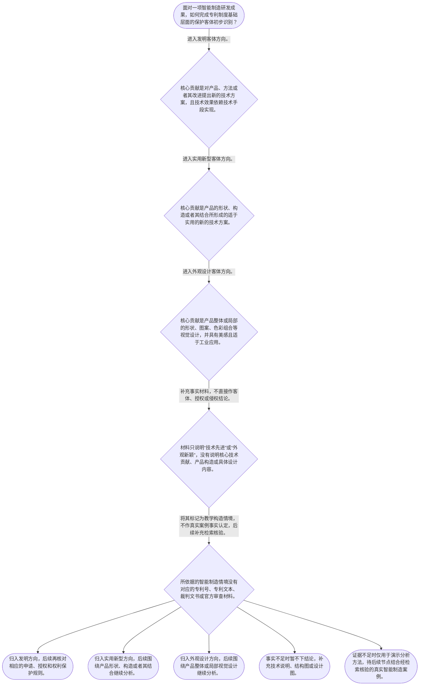

# 整合后的课程完整内容与习题

## 教学模块选择清单

- 当前教学节点：`patent-law-foundation`
- 板块预算：自适应 5/6，总计 9/9

| # | 模块 (block_type) | 类型 | 触发原因 (trigger) | 对应正文段 | 归属 |
|---:|---|:--:|---|---|:--:|
| 1 | `anchor_scenario` | 自适应 | perception=sensing(0.86) / cold_start | 智能制造方案的专利制度入口｜某智能制造企业开发机器人装配线视觉校准系统：相机识别工件位置，控制器计算偏差，再向机械臂发送… | [A+B融合] |
| 2 | `legal_anchor` | 必选 | mandatory | 保护客体的法条锚点｜《中华人民共和国专利法》第二条 | [A+B融合] |
| 3 | `worked_example` | 自适应 | cognition.apply=0.38<0.4 / cold_start | 视觉校准系统的客体识别演示｜某工厂研发机器人装配线视觉校准系统：相机采集工件位置，控制器计算目标位置与实际位置的偏差，并… | [A+B融合] |
| 4 | `decision_flow` | 自适应 | input=visual(0.82) | 三种保护客体初步识别流程｜面对一项智能制造研发成果，如何完成专利制度基础层面的保护客体初步识别？ | [A+B融合] |
| 5 | `mnemonic` | 自适应 | remember=0.75>=0.6 & apply<0.4 / understanding=sequential(0.70) | 制度基础速记框架｜“客体三分、规范三层、权利三性”分类表：客体看“发—实—外”，规范看“法—则—指南”，权利边… | [A+B融合] |
| 6 | `reflect_prompt` | 自适应 | processing=reflective(0.67) | 从研发成果回看分类依据｜回看你熟悉的一项智能制造研发成果：它真正想保护的是技术方法、产品构造还是产品视觉设计？哪些具… | [B] |
| 7 | `assessment` | 必选 | mandatory | 当前节点测评索引｜复习《专利法》第二条所列三类保护客体。 | [A+B融合] |
| 8 | `knowledge_synthesis` | 必选 | mandatory | 专利法律制度基础关系网｜专利权基本特征：独占性、时间性、地域性共同限定专利权的效力边界，不能理解为永久或全球自动有效… | [A+B融合] |
| 9 | `summary_card` | 自适应 | len(knowledge_sub_nodes)=3>=3 | 制度基础速查卡｜专利法律制度基础的第一步，是在规范体系中准确识别成果客体和权利边界，再以可靠案例材料进入新颖… | [A+B融合] |

## 教学正文

## 一、从智能制造场景进入专利制度

设想研发团队完成了一套机器人装配线视觉校准系统：相机识别工件位置，控制器计算偏差，机械臂依指令完成校准；同时，设备外壳还有新的视觉设计。团队常会立刻追问“能不能授权”“竞争对手做了类似产线是否侵权”。但专利分析的正确起点不是直接回答这两个问题，而是先识别要保护的成果是什么、应当查找哪一层规则。

检索上下文未提供可核验的智能制造领域真实案例、专利号或裁判文书，因此本节使用的是教学构造情境，不将其包装为真实个案。后续学习新颖性判断和侵权判定时，将先补充并核验智能制造领域的具体专利文本、专利号、裁判文书或官方审查材料，再依照法条进行案例分析；本节先为二者建立共同的制度入口。各板块涉及的智能制造情境均属于同一教学构造情境，不能替代真实案例证据。

## 二、制度框架：规范三层与权利三性

中国专利制度的基础规范体系可按“专利法—专利法实施细则—专利审查指南”定位：先用专利法确定基本制度与法律问题，再结合实施细则和审查指南理解具体程序或审查规则。不能以行业经验、技术先进程度或产品宣传语替代规范依据。

专利权具有三项基本特征。独占性表示权利人在法定范围内享有排他效力；时间性表示专利权并非永久存在；地域性表示专利权效力以取得保护的法域为边界。可以把它理解为一把受期限和地域限制的法律保护伞，但这个类比只能帮助记忆，不能把专利权误解为对技术的无限、永久或全球控制权。

专利制度的作用在于激励发明创造、促进技术公开、推动技术应用和经济发展。制度运行中，早期公开与延迟审查、初步审查制与实质审查制并存，因此“公开”“审查”“授权”是不同环节，不能把它们当作同一时点或同一法律结论。

## 三、保护客体：先分类，再进入后续判断

当前节点的法条锚点是《中华人民共和国专利法》第二条。教学上下文明确列出该条涉及的三种专利保护客体：发明、实用新型、外观设计。发明可面向产品、方法或者其改进所提出的技术方案；实用新型聚焦产品的形状、构造或者其结合所形成的适于实用的技术方案；外观设计则聚焦产品整体或局部的形状、图案、色彩组合等视觉设计。〔RAG: 教学上下文 — “专利保护的三种客体：发明、实用新型、外观设计（专利法第2条）”〕

在智能制造中，同一个商业项目可能同时出现多种事实：机械臂的结构可能涉及产品构造，视觉校准算法可能涉及控制方法，设备外壳可能涉及视觉设计。正确方法是先把事实拆开，再看每一部分的核心贡献对应何种客体；不能因为方案有“机器人”“人工智能”或“产品”字样，就自动归为同一种专利类型。

一个实用的分类顺序是：核心贡献若是借助技术手段实现技术效果的产品、方法或改进，先进入发明方向；若核心是产品形状、构造或者其结合，进入实用新型方向；若核心是产品整体或局部的视觉设计，进入外观设计方向。事实材料不足时，应补充技术说明、结构图或设计图，而不是仓促下结论。

## 四、演示：视觉校准系统如何完成第一层识别

回到机器人装配线视觉校准系统。第一步，拆分事实：相机、控制器、机械臂是设备要素；采集位置数据、计算偏差、发送校准指令是方法步骤；外壳造型属于可能独立的视觉设计事实。

第二步，识别核心贡献。若团队想保护的是“通过采集、计算和控制指令提高校准效果”的方案，重点在技术手段和方法步骤，应优先按发明方向识别。若团队另有独立的产品构造改进，可另行考虑实用新型方向；若其独立价值在设备外壳的视觉设计，则再考虑外观设计方向。

第三步，守住结论边界。完成上述分类，只说明应从哪里进入专利制度，并不等于该方案已经具备新颖性、创造性、实用性等授权条件；同样，也不能因为竞争对手使用了相似产线，就断定侵权。侵权分析必须以具体已授权专利及其权利基础为前提。对真实智能制造案件的判断，还需要在后续节点核对具体专利文本、申请和公开信息以及裁判文书，不能用本节构造情境替代证据。

## 五、学习时要防止的层级混同

第一，不要把“发明、实用新型、外观设计”误当作“新颖性、创造性、实用性”。前者回答的是成果属于哪一种保护客体，后者属于后续授权实质条件的判断问题。

第二，不要把“发明可涉及方法”误解为“任何涉及产品的方案都属于实用新型”。判断关键不在是否出现产品，而在核心贡献是否是产品形状、构造或者其结合；仅有制造或控制方法步骤的方案，应优先按发明方向识别。

第三，不要把独占性理解为无限权利。时间性和地域性共同划定边界；也不要在没有明确具体专利权利基础前直接作侵权结论。

第四，不要把教学构造情境误认为真实案例。真实案例必须有可核验的企业或当事人信息、专利号、专利文本、裁判文书或官方审查材料；检索上下文未提供这些材料时，只能明确标注证据不足，并把情境用于演示分析方法。

## 六、本节收束

本节的固定顺序是：先在专利法、专利法实施细则和专利审查指南构成的规范体系中定位问题；再依据《中华人民共和国专利法》第二条识别发明、实用新型或外观设计；最后才进入后续的授权实质条件或具体侵权分析。记忆时可使用“客体三分、规范三层、权利三性”分类表，但应始终以法定概念边界和可核验证据为准。后续课程将沿“专利授权实质条件—新颖性及现有技术—抵触申请与宽限期—侵权判定”的路径推进，并在检索到真实智能制造案例后结合具体案情展开。

本节设有测评，请到【习题】区作答。

### 智能制造方案的专利制度入口（anchor_scenario）

> 某智能制造企业开发机器人装配线视觉校准系统：相机识别工件位置，控制器计算偏差，再向机械臂发送校准指令；设备外壳也重新设计了造型。研发负责人准备申请专利，却同时担心竞争对手使用相似控制流程，以及即将在行业展会上展示设备是否影响后续保护。此时必须先区分技术方法、产品构造和视觉设计，不能直接把“能否授权”和“是否侵权”混成一个问题。检索上下文未提供可核验的具体企业、专利号、裁判文书或其他智能制造真实案例材料，因此本节将该情境明确作为教学构造情境；后续学习新颖性和侵权判定时，应在补充真实案例检索材料后再进行案例分析。

**锚定**：该情境锚定“先识别保护客体、再进入授权条件或侵权专门分析”的制度入口，并明确真实案例材料的证据边界。

**先想一想**：面对同时包含设备、控制步骤和外观元素的智能制造方案，第一步应先识别保护客体，还是先判断能否授权或是否侵权？

### 保护客体的法条锚点（legal_anchor）

- **《中华人民共和国专利法》第二条**：这一条把专利法上的发明创造分为发明、实用新型和外观设计三类：发明针对产品、方法或者其改进提出新的技术方案；实用新型针对产品的形状、构造或者其结合提出适于实用的新的技术方案；外观设计针对产品整体或局部的形状、图案、色彩组合等提出富有美感并适于工业应用的新设计。

**为何重要**：本条确定研发成果进入专利制度时的第一层分类入口。只有先识别客体，才能在后续节点正确选择授权条件、申请布局和侵权比对的分析对象；本节不据此提前作出授权或侵权结论。

### 视觉校准系统的客体识别演示（worked_example）

**案情/例题**：某工厂研发机器人装配线视觉校准系统：相机采集工件位置，控制器计算目标位置与实际位置的偏差，并向机械臂发送校准指令；系统外壳同时经过重新设计。研发团队拟申请专利。问题是：在专利制度的第一层分类中，控制系统的核心方案应先按哪一类保护客体方向识别？
**适用规则**：《中华人民共和国专利法》第二条。依据教学上下文，该条将发明创造分为发明、实用新型和外观设计；发明可针对产品、方法或者其改进提出新的技术方案，实用新型聚焦产品的形状、构造或者其结合，外观设计聚焦产品整体或局部的视觉设计。
**分步推演**：
1. 先拆分技术事实。相机、控制器和机械臂是设备要素；采集位置数据、计算偏差、发送校准指令是方法步骤；外壳造型属于可能独立存在的视觉设计事实。 → *同一制造系统可以包含设备、方法和视觉设计等不同事实，不能把整个项目直接归为一种客体。*
2. 题设的核心贡献是通过技术手段和控制步骤实现校准效果，重点不在产品外观。按照第二条的分类框架，针对产品、方法或者其改进提出的技术方案，应先进入发明方向。 → *以方法步骤和技术手段实现技术效果的核心方案，优先按发明方向识别。*
3. 实用新型的分类重点是产品的形状、构造或者其结合；外观设计的分类重点是产品整体或局部的视觉设计。外壳事实可能支持另一项设计判断，但不能替代控制方法的客体识别。 → *产品构造、控制方法和视觉设计应分别记录、分别判断。*
**结论**：机器人装配线中“采集位置—计算偏差—发送校准指令”的核心贡献，应优先按发明方向识别；外壳造型可以作为另一个事实单独评估外观设计方向，若存在独立产品形状或构造改进，也可另行评估实用新型方向。该结论仅完成保护客体分类，不代表已经满足授权条件，也不代表竞争对手已经侵权。本例为教学构造情境，检索上下文未提供可核验的真实智能制造案例材料。
**本题要点**：面对智能制造成果，应先拆分设备、方法和视觉事实，再依照《专利法》第二条识别客体；客体分类先于授权条件和侵权判断。

### 三种保护客体初步识别流程（decision_flow）

**决策问题**：面对一项智能制造研发成果，如何完成专利制度基础层面的保护客体初步识别？



### 制度基础速记框架（mnemonic）

**记忆锚**：“客体三分、规范三层、权利三性”分类表：客体看“发—实—外”，规范看“法—则—指南”，权利边界看“独—时—地”。
**映射**：
- 客体三分
- 规范三层
- 权利三性
**何时用**：看到“这项成果属于哪种专利”“应查什么规则”或“专利权能否无限控制技术”时，按客体、规范、权利边界三组逐项核对。该分类表只用于本节点的制度定位，不能替代后续新颖性、创造性或侵权判定规则，也不能把教学构造情境当作真实案例依据。

### 从研发成果回看分类依据（reflect_prompt）

**反思问题**：回看你熟悉的一项智能制造研发成果：它真正想保护的是技术方法、产品构造还是产品视觉设计？哪些具体事实支持该分类？在后续学习新颖性和侵权判定时，你还需要哪些真实案例材料？

**关注要点**：不要把“技术先进”直接等同于某一种保护客体。；区分技术效果、产品构造和视觉设计各自承担的作用。；客体分类只是制度入口，尚未回答是否具备授权条件或是否构成侵权。；当前检索上下文没有提供可核验真实案例，因此后续案例分析应以补充的专利号、裁判文书或官方材料为依据。

**连接**：连接到学习者已有的智能制造研发经验：把熟悉的一项制造系统拆成设备构造、控制方法和产品视觉设计三组材料，并思考后续需要检索哪些真实案例和法条依据。

### 专利法律制度基础关系网（knowledge_synthesis）

**知识框架**：
- 专利权基本特征：独占性、时间性、地域性共同限定专利权的效力边界，不能理解为永久或全球自动有效。
- 制度规范体系：专利法提供基本制度规则，专利法实施细则和专利审查指南是理解和适用具体制度时的重要规范材料。
- 三种保护客体：发明、实用新型、外观设计构成专利制度的基础分类入口，《中华人民共和国专利法》第二条是本节的条文锚点。
- 制度作用：专利制度通过激励发明创造、促进技术公开、推动技术应用和经济发展，连接研发激励与知识扩散。
- 制度运行特点：中国专利制度具有早期公开与延迟审查、初步审查制与实质审查制并存等特点，公开、审查和授权不是同一时点或同一程序概念。
**概念关系**：先识别成果属于何种保护客体，才可能选择相应的申请和权利布局方向。；规范体系为客体识别、申请审查和权利保护提供不同层次的依据。；授权实质条件和侵权判定均建立在正确识别对象、并进一步掌握专门规则的基础上。；本节点建立专利制度入口；下一节点前探发明和实用新型的授权实质条件，后续节点再结合经检索核验的智能制造真实案例学习新颖性和侵权判定。
**必记**：发明、实用新型、外观设计是专利保护客体的基本三分法。；专利权具有独占性、时间性和地域性，不能理解为无限制的技术控制权。；客体识别、授权条件判断、侵权判定是不同分析层次，不能混同。；当前检索上下文未提供可核验的智能制造真实案例，不能把教学构造情境当作真实个案；后续案例结论必须建立在具体来源材料上。

### 制度基础速查卡（summary_card）

**要点卡**：
- **专利权基本特征**：独占性、时间性、地域性共同限定专利权的效力边界。
- **制度规范体系**：处理问题时按专利法、专利法实施细则、专利审查指南的层次定位规则。
- **保护客体**：发明、实用新型、外观设计是专利制度的三类基础入口。
- **制度功能与运行**：专利制度激励创造、促进公开和应用；公开、审查、授权属于不同环节。
- **案例证据边界**：当前没有可核验真实案例，后续新颖性和侵权学习应以补充的专利号、裁判文书或官方材料为依据。
**必背**：《中华人民共和国专利法》第二条所列保护客体：发明、实用新型、外观设计。；专利权的基本特征：独占性、时间性、地域性。；先识别保护客体，再讨论授权条件或侵权。；教学构造情境不能替代经检索核验的真实案例材料。
**一句话总结**：专利法律制度基础的第一步，是在规范体系中准确识别成果客体和权利边界，再以可靠案例材料进入新颖性与侵权分析。

### 当前节点测评索引（assessment）

**三类覆盖**：backward_review、forward_probe、weakness_probe
**题目**：
- q-foundation-1：复习《专利法》第二条所列三类保护客体。
- q-forward-1：前探发明和实用新型的授权实质条件。
- q-weakness-1：在当前节点范围内辨析方法技术方案与实用新型客体的分类边界。


## 结构化数据

## expert

```json
"A+B融合"
```

## style

```json
"fused"
```

## knowledge_points

```json
[
  {
    "node_id": "patent-law-foundation",
    "kc_name": "专利制度的基本概念与特征：独占性、时间性、地域性（详见子节点 patent-rights-nature）"
  },
  {
    "node_id": "patent-law-foundation",
    "kc_name": "中国专利制度体系：专利法、专利法实施细则、专利审查指南（详见子节点 patent-law-framework）"
  },
  {
    "node_id": "patent-law-foundation",
    "kc_name": "专利保护的三种客体：发明、实用新型、外观设计（专利法第2条）"
  },
  {
    "node_id": "patent-law-foundation",
    "kc_name": "专利制度的作用：激励发明创造、促进技术公开、推动技术应用和经济发展（详见子节点 patent-system-overview）"
  },
  {
    "node_id": "patent-law-foundation",
    "kc_name": "中国专利制度发展历程与特点：早期公开延迟审查、初步审查制与实质审查制并存（详见子节点 patent-system-overview）"
  }
]
```

## legal_basis

```json
[
  {
    "article": "《中华人民共和国专利法》第二条",
    "source": "教学上下文明确提供该条及三种专利保护客体；检索上下文未提供法条原文。"
  }
]
```

## risks

```json
[
  {
    "risk": "将发明、实用新型、外观设计误当作新颖性、创造性、实用性等授权条件，导致保护客体分类和授权审查层级混乱。",
    "related_node_id": "patent-law-foundation"
  },
  {
    "risk": "将方法技术方案误归入实用新型，忽略实用新型聚焦产品形状、构造或者其结合的分类边界。",
    "related_node_id": "patent-law-foundation"
  },
  {
    "risk": "把专利权独占性理解为永久、全球或不受边界限制的控制权，忽略时间性和地域性。",
    "related_node_id": "patent-law-foundation"
  },
  {
    "risk": "在尚未识别客体和具体权利基础时，提前以新颖性、创造性或侵权结论替代制度基础分析。",
    "related_node_id": "patentability-substantive"
  },
  {
    "risk": "检索上下文未提供可核验的智能制造真实案例、专利号或裁判文书，不能把教学构造情境表述为真实个案或据此作事实认定。",
    "related_node_id": "patent-law-foundation"
  }
]
```

## draft_stage

```json
"integration"
```

## irac

```json
{
  "issue": "对于一项智能制造研发成果，应如何在中国专利法律制度中建立正确分析起点，避免将保护客体、授权条件和侵权判定混同？",
  "rule": "教学上下文明确列出《中华人民共和国专利法》第二条及三种保护客体：发明、实用新型、外观设计。当前节点还要求掌握专利权的独占性、时间性、地域性，以及由专利法、专利法实施细则、专利审查指南构成的制度规范体系。",
  "application": "对机器人装配线视觉校准系统，应先拆分相机、控制器、机械臂等设备事实，采集数据、计算偏差、发送校准指令等方法事实，以及可能独立存在的外壳视觉设计事实。核心贡献若是以技术手段实现校准效果，应优先按发明方向识别；如核心是产品形状、构造或者其结合，才转入实用新型方向；如核心是产品整体或局部的视觉设计，才转入外观设计方向。方法与实用新型边界属于本节点客体分类的易错点，但本节不据此判断新颖性、创造性或侵权。检索上下文未提供可核验的智能制造真实案例材料，故本节不对具体企业或个案作事实认定。",
  "conclusion": "本节点的结论是：专利分析应先在专利法、专利法实施细则和专利审查指南构成的规范体系中定位规则，并以《中华人民共和国专利法》第二条所列三种保护客体建立分类入口；授权条件和侵权判定属于后续且不可混同的分析层次。新颖性和侵权判定将在后续节点结合经检索核验的智能制造真实案例展开。"
}
```

## interactive_questions

```json
[
  {
    "qid": "q-foundation-1",
    "category": "remember",
    "difficulty": "L1",
    "source_tag": "backward_review",
    "kc_node_id": "patent-law-foundation",
    "question": "根据本节所依据的《中华人民共和国专利法》第二条，以下哪一组属于专利保护客体的基本分类？",
    "answer": "C",
    "options": [
      "A. 发明、商标、著作权",
      "B. 实用新型、商标、外观设计",
      "C. 发明、实用新型、外观设计",
      "D. 发明、商业秘密、集成电路布图设计"
    ]
  },
  {
    "qid": "q-forward-1",
    "category": "understand",
    "difficulty": "L1",
    "source_tag": "forward_probe",
    "kc_node_id": "patentability-substantive",
    "question": "关于发明和实用新型的授权实质条件，下列说法正确的是？",
    "answer": "A",
    "options": [
      "A. 新颖性、创造性、实用性",
      "B. 新颖性、显著性、美观性",
      "C. 创造性、地域性、时间性",
      "D. 实用性、独占性、公开性"
    ]
  },
  {
    "qid": "q-weakness-1",
    "category": "apply",
    "difficulty": "L3",
    "source_tag": "weakness_probe",
    "kc_node_id": "patentability-substantive",
    "question": "某智能制造方案的唯一核心贡献是通过技术手段调整机器人焊接顺序的方法步骤，未提出产品形状、构造或者其结合的改进。关于其在当前节点保护客体分类中的初步识别，下列判断正确的是？",
    "answer": "B",
    "options": [
      "A. 应直接归入实用新型，因为机器人属于产品。",
      "B. 应优先按发明方向识别，因为核心是方法步骤，不是产品形状、构造或者其结合。",
      "C. 应归入外观设计，因为算法会影响机器人的运行外观。",
      "D. 三种专利类型均不可能涉及算法相关的技术方案。"
    ]
  }
]
```

## knowledge_synthesis

```json
{
  "node": "patent-law-foundation",
  "coverage": [
    {
      "node_id": "patent-rights-nature"
    },
    {
      "node_id": "patent-law-framework"
    },
    {
      "node_id": "patent-system-overview"
    },
    {
      "node_id": "patent-law-foundation"
    }
  ],
  "confusable_pairs": [
    {
      "pair": "保护客体分类与授权实质条件：前者回答成果进入发明、实用新型还是外观设计入口；后者回答相应申请是否满足授权门槛。"
    },
    {
      "pair": "发明与实用新型：发明可针对产品、方法或者其改进的技术方案；实用新型聚焦产品形状、构造或者其结合。"
    },
    {
      "pair": "授权判断与侵权判定：授权判断关注申请方案是否可取得权利；侵权判定须以具体已授权专利的权利基础为前提。"
    },
    {
      "pair": "教学构造情境与真实案例：前者用于演示推理结构，后者必须有可核验的专利号、裁判文书或官方来源。"
    }
  ]
}
```
