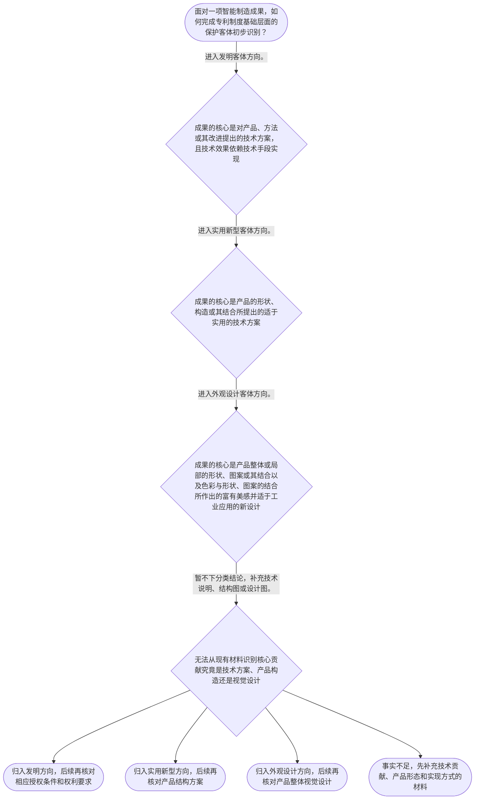

# 专家 A 教学草稿

> 专家：expert_a ｜ 风格：conservative

## 教学模块选择清单

- 当前教学节点：`patent-law-foundation`
- 板块预算：自适应 6/6，总计 9/9

| # | 模块 (block_type) | 类型 | 触发原因 (trigger) | 对应正文段 | 归属 |
|---:|---|:--:|---|---|:--:|
| 1 | `anchor_scenario` | 自适应 | perception=sensing(0.86) / cold_start | 智能制造方案的专利制度入口｜某智能制造企业的研发团队完成了一套“机器人装配线视觉校准系统”：相机采集工件位置，控制器计算… | [A] |
| 2 | `legal_anchor` | 必选 | mandatory | 保护客体的法条锚点｜《中华人民共和国专利法》第二条 | [A] |
| 3 | `worked_example` | 自适应 | cognition.apply=0.38<0.4 / cold_start | 视觉校准系统的客体识别演示｜某工厂研发“机器人装配线视觉校准系统”：相机采集工件位置数据，控制器计算目标位置与实际位置的… | [A] |
| 4 | `decision_flow` | 自适应 | input=visual(0.82) | 三种保护客体初步识别流程｜面对一项智能制造成果，如何完成专利制度基础层面的保护客体初步识别？ | [A] |
| 5 | `mnemonic` | 自适应 | remember=0.75>=0.6 & apply<0.4 / understanding=sequential(0.70) | 制度基础速记框架｜“客体三分、规范三层、权利三性”：客体按发明/实用新型/外观设计识别；规范按专利法/实施细则… | [A] |
| 6 | `reflect_prompt` | 自适应 | processing=reflective(0.67) | 从研发成果回看分类依据｜回看你熟悉的一项智能制造研发成果：其真正想保护的是技术方法、产品构造还是产品视觉设计；在材料… | [A] |
| 7 | `assessment` | 必选 | mandatory | 三类测评索引｜复习专利法第二条所列的三类保护客体。 | [A] |
| 8 | `knowledge_synthesis` | 必选 | mandatory | 专利法律制度基础关系网｜专利权基本特征：独占性、时间性、地域性说明专利权的效力并非无限、永久或当然跨境。 | [A] |
| 9 | `summary_card` | 自适应 | len(knowledge_sub_nodes)=3>=3 | 制度基础速查卡｜专利法律制度基础的第一步，是在规范体系中准确识别成果客体和权利边界。 | [A] |

## 教学正文

## I — 法律问题

对智能制造研发成果，专利分析的起点不是立即判断“能否授权”或“是否侵权”，而是先确定该成果在专利制度中属于何种保护客体、应在何种规范体系中寻找规则。当前节点只处理这一制度基础问题；新颖性判断与侵权判定将分别在后续节点以相应规则和事实材料展开。

以机器人装配线视觉校准系统为例，设备、控制步骤和可能的产品视觉设计可以同时出现。分析时必须先拆分技术事实，不能仅因方案使用人工智能、传感器或机器人就直接得出授权或侵权结论。检索上下文未提供可核验的智能制造真实案例材料，本节所用情境仅为教学构造。

## R — 适用规则

《中华人民共和国专利法》第二条是本节点的规范锚点。教学上下文已明确列出三种专利保护客体：发明、实用新型、外观设计。〔RAG: 检索上下文为空；教学上下文 — “专利保护的三种客体：发明、实用新型、外观设计（专利法第2条）”〕

制度基础还包括两组必须分开的概念：

1. 专利权的基本特征是独占性、时间性、地域性。独占性说明权利人在法定范围内享有排他效力；时间性说明权利并非永久存在；地域性说明权利效力以取得保护的法域为边界。
2. 中国专利制度的规范体系包括专利法、专利法实施细则和专利审查指南。处理具体问题时，应先定位法律问题，再查找相应层级的规范依据；不能以非规范性经验替代条文和审查规则。

制度的功能在于激励发明创造、促进技术公开、推动技术应用和经济发展。制度运行中，早期公开与延迟审查、初步审查制与实质审查制并存，因此“公开”“审查”“授权”不是同一时点或同一程序概念。

## A — 规则适用

对视觉校准系统，第一步是识别事实：相机采集数据、控制器计算偏差、机械臂接收校准指令，体现的是为实现技术效果而组织的技术手段；若产品另有独立的形状、构造或视觉设计，应分别记录，不能混作一个结论。

第二步是将核心贡献放入三种客体的分类框架。技术方案可先按发明方向识别；以产品形状、构造或其结合为核心的适于实用的技术方案，可再审视实用新型方向；以产品整体或局部视觉设计为核心的内容，才进入外观设计方向。这里完成的是分类，不是授权结论。

第三步是保持分析层级。新颖性、创造性、实用性属于下一节点的授权实质条件；侵权判定则需要以具体已授权专利及其权利基础为前提。当前不能因为一个系统“技术先进”就断言能够授权，也不能因为另一企业使用类似产线就断言构成侵权。

## C — 结论

本节应形成一条固定顺序：先在专利法、专利法实施细则和专利审查指南构成的规范体系中定位问题，再识别成果属于发明、实用新型还是外观设计，最后才进入授权条件或侵权的专门分析。智能制造成果常同时含有设备、方法与视觉元素，更需要先拆事实、后定客体。

> 常见误区 / 易混淆点
>
> 误区一：把“发明、实用新型、外观设计”当成新颖性、创造性、实用性等授权条件。前者是保护客体分类，后者是后续的授权审查门槛。
>
> 误区二：把专利权独占性理解为无限期、全球有效。时间性和地域性共同限定权利边界。
>
> 误区三：在未识别具体专利权利基础前直接作侵权结论。侵权问题不等于本节的制度分类问题。

本节设有测评，请到【习题】区作答。

### 智能制造方案的专利制度入口（anchor_scenario）

> 某智能制造企业的研发团队完成了一套“机器人装配线视觉校准系统”：相机采集工件位置，控制器计算偏差后向机械臂发送校准指令。团队一方面希望知道这类技术方案能否进入专利保护体系，另一方面担心竞争对手复制整线方案时应从何种专利客体开始核对。

本节不直接判定该系统是否已满足授权条件或是否构成侵权，而是先建立制度入口：识别专利制度保护什么、保护依据由哪些规范构成，以及发明、实用新型、外观设计三种客体如何区分。本情境为教学构造，检索上下文未提供可核验的智能制造真实案例材料。

**锚定**：该情境锚定专利制度的保护客体、制度功能和后续授权及侵权分析的先后关系。

**先想一想**：面对一套既含设备又含控制步骤的智能制造方案，首先应当判断它属于哪一种专利保护客体，还是应当先判断它是否侵权？

### 保护客体的法条锚点（legal_anchor）

- **《中华人民共和国专利法》第二条**：专利制度首先区分发明、实用新型和外观设计；对一项智能制造成果，应先识别其保护客体，再进入相应的申请、授权或权利保护分析。

**为何重要**：本节点的首要任务是建立专利制度的分类入口。对保护客体的误判，会使后续的新颖性、创造性或侵权分析失去正确对象。

### 视觉校准系统的客体识别演示（worked_example）

**案情/例题**：某工厂研发“机器人装配线视觉校准系统”：相机采集工件位置数据，控制器计算目标位置与实际位置的偏差，并向机械臂发送校准指令。研发团队拟申请专利。待判定的问题是：在专利制度的第一层分类中，应先按何种保护客体方向识别该技术方案？
**适用规则**：《中华人民共和国专利法》第二条；教学上下文已列明专利保护客体包括发明、实用新型和外观设计。
**分步推演**：
1. 先拆分技术事实：系统包含相机、控制器和机械臂等设备，同时包含数据采集、偏差计算和控制指令发送等步骤。 → *技术方案既有物理组件，也有实现控制效果的步骤。*
2. 本节点的分类规则要求先在发明、实用新型、外观设计三类客体中定位。题设强调的贡献是通过一组技术步骤实现装配线校准，而不是单纯改变产品外观。 → *应优先从技术方案的功能和步骤识别保护客体。*
3. 将核心贡献与“对产品、方法或者其改进所提出的新的技术方案”这一发明定义方向对应，可将控制方法作为发明方向审视；设备结构能否另行布局权利要求，属于后续申请策略问题。 → *客体识别先于授权条件和侵权比对。*
**结论**：该教学情境中的核心技术贡献表现为采集、计算和发送控制指令的方法步骤，可先将其作为“发明”客体方向进行识别；该结论仅完成客体分类，不等于已经获得授权，也不等于对他人方案构成侵权。
**本题要点**：面对智能制造成果，先拆技术事实并识别保护客体，再分别处理授权条件与侵权问题。

### 三种保护客体初步识别流程（decision_flow）

**决策问题**：面对一项智能制造成果，如何完成专利制度基础层面的保护客体初步识别？



### 制度基础速记框架（mnemonic）

**记忆锚**：“客体三分、规范三层、权利三性”：客体按发明/实用新型/外观设计识别；规范按专利法/实施细则/审查指南定位；权利具有独占性、时间性、地域性。
**映射**：
- 客体三分
- 规范三层
- 权利三性
**何时用**：看到“这项智能制造成果该如何保护”“应查哪一类规则”或“专利权为什么不能无限扩张”时，按这三个词依次核对。

### 从研发成果回看分类依据（reflect_prompt）

**反思问题**：回看你熟悉的一项智能制造研发成果：其真正想保护的是技术方法、产品构造还是产品视觉设计；在材料中哪些事实支持这一分类？

**关注要点**：不要把“技术先进”直接等同于某一保护客体。；区分技术效果、产品构造和视觉设计分别承担的作用。；客体分类只是制度入口，尚未回答是否具备授权条件或是否发生侵权。

**连接**：连接到学习者已有的研发经验：将一项制造系统拆为设备结构、控制方法和产品视觉设计三类事实材料。

### 专利法律制度基础关系网（knowledge_synthesis）

**知识框架**：
- 专利权基本特征：独占性、时间性、地域性说明专利权的效力并非无限、永久或当然跨境。
- 制度规范体系：专利法提供基本制度规则，专利法实施细则和专利审查指南构成理解和适用制度时应查找的规范层次。
- 三种保护客体：发明、实用新型、外观设计是识别专利制度入口的基本分类，《专利法》第二条为本节可追溯条文锚点。
- 制度作用：专利制度通过激励发明创造、促进技术公开、推动技术应用和经济发展，连接技术成果与公共知识扩散。
- 制度运行特点：早期公开与延迟审查、初步审查制与实质审查制并存，反映公开、审查和授权并非同一时点或同一程序环节。
**概念关系**：先识别技术成果属于何种保护客体，才可能选择相应申请和权利布局方向。；规范体系为客体识别、申请审查和权利保护提供不同层次的依据。；制度功能解释为何技术公开与有限期限、地域性和独占性可以同时存在。；本节点只建立制度入口；下一节点才探测发明和实用新型的实质授权条件。
**必记**：发明、实用新型、外观设计是专利保护客体的基本三分法。；专利权具有独占性、时间性和地域性，不能将其理解为无限制的技术控制权。；授权条件判断与侵权判定均需在明确保护客体和具体权利基础后进行，不能混为一谈。

### 制度基础速查卡（summary_card）

**要点卡**：
- **专利权的基本特征**：独占性、时间性、地域性共同限定专利权的效力边界。
- **制度规范体系**：查规则时按专利法、专利法实施细则、专利审查指南的层次定位。
- **保护客体**：发明、实用新型、外观设计是专利制度的三类基础入口。
- **制度功能**：激励创造、促进公开、推动应用和经济发展是制度的基本作用。
- **制度运行**：公开、初步审查和实质审查属于不同环节，不能混同。
**必背**：《中华人民共和国专利法》第二条所列保护客体：发明、实用新型、外观设计。；专利权的基本特征：独占性、时间性、地域性。；客体识别先于对授权条件和侵权的具体判断。
**一句话总结**：专利法律制度基础的第一步，是在规范体系中准确识别成果客体和权利边界。

### 三类测评索引（assessment）

**三类覆盖**：backward_review、forward_probe、weakness_probe
**题目**：
- q-foundation-1：复习专利法第二条所列的三类保护客体。
- q-substantive-1：仅探测下一节点中发明和实用新型的三项实质授权条件。
- q-substantive-2：探测新颖性单一对比文件与创造性多文件组合的边界。


## 结构化字段

## knowledge_points

```json
[
  {
    "node_id": "patent-law-foundation",
    "kc_name": "专利制度的基本概念与特征：独占性、时间性、地域性"
  },
  {
    "node_id": "patent-law-foundation",
    "kc_name": "中国专利制度体系：专利法、专利法实施细则、专利审查指南"
  },
  {
    "node_id": "patent-law-foundation",
    "kc_name": "专利保护的三种客体：发明、实用新型、外观设计"
  },
  {
    "node_id": "patent-law-foundation",
    "kc_name": "专利制度的作用：激励创造、技术公开、技术应用与经济发展"
  },
  {
    "node_id": "patent-law-foundation",
    "kc_name": "中国专利制度运行特点：早期公开延迟审查、初步审查与实质审查并存"
  }
]
```

## legal_basis

```json
[
  {
    "article": "《中华人民共和国专利法》第二条",
    "source": "教学上下文：当前节点知识点明确提供“专利保护的三种客体：发明、实用新型、外观设计（专利法第2条）”；检索上下文未提供法条原文。"
  },
  {
    "article": "《中华人民共和国专利法》第二十二条第一款至第四款",
    "source": "教学上下文：仅作为前向探测节点“专利授权实质条件”的知识点，列明发明和实用新型的三性及其定义；本节正文不展开该下一节点。"
  }
]
```

## risks

```json
[
  {
    "risk": "将发明、实用新型、外观设计误当作授权条件，导致无法先完成保护客体分类。",
    "related_node_id": "patent-law-foundation"
  },
  {
    "risk": "把专利权的独占性理解为永久、全球或不受边界限制的控制权，忽略时间性和地域性。",
    "related_node_id": "patent-law-foundation"
  },
  {
    "risk": "将下一节点的新颖性、创造性或侵权问题提前混入当前节点，造成分析层级错位。",
    "related_node_id": "patentability-substantive"
  },
  {
    "risk": "检索上下文为空，不能将教学构造的智能制造情境表述为已核验的真实案例。",
    "related_node_id": "patent-law-foundation"
  }
]
```

## draft_stage

```json
"debate"
```

## irac

```json
{
  "issue": "对于一项智能制造技术成果，应如何在中国专利法律制度中建立正确的分析起点，避免将保护客体、授权条件和侵权判定混同？",
  "rule": "教学上下文明确列出《中华人民共和国专利法》第二条及三种专利保护客体：发明、实用新型、外观设计。当前节点还要求掌握专利权的独占性、时间性、地域性，以及专利法、专利法实施细则、专利审查指南构成的制度规范体系。",
  "application": "对智能制造成果，应先从事实中分辨其核心贡献是技术方案、产品构造还是视觉设计。以视觉校准系统为例，采集数据、计算偏差和发送控制指令属于需先进行客体识别的技术事实；本节可将其优先置于发明方向审视。此步骤不涉及对新颖性、创造性、实用性的实体审查，也不涉及以权利要求为基础的侵权比对。检索上下文未提供可核验的真实案例或法条全文，故不对具体企业或个案作出事实结论。",
  "conclusion": "本节点的结论是：专利分析应先以《中华人民共和国专利法》第二条所列三种保护客体建立分类入口，并在专利法、专利法实施细则和专利审查指南构成的规范体系中定位规则；授权条件和侵权判定属于后续、且不能混同的分析层次。"
}
```

## interactive_questions

```json
[
  {
    "qid": "q-foundation-1",
    "category": "remember",
    "difficulty": "L1",
    "source_tag": "backward_review",
    "kc_node_id": "patent-law-foundation",
    "question": "根据本节所依据的《中华人民共和国专利法》第二条，以下哪一组属于专利保护客体的基本分类？",
    "answer": "C",
    "options": [
      "A. 发明、商标、著作权",
      "B. 实用新型、商标、外观设计",
      "C. 发明、实用新型、外观设计",
      "D. 发明、商业秘密、集成电路布图设计"
    ]
  },
  {
    "qid": "q-substantive-1",
    "category": "understand",
    "difficulty": "L1",
    "source_tag": "forward_probe",
    "kc_node_id": "patentability-substantive",
    "question": "仅作为下一节点探测：发明和实用新型申请专利时，教学上下文所列的三项实质授权条件是哪一组？",
    "answer": "A",
    "options": [
      "A. 新颖性、创造性、实用性",
      "B. 独占性、时间性、地域性",
      "C. 发明、实用新型、外观设计",
      "D. 申请、公开、授权"
    ]
  },
  {
    "qid": "q-substantive-2",
    "category": "analyze",
    "difficulty": "L3",
    "source_tag": "weakness_probe",
    "kc_node_id": "patentability-substantive",
    "question": "仅作为下一节点薄弱点探测：某机器人控制方案包含特征甲、乙、丙、丁。文件甲在申请日前公开甲、乙、丙，文件乙在申请日前公开丁。关于新颖性与创造性分析的表述，哪项正确？",
    "answer": "B",
    "options": [
      "A. 文件甲与文件乙分别公开不同技术特征时，可以直接以二者组合否定该方案的新颖性。",
      "B. 文件甲与文件乙分别公开不同技术特征时，仅凭二者组合不能直接得出该方案不具新颖性的结论；组合评价属于创造性分析的思路。",
      "C. 抵触申请既可用于新颖性判断，也当然可作为创造性判断的现有技术。",
      "D. 只要技术方案具备实用性，就无需再判断新颖性和创造性。"
    ]
  }
]
```

## knowledge_synthesis

```json
{
  "node": "patent-law-foundation",
  "coverage": [
    {
      "node_id": "patent-law-foundation"
    }
  ],
  "confusable_pairs": [
    {
      "pair": "保护客体分类与授权实质条件：前者回答成果进入何种专利类型，后者回答相应申请是否满足授权门槛。"
    },
    {
      "pair": "授权判断与侵权判定：授权判断聚焦申请方案是否可获权利，侵权判定须以已授权专利的具体权利基础为前提。"
    }
  ]
}
```
