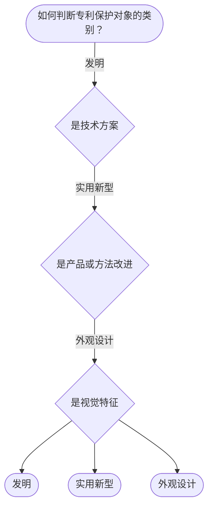

# 专家 B 教学草稿

> 专家：expert_b ｜ 风格：accessible

## 教学模块选择清单

- 当前教学节点：`patent-law-foundation`
- 板块预算：自适应 0/0，总计 9/9

| # | 模块 (block_type) | 类型 | 触发原因 (trigger) | 对应正文段 | 归属 |
|---:|---|:--:|---|---|:--:|
| 1 | `anchor_scenario` | 自适应 | perception=sensing(0.86) / cold_start | 场景导入｜在智能制造领域，一家智能机器人公司研发出新型AI关节控制系统，希望申请专利保护。但若在行业技… | [A] |
| 2 | `legal_anchor` | 必选 | mandatory | 法条锚定｜《专利法》第二条 | [B] |
| 3 | `worked_example` | 自适应 | cognition.apply=0.38 / cold_start | 案例演示｜某智能制造企业2024年3月在技术交流会上展示其新型AI设备，2024年10月申请专利。问：… | [A] |
| 4 | `decision_flow` | 自适应 | input=visual(0.82) | 决策流程｜如何判断专利保护对象的类别？ | [B] |
| 5 | `mnemonic` | 自适应 | remember=0.75>=0.6 & apply<0.4 / understanding=sequential(0.70) | 记忆口诀｜三客体记忆表：发明（技术方案）、实用新型（产品改进）、外观设计（视觉特征） | [A] |
| 6 | `reflect_prompt` | 自适应 | processing=reflective(0.67) | 反思提示｜在智能制造的研发过程中，如果同时有技术论文发表和专利申请，你会如何安排时间？ | [B] |
| 7 | `assessment` | 必选 | mandatory | 测评｜专利保护的三种客体 | [B] |
| 8 | `knowledge_synthesis` | 必选 | mandatory | 知识综合｜保护客体：发明、实用新型、外观设计 | [A] |
| 9 | `summary_card` | 自适应 | mandatory | 速查卡｜先过保护客体之门，再过三性安检。 | [B] |

## 教学正文

## 1. 场景导入
在智能制造领域，一家智能机器人公司研发出新型AI关节控制系统，希望申请专利保护。但若在行业技术交流会上展示该设备，可能会影响后续申请。试想：首先要保护什么类型的“东西”？其次，申请后能否获得授权？

## 2. 人话解释
专利制度如同法律保护伞，给发明人一定时间、地域内的独占权利，以换取技术公开。中国专利保护对象包括发明、实用新型和外观设计，制度体系以《专利法》为核心，发展特点是早期公开延迟审查、初步审查与实质审查并存。

## 3. 法条回扣
《专利法》第二条：授予专利权的发明和实用新型、外观设计，符合本法规定条件的，给予专利权。
《专利法》第二十二条：授予专利权的发明和实用新型应当具备新颖性、创造性和实用性。

## 4. 类比 / 口诀
类比：专利保护对象就像不同形状的护照——发明是技术方案护照，实用新型是产品改进护照，外观设计是视觉设计护照。口诀：三客体（发-实-新）、三性（新-创-实）、制度特点（早-审-并）。适用边界：仅适用于发明创造领域，不适用于纯商业信息。

## 5. 应试提示
题干关键词：保护客体、授权三性、制度体系特点。常见陷阱：混淆公开行为与新颖性，或把抵触申请当作现有技术。判断时先识别客体类型，再查法条三性要求。

## 6. 互动提问
在智能制造研发中，你会先关注保护客体还是授权三性？为什么？

### 场景导入（anchor_scenario）

> 在智能制造领域，一家智能机器人公司研发出新型AI关节控制系统，希望申请专利保护。但若在行业技术交流会上展示该设备，可能会影响后续申请。试想：首先要保护什么类型的“东西”？其次，申请后能否获得授权？

**锚定**：用智能制造研发情境锚定专利保护客体和授权实质条件两个抽象知识点。

**先想一想**：如果你是这个公司的专利代理人，看到‘行业展会展示’这个动作，第一反应是担心新颖性破坏还是其他？为什么？

### 法条锚定（legal_anchor）

- **《专利法》第二条**：专利权是授予发明和实用新型、外观设计的权利。
- **《专利法》第二十二条**：授予专利权的发明和实用新型应当具备新颖性、创造性和实用性。

**为何重要**：本节讲解专利法律制度基础，三种客体和授权三性是核心框架，必须回溯法条以确保准确。

### 案例演示（worked_example）

**案情/例题**：某智能制造企业2024年3月在技术交流会上展示其新型AI设备，2024年10月申请专利。问：是否破坏新颖性？
**适用规则**：《专利法》第二十四条（宽限期）
**分步推演**：
1. 展示日在申请日前，属于技术交流会情形 → *落入公开行为范围*
2. 申请日距展示日约7个月 >6个月 → *超出宽限期*
3. 因此可能破坏新颖性 → *需进一步审查*
**结论**：可能破坏新颖性，需结合具体事实判断。
**本题要点**：公开行为日期与宽限期是关键，先判范围再算时间。

### 决策流程（decision_flow）

**决策问题**：如何判断专利保护对象的类别？



### 记忆口诀（mnemonic）

**记忆锚**：三客体记忆表：发明（技术方案）、实用新型（产品改进）、外观设计（视觉特征）
**映射**：
- 发明
- 实用新型
- 外观设计
**何时用**：在判断专利保护客体时，遇到具体技术时先用三客体表区分。

### 反思提示（reflect_prompt）

**反思问题**：在智能制造的研发过程中，如果同时有技术论文发表和专利申请，你会如何安排时间？

**关注要点**：公开行为的类型和日期如何影响专利；如何平衡公开与保护的权衡

**连接**：连接到专利制度的作用与公开行为的影响

### 知识综合（knowledge_synthesis）

**知识框架**：
- 保护客体：发明、实用新型、外观设计
- 授权三性：新颖性、创造性、实用性
- 制度特点：早期公开、初步审查与实质审查并存
**概念关系**：三性判断顺序：先新颖性，再创造性，最后实用性
**必记**：三种客体缺一不可；三性缺一不可即不授权

### 速查卡（summary_card）

**要点卡**：
- **保护客体**：发明、实用新型、外观设计
- **授权三性**：新颖性、创造性、实用性
- **制度特点**：早期公开、初步与实质审查并存
**必背**：三客体缺一不可；三性缺一不可即不授权
**一句话总结**：先过保护客体之门，再过三性安检。

### 测评（assessment）

**三类覆盖**：backward_review、forward_probe、weakness_probe
**题目**：
- q1：专利保护的三种客体
- q2：授权实质条件顺序
- q3：公开行为对新颖性的影响
- q4：制度特点适用性


## 结构化字段

## knowledge_points

```json
[
  {
    "node_id": "patent-law-foundation",
    "kc_name": "专利制度的基本概念与特征：独占性、时间性、地域性（详见子节点 patent-rights-nature）"
  },
  {
    "node_id": "patent-law-foundation",
    "kc_name": "中国专利制度体系：专利法、专利法实施细则、专利审查指南（详见子节点 patent-law-framework）"
  },
  {
    "node_id": "patent-law-foundation",
    "kc_name": "专利保护的三种客体：发明、实用新型、外观设计（专利法第2条）"
  },
  {
    "node_id": "patent-law-foundation",
    "kc_name": "专利制度的作用：激励发明创造、促进技术公开、推动技术应用和经济发展（详见子节点 patent-system-overview）"
  },
  {
    "node_id": "patent-law-foundation",
    "kc_name": "中国专利制度发展历程与特点：早期公开延迟审查、初步审查制与实质审查制并存（详见子节点 patent-system-overview）"
  }
]
```

## legal_basis

```json
[
  {
    "article": "《专利法》第二条",
    "source": "中国专利法"
  },
  {
    "article": "《专利法》第二十二条",
    "source": "中国专利法"
  }
]
```

## risks

```json
[
  {
    "risk": "对专利授权实质条件的概念模糊",
    "related_node_id": "patentability-substantive"
  }
]
```

## draft_stage

```json
"debate"
```

## interactive_questions

```json
[
  {
    "qid": "q1",
    "category": "remember",
    "difficulty": "L1",
    "source_tag": "backward_review",
    "kc_node_id": "patent-law-foundation",
    "question": "专利保护的三种客体是什么？",
    "answer": "D",
    "options": [
      "A.发明",
      "B.实用新型",
      "C.外观设计",
      "D.以上三种"
    ]
  },
  {
    "qid": "q2",
    "category": "understand",
    "difficulty": "L1",
    "source_tag": "forward_probe",
    "kc_node_id": "patentability-substantive",
    "question": "专利授权实质条件中，先判断的是哪一项？",
    "answer": "A",
    "options": [
      "A.新颖性",
      "B.创造性",
      "C.实用性",
      "D.以上都是"
    ]
  },
  {
    "qid": "q3",
    "category": "apply",
    "difficulty": "L2",
    "source_tag": "weakness_probe",
    "kc_node_id": "patentability-substantive",
    "question": "某设备在申请前已公开，如何判断新颖性？",
    "answer": "B",
    "options": [
      "A.肯定授权",
      "B.可能不授权",
      "C.肯定不授权",
      "D.可能授权"
    ]
  },
  {
    "qid": "q4",
    "category": "evaluate",
    "difficulty": "L3",
    "source_tag": "weakness_probe",
    "kc_node_id": "patentability-substantive",
    "question": "中国专利制度的特点是实质审查，更适合哪类创新？",
    "answer": "B",
    "options": [
      "A.微小改进",
      "B.复杂技术",
      "C.视觉设计",
      "D.商业方法"
    ]
  }
]
```

## knowledge_synthesis

```json
{
  "node": "patent-law-foundation",
  "coverage": [
    {
      "node_id": "patent-rights-nature"
    },
    {
      "node_id": "patent-law-framework"
    },
    {
      "node_id": "patent-system-overview"
    }
  ],
  "confusable_pairs": [
    {
      "pair": "发明与实用新型"
    },
    {
      "pair": "公开行为与新颖性"
    }
  ]
}
```
