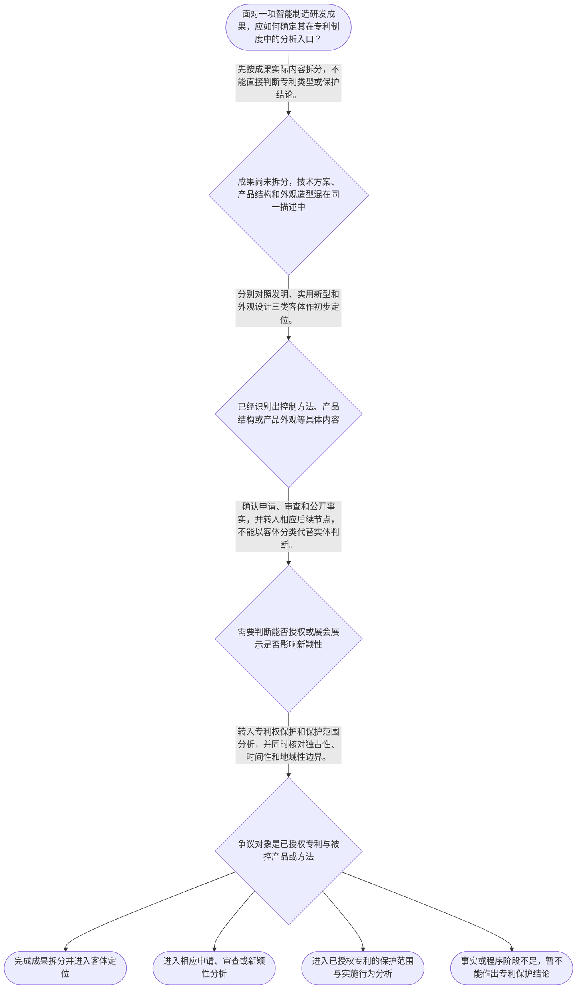

# 整合后的课程完整内容与习题

## 教学模块选择清单

- 当前教学节点：`patent-law-foundation`
- 板块预算：自适应 5/6，总计 9/9

| # | 模块 (block_type) | 类型 | 触发原因 (trigger) | 对应正文段 | 归属 |
|---:|---|:--:|---|---|:--:|
| 1 | `anchor_scenario` | 自适应 | perception=sensing(0.86) / cold_start | 智能制造检测装置的专利起点｜某智能制造企业完成了一套锂电池产线视觉检测装置：相机采集电芯图像，控制器依据缺陷位置向机械臂… | [A+B融合] |
| 2 | `legal_anchor` | 必选 | mandatory | 保护客体的法条入口｜《中华人民共和国专利法》第二条 | [A+B融合] |
| 3 | `worked_example` | 自适应 | cognition.apply=0.39<0.4 / cold_start | 视觉检测设备的成果分类演示｜教学拟制案例：某智能制造企业开发视觉检测设备，成果包括缺陷识别与分拣控制技术方案、设备机械结… | [A+B融合] |
| 4 | `decision_flow` | 自适应 | input=visual(0.82) | 专利制度基础分析流程｜面对一项智能制造研发成果，应如何确定其在专利制度中的分析入口？ | [A+B融合] |
| 5 | `mnemonic` | 自适应 | remember=0.75>=0.6 & apply<0.4 / understanding=sequential(0.70) | 专利基础四栏核对表｜“客—制—权—程”四栏核对表：先看客体，再看制度规范，再看权利边界，最后看程序位置。客体栏写… | [A+B融合] |
| 6 | `reflect_prompt` | 自适应 | processing=reflective(0.67) | 从研发成果回看制度入口｜回看你熟悉的一项智能制造研发成果：若其中同时含有控制方法、设备结构和外观造型，哪些事实必须先… | [A+B融合] |
| 7 | `assessment` | 必选 | mandatory | 本节测评索引｜复习发明、实用新型和外观设计三种专利保护客体。 | [A+B融合] |
| 8 | `knowledge_synthesis` | 必选 | mandatory | 专利法律制度基础关系网｜专利制度基本特征：专利权具有独占性、时间性和地域性，三者必须结合起来理解。 | [A+B融合] |
| 9 | `summary_card` | 自适应 | len(knowledge_sub_nodes)=3>=3 | 专利制度基础速查卡｜专利法律制度基础的核心是：先定成果客体与规范体系，再在权利边界和程序位置中分析具体问题。 | [A+B融合] |

## 教学正文

# 专利法律制度基础：从智能制造成果出发建立判断坐标

## 一、先看一个智能制造项目

某智能制造企业完成了一套锂电池产线视觉检测装置：相机采集电芯图像，控制器依据缺陷位置向机械臂发送分拣指令，设备外壳还采用了新的造型。项目经理认为“专利可以独占”，希望立即禁止竞争对手模仿；研发工程师则认为“技术先进”就当然能够获得专利。团队还计划在技术交流会上展示设备，但没有先区分展示了哪些技术内容、展示对象是否能够接触这些内容。

本轮没有检索到具名企业、裁判文书或可核验的真实案例，因此上述情境是教学拟制场景，不能当作真实案例引用。它用于训练一个基础顺序：**成果拆分—客体定位—规范定位—程序定位**。

| 分析步骤 | 要回答的问题 | 智能制造中的例子 |
|---|---|---|
| 成果拆分 | 研发成果具体包含什么 | 控制技术方案、设备机械结构、产品外观 |
| 客体定位 | 属于哪类专利保护客体 | 发明、实用新型、外观设计 |
| 规范定位 | 应查哪些规范材料 | 专利法、专利法实施细则、专利审查指南 |
| 程序定位 | 当前处在哪个阶段 | 申请、审查、授权后的权利保护 |

## 二、专利保护的三种客体

教学上下文明确将发明、实用新型、外观设计列为专利保护的三种客体。专家B草稿进一步提供了第二条的定义性内容，但本轮没有直接检索原文，以下按该草稿所引内容作保守教学概括：发明通常围绕产品、方法或其改进提出新的技术方案；实用新型围绕产品的形状、构造或其结合提出适于实用的新的技术方案；外观设计围绕产品的形状、图案或其结合，以及色彩与形状、图案的结合形成新的设计，并具有相应的外观和工业应用属性。

“发、用、外”可以帮助记住三类名称，但口诀不替代法条定义。面对一套智能制造设备，应把缺陷识别和分拣控制、设备结构、外壳造型分别记录，再逐项对照法定客体。不能因为产品名称中有“智能”，就断定整套成果只能申请发明；也不能因为成果具有商业价值，就跳过客体定位和后续审查。

客体定位只是进入专利分析的入口，并不等于已经满足授权条件。关于新颖性、创造性、实用性以及不授予专利权的具体情形，应在有相应法条和审查材料的后续节点中展开；本节不把客体分类直接当作授权结论。

## 三、中国专利制度的规范体系与制度作用

当前节点要求掌握的中国专利制度体系包括专利法、专利法实施细则和专利审查指南。可以作如下层次理解：专利法提供基本制度和权利基础；实施细则承接具体制度运行和程序要求；审查指南为审查适用提供进一步的解释和操作指引。实际办案或答题时，应根据争点回到具体法条、实施细则和审查指南，不能只凭概念印象下结论。

专利制度具有多重作用：激励发明创造、促进技术公开、推动技术应用和经济发展。这里要注意，制度作用是解释制度为什么存在，不能替代对具体客体、授权条件、权利范围或侵权要件的判断。技术公开与权利保护之间存在制度联系，但“公开”本身不自动等于获得专利权，也不自动等于可以主张侵权。

## 四、专利权的三个基础特征

专利权的基础特征可概括为独占性、时间性和地域性。

- **独占性**：权利人在法定权利范围内具有排他性利益，但不能据此主张对一切相近技术或一切行为无限控制。
- **时间性**：专利权的效力受法定期限约束，不是永久权利。
- **地域性**：专利权原则上依特定法域的法律和授权范围发生效力，不当然覆盖全球。

因此，“专利可以独占”必须完整理解为：在特定法域、特定期限和具体授权权利范围内，权利人享有相应的排他性权利。尚未确认授权文件和保护范围时，不能直接从研发成果或申请行为推出侵权结论。

## 五、中国专利制度的发展与程序位置

当前教学上下文提示，中国专利制度具有早期公开、延迟审查，以及初步审查制与实质审查制并存等特点。学习这一点的重点不是背诵孤立术语，而是形成程序阶段意识：同一个智能制造项目，在准备申请时主要需要完成成果拆分和客体定位；进入审查时需要依据相应规范判断申请是否满足要求；只有在存在具体授权专利及被控实施行为时，才进入授权后的权利保护和侵权分析。

早期公开、延迟审查、初步审查和实质审查分别涉及不同的程序位置，不能把申请公开等同于授权，也不能把申请阶段的技术描述等同于已经确定的专利权保护范围。关于新颖性判断，应转入现有技术、公开时间和法定例外等后续节点；关于侵权判定，应转入具体保护范围和实施行为等后续节点。

## 六、把规则用于拟制案例

回到视觉检测装置：第一步，将缺陷识别和分拣控制的技术内容、设备的机械结构、外壳造型分别列出；第二步，将它们分别放入发明、实用新型、外观设计的法定客体框架中初步定位；第三步，查找专利法、实施细则和审查指南中与具体问题有关的规则；第四步，确认项目处于准备申请、审查，还是已经存在授权专利和被控实施行为的阶段。

如果技术交流会只展示了外观，还是展示了控制方法、结构细节和完整运行过程，可能涉及的后续问题并不相同。展示行为是否影响新颖性，需要结合公开的具体内容、公开对象、公开范围、时间以及可能适用的法定例外判断；它首先是后续新颖性分析中的事实问题，并不直接改变成果属于何种专利客体。由于本轮没有检索到相关法条原文和具体事实材料，本节不对展会公开作出确定的新颖性结论。

## 七、常见误区与结论

**误区一：“技术先进”就当然能获得专利。**正解推理是：先识别成果内容，再对照三类法定客体，之后才进入授权条件和程序审查。区分判据是题目问的是“属于什么客体”，还是“是否满足授权条件”。

**误区二：“独占性”就是永久、全球、无边界控制。**正解推理是：独占性必须与时间性、地域性及具体授权权利范围一起理解。区分判据是是否同时核对法域、期限和权利文件。

**误区三：申请中的技术与已授权专利侵权是同一个问题。**正解推理是：前者处于申请和审查链条，后者以具体授权权利、保护范围和被控实施行为为分析基础。区分判据是争议对象是否已经存在具体授权专利以及被控实施事实。

**误区四：产品名称可以直接决定专利类型。**正解推理是：应拆分技术方案、产品结构和产品外观，再逐项对照法定定义。区分判据是技术内容的实际表现形式，而不是“智能”“自动化”等宣传名称。

本节的结论是：学习新颖性判断和侵权判定前，应先建立专利法律制度基础，完成“成果拆分—客体定位—规范定位—程序定位”，并始终同时检查独占性、时间性和地域性。新颖性的现有技术和公开时间、侵权中的保护范围和实施行为，留待后续节点依据具体检索材料分析。

本节设有测评，请到【习题】区作答。

### 智能制造检测装置的专利起点（anchor_scenario）

> 某智能制造企业完成了一套锂电池产线视觉检测装置：相机采集电芯图像，控制器依据缺陷位置向机械臂发送分拣指令，设备外壳还采用了新的造型。项目经理认为“专利可以独占”，希望立即禁止竞争对手模仿；研发工程师则认为“技术先进”就当然能够获得专利。团队需要先判断成果构成、专利客体和所处程序阶段。本情境为教学拟制场景，非检索到的真实案例。

**锚定**：用智能制造项目锚定成果拆分、三类专利保护客体、专利权三项边界和程序位置。

**先想一想**：面对同一套视觉检测装置，为什么要先区分技术方案、产品结构和产品外观，再讨论能否获得或行使专利权？

### 保护客体的法条入口（legal_anchor）

- **《中华人民共和国专利法》第二条**：专利法第二条提供三类保护客体的分类入口：发明、实用新型和外观设计；智能制造成果应先按实际内容分别定位。

**为何重要**：客体定位是进入申请、审查和后续权利保护分析的入口，但不等于已经满足授权条件或能够直接认定侵权。本轮没有检索到法条原文，具体适用应以现行法条核验。

### 视觉检测设备的成果分类演示（worked_example）

**案情/例题**：教学拟制案例：某智能制造企业开发视觉检测设备，成果包括缺陷识别与分拣控制技术方案、设备机械结构和外壳造型。团队拟以“一项专利”覆盖全部成果，并计划在技术交流会上展示。需要先完成何种基础分析？展示行为又应留待哪个后续问题判断？
**适用规则**：《中华人民共和国专利法》第二条关于发明、实用新型、外观设计三类客体的规定；其他授权条件和公开行为规则须在后续节点依据正式法条核验。
**分步推演**：
1. 先把成果拆分为控制技术方案、产品结构和产品外观，不能仅以“智能检测设备”这一名称作为法律分类依据。 → *先拆分成果，避免名称替代客体判断。*
2. 将拆分后的内容分别放入发明、实用新型和外观设计的法定客体框架中初步定位；初步定位不等于已经授权。 → *再做三类客体定位。*
3. 技术交流会展示是否影响新颖性，取决于展示内容、公开对象、公开范围、时间以及可能适用的法定例外，不能仅凭“参加展会”四字作绝对结论。 → *公开风险须留待新颖性节点结合事实判断。*
4. 如果尚未授权，重点是申请和审查入口；如果已存在具体授权专利及被控实施行为，才转入权利保护和侵权分析。 → *最后确认程序阶段和问题类型。*
**结论**：该项目不应笼统称为“一个专利”。应先分别分析技术方案、设备结构和外观造型的客体定位；展会展示仅提示后续新颖性风险，不能在本节直接作出新颖性结论。
**本题要点**：智能制造项目先做“成果拆分—客体定位—程序定位”，再分别进入授权条件、新颖性或侵权的具体判断。

### 专利制度基础分析流程（decision_flow）

**决策问题**：面对一项智能制造研发成果，应如何确定其在专利制度中的分析入口？



### 专利基础四栏核对表（mnemonic）

**记忆锚**：“客—制—权—程”四栏核对表：先看客体，再看制度规范，再看权利边界，最后看程序位置。客体栏写发明、实用新型、外观设计；制度栏写专利法、实施细则、审查指南；权利栏核对独占性、时间性、地域性；程序栏标记申请、审查或授权后保护。
**映射**：
- 客
- 制
- 权
- 程
**何时用**：看到“能否申请”“能否禁止他人使用”或“应适用什么规则”时，先按客、制、权、程四栏逐项填写；口诀只帮助定位，不替代法条核验。

### 从研发成果回看制度入口（reflect_prompt）

**反思问题**：回看你熟悉的一项智能制造研发成果：若其中同时含有控制方法、设备结构和外观造型，哪些事实必须先记录，才能避免把技术成果、专利类型和专利权范围混为一谈？

**关注要点**：是否区分了技术方案、产品结构和产品外观，而不是只写产品名称。；是否明确讨论的是拟申请成果、审查中的申请，还是已授权专利权。；是否同时检查独占性、时间性和地域性，而没有把独占性理解为永久、全球和无边界控制。；若存在展会或技术交流展示，是否记录展示内容、对象、范围和日期，而不是直接断言影响或不影响新颖性。

**连接**：连接学习者已有的研发项目经验：像拆分系统模块和技术接口一样，先拆分专利事实，再确认每项事实在制度链条中的位置。

### 专利法律制度基础关系网（knowledge_synthesis）

**知识框架**：
- 专利制度基本特征：专利权具有独占性、时间性和地域性，三者必须结合起来理解。
- 中国专利制度体系：专利法提供基本制度和权利基础，实施细则与审查指南共同支撑具体适用。
- 专利保护客体：发明、实用新型和外观设计是当前节点的法定分类入口。
- 专利制度作用：通过激励发明创造、促进技术公开、推动技术应用和经济发展形成制度价值。
- 制度发展与程序特点：当前上下文提示早期公开、延迟审查，以及初步审查制与实质审查制并存。
**概念关系**：先拆分成果并定位客体，再查找规范并确认程序阶段。；制度功能解释公开与激励的关系，但不能替代授权条件或侵权构成判断。；客体定位是后续新颖性和侵权分析的入口，而不是后续实体结论。
**必记**：《专利法》第二条是本节三种专利保护客体的法条锚点。；客体定位不等于授权结论；新颖性、创造性、实用性和不授予专利权的具体问题须另行核对规则。；独占性必须与时间性、地域性和具体权利范围一起理解。；申请、审查和授权后的权利保护是不同程序位置。

### 专利制度基础速查卡（summary_card）

**要点卡**：
- **三种保护客体**：先把成果放入发明、实用新型、外观设计的法定分类框架。
- **制度规范体系**：专利法、专利法实施细则和专利审查指南共同构成主要规则材料。
- **权利三项边界**：独占性必须与时间性、地域性及具体权利范围共同理解。
- **制度作用**：专利制度旨在激励发明创造、促进技术公开并推动技术应用和经济发展。
- **程序位置**：申请、审查和授权后的权利保护相互衔接但不能混为一谈。
**必背**：《专利法》第二条是本节三种保护客体的法条锚点。；先做成果拆分和客体定位，再进入授权条件、新颖性或侵权的具体分析。；独占性、时间性、地域性应当同时作为专利权边界理解。；本轮没有真实案例检索材料，教学情境不得当作真实判例或企业实务记录。
**一句话总结**：专利法律制度基础的核心是：先定成果客体与规范体系，再在权利边界和程序位置中分析具体问题。

### 本节测评索引（assessment）

**三类覆盖**：backward_review、forward_probe、weakness_probe
**题目**：
- q-backward-foundation-l1：复习发明、实用新型和外观设计三种专利保护客体。
- q-forward-protection-l1：仅探测授权后发明和实用新型专利权保护中的未经许可实施规则。
- q-weakness-foundation-l3：辨析中国专利制度的早期公开、延迟审查及两类审查制度特点。


## 结构化数据

## expert

```json
"A+B融合"
```

## style

```json
"fused"
```

## knowledge_points

```json
[
  {
    "node_id": "patent-law-foundation",
    "kc_name": "专利制度的基本概念与特征：独占性、时间性、地域性"
  },
  {
    "node_id": "patent-law-foundation",
    "kc_name": "中国专利制度体系：专利法、专利法实施细则、专利审查指南"
  },
  {
    "node_id": "patent-law-foundation",
    "kc_name": "专利保护的三种客体：发明、实用新型、外观设计"
  },
  {
    "node_id": "patent-law-foundation",
    "kc_name": "专利制度的作用：激励发明创造、促进技术公开、推动技术应用和经济发展"
  },
  {
    "node_id": "patent-law-foundation",
    "kc_name": "中国专利制度发展历程与特点：早期公开延迟审查、初步审查制与实质审查制并存"
  }
]
```

## legal_basis

```json
[
  {
    "article": "《中华人民共和国专利法》第二条",
    "source": "教学上下文：专利保护的三种客体为发明、实用新型、外观设计；专家B草稿提供第二条定义"
  },
  {
    "article": "专利制度的基本概念与特征：独占性、时间性、地域性",
    "source": "教学上下文：当前节点知识点"
  },
  {
    "article": "中国专利制度体系：专利法、专利法实施细则、专利审查指南",
    "source": "教学上下文：当前节点知识点"
  },
  {
    "article": "专利制度的作用：激励发明创造、促进技术公开、推动技术应用和经济发展",
    "source": "教学上下文：当前节点知识点"
  },
  {
    "article": "中国专利制度发展历程与特点：早期公开延迟审查、初步审查制与实质审查制并存",
    "source": "教学上下文：当前节点知识点"
  },
  {
    "article": "《中华人民共和国专利法》第二十二条",
    "source": "专家B草稿提供；本轮检索上下文未提供条文原文，具体适用须以现行法条核验"
  },
  {
    "article": "《中华人民共和国专利法》第四条、第五条",
    "source": "专家B草稿提供；本轮检索上下文未提供条文原文，具体适用须以现行法条核验"
  }
]
```

## risks

```json
[
  {
    "risk": "本轮检索上下文为空，未提供法条原文、审查指南、裁判文书或真实案例；涉及第二条定义及其他条款的内容应以现行法律和正式材料复核。",
    "related_node_id": "patent-law-foundation"
  },
  {
    "risk": "用户要求真实案例，但当前只能提供明确标注为教学拟制的智能制造情境，不能将其表述为具名真实案件。",
    "related_node_id": "patent-law-foundation"
  },
  {
    "risk": "新颖性与侵权判定属于后续节点；本节仅建立制度入口，不据此作出具体新颖性或侵权结论。",
    "related_node_id": "patent-law-foundation"
  },
  {
    "risk": "三类专利客体、授权条件和权利保护范围容易混淆，应在后续节点分别核对法条与事实。",
    "related_node_id": "patent-law-foundation"
  }
]
```

## draft_stage

```json
"integration"
```

## irac

```json
{
  "issue": "在智能制造研发项目中，面对同时包含控制技术、机械结构和外观造型的成果，进入新颖性判断或侵权判定前，应如何建立专利法律制度基础分析框架？",
  "rule": "教学上下文明确列示专利保护的三种客体为发明、实用新型和外观设计；当前节点还要求掌握专利权的独占性、时间性、地域性，专利法、专利法实施细则和专利审查指南构成制度规范体系，并理解专利制度的作用及其程序特点。本轮检索上下文为空，未对未提供原文的条款作确定性扩展。",
  "application": "应先将控制技术方案、产品结构和外观造型拆分，再按发明、实用新型和外观设计进行初步客体定位；随后确认所适用的规范材料和程序阶段。不能以技术先进或产品名称直接推出授权结论，也不能把独占性理解为永久、全球和无边界控制。",
  "conclusion": "专利新颖性判断和侵权判定均以前置制度基础为条件。当前节点的结论限于建立客体、规范体系、制度作用、权利边界和程序位置的共同坐标，不替代后续节点的实体判断。"
}
```

## interactive_questions

```json
[
  {
    "qid": "q-backward-foundation-l1",
    "category": "understand",
    "difficulty": "L1",
    "source_tag": "backward_review",
    "kc_node_id": "patent-law-foundation",
    "question": "关于中国专利保护客体的表述，哪一项正确？",
    "answer": "C",
    "options": [
      "A. 专利保护客体仅包括发明和实用新型",
      "B. 专利保护客体仅包括发明和外观设计",
      "C. 专利保护客体包括发明、实用新型和外观设计",
      "D. 所有研发成果均当然属于同一种专利保护客体"
    ]
  },
  {
    "qid": "q-forward-protection-l1",
    "category": "remember",
    "difficulty": "L1",
    "source_tag": "forward_probe",
    "kc_node_id": "patent-rights-protection",
    "question": "仅根据下一节点提供的知识点，关于发明和实用新型专利权保护的一项规则，哪一项正确？",
    "answer": "B",
    "options": [
      "A. 未经许可实施任何技术方案均当然构成专利侵权",
      "B. 发明和实用新型专利授权后，未经许可不得为生产经营目的实施其专利",
      "C. 专利申请公开后即当然可以排除任何他人使用相关技术",
      "D. 外观设计的保护范围一律以文字权利要求为准"
    ]
  },
  {
    "qid": "q-weakness-foundation-l3",
    "category": "analyze",
    "difficulty": "L3",
    "source_tag": "weakness_probe",
    "kc_node_id": "patent-law-foundation",
    "question": "关于中国专利制度的程序特点，下列哪一项最恰当？",
    "answer": "D",
    "options": [
      "A. 早期公开意味着申请公开后立即当然取得完整专利权",
      "B. 延迟审查意味着所有专利申请均不需要经过审查",
      "C. 初步审查制与实质审查制并存意味着同一申请必须同时接受两种完全相同的审查",
      "D. 早期公开、延迟审查，以及初步审查制与实质审查制并存，属于当前节点提示的中国专利制度程序特点"
    ]
  }
]
```

## knowledge_synthesis

```json
{
  "node": "patent-law-foundation",
  "coverage": [
    {
      "node_id": "patent-law-foundation"
    },
    {
      "node_id": "patent-law-foundation"
    },
    {
      "node_id": "patent-law-foundation"
    },
    {
      "node_id": "patent-law-foundation"
    },
    {
      "node_id": "patent-law-foundation"
    }
  ],
  "confusable_pairs": [
    {
      "pair": "专利保护客体分类与具体授权条件：前者回答成果按何种法定类型定位，后者回答是否满足后续授权门槛。"
    },
    {
      "pair": "独占性与无限控制：独占性必须与时间性、地域性及具体保护范围一并理解。"
    },
    {
      "pair": "拟申请成果与已授权专利侵权分析：前者处于申请和审查入口，后者以具体授权权利及被控实施行为为基础。"
    },
    {
      "pair": "教学拟制场景与真实案例：没有检索来源时，拟制情境只能用于教学，不能当作真实判例或企业事实。"
    }
  ]
}
```
