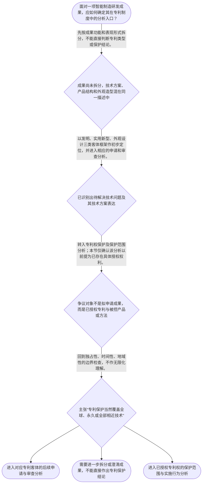

# 专家 A 教学草稿

> 专家：expert_a ｜ 风格：conservative

## 教学模块选择清单

- 当前教学节点：`patent-law-foundation`
- 板块预算：自适应 6/6，总计 9/9

| # | 模块 (block_type) | 类型 | 触发原因 (trigger) | 对应正文段 | 归属 |
|---:|---|:--:|---|---|:--:|
| 1 | `anchor_scenario` | 自适应 | perception=sensing(0.86) / cold_start | 智能制造检测装置的专利起点｜某智能制造企业的研发团队完成了一套用于锂电池产线的视觉检测装置：相机采集电芯图像，控制器依据… | [A] |
| 2 | `legal_anchor` | 必选 | mandatory | 保护客体的法条入口｜《中华人民共和国专利法》第二条 | [A] |
| 3 | `worked_example` | 自适应 | cognition.apply=0.39<0.4 / cold_start | 视觉检测设备的成果分类演示｜教学化案例：某工厂开发了视觉检测设备，其成果包括：用于缺陷识别与分拣控制的技术方案、检测设备… | [A] |
| 4 | `decision_flow` | 自适应 | input=visual(0.82) | 专利制度基础分析流程｜面对一项智能制造研发成果，应如何确定其在专利制度中的分析入口？ | [A] |
| 5 | `mnemonic` | 自适应 | remember=0.75>=0.6 & apply<0.4 / understanding=sequential(0.70) | 基础定位核对表｜“客—制—权—程”基础核对表：先看客体，再看制度规范，再看权利边界，最后看程序位置。 | [A] |
| 6 | `reflect_prompt` | 自适应 | processing=reflective(0.67) | 从研发成果回看制度入口｜回看你熟悉的一项智能制造研发成果：若其中同时含有控制方法、设备结构和外观造型，哪些事实必须先… | [A] |
| 7 | `assessment` | 必选 | mandatory | 本节测评索引｜复习三种专利保护客体的法定分类。 | [A] |
| 8 | `knowledge_synthesis` | 必选 | mandatory | 专利法律制度基础关系网｜专利制度的基本概念与特征：专利权具有独占性、时间性、地域性，分析时必须同时看到权利与边界。 | [A] |
| 9 | `summary_card` | 自适应 | len(knowledge_sub_nodes)=3>=3 | 专利制度基础速查卡｜专利法律制度基础的核心是：先定客体与规范体系，再在权利边界和程序位置中分析具体问题。 | [A] |

## 教学正文

## I — 法律问题

面对智能制造中的复合研发成果，例如同时包含视觉识别控制技术、设备机械结构和外观造型的检测设备，在讨论“是否具有新颖性”或“是否构成侵权”之前，应当先回答：该成果在中国专利制度中应如何定位，适用哪些规范层次，以及专利权的效力边界为何。

本节先给出明确结论：**不要把“技术先进”“产品智能”或“有商业价值”直接等同于“当然有专利”或“当然可以排除他人”。**应先完成成果拆分、客体定位、规范定位和程序定位。

## R — 适用规则

### 1. 三种专利保护客体

教学上下文明确指出，《中华人民共和国专利法》第二条对应的三种专利保护客体是：**发明、实用新型、外观设计**。〔RAG: 检索上下文未提供直接依据；本句依据教学上下文所列“专利保护的三种客体：发明、实用新型、外观设计（专利法第2条）”〕

因此，分析一项智能制造成果时，第一步不是笼统地问“有没有专利”，而是把成果中的不同内容分别识别为技术方案、产品结构或产品外观，并放入上述法定分类框架中初步定位。具体类型的申请条件、审查标准及权利范围，须在相应后续节点中继续判断。

### 2. 中国专利制度的规范体系

当前节点要求掌握的制度体系包括专利法、专利法实施细则和专利审查指南。它们共同构成识别专利法律问题的规范框架：专利法提供基本制度和权利基础，实施细则与审查指南服务于具体程序和审查适用。〔RAG: 检索上下文未提供直接依据；本句依据教学上下文所列“中国专利制度体系：专利法、专利法实施细则、专利审查指南”〕

本轮检索上下文为空，未提供上述规范的原文或具体条款；因此，本节不对未提供的条文内容作细节性转述。

### 3. 专利权的基础特征与制度作用

专利制度中的专利权具有独占性、时间性、地域性。理解时必须把三者放在一起：独占性说明权利具有排他效果；时间性提示这种效果受法定期限约束；地域性提示权利效力不当然跨越不同法域。〔RAG: 检索上下文未提供直接依据；本句依据教学上下文所列“专利制度的基本概念与特征：独占性、时间性、地域性”〕

专利制度还承担激励发明创造、促进技术公开、推动技术应用和经济发展的作用。该制度功能解释了为何技术成果需要通过法定程序进入公开、审查和授权的制度轨道，但不能替代对具体授权条件或侵权要件的判断。〔RAG: 检索上下文未提供直接依据；本句依据教学上下文所列“专利制度的作用”〕

### 4. 程序位置

当前节点提示中国专利制度具有早期公开延迟审查、初步审查制与实质审查制并存等特点。基础阶段应先识别问题处于申请、审查还是授权后的保护阶段；不能把申请阶段的客体与授权后的权利范围、侵权责任混为一谈。〔RAG: 检索上下文未提供直接依据；本句依据教学上下文所列“中国专利制度发展历程与特点”〕

## A — 规则适用

以智能制造视觉检测设备为例，可以沿以下顺序分析：

1. **拆分成果。**将缺陷识别与分拣控制的技术内容、可改进的设备结构、以及设备外壳的造型分别记录。产品名称本身不能代替法律分类。
2. **定位客体。**依据《专利法》第二条所列三种客体，在发明、实用新型、外观设计框架中对不同成果作初步定位。〔RAG: 检索上下文未提供直接依据；本句依据教学上下文所列“专利法第2条”及三种客体〕
3. **检查权利边界。**即使后续取得授权，也不能仅以“独占”得出永久、全球或覆盖一切相近技术的结论；时间性、地域性以及后续确定的具体权利范围均会限制权利效果。
4. **确认程序阶段。**若企业尚在准备申请，重点是成果和客体的定位；若已出现他人实施行为，则需以具体授权专利和保护范围为基础，转入专利权保护节点；若争点是技术是否已被公开，则应转入新颖性节点。

这一顺序的价值在于防止两个常见跳步：一是尚未识别客体就直接讨论新颖性；二是尚未确认具体授权权利就直接断言侵权。

## C — 结论

专利新颖性判断和侵权判定都不是脱离制度基础的孤立问题。智能制造项目应先完成“**成果拆分—客体定位—规范定位—程序定位**”：确认成果在发明、实用新型、外观设计框架中的位置，理解专利法、实施细则和审查指南的规范体系，同时以独占性、时间性、地域性把握权利边界。

本节只建立专利法律制度基础。新颖性的现有技术、公开时间与具体判断，以及侵权中的保护范围与实施行为，均应在后续对应节点中依据补充检索材料和具体事实展开。

> 常见误区 / 易混淆点
>
> - **误区一：**“技术先进”就等于当然能够获得专利。纠正：首先须完成法定客体定位；后续是否授权还要进入相应审查与实体条件分析。
> - **误区二：**“独占性”意味着永久、全球、无边界的控制。纠正：独占性必须与时间性、地域性以及具体权利范围一并理解。
> - **误区三：**把拟申请技术能否获得专利，与已授权专利是否被侵害混为同一问题。纠正：前者处于申请与审查链条，后者以具体授权权利为前提。
> - **误区四：**将本节的客体分类直接当作新颖性或侵权结论。纠正：本节提供的是后续判断的制度入口，不替代后续节点的实体审查。

本节设有测评，请到【习题】区作答。

### 智能制造检测装置的专利起点（anchor_scenario）

> 某智能制造企业的研发团队完成了一套用于锂电池产线的视觉检测装置：相机采集电芯图像，控制器依据缺陷位置向机械臂发送分拣指令。团队准备把设备投放工厂，同时想知道哪些技术成果可通过专利制度保护。

项目经理听说“专利可以独占”，便要求立刻禁止竞争对手模仿；研发工程师则认为只要技术先进就当然能获得专利。二人的分歧说明：在讨论新颖性或侵权之前，必须先定位专利制度保护的对象、法律体系和制度边界。本情境为教学化改编，并非检索到的真实案例。

**锚定**：该情境锚定专利制度的保护客体、权利特征与制度功能，建立后续新颖性和侵权学习所需的基础坐标。

**先想一想**：面对同一套视觉检测装置，为什么要先区分它属于何种专利客体，再讨论是否能获得或行使专利权？

### 保护客体的法条入口（legal_anchor）

- **《中华人民共和国专利法》第二条**：专利法第二条在本节提供三类保护客体的法定分类入口：发明、实用新型和外观设计；技术方案首先要在该分类框架中定位。

**为何重要**：后续的新颖性判断须以具体申请客体为对象，侵权判定也以已获授权的具体专利类型及其保护范围为前提。本轮检索上下文未提供法条原文，因此本节仅以教学上下文明确给出的条号和分类信息作为可核验依据，不扩展转述未提供的条文细节。

### 视觉检测设备的成果分类演示（worked_example）

**案情/例题**：教学化案例：某工厂开发了视觉检测设备，其成果包括：用于缺陷识别与分拣控制的技术方案、检测设备中可改进的机械结构，以及设备外壳的视觉造型。项目经理拟以“一项专利”覆盖全部成果。需要先完成何种基础分类，才能进入后续申请、授权条件和权利保护讨论？
**适用规则**：《中华人民共和国专利法》第二条；教学上下文明确列示发明、实用新型、外观设计三种专利保护客体。
**分步推演**：
1. 先把项目成果拆分为技术方案、产品结构和产品外观三个层次，而非仅以“设备名称”作为法律分类依据。 → *先拆成果，避免以产品名称替代法律客体。*
2. 教学上下文将中国专利保护客体列为发明、实用新型和外观设计，故应将拆分后的成果放入这三类法定客体框架中初步定位。 → *客体分类是专利分析的第一步。*
3. 专利制度还具有独占性、时间性和地域性等特征；因此，即使后续取得授权，保护也不是对所有技术成果、所有时间和所有地域的无限控制。 → *权利特征限定保护的边界。*
4. 完成客体定位后，才可沿申请、审查、授权和保护的制度链条继续分析；本节不提前替代新颖性或侵权节点作出实体结论。 → *基础分类为后续具体判断提供入口。*
**结论**：该项目不应把整套技术成果笼统称为“一个专利”。应先围绕不同成果分别判断其是否适合按发明、实用新型或外观设计进行布局；获得何种专利权及其具体保护范围，仍取决于后续申请、审查和授权文件。
**本题要点**：智能制造项目的专利分析先做“成果拆分—客体定位—制度边界”三步，再进入新颖性和侵权的具体判断。

### 专利制度基础分析流程（decision_flow）

**决策问题**：面对一项智能制造研发成果，应如何确定其在专利制度中的分析入口？



### 基础定位核对表（mnemonic）

**记忆锚**：“客—制—权—程”基础核对表：先看客体，再看制度规范，再看权利边界，最后看程序位置。
**映射**：
- 客
- 制
- 权
- 程
**何时用**：看到智能制造项目的“能否申请”“能否禁止他人使用”或“应适用什么规则”时，先按该表逐项定位。

### 从研发成果回看制度入口（reflect_prompt）

**反思问题**：回看你熟悉的一项智能制造研发成果：若其中同时含有控制方法、设备结构和外观造型，哪些事实必须先记录，才能避免把“技术成果”“专利类型”和“专利权范围”混为一谈？

**关注要点**：是否已区分技术方案、产品结构和产品外观，而不是只写产品名称。；是否明确讨论的是拟申请成果，还是已授权专利权。；是否把独占性误解为永久、全球或不受保护范围限制的控制。

**连接**：连接学习者已有的研发经验：先拆分系统模块和技术接口，再确认每一模块在专利制度中的分析位置。

### 专利法律制度基础关系网（knowledge_synthesis）

**知识框架**：
- 专利制度的基本概念与特征：专利权具有独占性、时间性、地域性，分析时必须同时看到权利与边界。
- 中国专利制度体系：以专利法为基础，并与专利法实施细则、专利审查指南共同构成规则适用的规范体系。
- 专利保护客体：教学上下文明确列示发明、实用新型、外观设计三类，客体定位是后续分析入口。
- 专利制度作用：通过激励发明创造、促进技术公开、推动技术应用和经济发展，形成公开与激励的制度机制。
- 制度程序特点：教学上下文提示早期公开延迟审查，以及初步审查制与实质审查制并存；具体程序细节应在后续程序节点依据相应材料学习。
**概念关系**：客体定位在先，申请、审查和授权条件分析在后；不应跳过客体直接讨论新颖性或侵权。；专利制度的功能解释为何鼓励公开，但不替代具体授权条件或侵权构成要件。；独占性、时间性、地域性共同限制权利效果；具体保护范围仍须转入专利权保护节点分析。
**必记**：本节的法定客体锚点是《专利法》第二条所列发明、实用新型、外观设计。；专利权不是无限权利：分析时应同时检查独占性、时间性和地域性的边界。；新颖性与侵权属于后续具体节点；本节先建立客体、规范体系、制度功能和程序位置的共同语言。

### 专利制度基础速查卡（summary_card）

**要点卡**：
- **三种保护客体**：以发明、实用新型、外观设计作为专利成果分类的法定入口。
- **制度规范体系**：专利法、专利法实施细则和专利审查指南共同构成制度规则框架。
- **权利三项边界**：独占性并不排除时间性和地域性限制，权利不可作无限化理解。
- **制度功能**：专利制度以激励创造、技术公开和技术应用为核心制度作用。
- **程序位置**：早期公开、延迟审查以及初步审查与实质审查并存，提示程序阶段需要分别识别。
**必背**：《专利法》第二条是本节三种保护客体的法条锚点。；先做成果拆分和客体定位，再进入申请、审查、授权条件或权利保护的具体分析。；独占性、时间性、地域性应当同时作为专利权边界理解。
**一句话总结**：专利法律制度基础的核心是：先定客体与规范体系，再在权利边界和程序位置中分析具体问题。

### 本节测评索引（assessment）

**三类覆盖**：backward_review、forward_probe、weakness_probe
**题目**：
- q-backward-foundation-l1：复习三种专利保护客体的法定分类。
- q-forward-protection-l1：仅探测专利权保护节点中的未经许可实施规则。
- q-weakness-foundation-l3：在智能制造项目中综合识别客体分类、权利边界和制度阶段。


## 结构化字段

## knowledge_points

```json
[
  {
    "node_id": "patent-law-foundation",
    "kc_name": "专利制度的基本概念与特征：独占性、时间性、地域性"
  },
  {
    "node_id": "patent-law-foundation",
    "kc_name": "中国专利制度体系：专利法、专利法实施细则、专利审查指南"
  },
  {
    "node_id": "patent-law-foundation",
    "kc_name": "专利保护的三种客体：发明、实用新型、外观设计"
  },
  {
    "node_id": "patent-law-foundation",
    "kc_name": "专利制度的作用：激励发明创造、促进技术公开、推动技术应用和经济发展"
  },
  {
    "node_id": "patent-law-foundation",
    "kc_name": "中国专利制度发展历程与特点：早期公开延迟审查、初步审查制与实质审查制并存"
  }
]
```

## legal_basis

```json
[
  {
    "article": "《中华人民共和国专利法》第二条",
    "source": "教学上下文：专利保护的三种客体为发明、实用新型、外观设计（专利法第2条）"
  }
]
```

## risks

```json
[
  {
    "risk": "检索上下文为空，未提供法条原文、审查指南或真实案例。正文仅将教学上下文明确给出的《专利法》第二条及三类客体作为法条依据；对其余制度性知识点按教学上下文概述，不虚构条文、案例或细节。",
    "related_node_id": "patent-law-foundation"
  },
  {
    "risk": "学习者目标包含新颖性，但新颖性不属于本节唯一主教学节点；本稿仅说明其需要以客体定位和制度基础为前提，不讲授其具体判断规则。",
    "related_node_id": "novelty"
  },
  {
    "risk": "学习者目标包含侵权判定，但本节只作向前L1探测；不得将探测结果解释为已完成专利权保护节点。",
    "related_node_id": "patent-rights-protection"
  }
]
```

## draft_stage

```json
"debate"
```

## irac

```json
{
  "issue": "在智能制造研发项目中，面对一项同时包含控制技术、机械结构与外观造型的成果，应如何在进入新颖性判断和侵权判定前，确定专利法律制度的基础分析框架？",
  "rule": "教学上下文明确指出，《中华人民共和国专利法》第二条对应专利保护的三种客体：发明、实用新型、外观设计。当前节点还要求掌握专利权的独占性、时间性、地域性；专利法、专利法实施细则、专利审查指南构成制度体系；制度具有激励发明创造、促进技术公开、推动技术应用和经济发展的作用，并存在早期公开延迟审查、初步审查制与实质审查制并存的程序特点。检索上下文未提供条文原文或案例材料，除第二条的明确分类信息外，不扩展为具体条文表述。",
  "application": "对智能制造视觉检测设备这类复合研发成果，应先拆分控制技术方案、产品结构与外观造型，再在发明、实用新型、外观设计的分类框架中初步定位。此时不能因技术先进、产品智能或预期商业价值而跳过客体分类；也不能将独占性理解为脱离期限、地域和具体授权权利范围的无限控制。申请、审查和后续保护属于不同制度阶段，关于新颖性与侵权的实体判断应在相应后续节点依据补充法条和事实完成。",
  "conclusion": "本节结论是：专利新颖性判断和侵权判定均以前置的制度基础为条件。应先识别三类保护客体、规范体系、制度功能、权利边界和程序位置；在本轮无检索材料的条件下，不对新颖性标准或侵权构成作超出当前节点的实体展开。"
}
```

## interactive_questions

```json
[
  {
    "qid": "q-backward-foundation-l1",
    "category": "understand",
    "difficulty": "L1",
    "source_tag": "backward_review",
    "kc_node_id": "patent-law-foundation",
    "question": "依据本节法条锚点，关于中国专利保护客体的表述，哪一项正确？",
    "answer": "C",
    "options": [
      "A. 专利保护客体仅包括发明和实用新型",
      "B. 专利保护客体仅包括发明和外观设计",
      "C. 专利保护客体包括发明、实用新型和外观设计",
      "D. 所有研发成果均当然属于同一种专利保护客体"
    ]
  },
  {
    "qid": "q-forward-protection-l1",
    "category": "remember",
    "difficulty": "L1",
    "source_tag": "forward_probe",
    "kc_node_id": "patent-rights-protection",
    "question": "仅根据下一节点提供的知识点，哪一项正确概括了发明和实用新型专利权保护中的一项规则？",
    "answer": "B",
    "options": [
      "A. 未经许可实施任何技术方案均当然构成专利侵权",
      "B. 发明和实用新型专利授权后，未经许可不得为生产经营目的实施其专利",
      "C. 专利申请公开后即当然可以排除任何他人使用相关技术",
      "D. 外观设计的保护范围一律以文字权利要求为准"
    ]
  },
  {
    "qid": "q-weakness-foundation-l3",
    "category": "analyze",
    "difficulty": "L3",
    "source_tag": "weakness_probe",
    "kc_node_id": "patent-law-foundation",
    "question": "某企业的智能产线检测设备同时包含缺陷识别控制技术、可改进的机械结构和外壳造型。关于其专利制度基础分析，下列哪一项最恰当？",
    "answer": "D",
    "options": [
      "A. 设备名称含有“智能”，因此整套系统当然只能按发明专利分析，且授权后在全球永久独占",
      "B. 只要研发成果具有经济价值，就无需区分技术方案、结构和外观，也无需考虑审查阶段",
      "C. 因为专利制度鼓励技术公开，所以公开任何技术方案后均可直接主张专利侵权",
      "D. 应先拆分控制技术方案、设备结构和外观造型，按三种法定客体初步定位，并将独占性置于时间性、地域性及后续具体权利范围的边界中理解"
    ]
  }
]
```

## knowledge_synthesis

```json
{
  "node": "patent-law-foundation",
  "coverage": [
    {
      "node_id": "patent-law-foundation"
    },
    {
      "node_id": "patent-law-foundation"
    },
    {
      "node_id": "patent-law-foundation"
    },
    {
      "node_id": "patent-law-foundation"
    },
    {
      "node_id": "patent-law-foundation"
    }
  ],
  "confusable_pairs": [
    {
      "pair": "专利保护客体分类与具体授权条件：前者回答成果按何种法定类型定位，后者才回答是否满足后续授权门槛。"
    },
    {
      "pair": "专利权独占性与无限控制：独占性必须与时间性、地域性及具体保护范围一并理解。"
    },
    {
      "pair": "拟申请成果分析与已授权专利侵权分析：前者处于申请和审查入口，后者以前提存在具体授权权利。"
    }
  ]
}
```
