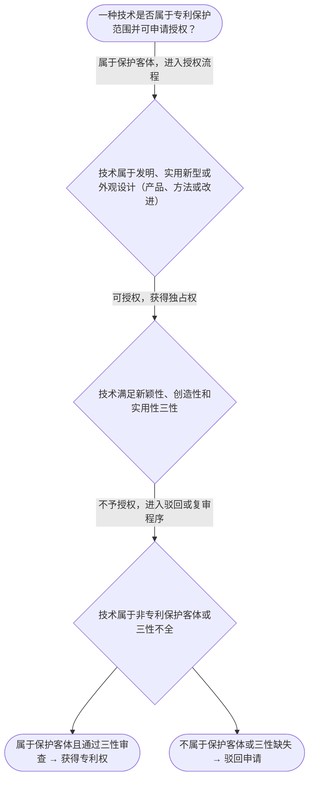

# 专家 B 教学草稿

> 专家：expert_b ｜ 风格：accessible

## 教学模块选择清单

- 当前教学节点：`patent-law-foundation`
- 板块预算：自适应 4/6，总计 9/12

| # | 模块 (block_type) | 类型 | 触发原因 (trigger) | 对应正文段 | 归属 |
|---:|---|:--:|---|---|:--:|
| 1 | `anchor_scenario` | 自适应 | perception=sensing(0.86) / cold_start | 智能制造真实案例锚定｜智能制造领域，一家专注汽车零部件的智能工厂开发了一种新型的AI视觉引导机械臂，能实时识别并精… | [B] |
| 2 | `legal_anchor` | 必选 | mandatory | 专利法核心法条回扣｜《专利法》第二条 | [B] |
| 3 | `worked_example` | 自适应 | cognition.apply=0.39<0.4 / cold_start | 智能制造缺陷检测系统案例演练｜某智能制造企业开发了一种基于机器视觉的缺陷检测系统，用于生产线上的产品质量控制。2025年1… | [B] |
| 4 | `decision_flow` | 自适应 | input=visual(0.82) | 保护客体与三性判定流程图｜一种技术是否属于专利保护范围并可申请授权？ | [B] |
| 5 | `mnemonic` | 自适应 | remember=0.75>=0.6 & apply<0.4 / understanding=sequential(0.70) | 三客体记忆口诀｜三客体记忆口诀：发（发明）、用（实用新型）、外（外观设计） | [B] |
| 6 | `reflect_prompt` | 自适应 | processing=reflective(0.67) | 场景反思与迁移提示｜如果你的公司想申请智能制造设备的专利，你会先考虑什么？ | [B] |
| 7 | `assessment` | 必选 | mandatory | 本节测评｜专利保护的三种客体是什么？ | [B] |
| 8 | `knowledge_synthesis` | 必选 | mandatory | 知识综合与易混淆点｜专利制度基本概念：独占性、时间性、地域性 | [B] |
| 9 | `summary_card` | 自适应 | len(knowledge_sub_nodes)=3>=3 | 专利法律制度基础总结卡｜掌握专利法律制度基础是理解新颖性判断与侵权判定的前提。 | [B] |

## 教学正文

## 1. 场景导入
智能制造领域，一家专注汽车零部件的智能工厂开发了一种新型的AI视觉引导机械臂，能实时识别并精准抓取不同形状的工件。团队希望申请专利以独占该技术，同时担心如果在2025年Q1的全球智能制造展会展出，是否会影响后续申请。新颖性风险与保护客体判断同时摆在面前。

## 2. 人话解释
专利法律制度基础是理解专利新颖性判断和侵权判定的前提。它明确了专利保护的对象（发明、实用新型、外观设计）、授权必须满足的三性条件，以及中国专利制度的基本框架和特点。简单来说，专利制度赋予发明者独占权，激励他们把技术公开出来，促进技术应用和经济发展。在智能制造场景中，AI机械臂的技术方案通常属于‘发明’客体，但必须符合新颖性（未公开）、创造性（非显而易见）和实用性（能制造使用并产生积极效果）。

## 3. 法条回扣
《专利法》第二条规定了三种保护客体：《专利法》第二十二条规定了授权的三性条件，《专利法》第四条和第五条规定了中国专利制度的核心框架。
〔RAG: 专利法.txt — 第二条：发明，是指对产品、方法或者其改进所提出的新的技术方案；实用新型，是指对产品的形状、构造或者其改进所提出的适于使用的新技术方案；外观设计，是指对产品的形状、图案或者其结合所提出的富有美感并适于工业应用的新设计〕

## 4. 类比 / 口诀
类比：专利客体就像三把钥匙——发明像一把大锁（产品或方法的改进），实用新型像一把中锁（形状构造改进），外观设计像一个精致的挂件（产品外观）。口诀：发（发明）、用（实用新型）、外（外观设计）。适用边界：只有技术方案才可能授权，非技术方案（如纯商业计划）无法授权。

## 5. 应试提示
题干中常出现‘技术方案’或‘产品改进’，先判断是否属于发明/实用新型/外观设计；公开行为（如展会）只影响新颖性审查，不影响客体资格。

## 6. 互动提问
检查理解与迁移

### 智能制造真实案例锚定（anchor_scenario）

> 智能制造领域，一家专注汽车零部件的智能工厂开发了一种新型的AI视觉引导机械臂，能实时识别并精准抓取不同形状的工件。团队希望申请专利以独占该技术，同时担心如果在2025年Q1的全球智能制造展会展出，是否会影响后续申请。新颖性风险与保护客体判断同时摆在面前，学员需要先建立直观的锚点。

**锚定**：用同一智能制造真实情境同时锚定‘保护客体’（发明/实用新型）与‘授权三性’两个抽象模块，降低抽象概念入门门槛。

**先想一想**：如果你是该工厂的专利负责人，看到这个AI视觉机械臂，你的第一反应是：它属于哪一类专利保护客体？是否容易通过实质审查？为什么？

### 专利法核心法条回扣（legal_anchor）

- **《专利法》第二条**：专利保护的三种客体：发明（产品、方法或其改进）、实用新型（产品形状、构造或其改进）、外观设计（产品外观设计）。
- **《专利法》第二十二条**：授权实质条件：新颖性（未公开过）、创造性（非显而易见）、实用性（能制造使用并产生积极效果）。
- **《专利法》第五条**：中国专利制度核心框架：专利法、专利法实施细则、审查指南，三性审查贯穿始终。

**为何重要**：本条是理解专利法律制度基础的闸门——保护客体决定能否进入授权流程，三性是实质审查主线，必须先立住法条边界，后续新颖性、侵权判定才可落地。

### 智能制造缺陷检测系统案例演练（worked_example）

**案情/例题**：某智能制造企业开发了一种基于机器视觉的缺陷检测系统，用于生产线上的产品质量控制。2025年1月在行业技术交流会上展示该系统，随后于2025年4月提出专利申请。问：该技术是否符合专利保护客体要求？
**适用规则**：《专利法》第二条、《专利法》第二十二条
**分步推演**：
1. 缺陷检测系统属于技术方案，属于‘发明’范畴（产品改进或方法），且为制造使用提供技术手段。 → *满足保护客体要求*
2. 技术交流会属于公开行为，但需判断是否在申请日前且是否属于法定公开。 → *需检查公开日期与范围*
3. 即便公开，需分别判断新颖性、创造性、实用性是否全部通过。 → *实体三性仍须满足*
**结论**：该技术属于发明客体，但新颖性需进一步判断，公开行为仅影响新颖性审查，不直接决定客体资格。
**本题要点**：专利客体是起点，需结合具体事实判断三性，智能制造案例中技术方案通常可归类为发明。

### 保护客体与三性判定流程图（decision_flow）

**决策问题**：一种技术是否属于专利保护范围并可申请授权？



### 三客体记忆口诀（mnemonic）

**记忆锚**：三客体记忆口诀：发（发明）、用（实用新型）、外（外观设计）
**映射**：
- 发
- 用
- 外
**何时用**：判断专利保护对象时看到‘技术方案’或‘产品改进’，立即套用三客体口诀快速辨析。

### 场景反思与迁移提示（reflect_prompt）

**反思问题**：如果你的公司想申请智能制造设备的专利，你会先考虑什么？

**关注要点**：保护客体是否匹配（发明/实用新型/外观设计）；三性条件是否能通过；公开行为（如展会展示）对新颖性的影响

**连接**：连接到‘现有技术’与‘公开行为类型’概念，为后续新颖性判断与侵权判定奠定基础。

### 知识综合与易混淆点（knowledge_synthesis）

**知识框架**：
- 专利制度基本概念：独占性、时间性、地域性
- 专利保护客体：发明、实用新型、外观设计（专利法第2条）
- 专利制度作用与发展历程：激励发明、公开延迟审查、初步与实质审查并存
**概念关系**：保护客体决定能否进入授权流程，三性是实质审查主线，客体与三性共同构成授权核心
**必记**：专利法是核心法律依据，三客体是保护范围；新颖性、创造性、实用性三性缺一不可即不授权

### 专利法律制度基础总结卡（summary_card）

**要点卡**：
- **专利保护客体**：发明、实用新型、外观设计
- **专利授权条件**：新颖性、创造性、实用性三关
- **中国专利体系**：专利法及其实施细则、审查指南
**必背**：三客体是保护范围起点；三性缺一不可即不授权
**一句话总结**：掌握专利法律制度基础是理解新颖性判断与侵权判定的前提。

### 本节测评（assessment）

**三类覆盖**：backward_review、forward_probe、weakness_probe
**题目**：
- ass-q1：专利保护的三种客体是什么？
- ass-q2：专利授权的核心实质条件有哪些？
- ass-q3：中国专利制度体系包括哪些主要部分？


## 结构化字段

## knowledge_points

```json
[
  {
    "node_id": "patent-law-foundation",
    "kc_name": "专利制度的基本概念与特征：独占性、时间性、地域性"
  },
  {
    "node_id": "patent-law-foundation",
    "kc_name": "中国专利制度体系：专利法、专利法实施细则、专利审查指南"
  },
  {
    "node_id": "patent-law-foundation",
    "kc_name": "专利保护的三种客体：发明、实用新型、外观设计（专利法第2条）"
  },
  {
    "node_id": "patent-law-foundation",
    "kc_name": "专利制度的作用：激励发明创造、促进技术公开、推动技术应用和经济发展"
  },
  {
    "node_id": "patent-law-foundation",
    "kc_name": "中国专利制度发展历程与特点：早期公开延迟审查、初步审查制与实质审查制并存"
  }
]
```

## legal_basis

```json
[
  {
    "article": "《专利法》第二条",
    "source": "《专利法》第二条"
  },
  {
    "article": "《专利法》第二十二条",
    "source": "《专利法》第二十二条"
  },
  {
    "article": "《专利法》第五条",
    "source": "《专利法》第五条"
  },
  {
    "article": "《专利法》第四条",
    "source": "《专利法》第四条"
  }
]
```

## risks

```json
[
  {
    "risk": "公开行为（如展会展示）可能影响新颖性判断",
    "related_node_id": "patent-law-foundation"
  },
  {
    "risk": "客体判断错误导致后续新颖性或侵权判定失效",
    "related_node_id": "patent-law-foundation"
  }
]
```

## draft_stage

```json
"debate"
```

## interactive_questions

```json
[
  {
    "qid": "q1",
    "category": "remember",
    "difficulty": "L1",
    "source_tag": "backward_review",
    "kc_node_id": "patent-law-foundation",
    "question": "下列哪项属于专利保护的三种客体之一？",
    "answer": "A",
    "options": [
      "A. 一种商业计划书",
      "B. 一种产品的形状构造改进",
      "C. 一种纯理论推导",
      "D. 一种未公开的技术方案"
    ]
  },
  {
    "qid": "q2",
    "category": "understand",
    "difficulty": "L1",
    "source_tag": "backward_review",
    "kc_node_id": "patent-law-foundation",
    "question": "专利授权的核心实质条件包括哪三项？",
    "answer": "C",
    "options": [
      "A. 独占性、时间性、地域性",
      "B. 申请、审查、救济",
      "C. 新颖性、创造性、实用性",
      "D. 初步审查、实质审查、复审"
    ]
  },
  {
    "qid": "q3",
    "category": "apply",
    "difficulty": "L2",
    "source_tag": "forward_probe",
    "kc_node_id": "patent-rights-protection",
    "question": "某智能制造企业AI视觉机械臂在2025年1月技术交流会上展示，随后4月申请专利，关于新颖性判断正确的是：",
    "answer": "A",
    "options": [
      "A. 展会公开不影响新颖性，因为技术方案仍属发明客体",
      "B. 展会公开导致该技术不可申请专利",
      "C. 必须先判断实用新型客体",
      "D. 需同时满足创造性和实用性"
    ]
  }
]
```

## knowledge_synthesis

```json
{
  "node": "patent-law-foundation",
  "coverage": [
    {
      "node_id": "patent-law-foundation"
    }
  ],
  "confusable_pairs": [
    {
      "pair": "发明 vs 实用新型 vs 外观设计"
    },
    {
      "pair": "新颖性 vs 创造性 vs 实用性"
    }
  ]
}
```
