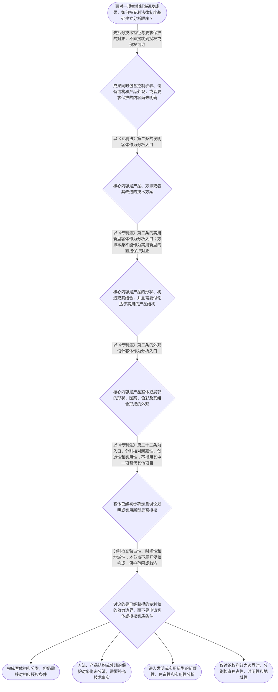

# 整合后的课程完整内容与习题

## 教学模块选择清单

- 当前教学节点：`patent-law-foundation`
- 板块预算：自适应 5/6，总计 9/9

| # | 模块 (block_type) | 类型 | 触发原因 (trigger) | 对应正文段 | 归属 |
|---:|---|:--:|---|---|:--:|
| 1 | `anchor_scenario` | 自适应 | perception=sensing(0.86) / cold_start | 智能制造方案的专利保护入口｜某智能制造企业研发了一套协同机器人关节模组，研发负责人李工同时完成了谐波减速器的结构改进、视… | [A+B融合] |
| 2 | `legal_anchor` | 必选 | mandatory | 法条锚定：保护客体与授权基础｜《中华人民共和国专利法》第二条 | [A+B融合] |
| 3 | `worked_example` | 自适应 | cold_start(low_confidence) | 案例演示：机器人关节三项成果的分层判断｜某智能制造企业完成三项研发成果：（一）根据视觉传感器反馈调节机器人焊接参数的控制方法；（二）… | [A+B融合] |
| 4 | `decision_flow` | 自适应 | input=visual(0.82) | 专利法律制度基础判断流程｜面对一项智能制造研发成果，如何按专利法律制度基础建立分析顺序？ | [A+B融合] |
| 5 | `mnemonic` | 自适应 | understanding=sequential(0.71) | 专利基础分类与边界记忆表｜分类记忆表“发—实—外”，边界记忆表“独—时—地”，规范层次记忆表“法—细—指”：先分保护客… | [A+B融合] |
| 6 | `reflect_prompt` | 自适应 | processing=reflective(0.67) | 从研发成果回看法律层次｜回想一项你熟悉的智能制造成果：如果现在为它做专利布局，你最容易先把哪两个问题混在一起，保护客… | [A+B融合] |
| 7 | `assessment` | 必选 | mandatory | 本节三类测评｜识别三类专利保护客体 | [A+B融合] |
| 8 | `knowledge_synthesis` | 必选 | mandatory | 专利法律制度基础关系网｜专利制度基本概念与特征：专利权具有独占性、时间性和地域性，三者共同限定权利效力边界。 | [A+B融合] |
| 9 | `summary_card` | 自适应 | len(knowledge_sub_nodes)=3>=3 | 专利法律制度基础速查卡｜先分清保护客体，再分别核对授权条件，并用独占性、时间性和地域性理解专利权边界。 | [A+B融合] |

## 教学正文

## I — 法律问题

本节唯一主节点是“专利法律制度基础”。面对智能制造中的机器人关节模组、视觉伺服控制方法和设备外壳设计，首先要解决的不是直接判断新颖性或侵权，而是建立四层基础：保护客体是什么、授权实质条件如何进入、专利权具有哪些基本特征、中国专利制度由哪些规范材料和程序机制构成。

新颖性判断、创造性判断和侵权判定将在后续节点分别展开。本节只建立必要的概念入口和判断顺序，不把后续节点提前当作本节结论。

## R — 适用规则

### 1. 三类专利保护客体

《专利法》第二条是“申请的是什么”的入口。发明对应产品、方法或者其改进的新的技术方案；实用新型对应产品的形状、构造或者其结合所提出的适于实用的新的技术方案；外观设计对应产品整体或局部的形状、图案、色彩及其组合形成的设计。由于本轮检索上下文为空，以上是依据题设和专家草稿形成的教学归纳，具体现行条文应以官方文本核验。

因此，智能制造项目中的控制机器人运动的步骤，首先应按方法技术方案考虑发明；末端执行器的传感器安装结构，属于产品结构层面的分析对象，可进一步考虑实用新型或发明；设备外壳的流线型形状和图案，则应单独考虑外观设计。共同服务于同一条产线，不会自动使三项成果成为同一种专利客体。

### 2. 发明和实用新型的授权实质条件

《专利法》第二十二条是发明和实用新型授权实质条件的规则入口。教学上应分别核对新颖性、创造性和实用性：新颖性处理申请方案是否已被相关公开内容揭示；创造性进一步处理相对于现有技术是否对本领域技术人员显而易见；实用性处理方案是否能够制造或者使用并产生积极效果。三者是不同问题，不能以“已经制造出来”或“已经产生技术效果”包办全部判断。

新颖性与创造性的边界尤其重要。新颖性分析通常先问单一公开内容是否完整揭示要求保护的方案；创造性分析则进一步考察相对于现有技术，相关技术人员是否容易得到该方案。把多份资料拼接来否定新颖性，会把创造性分析的方法错误地套到新颖性上。相反，只要找到一份资料就停止，也不能代替创造性判断。创造性分析以具备新颖性为前提。

### 3. 专利权的基本特征

专利权通常从独占性、时间性和地域性三个角度理解。独占性表示权利人在法定范围内享有排他效力；时间性表示权利不是永久存在；地域性表示保护原则上依具体国家或地区的法律和授权范围确定。中国专利授权不自动产生海外专利保护，具体保护期限和效力内容应以现行法及授权文件核对。

这三个特征不能替代新颖性、创造性或侵权构成分析。它们回答的是“权利在什么范围、什么时间和什么地域发挥效力”，而不是“申请方案是否满足授权条件”。

### 4. 中国专利制度体系、作用与发展特点

中国专利制度的规范材料应分层理解：专利法提供基本法律规则，专利法实施细则承担实施层面的规定，专利审查指南提供审查实践中的具体说明。遇到具体问题时，应先定位法律问题，再选择相应层级的材料核对，不能把审查指南的说明当成脱离法律依据的独立结论。

专利制度的作用包括激励发明创造、促进技术公开、推动技术应用和经济发展。可以把它理解为：制度通过授予一定范围、一定期限的专有权，鼓励研发者公开技术，同时为后续改进和应用提供知识基础。但制度目的只能帮助理解制度设计，不能单独证明某项申请已经满足授权条件或某项行为已经构成侵权。

本节点还需掌握早期公开、延迟审查以及初步审查制与实质审查制并存等特点。它们属于申请和审查流程层面的制度机制，不能直接等同于“方案已经具备新颖性”或“方案一定能够获得授权”。具体流程和期限应以现行专利法、实施细则及官方审查材料核验。

## A — 规则适用与示范

以下使用一个拟制的智能制造教学场景演示分析方法，不是真实裁判案件，也不代表任何具体申请的正式审查结论。

某企业完成三项成果：第一项是根据视觉传感器反馈调节机器人焊接参数的控制方法；第二项是具有特定齿形和传感器安装位置的谐波减速器产品结构；第三项是机器人关节外壳的流线型形状与图案组合。企业希望以“属于智能制造技术”这一点证明三项成果都可获得同一种专利保护。

第一步，先拆分技术事实与要求保护的对象。第一项的核心是控制步骤和参数处理，属于方法层面的技术方案；第二项的核心是产品的形状、构造及其结合；第三项的核心是产品呈现给消费者的外观。三项成果共同用于一条产线，不等于三项客体相同。

第二步，将对象与三类保护客体对应。控制方法优先进入发明分析；产品结构可以结合具体方案考虑实用新型或发明；外观形状、图案及其组合进入外观设计分析。此时只是完成“保护什么”的初步分类，不能直接保证授权。

第三步，在客体确定后核对授权实质条件。对发明或实用新型，应分别分析新颖性、创造性和实用性。企业内部完成方案、尚未向公众公开或已经产生技术效果，都是需要核实的事实，不能仅凭其中一个事实推出全部授权条件已经满足。

第四步，建立证据清单，包括申请日、可能的公开文件及其公开日期、拟保护的权利要求内容和技术效果材料。若缺少这些材料，只能说明判断链，不能把教学场景写成真实案件结论。

## C — 结论与易错点

正确的基础分析顺序是：先识别保护客体，再分别核对新颖性、创造性和实用性，最后用独占性、时间性和地域性理解专利权边界。专利法、实施细则和审查指南应按不同层次查阅；制度目的可以解释“为什么保护和公开”，但不能替代具体法条和证据。

常见误区一：“只要属于智能制造领域，就自动获得专利保护。”正解是，领域属性不是授权条件。区分判据是先看要求保护的是方法、产品结构还是产品外观，再检查相应法定条件。

常见误区二：“企业已经做出来并且产生了技术效果，所以新颖性、创造性和实用性都满足。”正解是，能够制造或使用并产生积极效果主要对应实用性分析，不能替代对新颖性和创造性的分别核对。区分判据是把技术效果、公开事实和显而易见性分别记录，不能用一个事实覆盖三项判断。

常见误区三：“新颖性和创造性都可以把几篇资料拼起来判断。”正解是，新颖性通常先看单一公开内容是否完整揭示方案，创造性才进一步考察相对于现有技术是否显而易见。区分判据是先问“一份公开是否完整揭示”，再问“相对于现有技术是否容易得到”。

常见误区四：“中国专利取得后全球有效，或者专利权永久存在。”正解是，专利权具有地域性和时间性，中国授权不自动覆盖海外，权利也不是永久存在。区分判据是分别核对授权地域、权利期限和具体授权文件。

常见误区五：“拟制的机器人案例就是真实案例。”正解是，没有可核验来源时，应明确说明检索上下文未提供直接依据，只把场景用于演示判断链。区分判据是能否提供真实案号、官方文书或可靠审查材料；不能提供时不得包装成真实案件结论。

本节设有测评，请到【习题】区作答。

### 智能制造方案的专利保护入口（anchor_scenario）

> 某智能制造企业研发了一套协同机器人关节模组，研发负责人李工同时完成了谐波减速器的结构改进、视觉伺服控制方法和机器人外壳的流线型外观。企业准备先在国内工业展会上展示，再提交中国专利申请。项目经理需要决定：三项成果分别应对应什么保护客体；专利制度究竟保护什么；获得中国授权后，权利是否自动覆盖海外以及是否永久存在。几个问题都被称为“能不能保护”，但它们分别涉及客体分类、授权条件以及专利权的独占性、时间性和地域性。

**锚定**：用同一智能制造研发事实连接三类保护客体、授权实质条件、专利权基本特征和中国专利制度体系。

**先想一想**：如果你是项目中的专利代理人，在分析这组研发成果时，第一步应先区分保护客体，还是先讨论是否满足授权条件？为什么？

### 法条锚定：保护客体与授权基础（legal_anchor）

- **《中华人民共和国专利法》第二条**：第二条是识别专利保护客体的入口：发明、实用新型和外观设计分别对应不同类型的技术方案或产品外观，不能因它们共同用于一条产线就归为同一客体。
- **《中华人民共和国专利法》第二十二条**：第二十二条是发明和实用新型授权实质条件的规则入口，教学上应分别核对新颖性、创造性和实用性；具体现行条文应以官方文本核验。
- **《中华人民共和国专利法》第一条**：第一条说明专利制度旨在保护专利权人的合法权益、鼓励发明创造、推动发明创造的应用、提高创新能力并促进科学技术进步和经济社会发展。

**为何重要**：本节点先解决“保护什么”和“制度为什么这样设计”，再为后续新颖性、创造性及专利权保护节点建立法条入口。由于本轮检索上下文为空，未提供可直接核验的法条原文，具体引用应以官方现行文本为准。

### 案例演示：机器人关节三项成果的分层判断（worked_example）

**案情/例题**：某智能制造企业完成三项研发成果：（一）根据视觉传感器反馈调节机器人焊接参数的控制方法；（二）具有特定齿形和传感器安装位置的谐波减速器产品结构；（三）机器人关节外壳的流线型形状与图案组合。企业希望用一个“属于智能制造技术”的结论说明三项成果均可获得同一种专利保护。请演示应如何按照专利法律制度基础进行分层分析。
**适用规则**：以《专利法》第二条作为保护客体分类入口，以《专利法》第二十二条作为发明和实用新型授权实质条件分析入口。专利权的独占性、时间性和地域性用于理解权利边界。本例为拟制教学案例，不是真实裁判案件；检索上下文未提供直接法条原文。
**分步推演**：
1. 先观察每项成果要求保护的内容，而不是先看其应用领域。第一项的核心是控制步骤和参数处理，属于方法层面的技术方案；第二项的核心是产品的形状、构造及其结合；第三项的核心是产品呈现给消费者的外观。三项成果服务于同一产线，并不意味着客体相同。 → *第一步：拆分技术事实与要求保护的对象。*
2. 将拆分后的对象与第二条的三类客体对应。控制方法优先进入发明分析；产品结构可以结合具体技术方案考虑实用新型或发明；外观形状、图案及其组合则进入外观设计分析。这里是客体入口判断，不是对授权结果的预先保证。 → *第二步：把方法、产品结构和外观分别对应到客体类型。*
3. 对已经进入发明或实用新型讨论的对象，再依据第二十二条分别核对新颖性、创造性和实用性。企业内部完成方案、尚未向公众公开、已经产生技术效果，分别是需要核实的事实，不能单独替代三项条件的完整判断。 → *第三步：客体确定后，分别核对授权实质条件。*
4. 最后建立证据清单，包括申请日、可能的公开文件及其公开日期、权利要求或拟申请内容和技术效果材料。没有这些材料时，只能说明分析方法，不能宣称某项成果必然授权或必然不授权。 → *第四步：保留证据边界，避免把教学演示当成正式结论。*
**结论**：该组研发成果应先拆分为方法、产品结构和产品外观三个分析对象：视觉伺服控制方法优先作为发明技术方案讨论，减速器结构改进可进一步考虑实用新型或发明，外壳流线型外观作为外观设计单独分析。完成客体识别后，发明或实用新型还要分别核对新颖性、创造性和实用性，不能仅凭已经制造或产生技术效果作出全部授权结论。
**本题要点**：面对智能制造研发成果，先按保护对象分类，再分别核对授权实质条件，并把制度特征与具体案件结论分开。

### 专利法律制度基础判断流程（decision_flow）

**决策问题**：面对一项智能制造研发成果，如何按专利法律制度基础建立分析顺序？



### 专利基础分类与边界记忆表（mnemonic）

**记忆锚**：分类记忆表“发—实—外”，边界记忆表“独—时—地”，规范层次记忆表“法—细—指”：先分保护客体，再记专利权特征，最后按规范层次查找依据。
**映射**：
- 发
- 实
- 外
- 独
- 时
- 地
- 法—细—指
**何时用**：看到智能制造题干要求判断申请类型、专利权边界或法律依据层次时，按“发—实—外，独—时—地，法—细—指”的顺序回忆；口诀只用于记忆，不替代现行法条和具体证据。

### 从研发成果回看法律层次（reflect_prompt）

**反思问题**：回想一项你熟悉的智能制造成果：如果现在为它做专利布局，你最容易先把哪两个问题混在一起，保护客体、授权三性还是专利权效力？

**关注要点**：研发成果的技术内容与拟要求保护的对象是否一致；方法、产品结构和产品外观是否被错误地归入同一种专利客体；“能够制造或产生技术效果”是否被误认为已经同时满足新颖性、创造性和实用性；中国授权的地域边界和专利权期限是否被忽略

**连接**：连接学习者已有的智能制造研发经验，回到“技术事实拆分—客体识别—授权条件核对—权利效力边界”的本节主线。

### 专利法律制度基础关系网（knowledge_synthesis）

**知识框架**：
- 专利制度基本概念与特征：专利权具有独占性、时间性和地域性，三者共同限定权利效力边界。
- 中国专利制度体系：专利法提供基本法律规则，专利法实施细则承担实施层面的规定，专利审查指南提供审查操作中的具体说明；三者应区分使用。
- 三类专利保护客体：发明、实用新型和外观设计对应不同的保护对象，必须根据要求保护的内容分类。
- 专利制度的作用：通过在一定范围和期限内提供专有权，鼓励发明创造、促进技术公开、推动技术应用并促进经济社会发展。
- 中国专利制度发展与审查特点：本节需掌握早期公开、延迟审查以及初步审查与实质审查并存等制度线索；具体程序细节应以现行规范核验。
**概念关系**：先识别保护客体，再讨论相应授权条件；客体识别错误会使后续新颖性、创造性和实用性分析失去对象基础。；新颖性、创造性和实用性都属于授权实质条件，但解决的问题不同；本节点只建立区分框架，具体判断将在后续节点展开。；制度作用解释专利制度的宏观目的，不能直接替代某一具体客体或授权结论。；独占性、时间性和地域性用于理解专利权边界，不等同于新颖性或创造性判断。
**必记**：发明、实用新型和外观设计是三类基本专利保护客体，方法方案不能直接作为实用新型的保护对象。；专利权具有独占性、时间性和地域性，不是无限期、全球范围的绝对权利。；发明和实用新型的授权实质条件应分别核对新颖性、创造性和实用性；已经完成、能够制造或产生技术效果都不能单独替代完整核对。；专利法、实施细则和审查指南承担不同层次的规范功能，查阅时应根据问题选择相应材料。；检索上下文未提供可核验的真实智能制造案例或法条原文，不能把拟制场景包装成真实案件结论。

### 专利法律制度基础速查卡（summary_card）

**要点卡**：
- **三类保护客体**：发明看产品、方法或其改进的技术方案；实用新型看产品结构；外观设计看产品外观。
- **专利权三大特征**：独占性是排他效力，时间性是期限边界，地域性是授权地域边界。
- **中国专利制度体系**：专利法定基本规则，实施细则定实施程序，审查指南作审查说明。
- **制度作用**：以一定范围和期限的专有权激励创造、促进公开、推动应用和发展。
- **授权条件入口**：客体识别完成后，发明和实用新型还要分别核对新颖性、创造性和实用性。
**必背**：发明、实用新型、外观设计是三类基本专利保护客体。；专利权具有独占性、时间性和地域性，中国授权不自动覆盖海外。；发明和实用新型的授权实质条件包括新颖性、创造性和实用性，三者不能混为一谈。；专利法、专利法实施细则和专利审查指南属于不同层次的规范材料。；没有可靠检索依据时，不把拟制智能制造场景写成真实案例或确定法律结论。
**一句话总结**：先分清保护客体，再分别核对授权条件，并用独占性、时间性和地域性理解专利权边界。

### 本节三类测评（assessment）

**三类覆盖**：backward_review、forward_probe、weakness_probe
**题目**：
- q_backward_1：识别三类专利保护客体
- q_forward_1：探测发明和实用新型专利权授权后的基本效力
- q_weakness_1：区分保护客体与新颖性、创造性、实用性等授权条件


## 结构化数据

## expert

```json
"A+B融合"
```

## style

```json
"fused"
```

## knowledge_points

```json
[
  {
    "node_id": "patent-law-foundation",
    "kc_name": "专利制度的基本概念与特征：独占性、时间性、地域性"
  },
  {
    "node_id": "patent-law-foundation",
    "kc_name": "中国专利制度体系：专利法、专利法实施细则、专利审查指南"
  },
  {
    "node_id": "patent-law-foundation",
    "kc_name": "专利保护的三种客体：发明、实用新型、外观设计（专利法第2条）"
  },
  {
    "node_id": "patent-law-foundation",
    "kc_name": "专利制度的作用：激励发明创造、促进技术公开、推动技术应用和经济发展"
  },
  {
    "node_id": "patent-law-foundation",
    "kc_name": "中国专利制度发展历程与特点：早期公开、延迟审查、初步审查制与实质审查制并存"
  }
]
```

## legal_basis

```json
[
  {
    "article": "《中华人民共和国专利法》第一条",
    "source": null
  },
  {
    "article": "《中华人民共和国专利法》第二条",
    "source": null
  },
  {
    "article": "《中华人民共和国专利法》第二十二条",
    "source": null
  }
]
```

## risks

```json
[
  {
    "risk": "检索上下文为空，未提供可直接核验的法条原文、真实智能制造裁判文书或审查决定；本稿不得将拟制场景包装为真实案例。",
    "related_node_id": "patent-law-foundation"
  },
  {
    "risk": "容易把方法方案、产品结构和产品外观混为同一种专利客体，导致后续申请类型判断失准。",
    "related_node_id": "patent-law-foundation"
  },
  {
    "risk": "容易把已经完成、能够制造或产生技术效果误认为已经同时满足新颖性、创造性和实用性。",
    "related_node_id": "patent-law-foundation"
  },
  {
    "risk": "容易把专利权的独占性理解为无限制排他权，忽略时间性和地域性。",
    "related_node_id": "patent-law-foundation"
  },
  {
    "risk": "本节仅对下一节点专利权保护作L1向前探测，不展开侵权构成、保护范围、抗辩和救济。",
    "related_node_id": "patent-rights-protection"
  }
]
```

## draft_stage

```json
"integration"
```

## irac

```json
{
  "issue": "智能制造研发成果应如何纳入专利法律制度基础框架，并如何区分保护客体、授权实质条件与专利权效力边界？",
  "rule": "《专利法》第二条是识别发明、实用新型和外观设计保护客体的法条入口；《专利法》第二十二条是发明和实用新型授权实质条件的规则入口，需分别核对新颖性、创造性和实用性；专利权还应从独占性、时间性和地域性理解其基本边界。检索上下文未提供直接法条原文，具体条文应以官方现行文本核验。",
  "application": "在智能制造场景中，应先把控制方法、产品结构和产品外观拆分，再分别对应发明、实用新型或外观设计的分析入口。客体确定后，对发明或实用新型分别核对新颖性、创造性和实用性；内部完成、尚未公开或已产生技术效果等单一事实，均不能直接推出全部授权条件已经满足。讨论权利效力时，还应分别考虑独占性、时间性和地域性。",
  "conclusion": "专利法律制度基础的分析顺序是先识别保护客体，再分别核对授权实质条件，最后用独占性、时间性和地域性理解权利边界。新颖性、创造性和侵权判定相互关联但并非同一问题，本节不提前作出具体侵权结论。"
}
```

## interactive_questions

```json
[
  {
    "qid": "q_backward_1",
    "category": "remember",
    "difficulty": "L1",
    "source_tag": "backward_review",
    "kc_node_id": "patent-law-foundation",
    "question": "关于我国专利保护客体，下列哪一项表述正确？",
    "answer": "B",
    "options": [
      "A.仅有发明和实用新型",
      "B.发明、实用新型和外观设计",
      "C.仅有方法和设备",
      "D.发明、商标和著作权"
    ]
  },
  {
    "qid": "q_forward_1",
    "category": "remember",
    "difficulty": "L1",
    "source_tag": "forward_probe",
    "kc_node_id": "patent-rights-protection",
    "question": "关于发明和实用新型专利权授权后的基本效力，下列哪一项表述最符合下一节点的基础内容？",
    "answer": "A",
    "options": [
      "A.未经许可不得为生产经营目的实施其专利，是授权后专利权效力的基础表述之一",
      "B.授权后专利权自动扩展至所有国家和地区",
      "C.授权后专利权永久有效，不受期限限制",
      "D.授权后任何私人使用行为均当然构成侵权"
    ]
  },
  {
    "qid": "q_weakness_1",
    "category": "analyze",
    "difficulty": "L3",
    "source_tag": "weakness_probe",
    "kc_node_id": "patent-law-foundation",
    "question": "某智能制造企业在申请日前完成了一种机器人焊接参数调节方法，但该方案尚未向公众公开，并已产生相应技术效果。下列判断最严谨的是？",
    "answer": "C",
    "options": [
      "A.只要企业内部完成技术方案，就当然同时满足保护客体和全部授权条件",
      "B.只要技术方案产生了技术效果，就当然具有新颖性和创造性",
      "C.应先识别方法、产品结构或外观等保护客体，再分别核对新颖性、创造性和实用性；现有技术及日期证据仍需核验",
      "D.只要属于智能制造领域，就自动获得中国专利权保护"
    ]
  }
]
```

## knowledge_synthesis

```json
{
  "node": "patent-law-foundation",
  "coverage": [
    {
      "node_id": "patent-law-foundation"
    },
    {
      "node_id": "patent-rights-nature"
    },
    {
      "node_id": "patent-law-framework"
    },
    {
      "node_id": "patent-system-overview"
    }
  ],
  "confusable_pairs": [
    {
      "pair": "发明与实用新型：方法属于方法层面的技术方案，不能直接作为实用新型保护对象；实用新型重点对应产品形状、构造或其结合"
    },
    {
      "pair": "保护客体与授权实质条件：先判断申请保护的对象属于哪类客体，再核对新颖性、创造性和实用性"
    },
    {
      "pair": "专利权地域性与全球保护：中国专利授权不等于自动取得其他国家或地区的专利保护"
    },
    {
      "pair": "拟制教学案例与真实案例：没有可核验来源时只能演示分析方法，不能宣称真实裁判或审查结论"
    }
  ]
}
```
