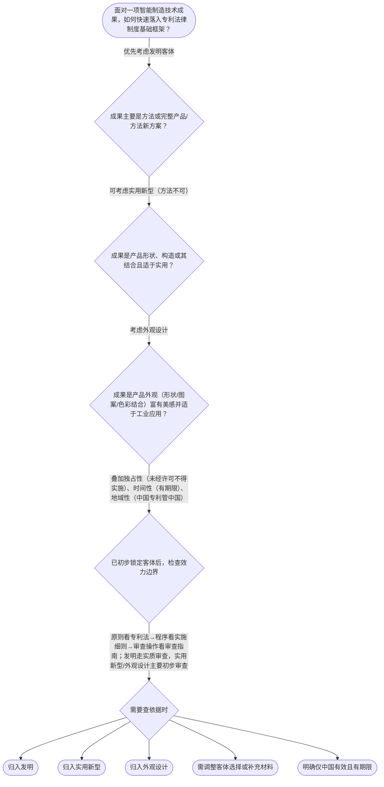

# 专家 B 教学草稿

> 专家：expert_b ｜ 风格：accessible

## 教学模块选择清单

- 当前教学节点：`patent-law-foundation`
- 板块预算：自适应 6/6，总计 9/9

| # | 模块 (block_type) | 类型 | 触发原因 (trigger) | 对应正文段 | 归属 |
|---:|---|:--:|---|---|:--:|
| 1 | `anchor_scenario` | 自适应 | perception=sensing(0.86) / cold_start | 智能制造场景锚定：机器人关节要不要、怎么申请｜某智能制造企业研发中心做出协同机器人关节模组：内部谐波减速器结构改进、配套视觉伺服控制方法，… | [B] |
| 2 | `legal_anchor` | 必选 | mandatory | 法条锚定：第二条客体与第一条立法目的｜《专利法》第二条（发明、实用新型、外观设计定义） | [B] |
| 3 | `worked_example` | 自适应 | cold_start(low_confidence) | 案例演示：机器人关节三成果如何归类｜智能工厂交付三项成果：（甲）视觉伺服控制方法；（乙）谐波减速器齿形结构改进；（丙）机器人关节… | [B] |
| 4 | `decision_flow` | 自适应 | input=visual(0.82) | 决策流：智能制造方案如何落入制度框架｜面对一项智能制造技术成果，如何快速落入专利法律制度基础框架？ | [B] |
| 5 | `mnemonic` | 自适应 | understanding=sequential(0.71) | 口诀：客体三兄弟 + 独时地 + 法细指｜客体三兄弟：发（方法产品新方案）/实（结构实用）/外（好看量产）；特征口诀：独时地；体系三层… | [B] |
| 6 | `reflect_prompt` | 自适应 | processing=reflective(0.67) | 反思：从产线经验映射制度框架｜回想你参与或了解过的智能制造项目，如果当时要做专利布局，你会先问团队哪三个制度基础问题？ | [B] |
| 7 | `assessment` | 必选 | mandatory | 三类测评入口｜智能制造情境下辨识专利权三大特征（向后复习L1） | [B] |
| 8 | `knowledge_synthesis` | 必选 | mandatory | 知识综合：专利法律制度基础框架｜基本特征：独占性、时间性、地域性——理解专利权边界的三把尺子 | [B] |
| 9 | `summary_card` | 自适应 | len(knowledge_sub_nodes)=3>=3 | 速查卡：本节带走清单｜智能制造方案先分客体，再套独时地，顺着法细指进入双轨审查——这就是专利法律制度基础。 | [B] |

## 教学正文

## 1. 场景导入

智能制造车间里，研发团队刚做出一套协同机器人关节模组：谐波减速器结构改进、控制算法优化，外壳还做了流线型外观。项目经理拍桌子问三件事——这算发明还是实用新型？申请完别人还能不能仿？中国专利法和审查指南到底管到哪一层？他们还记得公司在欧洲有展台，担心“地域性”让国内专利管不到海外。先把这些具象冲突摆上台面，再一层层拆专利法律制度基础。

## 2. 人话解释

把专利制度想成智能工厂的“技术通行证体系”：
- **三种客体**：发明=完整新方案（产品或方法都行）；实用新型=产品形状/构造改进且要实用；外观设计=好看又能工业量产的外观。机器人关节的减速器结构多半走实用新型或发明，外壳造型走外观设计。
- **三大特征**：独占性=拿到证别人未经许可不能为生产经营目的用；时间性=发明约20年、实用新型10年、外观设计15年，到期就进公有领域；地域性=中国专利只在中国有效，出海得另走。
- **制度体系三层楼**：专利法是骨架（原则与客体），实施细则是楼梯（程序与期限），审查指南是操作手册（审查员怎么判）。
- **作用**：激励研发投入→逼着公开技术方案→别人能站在肩膀上改进→整体推动智能制造升级。
- **中国特点**：早期公开、延迟审查；发明走实质审查，实用新型和外观设计主要初步审查，两套轨并行。

## 3. 法条回扣

核心锚定《专利法》第二条对发明、实用新型、外观设计的定义，以及第一条“鼓励发明创造、推动应用、促进经济社会发展”的立法目的。特征（独占、时间、地域）是专利权性质的通说归纳，须结合后续权利保护节点（如第11条效力）理解；体系文件则是专利法+实施细则+审查指南三级结构。检索上下文本期为空，以上条文以现行《专利法》公开文本为准，教学场景为自拟智能制造情境，非真实判例。

## 4. 类比 / 口诀

把三种客体比作智能产线三道关卡：发明是“整机新方案”，实用新型是“结构小改但好用”，外观设计是“外壳颜值过关”。特征口诀“独时地”——独占像产线专属工位、时间像保质期、地域像口岸海关。边界：类比只帮记忆分类，不能替代法条逐字判断；新颖性、侵权判定属于后续节点，本节只立地基。

## 5. 应试提示

题干出现“机器人关节/谐波减速器/控制方法/外壳造型”先分客体；看到“未经许可实施”“过期”“只在中国申请”立刻对号独占/时间/地域；问“依据哪份文件”就分清法/细则/指南。常见陷阱：把方法方案塞进实用新型、以为中国专利自动覆盖海外、混淆初步审查与实质审查适用对象。

## 6. 互动提问

本节设有测评（覆盖向后复习/向前探测/薄弱点），请到【习题】区作答。学完后可用决策流程自测：给定一个智能制造方案，你能否三步分清客体、特征与体系文件？

### 智能制造场景锚定：机器人关节要不要、怎么申请（anchor_scenario）

> 某智能制造企业研发中心做出协同机器人关节模组：内部谐波减速器结构改进、配套视觉伺服控制方法，外壳做了流线型工业设计。项目经理下周要参加国内工业展，同时打算提交中国专利申请。团队争论三件事——这算发明还是实用新型？展会一亮相会不会把“家底”公开？中国专利管不管得了海外客户仿制？冲突点同时指向保护客体、权利特征和制度边界。

**锚定**：用同一智能制造技术事实锚定本节核心：三种保护客体、专利权三大特征与中国专利制度体系。

**先想一想**：如果现在只能先回答一个问题，你觉得应先分清“能申请什么类型”还是先担心“展会公开”？为什么？

### 法条锚定：第二条客体与第一条立法目的（legal_anchor）

- **《专利法》第二条（发明、实用新型、外观设计定义）**：第二条用人话说：发明=产品/方法新方案；实用新型=产品形状构造改进且好用；外观设计=好看又能工业应用的外观。
- **《专利法》第一条（立法目的：保护权益、鼓励创造、推动应用、促进经济社会发展）**：第一条点明制度作用：保护专利权人、激励发明、推动公开应用、服务科技与经济发展。

**为何重要**：本节地基就是“保护什么”和“为什么保护”。没有第二条客体边界，后续新颖性与侵权全无抓手；没有第一条，难以理解公开换保护的制度逻辑。

### 案例演示：机器人关节三成果如何归类（worked_example）

**案情/例题**：智能工厂交付三项成果：（甲）视觉伺服控制方法；（乙）谐波减速器齿形结构改进；（丙）机器人关节外壳流线造型。问：分别最可能落入哪种专利保护客体？并说明与制度特征的关联。
**适用规则**：《专利法》第二条；专利权独占性、时间性、地域性通说
**分步推演**：
1. 甲是方法技术方案，不属于产品形状构造，不能走实用新型，只能考虑发明。 → *方法→发明客体*
2. 乙是产品结构改进且适于实用，可归实用新型；若技术方案高度完整也可选发明。 → *结构产品→实用新型/发明*
3. 丙是外观美感+工业应用，走外观设计；其保护以图片照片为准，且仍受时间性、地域性约束。 → *外观→外观设计*
4. 无论哪一类，中国授权后效力原则上限于中国（地域性），且有法定期限（时间性），未经许可不得为生产经营目的实施（独占性）。 → *三类均受三大特征约束*
**结论**：甲发明、乙实用新型（或发明）、丙外观设计；客体分类完成后，再用独占/时间/地域理解权利边界。
**本题要点**：智能制造案例先按第二条分客体，再叠三大特征，避免一上来就跳到新颖性或侵权。

### 决策流：智能制造方案如何落入制度框架（decision_flow）

**决策问题**：面对一项智能制造技术成果，如何快速落入专利法律制度基础框架？



### 口诀：客体三兄弟 + 独时地 + 法细指（mnemonic）

**记忆锚**：客体三兄弟：发（方法产品新方案）/实（结构实用）/外（好看量产）；特征口诀：独时地；体系三层：法—细—指；审查双轨：发实审、实外初审。
**映射**：
- 发
- 实
- 外
- 独
- 时
- 地
- 法细指
- 双轨
**何时用**：看到智能制造题干要选类型、或问“中国专利管不管海外/过期怎么办/依据哪份文件”时立刻调出口诀。

### 反思：从产线经验映射制度框架（reflect_prompt）

**反思问题**：回想你参与或了解过的智能制造项目，如果当时要做专利布局，你会先问团队哪三个制度基础问题？

**关注要点**：成果更像方法、结构还是外观；权利是否只在中国有效、期限是否匹配产品生命周期；查规则时应先翻专利法还是直接看审查指南

**连接**：连接已有研发经验与本节“客体—特征—体系—作用—双轨审查”框架，为下一节点专利权保护做铺垫

### 知识综合：专利法律制度基础框架（knowledge_synthesis）

**知识框架**：
- 基本特征：独占性、时间性、地域性——理解专利权边界的三把尺子
- 制度体系：专利法（原则）—实施细则（程序）—审查指南（操作）
- 三种客体：发明、实用新型、外观设计（《专利法》第二条）
- 制度作用：激励创造、促进公开、推动应用与经济发展
- 发展特点：早期公开延迟审查；初步审查与实质审查并行
**概念关系**：先定客体（第二条）→再理解特征（独时地）→再认体系文件与审查双轨→才能进入后续授权条件与保护；制度作用解释“为什么要公开”，与后续新颖性现有技术概念衔接
**必记**：方法方案不能走实用新型；中国专利原则上只管中国（地域性）；发明多走实质审查，实用新型与外观设计以初步审查为主；公开换保护是制度交易，不是无条件垄断

### 速查卡：本节带走清单（summary_card）

**要点卡**：
- **三种客体**：发明=方案；实用新型=实用结构；外观设计=工业美感外观
- **三大特征**：独占、有期限、原则上有国界
- **三级体系**：法定原则、细则定程序、指南定审查操作
- **制度作用**：激励创造+公开换保护+推动应用与经济
- **审查特点**：早期公开延迟审查；发明实审、实外初审并行
**必背**：《专利法》第二条三种客体定义要点；独占性、时间性、地域性；专利法—实施细则—审查指南；发明实质审查 vs 实用新型/外观设计初步审查
**一句话总结**：智能制造方案先分客体，再套独时地，顺着法细指进入双轨审查——这就是专利法律制度基础。

### 三类测评入口（assessment）

**三类覆盖**：backward_review、forward_probe、weakness_probe
**题目**：
- q1：智能制造情境下辨识专利权三大特征（向后复习L1）
- q2：探测专利权效力基本表述（向前探测L1）
- q3：三项智能制造成果的客体归类辨析（薄弱点L3）


## 结构化字段

## knowledge_points

```json
[
  {
    "node_id": "patent-law-foundation",
    "kc_name": "专利制度的基本概念与特征：独占性、时间性、地域性（详见子节点 patent-rights-nature）"
  },
  {
    "node_id": "patent-law-foundation",
    "kc_name": "中国专利制度体系：专利法、专利法实施细则、专利审查指南（详见子节点 patent-law-framework）"
  },
  {
    "node_id": "patent-law-foundation",
    "kc_name": "专利保护的三种客体：发明、实用新型、外观设计（专利法第2条）"
  },
  {
    "node_id": "patent-law-foundation",
    "kc_name": "专利制度的作用：激励发明创造、促进技术公开、推动技术应用和经济发展（详见子节点 patent-system-overview）"
  },
  {
    "node_id": "patent-law-foundation",
    "kc_name": "中国专利制度发展历程与特点：早期公开延迟审查、初步审查制与实质审查制并存（详见子节点 patent-system-overview）"
  }
]
```

## legal_basis

```json
[
  {
    "article": "《中华人民共和国专利法》第二条：发明，是指对产品、方法或者其改进所提出的新的技术方案。实用新型，是指对产品的形状、构造或者其结合所提出的适于实用的新的技术方案。外观设计，是指对产品的整体或者局部的形状、图案或者其结合以及色彩与形状、图案的结合所作出的富有美感并适于工业应用的新设计。",
    "source": "《中华人民共和国专利法》第二条"
  },
  {
    "article": "《中华人民共和国专利法》第一条：为了保护专利权人的合法权益，鼓励发明创造，推动发明创造的应用，提高创新能力，促进科学技术进步和经济社会发展，制定本法。",
    "source": "《中华人民共和国专利法》第一条"
  },
  {
    "article": "专利权具有独占性、时间性、地域性等基本特征，保护客体与审查制度分别由专利法、实施细则与审查指南共同规范。",
    "source": "专利法律制度通说与《专利法》体系结构（检索上下文为空，边界说明：本条为教学归纳，条文以第二条、第一条及体系文件为准）"
  }
]
```

## risks

```json
[
  {
    "risk": "学员易把实用新型扩大到方法方案，或把外观设计当成技术方案保护",
    "related_node_id": "patent-law-foundation"
  },
  {
    "risk": "冷启动下易把“地域性”误记成“全球自动保护”，后续侵权与出海布局会出错",
    "related_node_id": "patent-law-foundation"
  },
  {
    "risk": "混淆初步审查与实质审查对象，导致对发明与实用新型授权门槛预期错误",
    "related_node_id": "patent-law-foundation"
  }
]
```

## draft_stage

```json
"debate"
```

## irac

```json
{
  "issue": "智能制造场景下，一项技术方案应如何落入专利法律制度基础框架（客体、特征、体系、作用与审查特点）？",
  "rule": "《专利法》第一条、第二条及专利权独占性、时间性、地域性通说；专利法—实施细则—审查指南三级体系；发明实质审查与实用新型/外观设计初步审查并行。",
  "application": "以协同机器人关节为例：结构改进可归实用新型或发明，方法控制归发明，外壳归外观设计；权利仅在授权国有效且有期限；公开换保护体现制度激励作用。",
  "conclusion": "先锁定三种客体与三大特征，再认清三级规范与双轨审查，才能进入后续新颖性与侵权判断。"
}
```

## interactive_questions

```json
[
  {
    "qid": "q1",
    "category": "understand",
    "difficulty": "L1",
    "source_tag": "backward_review",
    "kc_node_id": "patent-law-foundation",
    "question": "某智能制造企业就“协同机器人关节模组的新型谐波减速器结构”拟在中国申请专利。关于专利制度基本特征，下列说法正确的是？",
    "answer": "B",
    "options": [
      "A. 获得中国专利后，在欧盟展会销售仿制品也自动构成侵权",
      "B. 专利权具有独占性、时间性和地域性，中国专利效力原则上仅及于中国境内",
      "C. 实用新型保护期限与发明相同，均为自申请日起20年",
      "D. 外观设计不受时间性限制，可无限期续展"
    ]
  },
  {
    "qid": "q2",
    "category": "remember",
    "difficulty": "L1",
    "source_tag": "forward_probe",
    "kc_node_id": "patent-rights-protection",
    "question": "关于专利权保护的初步认识（下一节点探测），发明和实用新型专利权被授予后，下列哪一表述更接近《专利法》对权利效力的基本规定？",
    "answer": "A",
    "options": [
      "A. 任何单位或者个人未经专利权人许可，都不得实施其专利（为生产经营目的）",
      "B. 任何人都可以免费实施，只要标注来源",
      "C. 只有出口行为才可能构成侵权",
      "D. 保护范围一律以说明书附图为准，与权利要求无关"
    ]
  },
  {
    "qid": "q3",
    "category": "analyze",
    "difficulty": "L3",
    "source_tag": "weakness_probe",
    "kc_node_id": "patent-law-foundation",
    "question": "智能产线团队同时完成三项成果：（1）一种视觉定位控制方法；（2）夹爪机械结构改进；（3）设备外壳流线造型。若严格按《专利法》第二条区分保护客体，下列对应最准确的是？",
    "answer": "C",
    "options": [
      "A. （1）实用新型；（2）外观设计；（3）发明",
      "B. （1）外观设计；（2）发明；（3）实用新型",
      "C. （1）发明；（2）实用新型或发明；（3）外观设计",
      "D. 三项均可仅以实用新型一种类型全部覆盖"
    ]
  }
]
```

## knowledge_synthesis

```json
{
  "node": "patent-law-foundation",
  "coverage": [
    {
      "node_id": "patent-law-foundation"
    },
    {
      "node_id": "patent-rights-nature"
    },
    {
      "node_id": "patent-law-framework"
    },
    {
      "node_id": "patent-system-overview"
    }
  ],
  "confusable_pairs": [
    {
      "pair": "发明 vs 实用新型：方法只能走发明；实用新型限于产品形状构造且适于实用"
    },
    {
      "pair": "初步审查 vs 实质审查：实用新型/外观设计以初步审查为主，发明需实质审查"
    },
    {
      "pair": "地域性 vs “全球专利”：中国授权不等于海外自动保护"
    }
  ]
}
```

## exercises

```json
[
  {
    "question": "某智能制造企业就“协同机器人关节模组的新型谐波减速器结构”拟在中国申请专利。关于专利制度基本特征，下列说法正确的是？",
    "answer": "B",
    "options": [
      "A. 获得中国专利后，在欧盟展会销售仿制品也自动构成侵权",
      "B. 专利权具有独占性、时间性和地域性，中国专利效力原则上仅及于中国境内",
      "C. 实用新型保护期限与发明相同，均为自申请日起20年",
      "D. 外观设计不受时间性限制，可无限期续展"
    ]
  },
  {
    "question": "智能产线团队同时完成三项成果：（1）一种视觉定位控制方法；（2）夹爪机械结构改进；（3）设备外壳流线造型。若严格按《专利法》第二条区分保护客体，下列对应最准确的是？",
    "answer": "C",
    "options": [
      "A. （1）实用新型；（2）外观设计；（3）发明",
      "B. （1）外观设计；（2）发明；（3）实用新型",
      "C. （1）发明；（2）实用新型或发明；（3）外观设计",
      "D. 三项均可仅以实用新型一种类型全部覆盖"
    ]
  }
]
```
