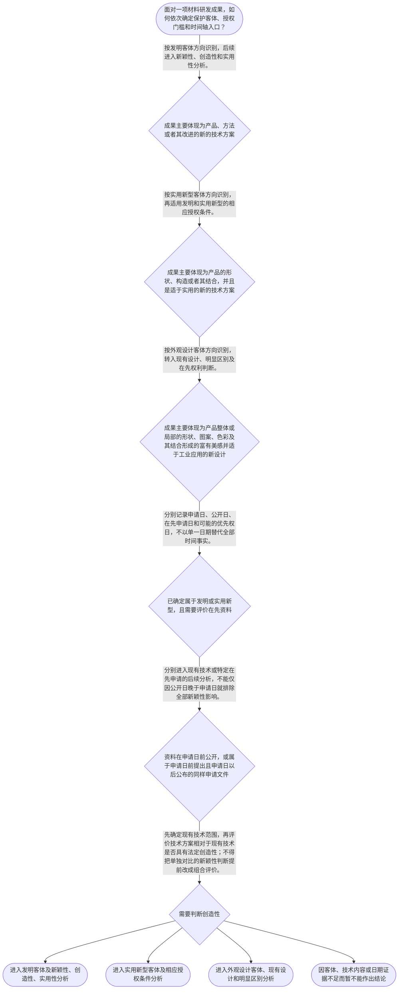

# 整合后的课程完整内容与习题

## 教学模块选择清单

- 当前教学节点：`patent-law-foundation`
- 板块预算：自适应 5/6，总计 9/9

| # | 模块 (block_type) | 类型 | 触发原因 (trigger) | 对应正文段 | 归属 |
|---:|---|:--:|---|---|:--:|
| 1 | `anchor_scenario` | 自适应 | perception=sensing(0.88) / P(L)=0.15<0.3 / cold_start | 材料研发成果的专利入口｜某材料研发团队完成了一种固态电池硫化物电解质薄膜：团队认为配方和制备方法带来了明显性能改善，… | [A+B融合] |
| 2 | `legal_anchor` | 必选 | mandatory | 法条锚定：客体、三性与时间基准｜《专利法》第二条 | [A+B融合] |
| 3 | `worked_example` | 自适应 | cognition.apply=0.18<0.4 / cognition.analyze=0.12<0.3 / cold_start | 从材料研发事实到专利判断｜某团队研发出一种用于锂离子电池的复合正极材料，改进包括材料配方和制备工艺；同一项目还设计了配… | [A+B融合] |
| 4 | `decision_flow` | 自适应 | input=visual(0.81) | 材料专利基础判断流程｜面对一项材料研发成果，如何依次确定保护客体、授权门槛和时间轴入口？ | [A+B融合] |
| 5 | `mnemonic` | 自适应 | understanding=sequential(0.74) | 客体、三性与时间轴速记表｜“对象—三性—时间”三栏记忆表。对象栏记“技、构、形”：技对应发明技术方案，构对应实用新型产… | [A+B融合] |
| 6 | `reflect_prompt` | 自适应 | processing=reflective(0.68) | 把研发经验连接到专利判断｜回想一项你熟悉的材料研发成果：其核心贡献更接近材料组成、制备方法、产品构造还是视觉外形？若发… | [A+B融合] |
| 7 | `assessment` | 必选 | mandatory | 基础概念与时间边界测评｜识别《专利法》第二条规定的外观设计保护对象。 | [A+B融合] |
| 8 | `knowledge_synthesis` | 必选 | mandatory | 专利法律制度基础知识网｜保护客体：先区分发明、实用新型和外观设计，再选择相应法律门槛；材料配方和制备方法通常应从发明… | [A+B融合] |
| 9 | `summary_card` | 自适应 | len(knowledge_sub_nodes)=3>=3 | 本节专利基础速查卡｜先定保护客体，再定授权规则；新颖性和创造性分开判断，所有在先资料先放入准确时间轴。 | [A+B融合] |

## 教学正文

## 一、本节定位：先立制度地基

材料领域专利分析不能一上来只问“技术效果是否更好”。应先完成三步：第一，识别成果属于发明、实用新型还是外观设计；第二，确定相应的授权条件和规范层级；第三，把申请日、公开日、在先申请日和优先权日放入时间轴。只有完成这三步，后续的新颖性和创造性判断才有可靠入口。

专利制度可以理解为以公开技术换取一定范围、一定期限和一定法域内的排他保护。这里的“排他”不是对整个材料领域的抽象垄断，具体保护范围仍要回到权利要求记载的全部技术特征；时间和地域也会限制权利效力。

## 二、保护客体：先判断“保护什么”

《专利法》第二条规定，发明创造包括发明、实用新型和外观设计。发明是“对产品、方法或者其改进所提出的新的技术方案”；实用新型是“对产品的形状、构造或者其结合所提出的适于实用的新的技术方案”；外观设计是对产品整体或局部的形状、图案或者其结合以及色彩与形状、图案的结合所作出的富有美感并适于工业应用的新设计。〔RAG: 中华人民共和国专利法.txt — 第二条：本法所称的发明创造是指发明、实用新型和外观设计；发明针对产品、方法或者其改进的新的技术方案；实用新型针对产品的形状、构造或者其结合；外观设计针对产品整体或局部的形状、图案、色彩及其结合形成的新设计〕

放到材料领域，电解质配方、正极材料组成和制备方法，通常应从发明客体方向识别，因为它们体现的是产品、方法或其改进的技术方案。若技术贡献是电池壳体、设备部件等产品的形状、构造或者其结合，才可能进入实用新型客体方向。若保护重点是壳体表面的图案、色彩或整体视觉形态，则应从外观设计客体方向分析。方法技术方案不能直接改用实用新型保护，外观设计也不是用来保护化学组成或单纯性能参数的。

三类客体的边界必须以技术内容为准，而不能只看项目名称。一个材料研发项目可以同时包含配方、工艺、产品构造和视觉外形，但这些内容应分别拆开识别，不能因为属于同一个项目就自动适用同一种专利类型。

## 三、专利权的基本特征与制度作用

专利权具有独占性、时间性和地域性。独占性表示在有效权利范围内，权利人可以依法排除他人未经许可实施受保护的技术方案；时间性表示专利权不是永久权利，其效力受法定存续期间限制；地域性表示专利权原则上依授予该权利的国家或地区法律发生效力，中国专利授权不会自动覆盖美国、欧洲或其他市场。

对材料企业而言，独占性不能理解为“别人不能研究整个材料领域”，而应理解为不能在权利要求限定的范围内未经许可实施受保护方案。时间性要求研发记录和申请文件准确区分不同日期；地域性要求企业进行海外布局时，分别核对目标法域的申请和授权状态。

专利制度的作用包括激励发明创造、促进技术公开、推动技术应用和经济发展。申请人通过公开技术内容换取一定期限的排他保护，公众则可以从公开的专利文件中获得技术信息，并在法律允许的范围内继续研究和应用。专利不是单纯的赚钱工具，而是一种“公开与保护”的制度交换。

中国专利制度的规范体系可以按三个层次理解：专利法提供基本法律规则，专利法实施细则补充申请和审查程序，专利审查指南进一步细化审查实践中的判断方法。本节检索上下文未提供实施细则和审查指南的完整具体原文，因此不对未检索到的具体条文号和操作细节作断言。

中国制度存在初步审查和实质审查等不同审查环节。关于早期公开、延迟审查以及具体历史沿革，本节检索上下文未提供足以核验全部细节的直接历史资料，因此这里只保留制度特点的概括性认识，不延伸到具体年代或未经核验的程序结论。

## 四、三性与新颖性、创造性的入口

《专利法》第二十二条规定，授予专利权的发明和实用新型，应当具备新颖性、创造性和实用性。新颖性是指该发明或者实用新型不属于现有技术，也没有任何单位或者个人就同样的发明或者实用新型在申请日以前向国务院专利行政部门提出过申请，并记载在申请日以后公布的专利申请文件或者公告的专利文件中。创造性是指与现有技术相比，发明具有突出的实质性特点和显著的进步，实用新型具有实质性特点和进步；实用性是指能够制造或者使用，并且能够产生积极效果。〔RAG: 中华人民共和国专利法.txt — 第二十二条：发明和实用新型应具备新颖性、创造性和实用性；新颖性涉及现有技术及申请日前提出、申请日以后公布的同样申请文件；创造性须与现有技术相比；实用性要求能够制造或者使用并产生积极效果〕

初学时要牢牢记住：新颖性与创造性都是授权门槛，但不是同一个问题。新颖性首先问“是否已有一份相关公开或法定在先申请直接覆盖同样的完整技术方案”；创造性则是在确定现有技术基础后，进一步问该技术方案相对于现有技术是否达到法律要求。不能因为材料的循环寿命、离子电导率或其他性能有改善，就跳过完整技术特征比较，直接认定具备创造性；也不能把创造性所需的组合评价提前用于新颖性判断。

现有技术的时间界限原则上是申请日以前，地域上没有限制，只要在国内外为公众所知即可。检索材料明确指出，享有优先权时，相关时间界限涉及优先权日，申请日或优先权日当天公开的技术内容不属于此前公开的现有技术。〔RAG: 专利法律知识详细解读.txt — 现有技术是申请日以前在国内外为公众所知的技术；有优先权时指优先权日；申请日或优先权日当天公开的技术内容不属于现有技术〕

因此，分析论文、展会展示、公开使用、口头报告或专利文件时，先分别记录发生日期、公开日期和公开内容。公开是否构成现有技术，还要确认公众是否能够得知实质性技术内容；负有保密义务的人之间的保密状态不能简单等同于向公众公开，但违反保密义务导致公众得知后，法律作用可能发生变化。〔RAG: 专利法律知识详细解读.txt — 使用公开以公众能够得知产品或者方法之日为公开日；口头公开以发生之日为公开日；保密状态下的技术不属于现有技术，泄露导致公众能够得知后可构成现有技术〕

## 五、申请日、公开日与两类优先权

《专利法》第二十八条规定，国务院专利行政部门收到专利申请文件之日为申请日；申请文件邮寄的，以寄出的邮戳日为申请日。〔RAG: 中华人民共和国专利法.txt — 第二十八条：国务院专利行政部门收到专利申请文件之日为申请日，邮寄的以寄出邮戳日为申请日〕申请日是判断现有技术和部分在先申请规则的重要时间锚点，不能用研发完成日、实验成功日或新闻发布日替代。

《专利法》第二十九条同时规定外国优先权和本国优先权。外国优先权的典型结构是：申请人先在外国提出第一次专利申请，再在规定期限内就相同主题向中国提出申请；本国优先权则以在中国第一次提出的申请为基础，再就相同主题向国务院专利行政部门提出申请。两者都必须核对第一次申请地点、相同主题、期限以及是否完成相应手续，不能只看到“要求优先权”就直接认定优先权成立。〔RAG: 中华人民共和国专利法.txt — 第二十九条：发明或者实用新型外国优先权期限为十二个月，外观设计外国优先权期限为六个月；相同主题在中国第一次申请后再次向国务院专利行政部门申请，也可依规定享有本国优先权〕

《专利法》第三十条规定，要求发明、实用新型或外观设计专利优先权时，应在申请时提出书面声明，并按相应期限提交第一次提出的专利申请文件副本；未提出书面声明或者逾期未提交副本的，视为未要求优先权。〔RAG: 中华人民共和国专利法.txt — 第三十条：要求优先权应在申请时提出书面声明，并在规定期限内提交第一次提出的专利申请文件副本；逾期的视为未要求优先权〕

遇到竞争对手申请“公开较晚”的情形，不能只看公开日作出绝对结论。应依次核对：竞争对手是否在本申请日前提出申请；文件是否记载同样的发明或者实用新型；文件是否在申请日以后公布；本申请是否主张并有效取得优先权。普通现有技术与申请日以后公布的特定在先申请应分开处理：前者可以进入新颖性和创造性分析，后者主要按照新颖性规则核对其特殊法律作用。

## 六、从材料事实到法律结论：完整示范

**案情。**某团队研发出一种用于锂离子电池的复合正极材料，改进包括材料配方和制备工艺；同一项目还设计了配套电池壳体的特殊形状。团队准备在中国申请专利，并发现竞争对手曾就相近技术提出申请，但公开时间晚于团队申请日。现在需要确定这些成果如何进入专利制度，以及后续新颖性和创造性判断从哪里开始。

**适用规则。**《专利法》第二条用于识别发明、实用新型和外观设计客体；第二十二条用于确定发明和实用新型的三性、现有技术及特定在先申请规则；第二十八条至第三十条用于确定申请日和优先权的基本时间、类型及手续。

**分步推理。**第一步，拆分配方、制备方法、壳体构造和壳体视觉外形，而不是把整个研发项目作为一个不可分割的对象。第二步，配方和制备方法进入发明客体方向；产品形状或构造的技术改进才可能进入实用新型客体方向；视觉外形进入外观设计客体方向。第三步，确定发明或实用新型后，分别进入新颖性、创造性和实用性判断，不能用“性能更好”替代三性分析。第四步，记录团队申请日、竞争对手在先申请日、有关文件公开日和可能的优先权日。第五步，竞争对手文件公开较晚并不自动排除其作为特定在先申请文件的可能性，仍须核对申请日在先、技术内容相同和其他法定条件。

**结论。**该项目应先依技术内容拆分保护客体，再选择发明、实用新型或外观设计的分析路径；确定为发明或实用新型后，才分别进入新颖性和创造性判断，并以准确的申请日、公开日和优先权事实为基础。

## 七、常见误区与区分判据

**误解一：“材料性能提升了，所以一定具备创造性。”**

正解推理：性能改善可以是技术效果或证据，但创造性要求将技术方案与现有技术进行比较，并判断是否达到法定标准。仅凭“循环寿命更长”或“电导率更高”不能替代对完整技术特征、技术效果和现有技术关系的分析。

区分判据：题干若只给出效果，不足以直接完成创造性判断；必须继续找出完整技术方案、对比基础和是否存在显而易见的判断依据。

**误解二：“竞争对手的专利文件公开日晚于申请日，所以绝不影响新颖性。”**

正解推理：普通现有技术通常要求申请日前已经为公众所知，但《专利法》第二十二条还规定了申请日前提出、申请日以后公布并记载同样发明或者实用新型的特定在先申请文件规则。它与普通现有技术不是同一概念，不能仅凭公开日晚于申请日就全部排除。

区分判据：至少核对四项：在先申请日、公开日、技术内容是否相同、是否适用发明或实用新型的法定范围。四项事实未核齐，不作绝对结论。

**误解三：“外国优先权和本国优先权都是优先权，处理方式完全一样。”**

正解推理：外国优先权以外国第一次申请为基础，本国优先权以中国第一次申请为基础；二者的申请地点、相同主题、期限和手续需要分别核对。本国优先权还可能牵涉在先中国申请的后续法律状态，不能机械套用外国优先权的理解。

区分判据：先问第一次申请在哪个法域提出，再核对是否为相同主题、是否在相应期限内提出后申请、是否按第三十条完成声明和副本手续。

**误解四：“研发完成日就是专利分析中的申请日。”**

正解推理：研发完成、首次公开、向专利行政部门提出申请和主张优先权是不同事件。《专利法》第二十八条以收到专利申请文件之日确定申请日，邮寄申请另有寄出邮戳规则。

区分判据：制作时间轴时至少分列研发完成日、申请日、公开日、在先申请日和优先权日；任何一个日期都不能未经规则核验而替代其他日期。

本节设有测评，请到【习题】区作答。

### 材料研发成果的专利入口（anchor_scenario）

> 某材料研发团队完成了一种固态电池硫化物电解质薄膜：团队认为配方和制备方法带来了明显性能改善，同时还设计了电池壳体的特殊外形。负责人准备在行业展会展示样品，但竞争对手的一份相关专利申请可能早于本团队提出申请，只是公开时间较晚。团队因此同时面对几个入口问题：成果属于哪种专利客体，公开和申请的日期如何记录，以及后续应当分别从新颖性还是创造性角度分析。

**锚定**：用材料产品、制备方法、产品外形和在先申请的时间事实，锚定保护客体、授权条件以及申请日和公开日的基础概念。

**先想一想**：如果你是团队的专利代理人，面对配方、制备方法和壳体外形这几类事实，你会先识别保护客体，还是先比较竞争对手的申请？排序依据是什么？

### 法条锚定：客体、三性与时间基准（legal_anchor）

- **《专利法》第二条**：第二条先划定三类保护对象：发明针对产品、方法或者其改进的新的技术方案；实用新型针对产品的形状、构造或者其结合；外观设计针对产品整体或局部的视觉设计。
- **《专利法》第二十二条**：第二十二条把发明和实用新型的授权入口分为新颖性、创造性和实用性，并同时规定现有技术以及申请日前提出、申请日以后公布的同样申请文件的基本规则。
- **《专利法》第二十三条**：第二十三条针对外观设计规定现有设计、明显区别和在先合法权利冲突，不能直接套用发明和实用新型的三性表述。
- **《专利法》第二十八条至第三十条**：第二十八条确定申请日的基本方式；第二十九条区分外国优先权和本国优先权及其期限；第三十条要求在申请时提出书面声明并按规定提交在先申请文件副本。

**为何重要**：新颖性和创造性判断必须先确定保护客体、适用门槛和时间基准。法条锚点还能防止把普通现有技术、申请日以后公开的特定在先申请、外国优先权和本国优先权混为一谈。

### 从材料研发事实到专利判断（worked_example）

**案情/例题**：某团队研发出一种用于锂离子电池的复合正极材料，改进包括材料配方和制备工艺；同一项目还设计了配套电池壳体的特殊形状。团队在中国准备申请专利，并发现竞争对手曾就相近技术提出申请，但公开时间晚于团队申请日。现需演示：如何识别保护客体，并确定后续新颖性、创造性和时间轴分析的起点。
**适用规则**：《专利法》第二条关于三类专利客体的规定；《专利法》第二十二条关于发明和实用新型的新颖性、创造性、实用性及现有技术的规定；《专利法》第二十八条至第三十条关于申请日和优先权的规定。
**分步推演**：
1. 先拆分技术事实，而不是根据项目名称整体归类。复合正极材料的组成和制备工艺分别体现产品和方法层面的技术方案；壳体的结构形状与壳体的视觉外形可能是不同的保护内容。 → *先拆分事实，再识别客体。*
2. 根据《专利法》第二条，产品、方法或者其改进的新的技术方案进入发明客体方向；产品的形状、构造或者其结合所提出的适于实用的新的技术方案，才进入实用新型客体方向；产品整体或局部的视觉设计进入外观设计客体方向。 → *发明、实用新型和外观设计的客体边界不同。*
3. 确定属于发明或实用新型后，才进入新颖性、创造性和实用性分析。新颖性首先要求方案不属于现有技术，也要核对是否存在申请日前提出、申请日以后公布的同样申请文件；创造性则是与现有技术相比的进一步授权条件，不能仅因性能改善就直接认定成立。 → *三性是后续授权判断，不能用技术效果替代完整分析。*
4. 把团队申请日、竞争对手在先申请日、有关文件公开日以及本申请主张的优先权日分别列出。现有技术的时间界限原则上是申请日以前；有优先权时，检索材料显示应以优先权日作为相应时间基准，申请日当天公开的技术内容不属于申请日前公开的现有技术。 → *先固定时间基准，再判断资料的法律作用。*
5. 竞争对手文件公开较晚这一事实不能单独得出结论，还必须核对其是否在本申请日前提出、是否记载同样发明以及其他法定条件。外国优先权与本国优先权也要分别核对第一次申请地点、相同主题、期限和手续。 → *申请日、公开日、优先权和技术同一性必须联动核验。*
**结论**：该研发项目应先将配方、制备方法、产品构造和视觉外形拆开识别。配方和制备方法属于发明客体方向，产品形状或构造的技术改进才可能进入实用新型客体方向，单纯视觉外形则进入外观设计客体方向。确定客体后，才分别进入相应授权条件，并用申请日、公开日和可能的优先权日建立时间轴。
**本题要点**：材料专利分析应按“拆分技术事实—识别客体—确定授权门槛—固定时间轴—分别评价新颖性和创造性”的顺序进行。

### 材料专利基础判断流程（decision_flow）

**决策问题**：面对一项材料研发成果，如何依次确定保护客体、授权门槛和时间轴入口？



### 客体、三性与时间轴速记表（mnemonic）

**记忆锚**：“对象—三性—时间”三栏记忆表。对象栏记“技、构、形”：技对应发明技术方案，构对应实用新型产品形状构造，形对应外观设计视觉设计；三性栏记“新、创、实”；时间栏固定写“申请、公开、优先权”三个日期。对在先申请再加一句区分：公开晚不等于当然无关，必须核对在先申请日、同样发明和法定公开条件。
**映射**：
- 对象
- 技
- 构
- 形
- 新—创—实
- 申请—公开—优先权
- 外国≠本国
**何时用**：看到材料配方、制备方法、产品结构、外观设计或在先专利文件时，先填写“对象—三性—时间”三栏；遇到优先权题目时，再单独核对外国或本国类型及其手续。

### 把研发经验连接到专利判断（reflect_prompt）

**反思问题**：回想一项你熟悉的材料研发成果：其核心贡献更接近材料组成、制备方法、产品构造还是视觉外形？若发现论文、展会展示和竞争对手专利申请，你会分别记录哪些日期并先核对哪一项事实？

**关注要点**：技术特征是产品、方法、形状构造还是视觉设计；权利要求要保护的是完整技术方案，而不是孤立的性能结果；申请日、公开日、在先申请日和优先权日的法律作用不同；外国优先权与本国优先权的第一次申请地点和手续要求不同

**连接**：连接到已学的材料研发项目，并为后续学习申请程序、现有技术、新颖性、抵触申请和优先权判断建立日期记录习惯。

### 专利法律制度基础知识网（knowledge_synthesis）

**知识框架**：
- 保护客体：先区分发明、实用新型和外观设计，再选择相应法律门槛；材料配方和制备方法通常应从发明客体方向识别，产品形状构造和视觉外形分别适用不同客体分析。
- 专利权基本特征：独占性体现授权范围内的排他保护，时间性体现权利具有法定存续边界，地域性体现专利权原则上依授予法域发生效力。
- 中国专利制度体系：专利法提供基本法律规则，专利法实施细则补充程序事项，专利审查指南细化审查实践；本节检索上下文未提供后两者的具体原文，不能据此虚构具体条文号。
- 授权条件入口：发明和实用新型围绕新颖性、创造性和实用性展开；外观设计围绕现有设计、明显区别和在先合法权利等规则展开。
- 制度作用与审查特点：专利制度通过公开与期限性排他保护激励发明创造、促进技术传播和应用；中国制度存在初步审查与实质审查等不同审查环节，关于早期公开、延迟审查的具体历史沿革，本节检索上下文未提供直接依据。
- 时间轴基础：现有技术原则上看申请日以前在国内外为公众所知的技术；若涉及优先权，应另行核对优先权条件，并将申请日、公开日、在先申请日分开记录。
**概念关系**：先识别保护客体，再确定适用的授权条件。；发明和实用新型确定进入三性分析后，先固定申请日或依法适用的优先权时间基准，再分别判断新颖性和创造性。；现有技术与申请日以前提出、申请日以后公布的同样申请文件应分开处理：前者可作为新颖性和创造性分析的基础，后者的法律作用主要在新颖性判断中核对。；外国优先权与本国优先权分别核对第一次申请地点、相同主题、期限及手续，不能只看一个日期。
**必记**：发明、实用新型和外观设计的保护客体不同，方法技术方案不能直接改用实用新型保护。；发明和实用新型的三性是新颖性、创造性和实用性；新颖性关注是否属于现有技术及特定在先申请规则，创造性是相对于现有技术的另一项判断，二者不能混同。；专利权具有独占性、时间性和地域性，保护范围还必须回到权利要求的记载。；分析在先资料必须分别记录申请日、公开日、在先申请日和优先权日；公开日晚于申请日不当然排除其作为特定在先申请文件的可能性。；本节只建立专利制度基础和判断入口，创造性具体判断方法、抵触申请细节和优先权完整要件应在后续节点继续学习。

### 本节专利基础速查卡（summary_card）

**要点卡**：
- **三类保护客体**：发明看产品、方法或其改进的技术方案；实用新型看产品形状构造；外观设计看产品视觉设计。
- **专利权三特征**：独占性、时间性、地域性共同限定专利权的排他范围、存续边界和法域效力。
- **中国制度体系**：专利法定基本规则，实施细则补程序，审查指南细化审查实践；未检索到的具体内容不能自行补造。
- **新颖性与创造性**：新颖性与现有技术及特定在先申请规则相连，创造性是相对于现有技术的独立授权门槛。
- **时间轴**：申请日、公开日、在先申请日和优先权日必须分开记录，再判断资料的法律作用。
- **两类优先权**：外国优先权和本国优先权要分别核对第一次申请地点、相同主题、期限和手续。
**必背**：《专利法》第二条区分发明、实用新型和外观设计三类客体。；《专利法》第二十二条规定发明和实用新型应具备新颖性、创造性和实用性，并定义现有技术。；现有技术原则上看申请日以前在国内外为公众所知的技术；有优先权时要核对依法适用的时间基准。；抵触申请不能简单等同于普通现有技术：必须核对申请日前提出、申请日以后公布、同样发明及其他法定条件，且其作用边界主要在新颖性判断。；外国优先权与本国优先权不能混同，申请日、公开日和优先权日不能互相替代。
**一句话总结**：先定保护客体，再定授权规则；新颖性和创造性分开判断，所有在先资料先放入准确时间轴。

### 基础概念与时间边界测评（assessment）

**三类覆盖**：backward_review、forward_probe、weakness_probe
**题目**：
- q_foundation_01：识别《专利法》第二条规定的外观设计保护对象。
- q_process_01：探测发明专利申请基本文件的构成。
- q_foundation_02：根据申请日、在先申请日和公开日区分新颖性时间轴中的不同资料。


## 结构化数据

## expert

```json
"A+B融合"
```

## style

```json
"fused"
```

## knowledge_points

```json
[
  {
    "node_id": "patent-law-foundation",
    "kc_name": "专利制度的基本概念与特征：独占性、时间性、地域性"
  },
  {
    "node_id": "patent-law-foundation",
    "kc_name": "中国专利制度体系：专利法、专利法实施细则、专利审查指南"
  },
  {
    "node_id": "patent-law-foundation",
    "kc_name": "专利保护的三种客体：发明、实用新型、外观设计（专利法第二条）"
  },
  {
    "node_id": "patent-law-foundation",
    "kc_name": "专利制度的作用：激励发明创造、促进技术公开、推动技术应用和经济发展"
  },
  {
    "node_id": "patent-law-foundation",
    "kc_name": "中国专利制度发展历程与特点：早期公开延迟审查、初步审查制与实质审查制并存"
  }
]
```

## legal_basis

```json
[
  {
    "article": "《专利法》第二条",
    "source": "中华人民共和国专利法.txt：第二条规定发明、实用新型和外观设计的定义。"
  },
  {
    "article": "《专利法》第二十二条",
    "source": "中华人民共和国专利法.txt：第二十二条规定发明和实用新型的新颖性、创造性、实用性、现有技术及申请日前提出的同样申请文件规则。"
  },
  {
    "article": "《专利法》第二十三条",
    "source": "中华人民共和国专利法.txt：第二十三条规定外观设计的现有设计、明显区别及在先合法权利冲突。"
  },
  {
    "article": "《专利法》第二十八条",
    "source": "中华人民共和国专利法.txt：第二十八条规定国务院专利行政部门收到专利申请文件之日为申请日，邮寄申请以寄出邮戳日为申请日。"
  },
  {
    "article": "《专利法》第二十九条",
    "source": "中华人民共和国专利法.txt：第二十九条规定发明、实用新型和外观设计外国优先权以及相同主题本国优先权的基本条件。"
  },
  {
    "article": "《专利法》第三十条",
    "source": "中华人民共和国专利法.txt：第三十条规定要求优先权时提出书面声明及提交在先申请文件副本的手续。"
  },
  {
    "article": "现有技术的时间和地域边界",
    "source": "专利法律知识详细解读.txt：现有技术是申请日以前在国内外为公众所知的技术；有优先权时涉及优先权日；申请日当天公开的技术内容不属于申请日前公开的现有技术。"
  }
]
```

## risks

```json
[
  {
    "risk": "将材料性能改善直接等同于具备创造性，忽略创造性须相对于现有技术进行完整判断。",
    "related_node_id": "patent-law-foundation"
  },
  {
    "risk": "将申请日以后公开的同样申请文件简单排除在新颖性分析之外，未核对其在申请日前提出、技术内容相同等法定条件。",
    "related_node_id": "patent-law-foundation"
  },
  {
    "risk": "混淆外国优先权与本国优先权，或只记录公开日而忽略申请日、在先申请日和优先权日。",
    "related_node_id": "patent-law-foundation"
  },
  {
    "risk": "本节检索上下文未提供专利法实施细则和专利审查指南的完整具体原文；关于其具体条文号、审查操作细节以及早期公开延迟审查的具体历史沿革不作超出依据的断言。",
    "related_node_id": "patent-law-framework"
  },
  {
    "risk": "把中国专利授权理解为自动覆盖海外市场，或忽略权利要求对保护范围的限定。",
    "related_node_id": "patent-rights-nature"
  }
]
```

## draft_stage

```json
"integration"
```

## irac

```json
{
  "issue": "材料领域研发成果属于哪一种专利保护客体，专利权具有什么基本特征，以及在开始新颖性和创造性判断前应如何确定法律规则和时间轴。",
  "rule": "《专利法》第二条界定发明、实用新型和外观设计；《专利法》第二十二条规定发明和实用新型应具备新颖性、创造性和实用性，并规定现有技术及申请日前提出、申请日以后公布的同样申请文件；《专利法》第二十三条规定外观设计的现有设计、明显区别和在先合法权利规则；《专利法》第二十八条至第三十条规定申请日及外国、本国优先权的基本条件和手续。专利权具有独占性、时间性和地域性。",
  "application": "对材料研发成果，先根据技术内容区分产品、方法、产品形状构造和视觉设计，再选择发明、实用新型或外观设计的法律入口。确定为发明或实用新型后，依《专利法》第二十二条分别考虑新颖性、创造性和实用性；分析在先资料时分别记录申请日、公开日、在先申请日和优先权日。申请日前已为公众所知的技术与申请日前提出、申请日以后公布的同样申请文件不得混为一谈；外国优先权和本国优先权也应分别核对条件与手续。",
  "conclusion": "专利制度基础的判断路径是先识别保护客体，再确定适用规范和授权门槛，最后建立准确时间轴。新颖性和创造性都是发明及实用新型的重要授权条件，但新颖性、特定在先申请和创造性具有不同判断对象与作用边界，本节仅建立入口，不替代后续专门节点。"
}
```

## interactive_questions

```json
[
  {
    "qid": "q_foundation_01",
    "category": "remember",
    "difficulty": "L1",
    "source_tag": "backward_review",
    "kc_node_id": "patent-law-foundation",
    "question": "根据《专利法》第二条，下列哪一项属于外观设计保护的主要对象？",
    "answer": "C",
    "options": [
      "A. 产品或方法所提出的新的技术方案",
      "B. 产品的形状、构造或者其结合所提出的新的技术方案",
      "C. 产品整体或局部的形状、图案、色彩及其结合形成的新设计",
      "D. 任何具有商业价值的技术信息"
    ]
  },
  {
    "qid": "q_process_01",
    "category": "remember",
    "difficulty": "L1",
    "source_tag": "forward_probe",
    "kc_node_id": "patent-application-process",
    "question": "一件发明专利申请通常涉及下列哪组基本申请文件？",
    "answer": "A",
    "options": [
      "A. 请求书、说明书及其摘要、权利要求书",
      "B. 只有产品样品和销售合同",
      "C. 只有技术人员简历和实验室照片",
      "D. 只有外观设计图片，不需要其他文件"
    ]
  },
  {
    "qid": "q_foundation_02",
    "category": "analyze",
    "difficulty": "L3",
    "source_tag": "weakness_probe",
    "kc_node_id": "patent-law-foundation",
    "question": "甲公司于2025年3月1日申请一项电池正极材料发明专利。乙公司此前已就同样发明向国务院专利行政部门提出申请，但乙公司的申请文件在2025年3月1日之后才公开。依据本节规则，最稳妥的初步判断是哪一项？",
    "answer": "B",
    "options": [
      "A. 乙公司的申请绝不可能影响甲公司的新颖性，因为公开日晚于甲公司申请日",
      "B. 应先分别记录甲公司的申请日、乙公司的在先申请日和公开日，再核对是否为同样发明及是否满足申请日以前提出、申请日以后公布等条件",
      "C. 只要乙公司的申请日晚于甲公司申请日，就当然构成抵触申请",
      "D. 该情形只能用于评价创造性，不能涉及新颖性"
    ]
  }
]
```

## knowledge_synthesis

```json
{
  "node": "patent-law-foundation",
  "coverage": [
    {
      "node_id": "patent-rights-nature"
    },
    {
      "node_id": "patent-law-framework"
    },
    {
      "node_id": "patent-law-foundation"
    },
    {
      "node_id": "patent-system-overview"
    }
  ],
  "confusable_pairs": [
    {
      "pair": "发明与实用新型：发明可以涉及产品、方法或者其改进的技术方案，实用新型限于产品的形状、构造或者其结合。"
    },
    {
      "pair": "现有技术与申请日以后公布的同样申请文件：现有技术原则上要求申请日前已在国内外为公众所知，申请日以后公布的同样申请文件应按特定在先申请规则单独核对。"
    },
    {
      "pair": "外国优先权与本国优先权：二者的第一次申请地点、适用期限和手续要求不同，不能仅凭“优先权”三字作相同处理。"
    },
    {
      "pair": "新颖性与创造性：新颖性关注是否属于现有技术及特定在先申请规则，创造性关注相对于现有技术是否达到法定创造性标准，不能用单一技术效果替代。"
    }
  ]
}
```
