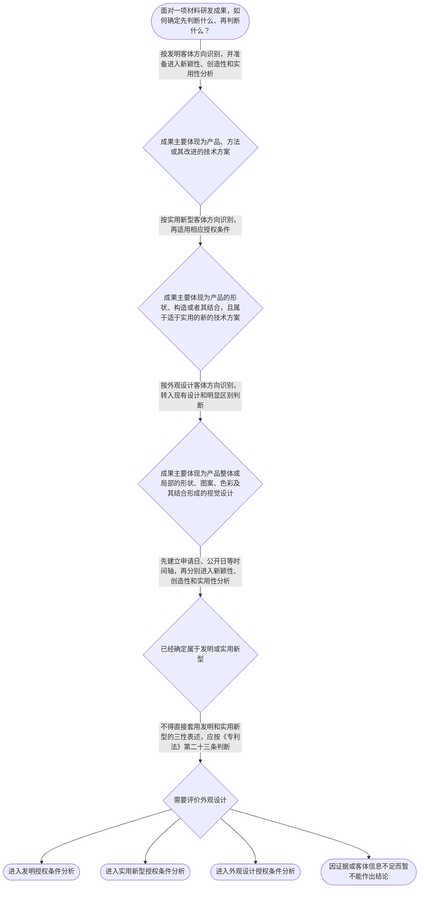

# 专家 A 教学草稿

> 专家：expert_a ｜ 风格：conservative

## 教学模块选择清单

- 当前教学节点：`patent-law-foundation`
- 板块预算：自适应 7/7，总计 9/9

| # | 模块 (block_type) | 类型 | 触发原因 (trigger) | 对应正文段 | 归属 |
|---:|---|:--:|---|---|:--:|
| 1 | `anchor_scenario` | 自适应 | perception=sensing(0.88) / P(L)=0.15<0.3 / cold_start | 电池材料研发成果的专利入口｜某电池材料研发团队完成了一种高镍正极材料：它调整了材料组成和制备方法，使电池循环寿命得到改善… | [A] |
| 2 | `legal_anchor` | 必选 | mandatory | 专利客体与授权三性的法条锚点｜《专利法》第二条 | [A] |
| 3 | `worked_example` | 自适应 | cognition.apply=0.18<0.4 / cognition.analyze=0.12<0.3 / cold_start | 从材料研发事实到专利制度判断｜某团队研发出一种用于锂离子电池的复合正极材料，核心改进是材料配方和制备工艺；团队同时设计了用… | [A] |
| 4 | `decision_flow` | 自适应 | input=visual(0.81) | 专利基础判断流程｜面对一项材料研发成果，如何确定先判断什么、再判断什么？ | [A] |
| 5 | `mnemonic` | 自适应 | understanding=sequential(0.74) | 客体—三性—时间轴速记表｜三步速记表：先看“对象”，再看“三性”，最后看“时间”；对象分为“技”（发明技术方案）、“构… | [A] |
| 6 | `reflect_prompt` | 自适应 | processing=reflective(0.68) | 把研发经验连接到专利判断｜回想一项你熟悉的材料研发成果：它的核心贡献究竟是材料组成、制备方法、产品构造，还是外观设计？… | [A] |
| 7 | `assessment` | 必选 | mandatory | 基础概念与时间边界测评｜识别《专利法》第二条规定的外观设计保护对象。 | [A] |
| 8 | `knowledge_synthesis` | 必选 | mandatory | 专利法律制度基础知识网｜专利保护客体：先区分发明、实用新型和外观设计，再选择相应法律门槛。 | [A] |
| 9 | `summary_card` | 自适应 | len(knowledge_sub_nodes)=3>=3 | 本节专利基础速查卡｜先定保护客体，再选授权规则；发明和实用新型看三性，时间轴贯穿后续审查。 | [A] |

## 教学正文

## I — 法律问题

材料技术方案进入专利制度后，首先要回答的不是“技术是否先进”，而是三个基础问题：第一，申请对象属于哪一种专利保护客体；第二，专利权具有什么法律边界；第三，授权审查依据哪些规范、通过哪些基本门槛。新颖性和创造性属于后续实体审查中的核心判断，但必须建立在保护客体和专利制度基本结构之上。

## R — 适用规则

### 1. 专利保护的三种客体

《专利法》第二条规定，发明创造包括发明、实用新型和外观设计。发明是“对产品、方法或者其改进所提出的新的技术方案”；实用新型是“对产品的形状、构造或者其结合所提出的适于实用的新的技术方案”；外观设计则针对产品整体或局部的形状、图案、色彩及其结合所形成的、富有美感并适于工业应用的新设计。〔RAG: 中华人民共和国专利法.txt — 第二条：发明创造包括发明、实用新型和外观设计，并分别规定三类客体〕

对材料领域而言，同一研发成果可能有不同的申请表达方式。例如，某种电池正极材料的组成、制备方法或改性方法，通常应先从“产品或方法技术方案”的角度识别其是否属于发明客体；如果主张的是产品的形状、构造或者其结合，则需要进一步判断是否符合实用新型客体的范围。外观设计关注的是产品外部视觉设计，而不是材料的化学组成或性能参数。

### 2. 专利权的基本特征

专利权具有独占性、时间性和地域性。独占性意味着在权利有效范围内，权利人依法排除他人实施受保护的技术方案；时间性意味着专利权不是永久权利，而是在法律规定的期限内存在；地域性意味着专利权原则上依其被授予的国家或地区法律发生效力，某一国家的授权不会当然产生全球保护。

因此，材料企业不能因为某项技术在中国获得专利，就直接推断该技术在其他国家或地区也已经获得同等保护；也不能因为技术具有长期商业价值，就推断专利权会无限期持续。专利权的保护范围还与权利要求书的记载密切相关，检索材料指出，发明或实用新型专利权的保护范围以权利要求的内容为准，说明书及附图可以用于解释权利要求。〔RAG: 专利法律知识详细解读.txt — 发明和实用新型专利权的保护范围以权利要求的内容为准，说明书及附图用于解释权利要求〕

### 3. 中国专利制度的规范层级

学习中国专利审查规则时，应区分三个层次：专利法提供基本法律依据；专利法实施细则对申请、审查和程序事项作进一步规定；专利审查指南则对审查实践中的判断方法、审查口径和操作步骤进行细化。本节检索上下文未提供实施细则和审查指南的具体原文，因此这里只说明规范层级，不对未检索到的具体条文号作延伸断言。

在新颖性和创造性问题上，专利法首先提供总原则。《专利法》第二十二条规定，授予专利权的发明和实用新型应当具备新颖性、创造性和实用性；新颖性要求该发明或实用新型不属于现有技术，且不存在在申请日以前提出、在申请日以后公开并记载同样发明或实用新型的专利申请文件或公告文件；创造性要求发明具有突出的实质性特点和显著的进步，实用新型具有实质性特点和进步。〔RAG: 中华人民共和国专利法.txt — 第二十二条：三性定义、现有技术定义及申请日以前提出而申请日以后公开的同样申请文件规则〕

这里应先形成一个基础区分：新颖性主要围绕“是否已有同样技术方案被公开或被特定在先申请记载”展开；创造性则进一步评价相对于现有技术是否具有突出的实质性特点和显著的进步。二者都不能脱离权利要求所限定的完整技术方案进行判断。外观设计适用的是《专利法》第二十三条规定的现有设计和明显区别标准，而不是直接套用发明、实用新型的三性表述。〔RAG: 中华人民共和国专利法.txt — 第二十三条：外观设计不得属于现有设计，并应当具有明显区别〕

### 4. 专利制度的作用与审查制度特点

专利制度的基本功能包括：以一定期限和地域范围内的独占性权利激励发明创造；以公开技术换取法律保护，促进技术传播；推动技术实施、应用和产业发展。对材料研发而言，专利文件的公开既可能形成企业的技术资产，也可能成为后来申请进行新颖性和创造性检索时需要面对的技术资料。

中国专利审查制度同时包含初步审查和实质审查等不同审查环节。初步审查主要处理申请文件形式和部分程序、明显实质性问题；实质审查则进一步评价发明专利申请是否满足授权条件，包括新颖性、创造性和实用性等问题。关于中国制度发展中“早期公开、延迟审查”等具体历史表述，本节检索上下文未提供直接历史资料，故不展开具体年代或制度沿革判断。

## A — 规则适用

面对一项电池材料研发成果，可以按以下顺序建立审查思路：

1. 先识别保护客体。明确申请主张的是材料产品、制备方法、使用方法、产品形状构造，还是外观视觉设计。不能因为技术名称中出现“材料”二字，就当然认定其属于某一种专利类型。
2. 再确定适用的法律门槛。发明和实用新型应围绕新颖性、创造性和实用性展开；外观设计则围绕现有设计、明显区别以及合法权利冲突等条件展开。
3. 在发明或实用新型分析中，先处理新颖性，再处理创造性。新颖性判断要求关注完整技术方案与在先技术资料之间的对应关系；不能把多个不同文献分别披露的特征简单拼接后，直接作为单一文献否定新颖性的依据。
4. 创造性判断是在现有技术基础上进一步评价技术方案是否显而易见。当前节点只建立概念边界，不提前展开创造性具体三步法；后续学习应再结合本领域技术人员、最接近现有技术和技术启示等要素进行细化。
5. 最后检查权利范围和地域、时间边界。材料企业在进行全球布局时，应分别核对不同法域的申请和授权状态；在分析某份技术资料是否具备法律上的在先作用时，应核对申请日、公开日以及适用的优先权事实，而不能只看研发完成日。

## C — 结论

专利法律制度基础的核心，是先明确“保护什么”、再明确“依据什么规则审查”、最后进入“是否满足授权条件”的判断。对材料领域专利而言，发明、实用新型和外观设计的客体边界不同；发明和实用新型的新颖性、创造性、实用性是相互独立但共同构成的授权门槛。新颖性重在同样技术方案与时间边界，创造性重在相对于现有技术是否显而易见；抵触申请、优先权和公开时间轴应在后续节点中严格区分。

> 常见误区 / 易混淆点
>
> - 把“技术效果好”直接等同于具备创造性。技术效果可以作为评价因素，但不能替代完整的创造性判断。
> - 把抵触申请直接当作普通现有技术使用。根据本节检索到的《专利法》第二十二条，二者在时间结构和法律作用上需要分别识别；具体适用边界应结合后续节点和审查指南核对。
> - 混淆申请日、公开日和优先权日。判断在先技术或在先申请的法律作用，必须先画出时间轴。
> - 把外国授权或中国授权理解为全球专利权。专利权具有地域性，保护范围还受权利要求内容限制。

本节设有测评，请到【习题】区作答。

### 电池材料研发成果的专利入口（anchor_scenario）

> 某电池材料研发团队完成了一种高镍正极材料：它调整了材料组成和制备方法，使电池循环寿命得到改善。团队准备在中国申请专利，同时还讨论是否要为材料颗粒的特殊外形申请另一类专利。研发负责人还发现，竞争对手曾提交过一份相关申请，但公开时间晚于本团队的申请日。此时，团队需要分别处理保护客体、申请类型、新颖性和在先申请时间轴等问题。

**锚定**：用材料产品、制备方法、外观形态和在先申请的具体事实，锚定专利客体、三性门槛以及时间边界。

**先想一想**：面对这项电池材料成果，你会先判断申请哪一种专利客体，还是先比较竞争对手的技术资料？你的排序依据是什么？

### 专利客体与授权三性的法条锚点（legal_anchor）

- **《专利法》第二条**：第二条先划定三类专利保护的对象：发明重在产品、方法及其改进的技术方案，实用新型重在产品形状和构造，外观设计重在产品的视觉设计。
- **《专利法》第二十二条**：第二十二条规定发明和实用新型要过新颖性、创造性和实用性三道门，并给出现有技术及特定在先申请文件的基本定义。
- **《专利法》第二十三条**：第二十三条针对外观设计设置现有设计、明显区别和权利冲突等判断要求，不能直接用发明专利的三性表述替代。

**为何重要**：学习新颖性和创造性前，必须先知道不同专利客体适用的法律门槛。法条锚定还能避免把发明、实用新型、外观设计以及普通现有技术、特定在先申请混为一谈。

### 从材料研发事实到专利制度判断（worked_example）

**案情/例题**：某团队研发出一种用于锂离子电池的复合正极材料，核心改进是材料配方和制备工艺；团队同时设计了用于装配该材料的特殊电池壳体外形。团队希望判断这些成果分别应如何进入专利制度，并理解后续新颖性、创造性分析的起点。
**适用规则**：《专利法》第二条规定发明、实用新型和外观设计的保护客体；《专利法》第二十二条规定发明和实用新型的三性及现有技术；《专利法》第二十三条规定外观设计的现有设计和明显区别。
**分步推演**：
1. 先观察技术特征的性质：复合正极材料的配方和制备工艺属于产品或方法层面的技术方案，壳体外形则属于产品外部视觉设计层面的事实。 → *先按技术内容而不是商业名称识别保护客体。*
2. 将配方和制备工艺与《专利法》第二条中的发明定义进行对应；如果主张的是壳体的形状、构造及其结合，还需判断是否符合实用新型的客体边界；如果主张的是视觉外形，则进入外观设计客体分析。 → *同一研发项目的不同技术成果可能对应不同专利客体。*
3. 确定客体后，发明或实用新型再进入新颖性、创造性和实用性分析；外观设计则依照现有设计和明显区别等规则分析。 → *客体识别决定后续适用哪一组授权条件。*
4. 新颖性和创造性不能仅凭研发人员认为‘效果更好’就直接得出结论，还需比较完整技术方案与相应在先资料，并核对申请日、公开日及其他相关时间事实。 → *技术效果是分析材料，不能替代法律要件判断。*
**结论**：该项目应先拆分配方、工艺、形状构造和视觉外形等不同成果，再分别判断适用的专利客体及授权条件；新颖性和创造性属于确定为发明或实用新型后的后续实体判断。
**本题要点**：材料专利分析的第一步是识别技术方案的法律客体，第二步才是进入相应的授权条件判断。

### 专利基础判断流程（decision_flow）

**决策问题**：面对一项材料研发成果，如何确定先判断什么、再判断什么？



### 客体—三性—时间轴速记表（mnemonic）

**记忆锚**：三步速记表：先看“对象”，再看“三性”，最后看“时间”；对象分为“技”（发明技术方案）、“构”（实用新型形状构造）、“形”（外观设计视觉设计）；三性记为“新—创—实”。
**映射**：
- 对象
- 技
- 构
- 形
- 新—创—实
- 时间
**何时用**：看到材料研发成果、专利类型选择或审查意见时，按“对象—三性—时间”顺序快速定位分析入口。

### 把研发经验连接到专利判断（reflect_prompt）

**反思问题**：回想一项你熟悉的材料研发成果：它的核心贡献究竟是材料组成、制备方法、产品构造，还是外观设计？如果未来检索相关资料，你会先记录哪些日期？

**关注要点**：技术特征属于产品、方法、形状构造还是视觉设计；权利要求可能要求保护的是完整技术方案，而不是单一性能结果；研发完成日、申请日、公开日和优先权日的法律作用并不相同

**连接**：连接到已有的材料研发经验，并为后续学习申请程序、现有技术、新颖性、抵触申请和优先权判断建立时间轴意识。

### 专利法律制度基础知识网（knowledge_synthesis）

**知识框架**：
- 专利保护客体：先区分发明、实用新型和外观设计，再选择相应法律门槛。
- 专利权基本特征：独占性说明排他保护，时间性说明保护期限有限，地域性说明保护效力依授予法域确定。
- 中国专利制度规范体系：专利法提供基本规则，实施细则细化程序，审查指南进一步说明审查操作口径。
- 授权条件入口：发明和实用新型围绕新颖性、创造性、实用性展开，外观设计围绕现有设计和明显区别展开。
- 制度功能与审查环节：专利制度以公开换保护，兼顾激励创新、技术传播和技术应用，并通过不同审查环节实施授权审查。
**概念关系**：先识别保护客体，再确定适用的授权条件。；确定属于发明或实用新型后，先建立时间边界，再分别分析新颖性和创造性。；专利法确定原则，实施细则补充程序，审查指南细化审查方法；具体操作应以相应有效文本为准。
**必记**：发明、实用新型和外观设计的保护客体不同，不能只按技术名称分类。；发明和实用新型的三性是新颖性、创造性和实用性；新颖性与创造性不能混同。；专利权具有独占性、时间性和地域性，权利范围还要回到权利要求书。；分析在先技术或在先申请时必须建立申请日、公开日和优先权日的时间轴。

### 本节专利基础速查卡（summary_card）

**要点卡**：
- **三类保护客体**：发明看产品或方法技术方案，实用新型看产品形状构造，外观设计看产品视觉设计。
- **专利权三特征**：独占性、时间性、地域性共同限定专利权的法律边界。
- **发明和实用新型三性**：新颖性、创造性、实用性是发明和实用新型的基本授权门槛。
- **外观设计条件**：外观设计主要围绕现有设计、明显区别及权利冲突判断。
- **时间轴**：申请日、公开日和优先权日必须分开记录，不能互相替代。
**必背**：《专利法》第二条：发明创造包括发明、实用新型和外观设计。；《专利法》第二十二条：发明和实用新型应具备新颖性、创造性和实用性。；《专利法》第二十三条：外观设计不得属于现有设计，并应当具有明显区别。；分析在先资料时先画时间轴，再判断其法律作用。
**一句话总结**：先定保护客体，再选授权规则；发明和实用新型看三性，时间轴贯穿后续审查。

### 基础概念与时间边界测评（assessment）

**三类覆盖**：backward_review、forward_probe、weakness_probe
**题目**：
- q_foundation_01：识别《专利法》第二条规定的外观设计保护对象。
- q_process_01：探测发明专利申请基本文件的构成。
- q_foundation_02：区分普通现有技术与申请日后公开的同样在先申请文件，并核对时间条件。


## 结构化字段

## knowledge_points

```json
[
  {
    "node_id": "patent-law-foundation",
    "kc_name": "专利制度的基本概念与特征：独占性、时间性、地域性"
  },
  {
    "node_id": "patent-law-foundation",
    "kc_name": "中国专利制度体系：专利法、专利法实施细则、专利审查指南"
  },
  {
    "node_id": "patent-law-foundation",
    "kc_name": "专利保护的三种客体：发明、实用新型、外观设计"
  },
  {
    "node_id": "patent-law-foundation",
    "kc_name": "专利制度的作用及中国专利制度发展与审查制度特点"
  }
]
```

## legal_basis

```json
[
  {
    "article": "《专利法》第二条",
    "source": "中华人民共和国专利法.txt：第二条规定发明创造包括发明、实用新型和外观设计，并分别界定三类保护客体"
  },
  {
    "article": "《专利法》第二十二条",
    "source": "中华人民共和国专利法.txt：第二十二条规定发明和实用新型应当具备新颖性、创造性和实用性，并界定现有技术"
  },
  {
    "article": "《专利法》第二十三条",
    "source": "中华人民共和国专利法.txt：第二十三条规定外观设计的授权条件及现有设计的含义"
  },
  {
    "article": "中国专利制度体系由专利法、专利法实施细则和专利审查指南共同构成",
    "source": "本节教学上下文知识点清单；检索上下文未提供相关具体条文原文"
  }
]
```

## risks

```json
[
  {
    "risk": "本节检索上下文仅提供《专利法》第二条、第二十二条和第二十三条等材料，未提供《专利法实施细则》及《专利审查指南》的具体原文；关于程序细节和审查操作口径不作具体条文号断言。",
    "related_node_id": "patent-law-framework"
  },
  {
    "risk": "新颖性、抵触申请、优先权和创造性三步法属于后续节点的细化内容，本节仅建立基础边界，不能据此视为已完成相关节点。",
    "related_node_id": "patent-law-foundation"
  },
  {
    "risk": "中国专利制度历史沿革的具体年代和制度变化未在检索上下文中直接提供，本文仅保留审查环节的概括性说明。",
    "related_node_id": "patent-system-overview"
  }
]
```

## draft_stage

```json
"debate"
```

## irac

```json
{
  "issue": "材料领域研发成果属于何种专利保护客体，专利制度通过哪些基本特征和规范层级进行保护，以及发明和实用新型申请应如何初步理解新颖性与创造性门槛。",
  "rule": "《专利法》第二条规定发明、实用新型和外观设计的客体范围；《专利法》第二十二条规定发明和实用新型应具备新颖性、创造性和实用性，并规定现有技术及特定在先申请文件规则；《专利法》第二十三条规定外观设计的现有设计和明显区别标准。专利权具有独占性、时间性和地域性。",
  "application": "对材料技术成果，应先根据其技术内容识别产品、方法、形状构造或外观设计客体，再选择相应授权条件；对发明和实用新型，应区分新颖性与创造性，结合完整技术方案及申请日、公开日等时间因素进行后续判断；对外观设计不得直接套用发明和实用新型的三性分析。",
  "conclusion": "专利审查的基础路径是先识别保护客体和适用规范，再进入相应授权条件判断。新颖性与创造性都是发明和实用新型的重要门槛，但新颖性关注同样技术方案及时间边界，创造性关注相对于现有技术是否显而易见，二者不能混同。"
}
```

## interactive_questions

```json
[
  {
    "qid": "q_foundation_01",
    "category": "remember",
    "difficulty": "L1",
    "source_tag": "backward_review",
    "kc_node_id": "patent-law-foundation",
    "question": "根据《专利法》第二条，下列哪一项属于外观设计保护的主要对象？",
    "answer": "C",
    "options": [
      "A. 产品或方法所提出的新的技术方案",
      "B. 产品的形状、构造或者其结合所提出的新的技术方案",
      "C. 产品整体或局部的形状、图案、色彩及其结合形成的新设计",
      "D. 任何具有商业价值的技术信息"
    ]
  },
  {
    "qid": "q_process_01",
    "category": "remember",
    "difficulty": "L1",
    "source_tag": "forward_probe",
    "kc_node_id": "patent-application-process",
    "question": "下列哪组文件属于发明专利申请通常涉及的基本申请文件？",
    "answer": "A",
    "options": [
      "A. 请求书、说明书及其摘要、权利要求书",
      "B. 只有产品样品和销售合同",
      "C. 只有技术人员简历和实验室照片",
      "D. 只有外观设计图片，不需要其他文件"
    ]
  },
  {
    "qid": "q_foundation_02",
    "category": "analyze",
    "difficulty": "L3",
    "source_tag": "weakness_probe",
    "kc_node_id": "patent-law-foundation",
    "question": "甲公司在2025年3月1日申请一项电池正极材料发明专利。乙公司此前已向国务院专利行政部门提出同样发明的申请，但乙公司的申请文件在2025年3月1日之后才公开。依据本节所学规则，最稳妥的初步判断是哪一项？",
    "answer": "B",
    "options": [
      "A. 乙公司的申请绝不可能影响甲公司的新颖性，因为公开日晚于甲公司申请日",
      "B. 该情形需要与申请日前已为公众所知的现有技术区分，并进一步核对同样发明、申请日及后续公开等条件",
      "C. 只要乙公司申请日晚于甲公司申请日，就当然构成抵触申请",
      "D. 该情形只能用于评价创造性，不能涉及新颖性"
    ]
  }
]
```

## knowledge_synthesis

```json
{
  "node": "patent-law-foundation",
  "coverage": [
    {
      "node_id": "patent-rights-nature"
    },
    {
      "node_id": "patent-law-framework"
    },
    {
      "node_id": "patent-law-foundation"
    },
    {
      "node_id": "patent-system-overview"
    }
  ],
  "confusable_pairs": []
}
```
