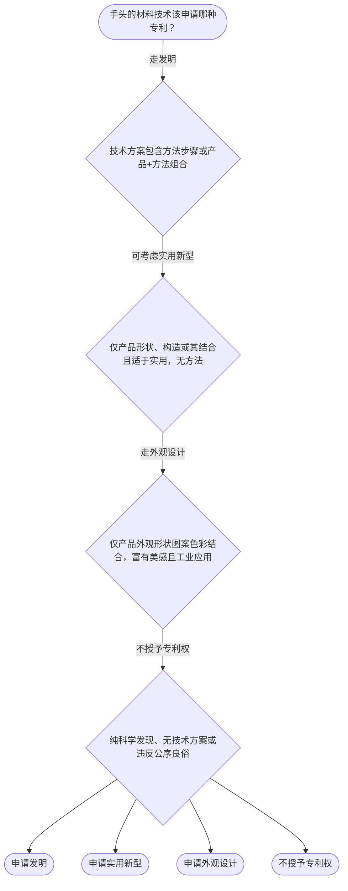

# 专家 B 教学草稿

> 专家：expert_b ｜ 风格：accessible

## 教学模块选择清单

- 当前教学节点：`patent-law-foundation`
- 板块预算：自适应 6/6，总计 9/12

| # | 模块 (block_type) | 类型 | 触发原因 (trigger) | 对应正文段 | 归属 |
|---:|---|:--:|---|---|:--:|
| 1 | `anchor_scenario` | 自适应 | perception=sensing(0.88) / P(L)=0.15<0.3 / cold_start | 固态电池电解质场景导入｜材料实验室刚做出一款硫化物固态电解质薄膜，离子电导率提升一个数量级，还能抑制锂枝晶。团队准备… | [B] |
| 2 | `legal_anchor` | 必选 | mandatory | 法条锚定：客体与制度根基｜《专利法》第二条 | [B] |
| 3 | `worked_example` | 自适应 | cognition.apply=0.18<0.4 / cognition.analyze=0.12<0.3 / cold_start | 电池电解质该走哪条保护路径｜某团队完成一种固态电解质薄膜及其卷对卷制备方法。问：最适合申请哪种专利？专利权会具备哪些基本… | [B] |
| 4 | `decision_flow` | 自适应 | input=visual(0.81) | 材料技术选客体决策流｜手头的材料技术该申请哪种专利？ | [B] |
| 5 | `mnemonic` | 自适应 | understanding=sequential(0.74) | 三特征+三客体记忆锚｜三特征口诀「独时地」+三客体口诀「发明方法大、实用形状小、外观好看造」 | [B] |
| 6 | `reflect_prompt` | 自适应 | processing=reflective(0.68) | 反思：自己的材料项目怎么定位｜对照你手头或熟悉的电池材料项目，它更接近发明、实用新型还是外观设计？独占性和地域性会怎样影响… | [B] |
| 7 | `assessment` | 必选 | mandatory | 三类测评入口｜三种保护客体识别 | [B] |
| 8 | `knowledge_synthesis` | 必选 | mandatory | 本节点知识框架综合｜专利权三特征：独占性（排他实施）、时间性（法定期限）、地域性（属地生效） | [B] |
| 9 | `summary_card` | 自适应 | len(knowledge_sub_nodes)=3>=3 | 专利法律制度基础速查卡｜先锁客体与三特征，再谈后续新颖性创造性。 | [B] |

## 教学正文

## 1. 场景导入
你是材料研发工程师，团队刚做出一款固态电池用的新型硫化物电解质薄膜：它能把离子电导率拉高一个数量级，还能压制锂枝晶。老板拍桌子说「赶紧申请专利，别让竞品抢先」。这时你脑子里蹦出一串问题：这算发明还是实用新型？专利能不能只在中国管用？公开论文前必须先交申请吗？申请文件到底要准备什么？——这些就是「专利法律制度基础」要先帮你立住的框架。

## 2. 人话解释
专利制度像给技术盖一枚「限时独占章」。拿到章之后，别人未经许可不能随便用你的技术方案（独占性）；但这枚章有保质期——发明最长20年、实用新型和外观设计10年（时间性）；而且这枚章只在你盖章的国家/地区生效，中国专利管不了美国市场（地域性）。中国整套制度由三层文件撑着：上位的《专利法》定原则，中间的《专利法实施细则》定程序细节，最落地的《专利审查指南》告诉审查员怎么判「能不能给」。保护对象只有三类：发明（产品或方法的新方案）、实用新型（产品形状构造的实用小改进）、外观设计（好看又能工业用的外观）。制度存在的意义很直白——激励你愿意公开技术换保护，技术公开后别人能站在你肩膀上继续创新，最终推动产业发展。中国专利从1985年起步，发明走「早期公开、延迟审查」：先公开让公众知道，再等你请求实质审查；实用新型和外观设计则走初步审查制，流程更快。

## 3. 法条回扣
《专利法》第二条把三种客体写死了：发明是「对产品、方法或者其改进所提出的新的技术方案」；实用新型限「产品的形状、构造或者其结合」且「适于实用」；外观设计是「富有美感并适于工业应用的新设计」。〔RAG: 中华人民共和国专利法.txt — 第二条　本法所称的发明创造是指发明、实用新型和外观设计。发明，是指对产品、方法或者其改进所提出的新的技术方案。实用新型，是指对产品的形状、构造或者其结合所提出的适于实用的新的技术方案。外观设计，是指对产品的整体或者局部的形状、图案或者其结合以及色彩与形状、图案的结合所作出的富有美感并适于工业应用的新设计。〕第三条明确国务院专利行政部门统一受理审查。第二十二条则点出发明和实用新型要过新颖性、创造性、实用性三关，并定义现有技术是「申请日以前在国内外为公众所知的技术」。〔RAG: 中华人民共和国专利法.txt — 第二十二条　授予专利权的发明和实用新型，应当具备新颖性、创造性和实用性。……本法所称现有技术，是指申请日以前在国内外为公众所知的技术。〕这些条文就是后面判断材料专利能不能活下来的「宪法」。

## 4. 类比 / 口诀
把专利想成「技术房产证」：独占性=只有你能住；时间性=房产证有期限；地域性=证只在中国有效。三种客体口诀：「发明管方法+产品大招，实用只管形状构造小改，外观只管好看能量产」。边界提醒：口诀帮记忆，不能替代法条——方法永远不能申请实用新型；单纯科学发现（比如发现新晶体结构但无技术方案）不是发明。

## 5. 应试提示
题干出现「独占/排他/禁止他人」→独占性；「20年/10年/期限届满」→时间性；「中国授权、国外无效」→地域性。看到「电解质配方+制备方法」优先想发明；「电极片的层叠结构」可能实用新型；「电池外壳的纹理图案」外观设计。常见陷阱：把「技术秘密」和「专利」混为一谈——专利必须公开换保护；把实用新型当成「小发明」却忘了它不能保护方法。材料领域答题时先画时间轴：申请日、公开日、优先权日，再决定走哪条保护路径。

## 6. 互动提问
本节设有测评（覆盖向后复习/向前探测/薄弱点），请到【习题】区作答。学完后可以对照自己手头的电池材料项目，先判断它更像发明还是实用新型，再想想独占性和地域性对你出海策略意味着什么。

### 固态电池电解质场景导入（anchor_scenario）

> 材料实验室刚做出一款硫化物固态电解质薄膜，离子电导率提升一个数量级，还能抑制锂枝晶。团队准备下周去行业展会展示样品，同时老板要求立刻申请中国专利。工程师小王一边担心展会公开会不会毁掉新颖性，一边纠结：这到底算发明还是实用新型？专利能不能管到海外？公开论文和交申请哪个先？

**锚定**：用真实电池材料研发冲突，同时锚定三种客体、专利权三特征以及制度体系这些抽象基础概念。

**先想一想**：如果你是小王，展会展示前最该先确认的是「能不能申请」还是「申请什么类型」？为什么？

### 法条锚定：客体与制度根基（legal_anchor）

- **《专利法》第二条**：第二条用一句话把「能申请什么」钉死：发明管产品/方法新方案，实用新型只管产品形状构造，外观设计管好看且能工业用的设计。
- **《专利法》第三条**：第三条告诉你谁在管事：国家知识产权局统一受理审查，地方管专利管理工作。
- **《专利法》第二十二条（授权条件与现有技术定义）**：第二十二条提醒：发明实用新型还要过新颖性创造性实用性，现有技术以申请日前公众知悉为准。

**为何重要**：本节点是后续新颖性创造性判断的地基，必须先把客体边界和制度层级立住，否则材料专利一上来就会选错保护路径。

### 电池电解质该走哪条保护路径（worked_example）

**案情/例题**：某团队完成一种固态电解质薄膜及其卷对卷制备方法。问：最适合申请哪种专利？专利权会具备哪些基本特征？
**适用规则**：《专利法》第二条（三种客体）+ 专利权独占性、时间性、地域性
**分步推演**：
1. 制备方法属于「方法」技术方案，实用新型只能保护产品形状构造，方法无法落入实用新型。 → *排除实用新型*
2. 薄膜产品本身是新的技术方案，方法也是新的技术方案，两者均可作为发明保护；若仅为外壳美观图案才考虑外观设计。 → *优先发明*
3. 一旦授权，权利人可排他实施（独占性），发明保护期最长20年（时间性），但仅在中国有效（地域性）。 → *三特征落地*
**结论**：应申请发明专利（可同时写产品与方法权利要求），并清醒认识权利受时间与地域限制。
**本题要点**：材料方法+产品组合优先发明；先锁客体再谈三特征。

### 材料技术选客体决策流（decision_flow）

**决策问题**：手头的材料技术该申请哪种专利？



### 三特征+三客体记忆锚（mnemonic）

**记忆锚**：三特征口诀「独时地」+三客体口诀「发明方法大、实用形状小、外观好看造」
**映射**：
- 独
- 时
- 地
- 发明方法大
- 实用形状小
- 外观好看造
**何时用**：看到「专利权特征」或「该申请发明还是实用新型」题干时立刻默念。

### 反思：自己的材料项目怎么定位（reflect_prompt）

**反思问题**：对照你手头或熟悉的电池材料项目，它更接近发明、实用新型还是外观设计？独占性和地域性会怎样影响你的出海或合作策略？

**关注要点**：有没有方法步骤——有则优先发明；保护期限与市场布局是否匹配；中国专利能否覆盖目标出口国

**连接**：连接已学的三种客体与三特征，为后续申请日、新颖性时间轴做铺垫

### 本节点知识框架综合（knowledge_synthesis）

**知识框架**：
- 专利权三特征：独占性（排他实施）、时间性（法定期限）、地域性（属地生效）
- 制度体系三层级：专利法（原则）→实施细则（程序）→审查指南（操作）
- 三种客体：发明（产品/方法新方案）、实用新型（形状构造实用方案）、外观设计（美感工业设计）
- 制度作用：激励创造、促进公开、推动应用与经济发展
- 发展特点：发明早期公开延迟审查，实用新型/外观设计初步审查，双轨并存
**概念关系**：先识别客体类型，再谈三特征与授权条件；制度作用解释为什么要公开换保护；早期公开延迟审查为后续新颖性判断提供时间轴基础
**必记**：三种客体由《专利法》第二条界定，方法不能申请实用新型；专利权必然带独占、时间、地域三特征，缺一不可；中国专利制度文件层级决定「原则→程序→审查操作」的落地顺序

### 专利法律制度基础速查卡（summary_card）

**要点卡**：
- **三特征**：独占性+时间性+地域性
- **三客体**：发明（产品/方法）、实用新型（形状构造）、外观设计（美感工业）
- **制度体系**：专利法→实施细则→审查指南
- **制度作用**：激励创造、促进公开、推动经济
- **审查特点**：发明早期公开延迟审查，实用/外观初步审查
**必背**：发明可保护方法，实用新型不能；专利权有地域性，中国授权不等于海外有效；《专利法》第二条是客体判断的起点
**一句话总结**：先锁客体与三特征，再谈后续新颖性创造性。

### 三类测评入口（assessment）

**三类覆盖**：backward_review、forward_probe、weakness_probe
**题目**：
- q1：三种保护客体识别
- q2：发明申请核心文件探测
- q3：专利权三特征与客体边界综合辨析


## 结构化字段

## knowledge_points

```json
[
  {
    "node_id": "patent-law-foundation",
    "kc_name": "专利制度的基本概念与特征：独占性、时间性、地域性"
  },
  {
    "node_id": "patent-law-foundation",
    "kc_name": "中国专利制度体系：专利法、专利法实施细则、专利审查指南"
  },
  {
    "node_id": "patent-law-foundation",
    "kc_name": "专利保护的三种客体：发明、实用新型、外观设计（专利法第2条）"
  },
  {
    "node_id": "patent-law-foundation",
    "kc_name": "专利制度的作用：激励发明创造、促进技术公开、推动技术应用和经济发展"
  },
  {
    "node_id": "patent-law-foundation",
    "kc_name": "中国专利制度发展历程与特点：早期公开延迟审查、初步审查制与实质审查制并存"
  }
]
```

## legal_basis

```json
[
  {
    "article": "《专利法》第二条：本法所称的发明创造是指发明、实用新型和外观设计。发明，是指对产品、方法或者其改进所提出的新的技术方案。实用新型，是指对产品的形状、构造或者其结合所提出的适于实用的新的技术方案。外观设计，是指对产品的整体或者局部的形状、图案或者其结合以及色彩与形状、图案的结合所作出的富有美感并适于工业应用的新设计。",
    "source": "中华人民共和国专利法.txt"
  },
  {
    "article": "《专利法》第二十二条：授予专利权的发明和实用新型，应当具备新颖性、创造性和实用性。……本法所称现有技术，是指申请日以前在国内外为公众所知的技术。",
    "source": "中华人民共和国专利法.txt"
  },
  {
    "article": "《专利法》第三条：国务院专利行政部门负责管理全国的专利工作；统一受理和审查专利申请，依法授予专利权。",
    "source": "中华人民共和国专利法.txt"
  }
]
```

## risks

```json
[
  {
    "risk": "把三种客体混为一谈，尤其是把方法技术方案误当成可申请实用新型",
    "related_node_id": "patent-law-foundation"
  },
  {
    "risk": "忽略地域性，以为中国专利自动覆盖海外市场",
    "related_node_id": "patent-rights-nature"
  },
  {
    "risk": "只记法条名称却分不清专利法、实施细则、审查指南各自层级作用",
    "related_node_id": "patent-law-framework"
  },
  {
    "risk": "把专利制度作用简化成「赚钱工具」，忽略技术公开与激励创新的双向交换",
    "related_node_id": "patent-system-overview"
  }
]
```

## draft_stage

```json
"debate"
```

## irac

```json
{
  "issue": "材料团队研发的新型固态电池电解质薄膜，应如何识别可保护的客体类型并理解专利权的基本特征？",
  "rule": "《专利法》第二条界定发明、实用新型、外观设计三种客体；专利权具有独占性、时间性、地域性；中国专利制度由专利法、实施细则、审查指南构成。",
  "application": "电解质薄膜若体现为产品结构或制备方法的新技术方案，优先落入发明；若仅为特定形状构造的实用改进可考虑实用新型；单纯美观外壳则可能外观设计。授权后权利人可排他实施，但受保护期限与中国地域限制。",
  "conclusion": "先按第二条锁定客体，再牢记三特征与制度层级，才能为后续新颖性、创造性判断搭好地基。"
}
```

## interactive_questions

```json
[
  {
    "qid": "q1",
    "category": "remember",
    "difficulty": "L1",
    "source_tag": "backward_review",
    "kc_node_id": "patent-law-foundation",
    "question": "根据《专利法》，专利保护的三种客体分别是？",
    "answer": "B",
    "options": [
      "A. 发明、商业秘密、外观设计",
      "B. 发明、实用新型、外观设计",
      "C. 发明、实用新型、技术秘密",
      "D. 发明、集成电路布图、外观设计"
    ]
  },
  {
    "qid": "q2",
    "category": "understand",
    "difficulty": "L1",
    "source_tag": "forward_probe",
    "kc_node_id": "patent-application-process",
    "question": "一件发明专利申请通常至少需要提交下列哪些核心文件？",
    "answer": "C",
    "options": [
      "A. 仅请求书和摘要",
      "B. 仅权利要求书和图片",
      "C. 请求书、说明书及其摘要、权利要求书",
      "D. 仅审查意见通知书和答复"
    ]
  },
  {
    "qid": "q3",
    "category": "analyze",
    "difficulty": "L3",
    "source_tag": "weakness_probe",
    "kc_node_id": "patent-law-foundation",
    "question": "某材料公司就一种固态电解质的制备方法在中国获得发明专利。下列说法哪项最准确？",
    "answer": "A",
    "options": [
      "A. 该专利权具有独占性、时间性（最长20年）和地域性（仅中国有效）",
      "B. 该专利权自动在所有《巴黎公约》成员国生效",
      "C. 该制备方法也可以直接改用实用新型保护",
      "D. 专利权期限届满后仍可无限续展"
    ]
  }
]
```

## knowledge_synthesis

```json
{
  "node": "patent-law-foundation",
  "coverage": [
    {
      "node_id": "patent-rights-nature"
    },
    {
      "node_id": "patent-law-framework"
    },
    {
      "node_id": "patent-law-foundation"
    },
    {
      "node_id": "patent-system-overview"
    }
  ],
  "confusable_pairs": [
    {
      "pair": "发明 vs 实用新型：发明可含方法，实用新型仅限产品形状构造"
    },
    {
      "pair": "专利权地域性 vs 国际条约：中国专利不自动覆盖海外"
    }
  ]
}
```
