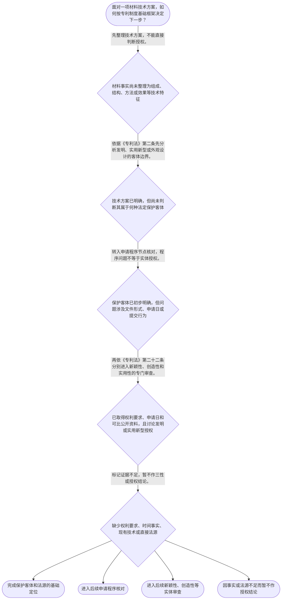

# 整合后的课程完整内容与习题

## 教学模块选择清单

- 当前教学节点：`patent-law-foundation`
- 板块预算：自适应 5/6，总计 9/9

| # | 模块 (block_type) | 类型 | 触发原因 (trigger) | 对应正文段 | 归属 |
|---:|---|:--:|---|---|:--:|
| 1 | `anchor_scenario` | 自适应 | perception=sensing(0.88) / cold_start | 从材料研发事实进入专利制度｜某电池材料团队研发了一种隔膜复合涂层：聚烯烃基膜上形成含无机颗粒和耐热树脂的涂层，实验显示高… | [A+B融合] |
| 2 | `legal_anchor` | 必选 | mandatory | 专利制度基础的法条锚点｜《专利法》第一条 | [A+B融合] |
| 3 | `worked_example` | 自适应 | cognition.apply=0.28<0.4 / cognition.analyze=0.24<0.3 / cold_start | 案例演示：材料涂层方案如何进入专利分析｜某公司拟为电池隔膜申请专利。方案包括聚烯烃基膜、含氧化铝颗粒和耐热树脂的涂层，以及降低高温收… | [A+B融合] |
| 4 | `decision_flow` | 自适应 | input=visual(0.81) | 材料专利问题的基础判断流程｜面对一项材料技术方案，如何按专利制度基础框架决定下一步？ | [A] |
| 5 | `mnemonic` | 自适应 | remember=0.66>=0.6 & apply<0.4 / understanding=sequential(0.74) | 基础四格表：客体、法源、程序、实体｜基础四格表：客体—法源—程序—实体。看到材料专利问题时，依次核对“保护什么、依据何在、如何提… | [A+B融合] |
| 6 | `reflect_prompt` | 自适应 | processing=reflective(0.68) | 把材料研发判断转成专利问题｜回想一个材料研发项目：团队若说“实验效果很好，所以肯定能拿到专利”，你会先把哪些技术事实和法… | [B] |
| 7 | `assessment` | 必选 | mandatory | 专利制度基础三类测评｜识别专利制度的独占性、时间性和地域性。 | [A+B融合] |
| 8 | `knowledge_synthesis` | 必选 | mandatory | 专利法律制度基础知识网络｜专利制度基本特征：独占性体现法定范围内的排他效力；时间性和地域性说明权利受期限和法域限制。 | [A+B融合] |
| 9 | `summary_card` | 自适应 | len(knowledge_sub_nodes)=3>=3 | 专利制度基础速查卡｜材料专利先定客体和法源，再分程序与实体，最后以权利要求、申请日和现有技术为基础分别判断新颖性… | [A+B融合] |

## 教学正文

# 材料领域专利申请：先站稳专利法律制度基础

## 一、先把材料研发语言和专利法律问题分开

材料研发中常见的表述是“配方更稳定”“涂层耐热更好”“制备工艺降低了收缩率”。这些首先是技术事实。进入专利制度后，应将其整理为可识别的技术方案，例如材料组成、层状结构、制备步骤、参数范围及技术效果。

接着必须区分四件事：保护客体、法源层次、申请程序和实体授权。技术效果较好，可能提示方案具有进一步分析的价值，但不等于已经获得专利权，也不等于已满足创造性。把这四层分开，是后续学习新颖性和创造性的前提。

## 二、专利制度为何存在

《专利法》第一条将制度目的表述为保护专利权人的合法权益，鼓励发明创造，推动发明创造的应用，提高创新能力，促进科学技术进步和经济社会发展。〔RAG: 中华人民共和国专利法.txt — 第一条：为了保护专利权人的合法权益，鼓励发明创造，推动发明创造的应用，提高创新能力，促进科学技术进步和经济社会发展，制定本法〕

可以从这一目的理解专利制度的基本作用：一方面通过法定权利保护创新成果，另一方面通过公开和应用推动技术传播与产业发展。材料研发人员不应把专利仅理解为“登记一项技术”；它是围绕技术方案、公开、授权和权利效力运行的法律制度。

专利权的基础特征通常概括为独占性、时间性和地域性。独占性是指在法定保护范围内具有排他效力；时间性表示权利受法定期限限制；地域性表示权利效力依特定法域的法律而定，不能当然扩展到全世界。此处只建立制度特征框架，具体期限和保护范围须在相应条文与后续节点中核对。

## 三、先识别保护客体

《专利法》第二条规定，发明创造包括发明、实用新型和外观设计。发明是对产品、方法或者其改进所提出的新的技术方案；实用新型是对产品的形状、构造或者其结合所提出的适于实用的新的技术方案；外观设计是对产品整体或者局部的形状、图案或者其结合，以及色彩与形状、图案结合所作出的富有美感并适于工业应用的新设计。〔RAG: 中华人民共和国专利法.txt — 第二条：本法所称的发明创造是指发明、实用新型和外观设计；发明，是指对产品、方法或者其改进所提出的新的技术方案〕

对材料方案而言，配方、材料组成、微观或宏观结构、层间关系、制备方法及其技术效果，通常需要先作为技术方案分析。不能仅看到产品外形就直接归为外观设计，也不能因为某项材料有商业价值就跳过客体识别。客体定位只解决“法律上先从哪一类发明创造进入分析”，并不自动解决“能否授权”。

## 四、中国专利制度的规范层次

专利法是基本法律规则的核心来源。专利法实施细则根据专利法制定，并对办理手续等程序事项作出细化。〔RAG: 中华人民共和国专利法实施细则.txt — 第一条：根据《中华人民共和国专利法》，制定本细则〕专利审查指南则在审查实践中提供具体判断方法。三者的作用不同，分析时应注明具体来源，不应把审查指南当作可以替代法律条文的独立授权依据。

《专利法》第三条规定，国务院专利行政部门负责管理全国的专利工作，统一受理和审查专利申请，依法授予专利权。〔RAG: 中华人民共和国专利法.txt — 第三条：国务院专利行政部门负责管理全国的专利工作；统一受理和审查专利申请，依法授予专利权〕这说明申请受理、审查与授权处于法定程序和机关体系中，而非研发团队自行宣告即可完成。

程序层面还要注意，专利法和实施细则规定的各种手续应以书面形式或者国务院专利行政部门规定的其他形式办理；能够有形表现内容并可随时调取查用的电子形式，视为书面形式。〔RAG: 中华人民共和国专利法实施细则.txt — 第二条：各种手续应当以书面形式或者国务院专利行政部门规定的其他形式办理；电子形式视为书面形式〕这解决的是手续形式，不是新颖性或创造性的实体结论。

## 五、申请与授权不是同一个问题

申请程序关注的是申请人如何将技术方案提交进入法定审查体系，例如文件、办理形式、申请日以及后续程序事实。实体授权关注的是该技术方案是否满足法定条件。二者应分别记录、分别核验。

对发明和实用新型，《专利法》第二十二条规定应具备新颖性、创造性和实用性。新颖性是指该发明或者实用新型不属于现有技术，同时不存在任何单位或者个人在申请日以前提出、并记载于申请日以后公布的专利申请文件或者公告的专利文件中的同样发明或者实用新型。创造性是指与现有技术相比，发明具有突出的实质性特点和显著的进步，实用新型具有实质性特点和进步。〔RAG: 中华人民共和国专利法.txt — 第二十二条：授予专利权的发明和实用新型，应当具备新颖性、创造性和实用性；新颖性，是指该发明或者实用新型不属于现有技术；创造性，是指与现有技术相比……〕

同条还规定，现有技术是申请日以前在国内外为公众所知的技术。〔RAG: 中华人民共和国专利法.txt — 第二十二条：本法所称现有技术，是指申请日以前在国内外为公众所知的技术〕因此，在材料专利分析中，申请日不是可有可无的行政信息，而是后续确定现有技术时间边界的重要事实。

本节只建立新颖性与创造性的边界：新颖性不能简单等同于“实验室里第一次做出”；它要依照法定时间基准核对现有技术和法定抵触申请。创造性也不能简单等同于“性能有提升”或“研发很辛苦”；它是与现有技术相比的独立法律评价。完整的现有技术、抵触申请、权利要求解释和创造性判断方法，应在后续专门节点进一步学习。

## 六、材料方案的基础分析顺序

以电池隔膜复合涂层为例，第一步是列出聚烯烃基膜、无机颗粒、耐热树脂、层状关系、制备条件及收缩率变化等技术特征。第二步是判断其作为产品、方法或改进所提出的技术方案，可能进入何种保护客体框架。第三步是把申请手续与实体授权分开。第四步才是在具备权利要求、申请日和可比公开资料后，分别进入新颖性和创造性的专门判断。

这一顺序可以避免两个常见跳跃：其一，看到技术效果就直接宣布“有创造性”；其二，已经提交文件就直接宣布“有专利”。前者混淆技术事实与实体标准，后者混淆程序启动与授权结果。

教学上下文提示中国专利制度具有早期公开、延迟审查，以及初步审查制与实质审查制并存等制度特点。这些内容在本节仅作为制度背景，用于理解为什么程序阶段与实体审查阶段需要区分；关于具体公开时点、审查启动和程序期限，应在后续节点基于直接法源展开。

## 七、本节结论

材料领域专利申请的基础判断主线是：先把研发事实整理为技术方案，再识别保护客体和规范层次；随后区分申请程序与实体授权；对发明和实用新型，最终以权利要求、申请日及现有技术为基础，分别判断新颖性、创造性和实用性。〔RAG: 中华人民共和国专利法.txt — 第二十二条：授予专利权的发明和实用新型，应当具备新颖性、创造性和实用性〕

记忆边界是：属于法定保护客体，不等于当然授权；提交申请，不等于已经取得专利权；性能提升，不等于当然具备创造性。本节设有测评，请到【习题】区作答。

### 从材料研发事实进入专利制度（anchor_scenario）

> 某电池材料团队研发了一种隔膜复合涂层：聚烯烃基膜上形成含无机颗粒和耐热树脂的涂层，实验显示高温收缩率下降。团队拟提交专利申请，但研发负责人说“性能明显提高，肯定有创造性”，市场负责人则准备在行业展会上公开样品。

代理人先把讨论拆开：该成果是技术方案还是外观设计；提交申请需要哪些程序动作；是否满足授权实体条件；以及专利权是否当然在所有国家生效。只有这些问题分层后，材料性能、公开行为和后续的新颖性、创造性判断才不会混在一起。

**锚定**：该场景把材料技术事实锚定到保护客体、法源层次、申请程序和实体授权四个基础概念。

**先想一想**：面对这项材料方案，为什么不能仅凭“性能提升”就直接得出已经具备创造性的结论？

### 专利制度基础的法条锚点（legal_anchor）

- **《专利法》第一条**：第一条说明专利法兼顾保护专利权人合法权益、鼓励发明创造、推动应用以及促进科技进步和经济社会发展的制度目的。
- **《专利法》第二条**：第二条规定发明创造包括发明、实用新型和外观设计，并分别给出三类客体的法定定义。
- **《专利法》第二十二条**：第二十二条规定发明和实用新型的授权条件包括新颖性、创造性和实用性；新颖性与创造性是不同的法律判断。
- **《专利法实施细则》第二条**：实施细则第二条规定专利手续以书面形式或者规定的其他形式办理，符合条件的电子形式视为书面形式。

**为何重要**：材料专利分析先要识别保护客体和适用法源，再区分程序问题与实体授权问题。第二十二条为后续专门学习新颖性、创造性提供法条锚点，但本节点不替代后续节点的完整审查训练。

### 案例演示：材料涂层方案如何进入专利分析（worked_example）

**案情/例题**：某公司拟为电池隔膜申请专利。方案包括聚烯烃基膜、含氧化铝颗粒和耐热树脂的涂层，以及降低高温收缩率的效果。公司已在内部完成实验，尚未确定权利要求，也未完成现有技术检索。问题是：在专利制度基础阶段，应如何定位该方案，且哪些问题不能提前下结论？
**适用规则**：《专利法》第二条规定发明、实用新型和外观设计的定义；《专利法》第二十二条规定发明和实用新型应具备新颖性、创造性和实用性。
**分步推演**：
1. 方案的核心是材料组成、层状结构和制备相关技术特征，而非单纯产品外观；应先把研发描述整理为可识别的技术方案。 → *第一步：把研发语言整理为技术特征。*
2. 依据《专利法》第二条，发明是对产品、方法或者其改进所提出的新的技术方案。该材料方案可作为发明专利客体进一步分析，而不是当然归入外观设计。 → *第二步：先定位保护客体。*
3. 提交申请的手续、文件形式和申请日属于程序层面；实施细则第二条的形式要求并不证明实体授权条件已经满足。 → *第三步：把程序启动与实体授权分开。*
4. 《专利法》第二十二条要求发明和实用新型具备新颖性、创造性和实用性。新颖性需围绕申请日前现有技术及法定抵触申请事实，创造性需与现有技术相比较；目前缺少权利要求和可比资料，不能仅以性能提高替代判断。 → *第四步：保留三性审查，补齐事实与证据。*
**结论**：该复合涂层应先按其产品、方法或改进所提出的技术方案属性，进入发明专利客体的分析框架；仅凭性能提高和准备提交申请，不能得出已具备新颖性或创造性的结论。后续须基于权利要求、申请日及现有技术分别审查。
**本题要点**：材料专利的起点是“先定客体、再分程序与实体、最后依证据判断三性”，而不是以研发效果直接替代法律结论。

### 材料专利问题的基础判断流程（decision_flow）

**决策问题**：面对一项材料技术方案，如何按专利制度基础框架决定下一步？



### 基础四格表：客体、法源、程序、实体（mnemonic）

**记忆锚**：基础四格表：客体—法源—程序—实体。看到材料专利问题时，依次核对“保护什么、依据何在、如何提交、能否授权”。
**映射**：
- 客体
- 法源
- 程序
- 实体
**何时用**：当题目或实务咨询同时出现“材料技术、申请、授权、公开、性能效果”等词时，用四格表先拆分问题。

### 把材料研发判断转成专利问题（reflect_prompt）

**反思问题**：回想一个材料研发项目：团队若说“实验效果很好，所以肯定能拿到专利”，你会先把哪些技术事实和法律问题分别列入四格表？

**关注要点**：材料组成、结构、工艺和效果是否已被整理为明确技术特征。；该成果首先对应何种保护客体，而不是先贴上“有创造性”的标签。；申请手续、申请日等程序事实与新颖性、创造性等实体条件是否被混淆。；哪些结论已有条文或资料支持，哪些仍需进入后续节点补充核验。

**连接**：连接到学习者熟悉的材料研发记录、样品展示和技术效果数据，并连接本节的“客体—法源—程序—实体”框架。

### 专利法律制度基础知识网络（knowledge_synthesis）

**知识框架**：
- 专利制度基本特征：独占性体现法定范围内的排他效力；时间性和地域性说明权利受期限和法域限制。
- 中国专利制度体系：专利法提供基本规则，专利法实施细则细化程序事项，专利审查指南提供审查实践中的具体方法；引用时应区分规范层次。
- 三类保护客体：《专利法》第二条规定发明创造包括发明、实用新型和外观设计；材料组成、结构或方法通常应先从技术方案角度分析。
- 专利制度作用：《专利法》第一条以保护合法权益、鼓励发明创造、推动应用、提高创新能力和促进科技进步、经济社会发展作为立法目的。
- 制度运行背景：教学上下文提示早期公开、延迟审查以及初步审查与实质审查并存；本节仅作制度定位，不展开具体程序期限或审查步骤。
**概念关系**：先识别保护客体，才能定位后续适用的申请和审查规则。；专利法、实施细则和审查指南相互衔接，但不能互相替代。；申请程序解决“如何进入审查”，实体条件解决“能否获得授权”；提交申请不等于已满足授权条件。；对发明和实用新型，新颖性关注是否属于现有技术及法定抵触申请，创造性关注与现有技术相比是否达到法定标准；二者须分别判断。
**必记**：发明、实用新型和外观设计是《专利法》第二条规定的三类发明创造。；专利法、实施细则和审查指南的规范作用不同，分析时应分别定位。；《专利法》第二十二条规定发明和实用新型应具备新颖性、创造性和实用性。；材料性能提升是技术事实，不当然等同于新颖性或创造性的法律结论。

### 专利制度基础速查卡（summary_card）

**要点卡**：
- **专利权三特征**：独占性强调法定范围内的排他效力，时间性和地域性说明权利并非永久或全球自动生效。
- **制度法源层次**：专利法定基本规则，实施细则细化程序，审查指南帮助落实审查方法。
- **三类保护客体**：《专利法》第二条中的发明创造包括发明、实用新型和外观设计。
- **制度作用**：专利法通过保护合法权益、鼓励创造和推动应用，促进科技进步和经济社会发展。
- **申请与授权边界**：提交申请属于程序启动；发明和实用新型仍须满足包括新颖性、创造性、实用性在内的实体条件。
- **新颖性与创造性**：新颖性与现有技术和法定抵触申请有关，创造性是与现有技术相比的独立评价，不能用性能提升直接替代。
**必背**：发明创造包括发明、实用新型和外观设计。；专利制度的基本特征是独占性、时间性和地域性。；专利法、实施细则、审查指南的作用不同。；提交申请不等于获得授权；发明和实用新型应具备新颖性、创造性和实用性。
**一句话总结**：材料专利先定客体和法源，再分程序与实体，最后以权利要求、申请日和现有技术为基础分别判断新颖性与创造性。

### 专利制度基础三类测评（assessment）

**三类覆盖**：backward_review、forward_probe、weakness_probe
**题目**：
- q_foundation_01：识别专利制度的独占性、时间性和地域性。
- q_foundation_02：识别《专利法》第二条规定的三类发明创造。
- q_process_probe_01：仅以一级难度探测下一节点的申请手续形式要求。
- q_foundation_03：在材料场景中区分技术效果、申请程序与新颖性创造性判断。


## 结构化数据

## expert

```json
"A+B融合"
```

## style

```json
"fused"
```

## knowledge_points

```json
[
  {
    "node_id": "patent-law-foundation",
    "kc_name": "专利制度的基本概念与特征：独占性、时间性、地域性（详见子节点 patent-rights-nature）"
  },
  {
    "node_id": "patent-law-foundation",
    "kc_name": "中国专利制度体系：专利法、专利法实施细则、专利审查指南（详见子节点 patent-law-framework）"
  },
  {
    "node_id": "patent-law-foundation",
    "kc_name": "专利保护的三种客体：发明、实用新型、外观设计（专利法第2条）"
  },
  {
    "node_id": "patent-law-foundation",
    "kc_name": "专利制度的作用：激励发明创造、促进技术公开、推动技术应用和经济发展（详见子节点 patent-system-overview）"
  },
  {
    "node_id": "patent-law-foundation",
    "kc_name": "中国专利制度发展历程与特点：早期公开延迟审查、初步审查制与实质审查制并存（详见子节点 patent-system-overview）"
  }
]
```

## legal_basis

```json
[
  {
    "article": "《专利法》第一条",
    "source": "中华人民共和国专利法.txt"
  },
  {
    "article": "《专利法》第二条",
    "source": "中华人民共和国专利法.txt"
  },
  {
    "article": "《专利法》第三条",
    "source": "中华人民共和国专利法.txt"
  },
  {
    "article": "《专利法》第二十二条",
    "source": "中华人民共和国专利法.txt"
  },
  {
    "article": "《专利法实施细则》第一条、第二条",
    "source": "中华人民共和国专利法实施细则.txt"
  }
]
```

## risks

```json
[
  {
    "risk": "将材料性能提升、商业价值或研发难度直接等同于创造性，忽略创造性须与现有技术比较并依权利要求整体评价。",
    "related_node_id": "patent-law-foundation"
  },
  {
    "risk": "将属于发明、实用新型或外观设计的保护客体，误认为当然满足授权条件。",
    "related_node_id": "patent-law-foundation"
  },
  {
    "risk": "将提交申请、电子形式办理等程序事实误认为已经完成实体审查或取得专利权。",
    "related_node_id": "patent-application-process"
  },
  {
    "risk": "将新颖性与创造性混为同一问题；后续须继续学习现有技术、抵触申请和时间基准。",
    "related_node_id": "novelty"
  },
  {
    "risk": "早期公开、延迟审查以及初步审查与实质审查并存仅在本节作制度背景定位，具体制度史和程序规则应在对应节点结合直接依据学习。",
    "related_node_id": "patent-system-overview"
  }
]
```

## draft_stage

```json
"integration"
```

## irac

```json
{
  "issue": "材料领域一项技术方案拟申请专利时，如何先确定其制度位置，并避免将“性能提升”或“已提交申请”误认为已经满足新颖性和创造性？",
  "rule": "《专利法》第一条规定立法目的包括保护专利权人的合法权益、鼓励发明创造、推动发明创造的应用、提高创新能力以及促进科学技术进步和经济社会发展。〔RAG: 中华人民共和国专利法.txt — 第一条：为了保护专利权人的合法权益，鼓励发明创造，推动发明创造的应用，提高创新能力，促进科学技术进步和经济社会发展，制定本法〕《专利法》第二条规定发明创造包括发明、实用新型和外观设计，并规定发明是对产品、方法或者其改进所提出的新的技术方案。〔RAG: 中华人民共和国专利法.txt — 第二条：本法所称的发明创造是指发明、实用新型和外观设计；发明，是指对产品、方法或者其改进所提出的新的技术方案〕《专利法》第二十二条规定，授予专利权的发明和实用新型应具备新颖性、创造性和实用性；现有技术是申请日以前在国内外为公众所知的技术。〔RAG: 中华人民共和国专利法.txt — 第二十二条：授予专利权的发明和实用新型，应当具备新颖性、创造性和实用性；现有技术，是指申请日以前在国内外为公众所知的技术〕",
  "application": "对于材料领域技术，应先把配方、结构、制备方法和技术效果整理为技术特征，再按《专利法》第二条分析其可能对应的保护客体。申请手续的形式、文件和申请日属于程序层面；例如，实施细则第二条规定符合条件的电子形式视为书面形式。〔RAG: 中华人民共和国专利法实施细则.txt — 第二条：以电子数据交换等方式能够有形地表现所载内容，并可以随时调取查用的数据电文，视为书面形式〕对发明和实用新型，若要讨论是否授权，则须以权利要求、申请日和现有技术资料为基础，分别适用新颖性和创造性规则，不能因技术效果良好或已提交申请而直接下结论。",
  "conclusion": "材料方案的专利分析应遵循“客体定位—法源确认—程序核对—实体判断”的顺序。发明和实用新型提交申请后，仍应依第二十二条分别审查新颖性、创造性和实用性；本节建立制度基础，不替代后续关于现有技术、抵触申请和创造性具体方法的专门学习。"
}
```

## interactive_questions

```json
[
  {
    "qid": "q_foundation_01",
    "category": "remember",
    "difficulty": "L1",
    "source_tag": "backward_review",
    "kc_node_id": "patent-law-foundation",
    "question": "关于专利制度基本特征，下列哪项正确？",
    "answer": "B",
    "options": [
      "A. 独占性、永久性、全球性",
      "B. 独占性、时间性、地域性",
      "C. 公开性、无期限性、全球性",
      "D. 任意性、自动生效性、地域性"
    ]
  },
  {
    "qid": "q_foundation_02",
    "category": "understand",
    "difficulty": "L1",
    "source_tag": "backward_review",
    "kc_node_id": "patent-law-foundation",
    "question": "根据《专利法》第二条，下列哪组属于发明创造？",
    "answer": "A",
    "options": [
      "A. 发明、实用新型和外观设计",
      "B. 发明和实用新型",
      "C. 技术秘密和商标",
      "D. 著作权和商业秘密"
    ]
  },
  {
    "qid": "q_process_probe_01",
    "category": "remember",
    "difficulty": "L1",
    "source_tag": "forward_probe",
    "kc_node_id": "patent-application-process",
    "question": "关于专利申请手续的办理形式，下列哪项符合已检索规则？",
    "answer": "A",
    "options": [
      "A. 书面形式或者国务院专利行政部门规定的其他形式，符合条件的电子形式视为书面形式",
      "B. 只能使用纸质文件，电子形式一律无效",
      "C. 只需向审查员作口头说明",
      "D. 必须先由法院确认后才能提交"
    ]
  },
  {
    "qid": "q_foundation_03",
    "category": "analyze",
    "difficulty": "L3",
    "source_tag": "weakness_probe",
    "kc_node_id": "patent-law-foundation",
    "question": "某材料团队认为“涂层性能提高，所以只要提交申请就必然有创造性”。下列处理顺序最符合专利制度基础框架的是？",
    "answer": "C",
    "options": [
      "A. 性能提升已经证明创造性，无须查看权利要求和现有技术",
      "B. 提交申请即表示已通过新颖性和创造性审查",
      "C. 先整理技术特征并定位客体，再区分程序与实体问题；取得权利要求、申请日和现有技术后分别判断新颖性与创造性",
      "D. 只要方案属于发明客体，就无须再考虑第二十二条规定的条件"
    ]
  }
]
```

## knowledge_synthesis

```json
{
  "node": "patent-law-foundation",
  "coverage": [
    {
      "node_id": "patent-law-foundation"
    }
  ],
  "confusable_pairs": [
    {
      "pair": "保护客体与实体授权条件：属于发明、实用新型或外观设计，不等于当然满足授权条件。"
    },
    {
      "pair": "申请程序与授权结论：提交文件、确定申请日或采用电子形式，不等于已经获得专利权。"
    },
    {
      "pair": "新颖性与创造性：新颖性围绕现有技术及法定抵触申请判断，创造性是与现有技术相比的独立评价。"
    }
  ]
}
```
