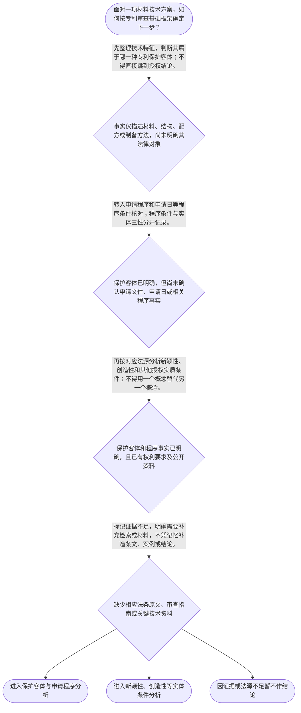

# 专家 A 教学草稿

> 专家：expert_a ｜ 风格：conservative

## 教学模块选择清单

- 当前教学节点：`patent-law-foundation`
- 板块预算：自适应 6/6，总计 9/9

| # | 模块 (block_type) | 类型 | 触发原因 (trigger) | 对应正文段 | 归属 |
|---:|---|:--:|---|---|:--:|
| 1 | `anchor_scenario` | 自适应 | perception=sensing(0.88) / cold_start | 材料技术方案进入专利制度时先看什么｜某材料研发团队开发出一种用于锂电池隔膜的复合涂层：基层为聚烯烃薄膜，表面形成含无机颗粒和耐热… | [A] |
| 2 | `legal_anchor` | 必选 | mandatory | 专利制度基础的法条锚定｜《专利法》第一条 | [A] |
| 3 | `worked_example` | 自适应 | cognition.apply=0.28<0.4 / cognition.analyze=0.24<0.3 / cold_start | 从材料方案到专利制度分类｜某公司研发了一种耐热复合涂层，用于电池隔膜。其技术事实包括：聚合物基层表面具有含无机颗粒的树… | [A] |
| 4 | `decision_flow` | 自适应 | input=visual(0.81) | 材料专利基础审查顺序｜面对一项材料技术方案，如何按专利审查基础框架确定下一步？ | [A] |
| 5 | `mnemonic` | 自适应 | remember=0.66>=0.6 & apply<0.4 / understanding=sequential(0.74) | 专利基础四问表｜专利基础四问表：对象—法源—程序—实体；每遇材料专利问题，按“先问保护什么，再问依据何在，再… | [A] |
| 6 | `reflect_prompt` | 自适应 | processing=reflective(0.68) | 把研发判断转换为专利审查问题｜回想一个你熟悉的材料研发项目：如果团队说“实验效果很好，所以肯定有专利”，你会要求他们补充哪… | [A] |
| 7 | `assessment` | 必选 | mandatory | 专利制度基础三类测评｜识别专利制度的独占性、时间性和地域性特征。 | [A] |
| 8 | `knowledge_synthesis` | 必选 | mandatory | 专利法律制度基础知识网络｜专利制度基本特征：专利权具有独占性、时间性和地域性，权利效力不能脱离法定范围和地域自动扩张。 | [A] |
| 9 | `summary_card` | 自适应 | len(knowledge_sub_nodes)=3>=3 | 专利制度基础速查卡｜先确定保护客体和法源层次，再区分申请程序与实体授权，最后进入新颖性和创造性等专门判断。 | [A] |

## 教学正文

## I — 法律问题

面对一项材料技术方案，第一步不是立即问“有没有新颖性、创造性”，而是先确认三个边界：第一，讨论的对象是否已经整理为可识别的技术方案；第二，适用哪些专利法律规范及审查层级；第三，当前讨论的是提出申请，还是最终获得专利授权。

以材料研发为例，配方、层状结构、颗粒分散状态、制备工艺和由此产生的性能效果，属于需要进一步整理和核实的技术事实。技术效果较好，只能说明研发价值或可能存在技术贡献，不能单独推出已经满足专利授权条件。

## R — 适用规则

《专利法》第一条规定：“为了保护专利权人的合法权益，鼓励发明创造，推动发明创造的应用，提高创新能力，促进科学技术进步和经济社会发展，制定本法。”〔RAG: 中华人民共和国专利法.txt — 第一条：为了保护专利权人的合法权益，鼓励发明创造，推动发明创造的应用，提高创新能力，促进科学技术进步和经济社会发展，制定本法〕

本节点的制度框架还包括专利法、专利法实施细则和专利审查指南。三者不能混为一谈：专利法提供基本法律规则，实施细则补充办理手续和程序要求，审查指南通常用于细化审查中的判断方法。引用时应注明具体文件和条文；本轮检索已经提供《专利法实施细则》2023年修订文本的来源信息。〔RAG: 中华人民共和国专利法实施细则.txt — 第一条：根据《中华人民共和国专利法》，制定本细则〕

教学上下文将发明、实用新型、外观设计列为《专利法》第二条对应的三类专利保护客体。本轮检索没有提供第二条的完整原文，因此这里只作法条定位，不补写未经核验的定义。

专利权的基本特征可归纳为独占性、时间性和地域性：独占性强调法定范围内的排他效力；时间性和地域性强调权利受到法定期限及国家或地区法域的限制。该概括属于本节点的制度框架说明，具体权利期限和地域适用问题应以相应条文为准。

新颖性和创造性属于后续实体审查中的不同问题。当前检索上下文未提供《专利法》第二十二条以及《专利审查指南》中关于新颖性、创造性判断的直接原文，因此不能在本节凭记忆补写条文号后的完整规则，也不能据此对具体材料方案作授权结论。后续判断至少应准备申请日、权利要求技术特征、公开资料及可核验法源。

## A — 规则适用

第一，确定对象。对材料技术，应把研发语言转换为专利分析语言，例如明确材料组成、层间关系、工艺步骤、参数范围以及相应技术效果。只有先确定技术对象和技术特征，后续才有可能讨论其保护客体和权利要求范围。

第二，确定法源。遇到“能不能申请”或“能不能授权”的问题，应分别查找专利法的基本规则、实施细则的程序细节和专利审查指南的审查标准。已检索到的《专利法实施细则》第二条规定，专利法和本细则规定的各种手续应当以书面形式或者国务院专利行政部门规定的其他形式办理，符合条件的电子形式视为书面形式。〔RAG: 中华人民共和国专利法实施细则.txt — 第二条：各种手续应当以书面形式或者国务院专利行政部门规定的其他形式办理；电子形式视为书面形式〕这说明申请手续的形式问题属于程序层面，并不等于实体授权已经成立。

第三，区分申请与授权。技术方案可能具备提出申请的条件，但这不表示其已经通过新颖性、创造性等实体审查。相反，判断是否授权还必须回到具体权利要求和适用的实体审查依据，不能仅凭研发人员对技术效果的描述作结论。

第四，控制判断边界。关于中国专利制度的发展特点，教学上下文提示了早期公开、延迟审查，以及初步审查制与实质审查制并存等内容；本轮检索未提供相应直接条文或指南原文。因此，本节只把它作为后续程序学习的背景，不展开申请日、优先权、公开时间或审查程序的具体计算。

对于新颖性与创造性，当前可执行的准备动作是：先锁定权利要求的技术特征，再核对申请日和相关公开资料，最后分别调用对应的法条和审查指南。不能把“是否公开过”的问题与“是否显而易见”的问题混成同一个判断，也不能在缺少资料时用材料性能提升直接替代法律分析。

## C — 结论

本节点的核心结论是：材料专利审查应先完成“保护客体—法源层次—申请程序—实体授权”的顺序分析。专利制度具有独占性、时间性和地域性，发明、实用新型、外观设计是需要先区分的保护客体；提出申请不等于已经满足新颖性和创造性等授权条件。新颖性和创造性的具体判断应留待取得完整法条、审查指南和现有技术资料后分别展开。

> 常见误区 / 易混淆点

- 把“技术效果好”直接等同于“具备创造性”：技术效果是事实材料，创造性是依照法定标准进行的法律判断。
- 把“已经提交申请”直接等同于“已经获得专利权”：申请是程序动作，授权还需要满足相应条件。
- 把专利法、实施细则和审查指南当作同一层次文件：分析时应分别标明来源和规范作用。
- 把材料领域的专业术语直接当作专利保护客体：应先整理技术方案和技术特征，再进行法律分类。

本节设有测评，请到【习题】区作答。

### 材料技术方案进入专利制度时先看什么（anchor_scenario）

> 某材料研发团队开发出一种用于锂电池隔膜的复合涂层：基层为聚烯烃薄膜，表面形成含无机颗粒和耐热树脂的涂层，目标是提高耐热收缩性能。团队准备申请发明专利，但成员对“专利制度到底保护什么”“申请后是否就一定获得专利权”“专利权能否在所有国家自动生效”等问题存在分歧。代理人需要先把技术方案放入专利制度的基本框架，再区分保护客体、授权条件和权利效力的边界。

**锚定**：以材料技术方案为具体对象，锚定专利保护客体、专利制度基本特征、授权条件与制度功能之间的边界。

**先想一想**：如果你是代理人，在判断这项材料技术能否获得专利前，为什么不能只看它是否“有技术含量”，还要先确认其属于哪一种专利保护客体以及适用哪些法律条件？

### 专利制度基础的法条锚定（legal_anchor）

- **《专利法》第一条**：第一条说明专利法的制度目的：保护专利权人的合法权益，鼓励发明创造，推动发明创造应用，提高创新能力，促进科技进步和经济社会发展。〔RAG: 中华人民共和国专利法.txt — 第一条：为了保护专利权人的合法权益，鼓励发明创造，推动发明创造的应用，提高创新能力，促进科学技术进步和经济社会发展，制定本法〕
- **《专利法》第二条**：第二条是区分发明、实用新型和外观设计三类保护客体的定位条文；本轮检索未提供完整原文，因此这里只确认其制度位置，不擅自补写条文。
- **《专利法》第二十二条**：第二十二条是后续学习专利授权实质条件的重要定位条文；本轮检索未提供原文，不能仅凭记忆替代正式条文或审查指南。

**为何重要**：本节点的任务是先建立专利制度的骨架：制度为何存在、保护对象如何分类，以及实体授权条件应当在何处寻找。新颖性和创造性判断必须建立在这一法源与概念边界之上；本轮检索不足之处将在后续节点用精确法条和审查指南补足。

### 从材料方案到专利制度分类（worked_example）

**案情/例题**：某公司研发了一种耐热复合涂层，用于电池隔膜。其技术事实包括：聚合物基层表面具有含无机颗粒的树脂涂层，研发记录称该涂层能够降低高温下的收缩。公司希望判断“是否可以申请发明专利，以及是否已经具备新颖性和创造性”。请演示在专利法律制度基础阶段应先完成哪些判断，不提前替代后续实质审查。
**适用规则**：以《专利法》第一条确立的制度目的为法源背景，并依据教学上下文列出的《专利法》第二条保护客体分类进行基础归类。关于新颖性、创造性和实用性的具体判定，本轮检索未提供《专利法》第二十二条及《专利审查指南》相关原文，故不在本例中虚构具体结论。
**分步推演**：
1. 先看问题对象。材料配方、涂层结构及其制备方式属于需要以技术方案表达的对象；不能因为它具有商业价值或实验数据，就跳过保护客体分类。 → *第一步：确认讨论的是技术方案及其可能对应的保护客体。*
2. 再看制度层级。专利法、实施细则和审查指南分别构成不同层次的规范与操作依据；本轮检索已显示专利法和实施细则的正式来源，但未召回完整审查指南内容。 → *第二步：确认适用的法律规范来源，区分法条原文与未检索材料。*
3. 最后区分“能够提出申请”和“能够获得授权”。提出申请是程序启动问题，获得授权还要满足相应的实体条件；不能把提交文件等同于新颖性或创造性已经成立。 → *第三步：把申请资格、程序启动与实体授权条件分开。*
4. 对新颖性和创造性的具体判断，需要进一步取得申请日、公开日、权利要求技术特征以及可比现有技术，并按对应规则逐项分析。当前材料没有这些完整信息。 → *第四步：保留后续实质审查问题，不作无依据的提前裁定。*
**结论**：该复合涂层首先应作为一项技术方案，放入发明专利保护客体的分类框架中进一步审查；仅凭“材料性能更好”不能直接推出已经具备新颖性或创造性。后两项判断必须在取得相应法条、审查指南和现有技术资料后，依规定步骤进行。
**本题要点**：材料技术审查的起点是先分清保护客体、程序启动和实体授权三个层次，再进入新颖性与创造性判断。

### 材料专利基础审查顺序（decision_flow）

**决策问题**：面对一项材料技术方案，如何按专利审查基础框架确定下一步？



### 专利基础四问表（mnemonic）

**记忆锚**：专利基础四问表：对象—法源—程序—实体；每遇材料专利问题，按“先问保护什么，再问依据何在，再问如何申请，最后问能否授权”顺序核对。
**映射**：
- 对象
- 法源
- 程序
- 实体
**何时用**：看到“这项材料技术能不能申请或授权”时，先用四问表防止把提交申请、保护客体和三性判断混为一谈。

### 把研发判断转换为专利审查问题（reflect_prompt）

**反思问题**：回想一个你熟悉的材料研发项目：如果团队说“实验效果很好，所以肯定有专利”，你会要求他们补充哪些信息，才能把技术成果转化为可审查的专利问题？

**关注要点**：技术事实是否已经被整理成明确的技术方案和技术特征；讨论的是能否提出申请，还是能否通过实体授权审查；新颖性和创造性判断所需的申请日、公开资料和权利要求是否已经具备；哪些结论有检索到的法条或指南依据，哪些仍只是待核验判断

**连接**：连接到学习者已有的材料研发经验，以及本节形成的“对象—法源—程序—实体”顺序。

### 专利法律制度基础知识网络（knowledge_synthesis）

**知识框架**：
- 专利制度基本特征：专利权具有独占性、时间性和地域性，权利效力不能脱离法定范围和地域自动扩张。
- 中国专利制度体系：专利法提供基本法律规则，专利法实施细则细化程序与操作要求，专利审查指南用于审查实践中的具体判断框架；三者应当区分层级并结合检索核验。
- 三类专利保护客体：教学上下文将发明、实用新型和外观设计列为专利法第二条对应的保护客体；本轮检索未提供该条完整原文，具体定义应另行核对。
- 专利制度的作用：通过保护专利权人的合法权益、鼓励发明创造、推动发明创造应用和提高创新能力，促进科学技术进步和经济社会发展。〔RAG: 中华人民共和国专利法.txt — 第一条：保护专利权人的合法权益，鼓励发明创造，推动发明创造的应用，提高创新能力，促进科学技术进步和经济社会发展〕
- 制度运行特点：教学上下文概括中国制度存在早期公开、延迟审查，以及初步审查制与实质审查制并存等特点；本轮检索未提供相应条文或指南原文，暂作为待核验的制度背景，不展开具体程序结论。
**概念关系**：先确认保护客体，再确定适用的专利制度规则；保护客体不同，后续审查重点可能不同。；专利法确定基本制度目的和法律框架，实施细则补充办理手续与程序细节，审查指南进一步提供审查操作标准。；提出申请属于程序启动问题；是否获得授权属于实体条件问题，不能把二者等同。；新颖性和创造性属于后续实体审查中的不同判断问题；本节点先建立其在专利制度整体框架中的位置，不提前替代专门节点教学。
**必记**：专利制度的基本特征可概括为独占性、时间性和地域性。；发明、实用新型和外观设计是教学上下文列出的三类专利保护客体；具体法条定义须以核验后的正式文本为准。；专利法、专利法实施细则和专利审查指南具有不同规范层次，引用时必须注明具体来源。；能提出专利申请不等于已经满足新颖性、创造性等实体授权条件。

### 专利制度基础速查卡（summary_card）

**要点卡**：
- **专利权三特征**：独占性说明权利具有排他效果，时间性和地域性说明权利受期限与法域限制。
- **制度法源层次**：专利法定基本规则，实施细则补充程序，审查指南提供审查操作依据。
- **三类保护客体**：发明、实用新型、外观设计是专利制度中需要先行区分的保护对象。
- **制度功能**：通过保护权利、鼓励创造、促进公开应用和经济发展实现制度目的。
- **申请与授权边界**：提交申请是程序动作，获得授权还要满足相应实体条件。
**必背**：专利制度的三项基本特征：独占性、时间性、地域性。；专利法、专利法实施细则、专利审查指南的层次和作用不同。；发明、实用新型、外观设计属于需要先区分的三类保护客体。；提出申请不等于已经满足新颖性和创造性等授权条件。
**一句话总结**：先确定保护客体和法源层次，再区分申请程序与实体授权，最后进入新颖性和创造性等专门判断。

### 专利制度基础三类测评（assessment）

**三类覆盖**：backward_review、forward_probe、weakness_probe
**题目**：
- q_foundation_01：识别专利制度的独占性、时间性和地域性特征。
- q_foundation_02：理解专利制度保护客体与公开促进技术应用之间的关系。
- q_process_probe_01：探测专利申请手续的书面或电子形式要求。


## 结构化字段

## knowledge_points

```json
[
  {
    "node_id": "patent-law-foundation",
    "kc_name": "专利制度的基本概念与特征：独占性、时间性、地域性（详见子节点 patent-rights-nature）"
  },
  {
    "node_id": "patent-law-foundation",
    "kc_name": "中国专利制度体系：专利法、专利法实施细则、专利审查指南（详见子节点 patent-law-framework）"
  },
  {
    "node_id": "patent-law-foundation",
    "kc_name": "专利保护的三种客体：发明、实用新型、外观设计（专利法第2条）"
  },
  {
    "node_id": "patent-law-foundation",
    "kc_name": "专利制度的作用：激励发明创造、促进技术公开、推动技术应用和经济发展（详见子节点 patent-system-overview）"
  },
  {
    "node_id": "patent-law-foundation",
    "kc_name": "中国专利制度发展历程与特点：早期公开延迟审查、初步审查制与实质审查制并存（详见子节点 patent-system-overview）"
  }
]
```

## legal_basis

```json
[
  {
    "article": "《专利法》第一条",
    "source": "中华人民共和国专利法.txt"
  },
  {
    "article": "《专利法》第二条",
    "source": "教学上下文明确指向该条，但本轮检索上下文未提供完整条文原文"
  },
  {
    "article": "《专利法》第二十二条",
    "source": "教学目标涉及新颖性和创造性，但本轮检索上下文未提供该条原文，待后续精确检索核验"
  },
  {
    "article": "《专利法实施细则》第二条",
    "source": "中华人民共和国专利法实施细则.txt"
  },
  {
    "article": "《专利法实施细则》第三十九条",
    "source": "中华人民共和国专利法实施细则.txt"
  }
]
```

## risks

```json
[
  {
    "risk": "本轮检索未提供《专利法》第二条完整原文及专利审查指南相关内容；涉及三类保护客体的具体法条表述和审查操作时，应先补充精确检索。",
    "related_node_id": "patent-law-framework"
  },
  {
    "risk": "本轮检索未提供新颖性、现有技术、抵触申请及宽限期的直接法条或指南依据，不能在本节点把概念提示扩展为具体判定结论。",
    "related_node_id": "novelty"
  },
  {
    "risk": "本轮检索未提供创造性判断标准及审查步骤，不能凭记忆补造本领域技术人员、组合判断或显而易见性规则。",
    "related_node_id": "inventive-step"
  },
  {
    "risk": "早期公开、延迟审查及初步审查与实质审查并存的制度史表述来自教学上下文提示，当前检索未提供直接原文，正式教学时需补充来源。",
    "related_node_id": "patent-system-overview"
  }
]
```

## draft_stage

```json
"debate"
```

## irac

```json
{
  "issue": "材料领域一项技术方案进入专利制度时，应先确认哪些基本法律对象、制度特征和规范层次，并如何避免把“可以申请”误认为“必然具有新颖性和创造性”？",
  "rule": "《专利法》第一条规定了保护专利权人的合法权益、鼓励发明创造、推动发明创造应用、提高创新能力以及促进科技进步和经济社会发展的立法目的。〔RAG: 中华人民共和国专利法.txt — 第一条：为了保护专利权人的合法权益，鼓励发明创造，推动发明创造的应用，提高创新能力，促进科学技术进步和经济社会发展，制定本法〕教学上下文进一步列明发明、实用新型和外观设计为《专利法》第二条对应的三类保护客体。本轮检索未提供《专利法》第二十二条和相关《专利审查指南》原文，故不能在本初稿中凭记忆补写新颖性、创造性的具体条文规则。",
  "application": "对于材料领域技术，首先应将配方、结构、工艺或其组合整理为明确技术方案，再判断其对应的保护客体。之后应区分申请程序和实体授权条件。新颖性、创造性等具体判断需要申请日、公开资料、权利要求技术特征及相应法条或审查指南作为依据。本轮检索仅提供《专利法》第一条原文、实施细则第二条和第三十九条等片段，未提供足以直接展开新颖性与创造性判断的完整法源，因此不对具体材料方案作授权结论。",
  "conclusion": "本节点应形成的结论是：专利制度以法定保护客体为入口，以专利法、实施细则和审查指南为主要规范来源；专利权具有独占性、时间性和地域性；提交申请与满足实体授权条件是两个不同层次。新颖性和创造性应在后续取得完整法源及现有技术资料后分别判断。"
}
```

## interactive_questions

```json
[
  {
    "qid": "q_foundation_01",
    "category": "remember",
    "difficulty": "L1",
    "source_tag": "backward_review",
    "kc_node_id": "patent-law-foundation",
    "question": "关于专利制度基本特征，下列哪项表述正确？",
    "answer": "B",
    "options": [
      "A. 独占性、永久性、全球性",
      "B. 独占性、时间性、地域性",
      "C. 公开性、无期限性、全球性",
      "D. 任意性、时间性、自动全球生效"
    ]
  },
  {
    "qid": "q_foundation_02",
    "category": "understand",
    "difficulty": "L1",
    "source_tag": "weakness_probe",
    "kc_node_id": "patent-law-foundation",
    "question": "下列哪项最能说明专利制度中保护与技术公开、应用之间的制度逻辑？",
    "answer": "C",
    "options": [
      "A. 专利制度只保护已经公开的技术，不产生任何排他效果",
      "B. 专利制度的唯一目的在于限制技术传播",
      "C. 专利制度通过保护专利权人的合法权益、鼓励发明创造并推动发明创造应用来促进科技进步和经济社会发展",
      "D. 只要技术具有商业价值，就当然获得专利权"
    ]
  },
  {
    "qid": "q_process_probe_01",
    "category": "remember",
    "difficulty": "L1",
    "source_tag": "forward_probe",
    "kc_node_id": "patent-application-process",
    "question": "根据检索到的《专利法实施细则》第二条，专利法和本细则规定的各种手续原则上应当采用何种形式办理？",
    "answer": "A",
    "options": [
      "A. 书面形式或者国务院专利行政部门规定的其他形式，包括符合条件的电子形式",
      "B. 只能采用纸质书面形式，电子文件一律无效",
      "C. 只能通过口头方式向审查员说明",
      "D. 只能由法院以判决形式办理"
    ]
  }
]
```

## knowledge_synthesis

```json
{
  "node": "patent-law-foundation",
  "coverage": [
    {
      "node_id": "patent-law-foundation"
    }
  ],
  "confusable_pairs": []
}
```
