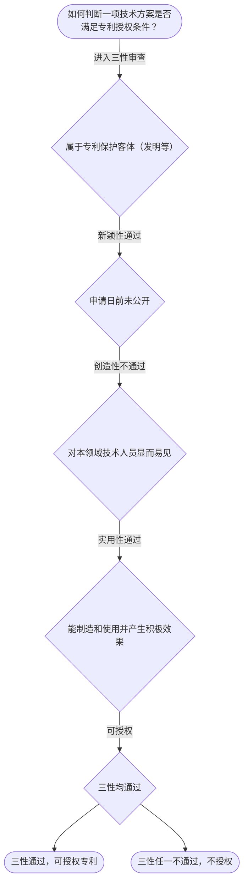

# 专家 B 教学草稿

> 专家：expert_b ｜ 风格：accessible

## 教学模块选择清单

- 当前教学节点：`patent-law-foundation`
- 板块预算：自适应 5/5，总计 9/9

| # | 模块 (block_type) | 类型 | 触发原因 (trigger) | 对应正文段 | 归属 |
|---:|---|:--:|---|---|:--:|
| 1 | `anchor_scenario` | 自适应 | perception=sensing(0.88) / cold_start | 场景导入｜某材料研发团队开发了一种新型高分子电池材料，申请专利时发现可能在材料博览会展出导致公开行为，… | [B] |
| 2 | `legal_anchor` | 必选 | mandatory | 法条锚定｜《专利法》第二条 | [B] |
| 3 | `worked_example` | 自适应 | cognition.apply=0.28<0.4 / cognition.analyze=0.24<0.3 / cold_start | 案例演示｜甲材料公司2023年1月1日在材料博览会展出新型电池材料，2023年6月1日提出专利申请。问… | [B] |
| 4 | `decision_flow` | 自适应 | input=visual(0.81) | 决策流程｜如何判断一项技术方案是否满足专利授权条件？ | [B] |
| 5 | `mnemonic` | 自适应 | remember=0.66>=0.6 & apply<0.4 / understanding=sequential(0.74) | 记忆口诀｜三性判定口诀：新（未公开）创（不显见）实（能用有用） | [B] |
| 6 | `reflect_prompt` | 自适应 | processing=reflective(0.68) | 反思提示｜在材料领域申请专利时，你会如何处理展会展示和论文发表的公开行为？ | [B] |
| 7 | `assessment` | 必选 | mandatory | 测评｜专利保护客体 | [B] |
| 8 | `knowledge_synthesis` | 必选 | mandatory | 知识综合｜专利保护客体：发明、实用新型和外观设计（专利法第2条） | [B] |
| 9 | `summary_card` | 自适应 | len(knowledge_sub_nodes)=3>=3 | 速查卡｜先定客体，再判三性，掌握基础才能进行实质审查。 | [B] |

## 教学正文

## 1. 场景导入
某材料研发团队开发了一种新型高分子电池材料，申请专利时发现可能在材料博览会展出导致公开行为，需先判断是否属于发明客体，再审查新颖性和创造性以确保授权。这是一个典型的材料领域专利申请场景，涉及保护客体、制度体系和授权三性判断，是理解专利法律制度基础的入门情境。

## 2. 人话解释
专利法律制度基础包括专利保护的三种客体（发明、实用新型和外观设计），由专利法第二条规定。中国专利制度体系有专利法、实施细则和审查指南。专利制度具有独占性、时间性、地域性等特征，其作用在于激励发明创造、促进技术公开和推动技术应用。中国专利制度发展特点是早期公开延迟审查，采用初步审查制与实质审查制并存的方式。

## 3. 法条回扣
《专利法》第二条：本法所称的发明创造是指发明、实用新型和外观设计。发明，是指对产品、方法或者其改进所提出的新的技术方案。实用新型，是指对产品的形状、构造或者其结合所提出的适于实用的新的技术方案。外观设计，是指对产品的整体或者局部的形状、图案或者其结合以及色彩与形状、图案的结合所作出的富有美感并适于工业应用的新设计。

《专利法》第三条：国务院专利行政部门负责管理全国的专利工作；统一受理和审查专利申请，依法授予专利权。
〔RAG: 专利法.txt — 第二条 ...〕

## 4. 类比 / 口诀
使用三性判断口诀：新（未公开）创（不显见）实（能用有用）。类似对比专利审查流程，先查新颖性，再创造性，最后实用性。适用边界：仅用于授权时实体审查，不适用于侵权或无效。

## 5. 应试提示
题干中关键词如“申请日”“公开”“现有技术”。判断步骤：1. 确定技术方案是否属于专利保护客体；2. 检查申请日前是否有公开；3. 判断是否属于宽限期；4. 分析是否显而易见；5. 看是否能产生积极效果。常见陷阱是忽略宽限期或混淆创造性与实用性。

## 6. 互动提问
本节内容可帮助理解专利基础，建议在后续习题中练习三性判断。请查看【习题】区获取互动题。

### 场景导入（anchor_scenario）

> 某材料研发团队开发了一种新型高分子电池材料，申请专利时发现可能在材料博览会展出导致公开行为，需先判断是否属于发明客体，再审查新颖性和创造性以确保授权。这是一个典型的材料领域专利申请场景，涉及保护客体、制度体系和授权三性判断，是理解专利法律制度基础的入门情境。

**锚定**：这个场景锚定了专利保护客体、制度体系和授权三性等抽象知识点。

**先想一想**：在申请专利前，你会先考虑材料是否属于专利保护范围吗？为什么？

### 法条锚定（legal_anchor）

- **《专利法》第二条**：专利保护的客体是发明、实用新型和外观设计。
- **《专利法》第三条**：专利管理由国务院专利行政部门负责。

**为何重要**：本节讲解专利法律制度基础，三种客体和制度体系是后续新颖性和创造性判断的前提，必须先掌握。

### 案例演示（worked_example）

**案情/例题**：甲材料公司2023年1月1日在材料博览会展出新型电池材料，2023年6月1日提出专利申请。问：此展出是否影响新颖性？假设该材料在申请前未公开。
**适用规则**：《专利法》第二十四条（不丧失新颖性宽限期）
**分步推演**：
1. 展出日在申请日前，属政府或博览会公开。 → *符合宽限期情形*
2. 距离申请日约5个月小于6个月。 → *在宽限期内*
3. 宽限期只豁免新颖性，不影响创造性和实用性。 → *仍需判断三性*
**结论**：展出不破坏新颖性，但需继续判断创造性和实用性。
**本题要点**：宽限期是特定公开的缓冲机制，但不能免除其他审查。

### 决策流程（decision_flow）

**决策问题**：如何判断一项技术方案是否满足专利授权条件？



### 记忆口诀（mnemonic）

**记忆锚**：三性判定口诀：新（未公开）创（不显见）实（能用有用）
**映射**：
- 新
- 创
- 实
**何时用**：在判断专利授权时，当遇到‘是不是新颖’‘是不是显而易见’时使用

### 反思提示（reflect_prompt）

**反思问题**：在材料领域申请专利时，你会如何处理展会展示和论文发表的公开行为？

**关注要点**：公开行为的日期如何计算宽限期；不同类型公开对新颖性的影响；与创造性和实用性的关系

**连接**：连接到现有技术定义和宽限期规则

### 知识综合（knowledge_synthesis）

**知识框架**：
- 专利保护客体：发明、实用新型和外观设计（专利法第2条）
- 中国专利制度体系：专利法、实施细则、审查指南
- 专利制度特征：独占性、时间性、地域性
- 专利制度作用：激励发明创造、促进技术公开、推动应用
- 中国发展特点：早期公开、初步审查与实质审查并存
**概念关系**：三种客体是专利授权的前提，三性是核心判断标准；制度体系为审查提供法律依据
**必记**：专利授权需满足保护客体、三性要求；三种客体是专利授权的前提，三性是核心判断标准

### 速查卡（summary_card）

**要点卡**：
- **保护客体**：发明、实用新型和外观设计
- **三性**：新颖性、创造性、实用性
- **制度特征**：独占性、时间性、地域性
- **发展特点**：早期公开、初步审查与实质审查并存
**必背**：三性缺一不可；专利客体范围
**一句话总结**：先定客体，再判三性，掌握基础才能进行实质审查。

### 测评（assessment）

**三类覆盖**：backward_review、forward_probe、weakness_probe
**题目**：
- br1：专利保护客体
- fp1：下一节点探测
- wp1：新颖性与创造性区分


## 结构化字段

## knowledge_points

```json
[
  {
    "node_id": "patent-law-foundation",
    "kc_name": "专利制度的基本概念与特征：独占性、时间性、地域性"
  },
  {
    "node_id": "patent-law-foundation",
    "kc_name": "中国专利制度体系：专利法、专利法实施细则、专利审查指南"
  },
  {
    "node_id": "patent-law-foundation",
    "kc_name": "专利保护的三种客体：发明、实用新型、外观设计（专利法第2条）"
  },
  {
    "node_id": "patent-law-foundation",
    "kc_name": "专利制度的作用：激励发明创造、促进技术公开、推动技术应用和经济发展"
  },
  {
    "node_id": "patent-law-foundation",
    "kc_name": "中国专利制度发展历程与特点：早期公开延迟审查、初步审查制与实质审查制并存"
  }
]
```

## legal_basis

```json
[
  {
    "article": "《专利法》第二条",
    "source": "中华人民共和国专利法.txt"
  },
  {
    "article": "《专利法》第三条",
    "source": "中华人民共和国专利法.txt"
  }
]
```

## risks

```json
[
  {
    "risk": "混淆新颖性和创造性判断顺序",
    "related_node_id": "patent-law-foundation"
  },
  {
    "risk": "忽略宽限期对新颖性的影响",
    "related_node_id": "patent-law-foundation"
  }
]
```

## draft_stage

```json
"debate"
```

## interactive_questions

```json
[
  {
    "qid": "br1",
    "category": "remember",
    "difficulty": "L1",
    "source_tag": "backward_review",
    "kc_node_id": "patent-law-foundation",
    "question": "专利法第二条规定的发明创造包括哪些客体？",
    "answer": "A",
    "options": [
      "A. 发明、实用新型和外观设计",
      "B. 发明和实用新型",
      "C. 外观设计",
      "D. 以上都不是"
    ]
  },
  {
    "qid": "fp1",
    "category": "remember",
    "difficulty": "L1",
    "source_tag": "forward_probe",
    "kc_node_id": "patent-application-process",
    "question": "专利申请程序的下一个待学节点是什么？",
    "answer": "A",
    "options": [
      "A. 专利申请程序",
      "B. 专利审查指南",
      "C. 实质审查",
      "D. 无效宣告"
    ]
  },
  {
    "qid": "wp1",
    "category": "analyze",
    "difficulty": "L3",
    "source_tag": "weakness_probe",
    "kc_node_id": "patent-law-foundation",
    "question": "在材料领域专利申请中，如何正确区分新颖性与创造性判断？",
    "answer": "A",
    "options": [
      "A. 先新颖性（看公开），再创造性（看显而易见）",
      "B. 先创造性，再新颖性",
      "C. 新颖性和创造性同时判断",
      "D. 新颖性不影响创造性"
    ]
  },
  {
    "qid": "wp2",
    "category": "understand",
    "difficulty": "L3",
    "source_tag": "weakness_probe",
    "kc_node_id": "patent-law-foundation",
    "question": "如果材料博览会在2023年1月1日展出，2023年7月1日申请，该博览会公开是否影响新颖性？",
    "answer": "A",
    "options": [
      "A. 不影响，因为在6个月宽限期内",
      "B. 影响，因为属于公开行为",
      "C. 只影响创造性",
      "D. 需要看是否实用"
    ]
  }
]
```
