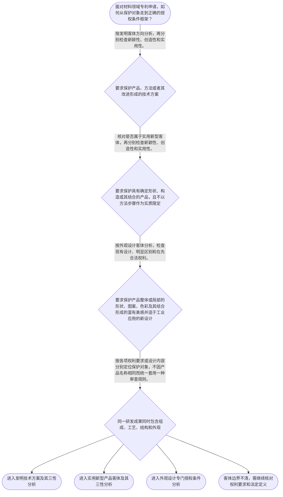

# 整合后的课程完整内容与习题

## 教学模块选择清单

- 当前教学节点：`patent-law-foundation`
- 板块预算：自适应 5/6，总计 9/9

| # | 模块 (block_type) | 类型 | 触发原因 (trigger) | 对应正文段 | 归属 |
|---:|---|:--:|---|---|:--:|
| 1 | `anchor_scenario` | 自适应 | perception=sensing(0.88) / cold_start | 材料技术进入专利制度的第一步｜某材料研发团队完成了一种用于电池隔板的纳米复合材料。该材料具有特定化学组成、层状结构和制备工… | [A+B融合] |
| 2 | `legal_anchor` | 必选 | mandatory | 专利保护客体与授权条件｜《专利法》第二条 | [A+B融合] |
| 3 | `worked_example` | 自适应 | cognition.apply=0.34<0.4 / cognition.analyze=0.27<0.3 / cold_start | 材料申请的客体识别与三性入口｜甲公司研发出一种耐腐蚀层状复合材料，同时掌握该材料的制备方法。拟申请的权利要求一涉及材料组成… | [A+B融合] |
| 4 | `decision_flow` | 自适应 | input=visual(0.81) | 材料专利申请审查框架流程｜面对材料领域专利申请，如何从保护对象走到正确的授权条件框架？ | [A+B融合] |
| 5 | `mnemonic` | 自适应 | remember=0.82>=0.6 & apply<0.4 / understanding=sequential(0.75) | 客体三分与三性分拆表｜客体三分表加三性分拆：发明记“产品、方法、改进技术方案”；实用新型记“产品、形状、构造、结合… | [A+B融合] |
| 6 | `reflect_prompt` | 自适应 | processing=reflective(0.69) | 从研发成果反思专利客体｜回想一个你熟悉的材料研发项目：如果成果同时包含材料组成、制备工艺、产品结构和外观效果，你会怎… | [A+B融合] |
| 7 | `assessment` | 必选 | mandatory | 本节客观测评｜识别专利法规定的三种发明创造类型。 | [A+B融合] |
| 8 | `knowledge_synthesis` | 必选 | mandatory | 专利法律制度基础知识网｜专利制度基本特征：专利权通常具有独占性、时间性和地域性，但本节未提供这些概括的直接规范原文，… | [A+B融合] |
| 9 | `summary_card` | 自适应 | len(knowledge_sub_nodes)=3>=3 | 专利制度基础速查卡｜先辨客体和制度位置，再把对应授权条件拆开判断；材料名称和程序阶段都不能替代实体分析。 | [A+B融合] |

## 教学正文

## 一、先建立总主线

材料研发成果常常同时包含材料组成、制备方法、产品结构和外观表现。分析一项材料专利申请时，先不要被“新型”“先进”等名称带着走，而应依次回答三个问题：第一，要求保护的对象是什么；第二，应适用哪一类专利和审查框架；第三，在该框架下要检查哪些授权条件。这个顺序可以概括为“先辨客体，再定框架，后分条件”。

专利制度的基本特征通常概括为独占性、时间性和地域性：专利权人在法定范围内享有排他性权利，保护期限并非无限，权利效力原则上受授予该权利的国家或地区范围限制。检索上下文未提供这三项概括的直接规范原文，因此这里只把它们作为制度理解框架，不将其错误归因于某一具体条文。专利制度的作用通常包括激励发明创造、以技术公开换取一定期限的保护、促进技术应用和经济发展；这些政策功能同样属于本节点的制度认识，具体表述仍应以补充检索材料为准。

## 二、法条规定的保护客体

《专利法》第二条规定，本法所称的发明创造包括发明、实用新型和外观设计。发明是对产品、方法或者其改进所提出的新的技术方案；实用新型是对产品的形状、构造或者其结合所提出的适于实用的新的技术方案；外观设计是对产品的整体或者局部的形状、图案或者其结合以及色彩与形状、图案的结合所作出的富有美感并适于工业应用的新设计。〔RAG: 中华人民共和国专利法.txt — 第二条：发明创造包括发明、实用新型和外观设计；三类客体的定义〕

发明的保护对象范围较广，可以涉及新产品、新方法以及老产品或老方法的改进形成的技术方案。检索材料强调，判断发明客体的重点不是仅看“新”字，而是看是否形成技术方案，即是否采用技术手段解决技术问题并获得符合自然规律的技术效果。〔RAG: 专利法专题讲座.txt — 发明保护对象包括新产品、新方法及改进形成的技术方案；判断重点是“技术方案”〕

实用新型只保护产品，不保护制造方法、使用方法、通讯方法、处理方法或将产品用于特定用途等方法方案。具有产品形状、构造并占据一定空间的实体，才可能进入实用新型客体分析。权利要求如果既写产品形状，又写制造步骤或处理步骤，不能仅因其中有产品形状就当然认定属于实用新型客体。〔RAG: 专利法专题讲座.txt — 实用新型只保护具有确定形状、构造并占据一定空间的产品；各种方法不属于实用新型保护客体〕

外观设计关注产品整体或局部的形状、图案、色彩及其结合所形成的富有美感并适于工业应用的新设计。它的判断对象是产品外观设计，不是材料组成或制备工艺，因此不能把发明技术方案的判断语言直接套用于外观设计。〔RAG: 中华人民共和国专利法.txt — 第二条：外观设计是产品整体或局部的形状、图案、色彩及其结合形成的新设计〕

## 三、制度体系与授权条件

中国专利制度的主要规范层次包括《专利法》《专利法实施细则》和《专利审查指南》。《专利法》提供基本法律规则，实施细则对申请、审查等事项作进一步规定，审查指南则提供审查实践中的具体判断和操作指引。三者应结合使用，但规范效力和作用层次不能混为一谈。本节检索上下文未提供实施细则和审查指南关于制度体系的完整原文，涉及具体程序细节时应以补充检索为准。

《专利法》第二十二条规定，授予专利权的发明和实用新型应当具备新颖性、创造性和实用性。该条同时规定，现有技术是申请日以前在国内外为公众所知的技术；创造性对发明要求具有突出的实质性特点和显著的进步，对实用新型要求具有实质性特点和进步；实用性是能够制造或者使用，并且能够产生积极效果。〔RAG: 中华人民共和国专利法.txt — 第二十二条：发明和实用新型的三性、现有技术及创造性和实用性标准〕

因此，新颖性、创造性和实用性是不同的判断任务。新颖性重点关注申请方案是否属于现有技术以及是否存在法定的同样申请情形；创造性关注相对于现有技术是否达到法定的实质性特点和进步要求；实用性关注方案能否制造或使用并产生积极效果。不能因为材料名称没有见过，就直接认定新颖性和创造性成立，也不能以“效果好”一句话替代三性分析。

外观设计适用不同的授权条件框架。《专利法》第二十三条规定，授予专利权的外观设计应当不属于现有设计，与现有设计或现有设计特征的组合相比应当具有明显区别，并且不得与他人在申请日前已经取得的合法权利相冲突。〔RAG: 中华人民共和国专利法.txt — 第二十三条：外观设计的现有设计、明显区别及在先合法权利要求〕

## 四、审查流程的制度位置

专利制度还包括申请、审查和授权等程序环节。现有检索材料涉及初步审查、实质审查、复审和无效宣告等程序语境，并显示发明专利通常存在早期公开和延迟审查的制度安排，初步审查制与实质审查制并存。但本节检索上下文未提供中国专利制度发展历程和上述制度安排的完整直接历史或规范原文，因此只能作边界提示，不能进一步虚构具体年份、期限或程序细节。

程序层面与实体层面需要分开：初步审查或实质审查说明案件处于何种审查流程，不等于已经满足新颖性、创造性和实用性。申请文件是程序进入和实体判断的重要载体。《专利法》第二十六条规定，申请发明或者实用新型专利应当提交请求书、说明书及其摘要和权利要求书等文件。〔RAG: 中华人民共和国专利法.txt — 第二十六条：发明或者实用新型专利申请应提交请求书、说明书及其摘要和权利要求书等文件〕

## 五、材料申请中的应用顺序

面对“具有特殊层状结构及制备方法的复合材料”，应先阅读权利要求，确认其要求保护的是材料产品、制备方法、产品形状构造，还是产品外观。如果权利要求保护产品或方法等技术方案，通常进入发明客体分析；如果仅保护产品的形状、构造或其结合并符合实用新型定义，才进入实用新型客体分析；如果保护的是产品外观的形状、图案、色彩及其结合，则进入外观设计框架。

确定客体后，再分别检查相应授权条件。发明和实用新型需要分别判断新颖性、创造性和实用性；外观设计则按照现有设计、明显区别和在先权利等规则判断。材料名称、实验效果或外观变化都不能跳过客体识别，也不能把一种类型的判断结论直接移植到另一种类型。

## 六、完整决策路径

面对材料领域专利申请，可以沿着以下路径执行。第一，如果要求保护产品、方法或者其改进形成的技术方案，就按发明客体方向分析，随后分别检查新颖性、创造性和实用性。第二，如果要求保护的是具有确定形状、构造或其结合的产品，且没有以方法步骤作为实质限定，就核对其是否属于实用新型客体，确认后同样分别检查新颖性、创造性和实用性。第三，如果要求保护的是产品整体或局部的形状、图案、色彩及其结合形成的富有美感并适于工业应用的新设计，就按外观设计客体分析，检查现有设计、明显区别和在先合法权利。第四，如果同一研发成果同时包含材料组成、制备工艺、产品结构和外观，就应按各项权利要求或设计内容分别定位保护对象，不因产品名称相同而统一套用一种审查规则。

这一路径的终点有四种：进入发明技术方案及其三性分析；进入实用新型产品客体及其三性分析；进入外观设计专门授权条件分析；或者因客体边界不清，继续核对权利要求和法定定义。可用一个关键问题检查自己是否走对了：“我现在判断的是保护对象，还是已经进入授权条件判断？”前者属于客体定位，后者才涉及新颖性、创造性、实用性或外观设计专门条件。

## 七、记忆与辨析方法

记忆时使用“客体三分表加三性分拆”。第一组是“产品、方法、改进技术方案”，对应发明可以保护的对象；第二组是“产品、形状、构造、结合”，对应实用新型的客体边界；第三组是“形状、图案、色彩、美感设计”，对应外观设计的审查对象。完成客体定位后，再用“新—创—实”拆分发明或实用新型的判断任务：“新”对应新颖性，重点核对现有技术及法定同样申请情形；“创”对应创造性，发明和实用新型的法定要求不同；“实”对应实用性，要求能够制造或者使用并产生积极效果。

因此，看到材料专利类型、保护客体或授权条件问题时，先用前三组定位对象，再用“新—创—实”拆分判断任务；如果是外观设计，则切换到现有设计、明显区别和在先合法权利框架。口诀只是记忆工具，不能替代法条、权利要求解释和具体事实判断。

## 八、材料研发经验的反思连接

请回想一个你熟悉的材料研发项目：如果成果同时包含材料组成、制备工艺、产品结构和外观效果，你会怎样把技术事实分别转换为保护客体，并为每种客体选择对应的授权条件？反思时重点关注四点：技术事实与权利要求要求保护的对象不是同一层次；产品、方法、形状构造和外观设计具有不同的法定边界；发明和实用新型的三性与外观设计专门条件不能混用；审查流程所处阶段不能代替实体授权条件判断。这样可以把已有材料研发经验连接到后续的专利申请程序、新颖性、创造性及实用性判断。

## 九、知识网络收束

本节点的知识网络可以按五个部分理解。第一，专利制度基本特征是独占性、时间性和地域性，但相关概括在本节没有完整直接规范原文，只作为制度背景理解。第二，中国专利制度体系以《专利法》为基本法律依据，并结合《专利法实施细则》和《专利审查指南》理解申请与审查规则。第三，三类保护客体分别是：发明保护产品、方法或者其改进形成的技术方案；实用新型保护产品的形状、构造或者其结合；外观设计保护产品整体或局部的外观新设计。第四，专利制度通常通过授予一定范围和期限的权利换取技术公开，从而激励发明创造、促进技术应用和经济发展，但相关政策功能原文仍需补充核验。第五，制度发展与审查流程涉及早期公开、延迟审查以及初步审查和实质审查并存等概括，具体期限、流程和历史事实必须以直接检索材料为准。

学完后至少应记住：先按权利要求或设计内容识别保护客体，不能把产品、方法、形状构造和外观设计混为一谈；发明和实用新型应分别判断新颖性、创造性和实用性；《专利法》第二十二条将现有技术界定为申请日以前在国内外为公众所知的技术；外观设计适用《专利法》第二十三条的现有设计、明显区别和在先合法权利框架；申请文件以及初步、实质审查属于程序接口，程序推进不等于实体授权条件已经满足。它们之间的关系是：先依据《专利法》第二条识别保护客体，再确定相应审查框架，最后进入三性或外观设计专门条件判断。

## 十、速查卡

第一张卡是“制度基本特征”：专利制度通常概括为独占性、时间性和地域性，具体边界需结合直接依据核验。第二张卡是“中国制度体系”：以专利法为核心，并结合实施细则和审查指南理解申请与审查。第三张卡是“三类保护客体”：发明看产品、方法或改进技术方案；实用新型看产品形状、构造；外观设计看产品外观新设计。第四张卡是“授权条件”：发明和实用新型分别判断新颖性、创造性和实用性，外观设计适用专门规则。第五张卡是“程序接口”：申请、初步审查和实质审查是流程问题，不能与实体授权结论混同。

必背要点是：《专利法》第二条规定发明、实用新型和外观设计三类发明创造及其基本定义；《专利法》第二十二条规定发明和实用新型应具备新颖性、创造性和实用性；《专利法》第二十三条规定外观设计的现有设计、明显区别和在先合法权利；分析材料专利时，先识别保护客体，再确定审查框架，最后分别判断具体授权条件。归纳成一句话就是：先辨客体和制度位置，再把对应授权条件拆开判断；材料名称和程序阶段都不能替代实体分析。

## 十一、易混淆点

误解一：“材料名称从未出现过，所以专利一定具备新颖性和创造性。”

正解推理：法律判断对象是权利要求所限定的技术方案或设计，不是名称。应先确定保护客体，再以申请日为时间基准，分别判断新颖性、创造性和实用性。

区分判据：看权利要求限定的技术特征、比较对象和判断标准，而不是看产品名称是否新颖。

误解二：“产品有形状，就一定可以申请实用新型。”

正解推理：实用新型要求保护产品的形状、构造或者其结合所提出的适于实用的新的技术方案；制造方法、使用方法和包含方法步骤的方案不能仅凭存在产品形状就归入实用新型。

区分判据：先检查权利要求是否实质上保护具有确定形状和构造的产品，是否混入方法或用途限定。

误解三：“初步审查通过，就说明专利已经具备创造性。”

正解推理：审查阶段是程序问题，创造性是实体授权条件。程序向前推进不等于所有实体条件已经满足。

区分判据：凡问题问的是案件处于什么流程，属于程序判断；凡问题问的是是否符合新颖性、创造性或实用性，属于实体判断。

本节设有测评，请到【习题】区作答。

### 材料技术进入专利制度的第一步（anchor_scenario）

> 某材料研发团队完成了一种用于电池隔板的纳米复合材料。该材料具有特定化学组成、层状结构和制备工艺，团队还设计了特殊的产品外观。专利专员准备申请时发现，若把产品、方法、结构和外观混为一谈，可能选错专利类型，也可能在后续新颖性、创造性判断中使用错误的比较方法。团队需要先解决“保护什么对象、适用什么框架”的冲突。

**锚定**：用材料产品、工艺、结构和外观并存的情境，锚定“先辨客体、再定框架、后分条件”的制度主线。

**先想一想**：如果你是专利专员，面对这项复合材料成果，你会先判断专利客体，还是先检索新颖性？判断顺序依据什么？

### 专利保护客体与授权条件（legal_anchor）

- **《专利法》第二条**：第二条把专利法保护的发明创造分为发明、实用新型和外观设计，并分别说明三类客体的基本边界。
- **《专利法》第二十二条**：第二十二条是发明和实用新型的授权三性入口：要分别检查新颖性、创造性和实用性，并以申请日前公众所知的技术作为现有技术参照。
- **《专利法》第二十三条**：第二十三条规定外观设计应不属于现有设计、与现有设计相比具有明显区别，并不得侵害在先合法权利。
- **《专利法》第二十六条**：第二十六条规定发明或者实用新型申请应提交请求书、说明书及其摘要和权利要求书等文件。

**为何重要**：这些条文共同搭建本节点的规范骨架：先识别保护客体，再区分发明、实用新型和外观设计的审查条件，并把申请文件和后续审查流程连接起来。

### 材料申请的客体识别与三性入口（worked_example）

**案情/例题**：甲公司研发出一种耐腐蚀层状复合材料，同时掌握该材料的制备方法。拟申请的权利要求一涉及材料组成和层状结构，权利要求二涉及制备步骤，另有一组图片主要表现产品外观。问题是：分析这组申请时应先判断什么，之后分别进入哪些授权条件框架？
**适用规则**：适用《专利法》第二条、第二十二条和第二十三条：先识别权利要求或设计所保护的客体，再分别适用发明、实用新型或外观设计的授权条件。
**分步推演**：
1. 先阅读权利要求和外观图片，区分材料产品、制备方法、产品形状构造与产品外观。不能把“层状复合材料”这个名称直接当作专利类型或授权结论。 → *第一步是确定实际要求保护的对象。*
2. 产品组成和制备方法属于可能的技术方案，原则上进入发明客体分析；如果某项权利要求仅保护具有确定形状、构造的产品，且没有实质性方法限定，才可能进入实用新型客体分析。 → *第二步是用第二条区分发明与实用新型的客体边界。*
3. 如果图片和申请内容实际保护的是产品整体或局部的形状、图案、色彩及其结合形成的设计，则转入外观设计框架，不能直接使用发明技术方案的创造性判断语言。 → *第三步是识别外观设计并切换专门规则。*
4. 进入发明或实用新型的授权条件分析后，依据第二十二条分别检查新颖性、创造性和实用性；进入外观设计分析后，依据第二十三条检查现有设计、明显区别和在先合法权利。 → *第四步是按客体分别拆分授权条件。*
**结论**：该申请不能仅凭材料名称或技术效果得出结论。产品组成和制备方法通常从发明客体方向分析；仅涉及产品形状、构造的部分才可能进入实用新型；外观表现则适用外观设计框架。确定客体后，再分别进行对应的实体条件判断。
**本题要点**：材料专利分析的基本能力是先读懂权利要求和设计内容，再把客体分类与授权条件逐一对应。

### 材料专利申请审查框架流程（decision_flow）

**决策问题**：面对材料领域专利申请，如何从保护对象走到正确的授权条件框架？



### 客体三分与三性分拆表（mnemonic）

**记忆锚**：客体三分表加三性分拆：发明记“产品、方法、改进技术方案”；实用新型记“产品、形状、构造、结合”；外观设计记“形状、图案、色彩、美感设计”；进入发明或实用新型授权判断后，再逐项核对“新、创、实”。
**映射**：
- 产品、方法、改进
- 产品、形状、构造、结合
- 形状、图案、色彩、美感设计
- 新
- 创
- 实
**何时用**：看到材料专利类型、保护客体或授权条件问题时，先用前三组定位对象，再用“新—创—实”拆分发明或实用新型的判断任务；若是外观设计，则切换到现有设计和明显区别框架。

### 从研发成果反思专利客体（reflect_prompt）

**反思问题**：回想一个你熟悉的材料研发项目：如果成果同时包含材料组成、制备工艺、产品结构和外观效果，你会怎样把技术事实分别转换为保护客体，并为每种客体选择对应的授权条件？

**关注要点**：技术事实与权利要求要求保护的对象不是同一个层次；产品、方法、形状构造和外观设计的法定边界；发明和实用新型的三性与外观设计专门条件不能混用；审查流程所处阶段不能代替实体授权条件判断

**连接**：连接已有材料研发经验，并为后续学习专利申请程序、新颖性、创造性及实用性判断建立分类接口。

### 专利法律制度基础知识网（knowledge_synthesis）

**知识框架**：
- 专利制度基本特征：专利权通常具有独占性、时间性和地域性，但本节未提供这些概括的直接规范原文，具体边界需补充核验。
- 中国专利制度体系：以《专利法》为基本法律依据，并结合《专利法实施细则》和《专利审查指南》理解申请与审查规则；后两者的体系性原文未在本节检索上下文中完整提供。
- 三类保护客体：发明保护产品、方法或者其改进形成的技术方案；实用新型保护产品的形状、构造或者其结合；外观设计保护产品整体或局部的外观新设计。
- 制度作用：通常通过授予一定范围和期限的权利换取技术公开，从而激励发明创造、促进技术应用和经济发展；相关政策功能原文需补充核验。
- 制度发展与审查流程：本节点涉及早期公开、延迟审查以及初步审查和实质审查并存的制度概括，但本节未提供其完整直接历史或规范依据，不能扩展为具体程序结论。
**概念关系**：先依据《专利法》第二条识别保护客体，再确定发明、实用新型或外观设计的审查框架。；发明和实用新型进入《专利法》第二十二条的三性判断，外观设计进入第二十三条的专门条件判断。；新颖性、创造性和实用性彼此区分，不能以产品名称或技术效果一句话替代三项判断。；申请文件和初步、实质审查属于程序接口，程序推进不等于实体授权条件已经满足。；制度特征、制度作用和发展历程用于建立整体背景，但具体期限、流程和历史事实必须以补充检索材料为准。
**必记**：先按权利要求或设计内容识别保护客体，不能把产品、方法、形状构造和外观设计混为一谈。；发明和实用新型应分别判断新颖性、创造性和实用性；三者是不同的授权条件。；《专利法》第二十二条将现有技术界定为申请日以前在国内外为公众所知的技术。；外观设计适用《专利法》第二十三条的现有设计、明显区别和在先合法权利框架。；制度特征、制度作用和发展历程的具体表述，在缺少直接检索依据时只能作为待核验的知识边界，不能伪造法条出处。

### 专利制度基础速查卡（summary_card）

**要点卡**：
- **制度基本特征**：专利制度通常概括为独占性、时间性和地域性；具体边界需结合直接依据核验。
- **中国制度体系**：以专利法为核心，并结合实施细则和审查指南理解申请与审查。
- **三类保护客体**：发明看产品、方法或改进技术方案；实用新型看产品形状构造；外观设计看产品外观新设计。
- **授权条件**：发明和实用新型分别判断新颖性、创造性和实用性，外观设计适用专门规则。
- **程序接口**：申请、初步审查和实质审查是流程问题，不能与实体授权结论混同。
**必背**：《专利法》第二条规定发明、实用新型和外观设计三类发明创造及其基本定义。；《专利法》第二十二条规定发明和实用新型应具备新颖性、创造性和实用性。；《专利法》第二十三条规定外观设计的现有设计、明显区别和在先合法权利要求。；先识别保护客体，再确定审查框架，最后分别判断具体授权条件。
**一句话总结**：先辨客体和制度位置，再把对应授权条件拆开判断；材料名称和程序阶段都不能替代实体分析。

### 本节客观测评（assessment）

**三类覆盖**：backward_review、forward_probe、weakness_probe
**题目**：
- q_backward_01：识别专利法规定的三种发明创造类型。
- q_forward_01：初步探测发明或者实用新型专利申请文件的主要构成。
- q_weakness_01：区分材料产品、制备方法、形状构造和外观设计的客体及授权框架。


## 结构化数据

## expert

```json
"A+B融合"
```

## style

```json
"fused"
```

## knowledge_points

```json
[
  {
    "node_id": "patent-law-foundation",
    "kc_name": "专利制度的基本概念与特征：独占性、时间性、地域性"
  },
  {
    "node_id": "patent-law-foundation",
    "kc_name": "中国专利制度体系：专利法、专利法实施细则、专利审查指南"
  },
  {
    "node_id": "patent-law-foundation",
    "kc_name": "专利保护的三种客体：发明、实用新型、外观设计（专利法第2条）"
  },
  {
    "node_id": "patent-law-foundation",
    "kc_name": "专利制度的作用：激励发明创造、促进技术公开、推动技术应用和经济发展"
  },
  {
    "node_id": "patent-law-foundation",
    "kc_name": "中国专利制度发展历程与特点：早期公开延迟审查、初步审查制与实质审查制并存"
  }
]
```

## legal_basis

```json
[
  {
    "article": "《专利法》第二条",
    "source": "中华人民共和国专利法.txt"
  },
  {
    "article": "《专利法》第二十二条",
    "source": "中华人民共和国专利法.txt"
  },
  {
    "article": "《专利法》第二十三条",
    "source": "中华人民共和国专利法.txt"
  },
  {
    "article": "《专利法》第二十六条",
    "source": "中华人民共和国专利法.txt"
  },
  {
    "article": "《专利法》第二十四条",
    "source": "中华人民共和国专利法.txt"
  },
  {
    "article": "关于实用新型和发明创造性比较范围及现有技术数量的审查规则",
    "source": "专利法律知识详细解读.txt"
  },
  {
    "article": "关于发明、实用新型和外观设计保护客体的审查规则",
    "source": "专利法专题讲座.txt"
  }
]
```

## risks

```json
[
  {
    "risk": "检索上下文未提供独占性、时间性、地域性、制度作用及发展历程的完整直接规范原文，相关内容只能作为制度框架提示，不能据此编造具体期限、地域边界或历史事实。",
    "related_node_id": "patent-law-foundation"
  },
  {
    "risk": "材料名称、技术效果或外观变化不能直接等同于新颖性或创造性成立，必须先识别权利要求保护客体并分别判断授权条件。",
    "related_node_id": "patent-law-foundation"
  },
  {
    "risk": "实用新型只保护符合定义的产品，制备方法、使用方法和用途方案不能仅因涉及产品就当然归入实用新型。",
    "related_node_id": "patent-law-foundation"
  },
  {
    "risk": "申请文件、初步审查和实质审查属于程序接口，本节只作基础衔接，不据此宣称学习者已经掌握下一节点的完整申请程序。",
    "related_node_id": "patent-application-process"
  }
]
```

## draft_stage

```json
"integration"
```

## irac

```json
{
  "issue": "材料领域研发成果可能同时包含产品组成、制备方法、产品结构和外观表现。本节点需要确定专利保护客体、制度规范层次以及不同客体与授权条件之间的衔接关系。",
  "rule": "《专利法》第二条规定发明、实用新型和外观设计及其定义；第二十二条规定发明和实用新型应具备新颖性、创造性和实用性，并界定现有技术；第二十三条规定外观设计的现有设计、明显区别和在先合法权利要求；第二十六条规定发明或者实用新型申请应提交请求书、说明书及其摘要和权利要求书等文件。",
  "application": "处理材料领域申请时，应先根据权利要求识别产品、方法、形状构造或外观设计等保护对象，再选择发明、实用新型或外观设计的审查框架。发明和实用新型分别检查新颖性、创造性和实用性，外观设计适用第二十三条的专门规则。申请和审查流程属于程序层面，不能替代实体授权条件判断。",
  "conclusion": "材料专利分析应遵循“先辨客体、再定框架、后分条件”的顺序。理解专利制度的基本特征、规范体系、制度作用和审查流程位置，是后续学习新颖性和创造性具体判断方法的前提。"
}
```

## interactive_questions

```json
[
  {
    "qid": "q_backward_01",
    "category": "remember",
    "difficulty": "L1",
    "source_tag": "backward_review",
    "kc_node_id": "patent-law-foundation",
    "question": "根据《专利法》第二条，下列哪一组完整列出了专利法所称的三种发明创造？",
    "answer": "B",
    "options": [
      "A. 发明、商标、著作权作品",
      "B. 发明、实用新型、外观设计",
      "C. 发明、实用性、创造性",
      "D. 产品、方法、商业模式"
    ]
  },
  {
    "qid": "q_forward_01",
    "category": "remember",
    "difficulty": "L1",
    "source_tag": "forward_probe",
    "kc_node_id": "patent-application-process",
    "question": "根据《专利法》第二十六条，申请发明或者实用新型专利通常应提交下列哪组文件？",
    "answer": "A",
    "options": [
      "A. 请求书、说明书及其摘要、权利要求书等文件",
      "B. 仅有产品照片和销售合同",
      "C. 仅有发明人身份证明和实验原始记录",
      "D. 仅有权利要求书，不需要说明书"
    ]
  },
  {
    "qid": "q_weakness_01",
    "category": "analyze",
    "difficulty": "L3",
    "source_tag": "weakness_probe",
    "kc_node_id": "patent-law-foundation",
    "question": "某材料企业拟申请一种“具有特殊层状结构及制备方法的复合材料”。下列判断最准确的是：",
    "answer": "D",
    "options": [
      "A. 只要材料名称未出现过，就必然同时具备新颖性和创造性",
      "B. 只要产品有新的外观，就应直接按照发明创造性判断，不必区分客体",
      "C. 只要制备方法具有技术效果，就可以按实用新型客体申请",
      "D. 应先按权利要求识别产品、方法、形状构造或外观设计等保护对象，再选择相应审查框架并分别判断授权条件"
    ]
  }
]
```

## knowledge_synthesis

```json
{
  "node": "patent-law-foundation",
  "coverage": [
    {
      "node_id": "patent-rights-nature"
    },
    {
      "node_id": "patent-law-framework"
    },
    {
      "node_id": "patent-law-foundation"
    },
    {
      "node_id": "patent-system-overview"
    }
  ],
  "confusable_pairs": [
    {
      "pair": "发明与实用新型：发明可保护产品、方法或者其改进形成的技术方案；实用新型只保护符合定义的产品形状、构造或其结合。"
    },
    {
      "pair": "新颖性与创造性：新颖性和创造性都是独立授权条件，前者不能与现有技术相同，后者还要判断法定的实质性特点和进步，比较方法不能混用。"
    },
    {
      "pair": "初步审查与实质审查：二者属于程序阶段概念，审查阶段推进不等于新颖性、创造性和实用性已经满足。"
    },
    {
      "pair": "技术方案与外观设计：材料组成和制备工艺通常涉及技术方案，产品形状、图案、色彩及其结合形成的外观设计适用不同规则。"
    }
  ]
}
```

## exercises

```json
[
  {
    "question": "根据《专利法》第二条，下列哪一组完整列出了专利法所称的三种发明创造？",
    "answer": "B",
    "options": [
      "A. 发明、商标、著作权作品",
      "B. 发明、实用新型、外观设计",
      "C. 发明、实用性、创造性",
      "D. 产品、方法、商业模式"
    ]
  },
  {
    "question": "根据《专利法》第二十六条，申请发明或者实用新型专利通常应提交下列哪组文件？",
    "answer": "A",
    "options": [
      "A. 请求书、说明书及其摘要、权利要求书等文件",
      "B. 仅有产品照片和销售合同",
      "C. 仅有发明人身份证明和实验原始记录",
      "D. 仅有权利要求书，不需要说明书"
    ]
  },
  {
    "question": "某材料企业拟申请一种“具有特殊层状结构及制备方法的复合材料”。下列判断最准确的是：",
    "answer": "D",
    "options": [
      "A. 只要材料名称未出现过，就必然同时具备新颖性和创造性",
      "B. 只要产品有新的外观，就应直接按照发明创造性判断，不必区分客体",
      "C. 只要制备方法具有技术效果，就可以按实用新型客体申请",
      "D. 应先按权利要求识别产品、方法、形状构造或外观设计等保护对象，再选择相应审查框架并分别判断授权条件"
    ]
  }
]
```
