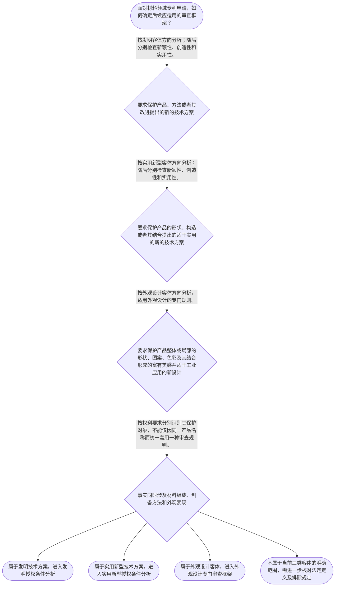

# 专家 A 教学草稿

> 专家：expert_a ｜ 风格：conservative

## 教学模块选择清单

- 当前教学节点：`patent-law-foundation`
- 板块预算：自适应 None/None，总计 None/None

| # | 模块 (block_type) | 类型 | 触发原因 (trigger) | 对应正文段 | 归属 |
|---:|---|:--:|---|---|:--:|
| 1 | `anchor_scenario` | 自适应 | perception=sensing(0.88) / cold_start | 材料技术进入专利制度的第一步｜某材料研发团队完成了一种耐高温复合涂层：该涂层由特定树脂、陶瓷颗粒和界面处理剂组成，并通过特… | [A] |
| 2 | `legal_anchor` | 必选 | mandatory | 专利保护客体与授权三性｜《专利法》第二条 | [A] |
| 3 | `worked_example` | 自适应 | cognition.apply=0.34<0.4 / cognition.analyze=0.27<0.3 / cold_start | 材料申请的客体识别与三性入口｜甲公司研发出一种耐腐蚀复合材料，并同时掌握其制备方法。产品具有新的化学组成和层状结构，申请人… | [A] |
| 4 | `decision_flow` | 自适应 | input=visual(0.81) | 材料专利申请审查框架流程｜面对材料领域专利申请，如何确定后续应适用的审查框架？ | [A] |
| 5 | `mnemonic` | 自适应 | remember=0.82>=0.6 & apply<0.4 / understanding=sequential(0.75) | 客体三分与三性分拆表｜客体三分表：发明看“产品/方法/改进的技术方案”；实用新型看“产品的形状/构造/结合”；外观… | [A] |
| 6 | `reflect_prompt` | 自适应 | processing=reflective(0.69) | 从研发成果反思专利客体｜在你熟悉的材料研发项目中，同一项成果通常同时包含材料组成、制备工艺、产品结构和外观效果；如果… | [A] |
| 7 | `assessment` | 必选 | mandatory | 本节客观测评｜识别专利法规定的三种发明创造类型。 | [A] |
| 8 | `knowledge_synthesis` | 必选 | mandatory | 专利法律制度基础知识网｜专利制度基本特征：专利权具有独占性、时间性和地域性；本节检索上下文未提供上述特征的直接法条原… | [A] |
| 9 | `summary_card` | 自适应 | len(knowledge_sub_nodes)=3>=3 | 专利制度基础速查卡｜先辨客体和制度位置，再把授权条件拆成新颖性、创造性、实用性分别判断。 | [A] |

## 教学正文

## I — 法律问题

材料研发成果往往同时包含材料组成、产品结构、制备方法和外观表现。专利分析的首要问题不是立即判断“有没有新颖性”，而是先确定要求保护的对象属于发明、实用新型还是外观设计，并据此选择后续审查框架。

## R — 适用规则

《专利法》第二条将发明创造分为发明、实用新型和外观设计。发明是对产品、方法或者其改进所提出的新的技术方案；实用新型是对产品的形状、构造或者其结合所提出的适于实用的新的技术方案；外观设计则针对产品的整体或者局部形状、图案、色彩及其结合形成的富有美感并适于工业应用的新设计。〔RAG: 中华人民共和国专利法.txt — 第二条：发明、实用新型和外观设计的定义〕

《专利法》第二十二条规定，授予发明和实用新型应当具备新颖性、创造性和实用性。该条还规定，现有技术是申请日以前在国内外为公众所知的技术。〔RAG: 中华人民共和国专利法.txt — 第二十二条：发明和实用新型的三性及现有技术定义〕

因此，至少要区分三个层次：第一，保护客体是什么；第二，适用哪一套法律和审查规则；第三，在该框架内分别判断具体授权条件。新颖性和创造性都属于后续重要节点，但二者不能合并为笼统的“技术先进性”判断：本节先建立其所属的授权条件总框架，具体比较方法留待相应节点展开。

中国专利制度通常需要结合《专利法》、实施细则和《专利审查指南》理解。本节检索上下文未提供实施细则和审查指南关于制度体系的完整原文，故不对具体章节或程序细节作超出依据范围的引申。

专利制度的独占性、时间性、地域性，以及通过技术公开促进技术应用和经济发展的制度作用，是本节点要求建立的基础认识；但本节检索上下文未提供这些表述的直接规范原文，学习时应将其作为待核验的制度概念，而不是误记为已检索到的具体法条内容。关于中国制度发展历程中早期公开、延迟审查，以及初步审查与实质审查并存的概括，本节同样缺少直接历史或制度材料，后续应补充检索。

## A — 规则适用

处理一种复合材料申请时，先看权利要求实际要求保护什么。如果要求保护材料产品本身或其制备方法提出的新的技术方案，通常应在发明客体方向进行分析；如果要求保护的内容限于产品的形状、构造或者其结合，并且符合实用新型的法定定义，才进入实用新型客体分析。若要求保护的是产品整体或局部的形状、图案、色彩及其结合形成的外观，则应转入外观设计框架。

确定客体后，发明和实用新型都要分别面对新颖性、创造性和实用性三个条件。不能因为材料名称没有见过，就直接认定三性全部具备；也不能因为实验效果显著，就跳过保护客体识别或把创造性结论替代新颖性结论。外观设计的判断对象和法律表述不同，也不能直接套用发明技术方案的三性分析语言。

在审查流程上，申请文件如何提交、初步审查和实质审查如何衔接，属于程序层面；授权条件是否满足，属于实体层面。两者相互衔接但不可混同：程序已经启动，不等于实体条件已经满足。

## C — 结论

材料领域专利审查应遵循“先辨客体、再定框架、后分条件”的顺序。发明、实用新型和外观设计的保护对象不同；发明和实用新型需要分别判断新颖性、创造性和实用性。新颖性与创造性的具体判断工具将在后续专门节点中展开，本节先确保其法律位置和适用对象不被混淆。

> 常见误区 / 易混淆点
>
> > 1. 把产品名称的新颖误当作专利新颖性成立。法律判断对象是要求保护的技术方案或设计，而不是名称本身。
> > 2. 把新颖性与创造性混为一谈。后续分析必须分别确定比较对象和判断标准，不能用“效果好”一句话同时代替两项判断。
> > 3. 把发明、实用新型、外观设计当作同一审查对象。材料组成和制备方法、产品形状构造、产品外观可能对应不同客体。
> > 4. 把初步审查或实质审查等程序概念当成授权结论。程序阶段与实体条件是不同层次的问题。

本节设有测评，请到【习题】区作答。

### 材料技术进入专利制度的第一步（anchor_scenario）

> 某材料研发团队完成了一种耐高温复合涂层：该涂层由特定树脂、陶瓷颗粒和界面处理剂组成，并通过特定工艺形成层状结构。团队准备申请专利时发现，申请文件中既要说明它属于哪一种专利保护客体，也要进一步面对新颖性、创造性和实用性等授权条件；如果把产品、工艺和外观设计的审查规则混在一起，检索和答复审查意见都会出现方向错误。

**锚定**：用材料产品及其制备工艺的具体事实，锚定保护客体、专利制度框架与授权实质条件之间的先后关系。

**先想一想**：面对这项材料技术，你会先判断它属于发明、实用新型还是外观设计，还是先直接检索新颖性？判断顺序应依据什么？

### 专利保护客体与授权三性（legal_anchor）

- **《专利法》第二条**：第二条先划定专利保护的三类客体：发明是产品、方法或其改进的新的技术方案；实用新型是产品形状、构造或其结合的新的技术方案；外观设计是产品形状、图案、色彩等形成的富有美感并适于工业应用的新设计。
- **《专利法》第二十二条**：第二十二条规定，发明和实用新型取得专利权应具备新颖性、创造性和实用性，并界定了现有技术、三性以及发明与实用新型创造性的不同表述。

**为何重要**：本节点的核心不是先背零散审查结论，而是先确定保护客体和授权条件的总框架。后续学习新颖性、创造性时，必须知道这些判断主要针对发明和实用新型，并以申请日前的现有技术为重要参照。

### 材料申请的客体识别与三性入口（worked_example）

**案情/例题**：甲公司研发出一种耐腐蚀复合材料，并同时掌握其制备方法。产品具有新的化学组成和层状结构，申请人拟提交一份专利申请。需要建立审查分析的第一步：应先判断什么，之后分别进入哪些授权条件判断？
**适用规则**：适用《专利法》第二条和第二十二条：先识别申请方案属于何种保护客体，再对发明或者实用新型检查新颖性、创造性和实用性。外观设计适用第二条关于外观设计的定义及第二十三条的专门判断框架。
**分步推演**：
1. 先观察申请要求保护的技术内容：复合材料产品及制备方法均属于技术方案的可能载体，而不是先把材料名称本身当作专利类型。 → *第一步是识别要求保护的客体和技术方案。*
2. 依据第二条，发明覆盖产品、方法或者其改进所提出的新的技术方案；实用新型只针对产品的形状、构造或者其结合。若权利要求包含制备方法，不能仅按实用新型的产品范围处理。 → *第二步是用法定定义区分发明与实用新型。*
3. 若进入发明或实用新型的授权条件审查，第二十二条要求同时考察新颖性、创造性和实用性；三性是不同问题，不能用“技术效果好”替代全部判断。 → *第三步是分别检查三性，而非合并成一个“先进性”判断。*
4. 若申请实际保护的是产品外观的形状、图案、色彩及其结合，则应转入外观设计客体和专门授权条件的分析，不能直接套用发明创造性的表述。 → *第四步是确认外观设计与技术方案审查框架不可混用。*
**结论**：该申请的核心若是复合材料产品及其制备方法提出的新的技术方案，原则上应从发明专利客体角度分析；若权利要求仅针对产品的形状、构造或者其结合且符合实用新型定义，则可能进入实用新型客体分析。无论属于哪一类，不能仅凭“材料名称新”直接得出已经具备新颖性或创造性的结论。
**本题要点**：处理材料专利问题时，先问“保护的对象是什么”，再问“适用哪套授权条件”，最后分别判断新颖性、创造性和实用性。

### 材料专利申请审查框架流程（decision_flow）

**决策问题**：面对材料领域专利申请，如何确定后续应适用的审查框架？



### 客体三分与三性分拆表（mnemonic）

**记忆锚**：客体三分表：发明看“产品/方法/改进的技术方案”；实用新型看“产品的形状/构造/结合”；外观设计看“形状/图案/色彩的美感设计”。进入授权判断后，再按“新—创—实”分别核对。
**映射**：
- 产品/方法/改进
- 形状/构造/结合
- 形状/图案/色彩
- 新—创—实
**何时用**：看到材料专利申请、专利类型或授权条件问题时，先用“客体三分表”定位对象，再用“新—创—实”拆分判断任务。

### 从研发成果反思专利客体（reflect_prompt）

**反思问题**：在你熟悉的材料研发项目中，同一项成果通常同时包含材料组成、制备工艺、产品结构和外观效果；如果要申请专利，你会如何把这些技术事实转换为不同的保护客体和审查问题？

**关注要点**：技术事实与权利要求要求保护的对象不是同一个层次；产品、方法、形状构造和外观设计的法定边界；新颖性、创造性、实用性是彼此区分的授权条件；审查顺序应先定位对象和适用规则，再进入具体比较

**连接**：连接学习者已有的材料研发经验，以及后续将学习的专利申请程序、新颖性和创造性判断。

### 专利法律制度基础知识网（knowledge_synthesis）

**知识框架**：
- 专利制度基本特征：专利权具有独占性、时间性和地域性；本节检索上下文未提供上述特征的直接法条原文，具体期限和地域边界需在后续节点补充核验。
- 中国专利制度体系：以《专利法》为基本法律依据，并结合《专利法实施细则》和《专利审查指南》理解申请审查规则；本节检索上下文未提供后两者体系性原文。
- 三类保护客体：发明、实用新型和外观设计分别对应技术方案、产品形状构造类技术方案以及产品外观的新设计。
- 制度作用：通过授予一定范围的专利权换取技术公开，以激励发明创造、促进技术应用和经济发展；本节检索上下文未提供该政策功能表述的直接原文。
- 制度与审查流程：现有材料显示专利申请存在初步审查、实质审查、复审和无效宣告等程序语境，但关于中国制度发展历程、早期公开和延迟审查的直接依据未在本节检索上下文中提供。
**概念关系**：先用第二条识别保护客体，再确定适用的审查规则。；发明和实用新型进入第二十二条的三性判断；外观设计适用不同的客体与授权条件框架。；新颖性、创造性和实用性是并列而有区别的条件，后续应分别学习其判断对象和比较方法。；申请程序决定审查材料如何进入审查流程，但不能替代授权实质条件判断。
**必记**：专利制度基础的第一步是区分保护客体，不能把产品、方法和外观设计混为一谈。；发明和实用新型须具备新颖性、创造性和实用性；三性各有独立判断任务。；《专利法》第二十二条将现有技术界定为申请日前在国内外为公众所知的技术。；关于专利制度特征、制度作用和发展历程的具体表述，本节应以补充检索到的规范或教材原文为准，不应把未提供依据的概括当作具体法条。

### 专利制度基础速查卡（summary_card）

**要点卡**：
- **专利制度特征**：专利权的基本制度属性包括独占性、时间性和地域性；本节未提供其直接检索原文。
- **中国制度体系**：以专利法为核心，并结合实施细则和审查指南理解申请与审查。
- **三类保护客体**：发明重产品、方法或改进的技术方案；实用新型重产品形状构造；外观设计重产品外观新设计。
- **授权三性**：发明和实用新型要分别判断新颖性、创造性和实用性。
- **审查流程接口**：初步审查、实质审查等程序是流程问题，不能与三性实体判断混同。
**必背**：《专利法》第二条规定发明、实用新型和外观设计三类发明创造及其基本定义。；《专利法》第二十二条规定发明和实用新型应具备新颖性、创造性和实用性。；先识别保护客体，再确定审查框架，最后分别判断具体授权条件。
**一句话总结**：先辨客体和制度位置，再把授权条件拆成新颖性、创造性、实用性分别判断。

### 本节客观测评（assessment）

**三类覆盖**：backward_review、forward_probe、weakness_probe
**题目**：
- q_backward_01：识别专利法规定的三种发明创造类型。
- q_forward_01：初步探测发明或者实用新型专利申请文件构成。
- q_weakness_01：区分材料产品、制备方法与外观设计的客体及授权判断框架。


## 结构化字段

## knowledge_points

```json
[
  {
    "node_id": "patent-law-foundation",
    "kc_name": "专利制度的基本概念与特征：独占性、时间性、地域性"
  },
  {
    "node_id": "patent-law-foundation",
    "kc_name": "中国专利制度体系：专利法、专利法实施细则、专利审查指南"
  },
  {
    "node_id": "patent-law-foundation",
    "kc_name": "专利保护的三种客体：发明、实用新型、外观设计"
  },
  {
    "node_id": "patent-law-foundation",
    "kc_name": "专利制度的作用：激励发明创造、促进技术公开、推动技术应用和经济发展"
  },
  {
    "node_id": "patent-law-foundation",
    "kc_name": "中国专利制度发展历程与特点：早期公开延迟审查、初步审查制与实质审查制并存"
  }
]
```

## legal_basis

```json
[
  {
    "article": "《专利法》第二条",
    "source": "中华人民共和国专利法.txt"
  },
  {
    "article": "《专利法》第二十二条",
    "source": "中华人民共和国专利法.txt"
  },
  {
    "article": "关于专利制度独占性、时间性、地域性、制度作用及发展历程的具体依据",
    "source": "本节检索上下文未提供直接依据，需补充检索后核验"
  }
]
```

## risks

```json
[
  {
    "risk": "本节检索上下文未提供专利制度独占性、时间性、地域性、制度作用及发展历程的直接原文；相关内容仅作知识点边界提示，不能视为已完成的法条论证。",
    "related_node_id": "patent-law-foundation"
  },
  {
    "risk": "不能将材料名称、技术效果或外观变化直接等同于新颖性或创造性成立；后续必须分别学习适用对象、现有技术范围和比较方法。",
    "related_node_id": "patent-law-foundation"
  },
  {
    "risk": "申请文件和审查流程属于下一节点；本节仅作程序接口提示，不据此宣称学习者已经掌握申请程序。",
    "related_node_id": "patent-application-process"
  },
  {
    "risk": "《专利法实施细则》和《专利审查指南》的具体条文与章节未在本节检索上下文中提供，后续引用应以补充检索结果为准。",
    "related_node_id": "patent-law-framework"
  }
]
```

## draft_stage

```json
"debate"
```

## irac

```json
{
  "issue": "材料领域的一项研发成果可能同时包含产品组成、制备方法、结构特征和外观表现。本节点需要解决的首要问题是：专利制度保护哪些客体，发明、实用新型和外观设计如何区分，以及这些客体如何衔接到后续授权条件审查？",
  "rule": "《专利法》第二条规定，发明是对产品、方法或者其改进所提出的新的技术方案；实用新型是对产品的形状、构造或者其结合所提出的适于实用的新的技术方案；外观设计是对产品的整体或者局部的形状、图案或者其结合以及色彩与形状、图案的结合所作出的富有美感并适于工业应用的新设计。〔RAG: 中华人民共和国专利法.txt — 第二条：发明、实用新型和外观设计的定义〕《专利法》第二十二条规定，授予发明和实用新型应当具备新颖性、创造性和实用性，并规定现有技术是申请日以前在国内外为公众所知的技术。〔RAG: 中华人民共和国专利法.txt — 第二十二条：新颖性、创造性、实用性及现有技术定义〕",
  "application": "对材料领域申请，先看权利要求实际要求保护的是产品、方法、产品形状构造，还是外观设计。若是产品或制备方法等新的技术方案，应在发明客体方向分析；若仅针对产品形状、构造或其结合并符合定义，才进入实用新型客体分析；若针对产品外观的形状、图案、色彩及其结合，则转入外观设计框架。确定客体后，发明和实用新型再分别检查新颖性、创造性和实用性，不能以材料名称新、效果好或外观变化直接替代三性判断。关于制度特征、作用及发展历程的具体细节，本节检索上下文未提供直接依据，不能进一步作具体法条归因。",
  "conclusion": "专利法律制度基础的核心判断顺序是“先识别保护客体，再确定适用审查框架，最后分别判断授权条件”。材料领域的产品组成、制备方法、结构特征和外观表现可能对应不同保护客体，后续新颖性和创造性判断必须建立在这一分类基础上。"
}
```

## interactive_questions

```json
[
  {
    "qid": "q_backward_01",
    "category": "remember",
    "difficulty": "L1",
    "source_tag": "backward_review",
    "kc_node_id": "patent-law-foundation",
    "question": "根据《专利法》第二条，下列哪一组完整列出了专利法所称的三种发明创造？",
    "answer": "B",
    "options": [
      "A. 发明、商标、著作权作品",
      "B. 发明、实用新型、外观设计",
      "C. 发明、实用性、创造性",
      "D. 产品、方法、商业模式"
    ]
  },
  {
    "qid": "q_forward_01",
    "category": "remember",
    "difficulty": "L1",
    "source_tag": "forward_probe",
    "kc_node_id": "patent-application-process",
    "question": "下列哪一项属于发明或者实用新型专利申请的主要文件构成？",
    "answer": "A",
    "options": [
      "A. 请求书、说明书及其摘要、权利要求书等",
      "B. 仅有产品照片和销售合同",
      "C. 仅有发明人身份证明和实验原始记录",
      "D. 仅有权利要求书，不需要说明书"
    ]
  },
  {
    "qid": "q_weakness_01",
    "category": "analyze",
    "difficulty": "L3",
    "source_tag": "weakness_probe",
    "kc_node_id": "patent-law-foundation",
    "question": "某材料企业拟申请一种“具有特殊层状结构及制备方法的复合材料”。下列判断最准确的是：",
    "answer": "D",
    "options": [
      "A. 只要材料名称未出现过，就必然同时具备新颖性和创造性",
      "B. 只要产品有新的外观，就应直接按照发明创造性判断，不必区分客体",
      "C. 只要制备方法具有技术效果，就可以按实用新型客体申请",
      "D. 应先按权利要求识别产品、方法、形状构造或外观设计等保护对象，再选择相应审查框架并分别判断授权条件"
    ]
  }
]
```

## knowledge_synthesis

```json
{
  "node": "patent-law-foundation",
  "coverage": [
    {
      "node_id": "patent-rights-nature"
    },
    {
      "node_id": "patent-law-framework"
    },
    {
      "node_id": "patent-law-foundation"
    },
    {
      "node_id": "patent-system-overview"
    }
  ],
  "confusable_pairs": []
}
```
