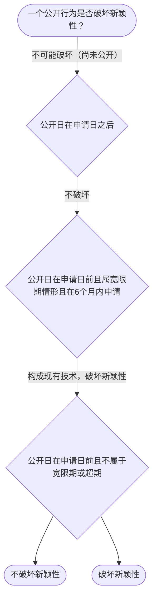

# 专家 B 教学草稿

> 专家：expert_b ｜ 风格：accessible

## 教学模块选择清单

- 当前教学节点：`patent-law-foundation`
- 板块预算：自适应 5/5，总计 9/9

| # | 模块 (block_type) | 类型 | 触发原因 (trigger) | 对应正文段 | 归属 |
|---:|---|:--:|---|---|:--:|
| 1 | `anchor_scenario` | 自适应 | perception=sensing(0.88) / cold_start | 场景导入｜某团队研发了一款新型纳米材料，用于电池隔板。他们想申请专利，又担心下月在政府主办的国际展会展… | [B] |
| 2 | `legal_anchor` | 必选 | mandatory | 法条锚定｜《专利法》第2条 | [B] |
| 3 | `worked_example` | 自适应 | cognition.apply=0.34<0.4 / cognition.analyze=0.27<0.3 / cold_start | 案例演示｜甲公司2024年5月1日在政府主办国际展会展出新型纳米材料专利相关论文，2024年10月1日… | [B] |
| 4 | `decision_flow` | 自适应 | input=visual(0.81) | 判定流程图｜一个公开行为是否破坏新颖性？ | [B] |
| 5 | `mnemonic` | 自适应 | remember=0.82>=0.6 & apply<0.4 / understanding=sequential(0.75) | 记忆口诀｜三性判断口诀：新(未公开) 创(非显易见) 实(能做有用) | [B] |
| 6 | `reflect_prompt` | 自适应 | processing=reflective(0.69) | 反思提示｜如果客户同时做了展会展示和论文发表，你会怎么排时间表？ | [B] |
| 7 | `assessment` | 必选 | mandatory | 测评｜专利保护的三种客体是什么 | [B] |
| 8 | `knowledge_synthesis` | 必选 | mandatory | 知识框架｜保护客体：发明、实用新型、外观设计 | [B] |
| 9 | `summary_card` | 自适应 | len(knowledge_sub_nodes)=3>=3 | 速查卡｜先过保护客体之门，再过三性安检。 | [B] |

## 教学正文

## 1. 场景导入

假设你在材料研发公司担任专利专员，最近接到一个项目：研发了一种新型纳米材料，用于电池隔板。团队担心如果申请专利后被别人引用，是否能保护？同时，如果公开在展会，会不会影响新颖性？这个情境引出了专利保护客体和授权三性判断的问题。

## 2. 人话解释

专利制度的核心是鼓励发明创造，同时让技术公开，让大家分享进步。专利保护的三种客体是发明（技术方案）、实用新型（产品形状构造）和外观设计（视觉设计）。授权需要新颖性、创造性和实用性。

## 3. 法条回扣

《专利法》第2条规定了专利保护对象：发明、实用新型和外观设计。

## 4. 类比 / 口诀

类比：发明像全面的技术创新，实用新型像产品的改进，外观设计像外观美化。口诀：新、创、实

## 5. 应试提示

看关键词：新颖性看公开，创造性看显而易见。

## 6. 互动提问

问题：专利保护对象包括什么？


### 场景导入（anchor_scenario）

> 某团队研发了一款新型纳米材料，用于电池隔板。他们想申请专利，又担心下月在政府主办的国际展会展示会破坏新颖性。这里既有‘能不能申请’（保护客体），也有‘公开展示是否致命’（新颖性宽限期）两个真实问题。

**锚定**：用同一技术事实同时引出‘保护客体’与‘授权三性’两个抽象模块。

**先想一想**：如果你是专利专员，看到‘展会展示’这个动作，第一反应是风险还是安全？为什么？

### 法条锚定（legal_anchor）

- **《专利法》第2条**：专利保护对象范围最广，包括新产品、新方法、老产品新改进、老方法新改进而形成的技术方案。
- **《专利法》第22条**：获得授权的专利应当具有新颖性、创造性和实用性。

**为何重要**：本节点讲授权实质条件，三性是贯穿全章的判定主线，必须先立住条文。

### 案例演示（worked_example）

**案情/例题**：甲公司2024年5月1日在政府主办国际展会展出新型纳米材料专利相关论文，2024年10月1日提出专利申请。问：展出是否破坏新颖性？
**适用规则**：《专利法》第24条（不丧失新颖性宽限期6个月）
**分步推演**：
1. 展出日在申请日前，且属政府主办国际展会法定情形 → *落入宽限期适用范围*
2. 申请日2024-10-01距展出日2024-05-01约5个月<6个月 → *在宽限期内*
3. 宽限期仅豁免该公开，不改变三性实质审查 → *仍需过创造性/实用性*
**结论**：展出不破坏新颖性，但仅豁免该次公开，实体三性仍须满足。
**本题要点**：宽限期是‘时间豁免’不是‘免死金牌’，先判范围再算日期。

### 判定流程图（decision_flow）

**决策问题**：一个公开行为是否破坏新颖性？



### 记忆口诀（mnemonic）

**记忆锚**：三性判断口诀：新(未公开) 创(非显易见) 实(能做有用)
**映射**：
- 新
- 创
- 实
**何时用**：看到‘授权条件’‘为什么不给专利’时先过三性表。

### 反思提示（reflect_prompt）

**反思问题**：如果客户同时做了展会展示和论文发表，你会怎么排时间表？

**关注要点**：两个公开行为的日期各自如何算宽限期；论文发表是否也享宽限期

**连接**：连接到‘现有技术’与‘公开行为类型’

### 知识框架（knowledge_synthesis）

**知识框架**：
- 保护客体：发明、实用新型、外观设计
- 制度体系：专利法、实施细则、审查指南
- 发展历程：早期公开延迟审查、初步与实质审查并存
**概念关系**：保护客体决定是否可申请，然后是三性判断
**必记**：三种客体是专利保护范围；授权需三性合格

### 速查卡（summary_card）

**要点卡**：
- **保护客体**：发明、实用新型、外观设计
- **三性**：新颖性/创造性/实用性三关
- **宽限期**：特定公开给6个月缓冲
- **审查制度**：初步审查与实质审查并存
**必背**：三性缺一不可；宽限期仅豁免特定公开且限6个月
**一句话总结**：先过保护客体之门，再过三性安检。

### 测评（assessment）

**三类覆盖**：backward_review、forward_probe、weakness_probe
**题目**：
- q1：专利保护的三种客体是什么
- q2：新颖性判断标准
- q3：宽限期适用条件


## 结构化字段

## knowledge_points

```json
[
  {
    "node_id": "patent-law-foundation",
    "kc_name": "专利制度的基本概念与特征：独占性、时间性、地域性"
  },
  {
    "node_id": "patent-law-foundation",
    "kc_name": "中国专利制度体系：专利法、专利法实施细则、专利审查指南"
  },
  {
    "node_id": "patent-law-foundation",
    "kc_name": "专利保护的三种客体：发明、实用新型、外观设计（专利法第2条）"
  },
  {
    "node_id": "patent-law-foundation",
    "kc_name": "专利制度的作用：激励发明创造、促进技术公开、推动技术应用和经济发展"
  },
  {
    "node_id": "patent-law-foundation",
    "kc_name": "中国专利制度发展历程与特点：早期公开延迟审查、初步审查制与实质审查制并存"
  }
]
```

## legal_basis

```json
[
  {
    "article": "《专利法》第2条",
    "source": "专利法专题讲座.txt"
  },
  {
    "article": "《专利法》第22条",
    "source": "专利法专题讲座.txt"
  }
]
```

## risks

```json
[
  {
    "risk": "新颖性与创造性易混淆",
    "related_node_id": "patent-law-foundation"
  }
]
```

## draft_stage

```json
"debate"
```

## interactive_questions

```json
[
  {
    "qid": "q1",
    "category": "remember",
    "difficulty": "L1",
    "source_tag": "backward_review",
    "kc_node_id": "patent-law-foundation",
    "question": "专利法第2条规定的专利保护对象包括什么？",
    "answer": "A",
    "options": [
      "A. 发明、实用新型和外观设计",
      "B. 仅发明",
      "C. 仅外观设计",
      "D. 所有技术方案"
    ]
  },
  {
    "qid": "q2",
    "category": "understand",
    "difficulty": "L1",
    "source_tag": "backward_review",
    "kc_node_id": "patent-law-foundation",
    "question": "新颖性判断的核心是？",
    "answer": "B",
    "options": [
      "A. 不是显而易见",
      "B. 申请日前未公开",
      "C. 能产生有用效果",
      "D. 形状构造新"
    ]
  },
  {
    "qid": "q3",
    "category": "apply",
    "difficulty": "L1",
    "source_tag": "backward_review",
    "kc_node_id": "patent-law-foundation",
    "question": "如果公开日在申请日前且属于宽限期情形，在6个月内申请，公开行为是否破坏新颖性？",
    "answer": "A",
    "options": [
      "A. 不破坏新颖性",
      "B. 破坏新颖性",
      "C. 需额外判断创造性",
      "D. 需额外判断实用性"
    ]
  }
]
```

## knowledge_synthesis

```json
{
  "node": "patent-law-foundation",
  "coverage": [
    {
      "node_id": "patent-rights-nature"
    },
    {
      "node_id": "patent-law-framework"
    },
    {
      "node_id": "patent-system-overview"
    }
  ],
  "confusable_pairs": [
    {
      "pair": "新颖性与创造性"
    },
    {
      "pair": "发明与实用新型"
    }
  ]
}
```
