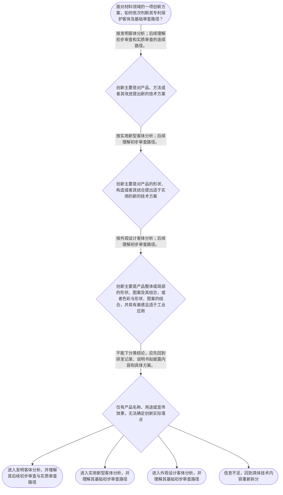

# 整合后的课程完整内容与习题

## 教学模块选择清单

- 当前教学节点：`patent-law-foundation`
- 板块预算：自适应 5/6，总计 9/9

| # | 模块 (block_type) | 类型 | 触发原因 (trigger) | 对应正文段 | 归属 |
|---:|---|:--:|---|---|:--:|
| 1 | `anchor_scenario` | 自适应 | perception=sensing(0.88) / cold_start | 从材料研发项目识别专利制度问题｜某材料研发团队开发了用于电池隔膜的复合材料。团队同时掌握三项成果：一种新的涂层制备方法、隔膜… | [A+B融合] |
| 2 | `legal_anchor` | 必选 | mandatory | 法条锚定：保护客体与制度目的｜《专利法》第二条 | [A] |
| 3 | `worked_example` | 自适应 | cognition.apply=0.38<0.4 / cognition.analyze=0.28<0.3 / cold_start | 材料技术方案的保护客体分类演示｜甲材料公司研发提高电池隔膜耐热性的项目，形成三项成果：方案一为新的涂层制备方法；方案二为隔膜… | [A+B融合] |
| 4 | `decision_flow` | 自适应 | input=visual(0.81) | 保护客体与基础审查路径流程｜面对材料领域的一项创新方案，如何依次判断其专利保护客体及基础审查路径？ | [A] |
| 5 | `mnemonic` | 自适应 | remember=0.83>=0.6 & apply<0.4 / understanding=sequential(0.76) | 三类专利客体与审查路径速记表｜客体三分表：发明看“产品、方法、改进”；实用新型看“产品的形状、构造、结合”；外观设计看“产… | [A+B融合] |
| 6 | `reflect_prompt` | 自适应 | processing=reflective(0.69) | 把客体分类迁移到研发记录｜回看一个熟悉的材料研发项目：项目记录中的每一项改进，究竟落在方法、产品构造还是外观表达；哪些… | [B] |
| 7 | `assessment` | 必选 | mandatory | 三类闭环测评｜复习专利制度的立法目的。 | [A] |
| 8 | `knowledge_synthesis` | 必选 | mandatory | 专利法律制度基础知识网络｜专利权基本特征：检索学习材料概括为客体无形性、权利排他性、授权地域性和存在期限性。 | [A+B融合] |
| 9 | `summary_card` | 自适应 | len(knowledge_sub_nodes)=3>=3 | 专利法律制度基础速查卡｜材料专利分析先拆分实际创新内容并识别法定客体，再在相应审查框架下判断后续授权条件。 | [A+B融合] |

## 教学正文

# 专利法律制度基础：材料专利审查的起点

材料领域的研发成果在进入新颖性和创造性判断前，先要把制度的入口站稳：专利制度保护什么、权利有什么边界、具体成果属于哪一类客体，以及不同客体如何进入审查路径。本节只讲这一基础框架；新颖性、创造性的具体判断方法将在后续节点展开。

## 一、先理解专利制度中的权利与交换

专利权的特点可概括为：客体具有无形性，权利具有排他性，授权具有地域性，存在具有期限性。〔RAG: 专利法律知识同步训练.txt — 专利权的特点：客体的无形性、权利的排他性、授权的地域性、存在的期限性〕

这意味着，专利权不是对一件材料实物的永久占有。它是在法定地域和法定期限内，对被授予并被具体限定的发明创造享有的权利。排他性也不能被理解为对所有相似材料或所有相关市场活动的无限控制；判断范围时仍要回到具体专利文件和适用规则。

专利制度的基本交换逻辑是“以公开换保护”。检索学习材料指出，取得专利权以公开发明创造内容为前提；公开使公众能够在既有技术基础上继续创新，减少重复性投入。〔RAG: 专利法律知识详细解读.txt — 专利权的取得的本质是“以公开换保护”〕《专利法》第一条所体现的制度目标包括保护专利权人的合法权益、鼓励发明创造、推动发明创造应用、提高创新能力，并促进科学技术进步和经济社会发展。〔RAG: 专利法律知识详细解读.txt — 《专利法》第一条明确的立法宗旨〕

## 二、中国专利制度的规则层次

学习中国专利申请和审查规则时，可按三层理解：专利法提供基本法律规则；专利法实施细则补充申请、审查和实施中的具体事项；专利审查指南提供审查操作中的判断指引。三者并非可以相互替代，而是从法律规则到程序细化、再到审查操作逐层展开。

制度发展方面，检索材料可直接核验《专利法》自1985年4月1日起施行。〔RAG: 专利法律知识详细解读.txt — 《专利法》第八十二条：本法自1985年4月1日起施行〕关于更完整的历史演变，当前检索上下文未提供直接依据，本节不作扩展。

## 三、三类专利保护客体：先看实际创新内容

《专利法》第二条规定，发明创造包括发明、实用新型和外观设计。发明是对产品、方法或者其改进所提出的新的技术方案；实用新型是对产品的形状、构造或者其结合所提出的适于实用的新的技术方案；外观设计是对产品整体或者局部的形状、图案或者其结合以及色彩与形状、图案的结合所作出的富有美感并适于工业应用的新设计。〔RAG: 中华人民共和国专利法.txt — 第二条原文〕

因此，材料领域不能因为成果被称为“材料产品”就统一归入实用新型。应把研发成果拆成实际创新点：

- 创新点在材料配方、材料本身、制备方法或其改进时，先按发明客体分析。
- 创新点在产品的形状、构造或者其结合时，先按实用新型客体分析。
- 创新点在产品整体或局部的外观表达，并且涉及美感和工业应用时，先按外观设计客体分析。

可以把这一步理解为“先定门类，后过门槛”。这是帮助记忆的分类提示，不是替代条文要件或具体事实判断的口诀。

## 四、审查路径与新颖性、创造性的位置

检索学习材料区分了基础审查路径：实用新型和外观设计专利申请经过初步审查，没有发现驳回理由即授予专利权；发明专利申请经过初步审查、实质审查均没有发现驳回理由的，授予专利权。〔RAG: 专利法律知识同步训练.txt — 审查制度：实用新型和外观设计……初步审查；发明……初步审查、实质审查〕材料还说明，实质审查阶段对新颖性、创造性和实用性进行审查。〔RAG: 专利法律知识详细解读.txt — 实质审查阶段对于专利申请的新颖性、创造性和实用性进行审查〕

对发明和实用新型，《专利法》第二十二条规定应具备新颖性、创造性和实用性。新颖性是该发明或者实用新型不属于现有技术，且不存在申请日在先、申请日后公布或公告的同样申请；创造性对发明要求具有突出的实质性特点和显著的进步，对实用新型要求具有实质性特点和进步；实用性要求能够制造或者使用，并能够产生积极效果。现有技术是申请日以前在国内外为公众所知的技术。〔RAG: 中华人民共和国专利法.txt — 第二十二条原文〕

本节的边界是定位二者而非提前完成具体审查：新颖性和创造性只能针对已经明确的具体技术方案展开，不能仅凭“新材料”“市场价值高”或“产品能使用”直接得出结论。后续学习时可先区分两者的问题方向：新颖性关注是否落入法定的既有技术或申请在先情形；创造性进一步比较该技术方案与现有技术之间是否满足法定创造性标准。

## 五、材料领域的基础分析顺序

对于一个材料研发项目，可稳定采用以下顺序：第一，拆分材料组成、制备方法、产品构造和外观表达等具体成果；第二，依《专利法》第二条识别每项成果的保护客体；第三，理解该客体对应的基础审查路径；第四，再进入新颖性、创造性、实用性及其他法定条件的具体分析。

最常见的错误有两类。第一，把“材料产品”名称当作客体分类依据；正解是看创新实际落在方法、产品构造还是外观表达。第二，把“属于发明、实用新型或外观设计”当作授权结论；正解是客体分类只解决分析从哪里开始，不能替代后续授权条件。

本节设有测评，请到【习题】区作答。

### 从材料研发项目识别专利制度问题（anchor_scenario）

> 某材料研发团队开发了用于电池隔膜的复合材料。团队同时掌握三项成果：一种新的涂层制备方法、隔膜内部层状构造的改进，以及包装盒上的装饰图案。负责人希望尽快申请专利，但团队成员把“材料产品”一概称为实用新型，也有人认为只要技术有价值就必然能授权。

团队需要先解决的冲突是：同一项目中的不同成果究竟分别落入哪类专利保护客体；专利权保护的边界、期限和地域如何理解；在完成这些基础判断后，才应当如何进入后续的新颖性和创造性审查。

**锚定**：该情境把专利权特征、三类保护客体、制度作用和后续审查路径放入同一材料研发事实中。

**先想一想**：面对同一材料项目中的方法、产品构造和包装图案，你会按产品名称统一分类，还是先拆分每一项实际创新内容？

### 法条锚定：保护客体与制度目的（legal_anchor）

- **《专利法》第二条**：第二条把发明创造分为发明、实用新型和外观设计，并分别限定三类客体的法定要素。
- **《专利法》第一条**：第一条说明专利法既保护专利权人的合法权益，也服务于鼓励发明创造、推动应用和促进科技进步、经济社会发展。
- **《专利法》第八十二条**：第八十二条规定专利法自1985年4月1日起施行，是理解中国专利制度发展时间线的法定起点。

**为何重要**：材料领域专利申请不能跳过保护客体直接讨论新颖性或创造性。先以第二条识别被判断的方案，才能在后续节点正确适用实体审查规则。

### 材料技术方案的保护客体分类演示（worked_example）

**案情/例题**：甲材料公司研发提高电池隔膜耐热性的项目，形成三项成果：方案一为新的涂层制备方法；方案二为隔膜内部层状构造改进；方案三为包装盒表面的装饰图案。公司要判断各方案应先进入何种专利客体分析，并理解其与后续审查的关系。
**适用规则**：《专利法》第二条：发明是对产品、方法或者其改进所提出的新的技术方案；实用新型是对产品的形状、构造或者其结合所提出的适于实用的新的技术方案；外观设计是对产品整体或者局部的形状、图案或者其结合以及色彩与形状、图案的结合所作出的富有美感并适于工业应用的新设计。〔RAG: 中华人民共和国专利法.txt — 第二条原文〕
**分步推演**：
1. 先将同一项目拆分为方法、产品构造和产品外观三个具体方案。专利客体取决于实际创新内容，不能仅因它们都服务于“电池隔膜”而统一分类。 → *先拆方案，不按产品名称贴标签。*
2. 方案一的创新点在制备方法，符合发明定义中“对……方法……所提出的新的技术方案”的分析方向；方案二的创新点在产品内部层状构造，符合实用新型定义中产品形状、构造或者其结合的分析方向。 → *方法与产品构造应分别进入发明、实用新型客体分析。*
3. 方案三的创新点是包装盒表面的装饰图案，应围绕外观设计定义中的产品形状、图案、色彩结合、美感和工业应用要素判断，而非把它当成隔膜材料本身的技术方案。 → *外观表达须按外观设计要素分析。*
4. 检索材料区分发明申请的初步审查、实质审查，与实用新型、外观设计申请的初步审查路径。无论归入哪一客体，客体分类均不替代相应授权条件审查。 → *分类决定理解审查路径的起点，不决定授权。*
**结论**：新的涂层制备方法应先按发明客体分析；隔膜内部层状构造改进应围绕实用新型客体分析；包装盒装饰图案应围绕外观设计客体分析。三项分类都只是审查入口，不是授权结论。
**本题要点**：材料项目应采用“拆分实际创新内容—识别法定客体—进入相应审查路径”的顺序，避免把分类结论误作授权结论。

### 保护客体与基础审查路径流程（decision_flow）

**决策问题**：面对材料领域的一项创新方案，如何依次判断其专利保护客体及基础审查路径？



### 三类专利客体与审查路径速记表（mnemonic）

**记忆锚**：客体三分表：发明看“产品、方法、改进”；实用新型看“产品的形状、构造、结合”；外观设计看“产品外观 + 美感 + 工业应用”。审查路径提示为“发明两审，实用外观初审”。
**映射**：
- 产品、方法、改进
- 产品的形状、构造、结合
- 产品外观、美感、工业应用
- 发明两审，实用外观初审
**何时用**：看到材料研发成果需要做专利类型初筛时，先逐项核对三分表；看到“可否授权”时，提醒自己客体分类不能代替后续实体条件审查。

### 把客体分类迁移到研发记录（reflect_prompt）

**反思问题**：回看一个熟悉的材料研发项目：项目记录中的每一项改进，究竟落在方法、产品构造还是外观表达；哪些事实仍不足以支持客体判断？

**关注要点**：不要用“材料产品”这一名称替代对实际创新内容的识别。；检查每一类客体是否满足第二条列出的限定要素。；区分“识别客体”与“判断新颖性、创造性、实用性等后续条件”两个阶段。

**连接**：连接到材料研发中的配方、制备工艺、产品构造和包装设计的分项记录习惯，并为后续的专利申请程序、新颖性和创造性节点建立事实整理基础。

### 专利法律制度基础知识网络（knowledge_synthesis）

**知识框架**：
- 专利权基本特征：检索学习材料概括为客体无形性、权利排他性、授权地域性和存在期限性。
- 中国专利制度体系：专利法提供基本法律规则，专利法实施细则补充申请和实施中的具体事项，专利审查指南提供审查操作层面的判断指引。
- 三类专利保护客体：发明针对产品、方法或者其改进的新的技术方案；实用新型针对产品形状、构造或者其结合的适于实用的新的技术方案；外观设计针对产品外观的美感性、工业应用性设计。
- 专利制度作用：专利权取得的本质是“以公开换保护”；技术公开有助于避免重复投入并促进后续创新，同时制度以保护专利权人合法权益激励发明创造。
- 中国专利制度发展与审查特点：专利法自1985年4月1日起施行；检索学习材料明确区分发明申请的初步审查、实质审查，以及实用新型、外观设计申请的初步审查路径。
**概念关系**：先从具体创新内容识别发明、实用新型或外观设计客体，再讨论适用的审查路径。；客体分类是后续授权条件审查的入口，不能替代新颖性、创造性、实用性等法定判断。；“以公开换保护”说明制度作用；排他性、地域性和期限性说明保护并非对材料实物的无限、永久控制。；新颖性和创造性属于后续实体判断重点：根据《专利法》第二十二条，发明和实用新型应具备新颖性、创造性和实用性。
**必记**：专利权的基本特征包括排他性、地域性和期限性，学习材料还列举客体无形性。；发明、实用新型和外观设计的法定客体不同，不能仅按材料产品名称或商业价值分类。；发明和实用新型的新颖性、创造性、实用性要求来自《专利法》第二十二条；本节只定位其制度位置，不展开具体判断方法。；发明申请与实用新型、外观设计申请的审查路径存在基础区别。

### 专利法律制度基础速查卡（summary_card）

**要点卡**：
- **专利权基本特征**：重点记住排他性、地域性和期限性，并注意学习材料列出的客体无形性。
- **制度规则层次**：专利法定基本规则，实施细则补充具体事项，审查指南提供审查操作指引。
- **三类保护客体**：发明看产品、方法及其改进；实用新型看产品形状、构造或结合；外观设计看产品外观、美感和工业应用。
- **制度作用**：专利制度以技术公开换取法定保护，推动技术传播、应用和后续创新。
- **审查制度特点**：检索学习材料区分发明的初步审查和实质审查，与实用新型、外观设计的初步审查路径。
**必背**：专利权具有排他性、地域性和期限性。；《专利法》第二条规定发明、实用新型、外观设计三类客体。；先识别客体，后判断相应授权条件；客体分类不等于授权。；发明和实用新型的新颖性、创造性、实用性要求见《专利法》第二十二条。；专利制度的基本交换逻辑是以公开换保护。
**一句话总结**：材料专利分析先拆分实际创新内容并识别法定客体，再在相应审查框架下判断后续授权条件。

### 三类闭环测评（assessment）

**三类覆盖**：backward_review、forward_probe、weakness_probe
**题目**：
- foundation-backward-l1：复习专利制度的立法目的。
- application-forward-l1：探测发明或实用新型申请文件的基础构成。
- foundation-weakness-l3：辨析材料研发方案的专利保护客体和审查入口。


## 结构化数据

## expert

```json
"A+B融合"
```

## style

```json
"fused"
```

## knowledge_points

```json
[
  {
    "node_id": "patent-law-foundation",
    "kc_name": "专利制度的基本概念与特征：独占性、时间性、地域性（详见子节点 patent-rights-nature）"
  },
  {
    "node_id": "patent-law-foundation",
    "kc_name": "中国专利制度体系：专利法、专利法实施细则、专利审查指南（详见子节点 patent-law-framework）"
  },
  {
    "node_id": "patent-law-foundation",
    "kc_name": "专利保护的三种客体：发明、实用新型、外观设计（专利法第2条）"
  },
  {
    "node_id": "patent-law-foundation",
    "kc_name": "专利制度的作用：激励发明创造、促进技术公开、推动技术应用和经济发展（详见子节点 patent-system-overview）"
  },
  {
    "node_id": "patent-law-foundation",
    "kc_name": "中国专利制度发展历程与特点：早期公开延迟审查、初步审查制与实质审查制并存（详见子节点 patent-system-overview）"
  }
]
```

## legal_basis

```json
[
  {
    "article": "《专利法》第二条",
    "source": "中华人民共和国专利法.txt"
  },
  {
    "article": "《专利法》第二十二条",
    "source": "中华人民共和国专利法.txt"
  },
  {
    "article": "《专利法》第一条",
    "source": "专利法律知识详细解读.txt"
  },
  {
    "article": "《专利法》第八十二条",
    "source": "专利法律知识详细解读.txt"
  }
]
```

## risks

```json
[
  {
    "risk": "检索学习材料对专利权特征作概括性说明，但当前材料未提供各特征的完整法条原文；本节将其作为制度概念使用，不延伸为未经核验的具体法条结论。",
    "related_node_id": "patent-rights-nature"
  },
  {
    "risk": "当前检索上下文未提供专利法、实施细则和审查指南全部具体条文；本节仅说明其规则层次，不对未检索到的具体程序规则作扩展。",
    "related_node_id": "patent-law-framework"
  },
  {
    "risk": "当前材料能核验专利法自1985年4月1日起施行以及初步审查、实质审查的制度区分，但不足以完整支撑“早期公开延迟审查”的历史细节；本节不补写该历史细节。",
    "related_node_id": "patent-system-overview"
  },
  {
    "risk": "学习者易将客体分类视为授权结论。实际是否授权仍须依客体及具体申请继续判断新颖性、创造性、实用性和其他法定条件。",
    "related_node_id": "patent-law-foundation"
  }
]
```

## draft_stage

```json
"integration"
```

## irac

```json
{
  "issue": "材料领域专利申请进入新颖性、创造性具体判断前，应如何理解中国专利制度的基本特征、规则层次、保护客体、制度作用及基础审查路径？",
  "rule": "《专利法》第二条规定发明创造包括发明、实用新型和外观设计，并分别界定其法定客体。〔RAG: 中华人民共和国专利法.txt — 第二条：发明创造是指发明、实用新型和外观设计；发明、实用新型、外观设计的定义〕检索学习材料将专利权特点概括为客体无形性、权利排他性、授权地域性和存在期限性，并区分发明申请经初步审查、实质审查无驳回理由后授权，与实用新型、外观设计申请经初步审查无驳回理由后授权的基础路径。〔RAG: 专利法律知识同步训练.txt — 专利权的特点及审查制度〕《专利法》第二十二条规定，授予专利权的发明和实用新型应具备新颖性、创造性和实用性。〔RAG: 中华人民共和国专利法.txt — 第二十二条〕",
  "application": "对于材料领域成果，不能仅凭“材料产品”名称判断类型。应先拆分实际创新内容：新的制备方法，按发明所涉及的方法技术方案分析；产品内部形状、构造或其结合的改进，按实用新型的客体要素分析；包装或产品外观的形状、图案、色彩结合，则按外观设计的美感和工业应用要素分析。客体识别完成后，才进入相应审查路径与后续授权条件判断。",
  "conclusion": "本节点的主线是先识别保护客体，再理解制度作用、规则层次和基础审查路径。材料领域的新颖性和创造性判断必须建立在具体技术方案及其对应客体已经明确的基础上；对于发明和实用新型，第二十二条规定的三项实体条件将在后续节点具体展开。"
}
```

## interactive_questions

```json
[
  {
    "qid": "foundation-backward-l1",
    "category": "remember",
    "difficulty": "L1",
    "source_tag": "backward_review",
    "kc_node_id": "patent-law-foundation",
    "question": "根据《专利法》第一条所体现的制度目标，下列哪项表述正确？",
    "answer": "A",
    "options": [
      "A.保护专利权人的合法权益，鼓励发明创造，推动发明创造的应用，提高创新能力，促进科学技术进步和经济社会发展",
      "B.仅限制外国申请人在中国申请专利",
      "C.只规定专利申请文件的书写格式",
      "D.只规定专利侵权纠纷的民事赔偿标准"
    ]
  },
  {
    "qid": "application-forward-l1",
    "category": "remember",
    "difficulty": "L1",
    "source_tag": "forward_probe",
    "kc_node_id": "patent-application-process",
    "question": "作为对下一节点“专利申请程序”的基础探测，下列哪项符合发明或者实用新型专利申请文件的基本构成？",
    "answer": "B",
    "options": [
      "A.只需提交产品销售合同和技术宣传册",
      "B.通常包括请求书、说明书及其摘要、权利要求书等文件",
      "C.只需提交发明人的身份证明",
      "D.只需提交外观设计图片，其他文件均不需要"
    ]
  },
  {
    "qid": "foundation-weakness-l3",
    "category": "analyze",
    "difficulty": "L3",
    "source_tag": "weakness_probe",
    "kc_node_id": "patent-law-foundation",
    "question": "某材料企业同时形成新的涂层制备方法、隔膜内部层状构造改进和包装盒装饰图案。下列哪项最符合本节的分析顺序？",
    "answer": "D",
    "options": [
      "A.只要技术用于材料产品，就当然属于实用新型",
      "B.只要方案具有商业价值，就当然属于发明并可直接授权",
      "C.只要产品有装饰图案，就必然属于发明专利",
      "D.应先依据实际创新内容区分方法、产品构造和外观表达，再分别进入相应客体与审查路径；客体分类本身不等于授权"
    ]
  }
]
```

## knowledge_synthesis

```json
{
  "node": "patent-law-foundation",
  "coverage": [
    {
      "node_id": "patent-law-foundation"
    }
  ],
  "confusable_pairs": [
    {
      "pair": "发明与实用新型：前者可针对产品、方法或者其改进的新的技术方案；后者限定于产品形状、构造或者其结合且适于实用的新的技术方案。"
    },
    {
      "pair": "保护客体分类与授权条件审查：前者回答方案进入哪一类专利客体分析，后者才进一步判断是否满足法定授权条件。"
    },
    {
      "pair": "新颖性与创造性：二者均属于发明和实用新型后续实体条件，但新颖性关注是否属于现有技术或存在申请在先公开在后的同样申请，创造性关注与现有技术相比的法定创造性标准。"
    }
  ]
}
```
