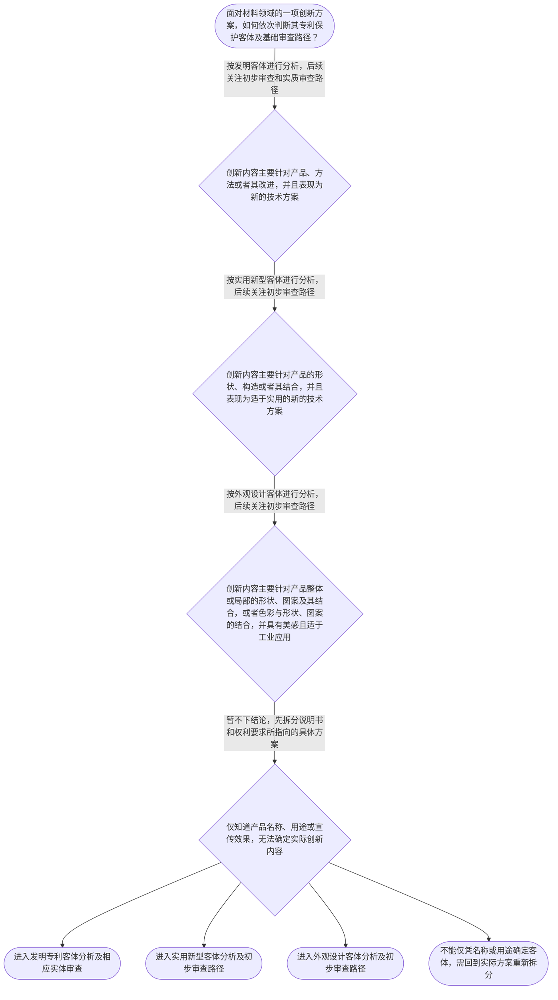

# 专家 A 教学草稿

> 专家：expert_a ｜ 风格：conservative

## 教学模块选择清单

- 当前教学节点：`patent-law-foundation`
- 板块预算：自适应 None/None，总计 None/None

| # | 模块 (block_type) | 类型 | 触发原因 (trigger) | 对应正文段 | 归属 |
|---:|---|:--:|---|---|:--:|
| 1 | `anchor_scenario` | 自适应 | perception=sensing(0.88) / cold_start | 从材料研发项目识别专利制度问题｜某材料研发团队开发出一种用于电池隔膜的复合材料，技术人员认为它既可能属于对材料组成和制备方法… | [A] |
| 2 | `legal_anchor` | 必选 | mandatory | 法条锚定：保护客体与制度目的｜《专利法》第二条第二款、第三款、第四款 | [A] |
| 3 | `worked_example` | 自适应 | cognition.apply=0.38<0.4 / cognition.analyze=0.28<0.3 / cold_start | 材料技术方案的保护客体分类演示｜甲材料公司研发出一种提高电池隔膜耐热性的技术：方案一是新的涂层制备方法；方案二是隔膜内部层状… | [A] |
| 4 | `decision_flow` | 自适应 | input=visual(0.81) | 专利保护客体与基础审查路径流程｜面对材料领域的一项创新方案，如何依次判断其专利保护客体及基础审查路径？ | [A] |
| 5 | `mnemonic` | 自适应 | remember=0.83>=0.6 & apply<0.4 / understanding=sequential(0.76) | 三类专利客体与审查路径速记表｜客体三分表：发明看“产品、方法、改进”；实用新型看“形状、构造、结合”；外观设计看“形状、图… | [A] |
| 6 | `reflect_prompt` | 自适应 | processing=reflective(0.69) | 把专利客体分类迁移到研发记录｜在你熟悉的材料研发项目中，如果同一项目同时包含材料配方、制备方法、产品结构和外观改进，你会如… | [A] |
| 7 | `assessment` | 必选 | mandatory | 三类闭环测评｜复习专利制度的基本目标及专利权基本特征 | [A] |
| 8 | `knowledge_synthesis` | 必选 | mandatory | 专利法律制度基础知识网络｜专利权基本特征：专利权具有排他性、地域性和期限性，检索材料还将客体的无形性列为专利权特点。 | [A] |
| 9 | `summary_card` | 自适应 | len(knowledge_sub_nodes)=3>=3 | 专利法律制度基础速查卡｜先按实际创新内容识别专利保护客体，再在中国专利制度的法源和审查框架下判断是否具备授权条件。 | [A] |

## 教学正文

## I — 法律问题

材料领域的一项研发成果进入专利申请前，首先要回答三个基础问题：第一，专利制度保护的基本对象和权利特征是什么；第二，具体方案属于发明、实用新型还是外观设计；第三，客体识别后应如何理解后续审查，尤其是新颖性和创造性判断在制度中的位置。

## R — 适用规则

### 1. 专利制度的基本特征

检索材料将专利权的特点概括为：客体具有无形性，权利具有排他性，授权具有地域性，权利存在具有期限性。〔RAG: 专利法律知识同步训练.txt — 专利权的特点:客体的无形性、权利的排他性、授权的地域性、存在的期限性〕

因此，专利权不是对一件有形材料本身永久占有的权利，而是在法定期限和法定地域范围内，对受保护的技术方案或外观设计享有排他性控制的权利。这里的“排他性”强调未经许可不得实施受保护内容，但不能脱离具体权利要求或专利文件作无限扩大理解。

### 2. 中国专利制度的规则层次

学习中国专利审查规则时，应区分三个层次：专利法提供基本法律规则，专利法实施细则对申请和实施中的具体事项作补充，专利审查指南则提供审查操作层面的规则和判断指引。当前检索上下文将这三者列为中国专利制度的基础组成部分。〔RAG: 专利法律知识详细解读.txt — 本章需要重点掌握的知识点包括：中国专利制度的特点；专利法、专利法实施细则、专利审查指南〕

### 3. 三类专利保护客体

《专利法》第二条第二款规定，发明是对产品、方法或者其改进所提出的新的技术方案。〔RAG: 专利法律知识详细解读.txt — 《专利法》第二条第二款：发明，是指对产品、方法或者其改进所提出的新的技术方案〕

《专利法》第二条第三款规定，实用新型是对产品的形状、构造或者其结合所提出的适于实用的新的技术方案。〔RAG: 专利法律知识详细解读.txt — 《专利法》第二条第三款：实用新型，是指对产品的形状、构造或者其结合所提出的适于实用的新的技术方案〕

《专利法》第二条第四款规定，外观设计是对产品的整体或者局部的形状、图案或者其结合以及色彩与形状、图案的结合所作出的富有美感并适于工业应用的新设计。〔RAG: 专利法律知识详细解读.txt — 《专利法》第二条第四款：外观设计，是指对产品的整体或者局部的形状、图案或者其结合以及色彩与形状、图案的结合所作出的富有美感并适于工业应用的新设计〕

分类时应看实际创新内容，而不是只看产品名称。例如，“电池隔膜”这一名称本身不能决定申请一定属于实用新型；如果创新点在制备方法，应先按发明的客体规则分析；如果创新点在产品构造，应围绕实用新型的客体规则分析；如果创新点在产品外观表达，则应围绕外观设计的法定要素分析。

### 4. 专利制度的作用与审查位置

检索材料将专利制度概括为“以公开换保护”：申请人公开发明创造内容，换取专利保护期限内的排他性权利。该机制可以减少公众对已公开技术的重复投入，并推动进一步创新。〔RAG: 专利法律知识详细解读.txt — 专利权的取得的本质是“以公开换保护”；让公众不再进行资源的重复性投入，而可以以该发明创造为起点，进一步创新〕

检索材料还指出，专利制度具有推动技术发展、维护社会公平和激发发明创造积极性的作用。〔RAG: 专利法律知识详细解读.txt — 专利制度的作用表现在推动社会技术发展和进步、有利于维护社会公平、激发全民发明创造的积极性〕

在审查路径上，检索材料说明：实用新型和外观设计专利申请经过初步审查，没有发现驳回理由即授予专利权；发明专利申请经过初步审查、实质审查均没有发现驳回理由的，授予专利权。〔RAG: 专利法律知识同步训练.txt — 实用新型和外观设计专利申请经过初步审查；发明专利申请经过初步审查、实质审查〕

这一区分说明，新颖性和创造性判断主要嵌入发明申请的实质审查框架中。它并不意味着完成客体分类后就当然能够授权，具体授权仍需继续满足相应法定条件。

## A — 规则适用

对材料领域申请进行基础分析时，可以按以下顺序操作：

1. 先把研发成果拆成具体方案，区分材料组成、制备方法、产品结构和外观表达，避免因多个方案服务于同一产品而混为一谈。
2. 再根据《专利法》第二条判断客体：产品或方法及其改进形成新的技术方案的，按发明规则分析；产品形状、构造或其结合形成适于实用的新的技术方案的，按实用新型规则分析；形状、图案、色彩结合形成富有美感且适于工业应用的新设计的，按外观设计规则分析。
3. 完成客体识别后，再确定应关注的审查路径。发明申请需要理解初步审查和实质审查的连续关系，实用新型和外观设计申请则按照检索材料所述的初步审查路径理解。
4. 进入发明的实质判断时，新颖性和创造性不能混为一谈：新颖性关注申请日前是否已有相同技术方案被公开，创造性进一步关注相对于现有技术是否对本领域技术人员显而易见。本节只建立二者在制度中的位置，具体判断方法将在对应节点展开。
5. 最后回到专利制度的交换逻辑：申请人通过充分公开技术内容争取法定保护，但保护始终受到客体、期限、地域和实体授权条件的共同限制。

## C — 结论

专利法律制度基础的判断主线是“先识别客体，再理解审查，再进入专利性判断”。材料领域的产品名称不能替代对实际方案的分析；发明、实用新型和外观设计具有不同法定客体。专利权具有排他性、地域性和期限性，专利制度通过技术公开促进创新并提供相应法律保护。新颖性和创造性是后续实体审查中的核心问题，但不能在尚未明确保护客体时直接作出结论。

> 常见误区 / 易混淆点
>
> > 误区一：认为材料产品只能申请实用新型。纠正方法是看创新点究竟是方法、产品技术方案的形状或构造，还是外观表达。
> >
> > 误区二：认为属于发明、实用新型或外观设计就等于能够授权。客体分类只是基础入口，不能替代新颖性、创造性、实用性及其他审查条件。
> >
> > 误区三：把新颖性和创造性当作同一个问题。新颖性与申请日前的公开和相同方案有关，创造性则是进一步判断相对于现有技术是否显而易见，二者将在后续节点分别学习。

本节设有测评，请到【习题】区作答。

### 从材料研发项目识别专利制度问题（anchor_scenario）

> 某材料研发团队开发出一种用于电池隔膜的复合材料，技术人员认为它既可能属于对材料组成和制备方法提出的发明，也可能涉及产品结构改进。团队准备申请中国专利，但成员对专利权究竟保护什么、授权后权利能持续多久、是否只在中国境内有效存在不同理解。与此同时，团队希望通过申请文件公开技术换取法律保护，并计划后续在其他国家提交申请。待解决的冲突是：如何准确识别保护客体，并理解专利权的范围、期限和地域边界。

**锚定**：该情境锚定专利保护客体、专利权基本特征、中国专利制度体系及专利制度作用。

**先想一想**：面对这项复合材料技术，你会先判断它属于哪一种专利保护客体，还是先判断技术是否具有新颖性和创造性？为什么？

### 法条锚定：保护客体与制度目的（legal_anchor）

- **《专利法》第二条第二款、第三款、第四款**：第二条分别界定发明、实用新型和外观设计三类专利保护客体：发明针对产品、方法或其改进提出新的技术方案；实用新型针对产品的形状、构造或其结合提出适于实用的新的技术方案；外观设计针对产品整体或局部的形状、图案及其结合，或者色彩与形状、图案的结合，提出富有美感并适于工业应用的新设计。
- **《专利法》第一条**：第一条体现专利法的制度目标，包括保护专利权人的合法权益、鼓励发明创造、推动发明创造应用、提高创新能力以及促进科技进步和经济社会发展。
- **《专利法》第八十二条**：第八十二条规定专利法自1985年4月1日起施行，可作为中国专利制度发展时间线中的法定时间节点。

**为何重要**：本节点首先要解决专利制度保护什么、为何保护以及制度如何运行的问题。后续学习新颖性和创造性时，必须先明确被判断的技术方案属于何种保护客体，并理解实体审查制度的基本位置。

### 材料技术方案的保护客体分类演示（worked_example）

**案情/例题**：甲材料公司研发出一种提高电池隔膜耐热性的技术：方案一是新的涂层制备方法；方案二是隔膜内部层状结构的改进；方案三是包装盒表面的装饰图案。公司希望分别判断这些方案属于哪类专利保护客体，并初步理解后续审查路径。
**适用规则**：《专利法》第二条第二款、第三款、第四款分别规定发明、实用新型和外观设计的保护对象；检索材料还说明，发明专利申请经过初步审查、实质审查均没有发现驳回理由的，授予专利权，实用新型和外观设计专利申请经过初步审查没有发现驳回理由的，授予专利权。依据均来自《专利法律知识详细解读.txt》。
**分步推演**：
1. 先把技术内容拆成方法、产品结构和产品外观三个相互独立的方案，避免因它们都服务于同一材料产品而混同保护客体。 → *第一步是分离技术方案与外观方案。*
2. 方案一的创新点在制备方法，属于对方法提出的新技术方案；方案二的创新点在产品内部层状结构，属于对产品构造提出的技术方案；方案三的创新点在包装盒装饰图案，属于产品外观表达。 → *方法、产品形状或构造、外观设计分别对应不同客体。*
3. 再将客体识别与审查制度联系起来：检索材料明确区分了发明的初步审查和实质审查，以及实用新型、外观设计的初步审查路径。客体分类只是进入审查的起点，不是授权结论。 → *客体分类决定后续理解审查路径，但不替代授权条件判断。*
4. 最后检查技术效果与保护对象是否一致：耐热性改进本身不能把方法自动变成外观设计，包装图案也不能因为用于材料产品就自动成为技术方案。 → *判断应围绕方案的实际创新内容，而非产品名称或用途。*
**结论**：该复合材料制备方法属于以方法为对象的技术方案，首先应按发明的保护客体理解；若另有针对产品形状或构造的技术方案，才可能分别进入实用新型的客体判断。仅识别出保护客体并不等于当然获得专利权，仍需按照相应审查制度判断是否存在驳回理由。
**本题要点**：材料领域判断专利基础问题时，先拆分实际方案，再按方法、产品形状或构造、外观表达识别保护客体，最后再进入审查条件判断。

### 专利保护客体与基础审查路径流程（decision_flow）

**决策问题**：面对材料领域的一项创新方案，如何依次判断其专利保护客体及基础审查路径？



### 三类专利客体与审查路径速记表（mnemonic）

**记忆锚**：客体三分表：发明看“产品、方法、改进”；实用新型看“形状、构造、结合”；外观设计看“形状、图案、色彩结合 + 美感 + 工业应用”。审查路径记忆为“发明两审，实用外观初审”。
**映射**：
- 产品、方法、改进
- 形状、构造、结合
- 形状、图案、色彩、美感、工业应用
- 发明两审，实用外观初审
**何时用**：看到材料技术方案需要做专利类型初筛，或比较不同专利客体和审查路径时，先逐项核对三分表，再检查是否把客体识别误当成授权结论。

### 把专利客体分类迁移到研发记录（reflect_prompt）

**反思问题**：在你熟悉的材料研发项目中，如果同一项目同时包含材料配方、制备方法、产品结构和外观改进，你会如何把研发记录拆分为不同的专利保护客体？

**关注要点**：创新点究竟落在产品、方法、产品形状或构造，还是外观表达；客体分类是否有法条中的限定条件，而不是只依据产品名称或技术效果；识别保护客体后，是否仍需分别进行新颖性、创造性等后续判断

**连接**：连接到材料研发中对产品结构、制备工艺和外观设计分别记录技术事实的经验，并连接到后续的新颖性、创造性判断。

### 专利法律制度基础知识网络（knowledge_synthesis）

**知识框架**：
- 专利权基本特征：专利权具有排他性、地域性和期限性，检索材料还将客体的无形性列为专利权特点。
- 中国专利制度体系：专利法、专利法实施细则和专利审查指南共同构成理解中国专利申请与审查规则的基础材料层次。
- 三类专利保护客体：发明针对产品、方法或者其改进提出新的技术方案；实用新型针对产品的形状、构造或者其结合提出适于实用的新的技术方案；外观设计针对产品整体或局部的形状、图案及其结合，或者色彩与形状、图案的结合，提出富有美感并适于工业应用的新设计。
- 专利制度的作用：通过公开技术并在一定期限内给予专利权保护，推动技术发展、减少重复投入、维护社会公平并激发发明创造积极性。
- 中国专利制度的发展与审查特点：检索材料将先申请制、初步审查制和实质审查制列为中国专利制度的重要特点，并指出发明申请与实用新型、外观设计申请的审查路径存在区别。
**概念关系**：先识别具体创新方案，再确定其属于发明、实用新型或外观设计客体。；客体分类是理解审查路径的基础，但不等于已经满足新颖性、创造性和实用性等授权条件。；专利制度通过技术公开与期限性、地域性的权利保护形成交换关系；后续新颖性和创造性判断建立在这一制度框架之内。；制度法源上，专利法提供基本规则，实施细则补充程序和实施要求，审查指南进一步提供审查操作指引。
**必记**：专利权的基本特征至少包括排他性、地域性和期限性；检索材料还强调专利客体具有无形性。；发明、实用新型和外观设计的保护客体不同，不能仅凭产品名称或用途进行分类。；识别保护客体只是专利审查的起点，不代表已经满足新颖性、创造性和实用性。；专利制度的重要机制是以技术公开换取一定期限和地域范围内的法律保护。

### 专利法律制度基础速查卡（summary_card）

**要点卡**：
- **专利权基本特征**：重点核对排他性、地域性和期限性，并注意检索材料列出的客体无形性。
- **三类保护客体**：发明看产品、方法及其改进；实用新型看产品形状和构造；外观设计看形状、图案及色彩组合的美感表达。
- **制度法源**：专利法定基本规则，实施细则补充实施要求，专利审查指南提供审查操作层面的指引。
- **专利制度作用**：以技术公开换取一定期限和地域范围内的保护，促进创新、应用和技术传播。
- **审查制度特点**：检索材料区分发明申请的初步审查与实质审查，以及实用新型、外观设计申请的初步审查路径。
**必背**：专利权的排他性、地域性和期限性；发明、实用新型、外观设计三类客体的法定区分；客体识别不等于授权结论；专利制度以公开换保护；发明申请与实用新型、外观设计申请的审查路径存在区别
**一句话总结**：先按实际创新内容识别专利保护客体，再在中国专利制度的法源和审查框架下判断是否具备授权条件。

### 三类闭环测评（assessment）

**三类覆盖**：backward_review、forward_probe、weakness_probe
**题目**：
- foundation-backward-l1：复习专利制度的基本目标及专利权基本特征
- application-forward-l1：探测专利申请文件的基础构成
- foundation-weakness-l3：辨析材料研发方案对应的专利保护客体及审查路径


## 结构化字段

## knowledge_points

```json
[
  {
    "node_id": "patent-law-foundation",
    "kc_name": "专利制度的基本概念与特征：独占性、时间性、地域性（详见子节点 patent-rights-nature）"
  },
  {
    "node_id": "patent-law-foundation",
    "kc_name": "中国专利制度体系：专利法、专利法实施细则、专利审查指南（详见子节点 patent-law-framework）"
  },
  {
    "node_id": "patent-law-foundation",
    "kc_name": "专利保护的三种客体：发明、实用新型、外观设计（专利法第2条）"
  },
  {
    "node_id": "patent-law-foundation",
    "kc_name": "专利制度的作用：激励发明创造、促进技术公开、推动技术应用和经济发展（详见子节点 patent-system-overview）"
  },
  {
    "node_id": "patent-law-foundation",
    "kc_name": "中国专利制度发展历程与特点：早期公开延迟审查、初步审查制与实质审查制并存（详见子节点 patent-system-overview）"
  }
]
```

## legal_basis

```json
[
  {
    "article": "《专利法》第二条第二款、第三款、第四款",
    "source": "专利法律知识详细解读.txt"
  },
  {
    "article": "《专利法》第一条",
    "source": "专利法律知识详细解读.txt"
  },
  {
    "article": "《专利法》第八十二条",
    "source": "专利法律知识详细解读.txt"
  }
]
```

## risks

```json
[
  {
    "risk": "检索上下文对专利权特征提供了概括性表述，但未提供每项特征对应的完整法条原文；本稿将其作为学习材料中的制度概念，不扩展为未检索到的具体条款。",
    "related_node_id": "patent-rights-nature"
  },
  {
    "risk": "本稿说明专利法、实施细则和审查指南的制度层次，但检索上下文未提供三者全部具体条文内容，学习者后续需要结合对应法源继续核验。",
    "related_node_id": "patent-law-framework"
  },
  {
    "risk": "关于早期公开、延迟审查以及制度发展历程的完整历史依据未在当前检索片段中充分展开；本稿仅保留检索材料明确支持的审查制度区分，不补写未提供的历史细节。",
    "related_node_id": "patent-system-overview"
  },
  {
    "risk": "客体分类容易被误解为授权结论；实际审查仍需继续判断新颖性、创造性、实用性及其他法定条件。",
    "related_node_id": "patent-law-foundation"
  }
]
```

## draft_stage

```json
"debate"
```

## irac

```json
{
  "issue": "材料领域专利申请进入具体新颖性、创造性判断前，应如何理解中国专利制度的基本框架、专利保护客体及专利权特征？",
  "rule": "《专利法》第二条第二款、第三款、第四款分别界定发明、实用新型和外观设计的保护客体。检索材料将专利权的特点概括为客体无形性、权利排他性、授权地域性和存在期限性，并将专利法、专利法实施细则、专利审查指南列为中国专利制度的重要规则层次。检索材料还指出，专利制度以技术公开换取一定期限内的专利保护，并区分发明申请的初步审查、实质审查与实用新型、外观设计申请的初步审查路径。",
  "application": "对于材料领域方案，不能仅依据“材料产品”这一名称分类。应先拆分实际创新内容：制备方法通常对应发明所指向的方法技术方案；产品内部结构改进应围绕产品形状、构造及其结合判断；包装装饰图案则应围绕外观设计的形状、图案、色彩结合、美感和工业应用条件判断。完成客体识别后，还必须进入相应的审查条件判断，不能把客体分类直接等同于获得专利权。",
  "conclusion": "专利法律制度基础的核心是建立三层认识：专利权具有排他性、地域性和期限性等基本特征；中国专利制度以专利法、实施细则和审查指南为主要规则材料；发明、实用新型和外观设计具有不同保护客体和基础审查路径。新颖性和创造性判断应在明确保护客体之后展开。"
}
```

## interactive_questions

```json
[
  {
    "qid": "foundation-backward-l1",
    "category": "remember",
    "difficulty": "L1",
    "source_tag": "backward_review",
    "kc_node_id": "patent-law-foundation",
    "question": "根据检索材料，关于《专利法》第一条所体现的制度目标，下列哪项表述正确？",
    "answer": "A",
    "options": [
      "A.保护专利权人的合法权益，鼓励发明创造，推动发明创造的应用，提高创新能力，促进科技进步和经济社会发展",
      "B.仅限制外国申请人在中国申请专利",
      "C.只规定专利申请文件的书写格式",
      "D.只规定专利侵权纠纷的民事赔偿标准"
    ]
  },
  {
    "qid": "application-forward-l1",
    "category": "remember",
    "difficulty": "L1",
    "source_tag": "forward_probe",
    "kc_node_id": "patent-application-process",
    "question": "作为对下一节点“专利申请程序”的基础探测，下列哪项符合检索上下文所列的专利申请文件构成？",
    "answer": "B",
    "options": [
      "A.只需提交外观设计图片，其他文件均不需要",
      "B.通常包括请求书、说明书及其摘要、权利要求书等申请文件",
      "C.只需提交发明人的身份证明",
      "D.只需提交产品销售合同和技术宣传册"
    ]
  },
  {
    "qid": "foundation-weakness-l3",
    "category": "analyze",
    "difficulty": "L3",
    "source_tag": "weakness_probe",
    "kc_node_id": "patent-law-foundation",
    "question": "某材料企业同时提交了新制备方法、产品内部结构改进和包装装饰图案。下列哪项最符合本节关于保护客体判断的规则？",
    "answer": "D",
    "options": [
      "A.只要技术用于材料产品，就当然属于实用新型",
      "B.只要方案具有商业价值，就当然属于发明专利并可直接授权",
      "C.只要产品有装饰图案，就必然属于发明专利",
      "D.应先依据实际创新内容区分方法、产品形状或构造、外观表达，再分别进入相应审查路径，客体分类本身不等于授权"
    ]
  }
]
```

## knowledge_synthesis

```json
{
  "node": "patent-law-foundation",
  "coverage": [
    {
      "node_id": "patent-law-foundation"
    }
  ],
  "confusable_pairs": []
}
```
