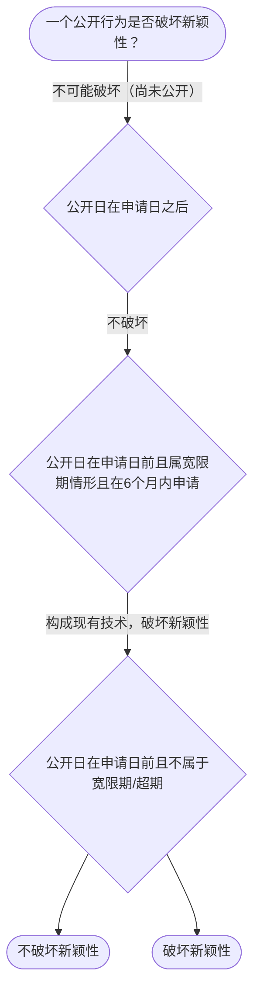

# 专家 B 教学草稿

> 专家：expert_b ｜ 风格：accessible

## 教学模块选择清单

- 当前教学节点：`patent-law-foundation`
- 板块预算：自适应 0/0，总计 0/0

| # | 模块 (block_type) | 类型 | 触发原因 (trigger) | 对应正文段 | 归属 |
|---:|---|:--:|---|---|:--:|
| 1 | `anchor_scenario` | 自适应 | perception=sensing(0.88) / cold_start | 材料研发专利申请场景引入｜某材料科技公司在研发新型电池复合材料，希望申请专利保护生产销售权利，但担心在技术会议展示会破… | [B] |
| 2 | `legal_anchor` | 必选 | mandatory | 专利法基础法条锚定｜《专利法》第二条 | [B] |
| 3 | `worked_example` | 自适应 | cognition.apply=0.38<0.4 / cognition.analyze=0.28<0.3 / cold_start | 材料专利案例判定链演示｜甲公司2023-05-01在政府主办国际展会展出新型电池复合材料，2023-10-20提出专… | [B] |
| 4 | `decision_flow` | 自适应 | input=visual(0.81) | 专利授权决策流程｜一个公开行为是否破坏新颖性？ | [B] |
| 5 | `mnemonic` | 自适应 | remember=0.83>=0.6 & apply<0.4 / understanding=sequential(0.76) | 三客体三性记忆口诀｜三客体三性表 | [B] |
| 6 | `reflect_prompt` | 自适应 | processing=reflective(0.69) | 反思迁移提示｜如果客户同时做了展会展示和论文发表，你会怎么排时间表？ | [B] |
| 7 | `assessment` | 必选 | mandatory | 三类测评闭环｜专利保护客体 | [B] |
| 8 | `knowledge_synthesis` | 必选 | mandatory | 专利制度基础框架｜专利客体：发明、实用新型、外观设计（专利法第2条） | [B] |
| 9 | `summary_card` | 自适应 | len(knowledge_sub_nodes)=3>=3 | 速查卡｜先过保护客体之门，再过三性安检。 | [B] |

## 教学正文

## 1. 场景导入

在材料领域，一家科技公司正在研发新型电池复合材料。他们希望通过专利制度保护自己的技术成果，但担心在技术会议上展示会影响新颖性。这里既有‘能不能申请’（保护客体）问题，也有‘公开展示是否致命’（新颖性宽限期）等具体冲突，让学习者先看到真实研发场景。

## 2. 人话解释

专利法律制度是保护发明创造的法律框架。它有三个基本特征：独占性（独家使用权）、时间性（有限期限保护）和地域性（只在中国境内有效）。中国专利体系由《专利法》、《专利法实施细则》和《审查指南》构成。专利保护三种客体：发明（对产品、方法或其改进的新技术方案）、实用新型（产品形状、构造或结合的适于实用的改进）和外观设计（产品的形状、图案或结合的富有美感并适于工业应用的新设计）。专利制度的作用是激励发明创造、促进技术公开、推动技术应用和经济发展。中国专利审查采用早期公开、初步审查与实质审查并存的制度，先看客体，再判断三性。

## 3. 法条回扣

〔RAG: 专利法.txt — 第二条 本法所称的发明创造是指发明、实用新型和外观设计。发明，是指对产品、方法或者其改进所提出的新的技术方案。实用新型，是指对产品的形状、构造或者其结合所提出的适于实用的新的技术方案。外观设计，是指对产品的整体或者局部的形状、图案或者其结合以及色彩与形状、图案的结合所作出的富有美感并适于工业应用的新设计。〕

〔RAG: 专利法.txt — 第三条 国务院专利行政部门负责管理全国的专利工作；统一受理和审查专利申请，依法授予专利权。省、自治区、直辖市人民政府管理专利工作的部门负责本行政区域内的专利管理工作。〕

〔RAG: 专利法.txt — 第五条 对违反法律、社会公德或者妨害公共利益的发明创造，不授予专利权。〕

## 4. 类比 / 口诀

口诀“发明实用新型外观设计”对应专利客体，三性依次审查。先看客体（是发明还是外观？），再过新颖性（没公开）、创造性（不显而易见）、实用性（能用有用）。适用边界：仅用于理解基础概念，不能替代具体案情三性判定。

## 5. 应试提示

题干关键词：专利客体、三性、专利法第2条。常见陷阱：混淆外观设计与发明，或忽略实用性要求。在材料专利中，先判断客体，再看三性。材料领域常见问题：新材料形状改进算实用新型还是发明？

## 6. 互动提问

如果你是专利审查员，看到一家材料公司研发的复合材料能做有用电池，但担心公开会影响新颖性，你会先考虑什么？为什么？

### 材料研发专利申请场景引入（anchor_scenario）

> 某材料科技公司在研发新型电池复合材料，希望申请专利保护生产销售权利，但担心在技术会议展示会破坏新颖性。这里既有‘能不能申请’（保护客体），也有‘公开展示是否致命’（新颖性宽限期）两个真实问题，让学习者先看见研发中的冲突点。

**锚定**：用同一技术事实同时引出‘保护客体’与‘授权三性’两个抽象模块。

**先想一想**：如果你是专利代理人，看到‘展会展示’这个动作，第一反应是风险还是安全？为什么？

### 专利法基础法条锚定（legal_anchor）

- **《专利法》第二条**：专利法第二条定义三种保护客体：发明、实用新型和外观设计。
- **《专利法》第三条**：专利法第三条明确国务院专利行政部门负责全国专利工作。
- **《专利法》第五条**：专利法第五条规定违反法律或公德的发明不授予专利权。

**为何重要**：本节点讲授权实质条件，三性是贯穿全章的判定主线，必须先立住条文。

### 材料专利案例判定链演示（worked_example）

**案情/例题**：甲公司2023-05-01在政府主办国际展会展出新型电池复合材料，2023-10-20提出专利申请。问：展出是否破坏新颖性？
**适用规则**：《专利法》第二十四条（不丧失新颖性宽限期6个月）
**分步推演**：
1. 展出日在申请日前，且属‘政府主办国际展会’法定情形 → *落入宽限期适用范围*
2. 申请日2023-10-20距展出日2023-05-01约5.5个月<6个月 → *在宽限期内*
3. 宽限期仅豁免该公开，不改变三性实质审查 → *仍需过创造性/实用性*
**结论**：展出不破坏新颖性，但仅豁免该次公开，实体三性仍须满足。
**本题要点**：宽限期是‘时间豁免’不是‘免死金牌’，先判范围再算日期。

### 专利授权决策流程（decision_flow）

**决策问题**：一个公开行为是否破坏新颖性？



### 三客体三性记忆口诀（mnemonic）

**记忆锚**：三客体三性表
**映射**：
- 发明/实用新型/外观设计
- 新/创/实
**何时用**：看到‘授权条件’‘为什么不给专利’时先过三性表。

### 反思迁移提示（reflect_prompt）

**反思问题**：如果客户同时做了展会展示和论文发表，你会怎么排时间表？

**关注要点**：两个公开行为的日期各自如何算宽限期；论文发表是否也享宽限期

**连接**：连接到‘现有技术’与‘公开行为类型’

### 专利制度基础框架（knowledge_synthesis）

**知识框架**：
- 专利客体：发明、实用新型、外观设计（专利法第2条）
- 制度特征：独占性、时间性、地域性
- 作用：激励发明、促进公开、推动经济发展
- 体系：专利法、实施细则、审查指南
- 发展：早期公开、初步与实质审查并存
**概念关系**：先判断客体，再过三性；三客体需同时满足新颖性、创造性、实用性
**必记**：三性缺一不可；客体决定后续三性审查

### 速查卡（summary_card）

**要点卡**：
- **保护客体**：发明、实用新型、外观设计
- **三性**：新颖性、创造性、实用性
- **制度特征**：独占性、时间性、地域性
**必背**：三客体三性；专利法第二条是基础
**一句话总结**：先过保护客体之门，再过三性安检。

### 三类测评闭环（assessment）

**三类覆盖**：backward_review、forward_probe、weakness_probe
**题目**：
- q1：专利保护客体
- q2：专利制度特征
- q3：材料案例三性判断


## 结构化字段

## knowledge_points

```json
[
  {
    "node_id": "patent-law-foundation",
    "kc_name": "专利制度的基本概念与特征：独占性、时间性、地域性（详见子节点 patent-rights-nature）"
  },
  {
    "node_id": "patent-law-foundation",
    "kc_name": "中国专利制度体系：专利法、专利法实施细则、专利审查指南（详见子节点 patent-law-framework）"
  },
  {
    "node_id": "patent-law-foundation",
    "kc_name": "专利保护的三种客体：发明、实用新型、外观设计（专利法第2条）"
  },
  {
    "node_id": "patent-law-foundation",
    "kc_name": "专利制度的作用：激励发明创造、促进技术公开、推动技术应用和经济发展（详见子节点 patent-system-overview）"
  },
  {
    "node_id": "patent-law-foundation",
    "kc_name": "中国专利制度发展历程与特点：早期公开延迟审查、初步审查制与实质审查制并存（详见子节点 patent-system-overview）"
  }
]
```

## legal_basis

```json
[
  {
    "article": "《专利法》第二条",
    "source": "中华人民共和国专利法.txt"
  },
  {
    "article": "《专利法》第三条",
    "source": "中华人民共和国专利法.txt"
  },
  {
    "article": "《专利法》第五条",
    "source": "中华人民共和国专利法.txt"
  }
]
```

## risks

```json
[
  {
    "risk": "混淆专利客体与三性审查",
    "related_node_id": "patent-law-foundation"
  },
  {
    "risk": "忽视地域性特征",
    "related_node_id": "patent-law-foundation"
  }
]
```

## draft_stage

```json
"debate"
```

## interactive_questions

```json
[
  {
    "qid": "q1",
    "category": "remember",
    "difficulty": "L1",
    "source_tag": "backward_review",
    "kc_node_id": "patent-law-foundation",
    "question": "专利法第二条规定的专利保护客体有哪些？",
    "answer": "A",
    "options": [
      "A. 发明、实用新型和外观设计",
      "B. 仅发明",
      "C. 仅实用新型",
      "D. 仅外观设计"
    ]
  },
  {
    "qid": "q2",
    "category": "understand",
    "difficulty": "L1",
    "source_tag": "backward_review",
    "kc_node_id": "patent-law-foundation",
    "question": "专利制度的基本特征不包括哪项？",
    "answer": "B",
    "options": [
      "A. 独占性",
      "B. 地域性",
      "C. 时间性",
      "D. 地域性"
    ]
  },
  {
    "qid": "q3",
    "category": "apply",
    "difficulty": "L3",
    "source_tag": "weakness_probe",
    "kc_node_id": "patent-law-foundation",
    "question": "在材料研发中，如果一种新复合材料形状有改进且能制造出有用电池，能申请外观设计专利吗？",
    "answer": "A",
    "options": [
      "A. 不能，因为外观设计要求有美感特征",
      "B. 能，因为是发明",
      "C. 能，因为是实用新型",
      "D. 不能，因为不是新颖"
    ]
  }
]
```

## knowledge_synthesis

```json
{
  "node": "patent-law-foundation",
  "coverage": [
    {
      "node_id": "patent-law-foundation"
    }
  ],
  "confusable_pairs": [
    {
      "pair": "发明与实用新型"
    },
    {
      "pair": "新颖性与创造性"
    }
  ]
}
```
