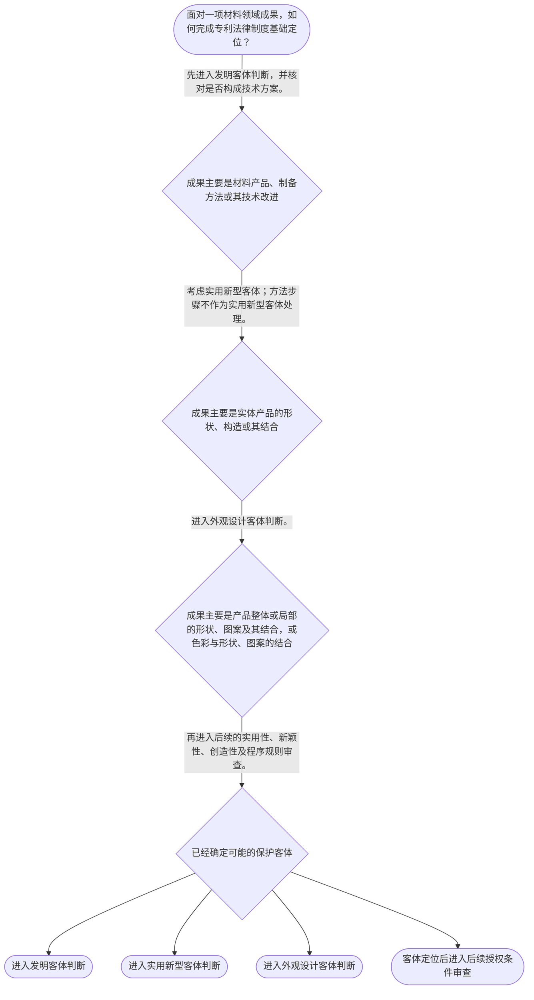

# 整合后的课程完整内容与习题

## 教学模块选择清单

- 当前教学节点：`patent-law-foundation`
- 板块预算：自适应 5/6，总计 9/9

| # | 模块 (block_type) | 类型 | 触发原因 (trigger) | 对应正文段 | 归属 |
|---:|---|:--:|---|---|:--:|
| 1 | `anchor_scenario` | 自适应 | perception=sensing(0.88) / cold_start | 材料团队的第一步定位｜研发团队制得耐高温复合涂层，同时掌握涂层配方、制备工艺和产品表面纹理。团队急于检索新颖性，但… | [A+B融合] |
| 2 | `legal_anchor` | 必选 | mandatory | 法条锚定：三类发明创造｜《专利法》第二条 | [A] |
| 3 | `worked_example` | 自适应 | cognition.analyze=0.29<0.3 / cold_start | 复合材料成果的归类示范｜某公司形成三项成果：复合涂层材料组成、制备该涂层的加热工艺、涂层产品的视觉图案。应先如何定位… | [A+B融合] |
| 4 | `decision_flow` | 自适应 | input=visual(0.81) | 材料成果的基础判断流程｜面对一项材料领域成果，如何完成专利法律制度基础定位？ | [A] |
| 5 | `mnemonic` | 自适应 | understanding=sequential(0.76) | 口诀：保、据、关｜基础三问：保什么、据什么、过几关 | [B] |
| 6 | `reflect_prompt` | 自适应 | processing=reflective(0.69) | 把研发成果说成正确的专利问题｜回想一项熟悉的材料成果：它的贡献主要在产品、方法、结构还是外观？你是否把客体判断和授权条件判… | [A+B融合] |
| 7 | `assessment` | 必选 | mandatory | 三类测评入口｜识别法定三类发明创造。 | [A+B融合] |
| 8 | `knowledge_synthesis` | 必选 | mandatory | 专利法律制度基础框架｜保护客体：发明、实用新型、外观设计对应不同法定对象。 | [A+B融合] |
| 9 | `summary_card` | 自适应 | len(knowledge_sub_nodes)=3>=3 | 节点速查卡｜材料专利先定位保护对象和制度依据，再学习新颖性、创造性及申请程序。 | [B] |

## 教学正文

## 一、从材料成果先建立“制度地图” [A+B融合]

材料研发团队完成一种耐高温复合材料后，不能只因它“很新”就直接讨论新颖性或创造性。第一步应先辨认：申请拟保护的是材料产品、制备方法、产品结构，还是产品外观；第二步再确认应依据哪一层规范处理；最后才进入后续节点中的授权条件和程序细节。

## 二、三类保护客体：先回答“保什么” [A]

《专利法》所称发明创造包括发明、实用新型和外观设计。发明是对产品、方法或者其改进所提出的新的技术方案；实用新型是对产品的形状、构造或者其结合所提出的适于实用的新的技术方案；外观设计是对产品整体或者局部的形状、图案或者其结合，以及色彩与形状、图案的结合所作出的富有美感并适于工业应用的新设计。〔RAG: 中华人民共和国专利法.txt — 第二条：本法所称的发明创造是指发明、实用新型和外观设计；分别规定三类客体的定义〕

对材料领域而言，材料组成、性能改进及制备工艺通常应先放入发明的产品或方法技术方案框架。判断发明客体的重点不只是名称是否带有“新型”，而在于方案是否采用技术手段解决技术问题，并获得符合自然规律的技术效果。〔RAG: 专利法专题讲座.txt — 专利法第2条第2款着重点并不是“新”，而是“技术方案”；采用技术手段、解决技术问题并获得符合自然规律的技术效果〕

实用新型只保护具有确定形状、构造并占据一定空间的产品；制造方法、使用方法、处理方法等一切方法不属于实用新型保护客体。〔RAG: 专利法专题讲座.txt — 实用新型专利只保护产品；一切方法不属于实用新型的保护客体〕因此，“一种烧结工艺”不能仅因它服务于实体材料就改按实用新型理解。

## 三、权利和规则书：再回答“权利边界与依据是什么” [A+B融合]

专利权具有三项基础特征：**独占性、时间性、地域性**。独占性说明权利人在法定范围内享有排他利益；时间性说明权利不是永久存在；地域性说明权利原则上在授予该权利的国家或地区法域内发生效力。把专利类比为“有期限、有地盘的独占通行证”有助于记忆，但该类比不能替代对权利要求范围、法定期限和具体法律程序的判断。

中国专利制度可按三层规范理解：专利法提供基本法律框架；专利法实施细则细化程序和操作事项；专利审查指南为审查中的具体判断提供操作性指引。遇到具体审查问题时，先找法律规则，再核对实施细则和审查指南的对应要求，不能用操作指引替代法律本身。

## 四、制度为何要审查：公开与激励的交换 [B]

专利制度以一定范围和期限内的排他权，交换申请人公开技术方案。其制度功能在于激励发明创造、促进技术公开和传播、推动技术应用，并服务经济发展。材料领域的配方、工艺和性能数据之所以需要在专利申请中被清楚描述，正与这种“以公开换保护”的制度设计相衔接。

中国制度具有初步审查与实质审查并存的结构。初步审查会审查申请文件及格式等事项；发明专利还会进入相应的实质审查安排。〔RAG: 中华人民共和国专利法实施细则.txt — 第五十条：初步审查包括审查申请是否具备法定文件、文件是否符合规定格式，并审查所列事项〕具体的申请文件、申请日、优先权和修改规则属于后续“专利申请程序”节点的重点。

## 五、为新颖性、创造性预留正确入口 [A+B融合]

本节点只建立进入实体审查前的定位能力：**属于专利保护客体，不等于已经具备新颖性、创造性或其他授权条件。**后续审查时，新颖性判断强调将每项权利要求与单一现有技术或者申请在先、公开在后的相关内容分别比较，不得把多份对比内容拼接起来否定新颖性。〔RAG: 专利法专题讲座.txt — 判断新颖性时，各项权利要求应分别与每一项现有技术或申请在先公布在后的相关内容单独比较，不得与几项内容组合对比〕

这正是材料专利学习中最重要的分界线：单一对比中的“是否相同”属于新颖性问题；多项信息能否给出组合动机或技术启示，属于后续创造性分析的范围。当前先稳住“客体定位—制度依据—授权条件”三层关系，才能避免把创造性问题误当作新颖性问题。

## 六、本节结论 [A+B融合]

面对一项材料成果，按“**保什么—依据什么—再过哪些授权关**”的顺序分析：先区分发明、实用新型或外观设计；再理解专利法、实施细则和审查指南的制度层级，以及独占性、时间性、地域性的权利边界；最后才进入新颖性、创造性和申请程序等后续专题。

本节设有测评，请到【习题】区作答。

### 材料团队的第一步定位（anchor_scenario）

> 研发团队制得耐高温复合涂层，同时掌握涂层配方、制备工艺和产品表面纹理。团队急于检索新颖性，但代理师先要求写清：每项成果到底要保护材料产品、制备方法、产品结构还是外观。

**锚定**：该情境把材料研发事实与三类客体、权利边界和后续授权条件的先后关系连接起来。

**先想一想**：看到“新型材料”时，应先确认保护客体，还是先判断它是否新颖？

### 法条锚定：三类发明创造（legal_anchor）

- **《专利法》第二条**：发明、实用新型和外观设计是三类法定保护客体，三者的保护对象不同。
- **《专利法》第二条第二款、第三款的客体解释**：发明可涉及产品、方法或其改进的技术方案；实用新型限于产品的形状、构造或其结合；外观设计保护符合法定定义的产品视觉设计。

**为何重要**：先确定客体，才能避免将方法错放入实用新型，或将客体成立错误等同于满足新颖性、创造性。

### 复合材料成果的归类示范（worked_example）

**案情/例题**：某公司形成三项成果：复合涂层材料组成、制备该涂层的加热工艺、涂层产品的视觉图案。应先如何定位？能否仅凭定位就判断可授权？
**适用规则**：《专利法》第二条关于发明、实用新型和外观设计的定义；发明客体应围绕技术方案理解。
**分步推演**：
1. 材料组成属于产品层面的技术内容，加热工艺属于方法层面的技术内容；二者通常先在发明客体框架中判断是否构成技术方案。 → *产品与方法通常先看发明客体。*
2. 若成果体现为实体产品的形状、构造或其结合，才可能进入实用新型客体判断；工艺步骤本身不能按实用新型处理。 → *结构方案与方法方案不可混同。*
3. 产品视觉图案应按外观设计定义单独分析。无论定位到哪类客体，仍须在后续审查中判断相应授权条件。 → *客体成立不等于当然授权。*
**结论**：材料产品、方法、结构和外观可能适用不同保护路径，必须先分别归类，再进入后续实体和程序审查。
**本题要点**：先问“保什么”，再问“是否满足授权条件”。

### 材料成果的基础判断流程（decision_flow）

**决策问题**：面对一项材料领域成果，如何完成专利法律制度基础定位？



### 口诀：保、据、关（mnemonic）

**记忆锚**：基础三问：保什么、据什么、过几关
**映射**：
- 保什么
- 据什么
- 过几关
- 独时域
**何时用**：阅读材料专利题干或审查意见时，先按“保—据—关”定位问题；口诀仅用于记忆，不替代法条和权利要求分析。

### 把研发成果说成正确的专利问题（reflect_prompt）

**反思问题**：回想一项熟悉的材料成果：它的贡献主要在产品、方法、结构还是外观？你是否把客体判断和授权条件判断混在了一起？

**关注要点**：权利要求拟限定的是产品、方法、形状构造还是视觉设计。；独占性是否被误解为永久或全球有效。；新颖性中的单一对比与创造性中的组合评价是否被混淆。

**连接**：把研发语言转换为“保护客体—制度依据—后续授权条件”的分析顺序，为后续新颖性和创造性专题建立入口。

### 专利法律制度基础框架（knowledge_synthesis）

**知识框架**：
- 保护客体：发明、实用新型、外观设计对应不同法定对象。
- 权利边界：独占性、时间性、地域性共同限定专利权。
- 制度体系：专利法提供基本框架，实施细则细化程序，审查指南提供操作指引。
- 制度作用：通过公开与保护的交换，激励创造、促进公开和推动应用。
- 审查衔接：先定位客体，再进入后续授权条件和程序审查；初步审查与实质审查并存。
**概念关系**：材料产品和制备方法通常先按发明客体分析；产品形状构造才可能进入实用新型。；权利三特征回答“授权后权利的边界”，新颖性和创造性回答“是否满足授权条件”，二者不能混同。；初步审查与实质审查的具体程序要求在后续申请程序和实体条件节点继续学习。
**必记**：发明客体强调技术方案，不能只因名称“新”就作出判断。；实用新型只保护产品的形状、构造或其结合，不保护方法。；客体判断不等于新颖性或创造性判断。；新颖性先看单一对比，组合评价是后续创造性分析的思路。

### 节点速查卡（summary_card）

**要点卡**：
- **三类客体**：发明、实用新型、外观设计的保护对象不同。
- **发明技术方案**：关键在技术手段、技术问题和技术效果，不只看名称是否新。
- **实用新型边界**：保护产品的形状、构造或其结合，不保护方法。
- **权利三特征**：独占性、时间性、地域性共同限定专利权。
- **审查顺序**：先定客体，再进入授权条件；新颖性单一对比，创造性再看组合评价。
**必背**：客体三分：发、实、外。；权利三性：独、时、域。；制度三层：法、则、指。；先定客体，后审授权条件。
**一句话总结**：材料专利先定位保护对象和制度依据，再学习新颖性、创造性及申请程序。

### 三类测评入口（assessment）

**三类覆盖**：backward_review、forward_probe、weakness_probe
**题目**：
- q-foundation-backward-1：识别法定三类发明创造。
- q-foundation-forward-1：仅预览下一节点中的申请文件构成。
- q-foundation-weakness-1：区分新颖性的单一对比与创造性的组合评价。


## 结构化数据

## expert

```json
"A+B融合"
```

## style

```json
"fused"
```

## knowledge_points

```json
[
  {
    "node_id": "patent-law-foundation",
    "kc_name": "专利制度的基本概念与特征：独占性、时间性、地域性"
  },
  {
    "node_id": "patent-law-foundation",
    "kc_name": "中国专利制度体系：专利法、专利法实施细则、专利审查指南"
  },
  {
    "node_id": "patent-law-foundation",
    "kc_name": "专利保护的三种客体：发明、实用新型、外观设计"
  },
  {
    "node_id": "patent-law-foundation",
    "kc_name": "专利制度的作用：激励发明创造、促进技术公开、推动技术应用和经济发展"
  },
  {
    "node_id": "patent-law-foundation",
    "kc_name": "中国专利制度发展历程与特点：早期公开延迟审查、初步审查制与实质审查制并存"
  }
]
```

## legal_basis

```json
[
  {
    "article": "《专利法》第二条",
    "source": "中华人民共和国专利法.txt"
  },
  {
    "article": "《专利法》第二条第二款、第三款关于发明与实用新型保护客体的解释",
    "source": "专利法专题讲座.txt"
  },
  {
    "article": "《专利法实施细则》第五十条关于初步审查",
    "source": "中华人民共和国专利法实施细则.txt"
  },
  {
    "article": "新颖性应以单一对比文件单独对比的判断原则",
    "source": "专利法专题讲座.txt"
  }
]
```

## risks

```json
[
  {
    "risk": "把属于发明、实用新型或外观设计的客体判断，误当成已经满足新颖性或创造性。",
    "related_node_id": "patent-law-foundation"
  },
  {
    "risk": "将多份对比文件的组合用于否定新颖性，混淆新颖性与后续创造性判断。",
    "related_node_id": "patent-law-foundation"
  },
  {
    "risk": "将制备方法或使用方法错误归入实用新型保护客体。",
    "related_node_id": "patent-law-foundation"
  },
  {
    "risk": "将独占性误解为永久且全球有效的权利。",
    "related_node_id": "patent-law-foundation"
  },
  {
    "risk": "将申请文件、申请日及修改边界提前当作本节点已掌握的程序规则。",
    "related_node_id": "patent-application-process"
  }
]
```

## draft_stage

```json
"integration"
```

## irac

```json
{
  "issue": "材料领域成果应如何在进入新颖性、创造性等实体判断前，先完成专利保护客体、规范层级和权利边界的基础定位？",
  "rule": "《专利法》第二条规定发明、实用新型和外观设计三类发明创造及其定义。发明强调产品、方法或其改进所提出的技术方案；实用新型限于产品的形状、构造或其结合。专利制度中的权利具有独占性、时间性和地域性；专利法、实施细则和审查指南分别构成基本规则、程序细化和审查操作指引。",
  "application": "对于材料组成和制备工艺，应先判断其是否作为产品或方法构成技术方案；对于材料器件的形状、构造，应再考虑实用新型的客体边界；对于产品视觉设计，则按外观设计定义定位。完成客体定位后，不能直接推定授权，而应在后续专题中分别审查新颖性、创造性及程序要求。",
  "conclusion": "材料专利分析的基础顺序是先定保护客体，继而确定适用的制度规则和权利边界，最后进入授权条件与申请程序。客体判断、权利边界与新颖性、创造性判断必须分别处理。"
}
```

## interactive_questions

```json
[
  {
    "qid": "q-foundation-backward-1",
    "category": "remember",
    "difficulty": "L1",
    "source_tag": "backward_review",
    "kc_node_id": "patent-law-foundation",
    "question": "根据《专利法》第二条，下列哪一组完整列出了专利法所称的三类发明创造？",
    "answer": "B",
    "options": [
      "A. 发明、商标、著作权",
      "B. 发明、实用新型、外观设计",
      "C. 产品、方法、商业模式",
      "D. 发明、新颖性、创造性"
    ]
  },
  {
    "qid": "q-foundation-forward-1",
    "category": "understand",
    "difficulty": "L1",
    "source_tag": "forward_probe",
    "kc_node_id": "patent-application-process",
    "question": "本题仅用于预览下一节点“专利申请程序”，不作为本节点掌握判定。下列哪项通常属于申请发明或者实用新型专利时提交的文件？",
    "answer": "A",
    "options": [
      "A. 请求书、说明书及其摘要、权利要求书等",
      "B. 仅提交产品实物和销售合同",
      "C. 仅提交发明人的实验记录",
      "D. 仅提交授权证书和无效决定"
    ]
  },
  {
    "qid": "q-foundation-weakness-1",
    "category": "analyze",
    "difficulty": "L3",
    "source_tag": "weakness_probe",
    "kc_node_id": "patent-law-foundation",
    "question": "某申请要求保护一种复合材料及其制备方法。对比文件甲公开了相同材料组成，对比文件乙公开了相同加热步骤，但甲、乙均未单独公开该申请的完整技术方案。下列判断最准确的是？",
    "answer": "C",
    "options": [
      "A. 可直接把甲、乙组合，因此该申请当然不具备新颖性",
      "B. 只要材料名称不同，该申请当然具备新颖性和创造性",
      "C. 新颖性应先进行单一对比；能否组合甲、乙分析技术启示属于后续创造性判断问题",
      "D. 因为包含制备方法，该申请只能作为实用新型审查"
    ]
  }
]
```

## knowledge_synthesis

```json
{
  "node": "patent-law-foundation",
  "coverage": [
    {
      "node_id": "patent-law-foundation"
    },
    {
      "node_id": "patent-law-foundation"
    },
    {
      "node_id": "patent-law-foundation"
    },
    {
      "node_id": "patent-law-foundation"
    },
    {
      "node_id": "patent-law-foundation"
    }
  ],
  "confusable_pairs": [
    {
      "pair": "保护客体判断与授权条件判断：前者问是否属于相应专利类型的保护对象，后者问是否满足授权的实体条件。"
    },
    {
      "pair": "新颖性与创造性：新颖性强调单一对比，创造性才讨论多项信息之间是否存在技术启示。"
    },
    {
      "pair": "发明与实用新型：发明可涉及产品、方法或其改进；实用新型限于产品形状、构造或其结合。"
    },
    {
      "pair": "独占性与永久性、全球性：专利具有排他性，但仍受法定期限和地域范围限制。"
    },
    {
      "pair": "专利法、实施细则与审查指南：分别承担基本规则、程序细化和审查操作指引功能。"
    }
  ]
}
```

## exercises

```json
[
  {
    "question": "根据《专利法》第二条，下列哪一组完整列出了专利法所称的三类发明创造？",
    "answer": "B",
    "options": [
      "A. 发明、商标、著作权",
      "B. 发明、实用新型、外观设计",
      "C. 产品、方法、商业模式",
      "D. 发明、新颖性、创造性"
    ]
  },
  {
    "question": "本题仅用于预览下一节点“专利申请程序”。下列哪项通常属于申请发明或者实用新型专利时提交的文件？",
    "answer": "A",
    "options": [
      "A. 请求书、说明书及其摘要、权利要求书等",
      "B. 仅提交产品实物和销售合同",
      "C. 仅提交发明人的实验记录",
      "D. 仅提交授权证书和无效决定"
    ]
  },
  {
    "question": "某申请要求保护一种复合材料及其制备方法。甲、乙两份对比文件分别公开部分内容，但均未单独公开完整方案。下列判断最准确的是？",
    "answer": "C",
    "options": [
      "A. 可直接组合甲、乙否定新颖性",
      "B. 名称不同即当然具备创造性",
      "C. 新颖性先作单一对比，组合分析属于后续创造性问题",
      "D. 含有方法即只能按实用新型处理"
    ]
  }
]
```
