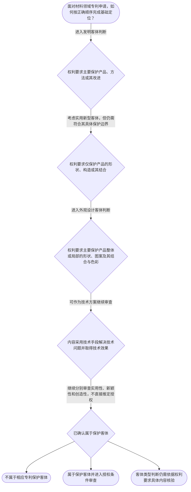

# 专家 A 教学草稿

> 专家：expert_a ｜ 风格：conservative

## 教学模块选择清单

- 当前教学节点：`patent-law-foundation`
- 板块预算：自适应 7/7，总计 9/9

| # | 模块 (block_type) | 类型 | 触发原因 (trigger) | 对应正文段 | 归属 |
|---:|---|:--:|---|---|:--:|
| 1 | `anchor_scenario` | 自适应 | perception=sensing(0.88) / cold_start | 材料研发团队的专利定位｜某材料研发团队完成了一种耐高温复合涂层：研发人员认为它是一种新产品，专利代理师却要求进一步确… | [A] |
| 2 | `legal_anchor` | 必选 | mandatory | 三类专利客体的法条锚定｜《专利法》第二条 | [A] |
| 3 | `worked_example` | 自适应 | cognition.analyze=0.29<0.3 / cold_start | 复合材料申请的判断链｜某公司申请“一种耐高温复合涂层及其制备方法”。权利要求一保护涂层材料本身，权利要求二保护将组… | [A] |
| 4 | `decision_flow` | 自适应 | input=visual(0.81) | 从客体到授权条件的判断流程｜面对材料领域专利申请，如何按正确顺序完成基础定位？ | [A] |
| 5 | `mnemonic` | 自适应 | understanding=sequential(0.76) | 基础判断三问表｜专利基础三问：一问“保什么”，二问“凭什么”，三问“过几关” | [A] |
| 6 | `reflect_prompt` | 自适应 | processing=reflective(0.69) | 把技术研发经验转成专利判断｜回想你熟悉的一项材料研发成果：它的技术贡献究竟体现在产品、制备方法、产品结构，还是外观设计？… | [A] |
| 7 | `assessment` | 必选 | mandatory | 基础概念三类测评｜识别《专利法》规定的三类发明创造 | [A] |
| 8 | `knowledge_synthesis` | 必选 | mandatory | 专利法律制度基础框架｜保护客体：发明、实用新型和外观设计是专利法规定的三类发明创造。 | [A] |
| 9 | `summary_card` | 自适应 | len(knowledge_sub_nodes)=3>=3 | 节点速查卡｜先确定专利保护什么，再判断技术方案是否成立，最后进入授权条件审查。 | [A] |

## 教学正文

## I — 法律问题

本节点要解决的基础问题是：专利制度保护什么、通过什么法律文件运行，以及专利权具有什么基本边界。只有先明确保护客体、制度层级和权利边界，后续的新颖性、创造性判断才有准确的适用对象。

## R — 适用规则

1. **保护客体。**《专利法》将发明创造分为发明、实用新型和外观设计。发明是对产品、方法或者其改进提出的新的技术方案；实用新型是对产品的形状、构造或者其结合提出的适于实用的新的技术方案；外观设计是对产品整体或者局部的形状、图案或者其结合以及色彩与形状、图案的结合所作出的富有美感并适于工业应用的新设计。〔RAG: 中华人民共和国专利法.txt — 第二条：本法所称的发明创造是指发明、实用新型和外观设计；分别规定三类客体〕

2. **发明客体的技术性。**判断某项内容是否属于发明专利保护客体，不能只看其是否“新”，还要看其是否构成技术方案，即是否采用技术手段解决技术问题并取得符合自然规律的技术效果。〔RAG: 专利法专题讲座.txt — 《专利法》第二条第二款着重点并不是“新”，而是“技术方案”；采用技术手段、解决技术问题并获得符合自然规律的技术效果〕

3. **制度文件层级。**中国专利审查和权利运行至少应放在专利法、专利法实施细则和专利审查指南三个层次中理解：专利法提供基本法律规则，实施细则规定程序和操作事项，审查指南提供审查判断的具体规范与方法。本次检索上下文未提供三者完整条文，关于其具体条款内容应以正式文本核验。

4. **专利权的基本特征。**独占性表示权利人在法定范围内排他地利用专利；时间性表示权利受法定期限限制；地域性表示权利原则上依授予该权利的国家或地区发生效力。这三个特征共同说明：专利权不是对技术事实的永久、全球性占有，而是法律在特定范围和期限内授予的权利。本次检索上下文未提供直接规定上述三项概念的具体条文，故这里只作制度概念说明。

5. **制度功能与审查衔接。**专利制度通过授予一定期限和范围内的排他权，交换申请人对技术方案的公开，从而服务于发明创造激励、技术传播和应用。审查时，应先确认申请内容属于可保护的技术客体，再进入实用性、新颖性、创造性等实体条件判断；检索材料明确记载，实质审查过程中在新颖性和创造性审查之前首先判断相关基础规定和实用性。〔RAG: 专利法专题讲座.txt — 《专利法》第二十条第一款、第二十二条第四款；在新颖性和创造性审查之前首先判断相关规定与实用性〕

6. **审查制度概览。**中国专利审查制度具有初步审查与实质审查并存的结构，发明专利申请通常体现早期公开、延迟提出实质审查请求与实质审查相衔接的制度特点。本次检索上下文未提供该历史沿革和程序结构的直接原文依据，后续学习申请程序时应进一步核对专利法及实施细则的具体规定。

## A — 规则适用

面对材料领域的一项申请，应按以下顺序定位问题：第一，先看申请要求保护的是产品、方法及其改进，还是产品外观；第二，若主张发明专利保护，再检查其是否以技术手段解决技术问题并产生技术效果，而不能因为名称新颖或具有商业价值就直接认定为发明客体；第三，确认所适用的制度文件层级，区分法律规则、实施细则的程序细化和审查指南的审查操作；第四，进入授权条件审查时，将保护客体判断与新颖性、创造性、实用性判断分开，避免把“是否属于专利保护对象”和“是否具备授权条件”混为一谈。

材料领域尤其容易出现边界错位。例如，一项新材料的配方可能属于产品技术方案；一种制备该材料的工艺可能属于方法技术方案；但是否具备新颖性或创造性，仍需另行依据相应的现有技术和判断方法审查，不能仅凭其属于发明客体就得出可以授权的结论。检索材料还指出，实用新型只保护产品，产品制造方法、使用方法、通讯方法和处理方法等不属于实用新型保护客体。〔RAG: 专利法专题讲座.txt — 实用新型是对产品形状、构造或其结合提出的技术方案；一切方法不属于实用新型保护客体〕

## C — 结论

专利法律制度基础判断应坚持“先定客体，再定制度规则，后审授权条件”的顺序。发明、实用新型和外观设计的保护对象不同；专利权具有独占性、时间性和地域性；专利法、实施细则和审查指南构成理解审查规则的制度框架。当前检索依据足以确认三类保护客体和技术方案边界，但不足以直接支撑完整的新颖性、创造性三步法及修改超范围规则；这些内容应在对应后续节点中依据专门条文继续学习。

> 常见误区 / 易混淆点
>
> - “属于发明客体”不等于“已经具备新颖性和创造性”。
> - “技术内容很新”不等于“必然构成技术方案”；仍要检查技术手段、技术问题和技术效果。
> - 发明、实用新型、外观设计的保护对象不同，不能用一种客体的判断标准替代另一种客体的标准。
> - 专利权的独占性不意味着永久性或全球性。
>
> 本节设有测评，请到【习题】区作答。

### 材料研发团队的专利定位（anchor_scenario）

> 某材料研发团队完成了一种耐高温复合涂层：研发人员认为它是一种新产品，专利代理师却要求进一步确认权利要求究竟保护材料本身、制备方法，还是产品外观。团队随后发现，即使内容属于可以申请专利的技术方案，也还要继续面对新颖性、创造性和实用性审查。此时团队需要解决的冲突是：技术成果的名称、保护客体和授权条件并不是同一个问题。

**锚定**：该情境锚定专利保护客体、专利权边界以及保护客体与授权条件相区分的基础框架。

**先想一想**：如果你是代理师，面对“新型材料”四个字，你会先确认保护客体，还是直接判断新颖性？为什么？

### 三类专利客体的法条锚定（legal_anchor）

- **《专利法》第二条**：专利法把发明创造分为发明、实用新型和外观设计，三者保护对象不同。
- **《专利法》第二条第二款、第三款及第四款**：发明可以涉及产品、方法或其改进，但核心是新的技术方案；实用新型限于产品的形状、构造或其结合；外观设计关注产品整体或局部的形状、图案及其结合与色彩。

**为何重要**：后续判断新颖性和创造性前，必须先知道审查对象是什么。客体定位错误，会导致后续把不适用的授权标准套到申请上。

### 复合材料申请的判断链（worked_example）

**案情/例题**：某公司申请“一种耐高温复合涂层及其制备方法”。权利要求一保护涂层材料本身，权利要求二保护将组分混合并加热的制备方法。需要判断：这些内容首先应如何进行专利客体定位？客体定位后能否直接得出可以授权的结论？
**适用规则**：《专利法》第二条第二款关于发明是产品、方法或者其改进所提出的新的技术方案；《专利法》第二十二条关于授权专利应具备实用性等条件。
**分步推演**：
1. 先按权利要求的保护对象分类：权利要求一针对材料产品本身，权利要求二针对制备该材料的方法。二者都可能落入发明专利客体的产品或方法范围。 → *先确定权利要求保护的是产品还是方法。*
2. 再检查所述材料或方法是否以技术手段解决技术问题并产生符合自然规律的技术效果。仅有“新型”名称或商业用途，不能替代技术方案判断。 → *确认是否构成技术方案。*
3. 即使确认属于发明专利保护客体，还必须继续分别审查实用性、新颖性和创造性；客体判断只解决“能否作为该类专利对象审查”的前置问题。 → *客体成立不等于授权条件全部满足。*
**结论**：两项权利要求均可能属于发明专利保护客体，但最终能否授权不能由客体定位单独决定，仍须继续完成相应的实体条件审查。
**本题要点**：材料专利分析先问“保护什么、是否是技术方案”，再问“是否满足授权条件”。

### 从客体到授权条件的判断流程（decision_flow）

**决策问题**：面对材料领域专利申请，如何按正确顺序完成基础定位？



### 基础判断三问表（mnemonic）

**记忆锚**：专利基础三问：一问“保什么”，二问“凭什么”，三问“过几关”
**映射**：
- 保什么
- 凭什么
- 过几关
**何时用**：分析任何材料领域专利申请、审查意见或授权争议时，先按“保什么—凭什么—过几关”依次定位问题。

### 把技术研发经验转成专利判断（reflect_prompt）

**反思问题**：回想你熟悉的一项材料研发成果：它的技术贡献究竟体现在产品、制备方法、产品结构，还是外观设计？如果把保护客体定位错了，后续审查会受到什么影响？

**关注要点**：权利要求实际限定的是产品、方法、形状构造还是外观特征；技术方案判断与新颖性、创造性判断的对象是否被混淆；专利权的保护范围、期限和地域边界是否被正确理解

**连接**：连接到学习者的理工研发经验，并为后续新颖性、创造性判断建立共同的权利要求分析起点。

### 专利法律制度基础框架（knowledge_synthesis）

**知识框架**：
- 保护客体：发明、实用新型和外观设计是专利法规定的三类发明创造。
- 发明技术方案：发明可以涉及产品、方法或其改进，但应围绕技术手段、技术问题和技术效果理解。
- 制度文件：专利法、专利法实施细则和专利审查指南分别构成理解实体规则、程序细化和审查操作的重要层次。
- 专利权特征：独占性、时间性和地域性共同限定专利权的法律边界。
- 审查衔接：先判断保护客体，再进入实用性、新颖性和创造性等授权条件审查。
**概念关系**：先由权利要求确定保护客体，再判断是否构成相应的技术方案或设计。；保护客体判断是进入授权条件审查的前置定位，不替代新颖性和创造性判断。；专利法提供基本框架，实施细则和审查指南对程序与审查操作作进一步细化；本轮未提供其完整直接依据。
**必记**：发明、实用新型和外观设计的保护对象不能混用。；属于专利保护客体不等于已经满足新颖性、创造性和实用性。；分析专利基础问题时，应按“先定客体，再审授权条件”的顺序进行。

### 节点速查卡（summary_card）

**要点卡**：
- **三类保护客体**：发明、实用新型、外观设计分别对应不同的法定保护对象。
- **技术方案**：发明客体判断重点是技术手段、技术问题和技术效果，而不只是名称是否新。
- **专利权三特征**：独占性、时间性、地域性共同限定专利权的排他范围。
- **审查顺序**：先定保护客体，再进入实用性、新颖性和创造性等授权条件审查。
**必背**：《专利法》第二条规定发明、实用新型和外观设计三类发明创造。；实用新型保护产品的形状、构造或其结合，不直接保护方法。；属于保护客体不等于当然能够获得专利授权。
**一句话总结**：先确定专利保护什么，再判断技术方案是否成立，最后进入授权条件审查。

### 基础概念三类测评（assessment）

**三类覆盖**：backward_review、forward_probe、weakness_probe
**题目**：
- q-foundation-backward-1：识别《专利法》规定的三类发明创造
- q-foundation-forward-1：探测专利申请文件的基本组成
- q-foundation-weakness-1：区分发明保护客体与新颖性、创造性授权条件


## 结构化字段

## knowledge_points

```json
[
  {
    "node_id": "patent-law-foundation",
    "kc_name": "专利制度的基本概念与特征：独占性、时间性、地域性"
  },
  {
    "node_id": "patent-law-foundation",
    "kc_name": "中国专利制度体系：专利法、专利法实施细则、专利审查指南"
  },
  {
    "node_id": "patent-law-foundation",
    "kc_name": "专利保护的三种客体：发明、实用新型、外观设计"
  },
  {
    "node_id": "patent-law-foundation",
    "kc_name": "专利制度的作用：激励发明创造、促进技术公开、推动技术应用和经济发展"
  },
  {
    "node_id": "patent-law-foundation",
    "kc_name": "中国专利制度发展历程与特点：早期公开延迟审查、初步审查制与实质审查制并存"
  }
]
```

## legal_basis

```json
[
  {
    "article": "《专利法》第二条",
    "source": "中华人民共和国专利法.txt"
  },
  {
    "article": "《专利法》第二条第二款、第三款及第四款",
    "source": "专利法专题讲座.txt"
  },
  {
    "article": "《专利法》第二十条第一款、第二十二条第四款",
    "source": "专利法专题讲座.txt"
  }
]
```

## risks

```json
[
  {
    "risk": "将保护客体判断与新颖性、创造性授权条件混为一谈",
    "related_node_id": "patentability-substantive"
  },
  {
    "risk": "将发明专利关于产品或方法的保护范围直接套用于只保护产品形状、构造的实用新型",
    "related_node_id": "design-patentability"
  },
  {
    "risk": "将专利权的独占性误解为永久、无地域限制的权利",
    "related_node_id": "patent-rights-nature"
  },
  {
    "risk": "关于早期公开、延迟审查以及初步审查与实质审查并存的具体程序依据未在本轮检索上下文中完整提供",
    "related_node_id": "patent-application-process"
  }
]
```

## draft_stage

```json
"debate"
```

## irac

```json
{
  "issue": "专利法律制度基础中，如何区分三类专利保护客体、理解专利权边界并定位后续授权条件审查？",
  "rule": "《专利法》第二条规定发明、实用新型和外观设计的定义；检索材料说明发明客体的核心在于技术方案，实用新型只保护产品的形状、构造或其结合。专利审查应将保护客体判断与实用性、新颖性、创造性判断区分开。",
  "application": "材料领域申请应先根据权利要求的内容确定其属于产品、方法、产品结构或外观设计，再判断是否具有相应的技术方案或设计特征。确认属于保护客体后，仍须按照相应授权条件继续审查，不能仅因属于保护客体就认定能够授权。",
  "conclusion": "本节点的正确判断顺序是先定保护客体和制度层级，再进入授权条件审查；三类专利客体和专利权的独占性、时间性、地域性共同构成后续学习新颖性与创造性的基础。"
}
```

## interactive_questions

```json
[
  {
    "qid": "q-foundation-backward-1",
    "category": "remember",
    "difficulty": "L1",
    "source_tag": "backward_review",
    "kc_node_id": "patent-law-foundation",
    "question": "根据《专利法》第二条，下列哪一组完整列出了专利法所称的三类发明创造？",
    "answer": "B",
    "options": [
      "A. 发明、商标、著作权",
      "B. 发明、实用新型、外观设计",
      "C. 产品、方法、商业模式",
      "D. 发明、实用性、创造性"
    ]
  },
  {
    "qid": "q-foundation-forward-1",
    "category": "understand",
    "difficulty": "L1",
    "source_tag": "forward_probe",
    "kc_node_id": "patent-application-process",
    "question": "下列哪项属于专利申请程序中通常需要提交的申请文件？",
    "answer": "A",
    "options": [
      "A. 请求书、说明书及其摘要、权利要求书",
      "B. 仅提交产品实物和销售合同",
      "C. 仅提交发明人的工作日志",
      "D. 仅提交检索报告和授权证书"
    ]
  },
  {
    "qid": "q-foundation-weakness-1",
    "category": "analyze",
    "difficulty": "L3",
    "source_tag": "weakness_probe",
    "kc_node_id": "patent-law-foundation",
    "question": "某申请的权利要求记载：一种新型复合材料，其特征在于将两种已知材料按特定比例混合并经加热制得。关于该内容的判断，下列哪项最准确？",
    "answer": "C",
    "options": [
      "A. 只要名称是新型复合材料，就当然具备新颖性和创造性",
      "B. 因为涉及材料配方，所以只能申请实用新型专利",
      "C. 该内容可能属于发明专利保护客体，但是否具备新颖性和创造性仍需另行审查",
      "D. 只要属于技术方案，就必然应当授予专利权"
    ]
  }
]
```

## knowledge_synthesis

```json
{
  "node": "patent-law-foundation",
  "coverage": [
    {
      "node_id": "patent-law-foundation"
    },
    {
      "node_id": "patent-law-foundation"
    },
    {
      "node_id": "patent-law-foundation"
    },
    {
      "node_id": "patent-law-foundation"
    },
    {
      "node_id": "patent-law-foundation"
    }
  ],
  "confusable_pairs": [
    {
      "pair": "保护客体判断与新颖性、创造性判断：前者问“是否属于专利法保护对象”，后者问“是否满足授权实质条件”。"
    },
    {
      "pair": "发明与实用新型：发明可以保护产品、方法或其改进，实用新型原则上限于产品的形状、构造或其结合。"
    },
    {
      "pair": "独占性与永久性、全球性：专利权具有排他效力，但同时受到法定期限和地域范围限制。"
    }
  ]
}
```

## exercises

```json
[
  {
    "question": "根据《专利法》第二条，下列哪一组完整列出了专利法所称的三类发明创造？",
    "answer": "B",
    "options": [
      "A. 发明、商标、著作权",
      "B. 发明、实用新型、外观设计",
      "C. 产品、方法、商业模式",
      "D. 发明、实用性、创造性"
    ]
  },
  {
    "question": "下列哪项属于专利申请程序中通常需要提交的申请文件？",
    "answer": "A",
    "options": [
      "A. 请求书、说明书及其摘要、权利要求书",
      "B. 仅提交产品实物和销售合同",
      "C. 仅提交发明人的工作日志",
      "D. 仅提交检索报告和授权证书"
    ]
  },
  {
    "question": "某申请的权利要求记载一种新型复合材料及其制备方法。关于该内容的判断，下列哪项最准确？",
    "answer": "C",
    "options": [
      "A. 只要名称是新型复合材料，就当然具备新颖性和创造性",
      "B. 因为涉及材料配方，所以只能申请实用新型专利",
      "C. 该内容可能属于发明专利保护客体，但是否具备新颖性和创造性仍需另行审查",
      "D. 只要属于技术方案，就必然应当授予专利权"
    ]
  }
]
```
