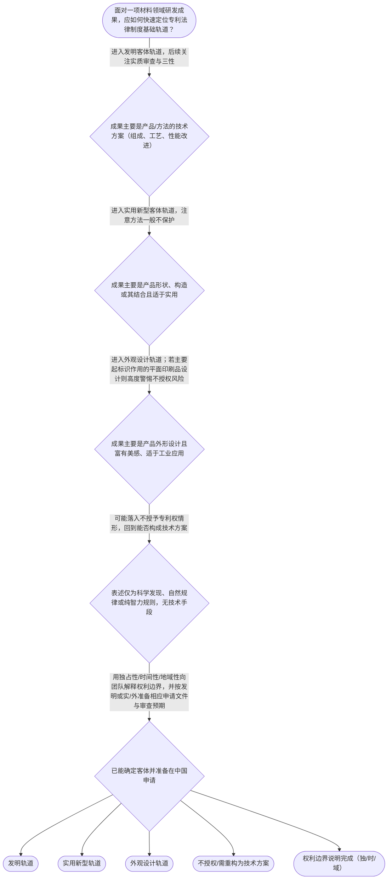

# 专家 B 教学草稿

> 专家：expert_b ｜ 风格：accessible

## 教学模块选择清单

- 当前教学节点：`patent-law-foundation`
- 板块预算：自适应 6/6，总计 9/9

| # | 模块 (block_type) | 类型 | 触发原因 (trigger) | 对应正文段 | 归属 |
|---:|---|:--:|---|---|:--:|
| 1 | `anchor_scenario` | 自适应 | perception=sensing(0.88) / cold_start | 材料实验室里的三个灵魂拷问｜材料所项目组刚跑通高导热陶瓷基板配方与烧结工艺。组长想报发明，结构工程师觉得陶瓷盖板的卡扣结… | [B] |
| 2 | `legal_anchor` | 必选 | mandatory | 法条锚：客体、文件、初审与边界｜《专利法》第二条（发明、实用新型、外观设计） | [B] |
| 3 | `worked_example` | 自适应 | cognition.analyze=0.29<0.3 / cold_start | 案例演示：陶瓷基板项目如何“归仓”｜甲公司研发：（1）一种提高热导率的陶瓷基板组成与烧结方法；（2）基板边缘用于装配的卡扣结构；… | [B] |
| 4 | `decision_flow` | 自适应 | input=visual(0.81) | 决策流：一项材料成果先走哪条制度轨道｜面对一项材料领域研发成果，应如何快速定位专利法律制度基础轨道？ | [B] |
| 5 | `mnemonic` | 自适应 | understanding=sequential(0.76) | 口诀：独时域 · 法则指 · 发实外｜三字三段：权-独时域；书-法则指；物-发实外；审-初实并存 | [B] |
| 6 | `reflect_prompt` | 自适应 | processing=reflective(0.69) | 反思：你的材料项目说明书该先写清什么｜结合你正在做或熟悉的材料课题，如果明天要向代理人交接，你如何用‘客体+三特征+规范三层’三句… | [B] |
| 7 | `assessment` | 必选 | mandatory | 三类测评入口｜专利权三特征识记 | [B] |
| 8 | `knowledge_synthesis` | 必选 | mandatory | 知识综合：制度地基一张图｜权利特征：独占性（排他）、时间性（有期限）、地域性（法域效力） | [B] |
| 9 | `summary_card` | 自适应 | len(knowledge_sub_nodes)=3>=3 | 速查卡：专利法律制度基础｜先分清保护什么、权利边界与规则书层级，再谈材料专利的新颖性与创造性细判。 | [B] |

## 教学正文

## 1. 场景导入

你在材料所带一组研发：刚做出一种高导热陶瓷基板配方，同事催着“赶紧报专利”，市场部又说下个月要在国内行业展上放样品。会议室里同时甩出三句话——“这算发明还是实用新型？”“展了还能不能申请？”“专利到底管几年、管哪国？”

先别急着跳到新颖性、创造性细则。材料领域后面所有审查争论，都先落在同一块地基上：什么是专利、保护什么、权利有什么边界、中国用哪几本“规则书”在审。把地基立住，后面看现有技术、抵触申请和三步法才不会串台。

## 2. 人话解释

把专利想成国家发给你的“有期限、有地盘的独占通行证”：

- **独占性**：未经许可，别人原则上不能为生产经营目的实施你的专利技术方案（制造、使用、许诺销售、销售、进口等，具体以权利类型为准）。
- **时间性**：保护不是永久会员——发明、实用新型、外观设计各有法定期限，到期权利终止，技术进入公有领域。
- **地域性**：中国专利主要在中国法域内发生效力；要在别国获得保护，通常还要按该国/地区途径去申请或进入。

中国专利制度像“三层规范楼”：
1. **专利法**——全国人大常委会制定的主干规则（能不能保护、三性、申请与保护框架）；
2. **专利法实施细则**——配套程序与操作细则（怎么交文件、初步审查看什么等）；
3. **专利审查指南**——审查员与代理人共用的审查操作手册（新颖性单独对比、创造性整体评价等具体判法，多在后续节点展开）。

保护客体只有三条赛道（专利法第2条）：
- **发明**：产品、方法或其改进的新的技术方案；
- **实用新型**：产品的形状、构造或其结合的适于实用的新的技术方案（不保护方法）；
- **外观设计**：产品的整体或局部外形设计方案（富有美感并适于工业应用）。

制度要干四件事：激励创造、换取公开、推动应用、服务经济发展。中国审查结构的特点是：**发明走早期公开、请求实质审查**；**实用新型与外观设计以初步审查为主**——“初步审查制与实质审查制并存”。初步审查重点看文件齐不齐、格式对不对，以及是否明显属于不授权情形等。〔RAG: 中华人民共和国专利法实施细则.txt — 第五十条：专利法第三十四条和第四十条所称初步审查，是指审查专利申请是否具备专利法第二十六条或者第二十七条规定的文件和其他必要的文件，这些文件是否符合规定的格式，并审查下列各项……〕

材料研发里常见“踩线”提醒（仍属基础边界，不是本节深讲三性）：科学发现本身、单纯智力活动规则、疾病诊治方法等，属于不授予专利权的对象清单。〔RAG: 中华人民共和国专利法.txt — 第二十五条：对下列各项，不授予专利权：（一）科学发现；（二）智力活动的规则和方法；（三）疾病的诊断和治疗方法……〕展会首次展出等特定公开，可能落入六个月不丧失新颖性宽限期，但宽限期只是“特定公开的时间豁免”，不是免去后续实质条件。〔RAG: 中华人民共和国专利法.txt — 第二十四条：申请专利的发明创造在申请日以前六个月内，有下列情形之一的，不丧失新颖性……（二）在中国政府主办或者承认的国际展览会上首次展出的……〕

## 3. 法条回扣

- **客体三分法**：发明 / 实用新型 / 外观设计的法定定义在专利法第2条——材料配方与工艺路线通常走发明；有形状构造的器件结构可考虑实用新型；纯外观美感方案走外观设计。
- **申请文件底线**：发明或实用新型应提交请求书、说明书及其摘要和权利要求书等。说明书须清楚、完整，以所属技术领域的技术人员能够实现为准。〔RAG: 中华人民共和国专利法.txt — 第二十六条：申请发明或者实用新型专利的，应当提交请求书、说明书及其摘要和权利要求书等文件……说明书应当对发明或者实用新型作出清楚、完整的说明，以所属技术领域的技术人员能够实现为准〕
- **程序分流信号**：初步审查与授权相关条款在实施细则第50条展开，对应专利法关于发明早期公开与实用新型/外观设计审查授权的制度安排。〔RAG: 中华人民共和国专利法实施细则.txt — 第五十条……〕
- **后续节点预告（不在本节展开讲授）**：新颖性判断强调“同样的发明创造”与**单独对比**，不得拿多篇对比文件“拼凑”来评新颖性；创造性则针对权利要求技术方案**整体**评价。〔RAG: 专利法专题讲座.txt — 判断新颖性时，应当将发明或者实用新型专利申请的各项权利要求分别与每一项现有技术或申请在先公布或公告在后的发明或实用新型的相关技术内容单独地进行比较，不得将其与几项现有技术……的组合进行对比〕〔RAG: 专利法专题讲座.txt — 创造性的判断，应当针对权利要求限定的技术方案整体进行评价，即评价技术方案是否具备创造性，而不是评价某一技术特征是否具备创造性〕

## 4. 类比 / 口诀

**类比（有边界）**：专利像“有期限的地块产权证”——
- 独占性 ≈ 你有权排除他人擅自在你的地块上经营；
- 时间性 ≈ 产权有年限，到期收归“公地”；
- 地域性 ≈ 中国证主要管中国地界，不管自动覆盖全球。

**边界说明**：物权类比便于记三特征，但专利是**非物质的技术方案/设计**上的排他权，侵权判断、无效程序、权利要求解释都不能按“实物地契”硬套。

**口诀**：权属三性——**独、时、域**；规范三层——**法、则、指**；客体三道——**发、实、外**；审查双轨——**初审常在、实审发明**。

## 5. 应试提示

题干关键词与判断步骤：
1. 看见“保护多久/哪国有效/能否禁止他人”→先答**时间性/地域性/独占性**，别跳到三性细节。
2. 看见“配方/工艺/方法”→优先**发明**；“产品形状构造”→可**实用新型**；“外观美感”→**外观设计**；方法一般不能用实用新型保护。
3. 看见“审查指南怎么写的”→它是审查操作依据，位阶上配合专利法与实施细则，不是替代法律。
4. 看见“早期公开、延迟/请求审查”→对应**发明**程序特点；实用新型、外观设计侧重**初步审查**。
5. 常见陷阱：把“科学发现/自然规律表述”当成可授权发明；把“中国专利”当成全球自动保护；把宽限期当成“公开了也一定能授权”。

## 6. 互动提问

先用材料研发场景自问三句（不必在正文作答）：我的技术方案落在哪类客体？我的权利边界是独/时/域哪一条最容易被市场部误解？下一步若进入申请程序，我应先准备哪些法定文件？

本节设有测评，请到【习题】区作答。

### 材料实验室里的三个灵魂拷问（anchor_scenario）

> 材料所项目组刚跑通高导热陶瓷基板配方与烧结工艺。组长想报发明，结构工程师觉得陶瓷盖板的卡扣结构也能报实用新型，设计同事则拿着外观纹理问能不能一起写进同一件专利。市场部通知下月国内展会要放样。会议室白板上写满问题：这到底保护什么？专利能管几年、管到哪国？展了还有没有机会？大家争的不是检索报告细节，而是专利制度最底层的规则地图还没对齐。

**锚定**：用同一材料研发事实同时锚定客体三分、权利三特征与中国规范体系，为后续新颖性/创造性学习铺地基。

**先想一想**：如果只能先回答一个问题，你会先分清‘保护客体’还是先算‘展会会不会毁掉申请’？为什么？

### 法条锚：客体、文件、初审与边界（legal_anchor）

- **《专利法》第二条（发明、实用新型、外观设计）**：第二条把可保护对象分成发明、实用新型、外观设计三条赛道，材料方法/配方多走发明，结构构造可走实用新型，外形设计走外观。
- **《专利法》第二十四条（不丧失新颖性情形）**：第二十四条给出申请日前六个月内特定公开可不丧失新颖性的清单，包括政府主办或承认的国际展会首次展出等。
- **《专利法》第二十五条（不授予专利权的情形）**：第二十五条列出科学发现、智力活动规则方法、疾病诊治方法等不授予专利权的对象。
- **《专利法》第二十六条（申请文件与说明书要求）**：第二十六条规定发明/实用新型要交请求书、说明书及摘要、权利要求书，说明书须清楚完整可实现。
- **《专利法实施细则》第五十条（初步审查）**：实施细则第五十条解释初步审查：查文件与格式，并筛查是否明显属于不授权等情形。

**为何重要**：本节点是全部审查规则的入口：客体不对、规范层级不清、权利特征混淆，后面新颖性单独对比和创造性三步法都会判断错位。材料学员必须先把‘能申请什么、按哪本书审、权利边界在哪’立住。

### 案例演示：陶瓷基板项目如何“归仓”（worked_example）

**案情/例题**：甲公司研发：（1）一种提高热导率的陶瓷基板组成与烧结方法；（2）基板边缘用于装配的卡扣结构；（3）仅用于品牌识别的平面印花图案。公司只在中国运营，计划先在国内申请。问：三类成果分别更适合什么保护路径？权利大概呈现哪些基础特征？
**适用规则**：《专利法》第二条（客体）；专利权独占性/时间性/地域性；《专利法》第二十五条（不授权对象边界）；《专利法》第二十六条（发明/实用新型文件）。
**分步推演**：
1. 组成与烧结方法属于产品/方法技术方案，不是单纯科学发现表述，落入发明常见保护类型；方法一般不能用实用新型保护。 → *成果（1）→优先发明路径*
2. 卡扣结构是产品形状/构造或其结合，若具备实用性技术方案属性，可评估实用新型（也可与发明策略组合，但基础归类先认结构方案）。 → *成果（2）→实用新型候选*
3. 主要起标识作用的平面印花，可能触及不授予外观设计专利权的标识性设计边界，不能想当然塞进发明权利要求‘凑保护’。 → *成果（3）→外观/标识风险，需单独谨慎判断*
4. 即便授权，权利有法定期限，且主要在中国法域内主张；不能假设‘中国证书=全球通行证’。 → *套用时间性与地域性*
**结论**：先按客体三分法分案/分策略，再谈后续三性与程序；标识性平面设计与方法发明不可混为一谈。
**本题要点**：材料项目落地的第一步是‘归仓’：发/实/外分流 + 独时域边界，而不是先堆对比文件。

### 决策流：一项材料成果先走哪条制度轨道（decision_flow）

**决策问题**：面对一项材料领域研发成果，应如何快速定位专利法律制度基础轨道？



### 口诀：独时域 · 法则指 · 发实外（mnemonic）

**记忆锚**：三字三段：权-独时域；书-法则指；物-发实外；审-初实并存
**映射**：
- 独
- 时
- 域
- 法
- 则
- 指
- 发
- 实
- 外
- 初实并存
**何时用**：选择题出现‘专利特征/规范渊源/保护类型/审查制度特点’时，先默写这四段再排除干扰项。

### 反思：你的材料项目说明书该先写清什么（reflect_prompt）

**反思问题**：结合你正在做或熟悉的材料课题，如果明天要向代理人交接，你如何用‘客体+三特征+规范三层’三句话讲清项目？

**关注要点**：你是否把科学发现表述误当成发明技术方案；方法贡献有没有被错误塞进实用新型思路；向领导解释权利时有没有承诺‘全球永久独占’这类违反时间性/地域性的表述

**连接**：连接到已掌握的专利法律制度基础，并为下一节点‘专利申请程序’中的文件与申请日规则预留接口

### 知识综合：制度地基一张图（knowledge_synthesis）

**知识框架**：
- 权利特征：独占性（排他）、时间性（有期限）、地域性（法域效力）
- 规范体系：专利法（主干）→实施细则（程序细化）→审查指南（操作判法）
- 保护客体：发明（产品/方法方案）、实用新型（形状构造产品方案）、外观设计（外形设计）
- 制度功能：激励创造、促进公开、推动应用与经济发展
- 中国特点：发明早期公开+实质审查；实用新型/外观设计初步审查为主，双轨并存
**概念关系**：先定客体与规范依据，再进入申请程序文件与日期规则；权利三特征解释‘有什么权’，授权三性解释‘能不能授权’，二者层级不同；初步审查筛明显缺陷与文件格式；实质审查深入三性，主要绑定发明路径
**必记**：三特征是权利边界常识，答题时勿与三性（新颖性/创造性/实用性）混名；客体三分决定申请类型与后续审查深度预期；规范三层不可颠倒效力直觉：指南再细也不能压过专利法；不授权对象与宽限期是基础边界提醒，详细三性判断在后续节点展开

### 速查卡：专利法律制度基础（summary_card）

**要点卡**：
- **独占性**：依法排他，他人擅自实施受限制
- **时间性**：保护有法定期限，到期进入公有领域
- **地域性**：效力主要及于授权国家/地区
- **规范三层**：专利法—实施细则—审查指南
- **客体三分**：发明/实用新型/外观设计
- **审查双轨**：发明重实质审查，实外重初步审查
**必背**：权：独、时、域；书：法、则、指；物：发、实、外；发明早期公开延迟/请求实审；初审与实审并存
**一句话总结**：先分清保护什么、权利边界与规则书层级，再谈材料专利的新颖性与创造性细判。

### 三类测评入口（assessment）

**三类覆盖**：backward_review、forward_probe、weakness_probe
**题目**：
- q_br_l1_01：专利权三特征识记
- q_fp_l1_02：发明/实用新型申请文件构成（向前探测）
- q_wp_l3_03：材料多成果客体分流与不授权边界
- q_wp_l3_04：法/则/指体系与初审实审结构辨析


## 结构化字段

## knowledge_points

```json
[
  {
    "node_id": "patent-law-foundation",
    "kc_name": "专利法律制度基础总览"
  },
  {
    "node_id": "patent-law-foundation",
    "kc_name": "专利制度的基本概念与特征：独占性、时间性、地域性"
  },
  {
    "node_id": "patent-law-foundation",
    "kc_name": "中国专利制度体系：专利法、实施细则、审查指南"
  },
  {
    "node_id": "patent-law-foundation",
    "kc_name": "专利保护三种客体、制度作用与发展特点"
  }
]
```

## legal_basis

```json
[
  {
    "article": "《专利法》第二条（发明、实用新型、外观设计的定义）",
    "source": "教学节点知识要点与专利法体系常识；检索上下文未直接给出第二条全文，表述以法条标准定义为准"
  },
  {
    "article": "《专利法》第二十四条（不丧失新颖性的宽限期情形）",
    "source": "中华人民共和国专利法.txt"
  },
  {
    "article": "《专利法》第二十五条（不授予专利权的情形）",
    "source": "中华人民共和国专利法.txt"
  },
  {
    "article": "《专利法》第二十六条（发明/实用新型申请文件）",
    "source": "中华人民共和国专利法.txt"
  },
  {
    "article": "《专利法实施细则》第五十条（初步审查的含义与审查事项）",
    "source": "中华人民共和国专利法实施细则.txt"
  }
]
```

## risks

```json
[
  {
    "risk": "学员目标指向材料领域新颖性/创造性，若过早深讲三步法与抵触申请，可能偏离本节点‘制度地基’，造成知识点越界。",
    "related_node_id": "patent-law-foundation"
  },
  {
    "risk": "将专利‘独占性’类比为所有权时，忽略权利要求范围、无效与侵权抗辩，导致对权利边界过度绝对化理解。",
    "related_node_id": "patent-rights-nature"
  },
  {
    "risk": "混淆发明实质审查与实用新型/外观设计初步审查，误以为所有专利类型授权前都完成同样深度的三性检索评述。",
    "related_node_id": "patent-system-overview"
  },
  {
    "risk": "把宽限期理解成‘公开后仍必然可授权’，忽略其仅豁免特定公开且仍须满足其他授权条件。",
    "related_node_id": "grace-period"
  }
]
```

## draft_stage

```json
"debate"
```

## irac

```json
{
  "issue": "材料团队在申请前需先厘清：专利制度保护什么、权利有何特征、中国依据哪些规范审查，以及发明/实用新型/外观设计如何分流。",
  "rule": "专利权具有独占性、时间性、地域性；中国以专利法、实施细则、审查指南构成制度体系；专利法第2条划分三种保护客体；发明与实用新型/外观设计在公开与审查深度上采用不同制度安排；不授权对象与宽限期分别见专利法第25条、第24条。",
  "application": "高导热陶瓷基板配方与制备工艺属于技术方案，通常走发明；若同时存在可保护的结构件形状构造，可另行评估实用新型；纯外观包装另案外观设计。团队须在中国法域理解权利范围与期限，并按发明程序准备说明书与权利要求等文件，同时识别展会公开是否可能触发宽限期讨论。",
  "conclusion": "进入新颖性、创造性细判之前，必须先完成客体归类、三特征边界与规范层级定位；本节点掌握标准是能稳定区分‘发/实/外’、‘法/则/指’与‘独/时/域’，并为申请程序节点做好接口。"
}
```

## interactive_questions

```json
[
  {
    "qid": "q_br_l1_01",
    "category": "remember",
    "difficulty": "L1",
    "source_tag": "backward_review",
    "kc_node_id": "patent-law-foundation",
    "question": "关于专利权的基本特征，下列表述正确的是？",
    "answer": "B",
    "options": [
      "A. 专利权没有法定期限，可永久续展",
      "B. 专利权具有独占性、时间性和地域性",
      "C. 中国发明专利授权后自动在所有巴黎公约成员国生效",
      "D. 地域性意味着只能在申请人所在省市内主张权利"
    ]
  },
  {
    "qid": "q_fp_l1_02",
    "category": "understand",
    "difficulty": "L1",
    "source_tag": "forward_probe",
    "kc_node_id": "patent-application-process",
    "question": "（向前探测，不判定该节点完成）申请发明或者实用新型专利时，依法应当提交的文件通常包括？",
    "answer": "C",
    "options": [
      "A. 仅提交请求书即可启动实质审查",
      "B. 只需提交产品照片和收费票据",
      "C. 请求书、说明书及其摘要和权利要求书等文件",
      "D. 必须先提交无效宣告请求书"
    ]
  },
  {
    "qid": "q_wp_l3_03",
    "category": "analyze",
    "difficulty": "L3",
    "source_tag": "weakness_probe",
    "kc_node_id": "patent-law-foundation",
    "question": "材料团队完成一种陶瓷基板制备方法，并设计了独特的基板外观纹理用于品牌识别。下列判断哪一项最符合专利法律制度基础？",
    "answer": "D",
    "options": [
      "A. 制备方法应申请实用新型，外观纹理应申请发明",
      "B. 中国专利授权后，在美国市场可直接以同一专利号维权",
      "C. 只要属于技术方案，科学发现本身也可直接授予发明专利权",
      "D. 制备方法通常可考虑发明保护；主要起标识作用的平面设计可能落入不授予专利权或不适宜作为发明/实用新型保护的情形，外观类保护需按外观设计规则单独判断"
    ]
  },
  {
    "qid": "q_wp_l3_04",
    "category": "evaluate",
    "difficulty": "L3",
    "source_tag": "weakness_probe",
    "kc_node_id": "patent-law-foundation",
    "question": "关于中国专利制度体系与审查结构，下列哪一理解最为准确？",
    "answer": "A",
    "options": [
      "A. 专利法提供主干规则，实施细则细化程序，审查指南给出审查操作指引；发明与实用新型/外观设计在是否以实质审查为授权主路径上存在制度差异",
      "B. 审查指南效力高于专利法，冲突时以指南为准",
      "C. 所有专利类型均必须经过与发明完全相同的实质审查后才能授权",
      "D. 实施细则只规范费用，不涉及初步审查内容"
    ]
  }
]
```

## knowledge_synthesis

```json
{
  "node": "patent-law-foundation",
  "coverage": [
    {
      "node_id": "patent-law-foundation"
    },
    {
      "node_id": "patent-rights-nature"
    },
    {
      "node_id": "patent-law-framework"
    },
    {
      "node_id": "patent-system-overview"
    }
  ],
  "confusable_pairs": [
    {
      "pair": "专利权三特征（独占性/时间性/地域性） vs 授权三性（新颖性/创造性/实用性）"
    },
    {
      "pair": "发明实质审查 vs 实用新型/外观设计初步审查"
    },
    {
      "pair": "技术方案（可专利客体） vs 科学发现/纯规则（不授予专利权）"
    },
    {
      "pair": "专利法效力位阶 vs 审查指南操作指引"
    }
  ]
}
```
