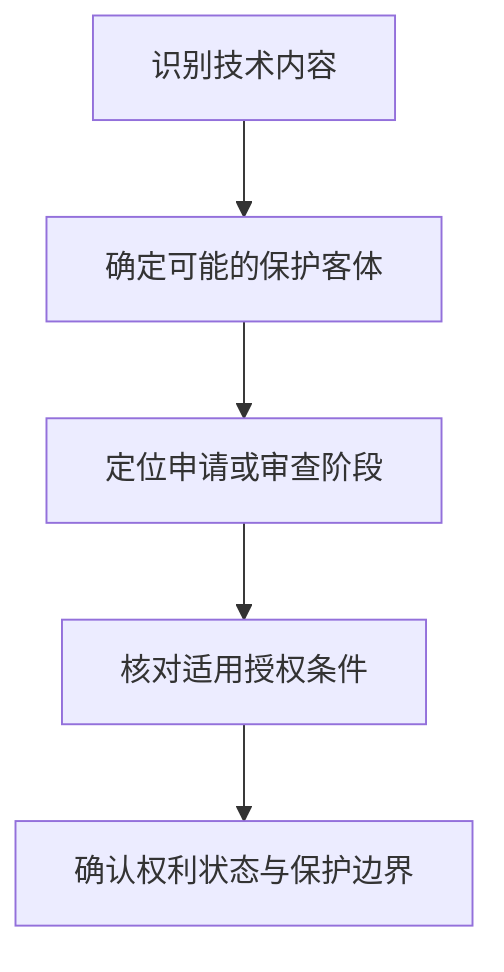

# 专家 A 教学草稿

> 专家：expert_a ｜ 风格：conservative

## 教学模块选择清单

- 当前教学节点：`patent-law-foundation`
- 板块预算：自适应 4/4，总计 7/7

| # | 模块 (block_type) | 类型 | 触发原因 (trigger) | 对应正文段 | 归属 |
|---:|---|:--:|---|---|:--:|
| 1 | `anchor_scenario` | 自适应 | perception=sensing(0.70) / cold_start | 智能制造方案进入专利制度的第一步｜【教学情境，非检索到的真实案例】某智能制造企业研发出一套机器人装配单元：机械臂负责抓取，视觉… | [A+B融合] |
| 2 | `legal_anchor` | 必选 | mandatory | 专利制度基础的法条锚定｜《专利法》第二条 | [A] |
| 3 | `worked_example` | 自适应 | cold_start(low_confidence) | 从机器人系统事实到制度定位｜【教学示例，非真实裁判案例】某智能制造企业提交一项申请，文件中同时描述机器人本体的机械连接结… | [A] |
| 4 | `mnemonic` | 自适应 | understanding=sequential(0.66) | 专利基础四问表｜专利基础四问表：客体—阶段—条件—效力。每遇到一个专利问题，按这四栏依次记录，不把前一栏的答… | [A] |
| 5 | `assessment` | 必选 | mandatory | 专利制度基础三类测评｜识别中国专利法规定的三类专利保护客体。 | [A] |
| 6 | `knowledge_synthesis` | 必选 | mandatory | 专利法律制度基础关系网｜专利制度基本概念与特征：专利权是一种有边界的法定权利，分析时要分别关注独占性、时间性和地域性… | [A] |
| 7 | `summary_card` | 自适应 | len(knowledge_sub_nodes)=3>=3 | 专利制度基础速查卡｜先辨客体与阶段，再谈授权条件和权利效力；专利制度以有限排他权促进技术公开与应用。 | [A] |

## 教学正文

## I — 法律问题

本节只处理“专利法律制度基础”这一主节点：面对智能制造领域的技术方案，如何识别专利保护客体、理解专利制度的基本特征和功能，并区分申请、审查、公布与授权阶段。新颖性、创造性、优先权和侵权判定属于后续节点，本节只说明其制度入口，不提前作实体判断。

## R — 适用规则

### 1. 专利保护客体

本节知识点将专利保护客体分为发明、实用新型和外观设计，依据指向《专利法》第二条；但本次检索上下文没有提供该条原文，因此具体法条表述应以正式法律文本核验。对智能制造方案，不能只看行业名称，而要看其具体技术内容：机械结构、控制方法和产品外观可能对应不同的制度分析路径。

### 2. 专利制度体系

中国专利制度以专利法为基本法律，并由专利法实施细则细化程序，由专利审查指南提供审查操作层面的规则。三者的功能不同：专利法确定基本权利和条件，实施细则安排程序，审查指南进一步说明审查方法。因而，处理一个专利问题时，应先找法律依据，再确认程序规则和审查操作要求。

### 3. 专利制度的基本特征与作用

专利权的独占性、时间性和地域性应当结合起来理解。独占性表示在法定保护范围内具有排他效果；时间性表示保护不是无限期存在；地域性表示保护效果依赖具体法域。专利制度以一定期限和范围的法律保护激励发明创造，同时通过申请文件公开促进技术传播和应用。上述制度功能是基础性解释，本次检索上下文未提供相应的直接法条原文，不应将其误写成某一条文的逐字表述。

### 4. 审查程序的基本区分

《专利法实施细则》第五十条规定，初步审查是审查专利申请是否具备规定的文件和其他必要文件、文件是否符合规定格式，并审查列明的明显缺陷事项。〔RAG: 中华人民共和国专利法实施细则.txt — 第五十条：初步审查是审查专利申请是否具备规定文件和其他必要文件、文件是否符合规定格式，并审查列明事项〕

检索材料还显示，发明申请经初步审查后，除予以驳回的外，应当立即予以公布。〔RAG: 中华人民共和国专利法实施细则.txt — 申请经初步审查后，除予以驳回的外，应当立即将申请予以公布〕检索材料同时说明，实用新型和外观设计申请实行初步审查制，授权前不进行与发明相同的全面实质性授权条件审查；因此，相关专利权的稳定性问题需要结合权利评价报告等制度继续分析。〔RAG: 专利法律知识详细解读.txt — 实用新型、外观设计申请进行初步审查，授权前未对其实质性授权条件进行审查；权利评价报告可对可专利性进行检索、分析和评价〕

## A — 规则适用

对智能制造领域的机器人装配单元，第一步不是立即判断新颖性或侵权，而是拆分技术事实：机器人机械连接结构、视觉检测控制方法和产品外观属于不同性质的技术内容，可能需要分别对应不同的专利客体和申请文件。

第二步是定位程序阶段。企业“提交了申请”只说明启动了申请程序；“通过初步审查”主要说明文件、格式及相关明显缺陷经过相应审查，不能据此直接推出全部授权条件均已确定具备。发明申请的公布也只是程序中的公开节点，不等同于已经授予专利权。

第三步才是进入后续条件和效力分析。新颖性、创造性和实用性应根据适用客体、申请文件和相应法定标准分别判断；专利侵权则应在权利已经产生且保护范围明确后，围绕被诉技术方案与权利要求等进行比对。本节不对这些后续问题作具体结论。

判断可以固定为线性流程：



## C — 结论

专利制度基础的核心不是背诵孤立术语，而是形成“客体—阶段—条件—效力”的判断顺序。对智能制造复合技术，应先识别发明、实用新型或外观设计的制度入口，再区分初步审查、公布、实质审查和授权，最后才讨论新颖性、侵权和权利保护范围。当前检索上下文没有提供可直接核验的智能制造真实裁判案例，因此本节不虚构真实案例；后续如取得具体裁判文书，应将案件事实、争点和裁判依据与法条分开核对。

> 常见误区 / 易混淆点
>
> 1. 把“申请日”当成“授权日”：申请启动程序，不当然产生完整专利权。
> 2. 把“初步审查通过”当成“全部实体条件已经确认”：初步审查和完整授权条件判断不能混同。
> 3. 把“智能制造”这个行业标签当成专利类型：应根据具体技术内容识别客体。
> 4. 把新颖性、创造性和侵权判定放在同一个问题中直接处理：它们的判断对象、时间基准和法律后果不同。

本节设有测评，请到【习题】区作答。

### 智能制造方案进入专利制度的第一步（anchor_scenario）

> 【教学情境，非检索到的真实案例】某智能制造企业研发出一套机器人装配单元：机械臂负责抓取，视觉传感器负责定位，控制软件根据检测结果调整动作。研发负责人准备申请专利，但团队内部出现三个争议：这套方案属于哪一种专利保护客体；申请后是否就能当然获得稳定保护；以及公开技术方案、授予专利权和实际实施之间究竟是什么关系。需要先用专利制度的基本框架拆开这些问题，再进入新颖性和侵权判定。

**锚定**：用智能制造技术事实锚定保护客体、专利权制度特征、制度功能与审查程序之间的关系。

**先想一想**：在评价这套智能制造方案前，应先确认它属于什么保护客体、适用什么审查程序，以及专利权是否已经产生。

### 专利制度基础的法条锚定（legal_anchor）

- **《专利法》第二条**：第二条界定专利保护的三类客体：发明、实用新型和外观设计；本节引用的条文原文未出现在检索片段中，学习时应以正式法条核验。
- **《专利法实施细则》第五十条**：第五十条说明初步审查主要检查申请文件、格式及列明的明显缺陷，并分别规定发明和实用新型申请的审查事项。〔RAG: 中华人民共和国专利法实施细则.txt — 第五十条：初步审查是审查申请文件和其他必要文件是否符合规定，并审查列明事项〕
- **《专利法实施细则》第五十二条**：发明申请经初步审查除被驳回外应当公布；这体现了发明申请程序中公开与后续审查的衔接。〔RAG: 中华人民共和国专利法实施细则.txt — 申请经初步审查后，除予以驳回的外，应当立即将申请予以公布〕

**为何重要**：先确定保护客体和法律制度的审查入口，才能正确理解后续的新颖性、创造性和专利侵权问题。初步审查、实质审查与授权并非同一概念，混同会导致对专利稳定性和保护效力的错误判断。

### 从机器人系统事实到制度定位（worked_example）

**案情/例题**：【教学示例，非真实裁判案例】某智能制造企业提交一项申请，文件中同时描述机器人本体的机械连接结构、视觉检测控制方法和产品外观。项目负责人把全部内容统称为“一项智能制造专利”，并认为经过文件形式检查后就已经获得完整专利保护。请演示应如何拆分和定位这一问题。
**适用规则**：《专利法》第二条用于确认保护客体；《专利法实施细则》第五十条用于理解初步审查范围。关于第二条的完整原文未出现在本次检索片段中，应以正式法条核验；第五十条的审查内容以检索文本为依据。
**分步推演**：
1. 先按技术内容区分：机械结构可能涉及实用新型或发明，控制方法通常需要按发明申请的制度问题分析，产品外观属于外观设计客体的讨论范围。仅凭“智能制造”这一行业名称不能直接决定专利类型；本次检索片段未提供《专利法》第二条原文，因此具体分类表述须回到正式法条和申请文件核验。 → *第一步：从技术内容识别可能的保护客体，不从行业名称直接下结论。*
2. 再看审查入口。检索到的《专利法实施细则》第五十条表明，初步审查涉及必要文件、格式以及列明的明显缺陷；对发明和实用新型申请的审查事项并不等于对所有授权条件完成全面判断。〔RAG: 中华人民共和国专利法实施细则.txt — 第五十条：初步审查审查文件、格式及列明事项〕 → *第二步：区分文件和明显缺陷审查与完整实体条件判断。*
3. 最后分开三个法律问题：保护客体决定制度入口，审查程序决定申请如何推进，授权后的专利权范围还要以相应权利要求或外观设计图片、照片等正式文件为基础。不能把“已提交申请”“已公布”或“通过初步审查”直接替换成“已获得稳定专利权”。 → *第三步：分别判断客体、程序阶段和权利状态，避免概念跳跃。*
**结论**：该示例只能说明如何依次识别技术方案的制度位置和审查入口，不能据此认定其已经具备新颖性、创造性或已获得专利权。具体客体认定和授权结论仍须结合申请文件、权利要求及正式审查依据。
**本题要点**：面对智能制造复合技术，先拆分保护客体，再定位审查阶段，最后才讨论授权条件和权利保护。

### 专利基础四问表（mnemonic）

**记忆锚**：专利基础四问表：客体—阶段—条件—效力。每遇到一个专利问题，按这四栏依次记录，不把前一栏的答案代替后一栏。
**映射**：
- 客体
- 阶段
- 条件
- 效力
**何时用**：阅读智能制造研发合同、专利申请文件或侵权争议材料时，先在纸上写出“客体—阶段—条件—效力”四栏，再开始分析。

### 专利法律制度基础关系网（knowledge_synthesis）

**知识框架**：
- 专利制度基本概念与特征：专利权是一种有边界的法定权利，分析时要分别关注独占性、时间性和地域性；具体法律依据需结合正式法条核验。
- 中国专利制度体系：以专利法为核心，并由专利法实施细则和专利审查指南共同支撑申请、审查和权利运行。
- 三类保护客体：发明、实用新型和外观设计构成专利制度的基本客体分类；《专利法》第二条原文未在本次检索片段中提供。
- 专利制度作用：通过授予一定期限和范围的权利激励发明创造，并以公开和应用促进技术传播与经济发展；本次检索上下文未提供该作用的直接法条原文。
- 审查制度与发展特点：发明申请存在公布及实质审查程序；实用新型和外观设计实行初步审查制，检索材料说明其授权前不进行与发明相同的全面实质审查。〔RAG: 专利法律知识详细解读.txt — 实用新型、外观设计申请进行初步审查，授权前未对其实质性授权条件进行审查〕
**概念关系**：先以保护客体确定制度入口，再按专利类型识别适用的申请与审查程序。；初步审查关注文件、格式及明显缺陷；发明申请的公布和后续实质审查应与初步审查区分。〔RAG: 中华人民共和国专利法实施细则.txt — 第五十条；申请经初步审查后除驳回外予以公布〕；专利权的时间性、地域性和独占性共同限定保护边界，不能把技术公开、申请提交和专利授权视为同一法律事件。
**必记**：专利制度基础分析的顺序是先识别客体，再确认程序阶段，最后判断授权条件与权利效力。；发明、实用新型和外观设计的审查制度并不完全相同；初步审查不等于完成全部授权条件审查。；专利制度的独占性必须与时间性、地域性结合理解，不能理解为无期限、无地域限制的绝对垄断。

### 专利制度基础速查卡（summary_card）

**要点卡**：
- **三类保护客体**：先区分发明、实用新型和外观设计，再确定适用的制度入口；《专利法》第二条原文须以正式文本核验。
- **三项制度特征**：独占性说明权利排他，时间性说明有期限，地域性说明保护有法域边界。
- **制度体系**：专利法定基本规则，实施细则细化程序，审查指南提供审查操作标准。
- **审查阶段**：申请、初步审查、公布、实质审查和授权是不同阶段，不能互相替代。
- **制度功能**：以有限排他权换取技术公开，并促进发明创造、技术应用和经济发展。
**必背**：专利基础四问：客体—阶段—条件—效力。；初步审查重点涉及必要文件、格式和列明的明显缺陷；它不当然等于完整实体授权审查。〔RAG: 中华人民共和国专利法实施细则.txt — 第五十条〕；发明、实用新型、外观设计的保护对象和审查程序存在差异。；申请提交、申请公布与专利授权是三个不同法律事件。
**一句话总结**：先辨客体与阶段，再谈授权条件和权利效力；专利制度以有限排他权促进技术公开与应用。

### 专利制度基础三类测评（assessment）

**三类覆盖**：backward_review、forward_probe、weakness_probe
**题目**：
- q_backward_1：识别中国专利法规定的三类专利保护客体。
- q_forward_1：初步探测专利权保护范围的基本判断对象。
- q_weakness_1：区分保护客体、初步审查与完整授权判断，避免制度阶段混同。


## 结构化字段

## knowledge_points

```json
[
  {
    "node_id": "patent-law-foundation",
    "kc_name": "专利制度的基本概念与特征：独占性、时间性、地域性（详见子节点 patent-rights-nature）"
  },
  {
    "node_id": "patent-law-foundation",
    "kc_name": "中国专利制度体系：专利法、专利法实施细则、专利审查指南（详见子节点 patent-law-framework）"
  },
  {
    "node_id": "patent-law-foundation",
    "kc_name": "专利保护的三种客体：发明、实用新型、外观设计（专利法第2条）"
  },
  {
    "node_id": "patent-law-foundation",
    "kc_name": "专利制度的作用：激励发明创造、促进技术公开、推动技术应用和经济发展（详见子节点 patent-system-overview）"
  },
  {
    "node_id": "patent-law-foundation",
    "kc_name": "中国专利制度发展历程与特点：早期公开延迟审查、初步审查制与实质审查制并存（详见子节点 patent-system-overview）"
  }
]
```

## legal_basis

```json
[
  {
    "article": "《专利法》第二条",
    "source": "《中华人民共和国专利法.txt》（本次检索上下文未提供第二条原文，需以正式文本核验）"
  },
  {
    "article": "《专利法实施细则》第五十条",
    "source": "《中华人民共和国专利法实施细则.txt》：第五十条"
  },
  {
    "article": "《专利法实施细则》第五十二条",
    "source": "《中华人民共和国专利法实施细则.txt》：申请经初步审查后，除予以驳回的外，应当立即将申请予以公布"
  }
]
```

## risks

```json
[
  {
    "risk": "当前检索上下文未提供足以完整讲授新颖性判断、抵触申请、现有技术或优先权时间轴的直接法条与案例依据，本稿仅将其作为后续节点入口，不作实体结论。",
    "related_node_id": "novelty"
  },
  {
    "risk": "《专利法》第二条原文未出现在本次检索片段中，三类保护客体的具体法条文字应在正式文本中复核。",
    "related_node_id": "patent-law-foundation"
  },
  {
    "risk": "申请提交、公布、初步审查和授权的法律效果不同，不能将任何一个程序节点直接等同于完整专利权保护。",
    "related_node_id": "patent-rights-protection"
  }
]
```

## draft_stage

```json
"debate"
```

## irac

```json
{
  "issue": "在智能制造技术申请中，如何识别专利制度的基本保护客体、制度特征和审查阶段，避免把申请、审查、授权及权利效力混为一谈？",
  "rule": "《专利法》第二条规定专利保护客体的基本分类，但本次检索上下文未提供该条原文，具体文字须以正式法条核验。专利制度还具有独占性、时间性和地域性；专利法、专利法实施细则与专利审查指南共同构成制度运行框架。《专利法实施细则》第五十条规定，初步审查涉及必要文件、格式及列明的明显缺陷；检索材料还表明发明申请经初步审查后除被驳回外予以公布。〔RAG: 中华人民共和国专利法实施细则.txt — 第五十条〕〔RAG: 中华人民共和国专利法实施细则.txt — 申请经初步审查后，除予以驳回的外，应当立即将申请予以公布〕",
  "application": "对智能制造复合技术，应先按技术内容识别可能涉及的发明、实用新型或外观设计客体，再确认处于申请、初步审查、公布、实质审查或授权阶段。检索材料显示，初步审查包括必要文件、格式及列明的明显缺陷审查；实用新型和外观设计实行初步审查制，不能仅因通过初步审查就认定全部实体授权条件已经确定。〔RAG: 中华人民共和国专利法实施细则.txt — 第五十条；专利法律知识详细解读.txt — 实用新型、外观设计申请进行初步审查〕",
  "conclusion": "专利法律制度基础的正确判断顺序是先识别保护客体，再区分程序阶段，最后分析授权条件和专利权效力。申请提交、申请公布、通过初步审查与获得稳定专利权并非同一法律事件。"
}
```

## interactive_questions

```json
[
  {
    "qid": "q_backward_1",
    "category": "remember",
    "difficulty": "L1",
    "source_tag": "backward_review",
    "kc_node_id": "patent-law-foundation",
    "question": "中国专利法所规定的专利保护客体包括哪三类？",
    "answer": "A",
    "options": [
      "A. 发明、实用新型、外观设计",
      "B. 发明、商业秘密、集成电路布图设计",
      "C. 实用新型、植物新品种、商业秘密",
      "D. 外观设计、作品著作权、商业秘密"
    ]
  },
  {
    "qid": "q_forward_1",
    "category": "remember",
    "difficulty": "L1",
    "source_tag": "forward_probe",
    "kc_node_id": "patent-rights-protection",
    "question": "关于专利权保护范围，下列哪项表述正确？",
    "answer": "A",
    "options": [
      "A. 发明和实用新型的保护范围原则上以权利要求的内容为准",
      "B. 申请文件提交后即可当然产生与授权专利相同的完整专利权",
      "C. 外观设计的保护范围原则上只由产品名称决定",
      "D. 专利权一经授权即无期限、无地域限制"
    ]
  },
  {
    "qid": "q_weakness_1",
    "category": "analyze",
    "difficulty": "L3",
    "source_tag": "weakness_probe",
    "kc_node_id": "patent-law-foundation",
    "question": "某智能制造企业提交一项同时涉及机器人结构、视觉控制方法和产品外观的申请。关于分析路径，下列哪项最符合专利制度基础框架？",
    "answer": "C",
    "options": [
      "A. 只要技术用于智能制造，就当然属于发明专利并直接进入实质审查",
      "B. 申请文件通过初步审查，就表示新颖性、创造性和实用性已经全部确定具备",
      "C. 应先识别具体保护客体和所处审查阶段，再分别判断相应授权条件及权利状态",
      "D. 只要技术方案已经向客户展示，就必然已经获得专利权保护"
    ]
  }
]
```

## knowledge_synthesis

```json
{
  "node": "patent-law-foundation",
  "coverage": [
    {
      "node_id": "patent-law-foundation"
    }
  ],
  "confusable_pairs": []
}
```

## exercises

```json
[
  {
    "question": null,
    "answer": null,
    "options": null
  }
]
```
