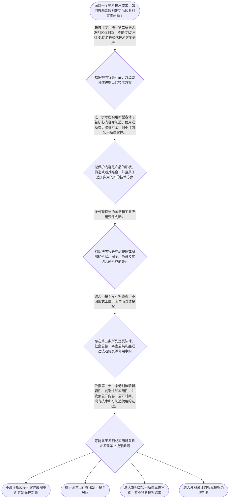

# 整合后的课程完整内容与习题

## 教学模块选择清单

- 当前教学节点：`patent-law-foundation`
- 板块预算：自适应 5/6，总计 9/9

| # | 模块 (block_type) | 类型 | 触发原因 (trigger) | 对应正文段 | 归属 |
|---:|---|:--:|---|---|:--:|
| 1 | `anchor_scenario` | 自适应 | perception=sensing(0.83) / P(L)=0.15<0.3 / affect=anxious / cold_start | 复合涂层研发的专利入口｜某材料团队研发出锂电池隔膜复合涂层：在聚烯烃基层上增加无机颗粒层和耐热粘结层，实验显示耐热性… | [A+B融合] |
| 2 | `legal_anchor` | 必选 | mandatory | 法条锚定：客体、禁止授予与三性｜《专利法》第二条 | [A+B融合] |
| 3 | `worked_example` | 自适应 | cold_start(low_confidence) | 案例演示：复合涂层的基础审查链｜甲公司研发锂电池隔膜复合涂层，技术方案包括聚烯烃基层、无机颗粒涂层和耐热粘结层，并主张耐热性… | [A+B融合] |
| 4 | `decision_flow` | 自适应 | input=visual(0.74) | 材料成果的基础审查流程｜面对一个材料技术成果，如何按基础规则确定后续专利审查问题？ | [A+B融合] |
| 5 | `mnemonic` | 自适应 | understanding=sequential(0.68) | 四关分类表｜四关分类表：客—禁—三—证。客：先定客体；禁：再查禁止授予；三：发明和实用新型分别审查新颖性… | [A+B融合] |
| 6 | `predict_activate` | 自适应 | processing=active(0.61) | 先预测：性能提升说明什么｜研发记录显示复合涂层耐热性明显提高。你认为这条事实首先能帮助判断保护客体、新颖性、创造性还是… | [B] |
| 7 | `assessment` | 必选 | mandatory | 三类测评｜识别《专利法》第二条规定的三种基本保护客体。 | [A] |
| 8 | `knowledge_synthesis` | 必选 | mandatory | 知识综合：专利制度基础结构｜专利权基本特征：独占性、时间性、地域性用于理解权利边界；本轮未检索到其具体法律效果和期限的直… | [A+B融合] |
| 9 | `summary_card` | 自适应 | len(knowledge_sub_nodes)=3>=3 | 专利制度基础速查卡｜材料专利先定客体、再查禁止授予、后逐项核验三性，并用法条和事实支撑每个结论。 | [A+B融合] |

## 教学正文

# 材料领域专利审查的基础地图

材料研发成果进入专利制度后，不能直接从“性能是否领先”推到“能否授权”。应先建立一条稳定主线：识别拟保护的客体，排除不授予的主题，再对发明和实用新型分别进入新颖性、创造性、实用性的授权条件判断。专利法专题讲座明确提示，在实质审查中，新颖性和创造性审查之前，首先判断申请是否符合可授权对象和主题等规定〔RAG: 专利法专题讲座.txt — 一件专利申请必须属于可以授权的对象和主题；新颖性和创造性审查之前首先判断是否符合上述规定〕。

## 1. 从材料成果看三类保护客体

《专利法》第二条规定，发明创造包括发明、实用新型和外观设计。发明是对产品、方法或者其改进所提出的新的技术方案；实用新型是对产品的形状、构造或者其结合所提出的适于实用的新的技术方案；外观设计是对产品整体或者局部的形状、图案或者其结合，以及色彩与形状、图案的结合所作出的富有美感并适于工业应用的新设计〔RAG: 中华人民共和国专利法.txt — 第二条：发明、实用新型和外观设计的定义〕。

材料领域常见的配方、材料本体、复合层结构、制备工艺和用途改进，并不会因为带有“材料”标签而自动落入同一种专利类型。拟保护的是材料制备方法、产品本身或其改进时，通常先在发明客体框架下判断；拟保护的是产品的形状、构造或者其结合时，才进一步考虑实用新型；拟保护的是产品可见外观的设计表达时，才转向外观设计。实用新型只保护产品，一切方法不属于实用新型保护客体〔RAG: 专利法专题讲座.txt — 实用新型只保护产品；一切方法不属于实用新型的保护客体〕。

这里的“新的技术方案”不能只凭名称理解为“以前没人做过”。在基础客体识别中，应关注方案是否采用技术手段、解决技术问题并获得符合自然规律的技术效果；至于是否满足授权意义上的新颖性，则要按照第二十二条另行核验〔RAG: 专利法专题讲座.txt — 第2条第2款着重点并不是“新”，而是“技术方案”〕。

## 2. 客体、禁止授予与授权条件是三道不同的门

第一道门是客体：成果是否属于第二条规定的发明、实用新型或外观设计。第二道门是禁止授予：即使表面上属于技术成果，违反法律、社会公德或者妨害公共利益的发明创造不授予专利权；违反法律、行政法规规定获取或者利用遗传资源，并依赖该遗传资源完成的发明创造，同样不授予专利权〔RAG: 中华人民共和国专利法.txt — 第五条关于不授予专利权的两类情形〕。第三道门才是发明和实用新型的三性审查。

因此，“属于发明客体”不等于“可以授权”，“实验室性能良好”也不等于“三性都具备”。材料申请中的性能数据、对比实验或工艺优势，可能在后续实用性、技术效果和创造性分析中具有意义，但必须放入相应法律问题中评价。

## 3. 新颖性、创造性和实用性的基础定位

《专利法》第二十二条规定，授予专利权的发明和实用新型应当具备新颖性、创造性和实用性〔RAG: 中华人民共和国专利法.txt — 第二十二条：授予专利权的发明和实用新型，应当具备新颖性、创造性和实用性〕。

新颖性关注申请日前是否已有相同技术方案进入法定排除范围。法条规定，新颖性是该发明或者实用新型不属于现有技术，也不存在同样发明或者实用新型在申请日前提出申请、并记载于申请日后公布或者公告文件的情形；现有技术是申请日前在国内外为公众所知的技术〔RAG: 中华人民共和国专利法.txt — 第二十二条：新颖性及现有技术定义〕。

创造性不是简单地重复“没有发现完全相同的文献”。法条要求，与现有技术相比，发明具有突出的实质性特点和显著的进步，实用新型具有实质性特点和进步〔RAG: 中华人民共和国专利法.txt — 第二十二条：创造性的法定含义〕。所以，新颖性解决“是否已有相同方案”的问题；创造性进一步处理“相对现有技术是否具有法律要求的实质性特点和进步”的问题。两者不能相互替代。

实用性则是该发明或者实用新型能够制造或者使用，并且能够产生积极效果〔RAG: 中华人民共和国专利法.txt — 第二十二条：实用性的法定含义〕。能够制造、有积极效果只能支持实用性维度，不能直接证明新颖性和创造性。

## 4. 材料复合涂层的演示性适用

设想研发团队拟保护一种锂电池隔膜复合涂层：聚烯烃基层上形成无机颗粒层和耐热粘结层，并主张提升耐热性。先看权利要求拟保护的对象：若保护涂层产品、制备方法或其改进，应在发明客体框架下识别；若仅以产品形状、构造或者其结合为核心限定，才可能进一步讨论实用新型。随后，即使客体判断成立，仍应单列三性问题。

对新颖性，需要核验申请日前的公开技术内容、公开时间以及可能的相关在先申请文件；对创造性，需要以现有技术为比较基础分析技术特征及其技术进步；对实用性，需要核验能否制造或使用并产生积极效果。若未提供对比文献、公开日期、实验数据和审查指南的具体规则，就只能完成基础问题清单，不能得出该材料申请必然授权或不授权的结论。

## 5. 制度体系和权利边界

学习中国专利制度时，应区分《专利法》、专利法实施细则和专利审查指南：前者提供基本法律规则，后两者分别承载具体实施和审查适用信息，不能把不同层级材料混为同一条文。检索材料亦指出，《审查指南》对特定领域保护客体判断设有相应章节〔RAG: 专利法专题讲座.txt — 《审查指南》第二部分第九章、第十一章第2节规定特定保护客体判断〕。

独占性、时间性和地域性用于理解专利权边界：权利具有排他保护效果，受法定期间约束，并依具体法域发生效力。本轮检索上下文未提供这些特征的直接条文及具体期限规则，故不在本节作具体期限或效力结论。专利制度通过技术公开与权利激励相结合，服务发明创造、技术应用和经济发展；关于制度发展中早期公开、延迟审查、初步审查与实质审查并存的具体规则，应在后续制度与程序节点依据相应法条、细则和指南核验。

## 6. 本节收束

材料领域专利审查的基础顺序是：先看保护什么，再看是否存在不授予情形，最后对发明和实用新型分别核验新颖性、创造性和实用性。记住：客体判断不是授权结论；新颖性不是创造性；有用、能做不是三性全部成立。

本节设有测评，请到【习题】区作答。

### 复合涂层研发的专利入口（anchor_scenario）

> 某材料团队研发出锂电池隔膜复合涂层：在聚烯烃基层上增加无机颗粒层和耐热粘结层，实验显示耐热性提高。团队计划申请专利，但内部有人认为“技术效果明显，就一定有创造性”，也有人准备把制备工艺和产品结构一并写成实用新型。

代理人需要先把问题拆开：团队拟保护的是产品、方法、产品结构还是外观设计？即使属于专利客体，是否还会受到不授予情形和三性条件限制？这些基础判断决定后续检索和审查应如何展开。

**锚定**：该情境将材料成果的客体识别、授权条件和新颖性创造性区分锚定在同一研发决策中。

**先想一想**：面对复合涂层的性能提升，第一步应当先判断创造性，还是先识别拟保护的技术对象和法律客体？

### 法条锚定：客体、禁止授予与三性（legal_anchor）

- **《专利法》第二条**：第二条先回答成果能否归入发明、实用新型或外观设计，并为三类客体提供法定定义。
- **《专利法》第五条**：第五条提示：即使成果看似属于专利客体，落入违反法律、社会公德、妨害公共利益或违法遗传资源利用等法定情形，仍不授予专利权。
- **《专利法》第二十二条**：第二十二条规定发明和实用新型的授权三性：新颖性看申请日前的公开与相关在先申请，创造性看相对现有技术的实质性特点和进步，实用性看能否制造或使用并产生积极效果。

**为何重要**：这三条构成材料申请基础判断的顺序：先识别客体，再排除禁止授予情形，最后对发明和实用新型逐项审查三性。后续新颖性和创造性方法学习都以第二十二条为法条入口。

### 案例演示：复合涂层的基础审查链（worked_example）

**案情/例题**：甲公司研发锂电池隔膜复合涂层，技术方案包括聚烯烃基层、无机颗粒涂层和耐热粘结层，并主张耐热性提高。公司拟同时保护该涂层产品及其制备工艺。现有材料未提供对比文献、公开日期或完整实验数据。应如何建立基础审查判断链？
**适用规则**：《专利法》第二条用于识别发明、实用新型和外观设计客体；第五条用于筛查不授予专利权情形；第二十二条规定发明和实用新型的新颖性、创造性和实用性条件。
**分步推演**：
1. 先从拟保护对象而非“材料领域”标签出发。涂层产品及其制备工艺属于产品、方法或其改进的技术方案时，可在发明客体框架下分析；制备工艺属于方法，不能作为实用新型的保护对象。 → *第一步：依据第二条识别权利要求保护的技术对象。*
2. 再将客体判断与禁止授予判断分开。应检查是否存在第五条所列违反法律、社会公德、妨害公共利益，或者违法获取、利用遗传资源并依赖其完成等情形；题设未提供此类事实，不能自行推定存在或不存在。 → *第二步：对第五条问题保持事实和证据边界。*
3. 对可能属于发明或实用新型的部分，第二十二条要求分别审查三性。耐热性提升可与实用性或后续技术效果分析有关，但不能单独证明新颖性和创造性。 → *第三步：新颖性、创造性、实用性须分别建立判断问题。*
4. 本案没有对比文献及公开时间，无法判断是否已有相同技术方案，也无法评价相对现有技术的实质性特点和进步；没有完整可制造使用的事实资料，也不宜对实用性作终局结论。 → *第四步：证据不足时只能完成审查框架，不能宣称授权结果。*
**结论**：甲公司的方案可以先按技术对象进入发明客体分析，产品结构部分是否适合实用新型须受第二条定义限制；无论客体判断如何，仍必须筛查第五条并分别核验第二十二条三性，现有事实不足以得出最终授权结论。
**本题要点**：材料案件先拆“保护什么”和“能否授权”，再为每一项三性结论准备对应的文献、时间和技术事实。

### 材料成果的基础审查流程（decision_flow）

**决策问题**：面对一个材料技术成果，如何按基础规则确定后续专利审查问题？



### 四关分类表（mnemonic）

**记忆锚**：四关分类表：客—禁—三—证。客：先定客体；禁：再查禁止授予；三：发明和实用新型分别审查新颖性、创造性、实用性；证：每一步均回到法条和事实证据。
**映射**：
- 客
- 禁
- 三
- 证
**何时用**：阅读材料专利说明、检索报告或审查意见时，先按“客—禁—三—证”逐项标注问题，防止把性能优势直接写成授权结论。

### 先预测：性能提升说明什么（predict_activate）

**预测/激活**：研发记录显示复合涂层耐热性明显提高。你认为这条事实首先能帮助判断保护客体、新颖性、创造性还是实用性？

**激活旧知**：激活材料研发中“技术对象、技术效果、对比实验、公开文献”分别承担不同证明作用的经验。

**揭晓方向**：先把“技术方案属于什么”与“是否已被公开”“相对现有技术是否有进步”“能否制造使用”拆成不同问题；一条性能事实通常不能包办全部判断。

### 知识综合：专利制度基础结构（knowledge_synthesis）

**知识框架**：
- 专利权基本特征：独占性、时间性、地域性用于理解权利边界；本轮未检索到其具体法律效果和期限的直接条文，不作超出证据的展开。
- 制度规范材料：专利法、专利法实施细则和专利审查指南需要分别核对；检索材料表明审查指南对特定领域客体判断设有规则。
- 三种保护客体：第二条规定发明、实用新型和外观设计，并分别以技术方案、产品形状构造和产品外观设计作为核心定义线索。
- 制度功能：专利制度通过技术公开与权利激励的制度安排服务发明创造和技术应用；本轮未提供该功能的直接规范条文。
- 审查结构：教学上下文涉及早期公开、延迟审查、初步审查与实质审查并存；本轮只能确认实质审查中客体和可授权主题判断先于新颖性、创造性审查，其他具体程序细节留待后续节点核验。
**概念关系**：先识别第二条客体，再筛查第五条禁止授予问题，随后对发明和实用新型进入第二十二条三性判断。；新颖性侧重申请日前公开和相关在先申请问题；创造性侧重相对现有技术的法定进步要求；实用性侧重可制造或使用并产生积极效果。；制度体系提供后续申请、审查和救济规则的来源框架，但具体程序结论须以相应法条、实施细则和审查指南原文为准。
**必记**：《专利法》第二条的客体判断与第二十二条的授权条件判断必须分开。；发明和实用新型的新颖性、创造性、实用性缺一不可，且三者不能相互替代。；实用新型限于产品形状、构造或者其结合所提出的适于实用的新的技术方案，方法不属于其实用新型客体。；第五条的禁止授予情形是客体判断之后仍须独立筛查的法律问题。

### 专利制度基础速查卡（summary_card）

**要点卡**：
- **保护客体**：先按第二条判断发明、实用新型或外观设计，不能只按材料行业名称分类。
- **发明与实用新型**：发明可涉及产品、方法或其改进；实用新型限于产品形状、构造或者其结合。
- **禁止授予**：客体成立后仍须筛查第五条所列不授予专利权情形。
- **授权三性**：发明和实用新型须分别具备新颖性、创造性和实用性。
- **三性区分**：新颖性看是否已有相同技术方案进入法定排除范围，创造性看法定进步要求，实用性看能否制造使用并产生积极效果。
- **制度与证据**：专利法、实施细则和审查指南应分别查证；没有文献、日期和事实依据时不下终局结论。
**必背**：《专利法》第二条：发明创造包括发明、实用新型和外观设计。；《专利法》第二十二条：发明和实用新型应当具备新颖性、创造性和实用性。；属于专利客体不等于满足授权条件。；新颖性、创造性、实用性分别判断，不能用性能提升或可制造事实替代全部三性。
**一句话总结**：材料专利先定客体、再查禁止授予、后逐项核验三性，并用法条和事实支撑每个结论。

### 三类测评（assessment）

**三类覆盖**：backward_review、forward_probe、weakness_probe
**题目**：
- q_backward_01：识别《专利法》第二条规定的三种基本保护客体。
- q_forward_01：仅探测下一节点中专利申请文件的基础组成，不用于完成判定。
- q_weakness_01：区分实用性事实与新颖性、创造性等独立授权条件。


## 结构化数据

## expert

```json
"A+B融合"
```

## style

```json
"fused"
```

## knowledge_points

```json
[
  {
    "node_id": "patent-law-foundation",
    "kc_name": "专利制度的基本概念与特征：独占性、时间性、地域性（详见子节点 patent-rights-nature）"
  },
  {
    "node_id": "patent-law-foundation",
    "kc_name": "中国专利制度体系：专利法、专利法实施细则、专利审查指南（详见子节点 patent-law-framework）"
  },
  {
    "node_id": "patent-law-foundation",
    "kc_name": "专利保护的三种客体：发明、实用新型、外观设计（专利法第2条）"
  },
  {
    "node_id": "patent-law-foundation",
    "kc_name": "专利制度的作用：激励发明创造、促进技术公开、推动技术应用和经济发展（详见子节点 patent-system-overview）"
  },
  {
    "node_id": "patent-law-foundation",
    "kc_name": "中国专利制度发展历程与特点：早期公开延迟审查、初步审查制与实质审查制并存（详见子节点 patent-system-overview）"
  }
]
```

## legal_basis

```json
[
  {
    "article": "《专利法》第二条：发明创造包括发明、实用新型和外观设计，并分别规定三类客体的定义。",
    "source": "中华人民共和国专利法.txt"
  },
  {
    "article": "《专利法》第五条：对违反法律、社会公德或者妨害公共利益的发明创造，以及违法获取或者利用遗传资源并依赖该遗传资源完成的发明创造，不授予专利权。",
    "source": "中华人民共和国专利法.txt"
  },
  {
    "article": "《专利法》第二十二条：发明和实用新型应当具备新颖性、创造性和实用性，并规定现有技术及三性的基本含义。",
    "source": "中华人民共和国专利法.txt"
  }
]
```

## risks

```json
[
  {
    "risk": "将材料技术名称或性能优点直接当作专利客体或授权结论，忽略权利要求所限定的技术对象和法定要件。",
    "related_node_id": "patent-law-foundation"
  },
  {
    "risk": "将新颖性与创造性混同为“没有相同文献就有创造性”，忽略二者在第二十二条下的不同判断问题。",
    "related_node_id": "patent-law-foundation"
  },
  {
    "risk": "将实用性成立误记为三性均成立，忽略新颖性、创造性须分别审查。",
    "related_node_id": "patent-law-foundation"
  },
  {
    "risk": "对独占性、时间性、地域性、制度发展史以及细则和指南的具体规则作超出本轮检索证据的确定表述。",
    "related_node_id": "patent-law-framework"
  }
]
```

## draft_stage

```json
"integration"
```

## irac

```json
{
  "issue": "材料领域研发成果申请专利时，应如何在基础阶段识别保护客体，并区分可授权主题、新颖性、创造性和实用性的不同判断层次？",
  "rule": "《专利法》第二条规定发明、实用新型和外观设计及其定义；第五条规定不授予专利权的相关情形；第二十二条规定发明和实用新型应当具备新颖性、创造性和实用性，并规定现有技术及三性的基本含义〔RAG: 中华人民共和国专利法.txt — 第二条、第五条、第二十二条〕。检索材料还指出，实质审查中在新颖性、创造性之前首先判断是否符合可授权对象和主题等规定〔RAG: 专利法专题讲座.txt — 新颖性和创造性审查之前首先判断专利申请是否符合上述规定〕。",
  "application": "对于材料配方、复合涂层、材料制品结构和制备方法，应根据权利要求保护的具体对象判断其可能对应发明、实用新型或外观设计，而非按材料行业标签归类。客体判断通过后，还要排除第五条所述不授予情形；对于发明和实用新型，再依第二十二条分别核验申请日前公开情况、相对于现有技术的进步以及可制造使用和积极效果。未提供对比文献、公开时间和实验事实时，不能作最终授权结论。",
  "conclusion": "基础审查应遵循“客体识别—禁止授予筛查—三性逐项核验”的顺序。材料技术成果属于专利客体并不当然获得授权；新颖性、创造性和实用性是相互独立且均需依据证据审查的条件。"
}
```

## interactive_questions

```json
[
  {
    "qid": "q_backward_01",
    "category": "remember",
    "difficulty": "L1",
    "source_tag": "backward_review",
    "kc_node_id": "patent-law-foundation",
    "question": "根据《专利法》第二条，下列哪一组属于发明创造的三种基本客体？",
    "answer": "B",
    "options": [
      "A. 产品、商标和商业秘密",
      "B. 发明、实用新型和外观设计",
      "C. 发明、著作权和外观设计",
      "D. 方法、厂房和技术人员"
    ]
  },
  {
    "qid": "q_forward_01",
    "category": "remember",
    "difficulty": "L1",
    "source_tag": "forward_probe",
    "kc_node_id": "patent-application-process",
    "question": "下列哪一项通常属于专利申请文件的组成部分？本题仅探测下一待学节点，不用于判定当前节点是否完成。",
    "answer": "A",
    "options": [
      "A. 请求书、说明书及其摘要、权利要求书等",
      "B. 仅有产品实物和销售合同",
      "C. 仅有研发人员名单和实验室照片",
      "D. 仅有商标注册证和产品广告"
    ]
  },
  {
    "qid": "q_weakness_01",
    "category": "analyze",
    "difficulty": "L2",
    "source_tag": "weakness_probe",
    "kc_node_id": "patent-law-foundation",
    "question": "某材料产品能够制造并产生积极效果，但申请日前已有相同技术方案在国内外为公众所知。依据《专利法》第二十二条，下列判断最准确的是：",
    "answer": "C",
    "options": [
      "A. 属于材料技术即当然可以授权",
      "B. 能够制造并产生积极效果，即当然具备新颖性和创造性",
      "C. 该事实可支持实用性，但仍不具备新颖性，不能仅据此获得授权",
      "D. 只要申请人先完成研发，即不受公开技术影响"
    ]
  }
]
```

## knowledge_synthesis

```json
{
  "node": "patent-law-foundation",
  "coverage": [
    {
      "node_id": "patent-law-foundation"
    },
    {
      "node_id": "patent-rights-nature"
    },
    {
      "node_id": "patent-law-framework"
    },
    {
      "node_id": "patent-system-overview"
    }
  ],
  "confusable_pairs": [
    {
      "pair": "专利保护客体与授权条件：前者回答成果是否进入某类专利保护框架，后者回答是否满足法定授权门槛。"
    },
    {
      "pair": "新颖性与创造性：新颖性关注申请日前是否存在相同技术方案的法定排除情形；创造性关注相对于现有技术是否具有法定实质性特点和进步。"
    },
    {
      "pair": "发明与实用新型：发明可覆盖产品、方法或其改进的技术方案；实用新型限于产品形状、构造或者其结合。"
    },
    {
      "pair": "实用性与三性整体：能够制造或使用并产生积极效果仅对应实用性，不替代新颖性和创造性。"
    },
    {
      "pair": "专利法、实施细则与审查指南：三者需分别核对其法律和审查依据，不能将一般性制度介绍视为具体条文。"
    }
  ]
}
```
