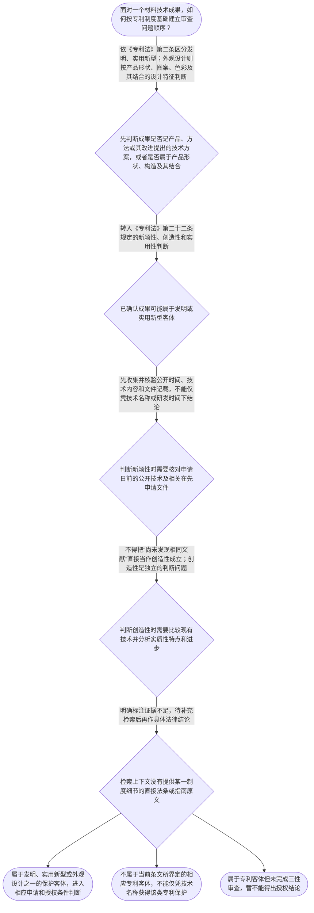

# 专家 A 教学草稿

> 专家：expert_a ｜ 风格：conservative

## 教学模块选择清单

- 当前教学节点：`patent-law-foundation`
- 板块预算：自适应 None/None，总计 9/9

| # | 模块 (block_type) | 类型 | 触发原因 (trigger) | 对应正文段 | 归属 |
|---:|---|:--:|---|---|:--:|
| 1 | `anchor_scenario` | 自适应 | perception=sensing(0.83) / P(L)=0.15<0.3 / affect=anxious / cold_start | 从复合涂层研发看专利制度入口｜某材料研发团队开发出一种用于锂电池隔膜的复合涂层：基层为聚烯烃薄膜，表面增加无机颗粒和耐热粘… | [A] |
| 2 | `legal_anchor` | 必选 | mandatory | 法条锚定：保护客体与授权三性｜《专利法》第二条 | [A] |
| 3 | `worked_example` | 自适应 | cold_start(low_confidence) | 案例演示：复合涂层的基础审查链｜甲材料公司研发一种锂电池隔膜复合涂层，技术方案涉及基层、无机颗粒涂层及耐热粘结层。公司拟申请… | [A] |
| 4 | `decision_flow` | 自适应 | input=visual(0.74) | 基础审查决策流程｜面对一个材料技术成果，如何按专利制度基础建立审查问题顺序？ | [A] |
| 5 | `mnemonic` | 自适应 | understanding=sequential(0.68) | 四问顺序表｜四问顺序表：客体—权利—三性—证据。先问“保护什么”，再问“权利有什么边界”，再问“新颖性、… | [A] |
| 6 | `predict_activate` | 自适应 | processing=active(0.61) | 先预测：材料成果属于什么客体｜看到一个新型材料配方或复合结构时，你会先把它归入产品、方法还是外观设计？哪些事实会影响你的初… | [A] |
| 7 | `assessment` | 必选 | mandatory | 三类测评｜识别专利保护的三种客体 | [A] |
| 8 | `knowledge_synthesis` | 必选 | mandatory | 知识综合：专利制度基础结构｜专利制度基本特征：独占性、时间性、地域性共同描述专利权的边界；本轮检索上下文未提供这三项特征… | [A] |
| 9 | `summary_card` | 自适应 | len(knowledge_sub_nodes)=3>=3 | 专利制度基础速查卡｜先认清保护客体，再按法条分别核验授权条件，并为每个结论保留依据。 | [A] |

## 教学正文

## I — 法律问题

材料领域的一项研发成果进入专利申请审查时，首先要判断它属于哪一种专利保护客体；在此基础上，还要区分专利权的基本特征、专利制度所使用的规范材料，以及发明和实用新型的授权条件。当前节点建立的是基础结构，不提前展开新颖性和创造性的具体审查方法。

## R — 适用规则

### 1. 三种专利保护客体

《专利法》第二条规定：“本法所称的发明创造是指发明、实用新型和外观设计。”其中，发明是对产品、方法或者其改进提出的新的技术方案；实用新型是对产品的形状、构造或者其结合提出的适于实用的新的技术方案；外观设计则针对产品整体或局部的形状、图案、色彩及其结合，并要求富有美感且适于工业应用〔RAG: 中华人民共和国专利法.txt — 第二条：发明、实用新型和外观设计的定义〕。

因此，材料配方、复合结构、制备方法和产品外观不能仅按“材料领域”这一行业标签分类，而应结合权利要求拟保护的具体技术方案判断。一个材料成果属于某种专利客体，只说明它进入了相应的专利审查入口，并不等于已经满足授权条件。

### 2. 发明和实用新型的三性门槛

《专利法》第二十二条规定，授予专利权的发明和实用新型，应当具备新颖性、创造性和实用性；该条还分别规定了三性的基本含义以及现有技术的范围〔RAG: 中华人民共和国专利法.txt — 第二十二条：发明和实用新型的授权条件及三性、现有技术定义〕。

可以把三性拆成三个不同问题：

| 判断维度 | 基础问题 | 当前节点的边界 |
|---|---|---|
| 新颖性 | 是否属于现有技术，或是否存在法定相关在先申请文件问题 | 本节只确认其属于授权条件，具体判断留待 novelty 节点 |
| 创造性 | 与现有技术相比，是否达到法律要求的实质性特点和进步 | 本节只确认其独立于新颖性，具体方法留待 inventive-step 节点 |
| 实用性 | 能否制造或者使用，并且能否产生积极效果 | 本节只建立概念位置，不替代具体事实审查 |

三性不能相互替代。技术能够制造并产生积极效果，只能对应实用性问题，不能自动推出新颖性或创造性成立；没有发现相同公开内容，也不能直接推出创造性成立。

### 3. 专利权基本特征与证据边界

专利制度基础通常从独占性、时间性和地域性理解专利权边界：独占性指权利具有排他保护效果，时间性指保护受法定期限约束，地域性指保护效果原则上依具体法域确定。本轮检索上下文未提供这三项特征的直接法条原文，因此这里只作制度结构说明，不补写具体期限、地域规则或法律效果。

中国专利制度的学习材料通常需要区分《专利法》、专利法实施细则和专利审查指南。本轮检索上下文只提供《专利法》第二条、第二十二条等原文，未提供实施细则和审查指南的具体条文；涉及申请程序、审查阶段和制度发展历程的具体结论，应在补充检索后再确认。

## A — 规则适用

以锂电池隔膜复合涂层为例，第一步不是直接问“有没有创造性”，而是先明确拟保护的技术对象和技术方案。如果权利要求拟保护的是产品、方法或其改进，应先在发明客体框架下分析；如果拟保护的是产品的形状、构造或其结合，还需进一步分析是否符合实用新型的客体定义；如果拟保护的是产品外观的形状、图案、色彩及其结合，则应转入外观设计客体框架。

第二步是把客体判断和授权条件分开。确认复合涂层属于可能受保护的技术方案后，仍需根据第二十二条分别审查新颖性、创造性和实用性。此时，研发人员熟悉的“性能提升”“循环寿命提高”或“耐热性增强”等事实，可能成为后续分析技术效果的材料，但不能单独替代法定三性判断。

第三步是检查依据。关于新颖性和创造性的具体判断，需要进一步核对现有技术、在先申请文件及审查指南中的判断规则。本轮检索上下文没有提供该复合涂层的对比文献、公开日期、实验数据，也没有提供审查指南原文，所以目前能够确定的是基础审查链，而不是具体授权结果。

## C — 结论

材料领域专利审查的基础顺序是：先识别保护客体，再确认适用的授权条件，最后以法条和检索材料逐项验证。根据《专利法》第二条，发明、实用新型和外观设计是三类基本保护客体；根据《专利法》第二十二条，发明和实用新型必须同时面对新颖性、创造性和实用性要求。属于专利客体不等于必然获得授权，缺少直接依据时也不得把推测写成确定法律结论。

> 常见误区 / 易混淆点
>
> - 把“材料技术”行业名称当作专利客体分类标准；正确做法是看拟保护的具体技术方案。
> - 把“能制造、有积极效果”当作三性全部成立；这至多对应实用性问题。
> - 把“专利法、实施细则、审查指南”混成同一层次的文本；具体结论必须回溯到相应来源。
> - 把“属于专利客体”直接等同于“可以授权”；客体判断和授权条件判断是两个层次。
>
> 本节设有测评，请到【习题】区作答。

### 从复合涂层研发看专利制度入口（anchor_scenario）

> 某材料研发团队开发出一种用于锂电池隔膜的复合涂层：基层为聚烯烃薄膜，表面增加无机颗粒和耐热粘结层，团队希望通过专利保护这项技术。研发负责人需要先回答三个基础问题：这项成果属于哪一种专利保护客体，专利权取得后具有什么边界，以及申请审查时为什么还要区分新颖性、创造性和实用性。团队同时发现，专利制度还涉及申请、审查、授权和保护等不同环节，不能把“完成研发”直接等同于“已经取得专利权”。

**锚定**：用材料技术研发情境锚定保护客体、专利权基本特征、制度体系和授权条件之间的关系。

**先想一想**：如果你是该团队的代理人，面对这项复合涂层技术，第一步应先确认保护客体，还是先判断是否具有创造性？你会依据什么顺序建立问题清单？

### 法条锚定：保护客体与授权三性（legal_anchor）

- **《专利法》第二条**：专利法把发明创造分为发明、实用新型和外观设计，并分别界定三类客体的基本含义。
- **《专利法》第二十二条**：发明和实用新型取得专利权要满足新颖性、创造性和实用性；本条还给出了现有技术和三性的基本定义。

**为何重要**：第二条确定“什么可以作为专利客体”，第二十二条确定发明和实用新型能否获得授权的核心条件。学习这两个入口条文，才能把后续的新颖性、创造性审查放在正确的制度结构中。

### 案例演示：复合涂层的基础审查链（worked_example）

**案情/例题**：甲材料公司研发一种锂电池隔膜复合涂层，技术方案涉及基层、无机颗粒涂层及耐热粘结层。公司拟申请专利。请演示如何从“保护客体”与“授权条件”两个层次整理审查问题。
**适用规则**：《专利法》第二条和第二十二条。第二条用于判断技术成果属于哪类专利客体；第二十二条用于确认发明和实用新型的授权条件包括新颖性、创造性和实用性。相关制度发展史、实施细则和审查指南的具体条文，本轮检索上下文未提供直接依据。
**分步推演**：
1. 先读取技术成果的法律对象。检索到的第二条规定，发明是对产品、方法或者其改进提出的新的技术方案；实用新型是对产品的形状、构造或者其结合提出的适于实用的新的技术方案。复合涂层涉及产品及其技术结构，不能仅因属于材料领域就直接确定申请类型。 → *第一步：先识别成果对应的保护客体及技术方案属性。*
2. 在确认其可能落入发明或实用新型讨论范围后，再转到第二十二条。该条明确发明和实用新型应当具备新颖性、创造性和实用性。 → *第二步：把客体判断与三性判断分开。*
3. 分别建立三性问题：新颖性关注是否属于现有技术及相关在先申请文件情形；创造性比较现有技术并判断是否具有法定程度的实质性特点和进步；实用性关注能否制造或者使用并产生积极效果。三者不能用其中一项替代另一项。 → *第三步：对三性逐项提出审查问题。*
4. 最后核对证据。当前检索上下文只直接给出第二条、第二十二条原文，没有给出该复合涂层的现有技术检索结果、实验数据或具体审查指南段落，因此不能据此作出最终授权结论。 → *第四步：结论范围必须受事实和检索证据限制。*
**结论**：该复合涂层首先可以按其技术方案性质进入发明或实用新型客体的进一步判断，但仅凭属于专利客体，不能推出必然授权；还必须分别审查第二十二条规定的新颖性、创造性和实用性。
**本题要点**：材料技术案件应先分清保护客体，再按新颖性、创造性、实用性分别建立证据和判断链。

### 基础审查决策流程（decision_flow）

**决策问题**：面对一个材料技术成果，如何按专利制度基础建立审查问题顺序？



### 四问顺序表（mnemonic）

**记忆锚**：四问顺序表：客体—权利—三性—证据。先问“保护什么”，再问“权利有什么边界”，再问“新颖性、创造性、实用性是否分别满足”，最后问“每个结论由哪条法条或材料支持”。
**映射**：
- 客体
- 权利
- 三性
- 证据
**何时用**：阅读材料专利审查题、整理代理人审查意见或面对“能否授权”的笼统问题时，按四问顺序逐项检查。

### 先预测：材料成果属于什么客体（predict_activate）

**预测/激活**：看到一个新型材料配方或复合结构时，你会先把它归入产品、方法还是外观设计？哪些事实会影响你的初步判断？

**激活旧知**：激活研发中对“技术对象”“技术效果”和“对比实验”的区分经验，并将其分别连接到保护客体识别和三性审查。

**揭晓方向**：先圈出技术方案的对象和限定特征，再查看法条对三类客体的定义；不要先用“效果好”替代客体判断。

### 知识综合：专利制度基础结构（knowledge_synthesis）

**知识框架**：
- 专利制度基本特征：独占性、时间性、地域性共同描述专利权的边界；本轮检索上下文未提供这三项特征的直接法条原文，具体法律效果需结合相应条文补充核验。
- 中国专利制度体系：专利法、专利法实施细则和专利审查指南构成学习和实务中需要分别核对的规范与审查材料；本轮检索上下文未提供实施细则和审查指南的具体原文。
- 三种保护客体：《专利法》第二条将发明、实用新型和外观设计作为发明创造的三类基本客体，并分别规定其定义。
- 专利制度作用：通过授予一定范围的专利权并要求技术公开，协调发明创造激励与技术传播；本轮检索上下文未提供该作用的直接条文表述，当前仅作制度功能框架。
- 制度发展与审查结构：本教学上下文提示中国制度具有早期公开、延迟审查以及初步审查与实质审查并存等学习主题，但本轮检索上下文未提供其具体法律依据，因此不对具体程序细节作确定讲授。
**概念关系**：先识别保护客体，再判断该客体适用的授权条件。；《专利法》第二条解决“是什么”，第二十二条解决发明和实用新型“是否满足三性门槛”。；新颖性、创造性和实用性是不同判断维度，不能因为技术属于专利客体就推定三性均满足。；制度体系和审查程序是后续学习实体判断的外部框架，但具体程序规则应以相应法条和审查指南原文为准。
**必记**：《专利法》第二条将发明创造分为发明、实用新型和外观设计。；发明和实用新型的授权条件包括新颖性、创造性和实用性，三者不能相互替代。；专利客体判断与授权条件判断是两个层次：属于客体不等于必然授权。；没有直接检索依据时，应明确证据边界，不编造实施细则、审查指南条号或制度史细节。

### 专利制度基础速查卡（summary_card）

**要点卡**：
- **专利保护客体**：先判断成果属于发明、实用新型还是外观设计，不能只看技术名称。
- **专利权基本特征**：独占性、时间性、地域性用于理解专利权的边界；本轮未提供其直接法条原文。
- **授权三性**：发明和实用新型需要同时具备新颖性、创造性和实用性。
- **制度规范层级**：专利法、实施细则和审查指南需要分别查证，不能把一般介绍当作具体条文。
- **证据边界**：每个核心法律结论都应能回溯到具体法条或检索材料。
**必背**：《专利法》第二条规定发明创造包括发明、实用新型和外观设计。；《专利法》第二十二条规定发明和实用新型应当具备新颖性、创造性和实用性。；属于专利保护客体不等于已经满足授权条件。；没有直接依据时必须标注证据不足，不编造条号或案例。
**一句话总结**：先认清保护客体，再按法条分别核验授权条件，并为每个结论保留依据。

### 三类测评（assessment）

**三类覆盖**：backward_review、forward_probe、weakness_probe
**题目**：
- q_backward_01：识别专利保护的三种客体
- q_forward_01：探测专利申请文件的基础组成
- q_weakness_01：区分属于专利客体与满足三性授权条件


## 结构化字段

## knowledge_points

```json
[
  {
    "node_id": "patent-law-foundation",
    "kc_name": "专利制度的基本概念与特征：独占性、时间性、地域性（详见子节点 patent-rights-nature）"
  },
  {
    "node_id": "patent-law-foundation",
    "kc_name": "中国专利制度体系：专利法、专利法实施细则、专利审查指南（详见子节点 patent-law-framework）"
  },
  {
    "node_id": "patent-law-foundation",
    "kc_name": "专利保护的三种客体：发明、实用新型、外观设计（专利法第2条）"
  },
  {
    "node_id": "patent-law-foundation",
    "kc_name": "专利制度的作用：激励发明创造、促进技术公开、推动技术应用和经济发展（详见子节点 patent-system-overview）"
  },
  {
    "node_id": "patent-law-foundation",
    "kc_name": "中国专利制度发展历程与特点：早期公开延迟审查、初步审查制与实质审查制并存（详见子节点 patent-system-overview）"
  }
]
```

## legal_basis

```json
[
  {
    "article": "《专利法》第二条：发明创造包括发明、实用新型和外观设计，并分别规定三类客体定义。",
    "source": "中华人民共和国专利法.txt"
  },
  {
    "article": "《专利法》第二十二条：发明和实用新型应当具备新颖性、创造性和实用性；本条规定现有技术及三性的基本含义。",
    "source": "中华人民共和国专利法.txt"
  }
]
```

## risks

```json
[
  {
    "risk": "本轮检索上下文未提供独占性、时间性、地域性的直接法条原文；若需展开权利期限、地域范围或权利效力，应补充检索后再作确定表述。",
    "related_node_id": "patent-rights-nature"
  },
  {
    "risk": "本轮未提供专利法实施细则和专利审查指南的具体条文，不能据记忆编造条号或审查步骤。",
    "related_node_id": "patent-law-framework"
  },
  {
    "risk": "本轮未提供专利制度发展历程和制度作用的直接来源；相关内容仅作为结构提示，不应替代法条依据。",
    "related_node_id": "patent-system-overview"
  },
  {
    "risk": "初学者可能把“属于专利客体”误认为“必然授权”，应持续区分客体识别与新颖性、创造性、实用性判断。",
    "related_node_id": "patent-law-foundation"
  }
]
```

## draft_stage

```json
"debate"
```

## irac

```json
{
  "issue": "材料领域的一项研发成果进入专利申请审查时，应如何确定其基础保护客体，并区分专利权基本特征、制度规范体系与发明和实用新型的授权条件？",
  "rule": "《专利法》第二条规定，发明创造包括发明、实用新型和外观设计，并分别界定三类客体。检索原文明确表述：“发明，是指对产品、方法或者其改进所提出的新的技术方案”；“实用新型，是指对产品的形状、构造或者其结合所提出的适于实用的新的技术方案”；“外观设计，是指对产品的整体或者局部的形状、图案或者其结合以及色彩与形状、图案的结合所作出的富有美感并适于工业应用的新设计”〔RAG: 中华人民共和国专利法.txt — 第二条：发明、实用新型和外观设计的定义〕。《专利法》第二十二条规定，授予发明和实用新型应当具备新颖性、创造性和实用性，并分别规定其基本含义〔RAG: 中华人民共和国专利法.txt — 第二十二条：发明和实用新型的授权条件及三性、现有技术定义〕。关于独占性、时间性、地域性、实施细则、审查指南及制度发展历程的具体依据，本轮检索上下文未提供直接原文。",
  "application": "本轮材料事实显示，学习者要处理的是材料技术成果进入专利制度后的基础分类与授权问题。以复合涂层为例，应先根据技术对象和技术方案特征判断其可能对应的专利客体，再依据第二十二条分别提出新颖性、创造性和实用性审查问题。当前检索上下文没有提供该具体技术的现有技术文献、实验数据，也没有提供实施细则和审查指南的直接原文，因此只能建立判断框架，不能作出最终授权结论。",
  "conclusion": "专利制度基础审查应采取“先客体、后授权条件、再核对证据”的顺序。发明和实用新型须同时满足新颖性、创造性和实用性；本轮资料足以确认该法条框架，但不足以对具体材料申请的授权结果或程序细节作确定判断。"
}
```

## interactive_questions

```json
[
  {
    "qid": "q_backward_01",
    "category": "remember",
    "difficulty": "L1",
    "source_tag": "backward_review",
    "kc_node_id": "patent-law-foundation",
    "question": "根据《专利法》第二条，下列哪一组属于专利保护的三种客体？",
    "answer": "B",
    "options": [
      "A. 只有发明和实用新型",
      "B. 发明、实用新型和外观设计",
      "C. 产品、商标和商业秘密",
      "D. 方法、厂房和技术人员"
    ]
  },
  {
    "qid": "q_forward_01",
    "category": "remember",
    "difficulty": "L1",
    "source_tag": "forward_probe",
    "kc_node_id": "patent-application-process",
    "question": "下列哪一项通常属于专利申请文件的组成部分？",
    "answer": "A",
    "options": [
      "A. 请求书、说明书及其摘要、权利要求书等",
      "B. 仅有产品实物和销售合同",
      "C. 仅有研发人员名单和实验室照片",
      "D. 仅有商标注册证和产品广告"
    ]
  },
  {
    "qid": "q_weakness_01",
    "category": "analyze",
    "difficulty": "L2",
    "source_tag": "weakness_probe",
    "kc_node_id": "patent-law-foundation",
    "question": "某技术方案属于产品发明，能够制造并产生积极效果，但已经不属于申请日前在国内外为公众所知的技术。依据《专利法》第二十二条，最准确的判断是：",
    "answer": "C",
    "options": [
      "A. 只要属于材料技术，就当然满足授权条件",
      "B. 只要能够制造并产生积极效果，就不必再判断新颖性和创造性",
      "C. 虽然满足实用性，但仍需继续判断新颖性和创造性，不能据此直接授权",
      "D. 只要申请人完成研发，就自动取得专利权"
    ]
  }
]
```

## knowledge_synthesis

```json
{
  "node": "patent-law-foundation",
  "coverage": [
    {
      "node_id": "patent-law-foundation"
    },
    {
      "node_id": "patent-rights-nature"
    },
    {
      "node_id": "patent-law-framework"
    },
    {
      "node_id": "patent-system-overview"
    }
  ],
  "confusable_pairs": [
    {
      "pair": "属于专利保护客体与满足授权条件：前者回答“属于哪类成果”，后者回答“是否满足法定授权门槛”。"
    },
    {
      "pair": "新颖性与创造性：本节点仅确认二者都属于第二十二条授权条件；具体判断标准和边界将在相应后续节点中展开。"
    },
    {
      "pair": "专利法、实施细则与审查指南：三者都是学习和实务中需要核对的材料，但本轮未提供后两者具体原文，不能擅自补写条号。"
    }
  ]
}
```
