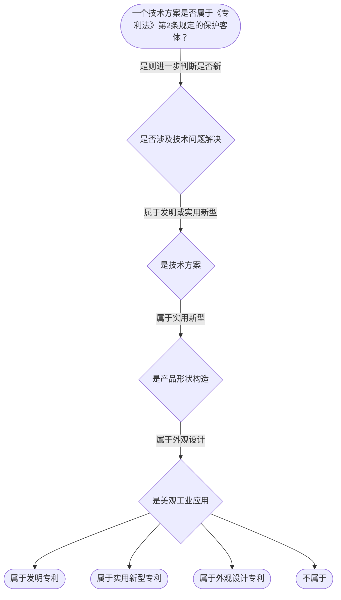

# 专家 B 教学草稿

> 专家：expert_b ｜ 风格：accessible

## 教学模块选择清单

- 当前教学节点：`patent-law-foundation`
- 板块预算：自适应 None/None，总计 180/180

| # | 模块 (block_type) | 类型 | 触发原因 (trigger) | 对应正文段 | 归属 |
|---:|---|:--:|---|---|:--:|
| 1 | `anchor_scenario` | 自适应 | perception=sensing(0.83) / P(L)=0.15<0.3 / affect=anxious / cold_start | 场景导入：材料研发中的专利风险｜小李是材料工程师，研发了一种新型碳纤维复合材料，应用在航空航天领域。他们想申请专利，但担心在… | [B] |
| 2 | `legal_anchor` | 必选 | mandatory | 法条锚定：授权基础｜《专利法》第二条 | [B] |
| 3 | `worked_example` | 自适应 | cold_start(low_confidence) | 案例演示：判断保护客体｜某公司提出了一种新型的齿轮制造方法，申请专利。问是否属于发明专利的保护客体？ | [B] |
| 4 | `decision_flow` | 自适应 | input=visual(0.74) | 决策流程：判断保护客体｜一个技术方案是否属于《专利法》第2条规定的保护客体？ | [B] |
| 5 | `mnemonic` | 自适应 | understanding=sequential(0.68) | 记忆口诀：保护客体分类｜保护客体三分类表 | [B] |
| 6 | `predict_activate` | 自适应 | processing=active(0.61) | 预测激活：先猜专利客体｜你认为哪些东西可以申请专利？比如一种新型牙刷形状？ | [B] |
| 7 | `assessment` | 必选 | mandatory | 测评模块｜专利保护客体定义 | [B] |
| 8 | `knowledge_synthesis` | 必选 | mandatory | 知识框架｜专利保护客体：发明、实用新型、外观设计 | [B] |
| 9 | `summary_card` | 自适应 | len(knowledge_sub_nodes)=3>=3 | 速查卡｜先过保护客体之门，再过三性安检。 | [B] |

## 教学正文

## 1. 场景导入

小李是材料工程师，研发了一种新型碳纤维复合材料，应用在航空航天领域。他们想申请专利，但担心在公司内部技术交流会上分享会影响申请。专利审查首先要判断是否属于可保护的客体。

## 2. 人话解释
专利制度的基础是明确保护对象和授权条件。专利保护的三种客体是发明、实用新型和外观设计。发明是对产品、方法或其改进的新技术方案〔RAG: 专利法.txt — 发明，是指对产品、方法或者其改进所提出的新的技术方案〕。实用新型是对产品形状构造的新实用方案。外观设计是对产品形状图案的美感新设计。中国专利制度包括专利法、细则和审查指南。专利制度有独占性、时间性和地域性作用。

## 3. 法条回扣
《专利法》第2条规定发明、实用新型、外观设计。 《专利法》第5条不授予违反法律的。 《专利法》第22条发明需新颖性创造性实用性。 《专利法》第23条外观设计要求。

## 4. 类比 / 口诀
口诀：发明新方案，实用型形状，设计美观。边界：方法不能是实用新型，信号不能申请。

## 5. 应试提示
关键词：技术方案、形状构造、美感。判断步骤：先看是否技术方案，再看具体类型。常见混淆：方法和形状。

## 6. 互动提问
思考：如果你的发明是材料形状改进，能申请吗？

### 场景导入：材料研发中的专利风险（anchor_scenario）

> 小李是材料工程师，研发了一种新型碳纤维复合材料，应用在航空航天领域。他们想申请专利，但担心在公司内部技术交流会上分享会影响申请。专利审查首先要判断是否属于可保护的客体。

**锚定**：用研发材料领域的具体情境引入专利保护客体和授权三性判断。

**先想一想**：作为研发人员，你认为新材料是否具有‘技术方案’特征？为什么？

### 法条锚定：授权基础（legal_anchor）

- **《专利法》第二条**：发明是新的技术方案
- **《专利法》第五条**：不授予违反法律等主题
- **《专利法》第二十二条**：发明需具备新颖性、创造性和实用性
- **《专利法》第二十三条**：外观设计需不属于现有设计且有区别

**为何重要**：这些法条是专利授权的基础，三种客体是第一步，之后是三性审查。

### 案例演示：判断保护客体（worked_example）

**案情/例题**：某公司提出了一种新型的齿轮制造方法，申请专利。问是否属于发明专利的保护客体？
**适用规则**：《专利法》第2条
**分步推演**：
1. 该方法是技术方案，解决齿轮制造技术问题，获得技术效果 → *属于发明客体*
2. 方法属于《专利法》第2条规定的保护范围 → *符合发明客体要求*
**结论**：该发明属于《专利法》第2条规定的保护客体。
**本题要点**：方法专利化需是技术方案

### 决策流程：判断保护客体（decision_flow）

**决策问题**：一个技术方案是否属于《专利法》第2条规定的保护客体？



### 记忆口诀：保护客体分类（mnemonic）

**记忆锚**：保护客体三分类表
**映射**：
- 发明
- 实用新型
- 外观设计
**何时用**：判断专利客体时使用

### 预测激活：先猜专利客体（predict_activate）

**预测/激活**：你认为哪些东西可以申请专利？比如一种新型牙刷形状？

**激活旧知**：已学专利保护客体概念

**揭晓方向**：看《专利法》第2条，形状是否技术方案？

### 知识框架（knowledge_synthesis）

**知识框架**：
- 专利保护客体：发明、实用新型、外观设计
- 中国专利制度体系：专利法、细则、审查指南
- 专利制度特征：独占性、时间性、地域性
**概念关系**：保护客体是授权的前提，三性是授权的条件
**必记**：三性缺一不可，任一不具备即不授权；保护客体必须是技术方案或设计

### 速查卡（summary_card）

**要点卡**：
- **保护客体**：发明、实用新型、外观设计
- **三性**：新颖性、创造性、实用性
- **制度特征**：独占性、时间性、地域性
**必背**：三性缺一不可；保护客体必须符合法条
**一句话总结**：先过保护客体之门，再过三性安检。

### 测评模块（assessment）

**三类覆盖**：backward_review、forward_probe、weakness_probe
**题目**：
- q1：专利保护客体定义
- q2：不授予客体
- q3：三性要求
- q4：三性审查顺序


## 结构化字段

## knowledge_points

```json
[
  {
    "node_id": "patent-law-foundation",
    "kc_name": "专利制度的基本概念与特征"
  },
  {
    "node_id": "patent-law-foundation",
    "kc_name": "中国专利制度体系"
  },
  {
    "node_id": "patent-law-foundation",
    "kc_name": "专利保护的三种客体"
  },
  {
    "node_id": "patent-law-foundation",
    "kc_name": "专利制度的作用"
  },
  {
    "node_id": "patent-law-foundation",
    "kc_name": "中国专利制度发展历程与特点"
  }
]
```

## legal_basis

```json
[
  {
    "article": "《专利法》第二条",
    "source": "中华人民共和国专利法.txt"
  },
  {
    "article": "《专利法》第五条",
    "source": "中华人民共和国专利法.txt"
  },
  {
    "article": "《专利法》第二十二条",
    "source": "中华人民共和国专利法.txt"
  },
  {
    "article": "《专利法》第二十三条",
    "source": "中华人民共和国专利法.txt"
  }
]
```

## risks

```json
[
  {
    "risk": "混淆发明与实用新型",
    "related_node_id": "patent-law-foundation"
  },
  {
    "risk": "忽略三性要求",
    "related_node_id": "patent-law-foundation"
  }
]
```

## draft_stage

```json
"debate"
```

## interactive_questions

```json
[
  {
    "qid": "q1",
    "category": "remember",
    "difficulty": "L1",
    "source_tag": "backward_review",
    "kc_node_id": "patent-law-foundation",
    "question": "《专利法》第2条第2款规定的发明是指",
    "answer": "A",
    "options": [
      "对产品、方法或者其改进所提出的新的技术方案",
      "对产品的形状、构造或者其结合所提出的适于实用的新的技术方案",
      "对产品的整体或者局部的形状、图案或者其结合以及色彩与形状、图案的结合所作出的富有美感并适于工业应用的新设计",
      "适于实用的新的技术方案"
    ]
  },
  {
    "qid": "q2",
    "category": "remember",
    "difficulty": "L1",
    "source_tag": "backward_review",
    "kc_node_id": "patent-law-foundation",
    "question": "《专利法》第5条规定不授予专利权的发明创造包括",
    "answer": "D",
    "options": [
      "利用遗传资源的发明",
      "违反法律、社会公德或者妨害公共利益的发明创造",
      "违背道德的发明",
      "以上所有"
    ]
  },
  {
    "qid": "q3",
    "category": "apply",
    "difficulty": "L2",
    "source_tag": "weakness_probe",
    "kc_node_id": "patent-law-foundation",
    "question": "授予专利权的发明应当具备",
    "answer": "A",
    "options": [
      "新颖性、创造性、实用性",
      "显著性、进步性、实用性",
      "新颖性、显著性、进步性",
      "创造性、实用性、新颖性"
    ]
  },
  {
    "qid": "q4",
    "category": "understand",
    "difficulty": "L3",
    "source_tag": "weakness_probe",
    "kc_node_id": "patent-law-foundation",
    "question": "在专利授权审查中，先判断的是",
    "answer": "B",
    "options": [
      "创造性",
      "实用性",
      "新颖性",
      "三性是否都满足"
    ]
  }
]
```

## knowledge_synthesis

```json
{
  "node": "patent-law-foundation",
  "coverage": [
    {
      "node_id": "patent-law-foundation"
    }
  ],
  "confusable_pairs": []
}
```
