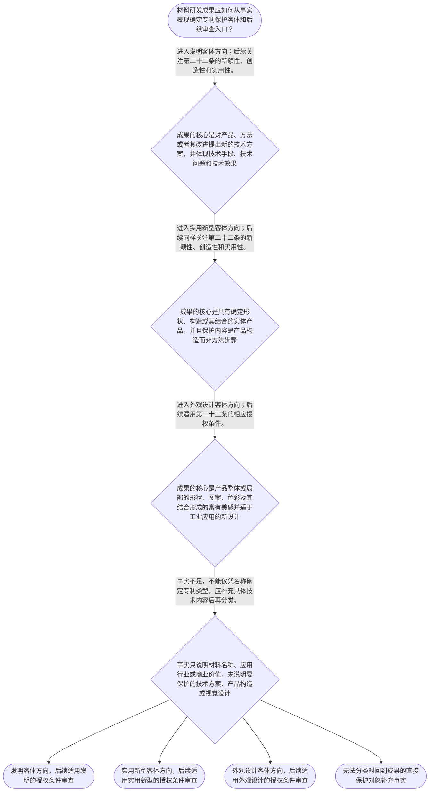

# 整合后的课程完整内容与习题

## 教学模块选择清单

- 当前教学节点：`patent-law-foundation`
- 板块预算：自适应 5/6，总计 9/9

| # | 模块 (block_type) | 类型 | 触发原因 (trigger) | 对应正文段 | 归属 |
|---:|---|:--:|---|---|:--:|
| 1 | `anchor_scenario` | 自适应 | perception=sensing(0.82) / cold_start | 材料研发成果的专利分类场景｜某材料研发团队制备出一种用于锂离子电池隔膜的陶瓷涂层：该涂层由特定粒径范围的氧化铝颗粒与粘结… | [A+B融合] |
| 2 | `legal_anchor` | 必选 | mandatory | 专利制度的法条锚点｜《中华人民共和国专利法》第一条 | [A+B融合] |
| 3 | `worked_example` | 自适应 | cold_start(low_confidence) | 材料成果的客体分类演示｜某团队形成三项成果：第一项是通过调整氧化铝颗粒粒径和粘结剂比例提高隔膜耐热性的涂层配方及制备… | [A+B融合] |
| 4 | `decision_flow` | 自适应 | input=visual(0.73) | 材料成果的客体判断流程｜材料研发成果应如何从事实表现确定专利保护客体和后续审查入口？ | [A+B融合] |
| 5 | `mnemonic` | 自适应 | understanding=sequential(0.70) | 客体分类与三性记忆表｜分类顺序表：“技—构—设；发实看三性”。先看保护的是技术方案、产品构造还是产品视觉设计；属于… | [A+B融合] |
| 6 | `predict_activate` | 自适应 | processing=active(0.62) | 先作成果类型预测｜在查看法条定义前，先把材料配方、制备工艺、隔膜结构和电池外壳纹样分别预判为技术方案、产品构造… | [B] |
| 7 | `assessment` | 必选 | mandatory | 本节三类测评｜复习发明创造三种法定保护客体。 | [A+B融合] |
| 8 | `knowledge_synthesis` | 必选 | mandatory | 专利法律制度基础框架｜专利制度的基本特征：独占性、时间性和地域性说明专利权的排他效力、存续边界和效力范围；具体期限… | [A+B融合] |
| 9 | `summary_card` | 自适应 | len(knowledge_sub_nodes)=3>=3 | 专利制度基础速查卡｜材料专利审查的基础顺序是：先定保护客体，再定规范入口，最后按对应条件审查。 | [A+B融合] |

## 教学正文

## I — 法律问题

材料领域的一项成果，不能因为名称中有“新材料”“高性能”或“复合材料”，就直接确定专利类型或直接进入新颖性、创造性判断。首先要回答两个基础问题：第一，成果究竟是技术方案、产品构造，还是产品的视觉设计；第二，确定为发明或实用新型后，应当适用什么授权条件和制度规则。

本节的定位是建立“专利法律制度基础”这一入口。新颖性、创造性的具体比对方法、优先权和抵触申请等内容属于后续节点；本节只说明它们从何种制度框架出发。

## R — 适用规则

### 1. 专利制度的目的与基本特征

《中华人民共和国专利法》第一条明确，专利法的制度目的包括保护专利权人的合法权益、鼓励发明创造、推动发明创造的应用、提高创新能力，并促进科学技术进步和经济社会发展。〔RAG: 中华人民共和国专利法.txt — 第一条“保护专利权人的合法权益，鼓励发明创造，推动发明创造的应用，提高创新能力，促进科学技术进步和经济社会发展”〕

专利制度的基本特征通常概括为独占性、时间性和地域性：独占性强调专利权人在法定范围内对专利技术享有排他性权利；时间性强调这种权利不是无限期存在；地域性强调专利权原则上依授予该权利的国家或地区法律发生效力。关于具体保护期限、地域效力和权利边界，本轮检索上下文未提供直接法条原文，学习时应以相应正式条文核验。

### 2. 中国专利制度的规范层次

中国专利制度以《专利法》为基本法律依据，由《专利法实施细则》对申请文件、撰写和程序等事项作进一步细化，并由《专利审查指南》为具体审查实践提供操作性规范。三者不是同一层级的规范：专利法提供基本制度和授权条件，实施细则细化法律实施要求，审查指南用于具体审查判断，审查指南不能替代或超越专利法。

本轮检索材料明确显示，实施细则第二十条规定说明书应包括技术领域、背景技术、发明内容、附图说明和具体实施方式等内容；第二十二条规定权利要求书应当记载发明或者实用新型的技术特征；第二十三条规定权利要求书应当有独立权利要求，也可以有从属权利要求。〔RAG: 中华人民共和国专利法实施细则.txt — 第二十条关于说明书内容；第二十二条“权利要求书应当记载发明或者实用新型的技术特征”；第二十三条关于独立权利要求和从属权利要求〕

检索材料还表明，一件专利申请必须属于专利法规定的可以授权的对象和主题，才有可能获得授权；在实质审查中，应先判断保护客体等基础问题，再进入新颖性和创造性审查。〔RAG: 专利法专题讲座.txt — “一件专利申请必须属于专利法规定的可以授权的对象和主题，才有可能获得专利授权”；“在新颖性和创造性审查之前首先判断专利申请是否符合上述规定”〕

### 3. 三种专利保护客体

《专利法》第二条规定，发明创造包括发明、实用新型和外观设计。〔RAG: 中华人民共和国专利法.txt — 第二条“本法所称的发明创造是指发明、实用新型和外观设计”〕

发明，是对产品、方法或者其改进所提出的新的技术方案。材料配方、材料组成、制备方法、处理方法以及性能改进方案，通常需要围绕“产品、方法或者其改进”及其技术方案性质进行判断，而不能只看商业名称。审查指南相关检索材料进一步提示，发明保护客体的核心不只是名称中是否有“新”，而是是否采用技术手段、解决技术问题并获得符合自然规律的技术效果。〔RAG: 专利法专题讲座.txt — “发明，是指对产品、方法或者其改进所提出的新的技术方案”；“着重点并不是‘新’，而是‘技术方案’”；“采用技术手段、解决技术问题、获得符合自然规律的技术效果”〕

实用新型，是对产品的形状、构造或者其结合所提出的适于实用的新的技术方案。它只保护具有确定形状、构造并占据一定空间的实体产品；制造方法、使用方法、处理方法和用途等方法性内容，不属于实用新型的保护客体。〔RAG: 专利法专题讲座.txt — 《专利法》第二条第三款关于实用新型的定义；“实用新型专利只保护产品”；“一切方法不属于实用新型的保护客体”〕

外观设计，是对产品整体或者局部的形状、图案或者其结合，以及色彩与形状、图案的结合所作出的富有美感并适于工业应用的新设计。它关注的是产品的视觉设计，不是材料配方、制备工艺或性能机理。

### 4. 发明和实用新型的三性入口

《专利法》第二十二条规定，授予专利权的发明和实用新型应当具备新颖性、创造性和实用性。新颖性，是指该发明或者实用新型不属于现有技术，也不存在法律规定的抵触申请情形；创造性，是指发明相对于现有技术具有突出的实质性特点和显著的进步，实用新型相对于现有技术具有实质性特点和进步；实用性，是指能够制造或者使用，并且能够产生积极效果。现有技术，是指申请日以前在国内外为公众所知的技术。〔RAG: 中华人民共和国专利法.txt — 第二十二条关于新颖性、创造性、实用性及现有技术的规定〕

因此，客体分类与三性判断是两个不同层次：先问“这是什么类型的成果”，再问“该类型是否满足相应授权条件”。发明和实用新型都要过新颖性、创造性和实用性三道门；不能因为某项材料性能优异、具有商业价值或技术方案看起来复杂，就跳过三性判断。外观设计不适用第二十二条的三性表述，而适用第二十三条关于现有设计、明显区别及权利冲突等条件；本节不展开外观设计的具体审查方法。

### 5. 中国专利制度的发展与审查制度概览

中国专利制度经历了逐步完善的过程，现行制度形成了法律、实施细则和审查指南相互配合的规范体系。就审查方式而言，发明专利申请与实用新型、外观设计申请存在不同的审查安排，通常概括为初步审查制与实质审查制并存；发明专利还具有早期公开、延迟审查等制度特点。

关于上述制度特点，本轮检索上下文仅提供了部分程序性材料，例如实施细则第五十二条规定，申请人可以请求早日公布其发明专利申请。〔RAG: 中华人民共和国专利法实施细则.txt — 第五十二条“申请人请求早日公布其发明专利申请的，应当向国务院专利行政部门声明”〕 对早期公开的一般时间、延迟审查的完整程序以及初步审查与实质审查的具体衔接，本轮检索上下文未提供足够直接依据，不能在本节补造具体期限或程序细节。

## A — 规则适用

面对材料领域成果，可以执行“先客体、后三性、再程序”的顺序：

第一步，找成果被保护的直接对象。若保护的是配方、组成、制备工艺或性能改进所体现的技术方案，通常从发明方向审查；若保护的是隔膜、壳体、模组等实体产品的形状、构造或其结合，且内容适于实用，才考虑实用新型方向；若保护的是产品表面的纹样、图案、色彩或整体视觉效果，才考虑外观设计方向。

第二步，核对授权条件。若属于发明或实用新型，进入《专利法》第二十二条的三性框架；若属于外观设计，则转入第二十三条的相应条件。分类本身不等于授权，分类只是决定后续适用哪一套审查规则。

第三步，建立制度层级和时间意识。《专利法》规定基本原则和授权条件，实施细则细化申请与审查要求，审查指南将法律标准落实为审查操作。新颖性和创造性后续判断都要先确定申请日，再分析相关在先技术；但抵触申请、优先权、公开日和创造性三步法，应在对应后续节点依据正式材料分别学习。

## C — 结论

材料领域专利审查的基础主线可以压缩为：先看保护对象，再看规范层级，最后进入相应授权条件。配方和制备方法通常体现为发明方向的技术方案；产品的层状结构或内部构造可能体现为实用新型方向；产品的纹样、图案和色彩组合则可能体现为外观设计方向。

专利制度通过授予具有期限和地域范围的排他性权利，交换申请人对技术内容的公开，从而实现鼓励创新、促进应用和推动技术进步的制度目标。具体案件中，不能把“新材料”这一行业标签当作专利类型，也不能把审查指南当成高于专利法的法律依据。

本节设有测评，请到【习题】区作答。

> 常见误区 / 易混淆点
>
> 1. 误解原话：“只要是新材料，就当然是发明专利。”
>    正解推理：专利类型取决于成果的法定表现对象。配方、制备方法和性能改进通常要判断是否构成产品、方法或其改进的技术方案；产品构造可能进入实用新型方向；视觉设计才进入外观设计方向。
>    区分判据：问自己“申请人究竟要保护技术方案、产品构造，还是产品视觉效果”。
>
> 2. 误解原话：“实用新型只要属于产品结构，就不需要审查三性。”
>    正解推理：实用新型的客体范围与发明不同，但《专利法》第二十二条同样要求授予专利权的实用新型具备新颖性、创造性和实用性。
>    区分判据：客体分类解决“能否按实用新型方向申请”，三性判断解决“是否满足授权条件”，二者不能混为一谈。
>
> 3. 误解原话：“审查指南的效力高于专利法。”
>    正解推理：专利法是基本法律，实施细则负责细化法律实施，审查指南用于具体审查操作；指南应当在法律和法规框架内解释、落实审查标准。
>    区分判据：遇到规范冲突时，先回到专利法及实施细则核对上位依据，不能仅凭指南表述替代法条。
>
> 4. 误解原话：“本节学完就已经掌握了新颖性和创造性的具体判断。”
>    正解推理：本节只建立保护客体、制度体系和第二十二条三性入口；在先技术比对、抵触申请、优先权及创造性三步法属于后续节点。
>    区分判据：如果问题涉及具体对比文件、申请日与公开日联动或显而易见性分析，应进入对应后续节点继续学习。

### 材料研发成果的专利分类场景（anchor_scenario）

> 某材料研发团队制备出一种用于锂离子电池隔膜的陶瓷涂层：该涂层由特定粒径范围的氧化铝颗粒与粘结剂组成，能够提高耐热收缩性能。团队一方面考虑把“涂层配方”和“制备方法”作为发明申请，另一方面考虑把“隔膜的层状结构”作为实用新型申请，还制作了具有特定纹样的电池外壳。团队需要先区分哪些成果属于发明、实用新型或外观设计，以及发明或实用新型后续是否还要面对新颖性、创造性和实用性审查。

**锚定**：用同一材料研发情境锚定保护客体分类、制度体系和发明与实用新型三性入口。

**先想一想**：面对配方、制备工艺、隔膜结构和外壳纹样，你会先看成果所属行业，还是先看申请人实际要保护的对象？为什么？

### 专利制度的法条锚点（legal_anchor）

- **《中华人民共和国专利法》第一条**：第一条说明专利制度为什么存在：保护权益、鼓励创新、推动应用并促进科技进步和经济社会发展。
- **《中华人民共和国专利法》第二条**：第二条把发明创造分为发明、实用新型和外观设计，并分别规定其保护对象。
- **《中华人民共和国专利法》第三条**：第三条确定国务院专利行政部门统一受理和审查专利申请，并依法授予专利权。
- **《中华人民共和国专利法》第二十二条**：第二十二条是发明和实用新型的三性入口：新颖性、创造性和实用性缺一不可，并以申请日前公众知悉的技术作为现有技术基础。
- **《中华人民共和国专利法实施细则》第二十条至第二十三条**：实施细则进一步规定说明书和权利要求书应如何记载和组织，是理解申请文件与审查制度分工的重要依据。

**为何重要**：这些条文共同建立“制度目的—保护客体—审查机关—授权条件—申请文件”的基础链条。只有先立住这条链，后续新颖性和创造性判断才不会把客体分类、程序节点与实体标准混在一起。

### 材料成果的客体分类演示（worked_example）

**案情/例题**：某团队形成三项成果：第一项是通过调整氧化铝颗粒粒径和粘结剂比例提高隔膜耐热性的涂层配方及制备方法；第二项是由基层、陶瓷层和功能层构成的隔膜结构；第三项是具有新纹样和色彩组合的电池外壳。团队准备分别申请专利，现需判断三项成果的保护客体方向，以及哪些成果要进入新颖性、创造性和实用性审查。
**适用规则**：《中华人民共和国专利法》第二条关于发明、实用新型和外观设计的定义；第二十二条关于发明和实用新型新颖性、创造性和实用性的规定；第二十三条关于外观设计授权条件的规定。
**分步推演**：
1. 先看第一项成果的直接保护内容。配方涉及材料组成和性能改进，制备方法涉及方法性技术手段，二者都应围绕产品、方法或者其改进是否构成技术方案来判断，而不是因为名称中有“材料”就直接定性。 → *配方和制备方法通常进入发明客体方向。*
2. 再看第二项成果的直接保护内容。基层、陶瓷层和功能层体现的是隔膜这一实体产品的层状构造；如果权利要求保护的是产品构造，而不是制造步骤或使用步骤，就具备按实用新型客体方向评估的事实基础。 → *隔膜层状结构可按实用新型客体方向评估。*
3. 最后看第三项成果的直接保护内容。新纹样和色彩组合关注电池外壳的视觉效果，而非配方、工艺或内部技术机理，因此应从外观设计客体方向判断。 → *外壳纹样和色彩组合进入外观设计客体方向。*
4. 完成客体分类后，再适用不同授权条件。第一项若作为发明申请、第二项若作为实用新型申请，均须依第二十二条判断新颖性、创造性和实用性；第三项作为外观设计申请，则适用第二十三条的相应条件。 → *客体分类决定后续规则入口，但分类本身不等于授权。*
**结论**：第一项配方和制备方法通常按发明方向评估，第二项隔膜层状结构可按实用新型方向评估，第三项外壳视觉设计按外观设计方向评估。前两项若分别申请发明或实用新型，都不能跳过第二十二条的三性审查。
**本题要点**：迁移到其他材料成果时，始终按“先找直接保护对象，再对照第二条定义，最后适用相应授权条件”的顺序判断。

### 材料成果的客体判断流程（decision_flow）

**决策问题**：材料研发成果应如何从事实表现确定专利保护客体和后续审查入口？



### 客体分类与三性记忆表（mnemonic）

**记忆锚**：分类顺序表：“技—构—设；发实看三性”。先看保护的是技术方案、产品构造还是产品视觉设计；属于发明或实用新型后，再核对新颖性、创造性、实用性。制度来源另记“法—细—指南”：专利法定基本规则，实施细则作细化，审查指南供具体审查操作。
**映射**：
- 技
- 构
- 设
- 三性
- 法—细—指南
**何时用**：阅读材料研发记录、判断申请类型或看到“授权条件”时，先按“技—构—设”分类，再按“发实看三性”核对；遇到规范来源问题时使用“法—细—指南”确认制度层级。

### 先作成果类型预测（predict_activate）

**预测/激活**：在查看法条定义前，先把材料配方、制备工艺、隔膜结构和电池外壳纹样分别预判为技术方案、产品构造或产品视觉设计中的哪一类。

**激活旧知**：已接触的发明、实用新型和外观设计三种保护客体，以及材料研发中配方、工艺、结构和外观的基本区分。

**揭晓方向**：不要先看“材料”或“电池”这个行业标签，先看申请人真正要排他保护的是技术方案、实体产品构造还是视觉效果。

### 专利法律制度基础框架（knowledge_synthesis）

**知识框架**：
- 专利制度的基本特征：独占性、时间性和地域性说明专利权的排他效力、存续边界和效力范围；具体期限和地域规则应以正式条文核验。
- 中国专利制度体系：专利法提供基本制度和授权条件，实施细则细化申请文件与程序要求，专利审查指南落实具体审查操作，三者规范层次不同。
- 三种保护客体：发明保护产品、方法或者其改进的技术方案；实用新型保护产品形状、构造或者其结合；外观设计保护产品的视觉设计。
- 专利制度的作用：以保护专利权人合法权益为基础，鼓励发明创造、推动应用、提高创新能力并促进科技进步和经济社会发展。
- 中国制度发展与审查特点：现行制度由法律、实施细则和审查指南共同支撑，并形成初步审查制与实质审查制并存、发明专利申请可请求早日公布等制度安排；具体程序细节需依正式文本核验。
**概念关系**：先根据第二条识别技术方案、产品构造或视觉设计，再确定发明、实用新型或外观设计方向。；发明和实用新型进入第二十二条三性框架，外观设计进入第二十三条相应条件。；专利法确定基本规则，实施细则细化实施要求，审查指南具体化审查操作；后续新颖性和创造性节点在此基础上展开。
**必记**：不能按“材料”“电池”等行业名称直接确定专利类型，必须看成果的直接保护对象。；发明和实用新型都要满足新颖性、创造性和实用性；客体分类不等于已经获得授权。；专利法、实施细则和审查指南承担不同规范功能，审查指南不能替代或超越专利法。；新颖性和创造性具体判断之前，先建立申请日、保护客体和授权条件的制度基础。

### 专利制度基础速查卡（summary_card）

**要点卡**：
- **专利制度目的**：保护专利权人合法权益，鼓励发明创造，推动应用，提高创新能力并促进科技进步和经济社会发展。
- **三种保护客体**：发明看产品、方法或改进的技术方案；实用新型看产品形状构造；外观设计看产品视觉设计。
- **制度规范层次**：专利法定基本规则，实施细则作程序和文件细化，审查指南服务于具体审查操作。
- **发明与实用新型三性**：新颖性、创造性和实用性是发明与实用新型的共同授权条件，三项缺一不可。
- **制度特征与审查概览**：专利制度具有独占性、时间性和地域性；现行制度存在初步审查与实质审查并存等安排，具体程序以正式文本为准。
**必背**：《专利法》第二条：发明创造包括发明、实用新型和外观设计。；《专利法》第二十二条：发明和实用新型应当具备新颖性、创造性和实用性。；判断专利类型的顺序是先看直接保护对象，再看适用的授权条件。；专利法、实施细则、审查指南的规范层次和功能不同。
**一句话总结**：材料专利审查的基础顺序是：先定保护客体，再定规范入口，最后按对应条件审查。

### 本节三类测评（assessment）

**三类覆盖**：backward_review、forward_probe、weakness_probe
**题目**：
- q-foundation-review-1：复习发明创造三种法定保护客体。
- q-application-forward-1：仅探测下一节点中发明或实用新型申请文件的基本构成。
- q-foundation-weakness-1：辨析材料产品构造的客体分类与实用新型仍须满足三性要求。


## 结构化数据

## expert

```json
"A+B融合"
```

## style

```json
"fused"
```

## knowledge_points

```json
[
  {
    "node_id": "patent-law-foundation",
    "kc_name": "专利制度的基本概念与特征：独占性、时间性、地域性"
  },
  {
    "node_id": "patent-law-foundation",
    "kc_name": "中国专利制度体系：专利法、专利法实施细则、专利审查指南"
  },
  {
    "node_id": "patent-law-foundation",
    "kc_name": "专利保护的三种客体：发明、实用新型、外观设计（专利法第2条）"
  },
  {
    "node_id": "patent-law-foundation",
    "kc_name": "专利制度的作用：激励发明创造、促进技术公开、推动技术应用和经济发展"
  },
  {
    "node_id": "patent-law-foundation",
    "kc_name": "中国专利制度发展历程与特点：早期公开延迟审查、初步审查制与实质审查制并存"
  }
]
```

## legal_basis

```json
[
  {
    "article": "《中华人民共和国专利法》第一条",
    "source": "中华人民共和国专利法.txt：第一条“为了保护专利权人的合法权益，鼓励发明创造，推动发明创造的应用，提高创新能力，促进科学技术进步和经济社会发展，制定本法。”"
  },
  {
    "article": "《中华人民共和国专利法》第二条",
    "source": "中华人民共和国专利法.txt：第二条规定发明创造包括发明、实用新型和外观设计，并分别界定三类保护客体。"
  },
  {
    "article": "《中华人民共和国专利法》第三条",
    "source": "中华人民共和国专利法.txt：第三条“国务院专利行政部门负责管理全国的专利工作；统一受理和审查专利申请，依法授予专利权。”"
  },
  {
    "article": "《中华人民共和国专利法》第二十二条",
    "source": "中华人民共和国专利法.txt：第二十二条规定，授予专利权的发明和实用新型应当具备新颖性、创造性和实用性，并规定现有技术是申请日以前在国内外为公众所知的技术。"
  },
  {
    "article": "《中华人民共和国专利法实施细则》第二十条至第二十三条",
    "source": "中华人民共和国专利法实施细则.txt：第二十条规定说明书内容；第二十二条规定权利要求书应当记载发明或者实用新型的技术特征；第二十三条规定权利要求书应当有独立权利要求，也可以有从属权利要求。"
  },
  {
    "article": "《专利法专题讲座》关于专利审查和保护客体的说明",
    "source": "专利法专题讲座.txt：检索材料说明专利实质审查过程中，在新颖性和创造性审查之前首先判断申请是否属于可以授权的对象和主题；其中发明保护对象的核心是技术方案。"
  }
]
```

## risks

```json
[
  {
    "risk": "将材料所属行业、产品名称或商业价值直接等同于专利类型，忽略发明、实用新型和外观设计的法定表现对象。",
    "related_node_id": "patent-law-foundation"
  },
  {
    "risk": "把实用新型的客体限制误解为其不需要新颖性、创造性和实用性，混淆客体分类与授权条件。",
    "related_node_id": "patent-law-foundation"
  },
  {
    "risk": "把审查指南误认为效力高于专利法，或用指南概述替代可核验的法律条文。",
    "related_node_id": "patent-law-foundation"
  },
  {
    "risk": "把本节点的三性制度入口误认为已经完成新颖性、创造性、优先权或抵触申请的具体判断规则学习。",
    "related_node_id": "patent-law-foundation"
  },
  {
    "risk": "对早期公开、延迟审查以及初步审查与实质审查并存的具体期限和程序作无检索依据的推断。",
    "related_node_id": "patent-law-foundation"
  }
]
```

## draft_stage

```json
"integration"
```

## irac

```json
{
  "issue": "材料领域研发成果如何初步识别专利保护客体，并确定其进入新颖性、创造性和其他授权条件审查前的制度基础。",
  "rule": "《中华人民共和国专利法》第一条规定专利制度目的；第二条规定发明、实用新型和外观设计的定义；第三条规定国务院专利行政部门统一受理和审查专利申请；第二十二条规定发明和实用新型应具备新颖性、创造性和实用性，并界定现有技术。实施细则对说明书和权利要求书等申请文件作进一步细化。",
  "application": "对材料配方、制备方法和性能改进，应先判断其是否属于产品、方法或者其改进的技术方案；对隔膜、壳体等实体产品的形状、构造或者其结合，应判断是否符合实用新型的客体方向；对纹样、图案和色彩组合，应判断是否属于外观设计。确定为发明或实用新型后，再适用第二十二条的三性框架。专利法、实施细则和审查指南具有不同规范层次，具体审查程序和新颖性、创造性判断方法应以对应正式依据核验。",
  "conclusion": "材料专利学习应遵循“先定保护客体，再定适用规则，最后进入授权条件审查”的顺序。发明和实用新型均须满足新颖性、创造性和实用性；本节点只建立制度入口，不替代后续具体的新颖性和创造性判断学习。"
}
```

## interactive_questions

```json
[
  {
    "qid": "q-foundation-review-1",
    "category": "remember",
    "difficulty": "L1",
    "source_tag": "backward_review",
    "kc_node_id": "patent-law-foundation",
    "question": "依照《中华人民共和国专利法》第二条，本法所称的发明创造包括哪三类？",
    "answer": "A",
    "options": [
      "A. 发明、实用新型和外观设计",
      "B. 发明、商标和著作权",
      "C. 实用新型、商业秘密和域名",
      "D. 外观设计、植物新品种和集成电路布图设计"
    ]
  },
  {
    "qid": "q-application-forward-1",
    "category": "remember",
    "difficulty": "L1",
    "source_tag": "forward_probe",
    "kc_node_id": "patent-application-process",
    "question": "仅作下一节点探测：申请发明或者实用新型专利时，法律列举的申请文件组合是哪一项？",
    "answer": "B",
    "options": [
      "A. 仅提交请求书和产品样品",
      "B. 提交请求书、说明书及其摘要和权利要求书等文件",
      "C. 仅提交技术交底书和检索报告",
      "D. 仅提交说明书摘要和产品宣传册"
    ]
  },
  {
    "qid": "q-foundation-weakness-1",
    "category": "analyze",
    "difficulty": "L3",
    "source_tag": "weakness_probe",
    "kc_node_id": "patent-law-foundation",
    "question": "某团队研发出一种由基层、陶瓷层和功能层构成的新型电池隔膜。下列关于其专利制度基础判断，哪一项最准确？",
    "answer": "C",
    "options": [
      "A. 该成果属于外观设计，因此不需要判断技术内容，也不适用任何授权条件",
      "B. 该成果属于实用新型后，就不需要再判断新颖性、创造性和实用性",
      "C. 该成果的层状构造可先按实用新型客体方向评估；若作为实用新型申请，仍须满足新颖性、创造性和实用性",
      "D. 只要材料性能优异，就当然属于发明并可以获得专利权"
    ]
  }
]
```

## knowledge_synthesis

```json
{
  "node": "patent-law-foundation",
  "coverage": [
    {
      "node_id": "patent-law-foundation"
    }
  ],
  "confusable_pairs": [
    {
      "pair": "发明与实用新型：发明覆盖产品、方法或者其改进的技术方案；实用新型限于产品形状、构造或者其结合的技术方案，且不保护方法步骤。"
    },
    {
      "pair": "发明或实用新型与外观设计：前者关注技术方案或产品构造，后者关注产品整体或局部的视觉设计。"
    },
    {
      "pair": "客体分类与三性审查：先判断成果能否归入发明、实用新型或外观设计，再适用相应授权条件；发明和实用新型仍须满足三性。"
    },
    {
      "pair": "专利法、实施细则与审查指南：专利法规定基本制度，实施细则细化实施要求，审查指南用于具体审查操作，不能把指南当作高于专利法的依据。"
    },
    {
      "pair": "制度基础与具体实体审查：本节点建立新颖性和创造性的法定入口，具体的在先技术比对、抵触申请、优先权和创造性判断方法属于后续节点。"
    }
  ]
}
```
