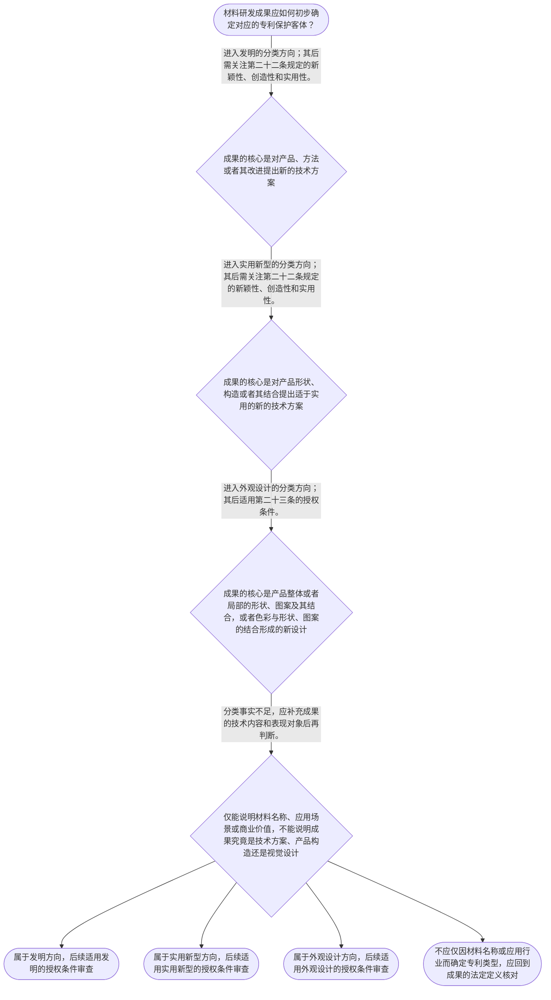

# 专家 A 教学草稿

> 专家：expert_a ｜ 风格：conservative

## 教学模块选择清单

- 当前教学节点：`patent-law-foundation`
- 板块预算：自适应 6/6，总计 9/9

| # | 模块 (block_type) | 类型 | 触发原因 (trigger) | 对应正文段 | 归属 |
|---:|---|:--:|---|---|:--:|
| 1 | `anchor_scenario` | 自适应 | perception=sensing(0.82) / cold_start | 材料研发成果的专利分类场景｜某材料研发团队制备出一种用于锂离子电池隔膜的陶瓷涂层：该涂层由特定粒径范围的氧化铝颗粒与粘结… | [A] |
| 2 | `legal_anchor` | 必选 | mandatory | 专利制度的法条锚点｜《中华人民共和国专利法》第一条 | [A] |
| 3 | `worked_example` | 自适应 | cold_start(low_confidence) | 材料成果的客体分类演示｜某团队形成三项成果：一种通过调整氧化铝颗粒粒径和粘结剂比例提高隔膜耐热性的涂层配方；一种由基… | [A] |
| 4 | `decision_flow` | 自适应 | input=visual(0.73) | 材料成果的客体判断流程｜材料研发成果应如何初步确定对应的专利保护客体？ | [A] |
| 5 | `mnemonic` | 自适应 | understanding=sequential(0.70) | 客体分类与三性记忆表｜分类顺序表：“技—构—设；发实看三性”。先看成果是技术方案、产品构造还是产品设计；属于发明或… | [A] |
| 6 | `predict_activate` | 自适应 | processing=active(0.62) | 先作成果类型预测｜在查看法条定义前，先将材料配方、制备工艺、隔膜结构和电池外壳纹样分别预判为技术方案、产品构造… | [A] |
| 7 | `assessment` | 必选 | mandatory | 本节三类测评｜复习发明创造三种法定类型的基本分类。 | [A] |
| 8 | `knowledge_synthesis` | 必选 | mandatory | 专利法律制度基础框架｜专利权的基本特征：独占性、时间性和地域性说明专利权是在法定范围、法定期限和特定地域内发生效力… | [A] |
| 9 | `summary_card` | 自适应 | len(knowledge_sub_nodes)=3>=3 | 专利制度基础速查卡｜材料专利审查的基础顺序是：先定保护客体，再按对应法定条件审查。 | [A] |

## 教学正文

## I — 法律问题

材料研发成果进入中国专利制度时，首先需要确定其是否对应法定的专利保护客体，以及发明、实用新型为何会进入新颖性、创造性和实用性审查的基础框架。本节先建立制度入口；新颖性和创造性的具体判断方法留待后续节点展开。

## R — 适用规则

《中华人民共和国专利法》第一条规定，专利法旨在保护专利权人的合法权益，鼓励发明创造，推动发明创造的应用，提高创新能力，并促进科学技术进步和经济社会发展。〔RAG: 中华人民共和国专利法.txt — 第一条“保护专利权人的合法权益，鼓励发明创造，推动发明创造的应用”〕

《中华人民共和国专利法》第二条规定，发明创造包括发明、实用新型和外观设计。发明是对产品、方法或者其改进所提出的新的技术方案；实用新型是对产品的形状、构造或者其结合所提出的适于实用的新的技术方案；外观设计是对产品整体或者局部的形状、图案或者其结合，以及色彩与形状、图案的结合所作出的富有美感并适于工业应用的新设计。〔RAG: 中华人民共和国专利法.txt — 第二条对发明、实用新型和外观设计的定义〕

《中华人民共和国专利法》第三条规定，国务院专利行政部门负责管理全国专利工作，统一受理和审查专利申请，并依法授予专利权。〔RAG: 中华人民共和国专利法.txt — 第三条“统一受理和审查专利申请，依法授予专利权”〕

《中华人民共和国专利法》第二十二条规定，授予专利权的发明和实用新型应具备新颖性、创造性和实用性。新颖性要求该发明或者实用新型不属于现有技术；创造性要求发明相对现有技术具有突出的实质性特点和显著的进步，实用新型具有实质性特点和进步；实用性要求能够制造或者使用并产生积极效果。现有技术是申请日以前在国内外为公众所知的技术。〔RAG: 中华人民共和国专利法.txt — 第二十二条关于三性及现有技术的规定〕

制度体系上，本节以专利法为基本依据。检索材料还显示，实施细则对说明书、权利要求书等申请文件作出细化规定，例如说明书应写明技术领域、背景技术、发明内容和具体实施方式，权利要求书应记载技术特征。〔RAG: 中华人民共和国专利法实施细则.txt — 第二十条说明书内容；第二十二条“权利要求书应当记载发明或者实用新型的技术特征”〕 审查指南的具体规范原文未出现在本轮检索上下文中，应在后续学习时以正式文本核验，不能据此补造具体审查规则。

关于独占性、时间性、地域性，以及早期公开、延迟审查、初步审查制与实质审查制并存等知识点，本节仅作制度定位：它们用于说明专利权效力和审查程序的边界；本轮检索上下文未提供直接原文依据，具体内容应在对应子节点结合正式法条和审查指南核验。

## A — 规则适用

面对材料技术成果，应按下列顺序判断。

第一步，识别成果的表达对象。材料配方、合成路线、制备工艺、性能改进机理等，通常属于对产品、方法或者其改进提出的技术方案，应从发明定义出发审查。隔膜层数、涂层位置、复合膜构造等，若核心在产品形状、构造或者其结合，应从实用新型定义出发审查。电池壳体、包装容器的图案、形状或色彩视觉设计，则应从外观设计定义出发审查。

第二步，完成客体分类后再确定授权条件。作为发明或实用新型提出的材料技术方案，应进入第二十二条的三性框架。此处的新颖性、创造性和实用性是并列的授权条件，不应仅因材料性能优异或具有市场价值而跳过其中任何一项。〔RAG: 中华人民共和国专利法.txt — 第二十二条“应当具备新颖性、创造性和实用性”〕

第三步，建立后续审查学习的时间基准。第二十二条将现有技术界定为申请日以前在国内外为公众所知的技术。后续学习新颖性和创造性时，均须先锁定申请日，再审查在先技术资料与拟申请技术方案的关系。〔RAG: 中华人民共和国专利法.txt — 第二十二条“现有技术，是指申请日以前在国内外为公众所知的技术”〕

本节设有测评，请到【习题】区作答。

## C — 结论

材料领域专利申请的基础判断不是直接讨论技术是否先进，而是先确定成果属于发明、实用新型还是外观设计。发明和实用新型随后必须满足新颖性、创造性和实用性；其中现有技术的申请日前公开边界，是后续新颖性和创造性判断共同的起点。〔RAG: 中华人民共和国专利法.txt — 第二条、第二十二条〕

> 常见误区 / 易混淆点
>
> 1. “材料创新”不是法定专利类型。应看成果是产品或方法的技术方案、产品构造，还是产品的视觉设计。
> 2. 发明和实用新型都适用第二十二条的三性要求；外观设计则适用第二十三条规定的条件。〔RAG: 中华人民共和国专利法.txt — 第二十二条、第二十三条〕
> 3. 本节只建立新颖性与创造性的法定入口，尚未展开抵触申请、优先权、现有技术比对或创造性三步法的具体判断。对这些问题应回到对应节点并核验正式依据。
> 4. 审查指南的具体规则、早期公开与审查程序细节缺少本轮检索原文支撑，不能以概览性表述替代可核验规则。

### 材料研发成果的专利分类场景（anchor_scenario）

> 某材料研发团队制备出一种用于锂离子电池隔膜的陶瓷涂层：该涂层由特定粒径范围的氧化铝颗粒与粘结剂组成，能够提高耐热收缩性能。团队一方面考虑把“涂层配方”和“制备方法”作为发明申请，另一方面考虑把“隔膜的层状结构”作为实用新型申请，还制作了具有特定纹样的电池外壳。

团队需要先区分：哪些技术成果属于发明、实用新型或外观设计这一不同保护客体；即使属于保护客体，申请的发明或实用新型还要满足新颖性、创造性和实用性等授权条件。

**锚定**：该情境锚定专利保护客体的分类，以及材料技术方案进入后续授权审查前的基础制度边界。

**先想一想**：面对同一套材料研发成果，首先应按技术方案、产品结构还是产品视觉设计来判断其可能对应的专利类型。

### 专利制度的法条锚点（legal_anchor）

- **《中华人民共和国专利法》第一条**：专利制度的立法目的包括保护专利权人合法权益、鼓励发明创造、推动应用，并促进科学技术进步和经济社会发展。
- **《中华人民共和国专利法》第二条**：中国专利法将发明创造分为发明、实用新型和外观设计；三类客体的法定定义不同。
- **《中华人民共和国专利法》第三条**：国务院专利行政部门统一受理和审查专利申请，并依法授予专利权。
- **《中华人民共和国专利法》第二十二条**：发明和实用新型取得专利权须具备新颖性、创造性和实用性；现有技术是申请日以前在国内外为公众所知的技术。

**为何重要**：材料领域申请首先要明确成果落入何种保护客体，再进入相应审查路径。第二十二条是理解后续新颖性、创造性判断的法定入口。

### 材料成果的客体分类演示（worked_example）

**案情/例题**：某团队形成三项成果：一种通过调整氧化铝颗粒粒径和粘结剂比例提高隔膜耐热性的涂层配方；一种由基层、陶瓷层和功能层构成的隔膜结构；一种具有新纹样和色彩组合的电池外壳。现需在提交申请前对三项成果作专利保护客体的初步分类，并确定哪些成果将面对新颖性、创造性和实用性审查。
**适用规则**：《中华人民共和国专利法》第二条规定发明创造包括发明、实用新型和外观设计；第二十二条规定发明和实用新型应具备新颖性、创造性和实用性。
**分步推演**：
1. 先识别涂层配方及其制备工艺的表达对象。它们属于针对产品、方法或者改进提出的技术方案，符合发明的法定定义方向。 → *配方和制备工艺优先按发明方向评估。*
2. 再识别隔膜层状结构的表达对象。该成果聚焦产品的形状、构造或者其结合，且具有实用目的，符合实用新型的法定定义方向。 → *产品结构优先按实用新型方向评估。*
3. 最后识别外壳纹样和色彩组合的表达对象。其核心是产品整体或者局部的形状、图案及色彩组合形成的设计，属于外观设计的法定分类方向。 → *视觉设计优先按外观设计方向评估。*
4. 对前两类成果，第二十二条要求授予专利权的发明和实用新型具备新颖性、创造性和实用性；外观设计适用第二十三条所列条件。 → *先分客体，再适用对应授权条件。*
**结论**：该材料研发项目中的配方和制备方法可按“发明”方向评估，隔膜层状结构可按“实用新型”方向评估，外壳视觉设计可按“外观设计”方向评估；其中发明和实用新型仍须进入第二十二条的三性审查。
**本题要点**：材料专利分析的起点是准确识别技术成果的法定客体，不能将发明、实用新型和外观设计混为同一审查标准。

### 材料成果的客体判断流程（decision_flow）

**决策问题**：材料研发成果应如何初步确定对应的专利保护客体？



### 客体分类与三性记忆表（mnemonic）

**记忆锚**：分类顺序表：“技—构—设；发实看三性”。先看成果是技术方案、产品构造还是产品设计；属于发明或实用新型后，再核对新颖性、创造性、实用性。
**映射**：
- 技
- 构
- 设
- 三性
**何时用**：阅读材料研发记录、准备立项检索或判断申请类型时，按“技—构—设；发实看三性”的顺序核对。

### 先作成果类型预测（predict_activate）

**预测/激活**：在查看法条定义前，先将材料配方、制备工艺、隔膜结构和电池外壳纹样分别预判为技术方案、产品构造或产品设计中的哪一类。

**激活旧知**：材料研发中对“配方、工艺、产品结构、外壳视觉设计”四类成果表现形式的既有区分。

**揭晓方向**：判断关键不在材料属于电池、化工或金属行业，而在成果的法定表达对象：产品或方法的技术方案、产品构造，或者产品视觉设计。

### 专利法律制度基础框架（knowledge_synthesis）

**知识框架**：
- 专利权的基本特征：独占性、时间性和地域性说明专利权是在法定范围、法定期限和特定地域内发生效力的权利；本次检索未提供这些特征的直接条文表述，须在后续相应子节点核验其具体边界。
- 中国专利制度体系：以专利法为基本法律依据，实施细则细化申请文件等程序要求；审查指南的具体规范内容未见本轮检索原文，应以正式文本核验。
- 保护客体：发明、实用新型和外观设计是第二条规定的三种发明创造，分类取决于成果的技术或设计表现对象。
- 制度作用：第一条明确保护合法权益、鼓励发明创造、推动应用、提高创新能力并促进科学技术进步和经济社会发展。
- 审查制度概览：本节点仅建立“申请由国务院专利行政部门统一受理和审查”的法定基础；关于早期公开、延迟审查以及初步审查与实质审查并存的具体制度事实，本轮检索上下文未提供直接依据，后续应结合法条和审查指南原文核验。
**概念关系**：先根据第二条识别材料成果属于发明、实用新型还是外观设计，再适用相应授权条件。；发明和实用新型进入第二十二条的三性框架；后续节点再分别展开新颖性、创造性和实用性的具体判断。；专利法提供基本制度依据，实施细则细化程序和申请文件要求，审查指南的具体审查规则须以正式原文核验。
**必记**：发明创造法定分为发明、实用新型和外观设计，不能仅按技术领域名称分类。；发明和实用新型的授权条件包括新颖性、创造性和实用性，三项缺一不可。；现有技术是申请日以前在国内外为公众所知的技术；该概念是后续新颖性和创造性分析的共同基础。

### 专利制度基础速查卡（summary_card）

**要点卡**：
- **专利制度目的**：专利法第一条将保护权益、鼓励创造、推动应用和促进科技进步与经济社会发展并列为制度目的。
- **三种保护客体**：发明看产品或方法的技术方案，实用新型看产品形状构造，外观设计看产品视觉设计。
- **审查机关**：国务院专利行政部门统一受理和审查专利申请，并依法授予专利权。
- **发明与实用新型的三性**：新颖性看是否属于现有技术，创造性看相对现有技术的实质性特点和进步，实用性看能否制造或使用并产生积极效果。
- **证据边界**：关于审查指南具体规范和审查程序细节，应以后续检索到的正式文本核验，不能以本节点概览替代。
**必背**：《中华人民共和国专利法》第二条：发明创造包括发明、实用新型和外观设计。；《中华人民共和国专利法》第二十二条：发明和实用新型应当具备新颖性、创造性和实用性。；现有技术是申请日以前在国内外为公众所知的技术。
**一句话总结**：材料专利审查的基础顺序是：先定保护客体，再按对应法定条件审查。

### 本节三类测评（assessment）

**三类覆盖**：backward_review、forward_probe、weakness_probe
**题目**：
- q-foundation-review-1：复习发明创造三种法定类型的基本分类。
- q-application-forward-1：仅探测下一节点中发明或实用新型申请文件的基本构成。
- q-foundation-weakness-1：辨析材料成果的客体分类与发明、实用新型的三性要求。


## 结构化字段

## knowledge_points

```json
[
  {
    "node_id": "patent-law-foundation",
    "kc_name": "专利制度的基本概念与特征：独占性、时间性、地域性"
  },
  {
    "node_id": "patent-law-foundation",
    "kc_name": "中国专利制度体系：专利法、专利法实施细则、专利审查指南"
  },
  {
    "node_id": "patent-law-foundation",
    "kc_name": "专利保护的三种客体：发明、实用新型、外观设计"
  },
  {
    "node_id": "patent-law-foundation",
    "kc_name": "专利制度的作用：激励发明创造、促进技术公开、推动技术应用和经济发展"
  },
  {
    "node_id": "patent-law-foundation",
    "kc_name": "中国专利制度发展历程与特点：早期公开延迟审查、初步审查制与实质审查制并存"
  }
]
```

## legal_basis

```json
[
  {
    "article": "《中华人民共和国专利法》第一条",
    "source": "中华人民共和国专利法.txt：第一条“为了保护专利权人的合法权益，鼓励发明创造，推动发明创造的应用，提高创新能力，促进科学技术进步和经济社会发展，制定本法。”"
  },
  {
    "article": "《中华人民共和国专利法》第二条",
    "source": "中华人民共和国专利法.txt：第二条“本法所称的发明创造是指发明、实用新型和外观设计。”"
  },
  {
    "article": "《中华人民共和国专利法》第三条",
    "source": "中华人民共和国专利法.txt：第三条“国务院专利行政部门负责管理全国的专利工作；统一受理和审查专利申请，依法授予专利权。”"
  },
  {
    "article": "《中华人民共和国专利法》第二十二条",
    "source": "中华人民共和国专利法.txt：第二十二条“授予专利权的发明和实用新型，应当具备新颖性、创造性和实用性。”"
  },
  {
    "article": "《中华人民共和国专利法》第二十六条",
    "source": "中华人民共和国专利法.txt：第二十六条“申请发明或者实用新型专利的，应当提交请求书、说明书及其摘要和权利要求书等文件。”"
  },
  {
    "article": "《中华人民共和国专利法实施细则》第二十条至第二十三条",
    "source": "中华人民共和国专利法实施细则.txt：第二十条规定说明书内容；第二十二条规定权利要求书应记载技术特征；第二十三条规定权利要求书应有独立权利要求，也可以有从属权利要求。"
  }
]
```

## risks

```json
[
  {
    "risk": "将材料所属行业或商业用途直接等同于专利类型，忽略发明、实用新型和外观设计以成果法定表现对象分类的边界。",
    "related_node_id": "patent-law-foundation"
  },
  {
    "risk": "把第二十二条的三性要求误用于外观设计，或者遗漏发明和实用新型均须具备三性的前提。",
    "related_node_id": "patent-law-foundation"
  },
  {
    "risk": "将本节点对新颖性、创造性的制度入口误认为已完成具体判断规则学习；抵触申请、优先权、现有技术及创造性三步法应在后续对应节点依正式依据展开。",
    "related_node_id": "patent-law-foundation"
  },
  {
    "risk": "对审查指南具体规范、早期公开延迟审查和两类审查程序的具体制度细节，本轮检索未提供直接原文，不能据此编造具体规则。",
    "related_node_id": "patent-law-foundation"
  }
]
```

## draft_stage

```json
"debate"
```

## irac

```json
{
  "issue": "材料研发成果如何在中国专利制度中初步识别保护客体，并确定其进入新颖性、创造性等授权审查之前的基本法律框架。",
  "rule": "《中华人民共和国专利法》第二条规定发明创造包括发明、实用新型和外观设计，并分别界定其对象。第三条规定国务院专利行政部门统一受理和审查专利申请，依法授予专利权。第二十二条规定发明和实用新型应具备新颖性、创造性和实用性，并界定现有技术。第一条规定专利法的制度目的。",
  "application": "对材料研发成果，应先观察成果的直接表现对象。涂层配方、制备方法等通常体现为产品、方法或改进的技术方案；隔膜的层状构造通常体现为产品形状、构造或其结合；电池外壳的纹样和色彩通常体现为产品视觉设计。分类后，作为发明或实用新型提出的技术方案还须依第二十二条接受新颖性、创造性和实用性审查。关于审查指南具体规则以及早期公开、延迟审查、初步审查与实质审查并存的细节，本轮检索上下文未提供直接原文依据，不能据此作超出证据范围的具体断言。",
  "conclusion": "材料专利学习应先完成保护客体和制度层级的基础识别；发明与实用新型随后进入三性审查框架。新颖性与创造性的具体判断规则应在后续对应节点依据正式法条和审查指南进一步展开。"
}
```

## interactive_questions

```json
[
  {
    "qid": "q-foundation-review-1",
    "category": "remember",
    "difficulty": "L1",
    "source_tag": "backward_review",
    "kc_node_id": "patent-law-foundation",
    "question": "依照《中华人民共和国专利法》第二条，本法所称的发明创造包括哪三类？",
    "answer": "A",
    "options": [
      "A. 发明、实用新型和外观设计",
      "B. 发明、商标和著作权",
      "C. 实用新型、商业秘密和域名",
      "D. 外观设计、植物新品种和集成电路布图设计"
    ]
  },
  {
    "qid": "q-application-forward-1",
    "category": "remember",
    "difficulty": "L1",
    "source_tag": "forward_probe",
    "kc_node_id": "patent-application-process",
    "question": "仅作下一节点探测：申请发明或者实用新型专利时，法律列举的申请文件组合是哪一项？",
    "answer": "B",
    "options": [
      "A. 仅提交请求书和产品样品",
      "B. 提交请求书、说明书及其摘要和权利要求书等文件",
      "C. 仅提交技术交底书和检索报告",
      "D. 仅提交说明书摘要和产品宣传册"
    ]
  },
  {
    "qid": "q-foundation-weakness-1",
    "category": "analyze",
    "difficulty": "L3",
    "source_tag": "weakness_probe",
    "kc_node_id": "patent-law-foundation",
    "question": "某团队研发出一种由基层、陶瓷层和功能层构成的新型电池隔膜。下列关于其专利制度基础判断，哪一项最准确？",
    "answer": "C",
    "options": [
      "A. 某团队仅改变电池外壳的图案和色彩，因此当然应按实用新型评价，并适用第二十二条的三性要求",
      "B. 某团队提出一种新的电池应用市场，因此该市场定位本身属于发明",
      "C. 某团队提出新的隔膜层状构造，应先按实用新型的法定定义评估；若作为实用新型申请，仍须满足新颖性、创造性和实用性",
      "D. 某团队提出新的材料配方，因此无需区分技术方案内容，当然按外观设计申请"
    ]
  }
]
```

## knowledge_synthesis

```json
{
  "node": "patent-law-foundation",
  "coverage": [
    {
      "node_id": "patent-law-foundation"
    }
  ],
  "confusable_pairs": [
    {
      "pair": "发明与实用新型：前者覆盖产品、方法或者其改进的新的技术方案；后者限于产品形状、构造或者其结合提出的适于实用的新的技术方案。"
    },
    {
      "pair": "发明或实用新型与外观设计：前者关注技术方案或产品构造，后者关注产品整体或局部的形状、图案、色彩等视觉设计。"
    },
    {
      "pair": "制度基础与后续实体审查：本节点只建立第二十二条的三性入口；新颖性和创造性的具体判断不能以本节点概览代替后续规则学习。"
    }
  ]
}
```
