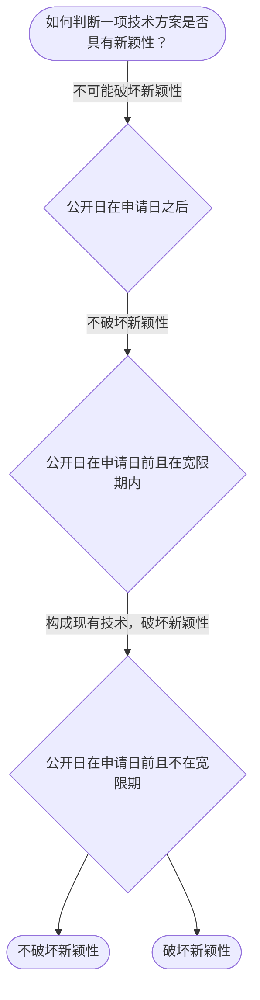

# 专家 B 教学草稿

> 专家：expert_b ｜ 风格：accessible

## 教学模块选择清单

- 当前教学节点：`patent-law-foundation`
- 板块预算：自适应 5/9，总计 9/9

| # | 模块 (block_type) | 类型 | 触发原因 (trigger) | 对应正文段 | 归属 |
|---:|---|:--:|---|---|:--:|
| 1 | `anchor_scenario` | 自适应 | perception=sensing(0.82) / cold_start | 场景导入｜某材料公司研发了一种新型高强度碳纤维复合材料，计划申请发明专利。但担心在即将召开的国际材料展… | [B] |
| 2 | `legal_anchor` | 必选 | mandatory | 法条锚定｜《专利法》第二条 | [B] |
| 3 | `worked_example` | 自适应 | cold_start(low_confidence) | 工作示例｜某公司2024年5月在国内材料展上首次公开了一种新型生物降解材料，2024年11月提出发明专… | [B] |
| 4 | `decision_flow` | 自适应 | input=visual(0.73) | 决策流程｜如何判断一项技术方案是否具有新颖性？ | [B] |
| 5 | `mnemonic` | 自适应 | understanding=sequential(0.70) | 记忆口诀｜三性记忆表：新（未公开）/创（不显见）/实（能用） | [B] |
| 6 | `predict_activate` | 自适应 | processing=active(0.62) | 预测激活｜这个新型材料在展会展示前是否有类似公开？先预测专利能否申请。 | [B] |
| 7 | `assessment` | 必选 | mandatory | 测评｜专利保护的三种客体 | [B] |
| 8 | `knowledge_synthesis` | 必选 | mandatory | 知识综合｜专利保护的三种客体：发明是新的技术方案 | [B] |
| 9 | `summary_card` | 自适应 | len(knowledge_sub_nodes)=3>=3 | 速查卡｜先过保护客体之门，再过三性安检。 | [B] |

## 教学正文

## 1. 场景导入

某材料公司研发了一种新型高强度碳纤维复合材料，计划申请发明专利。但担心在即将召开的国际材料展上展示会破坏新颖性，同时担心该技术是否具备创造性，因为类似材料已有多个公开文献。问：这个申请能否获得专利授权？三性判断该如何进行？

## 2. 人话解释

专利授权的核心是‘授权三性’：新颖性要求技术方案未在申请日前公开；创造性要求对本领域技术人员来说不是显而易见；实用性要求能制造使用并有积极效果。专利法第2条定义发明为新的技术方案。

## 3. 法条回扣

《专利法》第2条：发明，是指对产品、方法或者其改进所提出的新的技术方案。 〔RAG: 专利法专题讲座.txt — 第2条定义发明〕

《专利法》第22条：新颖性、创造性、实用性是授权条件。 〔RAG: 专利法专题讲座.txt — 新颖性和创造性判断〕

## 4. 类比 / 口诀

类比：新颖性像‘你的发明是独家的’（未公开），创造性像‘不是抄袭，是有新意的’（非显而易见）。

口诀：新=未公开、创=不显见、实=能用。

适用边界：口诀帮助记忆，但具体案情需分析事实，不能仅靠口诀判断。

## 5. 应试提示

题干关键词：公开日、申请日、现有技术、显而易见。

判断步骤：1. 检查是否有相同公开；2. 是否在宽限期内；3. 对于创造性，看是否本领域技术人员显而易见。

常见陷阱：忽略宽限期，或把已有公开视为不影响创造性。

## 6. 互动提问

本节设有测评，请到【习题】区作答。


### 场景导入（anchor_scenario）

> 某材料公司研发了一种新型高强度碳纤维复合材料，计划申请发明专利。但担心在即将召开的国际材料展上展示会破坏新颖性，同时担心该技术是否具备创造性，因为类似材料已有多个公开文献。问：这个申请能否获得专利授权？三性判断该如何进行？

**锚定**：用材料领域的具象情境同时锚定保护客体（发明专利）和新颖性、创造性判断两个抽象知识点。

**先想一想**：如果你是专利审查员，看到‘新型碳纤维复合材料’和‘展会展示’，你会先考虑什么风险？是新颖性还是创造性？为什么？

### 法条锚定（legal_anchor）

- **《专利法》第二条**：发明专利保护的对象是新的技术方案。
- **《专利法》第二十二条**：新颖性要求未公开，创造性要求非显而易见，实用性要求能用。

**为何重要**：本节点是授权三性的基础，为后续新颖性和创造性判断提供法条依据，必须掌握。

### 工作示例（worked_example）

**案情/例题**：某公司2024年5月在国内材料展上首次公开了一种新型生物降解材料，2024年11月提出发明专利申请。问：此公开是否破坏新颖性？是否具备创造性？
**适用规则**：《专利法》第二十二条、第二十四条
**分步推演**：
1. 公开日在申请日前，属于中国国内公开。 → *需判断是否在6个月宽限期内。*
2. 宽限期适用范围包括政府或国际展会，但国内材料展可能不一定，需看具体。 → *假设为宽限期内。*
3. 即使在宽限期，不影响创造性判断。 → *创造性仍需审查。*
**结论**：如果在宽限期内不破坏新颖性，但创造性仍需判断是否显而易见。
**本题要点**：宽限期是时间豁免，但实体三性仍需满足，先判断新颖性范围。

### 决策流程（decision_flow）

**决策问题**：如何判断一项技术方案是否具有新颖性？



### 记忆口诀（mnemonic）

**记忆锚**：三性记忆表：新（未公开）/创（不显见）/实（能用）
**映射**：
- 新
- 创
- 实
**何时用**：看到‘授权条件’或‘为什么不给专利’时先过三性表。

### 预测激活（predict_activate）

**预测/激活**：这个新型材料在展会展示前是否有类似公开？先预测专利能否申请。

**激活旧知**：已学的‘现有技术’和‘公开日’概念

**揭晓方向**：先看公开日和申请日谁在前，再看是否有官方展会宽限期。

### 知识综合（knowledge_synthesis）

**知识框架**：
- 专利保护的三种客体：发明是新的技术方案
- 专利制度的作用：激励、公开、应用
- 中国制度特点：早期公开延迟审查
**概念关系**：新颖性是基础，创造性是对现有技术的判断，三者缺一不可
**必记**：授权需三性缺一不可；对于发明专利，先判断新颖性再进入创造性

### 速查卡（summary_card）

**要点卡**：
- **保护客体**：新的技术方案
- **三性**：新、创、实缺一不可
- **宽限期**：特定公开6个月豁免
**必背**：三性缺一不可；先判断新颖性
**一句话总结**：先过保护客体之门，再过三性安检。

### 测评（assessment）

**三类覆盖**：backward_review、forward_probe、weakness_probe
**题目**：
- q1：专利保护的三种客体
- q2：新颖性判断
- q3：宽限期适用
- q4：新颖性 vs 创造性混淆


## 结构化字段

## knowledge_points

```json
[
  {
    "node_id": "patent-law-foundation",
    "kc_name": "专利制度的基本概念与特征：独占性、时间性、地域性（详见子节点 patent-rights-nature）"
  },
  {
    "node_id": "patent-law-foundation",
    "kc_name": "中国专利制度体系：专利法、专利法实施细则、专利审查指南（详见子节点 patent-law-framework）"
  },
  {
    "node_id": "patent-law-foundation",
    "kc_name": "专利保护的三种客体：发明、实用新型、外观设计（专利法第2条）"
  },
  {
    "node_id": "patent-law-foundation",
    "kc_name": "专利制度的作用：激励发明创造、促进技术公开、推动技术应用和经济发展（详见子节点 patent-system-overview）"
  },
  {
    "node_id": "patent-law-foundation",
    "kc_name": "中国专利制度发展历程与特点：早期公开延迟审查、初步审查制与实质审查制并存（详见子节点 patent-system-overview）"
  }
]
```

## legal_basis

```json
[
  {
    "article": "《专利法》第二条",
    "source": "专利法专题讲座.txt"
  },
  {
    "article": "《专利法》第二十二条",
    "source": "专利法专题讲座.txt"
  }
]
```

## risks

```json
[
  {
    "risk": "将公开行为视为不影响新颖性",
    "related_node_id": "patent-law-foundation"
  },
  {
    "risk": "混淆新颖性和创造性",
    "related_node_id": "patent-law-foundation"
  }
]
```

## draft_stage

```json
"debate"
```

## interactive_questions

```json
[
  {
    "qid": "q1",
    "category": "remember",
    "difficulty": "L1",
    "source_tag": "backward_review",
    "kc_node_id": "patent-law-foundation",
    "question": "专利保护的三种客体是什么？",
    "answer": "A",
    "options": [
      "A.发明、实用新型、外观设计",
      "B.只有发明",
      "C.只有实用新型",
      "D.外观设计"
    ]
  },
  {
    "qid": "q2",
    "category": "understand",
    "difficulty": "L1",
    "source_tag": "backward_review",
    "kc_node_id": "patent-law-foundation",
    "question": "新颖性判断的核心是什么？",
    "answer": "B",
    "options": [
      "A.技术方案不是显而易见",
      "B.技术方案未在申请日前公开",
      "C.能制造并有积极效果",
      "D.遵循诚实信用原则"
    ]
  },
  {
    "qid": "q3",
    "category": "apply",
    "difficulty": "L2",
    "source_tag": "forward_probe",
    "kc_node_id": "patent-application-process",
    "question": "如果公开日在申请日前但在宽限期内，是否破坏新颖性？",
    "answer": "A",
    "options": [
      "A.不破坏新颖性",
      "B.一定破坏",
      "C.取决于创造性",
      "D.取决于实用性"
    ]
  },
  {
    "qid": "q4",
    "category": "analyze",
    "difficulty": "L3",
    "source_tag": "weakness_probe",
    "kc_node_id": "patent-law-foundation",
    "question": "下列哪项属于混淆新颖性和创造性的错误？",
    "answer": "C",
    "options": [
      "A.把公开行为视为不影响新颖性",
      "B.认为显而易见的技术是新颖的",
      "C.认为创造性判断和新颖性判断相同",
      "D.忽略实用性"
    ]
  }
]
```

## knowledge_synthesis

```json
{
  "node": "patent-law-foundation",
  "coverage": [
    {
      "node_id": "patent-law-foundation"
    }
  ],
  "confusable_pairs": [
    {
      "pair": "新颖性与创造性"
    }
  ]
}
```
