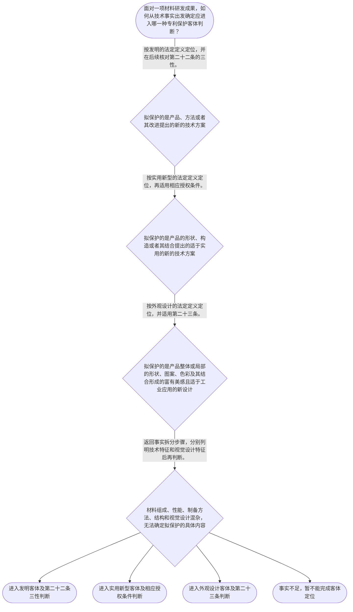

# 整合后的课程完整内容与习题

## 教学模块选择清单

- 当前教学节点：`patent-law-foundation`
- 板块预算：自适应 5/6，总计 9/9

| # | 模块 (block_type) | 类型 | 触发原因 (trigger) | 对应正文段 | 归属 |
|---:|---|:--:|---|---|:--:|
| 1 | `anchor_scenario` | 自适应 | perception=sensing(0.83) / cold_start | 材料研发成果进入专利制度｜某材料研发团队制得一种锂电池正极颗粒：在颗粒表面形成含锆复合包覆层，使循环后的容量保持率提高… | [A+B融合] |
| 2 | `legal_anchor` | 必选 | mandatory | 制度基础的法条锚点｜《中华人民共和国专利法》第二条 | [A+B融合] |
| 3 | `worked_example` | 自适应 | cold_start(low_confidence) | 材料技术成果的客体定位示例｜某材料团队研发了含锆复合包覆层的锂电池正极颗粒，并形成相应制备步骤；样品同时具有特定视觉纹理… | [A+B融合] |
| 4 | `decision_flow` | 自适应 | input=visual(0.74) | 三类保护客体判断流程｜面对一项材料研发成果，如何从技术事实出发确定应进入哪一种专利保护客体判断？ | [A+B融合] |
| 5 | `mnemonic` | 自适应 | understanding=sequential(0.70) | 制度五步表｜制度五步表：客体—规范—主体—条件—程序。每次分析材料专利时按此顺序逐项打勾。 | [A+B融合] |
| 6 | `predict_activate` | 自适应 | processing=active(0.62) | 先拆分成果，再看法定定义｜一项材料成果同时包含新配方、制备步骤、颗粒结构和特殊表面纹理时，你预判应先做哪一步法律判断？ | [B] |
| 7 | `assessment` | 必选 | mandatory | 三类测评索引｜复习专利法第二条规定的三类发明创造。 | [A+B融合] |
| 8 | `knowledge_synthesis` | 必选 | mandatory | 制度基础关系网｜专利制度基本特征：独占性、时间性和地域性是理解专利权制度的基础概念；本节不据此扩展未经检索支… | [A+B融合] |
| 9 | `summary_card` | 自适应 | len(knowledge_sub_nodes)=3>=3 | 专利制度基础速查卡｜材料专利分析先按第二条定位客体，再按对应法条进入三性或外观设计授权条件判断。 | [A+B融合] |

## 教学正文

# 专利法律制度基础

## 一、先建立判断主线

材料领域的专利分析，建议按照“制度定位—客体识别—授权条件—审查程序”的顺序展开。材料名称本身不能决定申请类型，关键是申请人准备保护的具体内容：是材料组成、制备方法等技术方案，还是产品的形状构造，抑或产品的视觉设计。

专利制度的基本特征通常概括为独占性、时间性和地域性。独占性表示专利权人在法定保护范围内享有排他性权利；时间性表示权利受法定期限限制；地域性表示保护原则上以授予专利权的国家或地区为范围。检索上下文未提供上述三项特征的直接法条原文，因此这里将其作为制度理解框架，不把它们扩展为未经核验的具体期限、权利范围或地域规则。

中国专利制度的规范学习框架包括专利法、专利法实施细则和专利审查指南。专利法规定基本制度和授权条件，实施细则补充申请、审查等具体规则，审查指南进一步说明审查标准和判断方法。本节检索材料直接支持专利法关于客体、审查机关和部分授权条件的规则；实施细则和审查指南的具体条文，应在后续对应节点继续核验。

## 二、三类保护客体

《专利法》第二条规定：“本法所称的发明创造是指发明、实用新型和外观设计。”〔RAG: 中华人民共和国专利法.txt — 第二条：本法所称的发明创造是指发明、实用新型和外观设计〕

发明，是对产品、方法或者其改进所提出的新的技术方案。材料的化学组成、材料配方、性能改进、表面处理方案和制备步骤，通常应先围绕产品或方法技术方案进行客体识别，但最终仍应以申请文件实际记载和拟保护的技术特征为准。

实用新型，是对产品的形状、构造或者其结合所提出的适于实用的新的技术方案。材料产品能够制造或使用，并不当然意味着适合实用新型；还要核对其拟保护内容是否落在产品形状、构造或者二者结合的范围内。

外观设计，是对产品整体或者局部的形状、图案或者其结合以及色彩与形状、图案的结合所作出的富有美感并适于工业应用的新设计。〔RAG: 中华人民共和国专利法.txt — 第二条：外观设计是对产品的整体或者局部的形状、图案或者其结合以及色彩与形状、图案的结合所作出的富有美感并适于工业应用的新设计〕材料配方、制备步骤和性能提升属于技术内容，不能仅因产品表面具有纹理或颜色，就把全部技术方案转化为外观设计。

因此，同一研发项目可能包含不同性质的内容。例如，颗粒的化学组成和制备步骤应作为技术方案分析；电极片的特定形状、构造可以另行考察实用新型客体；产品表面的视觉图案或色彩组合则可能涉及外观设计。应先拆分事实，再分别进行法律定位。

## 三、授权条件与新颖性、创造性的入口

《专利法》第二十二条规定，授予专利权的发明和实用新型应当具备新颖性、创造性和实用性。〔RAG: 中华人民共和国专利法.txt — 第二十二条：授予专利权的发明和实用新型，应当具备新颖性、创造性和实用性〕其中，新颖性主要围绕是否属于现有技术以及是否存在抵触申请判断；创造性围绕相对于现有技术是否具有法定程度的实质性特点和进步判断；实用性要求能够制造或者使用，并且能够产生积极效果。〔RAG: 中华人民共和国专利法.txt — 第二十二条：创造性是指与现有技术相比，发明具有突出的实质性特点和显著的进步，实用新型具有实质性特点和进步；实用性是指能够制造或者使用，并且能够产生积极效果〕

现有技术是“申请日以前在国内外为公众所知的技术”。〔RAG: 中华人民共和国专利法.txt — 第二十二条：本法所称现有技术，是指申请日以前在国内外为公众所知的技术〕这构成后续学习新颖性和创造性的时间基准。新颖性与创造性不能混为一谈：新颖性侧重特定现有技术是否已经公开了相关方案，创造性则进一步评价相对于现有技术是否属于本领域技术人员容易想到的改进。关于抵触申请，应单独核对申请日在先、公布或公告在后的同样发明创造，不要简单等同于普通公开在先的现有技术。

外观设计适用专利法第二十三条的专门规则，而不能直接套用第二十二条的三性表述。〔RAG: 中华人民共和国专利法.txt — 第二十三条：外观设计应当不属于现有设计，并与现有设计或者现有设计特征的组合相比具有明显区别〕

## 四、制度作用和审查结构

专利制度通过授予法定期限和地域范围内的排他性权利，换取申请人对技术内容的公开，从而服务于发明创造的保护、传播和后续利用。检索上下文未提供“激励发明创造、促进技术公开、推动技术应用和经济发展”这一完整表述的直接法条原文，因此本节将其作为制度功能的概括性学习框架；其中，检索材料明确提到职务发明创造相关权利的处置可以促进相关发明创造的实施和运用。〔RAG: 中华人民共和国专利法.txt — 第六条：该单位可以依法处置其职务发明创造申请专利的权利和专利权，促进相关发明创造的实施和运用〕

《专利法》第三条规定，国务院专利行政部门负责管理全国的专利工作，统一受理和审查专利申请，并依法授予专利权。〔RAG: 中华人民共和国专利法.txt — 第三条：国务院专利行政部门负责管理全国的专利工作；统一受理和审查专利申请，依法授予专利权〕关于中国制度发展中“早期公开、延迟审查、初步审查制与实质审查制并存”的概括，属于本节点规划要求掌握的制度特点，但检索上下文未提供足以核验其完整时间线和适用范围的直接材料。学习时应记住这是后续程序学习的框架提示，不应据此自行推导具体审查期限、程序顺序或法律后果。

## 五、材料申请的完整基础示例

某材料团队研发了含锆复合包覆层的锂电池正极颗粒，并形成相应制备步骤；样品同时具有特定视觉纹理。提交申请前，团队需要明确各项内容应进入哪一种客体判断，以及后续适用哪一类授权条件。

第一步，拆分事实：正极颗粒的化学组成、包覆层和制备步骤属于技术特征；样品的视觉纹理属于外观表现；若另有产品形状或内部构造改进，还应将其单独列明。

第二步，适用第二条：组成、包覆层和制备步骤应先考察是否属于对产品、方法或其改进提出的新的技术方案；形状、构造及其结合才进入实用新型的客体判断；视觉纹理则考察是否符合外观设计定义。

第三步，进入相应授权条件：对定位为发明或实用新型的技术方案，适用第二十二条的新颖性、创造性和实用性要求；对外观设计则适用第二十三条的现有设计、明显区别及在先合法权利规则。

第四步，确定时间基准：后续判断新颖性和创造性时，先确定申请日，再核对申请日前公众是否已经知悉相关技术，并进一步区分普通现有技术与抵触申请。

结论是：材料组成和制备步骤不能因为样品具有视觉纹理就整体归入外观设计；应先按拟保护内容分别定位客体，再进入各自的授权条件判断。这个示例训练的是“拆分技术事实—对应法定定义—选择授权规则—确定时间基准”的连续推理。

## 六、线性记忆与易错边界

可以使用“客体—规范—主体—条件—程序”五步表：先按第二条识别三类客体；再以专利法、实施细则和审查指南组成规范框架；由国务院专利行政部门统一受理和审查；对发明和实用新型核对三性；最后把具体程序问题留到程序节点核验。口诀只用于检索思路，不替代法条。

最常见的错误是把“材料产品”一概视为实用新型。正确推理不是看产品名称，而是看权利要求拟保护的是材料组成、方法等技术方案，还是产品形状、构造。另一个错误是认为新颖性成立就必然授权；正确判断是发明和实用新型还须同时满足创造性和实用性。还要区分新颖性与创造性：前者以现有技术公开和抵触申请为核心，后者评价相对于现有技术的实质性特点和进步。外观设计则适用第二十三条的专门条件。

本节设有测评，请到【习题】区作答。

### 材料研发成果进入专利制度（anchor_scenario）

> 某材料研发团队制得一种锂电池正极颗粒：在颗粒表面形成含锆复合包覆层，使循环后的容量保持率提高。团队准备把材料组成、制备工艺和具有特殊纹理的电极片一起申请专利，但不确定这些内容分别属于哪种保护客体，也不清楚后续应适用哪类授权条件。

**锚定**：该情境把材料技术事实、三类保护客体、三性授权条件和审查程序入口连接起来。

**先想一想**：面对材料组成、制备步骤、产品构造和视觉纹理，你会先按什么标准拆分并定位保护客体？

### 制度基础的法条锚点（legal_anchor）

- **《中华人民共和国专利法》第二条**：第二条把发明创造分为发明、实用新型和外观设计，并分别规定其保护对象。
- **《中华人民共和国专利法》第三条**：第三条明确国务院专利行政部门统一受理和审查专利申请，并依法授予专利权。
- **《中华人民共和国专利法》第二十二条**：第二十二条规定发明和实用新型必须同时满足新颖性、创造性和实用性，并确定现有技术的申请日时间基准。
- **《中华人民共和国专利法》第二十三条**：第二十三条规定外观设计应满足现有设计、明显区别和在先合法权利等专门条件。

**为何重要**：第二条决定材料成果先进入哪一类客体判断，第二十二条和第二十三条决定后续分别适用哪套授权条件；第三条帮助定位审查制度主体。

### 材料技术成果的客体定位示例（worked_example）

**案情/例题**：某材料团队研发了含锆复合包覆层的锂电池正极颗粒，并形成相应制备步骤；样品同时具有特定视觉纹理。提交申请前，团队需要判断各项内容属于哪一种专利保护客体，以及后续适用哪类授权条件。
**适用规则**：《中华人民共和国专利法》第二条、第二十二条和第二十三条：分别规定发明、实用新型、外观设计的定义，以及发明和实用新型的三性条件、外观设计的专门条件。
**分步推演**：
1. 先把化学组成、包覆层、制备步骤、产品形状构造和视觉纹理分别列为技术特征或视觉设计特征，避免用“材料产品”这一名称替代法律分析。 → *先拆分研发事实。*
2. 化学组成、包覆层和制备步骤应围绕产品、方法或其改进的技术方案考察；如果另有产品形状、构造或其结合，才进一步考察实用新型客体。 → *技术内容对应发明或实用新型的客体判断。*
3. 视觉纹理应核对其是否属于产品整体或局部的形状、图案、色彩等富有美感并适于工业应用的新设计，不能仅因技术产品有外观就把配方和方法归入外观设计。 → *视觉内容单独进行外观设计定位。*
4. 定位为发明或实用新型后，按照第二十二条核对新颖性、创造性和实用性；定位为外观设计后，按照第二十三条核对现有设计、明显区别及在先合法权利。 → *客体定位之后选择对应授权条件。*
**结论**：该项目的材料组成、复合包覆结构和制备步骤应首先作为技术方案进行客体判断；视觉纹理只有在符合外观设计定义时才进入外观设计规则。不同内容不能仅凭同一产品名称合并适用一套审查标准。
**本题要点**：训练“拆分事实—对应定义—选择规则”的基础能力，是后续分析新颖性和创造性的前提。

### 三类保护客体判断流程（decision_flow）

**决策问题**：面对一项材料研发成果，如何从技术事实出发确定应进入哪一种专利保护客体判断？



### 制度五步表（mnemonic）

**记忆锚**：制度五步表：客体—规范—主体—条件—程序。每次分析材料专利时按此顺序逐项打勾。
**映射**：
- 客体
- 规范
- 主体
- 条件
- 程序
**何时用**：阅读材料研发成果、分析授权门槛或进入新颖性和创造性专题前，先用五步表确定自己正在判断的层次。

### 先拆分成果，再看法定定义（predict_activate）

**预测/激活**：一项材料成果同时包含新配方、制备步骤、颗粒结构和特殊表面纹理时，你预判应先做哪一步法律判断？

**激活旧知**：已有的材料研发事实分类经验，以及对产品、方法、结构和外观的日常区分。

**揭晓方向**：先问申请人究竟要保护哪些技术特征或视觉特征，再把这些内容分别对应到第二条的定义。

### 制度基础关系网（knowledge_synthesis）

**知识框架**：
- 专利制度基本特征：独占性、时间性和地域性是理解专利权制度的基础概念；本节不据此扩展未经检索支持的具体边界。
- 中国专利制度体系：专利法提供基本制度和授权条件，实施细则与审查指南构成配套学习框架；具体适用仍需核对原文。
- 三类保护客体：第二条规定发明、实用新型和外观设计，三者的法定定义和保护重点不同。
- 专利制度作用：通过专利权保护和技术公开促进发明创造的实施利用；“激励、公开、应用和经济发展”作为总体功能概括，具体表述需继续核验。
- 审查结构特点：规划要求掌握早期公开、延迟审查以及初步审查和实质审查并存这一发展特点，但当前检索材料不足以支持具体程序时间线，须在程序节点核验。
**概念关系**：客体定位是进入授权条件判断的前提，不能先凭产品名称选择申请类型。；发明或实用新型定位后进入第二十二条，外观设计定位后进入第二十三条。；确定申请日是后续判断现有技术、新颖性和创造性的时间基础；具体申请日规则属于下一程序节点。
**必记**：材料专利分析先拆分研发事实，再依据第二条定位发明、实用新型或外观设计。；发明和实用新型须具备新颖性、创造性和实用性；外观设计适用第二十三条的专门条件。；现有技术以申请日以前在国内外为公众所知的技术为时间基准，抵触申请不能简单等同于普通公开在先。；中国专利法、实施细则和审查指南应作为层次不同但相互配合的规范学习框架。

### 专利制度基础速查卡（summary_card）

**要点卡**：
- **专利权特征**：独占性、时间性、地域性是制度理解框架，具体权利边界须结合核验后的规则。
- **规范体系**：专利法定基本制度，实施细则和审查指南补充具体申请与审查规则。
- **保护客体**：第二条规定发明、实用新型和外观设计，必须按实际拟保护内容定位。
- **三性入口**：发明和实用新型须同时具备新颖性、创造性和实用性。
- **时间基准**：现有技术以申请日以前在国内外为公众所知的技术为基准。
- **程序衔接**：本节建立审查制度入口，早期公开、延迟审查及审查阶段细节留待程序节点。
**必背**：《专利法》第二条规定发明创造包括发明、实用新型和外观设计。；发明和实用新型的授权条件包括新颖性、创造性和实用性。；现有技术是申请日以前在国内外为公众所知的技术。；技术方案与视觉设计应分别定位，不能仅凭材料产品名称选择客体。
**一句话总结**：材料专利分析先按第二条定位客体，再按对应法条进入三性或外观设计授权条件判断。

### 三类测评索引（assessment）

**三类覆盖**：backward_review、forward_probe、weakness_probe
**题目**：
- q_foundation_review_l1：复习专利法第二条规定的三类发明创造。
- q_application_forward_l1：探测专利申请程序节点中的申请日确定规则。
- q_foundation_weakness_l3：辨析材料技术方案、实用新型和外观设计的客体边界。


## 结构化数据

## expert

```json
"A+B融合"
```

## style

```json
"fused"
```

## knowledge_points

```json
[
  {
    "node_id": "patent-law-foundation",
    "kc_name": "专利制度的基本概念与特征：独占性、时间性、地域性"
  },
  {
    "node_id": "patent-law-foundation",
    "kc_name": "中国专利制度体系：专利法、专利法实施细则、专利审查指南"
  },
  {
    "node_id": "patent-law-foundation",
    "kc_name": "专利保护的三种客体：发明、实用新型、外观设计（专利法第2条）"
  },
  {
    "node_id": "patent-law-foundation",
    "kc_name": "专利制度的作用：激励发明创造、促进技术公开、推动技术应用和经济发展"
  },
  {
    "node_id": "patent-law-foundation",
    "kc_name": "中国专利制度发展历程与特点：早期公开延迟审查、初步审查制与实质审查制并存"
  }
]
```

## legal_basis

```json
[
  {
    "article": "《中华人民共和国专利法》第二条：本法所称的发明创造是指发明、实用新型和外观设计；并分别规定三者的法定定义。",
    "source": "中华人民共和国专利法.txt：第二条"
  },
  {
    "article": "《中华人民共和国专利法》第三条：国务院专利行政部门负责管理全国的专利工作；统一受理和审查专利申请，依法授予专利权。",
    "source": "中华人民共和国专利法.txt：第三条"
  },
  {
    "article": "《中华人民共和国专利法》第二十二条：发明和实用新型应当具备新颖性、创造性和实用性；现有技术是申请日以前在国内外为公众所知的技术。",
    "source": "中华人民共和国专利法.txt：第二十二条"
  },
  {
    "article": "《中华人民共和国专利法》第二十三条：外观设计的授权条件包括不属于现有设计、无抵触申请、与现有设计或现有设计特征的组合相比具有明显区别，且不得与他人在申请日前已经取得的合法权利相冲突。",
    "source": "中华人民共和国专利法.txt：第二十三条"
  },
  {
    "article": "《中华人民共和国专利法》第一条及第六条所反映的制度目的和功能：专利制度服务于促进科技进步和创新；职务发明创造的专利权利处置可以促进相关发明创造的实施和运用。",
    "source": "专利法律知识详细解读.txt：相关制度目的说明；中华人民共和国专利法.txt：第六条"
  }
]
```

## risks

```json
[
  {
    "risk": "把独占性、时间性、地域性这一制度概括误当作本节已核验的具体期限、权利范围或地域规则。",
    "related_node_id": "patent-law-foundation"
  },
  {
    "risk": "把材料组成、制备方法、产品形状构造和视觉设计混为一谈，导致保护客体定位错误。",
    "related_node_id": "patent-law-foundation"
  },
  {
    "risk": "把新颖性等同于创造性，或把普通现有技术与申请日在先但公布在后的抵触申请混同。",
    "related_node_id": "patent-law-foundation"
  },
  {
    "risk": "将专利制度作用和审查程序的概括性框架扩展为未经检索材料支持的具体法律结论。",
    "related_node_id": "patent-law-foundation"
  }
]
```

## draft_stage

```json
"integration"
```

## irac

```json
{
  "issue": "材料领域研发成果申请专利时，如何先确定保护客体和制度审查入口，并为后续新颖性、创造性判断建立正确的法律框架？",
  "rule": "《专利法》第二条将发明创造分为发明、实用新型和外观设计并分别规定定义；第三条规定国务院专利行政部门统一受理和审查专利申请；第二十二条规定发明和实用新型须具备新颖性、创造性和实用性，并以申请日以前在国内外为公众所知的技术作为现有技术；第二十三条规定外观设计的专门授权条件。",
  "application": "应先将材料组成、制备步骤、产品形状构造和视觉设计拆分为具体事实，再与第二条的定义逐项对应。定位为发明或实用新型的技术方案进入第二十二条的三性判断，定位为外观设计的内容进入第二十三条判断；后续新颖性和创造性分析必须先确定申请日，并区分现有技术与抵触申请。",
  "conclusion": "本节点的正确主线是“客体定位—规范框架—审查主体—授权条件—程序衔接”。材料领域的新颖性和创造性学习应以第二十二条为入口，但不能跳过第二条的客体识别，也不能把外观设计规则与发明、实用新型规则混用。"
}
```

## interactive_questions

```json
[
  {
    "qid": "q_foundation_review_l1",
    "category": "remember",
    "difficulty": "L1",
    "source_tag": "backward_review",
    "kc_node_id": "patent-law-foundation",
    "question": "依据《中华人民共和国专利法》第二条，下列哪一组属于本法所称的发明创造？",
    "answer": "A",
    "options": [
      "A. 发明、实用新型和外观设计",
      "B. 发明、商标和著作权",
      "C. 实用新型、商业秘密和集成电路布图设计",
      "D. 发明、植物新品种和地理标志"
    ]
  },
  {
    "qid": "q_application_forward_l1",
    "category": "understand",
    "difficulty": "L1",
    "source_tag": "forward_probe",
    "kc_node_id": "patent-application-process",
    "question": "依据《中华人民共和国专利法》第二十八条，关于专利申请日的确定，下列哪项正确？",
    "answer": "B",
    "options": [
      "A. 以申请人完成研发实验之日为申请日",
      "B. 以国务院专利行政部门收到专利申请文件之日为申请日；邮寄申请以寄出邮戳日为申请日",
      "C. 以专利申请公布之日为申请日",
      "D. 以申请人缴纳申请费之日为申请日"
    ]
  },
  {
    "qid": "q_foundation_weakness_l3",
    "category": "analyze",
    "difficulty": "L3",
    "source_tag": "weakness_probe",
    "kc_node_id": "patent-law-foundation",
    "question": "某申请拟保护材料颗粒的化学组成、表面包覆结构及制备步骤，样品还具有特定视觉纹理。下列制度基础判断最准确的是？",
    "answer": "C",
    "options": [
      "A. 只要材料产品能够制造，就当然属于实用新型，不必考察拟保护的技术内容",
      "B. 只要材料产品具有美观纹理，就应将全部配方和制备步骤作为外观设计处理",
      "C. 化学组成、包覆结构和制备方法应先按第二条考察其是否属于产品、方法或改进的技术方案；视觉纹理另行考察外观设计客体，之后再进入相应授权条件判断",
      "D. 三类客体的法定定义相同，申请人可以仅按成果名称自由选择"
    ]
  }
]
```

## knowledge_synthesis

```json
{
  "node": "patent-law-foundation",
  "coverage": [
    {
      "node_id": "patent-law-foundation"
    }
  ],
  "confusable_pairs": [
    {
      "pair": "发明与实用新型：发明涵盖产品、方法或者其改进提出的新的技术方案；实用新型限于产品的形状、构造或者其结合提出的适于实用的新的技术方案。"
    },
    {
      "pair": "技术方案与外观设计：材料组成、性能和制备步骤是技术内容；外观设计针对产品整体或局部的形状、图案、色彩及其结合形成的视觉设计。"
    },
    {
      "pair": "新颖性与创造性：新颖性重点看现有技术或抵触申请是否公开相关方案；创造性进一步看相对于现有技术是否具有法定程度的实质性特点和进步。"
    },
    {
      "pair": "现有技术与抵触申请：现有技术是申请日前已为公众所知的技术；抵触申请是申请日前他人提出、申请日后公布或公告的同样发明创造，二者判断路径不能混同。"
    },
    {
      "pair": "专利法与程序规范：专利法规定基本制度，实施细则和审查指南补充具体申请与审查规则；具体程序结论须以相应原文为依据。"
    }
  ]
}
```
