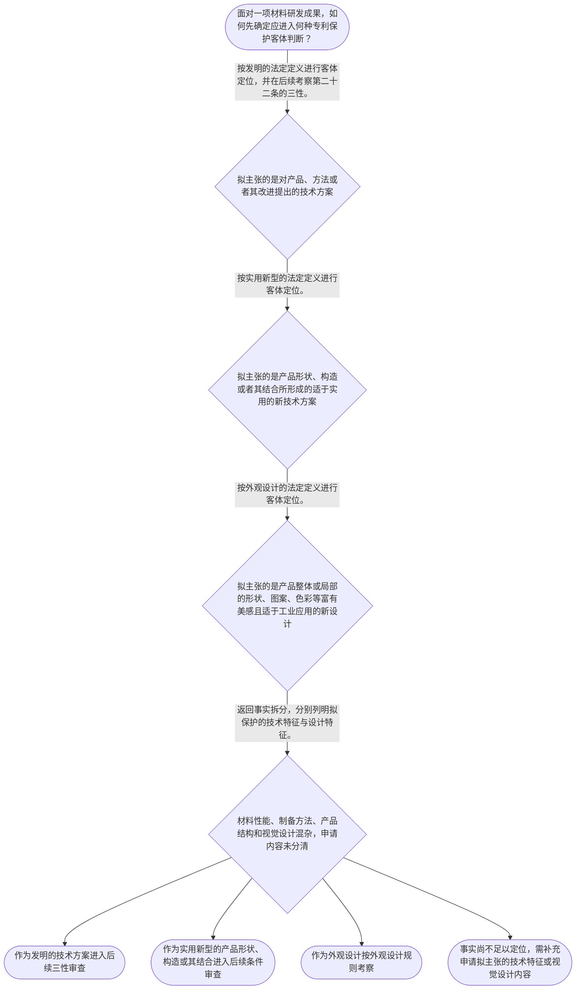

# 专家 A 教学草稿

> 专家：expert_a ｜ 风格：conservative

## 教学模块选择清单

- 当前教学节点：`patent-law-foundation`
- 板块预算：自适应 6/6，总计 9/9

| # | 模块 (block_type) | 类型 | 触发原因 (trigger) | 对应正文段 | 归属 |
|---:|---|:--:|---|---|:--:|
| 1 | `anchor_scenario` | 自适应 | perception=sensing(0.83) / cold_start | 材料研发成果进入专利制度｜某材料研发团队制得一种锂电池正极颗粒：在颗粒表面形成含锆复合包覆层，使循环后的容量保持率提高… | [A] |
| 2 | `legal_anchor` | 必选 | mandatory | 制度基础的法条锚点｜《中华人民共和国专利法》第二条 | [A] |
| 3 | `worked_example` | 自适应 | cold_start(low_confidence) | 材料技术成果的客体定位示例｜某团队制得含锆复合包覆层的锂电池正极颗粒，并设计相应制备步骤。团队同时制作了具有特殊纹理的电… | [A] |
| 4 | `decision_flow` | 自适应 | input=visual(0.74) | 三类保护客体判断流程｜面对一项材料研发成果，如何先确定应进入何种专利保护客体判断？ | [A] |
| 5 | `mnemonic` | 自适应 | understanding=sequential(0.70) | 制度五步表｜制度五步表：客体、规范、主体、条件、程序。 | [A] |
| 6 | `predict_activate` | 自适应 | processing=active(0.62) | 先拆分成果，再看法定定义｜在阅读法条前，先把一项材料成果中的“配方或组成”“制备步骤”“产品结构”“产品视觉设计”分别… | [A] |
| 7 | `assessment` | 必选 | mandatory | 三类测评索引｜复习专利法第二条规定的三类发明创造。 | [A] |
| 8 | `knowledge_synthesis` | 必选 | mandatory | 制度基础关系网｜专利制度的基本特征：独占性、时间性和地域性是理解专利权制度的基础概念；检索上下文未提供这些特… | [A] |
| 9 | `summary_card` | 自适应 | len(knowledge_sub_nodes)=3>=3 | 专利制度基础速查卡｜材料专利审查先按第二条定位保护客体，再以第二十二条为后续三性判断的入口。 | [A] |

## 教学正文

## I — 法律问题

材料研发成果拟申请专利时，首先要解决的并不是直接判断“新颖性”或“创造性”，而是识别申请拟保护的对象属于何种法定保护客体，并定位其将接受何种制度性审查。对于材料颗粒、制备方法、产品结构改进和产品视觉设计混合出现的情形，必须避免用成果名称代替法律分类。

## R — 适用规则

《中华人民共和国专利法》第二条规定，本法所称发明创造包括发明、实用新型和外观设计。发明是对产品、方法或者其改进提出的新的技术方案；实用新型是对产品的形状、构造或者其结合提出的适于实用的新的技术方案；外观设计是对产品整体或者局部的形状、图案或者其结合，以及色彩与形状、图案结合所作出的富有美感并适于工业应用的新设计。〔RAG: 中华人民共和国专利法.txt — 第二条：发明创造是指发明、实用新型和外观设计，并分别界定三者〕

国务院专利行政部门负责管理全国专利工作，统一受理和审查专利申请，并依法授予专利权。〔RAG: 中华人民共和国专利法.txt — 第三条：统一受理和审查专利申请，依法授予专利权〕

发明和实用新型获得专利权应当具备新颖性、创造性和实用性。新颖性要求该发明或者实用新型不属于现有技术，且不存在申请日前已由他人提出、但在申请日后公布或公告的同样发明创造的法定情形；创造性以与现有技术相比是否具有法定程度的实质性特点和进步为判断对象；实用性要求能够制造或者使用，并能够产生积极效果。现有技术是申请日以前在国内外为公众所知的技术。〔RAG: 中华人民共和国专利法.txt — 第二十二条：新颖性、创造性、实用性及现有技术定义〕

本节点的规范体系应理解为以专利法为核心，并结合专利法实施细则、专利审查指南学习。关于实施细则和审查指南的具体条文内容，检索上下文未提供直接依据，不能在本节据此作出具体规则断言。

独占性、时间性、地域性是专利制度的基础概念，可用于建立制度认识；但检索上下文未提供其具体法律边界的直接依据，本节不将其扩展为具体权利范围。关于专利制度激励发明创造、促进技术公开、推动技术应用和经济发展的完整立法表述，检索上下文亦未提供直接依据。已检索到的第六条仅明确单位可以依法处置职务发明创造申请专利的权利和专利权，以促进相关发明创造的实施和运用。〔RAG: 中华人民共和国专利法.txt — 第六条：促进相关发明创造的实施和运用〕

## A — 规则适用

以材料研发项目为例，应先逐项拆分申请拟主张的内容。若核心是材料颗粒的组成、表面包覆层、性能改进或制备步骤，应先考察这些内容是否构成对产品、方法或者其改进提出的技术方案；这对应发明的法定定义。〔RAG: 中华人民共和国专利法.txt — 第二条：发明是对产品、方法或者其改进所提出的新的技术方案〕

若拟主张的重点是产品的形状、构造或二者结合所形成的适于实用的新技术方案，再依实用新型的法定定义判断。不能因为技术成果可制造，就当然把它归为实用新型；仍须核对其是否落在“产品的形状、构造或者其结合”的法定范围内。〔RAG: 中华人民共和国专利法.txt — 第二条：实用新型的定义〕

若拟主张的是产品整体或局部的形状、图案、色彩等视觉设计，则应按外观设计定义定位。材料性能、化学组成和制备步骤本身并不会因为产品具有美观纹理而自动转化为外观设计。〔RAG: 中华人民共和国专利法.txt — 第二条：外观设计的定义〕

完成客体定位后，对发明和实用新型才进入第二十二条规定的授权条件入口：先确认申请日前的技术公开范围，再在后续节点分别学习新颖性和创造性的具体判断方法。申请日之所以重要，是因为现有技术的法定时间界限以申请日为基准；下一节点将进一步学习申请日的确定规则。〔RAG: 中华人民共和国专利法.txt — 第二十二条：现有技术是申请日以前在国内外为公众所知的技术〕

本节知识点中涉及“早期公开延迟审查、初步审查制与实质审查制并存”的内容，当前检索上下文未提供直接依据。现阶段只能确认国务院专利行政部门统一受理和审查专利申请，不能据此推导具体程序阶段、审查对象或时间顺序。〔RAG: 中华人民共和国专利法.txt — 第三条：统一受理和审查专利申请〕

## C — 结论

材料领域专利申请的基础判断顺序是：先拆分研发事实，依第二条定位发明、实用新型或外观设计，再确定其进入相应审查框架。对于发明和实用新型，第二十二条的三性是后续学习新颖性与创造性的法定入口，现有技术则以申请日以前公众已知的技术为时间基准。〔RAG: 中华人民共和国专利法.txt — 第二条、第二十二条：三类客体与三性、现有技术定义〕

> 常见误区 / 易混淆点
>
> 误区一：把“材料产品”一概视为实用新型。判断关键是申请拟主张的技术内容是否限于产品形状、构造或其结合，而不是产品名称。
>
> 误区二：认为“有新颖性”就等于“能授权”。对发明和实用新型而言，新颖性、创造性、实用性均为授权条件，不能相互替代。〔RAG: 中华人民共和国专利法.txt — 第二十二条：应当具备新颖性、创造性和实用性〕
>
> 误区三：把外观设计的判断规则与发明、实用新型的三性规则混用。外观设计在专利法中有单独的授权条件规定，本节不以第二十二条替代其规则。
>
> 误区四：把程序结构当作已核验的法条结论。对于早期公开、延迟审查、初步审查和实质审查的具体制度内容，需要在对应程序节点依据直接材料继续核验。

本节设有测评，请到【习题】区作答。

### 材料研发成果进入专利制度（anchor_scenario）

> 某材料研发团队制得一种锂电池正极颗粒：在颗粒表面形成含锆复合包覆层，使循环后的容量保持率提高。团队准备把“颗粒材料”“电极片”和“制备工艺”一起提交专利申请，但不确定这些成果在专利制度中分别应按何种保护客体理解，也不清楚后续审查会从哪些法律层面判断能否授权。

研发负责人希望先确认：专利制度究竟保护什么、审查机关依据哪些规范审查、发明与实用新型及外观设计的边界在哪里。上述问题构成本节进入新颖性、创造性审查之前必须建立的制度坐标。

**锚定**：该情境锚定专利保护客体、制度规范体系与授权条件在材料专利申请中的先后关系。

**先想一想**：面对同一项材料研发成果，应先判断其属于何种专利保护客体，还是先讨论其是否具有新颖性？

### 制度基础的法条锚点（legal_anchor）

- **《中华人民共和国专利法》第二条**：专利法所称发明创造分为发明、实用新型和外观设计；三者的法定定义不同。
- **《中华人民共和国专利法》第三条**：国务院专利行政部门统一受理和审查专利申请，并依法授予专利权。
- **《中华人民共和国专利法》第二十二条**：发明和实用新型获得授权须具备新颖性、创造性和实用性；现有技术以申请日前国内外为公众所知的技术为界。

**为何重要**：第二条确定材料技术方案能否进入相应保护客体的判断起点；第三条定位受理、审查和授权的制度主体；第二十二条则为后续新颖性与创造性学习提供授权条件的法条锚点。

### 材料技术成果的客体定位示例（worked_example）

**案情/例题**：某团队制得含锆复合包覆层的锂电池正极颗粒，并设计相应制备步骤。团队同时制作了具有特殊纹理的电极片样品。现需在提交前区分：哪些内容首先应作为技术方案考察，哪些内容可能涉及外观设计，并明确后续授权审查的入口。
**适用规则**：《中华人民共和国专利法》第二条：发明是对产品、方法或者其改进提出的新的技术方案；实用新型是对产品的形状、构造或者其结合提出的适于实用的新的技术方案。
**分步推演**：
1. 先把技术成果拆分为材料颗粒、制备步骤和产品视觉设计三类事实，避免把技术性能改进与产品视觉设计混为一谈。 → *先拆分事实对象。*
2. 材料颗粒属于产品层面的技术内容，制备步骤属于方法层面的技术内容；第二条将对产品、方法或者其改进提出的新的技术方案界定为发明。 → *产品和方法技术方案优先进入发明客体判断。*
3. 实用新型的法定定义限于产品的形状、构造或者其结合；外观设计则针对产品整体或局部的形状、图案、色彩等富有美感并适于工业应用的新设计。应根据申请中实际主张的技术特征或视觉设计分别判断。 → *实用新型与外观设计均不能替代对材料技术方案的准确表述。*
4. 只有在保护客体定位后，发明和实用新型才依第二十二条接受新颖性、创造性和实用性审查。 → *客体定位在前，三性审查在后。*
**结论**：该团队对“含锆复合包覆层的正极颗粒”及其制备步骤所主张的技术内容，应首先按照第二条考察其是否构成对产品、方法或改进的技术方案；仅凭“电极片外观较美观”不能当然把技术改进归入外观设计。其后才进入第二十二条规定的新颖性、创造性和实用性审查。
**本题要点**：材料专利分析的起步顺序是先识别技术成果及其法定客体，再进入授权实质条件。

### 三类保护客体判断流程（decision_flow）

**决策问题**：面对一项材料研发成果，如何先确定应进入何种专利保护客体判断？



### 制度五步表（mnemonic）

**记忆锚**：制度五步表：客体、规范、主体、条件、程序。
**映射**：
- 客体
- 规范
- 主体
- 条件
- 程序
**何时用**：阅读材料研发项目的专利申请方案或学习后续新颖性、创造性规则时，先按五步表定位正在处理的问题。

### 先拆分成果，再看法定定义（predict_activate）

**预测/激活**：在阅读法条前，先把一项材料成果中的“配方或组成”“制备步骤”“产品结构”“产品视觉设计”分别标为技术方案或视觉设计，并预判其可能对应的保护客体。

**激活旧知**：材料研发中对产品组成、制备方法、结构改进和外观呈现进行事实拆分的已有经验。

**揭晓方向**：关键不在成果名称，而在申请拟主张的对象是否是产品、方法、形状构造，或产品的视觉设计。

### 制度基础关系网（knowledge_synthesis）

**知识框架**：
- 专利制度的基本特征：独占性、时间性和地域性是理解专利权制度的基础概念；检索上下文未提供这些特征的直接条文依据，本节不将其扩展为具体权利边界。
- 中国专利制度规范体系：专利法、专利法实施细则和专利审查指南共同构成学习框架；本节已检索材料直接确认专利法中有关客体、主管机关和授权条件的规则。
- 三类保护客体：发明、实用新型、外观设计具有不同法定定义，材料技术方案须按实际主张内容准确定位。
- 制度作用：专利制度与发明创造的实施和运用有关；第六条提及单位可依法处置职务发明创造申请专利的权利和专利权，以促进实施和运用。关于激励、技术公开及经济发展的具体立法表述，检索上下文未提供直接依据。
- 制度发展与审查结构：本节仅确认国务院专利行政部门统一受理和审查专利申请；对于早期公开延迟审查、初步审查制与实质审查制并存的具体规则，检索上下文未提供直接依据。
**概念关系**：先识别发明创造的法定客体，再确定其进入何种审查规则。；对于发明和实用新型，客体判断之后才进入第二十二条的新颖性、创造性和实用性判断。；审查机关的制度定位由第三条提供，具体申请程序规则属于下一节点的探测范围。
**必记**：发明、实用新型和外观设计不是可任意互换的标签，应以第二条的法定定义定位。；发明和实用新型的授权条件包括新颖性、创造性和实用性。；现有技术是申请日以前在国内外为公众所知的技术，这是后续学习新颖性和创造性的时间基准。

### 专利制度基础速查卡（summary_card）

**要点卡**：
- **专利权特征**：独占性、时间性、地域性是制度基础概念；其具体权利边界需在后续规则中核验。
- **规范体系**：以专利法为核心，并结合实施细则和审查指南理解审查规则。
- **保护客体**：第二条规定发明创造包括发明、实用新型和外观设计，定义各不相同。
- **审查主体**：国务院专利行政部门统一受理和审查专利申请，并依法授予专利权。
- **三性入口**：发明和实用新型须具备新颖性、创造性和实用性，现有技术以申请日前公众已知技术为界。
**必背**：《中华人民共和国专利法》第二条所称发明创造包括发明、实用新型和外观设计。；发明和实用新型授权须具备新颖性、创造性和实用性。；现有技术是申请日以前在国内外为公众所知的技术。
**一句话总结**：材料专利审查先按第二条定位保护客体，再以第二十二条为后续三性判断的入口。

### 三类测评索引（assessment）

**三类覆盖**：backward_review、forward_probe、weakness_probe
**题目**：
- q_foundation_review_l1：复习专利法第二条规定的三类发明创造。
- q_application_forward_l1：探测下一节点中的申请日确定规则。
- q_foundation_weakness_l3：辨析材料技术方案、实用新型与外观设计的制度边界。


## 结构化字段

## knowledge_points

```json
[
  {
    "node_id": "patent-law-foundation",
    "kc_name": "专利制度的基本概念与特征：独占性、时间性、地域性"
  },
  {
    "node_id": "patent-law-foundation",
    "kc_name": "中国专利制度体系：专利法、专利法实施细则、专利审查指南"
  },
  {
    "node_id": "patent-law-foundation",
    "kc_name": "专利保护的三种客体：发明、实用新型、外观设计"
  },
  {
    "node_id": "patent-law-foundation",
    "kc_name": "专利制度的作用：激励发明创造、促进技术公开、推动技术应用和经济发展"
  },
  {
    "node_id": "patent-law-foundation",
    "kc_name": "中国专利制度发展历程与特点：早期公开延迟审查、初步审查制与实质审查制并存"
  }
]
```

## legal_basis

```json
[
  {
    "article": "《中华人民共和国专利法》第二条：本法所称的发明创造是指发明、实用新型和外观设计，并分别规定三者定义。",
    "source": "中华人民共和国专利法.txt：第二条"
  },
  {
    "article": "《中华人民共和国专利法》第三条：国务院专利行政部门负责管理全国的专利工作；统一受理和审查专利申请，依法授予专利权。",
    "source": "中华人民共和国专利法.txt：第三条"
  },
  {
    "article": "《中华人民共和国专利法》第二十二条：发明和实用新型应具备新颖性、创造性和实用性；现有技术是申请日以前在国内外为公众所知的技术。",
    "source": "中华人民共和国专利法.txt：第二十二条"
  },
  {
    "article": "《中华人民共和国专利法》第二十八条：国务院专利行政部门收到专利申请文件之日为申请日；邮寄申请以寄出邮戳日为申请日。",
    "source": "中华人民共和国专利法.txt：第二十八条"
  }
]
```

## risks

```json
[
  {
    "risk": "将“独占性、时间性、地域性”的概念性表述误当作本节已确定的具体权利范围；检索上下文未提供其直接条文依据。",
    "related_node_id": "patent-law-foundation"
  },
  {
    "risk": "将材料技术方案、产品形状构造和产品视觉设计混同，导致错误选择发明、实用新型或外观设计的客体路径。",
    "related_node_id": "patent-law-foundation"
  },
  {
    "risk": "把第二十二条的新颖性、创造性、实用性直接套用于外观设计，忽略外观设计适用第二十三条的不同条件。",
    "related_node_id": "patent-law-foundation"
  },
  {
    "risk": "将早期公开延迟审查、初步审查制与实质审查制并存视为已在本节法条材料中得到完整证明；当前检索上下文未提供其直接依据。",
    "related_node_id": "patent-law-foundation"
  }
]
```

## draft_stage

```json
"debate"
```

## irac

```json
{
  "issue": "材料领域研发成果申请专利时，如何在学习新颖性和创造性之前，确定专利制度的保护客体、审查主体及发明和实用新型的授权条件入口？",
  "rule": "《中华人民共和国专利法》第二条规定，本法所称发明创造包括发明、实用新型和外观设计，并分别规定其定义。第三条规定国务院专利行政部门统一受理和审查专利申请，依法授予专利权。第二十二条规定，授予专利权的发明和实用新型应具备新颖性、创造性和实用性，并界定现有技术为申请日以前在国内外为公众所知的技术。",
  "application": "对材料研发成果，应先按其实际拟主张的内容拆分为产品、方法、产品形状或构造、以及产品视觉设计等事实，再与第二条的法定定义对应。若定位为发明或实用新型，才以第二十二条所定新颖性、创造性和实用性作为后续授权审查入口。国务院专利行政部门统一受理和审查申请的制度定位，说明申请人需要在法定审查框架内提出并接受审查。",
  "conclusion": "本节应先建立“客体定位—审查主体—授权条件”的基础框架。材料领域的新颖性和创造性判断以第二十二条为后续核心，但不能跳过第二条对技术成果保护客体的识别。"
}
```

## interactive_questions

```json
[
  {
    "qid": "q_foundation_review_l1",
    "category": "remember",
    "difficulty": "L1",
    "source_tag": "backward_review",
    "kc_node_id": "patent-law-foundation",
    "question": "依据《中华人民共和国专利法》第二条，下列哪一项属于本法所称的发明创造类型？",
    "answer": "A",
    "options": [
      "A. 发明、实用新型和外观设计",
      "B. 发明、商标和著作权",
      "C. 实用新型、商业秘密和集成电路布图设计",
      "D. 发明、植物新品种和地理标志"
    ]
  },
  {
    "qid": "q_application_forward_l1",
    "category": "understand",
    "difficulty": "L1",
    "source_tag": "forward_probe",
    "kc_node_id": "patent-application-process",
    "question": "依据《中华人民共和国专利法》第二十八条，关于专利申请日的确定，下列说法正确的是？",
    "answer": "B",
    "options": [
      "A. 以申请人完成研发实验之日为申请日",
      "B. 以国务院专利行政部门收到专利申请文件之日为申请日；邮寄申请以寄出邮戳日为申请日",
      "C. 以专利申请公布之日为申请日",
      "D. 以申请人缴纳申请费之日为申请日"
    ]
  },
  {
    "qid": "q_foundation_weakness_l3",
    "category": "analyze",
    "difficulty": "L3",
    "source_tag": "weakness_probe",
    "kc_node_id": "patent-law-foundation",
    "question": "某申请拟保护一种材料颗粒的化学组成、表面包覆结构及制备步骤，同时样品具有特定视觉纹理。下列关于制度基础判断的说法最准确的是？",
    "answer": "C",
    "options": [
      "A. 只要材料产品能够工业制造，就当然属于实用新型，不必考察其技术方案内容",
      "B. 只要材料产品具有美观纹理，就应将全部材料配方和制备步骤作为外观设计处理",
      "C. 对材料颗粒组成及制备方法的技术改进，应先按第二条判断其是否属于产品、方法或改进的技术方案；其后再进入发明或实用新型的相应授权条件判断",
      "D. 发明、实用新型和外观设计的法定定义相同，申请人可以仅按名称自由选择"
    ]
  }
]
```

## knowledge_synthesis

```json
{
  "node": "patent-law-foundation",
  "coverage": [
    {
      "node_id": "patent-law-foundation"
    }
  ],
  "confusable_pairs": [
    {
      "pair": "发明与实用新型：前者涵盖产品、方法或者其改进的技术方案；后者限于产品形状、构造或者其结合的适于实用的新技术方案。"
    },
    {
      "pair": "材料技术改进与外观设计：前者应围绕技术方案定位；外观设计针对产品整体或局部的视觉设计，不能替代技术方案审查。"
    },
    {
      "pair": "保护客体判断与三性判断：先按第二条定位客体，再对发明和实用新型进入第二十二条的授权条件判断。"
    }
  ]
}
```
