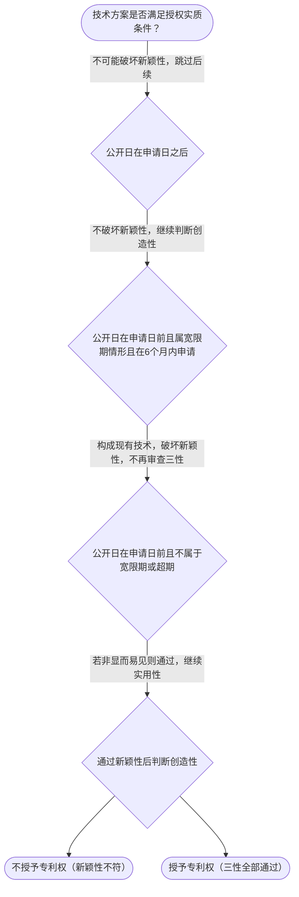

# 专家 B 教学草稿

> 专家：expert_b ｜ 风格：accessible

## 教学模块选择清单

- 当前教学节点：`patent-law-foundation`
- 板块预算：自适应 0/0，总计 9/9

| # | 模块 (block_type) | 类型 | 触发原因 (trigger) | 对应正文段 | 归属 |
|---:|---|:--:|---|---|:--:|
| 1 | `anchor_scenario` | 自适应 | sensing 0.83 / cold_start | 材料研发专利授权场景导入｜材料领域小李团队研发新型高强度复合材料用于航空部件，计划申请专利获得独占权，但担心展会展示或… | [A] |
| 2 | `legal_anchor` | 必选 | mandatory | 授权实质条件法条锚定｜《专利法》第二条 | [B] |
| 3 | `worked_example` | 自适应 | cold_start(low_confidence) | 展出案例演示｜某团队2023年5月1日在政府主办国际展会展出新型复合材料，2023年10月20日提出专利申… | [A] |
| 4 | `decision_flow` | 自适应 | input=visual(0.74) | 三性判定决策流程｜技术方案是否满足授权实质条件？ | [B] |
| 5 | `mnemonic` | 自适应 | understanding=sequential(0.70) | 三性记忆口诀｜三性记忆表：新（没公开过）/ 创（不显而易见）/ 实（能做有用） | [A] |
| 6 | `predict_activate` | 自适应 | processing=active(0.62) | 预测激活三性门槛｜材料研发专利申请中，如果展会展示了新型复合材料，你觉得专利还能不能申请？先猜一个。 | [B] |
| 7 | `assessment` | 必选 | mandatory | 三类测评闭环｜专利授权的三性判断 | [A] |
| 8 | `knowledge_synthesis` | 必选 | mandatory | 专利法律制度基础框架｜保护客体：发明、实用新型、外观设计（专利法第2条） | [B] |
| 9 | `summary_card` | 自适应 | len(knowledge_sub_nodes)=3>=3 | 速查卡｜先过保护客体之门，再过三性安检。 | [A] |

## 教学正文

## 1. 场景导入
材料领域的小李团队刚研发出一款新型高强度复合材料，用于航空部件。他们计划申请专利以获得独占权，但担心展会展示或文献公开后是否会丧失新颖性，同时还要判断该材料是否具备创造性并能制造出积极效果。如何判断能否授权？三性门槛如何落地？
## 2. 人话解释
专利法律制度基础讲的是专利保护的‘门’和‘关’。保护客体有发明、实用新型、外观设计三种；授权必须同时通过新颖性、创造性和实用性三关；中国专利体系强调早期公开、初步审查与实质审查并存，帮助发明创造获得保护。
## 3. 法条回扣
《专利法》第二条明确三种客体；第二十二条规定发明和实用新型必须具备新颖性、创造性和实用性；第二十三条规定外观设计必须不属于现有设计且有明显区别。第三十条规定优先权期限，第三十一条规定单一性原则，第三十三条规定修改不得超出原范围。这些条文是授权的硬性标准。
## 4. 类比 / 口诀
三性像过三道安检：新（Novelty，未公开过，有6个月宽限期缓冲）；创（Inventive，需非显而易见，有技术进步）；实（Industrial applicability，能制造有用）。口诀：‘新创实’三关卡。适用边界：宽限期仅针对特定公开，时间性、地域性是独占权的额外属性。
## 5. 应试提示
题干关键词：现有技术、申请日、优先权、单一性、修改范围。判断步骤：先查公开日在申请日后否（新颖性）；再看是否显而易见（创造性）；最后看能否制造使用（实用性）。常见陷阱：混淆抵触申请与现有技术；忘记优先权逾期视为未要求；修改超范围导致驳回。
## 6. 互动提问
你觉得在材料研发中，哪种行为最容易破坏新颖性？为什么？

### 材料研发专利授权场景导入（anchor_scenario）

> 材料领域小李团队研发新型高强度复合材料用于航空部件，计划申请专利获得独占权，但担心展会展示或文献公开是否破坏新颖性，同时需判断是否通过创造性和实用性审查。既有保护客体选择，也有授权三性判定两大冲突点。

**锚定**：用同一技术事实同时引出保护客体与授权三性两个抽象模块。

**先想一想**：如果你是专利代理人，看到材料研发展出这个动作，第一反应是风险还是安全？为什么？

### 授权实质条件法条锚定（legal_anchor）

- **《专利法》第二条**：第二条：发明创造包括发明、实用新型、外观设计。
- **《专利法》第二十二条**：第二十二条：发明实用新型需具备新颖性、创造性和实用性。
- **《专利法》第二十三条**：第二十三条：外观设计需不属于现有设计且有明显区别。
- **《专利法》第三十条**：第三十条：优先权要求需在期限内提交副本。
- **《专利法》第三十一条**：第三十一条：一件申请限于一项发明或实用新型。
- **《专利法》第三十三条**：第三十三条：修改不得超出原说明书和权利要求书记载范围。

**为何重要**：三性是授权主线，必须先立住条文；优先权和单一性是程序关键，影响申请日和保护范围。

### 展出案例演示（worked_example）

**案情/例题**：某团队2023年5月1日在政府主办国际展会展出新型复合材料，2023年10月20日提出专利申请，申请日距展出日约5.5个月。问：是否破坏新颖性？是否能授权？
**适用规则**：《专利法》第二十二条、第二十四条（不丧失新颖性宽限期）
**分步推演**：
1. 展出日在申请日前，且属政府主办国际展会法定情形 → *落入宽限期适用范围*
2. 申请日距展出日5.5个月小于6个月 → *在宽限期内不破坏新颖性*
3. 三性仍需逐一审查，创造性和实用性未确定 → *仍需过创造性/实用性*
**结论**：展出不破坏新颖性，但仅豁免该次公开，实体三性仍须满足。
**本题要点**：宽限期是时间豁免不是免死金牌，先判范围再算日期。

### 三性判定决策流程（decision_flow）

**决策问题**：技术方案是否满足授权实质条件？



### 三性记忆口诀（mnemonic）

**记忆锚**：三性记忆表：新（没公开过）/ 创（不显而易见）/ 实（能做有用）
**映射**：
- 新
- 创
- 实
**何时用**：看到授权条件或‘为什么不给专利’时先过三性表。

### 预测激活三性门槛（predict_activate）

**预测/激活**：材料研发专利申请中，如果展会展示了新型复合材料，你觉得专利还能不能申请？先猜一个。

**激活旧知**：已学的‘现有技术’概念

**揭晓方向**：先看展出日与申请日谁在前，再看有没有‘官方展会’这个例外口袋。

### 专利法律制度基础框架（knowledge_synthesis）

**知识框架**：
- 保护客体：发明、实用新型、外观设计（专利法第2条）
- 授权条件：新颖性、创造性、实用性三性缺一不可
- 中国体系：早期公开、初步审查与实质审查并存
**概念关系**：先过保护客体之门，再过三性安检；优先权影响申请日，单一性影响申请件数
**必记**：三性缺一不可，任一不具备即不授权；优先权要求需在期限内提交副本；修改不得超出原说明书和权利要求书记载范围

### 速查卡（summary_card）

**要点卡**：
- **保护客体**：能申请专利的‘东西’范围
- **三性**：新（Novelty）创（Inventive）实（Industrial applicability）
- **优先权**：发明实用新型16个月，外观设计3个月
- **宽限期**：特定公开给6个月缓冲
**必背**：三性缺一不可；宽限期仅豁免特定公开且限6个月；一件申请限于一项发明
**一句话总结**：先过保护客体之门，再过三性安检。

### 三类测评闭环（assessment）

**三类覆盖**：backward_review、forward_probe、weakness_probe
**题目**：
- q1：专利授权的三性判断
- q2：优先权要求期限
- q3：新颖性宽限期计算
- q4：外观设计保护范围


## 结构化字段

## knowledge_points

```json
[
  {
    "node_id": "patent-law-foundation",
    "kc_name": "专利制度的基本概念与特征：独占性、时间性、地域性（详见子节点 patent-rights-nature）"
  },
  {
    "node_id": "patent-law-foundation",
    "kc_name": "中国专利制度体系：专利法、专利法实施细则、专利审查指南（详见子节点 patent-law-framework）"
  },
  {
    "node_id": "patent-law-foundation",
    "kc_name": "专利保护的三种客体：发明、实用新型、外观设计（专利法第2条）"
  },
  {
    "node_id": "patent-law-foundation",
    "kc_name": "专利制度的作用：激励发明创造、促进技术公开、推动技术应用和经济发展（详见子节点 patent-system-overview）"
  },
  {
    "node_id": "patent-law-foundation",
    "kc_name": "中国专利制度发展历程与特点：早期公开延迟审查、初步审查制与实质审查制并存（详见子节点 patent-system-overview）"
  }
]
```

## legal_basis

```json
[
  {
    "article": "《专利法》第二条",
    "source": "中华人民共和国专利法.txt"
  },
  {
    "article": "《专利法》第二十二条",
    "source": "中华人民共和国专利法.txt"
  },
  {
    "article": "《专利法》第二十三条",
    "source": "中华人民共和国专利法.txt"
  },
  {
    "article": "《专利法》第三十条",
    "source": "中华人民共和国专利法.txt"
  },
  {
    "article": "《专利法》第三十一条",
    "source": "中华人民共和国专利法.txt"
  },
  {
    "article": "《专利法》第三十三条",
    "source": "中华人民共和国专利法.txt"
  }
]
```

## risks

```json
[
  {
    "risk": "新颖性与创造性的边界易混淆",
    "related_node_id": "patent-law-foundation"
  },
  {
    "risk": "抵触申请与现有技术的区分错误",
    "related_node_id": "patent-law-foundation"
  },
  {
    "risk": "优先权期限逾期未提交副本",
    "related_node_id": "patent-law-foundation"
  }
]
```

## draft_stage

```json
"debate"
```

## irac

```json
{
  "issue": "材料研发专利申请中，新颖性、创造性、实用性如何判断？",
  "rule": "专利法第二十二条规定发明实用新型需具备新颖性、创造性和实用性。",
  "application": "若材料未公开过且非显而易见且可制造有用，则符合三性。",
  "conclusion": "需逐一满足三性才能授权。"
}
```

## interactive_questions

```json
[
  {
    "qid": "q1",
    "category": "remember",
    "difficulty": "L1",
    "source_tag": "backward_review",
    "kc_node_id": "patent-law-foundation",
    "question": "下列哪项属于《专利法》第二条规定的发明创造客体？",
    "answer": "A",
    "options": [
      "A. 一种形状、构造的组合方案",
      "B. 一种形状、构造或其结合适于实用的新方案",
      "C. 一种富有美感并适于工业应用的新设计",
      "D. 一种新的技术方案"
    ]
  },
  {
    "qid": "q2",
    "category": "understand",
    "difficulty": "L1",
    "source_tag": "backward_review",
    "kc_node_id": "patent-law-foundation",
    "question": "中国专利制度的主要特征是什么？",
    "answer": "B",
    "options": [
      "A. 全面实质审查制",
      "B. 早期公开延迟审查，初步审查与实质审查并存",
      "C. 仅授予外观设计专利",
      "D. 完全不授予发明专利"
    ]
  },
  {
    "qid": "q3",
    "category": "apply",
    "difficulty": "L2",
    "source_tag": "weakness_probe",
    "kc_node_id": "patent-law-foundation",
    "question": "如果某发明在申请日前在政府主办国际展会展出，申请日距展出日5个月，是否破坏新颖性？",
    "answer": "A",
    "options": [
      "A. 不破坏新颖性，因为落在6个月宽限期内",
      "B. 破坏新颖性，因为已公开",
      "C. 需要看是否显而易见",
      "D. 必须提交优先权文件"
    ]
  },
  {
    "qid": "q4",
    "category": "apply",
    "difficulty": "L3",
    "source_tag": "weakness_probe",
    "kc_node_id": "patent-law-foundation",
    "question": "申请人要求外观设计优先权，应在申请时提出声明并在多长时间内提交副本？",
    "answer": "C",
    "options": [
      "A. 3个月",
      "B. 6个月",
      "C. 3个月内提交第一次提出专利申请文件的副本",
      "D. 16个月内提交副本"
    ]
  }
]
```

## knowledge_synthesis

```json
{
  "node": "patent-law-foundation",
  "coverage": [
    {
      "node_id": "patent-rights-nature"
    },
    {
      "node_id": "patent-law-framework"
    },
    {
      "node_id": "patent-system-overview"
    }
  ],
  "confusable_pairs": [
    {
      "pair": "新颖性 vs 创造性"
    },
    {
      "pair": "优先权 vs 分案申请"
    }
  ]
}
```

## exercises

```json
[
  {
    "question": "材料研发中，哪种行为最容易破坏新颖性？",
    "answer": "展会公开",
    "options": [
      "A. 展会公开",
      "B. 申请日后公开",
      "C. 优先权要求"
    ]
  }
]
```
