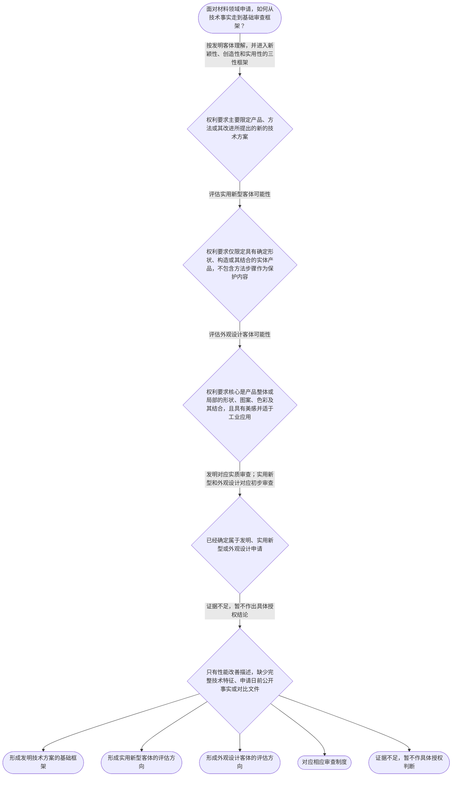

# 整合后的课程完整内容与习题

## 教学模块选择清单

- 当前教学节点：`patent-law-foundation`
- 板块预算：自适应 5/6，总计 9/9

| # | 模块 (block_type) | 类型 | 触发原因 (trigger) | 对应正文段 | 归属 |
|---:|---|:--:|---|---|:--:|
| 1 | `anchor_scenario` | 自适应 | perception=sensing(0.83) / cold_start | 材料实验室的专利判断起点｜某材料研发团队开发出一种用于锂电池隔膜的复合涂层：配方中加入了新型纳米粒子，制备工艺包含特定… | [A+B融合] |
| 2 | `legal_anchor` | 必选 | mandatory | 法条锚定：客体、三性与审查制度｜《专利法》第二条 | [A+B融合] |
| 3 | `worked_example` | 自适应 | cold_start(low_confidence) | 案例演示：自修复涂层如何识别客体｜某材料企业提出一种自修复纳米涂层方案，申请资料涉及特定纳米粒子与树脂配比、涂层制备加热步骤、… | [A+B融合] |
| 4 | `decision_flow` | 自适应 | input=visual(0.74) | 专利申请基础判断流程｜面对材料领域申请，如何从技术事实走到基础审查框架？ | [A+B融合] |
| 5 | `mnemonic` | 自适应 | understanding=sequential(0.70) | 专利制度基础四格核对表｜四格核对表：客体问“保护什么”；制度问“哪一层规范解决什么问题”；三性问“授权条件是否分别满… | [A+B融合] |
| 6 | `predict_activate` | 自适应 | processing=active(0.62) | 预测激活：先定位客体边界｜看到“新型复合材料的制备方法及其改进”时，先预测基础审查应从哪一个问题开始。 | [A+B融合] |
| 7 | `assessment` | 必选 | mandatory | 本节三类测评｜复习《专利法》第二条规定的三类专利保护客体。 | [A+B融合] |
| 8 | `knowledge_synthesis` | 必选 | mandatory | 专利法律制度基础知识网络｜制度特征：独占性是授权后在法定权利范围内排斥他人未经许可实施的排他效力，不是对所有技术和行为… | [A+B融合] |
| 9 | `summary_card` | 自适应 | len(knowledge_sub_nodes)=3>=3 | 专利制度基础速查卡｜先定保护客体，再用法—细则—指南理解规范分工，用独—时—地检查权利边界，最后对应三性、审查程… | [A+B融合] |

## 教学正文

## I——问题定位

材料领域的专利申请，不能因为技术名称新颖或性能有所改善，就直接得出“可以授权”的结论。基础判断应先回答四个相互衔接的问题：第一，权利要求保护的究竟是哪一种客体；第二，中国专利制度由哪些规范文件共同构成、各自解决什么问题；第三，发明和实用新型需要满足哪些授权条件；第四，不同专利类型适用什么审查程序、权利期限如何计算。本节点建立基础框架，后续节点再专门展开新颖性、创造性、现有技术和抵触申请的具体判断方法。

## R——适用规则

### 1. 专利制度的基本特征

专利权的独占性、时间性和地域性是理解权利边界的三个坐标。独占性不是“拥有技术事实”本身，而是授权后权利人在权利要求和法定范围内排斥他人未经许可实施；它不意味着可以对所有技术或所有行为进行无限控制。时间性表示专利权不是永久存在的，权利期限届满后，专利权不再维持，相关技术可以进入公共利用范围。发明、实用新型和外观设计的法定期限分别为二十年、十年和十五年，均自申请日起计算。〔RAG: 中华人民共和国专利法.txt — 第四十二条：发明专利权的期限为二十年，实用新型专利权的期限为十年，外观设计专利权的期限为十五年，均自申请日起计算〕

地域性表示专利权原则上以授予该权利的国家或地区为效力范围。中国专利的排他效力不当然延伸到其他国家或地区，境外保护需要依相应法域的申请和授权制度办理。独占性回答“授权后能排斥什么”，时间性回答“能维持多久”，地域性回答“在哪些地域有效”；三者共同限定专利权的边界。关于这三项特征的完整总括性表述，检索上下文未提供直接对应的单一条文，以上为制度性教学概括。

### 2. 中国专利制度体系与制度作用

可以用“三层结构”理解中国专利制度。专利法是基本法律规范，规定保护客体、授权条件和专利权制度等基本问题；专利法实施细则对申请、审查、实施等程序和具体事项作补充；专利审查指南则把法律和实施细则落实为审查判断中的操作性指引。三者功能相互衔接，但层级不同，审查指南不能替代专利法或实施细则。检索材料还显示，在实质审查中，审查顺序并非一开始就只看新颖性和创造性，而是先判断申请是否属于可授权的对象和主题，再进入相关授权条件的审查。〔RAG: 专利法专题讲座.txt — “一件专利申请必须属于专利法规定的可以授权的对象和主题，才有可能获得专利授权”；“在新颖性和创造性审查之前首先判断专利申请是否符合上述规定”〕

专利制度的作用可以概括为“以公开换保护”：对符合条件的发明创造授予一定期限的排他性权利，促使技术公开；公开后的技术能够被后续研究和应用，期限届满后进入公共利用范围，进而形成激励发明创造、促进技术公开、推动技术应用和经济发展的机制。这是制度作用的教学性概括，不替代具体法条判断。

### 3. 三类保护客体

《专利法》第二条将发明创造分为发明、实用新型和外观设计。发明保护产品、方法或者其改进所提出的新的技术方案；材料的组成、配方、制备工艺及其改进，通常首先从发明客体角度识别。实用新型仅针对产品的形状、构造或者其结合提出的适于实用的新的技术方案；检索材料进一步说明，产品应是经过产业方法制造、具有确定形状和构造并占据一定空间的实体，一切方法不属于实用新型保护客体。〔RAG: 中华人民共和国专利法.txt — 第二条：发明是对产品、方法或者其改进所提出的新的技术方案；实用新型是对产品的形状、构造或者其结合所提出的适于实用的新的技术方案〕〔RAG: 专利法专题讲座.txt — 实用新型专利只保护产品；所述产品应当是经过产业方法制造的，有确定形状、构造且占据一定空间的实体；一切方法均不属于实用新型的保护客体〕

外观设计保护产品整体或局部的形状、图案、色彩及其结合所形成的富有美感并适于工业应用的新设计。材料产品的表面纹理如果核心在视觉美感，可能涉及外观设计；如果纹理承担技术功能，则应回到技术方案及其产品结构的判断，不能仅凭“好看”确定类型。客体判断是进入后续授权条件审查的入口，不能把有形产品的最终形态反过来理解为所有相关方法都能纳入实用新型。

### 4. 授权条件、新颖性与创造性的边界

《专利法》第二十二条规定，授予专利权的发明和实用新型应当具备新颖性、创造性和实用性。新颖性关注要求保护的发明或实用新型是否属于现有技术，以及是否存在法定意义上的同样申请；创造性关注相对于现有技术是否具有法定的实质性特点和进步；实用性关注能否制造或者使用并产生积极效果。〔RAG: 中华人民共和国专利法.txt — 第二十二条：授予专利权的发明和实用新型应当具备新颖性、创造性和实用性；现有技术是申请日以前在国内外为公众所知的技术〕

本节点只固定三性之间的功能区分，不展开后续节点的专门判断步骤。尤其要避免两种混淆：不能把两份现有技术拼接后直接作新颖性结论；也不能只凭一份对比文件就跳过完整分析而直接作创造性结论。材料性能改善可以是技术效果事实，但不能单独替代新颖性、创造性或实用性的分别判断。

### 5. 审查程序、公开与权利期限

发明专利申请实行早期公开、延迟审查的实质审查制度：申请经初步审查符合要求后，通常自申请日起满十八个月公布，申请人可以请求早日公布；之后还需依法提出实质审查请求，最终经实质审查没有发现驳回理由的，作出授予发明专利权的决定。〔RAG: 中华人民共和国专利法.txt — 第三十四条：发明专利申请自申请日起满十八个月即行公布，申请人可以请求早日公布〕〔RAG: 专利法专题讲座.txt — 发明专利申请采取早期公开、延迟审查的实质审查制〕

实用新型和外观设计专利申请适用初步审查制度。也就是说，中国专利制度中同时存在发明的早期公开、延迟实质审查路径，以及实用新型、外观设计的初步审查路径；这是不同专利类型的程序安排，并不表示任何类型可以跳过相应的授权条件。〔RAG: 中华人民共和国专利法.txt — 第三十九条、第四十条：发明申请经实质审查授权；实用新型和外观设计申请经初步审查授权〕发明、实用新型和外观设计专利权期限分别为二十年、十年和十五年，均自申请日起计算。〔RAG: 中华人民共和国专利法.txt — 第四十二条：三类专利权期限分别为二十年、十年、十五年，均自申请日起计算〕

## A——规则适用示范

以“电池隔膜复合涂层”为例，申请方案包括涂层组成、纳米粒子配比、制备加热步骤、固化后的微孔结构和表面纹理。第一步，应按照权利要求实际限定的技术内容识别客体：组成和制备步骤属于产品或方法技术方案，通常优先考虑发明；具有确定形状、构造的产品结构可以进一步评估实用新型可能性；以视觉美感为核心的表面图案或色彩组合可以评估外观设计可能性。第二步，确定申请类型后，分别建立发明或实用新型的三性框架。第三步，将发明对应实质审查、实用新型和外观设计对应初步审查。第四步，区分申请日前的现有技术时间标准与自申请日起计算的专利权期限。与此同时，还要先核对方案是否属于可授权的保护客体和主题，不能把客体问题留到新颖性或创造性之后才处理。

如果只有“性能更好”的实验描述，而没有完整权利要求、申请日前公开事实、对比文件及充分技术效果证据，就不能直接断言该方案具备或不具备新颖性、创造性。技术名称、性能提升和申请类型本身都不能替代法律要件分析。

## C——结论

本节点的稳定判断顺序是“客体—制度—三性—程序与期限”。材料组成和制备方法通常先按发明技术方案识别；实用新型限于产品形状、构造或其结合，方法不能作为实用新型保护客体；外观设计侧重产品外观的美感与工业应用。专利法、实施细则和审查指南分别承担基本规则、程序补充和审查操作指引功能；独占性、时间性和地域性分别从排他范围、存续时间和效力地域限定专利权边界。发明实行早期公开、延迟实质审查，实用新型和外观设计主要实行初步审查。新颖性、创造性和实用性是不同授权条件，后续应分别按照相应节点的方法判断。本节设有测评，请到【习题】区作答。

### 材料实验室的专利判断起点（anchor_scenario）

> 某材料研发团队开发出一种用于锂电池隔膜的复合涂层：配方中加入了新型纳米粒子，制备工艺包含特定加热步骤，固化后形成微孔结构，表面还具有特殊纹理。团队成员争论不休：有人认为成分和工艺应申请发明，有人认为只要产品有结构就可以申请实用新型，还有人认为纹理好看就应申请外观设计。负责人还要同时确认三性、审查程序、保护期限以及技术公开后的制度效果。这个场景的冲突在于，材料方案的技术内容、产品结构和外观表现可能同时出现，但法律判断必须先按保护客体和权利要求限定内容逐层拆分。

**锚定**：用同一材料研发情境锚定三类保护客体、制度三层结构、授权三性以及审查程序和期限。

**先想一想**：面对同时包含配方、工艺、产品结构和表面纹理的材料方案，判断时应先识别保护客体，还是先直接判断新颖性和创造性？

### 法条锚定：客体、三性与审查制度（legal_anchor）

- **《专利法》第二条**：第二条规定三类发明创造：发明保护产品、方法或其改进的技术方案；实用新型保护产品形状、构造或其结合的技术方案；外观设计保护富有美感并适于工业应用的产品外观设计。
- **《专利法》第二十二条**：第二十二条把新颖性、创造性和实用性规定为发明和实用新型的不同授权条件，并以申请日以前在国内外为公众所知的技术界定现有技术。
- **《专利法》第三十四条**：第三十四条规定符合要求的发明申请通常自申请日起满十八个月公布，申请人可以请求早日公布。
- **《专利法》第三十九条、第四十条**：第三十九条、第四十条分别对应发明申请的实质审查以及实用新型、外观设计申请的初步审查。
- **《专利法》第四十二条**：第四十二条规定发明、实用新型和外观设计专利权期限分别为二十年、十年和十五年，均自申请日起计算。

**为何重要**：这些条文共同搭建本节点的法律底座：先识别客体，再区分授权三性，最后把申请类型与审查制度及期限对应起来，避免把不同层次的问题混为一谈。

### 案例演示：自修复涂层如何识别客体（worked_example）

**案情/例题**：某材料企业提出一种自修复纳米涂层方案，申请资料涉及特定纳米粒子与树脂配比、涂层制备加热步骤、固化后的微孔阵列结构以及表面纹理图案。团队希望判断哪些内容应优先按发明理解，哪些内容可能涉及实用新型或外观设计，并确定后续应采用何种基础审查框架。
**适用规则**：《专利法》第二条、第二十二条、第三十九条和第四十条；实用新型仅保护产品的形状、构造或者其结合，方法不属于实用新型保护客体。
**分步推演**：
1. 特定配比和制备加热步骤分别涉及产品组成与方法步骤，属于产品、方法或者其改进所提出的技术方案，应先从发明客体角度识别。 → *组成和工艺优先按发明技术方案分析。*
2. 固化后的微孔阵列如果在权利要求中表现为产品具有确定的形状或构造，且不依赖方法步骤本身，可以进一步评估其是否符合实用新型客体；但制造步骤不能直接作为实用新型的保护内容。 → *确定结构可评估实用新型，方法步骤必须排除。*
3. 表面纹理如果核心在产品整体或局部的视觉美感，并且适于工业应用，可以评估外观设计；如果纹理主要承担技术功能，则不能仅因其具有图案就按外观设计处理。 → *区分美感外观与技术功能。*
4. 确定客体后，发明或实用新型还要分别核对新颖性、创造性和实用性；随后再对应发明的实质审查或实用新型的初步审查。缺少完整权利要求和时间事实时，不能直接作出授权结论。 → *客体识别不等于授权结论，仍须完成三性和程序判断。*
**结论**：该方案的成分和制备方法通常优先考虑发明；具有确定形状或构造的产品部分可以另行评估实用新型；以美感为核心的纹理可以评估外观设计。最终结论仍取决于权利要求的具体限定和完整证据。
**本题要点**：材料案件应先按方案性质拆分客体，再分别进入三性和审查程序判断。

### 专利申请基础判断流程（decision_flow）

**决策问题**：面对材料领域申请，如何从技术事实走到基础审查框架？



### 专利制度基础四格核对表（mnemonic）

**记忆锚**：四格核对表：客体问“保护什么”；制度问“哪一层规范解决什么问题”；三性问“授权条件是否分别满足”；程序与期限问“怎么审、保护多久”。辅助口诀：独—时—地，发—实—外，法—细则—指南。口诀只用于记忆结构，不替代法条和具体审查。
**映射**：
- 客体
- 制度
- 三性
- 程序与期限
- 独
- 时
- 地
- 发—实—外
- 法—细则—指南
**何时用**：复习本节点或处理材料方案分类题时，依次使用“客体—制度—三性—程序与期限”四格表；遇到权利边界问题，用“独—时—地”检查排他范围、存续时间和效力地域；遇到规范依据问题，用“法—细则—指南”检查规则层级。

### 预测激活：先定位客体边界（predict_activate）

**预测/激活**：看到“新型复合材料的制备方法及其改进”时，先预测基础审查应从哪一个问题开始。

**激活旧知**：激活已学的产品、方法、形状构造、外观设计以及三性总框架等旧知。

**揭晓方向**：先观察权利要求要保护的是技术方案、确定结构还是视觉外观，再把相应申请类型接入三性或审查程序；不要因性能改善跳过客体识别。

### 专利法律制度基础知识网络（knowledge_synthesis）

**知识框架**：
- 制度特征：独占性是授权后在法定权利范围内排斥他人未经许可实施的排他效力，不是对所有技术和行为的无限控制；时间性是专利权具有法定存续期限，期限届满后权利不再维持；地域性是专利权原则上只在授予该权利的国家或地区发生效力，中国专利不当然覆盖其他国家或地区。
- 规范体系：专利法规定保护客体、基本授权条件和权利制度；专利法实施细则围绕申请、审查和实施等事项补充程序规则；专利审查指南把法律和实施细则落实为审查判断的操作性指引。三者功能相互衔接，但审查指南不能替代上位法。
- 三类客体：发明保护产品、方法或者其改进的技术方案；实用新型主要保护经过产业方法制造、具有确定形状和构造并占据一定空间的实体产品的形状、构造或其结合；外观设计保护产品整体或局部的形状、图案、色彩及其结合所形成的富有美感并适于工业应用的新设计。
- 制度作用：通过对符合条件的发明创造授予一定期限的排他性权利，促使技术公开；公开后的技术可供后续研究和应用，期限届满后进入公共利用范围，从而形成激励创新、促进公开、推动技术应用和经济发展的制度机制。
- 制度特点与审查衔接：中国专利制度形成早期公开、延迟审查的发明实质审查路径，同时保留实用新型和外观设计以初步审查为主的路径。发明申请经初步审查符合要求后通常自申请日起满十八个月公布，申请人可以请求早日公布；发明最终经实质审查没有发现驳回理由的，作出授予决定，实用新型和外观设计经初步审查没有发现驳回理由的，作出相应授权决定。
**概念关系**：保护客体决定基础分析方向，确定申请类型后再对应授权条件与审查制度。；独占性回答“授权后能排斥什么”，时间性回答“能维持多久”，地域性回答“在哪些法域有效”；三者共同限定专利权边界。；专利法、实施细则和审查指南分别承担基本规则、程序补充和操作指引功能，适用具体案件时应按层级核对依据。；发明的早期公开与延迟实质审查，和实用新型、外观设计的初步审查并存，体现不同专利类型的程序路径差异；程序路径差异不等于免除相应授权条件。；申请日前公众可知的技术涉及现有技术判断，专利权期限则自申请日起计算，两个时间基准不能混同。；材料组成和制备方法通常进入发明分析；确定结构和视觉外观分别需要进一步评估实用新型或外观设计可能性。
**必记**：独占性是法定范围内的排他效力，时间性是法定期限限制，地域性是授权地域限制，三者不能相互替代。；专利法规定基本法律规则，实施细则补充程序规则，审查指南提供具体审查操作指引。；实用新型保护产品的形状、构造或其结合，方法本身不属于实用新型保护客体。；发明申请采取早期公开、延迟实质审查的路径；实用新型和外观设计申请主要适用初步审查。；新颖性、创造性和实用性是不同授权条件，性能改善不能替代分别判断。；发明、实用新型和外观设计专利权期限分别为二十年、十年和十五年，均自申请日起计算。

### 专利制度基础速查卡（summary_card）

**要点卡**：
- **制度特征**：独占性是在法定范围内排斥未经许可实施；时间性体现法定期限；地域性限定授权地域，三者共同划定权利边界。
- **保护客体**：发明保护产品、方法或其改进的技术方案；实用新型保护有确定形状、构造的产品；外观设计保护富有美感并适于工业应用的产品外观设计。
- **制度体系**：专利法定基本规则，实施细则补充申请和审查等程序，审查指南提供具体判断的操作指引，三者层级和功能不同。
- **制度作用**：以一定期限的排他性权利换取技术公开，促进后续利用和创新，推动技术应用与经济发展。
- **审查与期限**：发明通常早期公开、延迟实质审查；实用新型和外观设计主要初步审查；期限分别为二十年、十年、十五年。
- **时间边界**：现有技术通常看申请日以前公众所知的技术；专利权期限从申请日起计算，两个时间基准不同。
**必背**：独占性、时间性、地域性的含义分别是法定范围内排他、法定期限限制和授权地域限制。；专利法规定基本规则，实施细则补充程序，审查指南提供审查操作指引。；《专利法》第二条规定发明、实用新型和外观设计及其客体范围。；实用新型限于产品的形状、构造或者其结合，方法不属于其保护客体。；发明申请通常早期公开并延迟实质审查，实用新型和外观设计主要适用初步审查。；基础判断顺序是客体—制度—三性—程序与期限。
**一句话总结**：先定保护客体，再用法—细则—指南理解规范分工，用独—时—地检查权利边界，最后对应三性、审查程序和期限。

### 本节三类测评（assessment）

**三类覆盖**：backward_review、forward_probe、weakness_probe
**题目**：
- q-foundation-review-1：复习《专利法》第二条规定的三类专利保护客体。
- q-application-probe-1：探测发明专利申请通常需要提交的基本文件。
- q-foundation-weakness-1：辨析三性不能互相替代，避免以性能改善直接推出授权结论。


## 结构化数据

## expert

```json
"A+B融合"
```

## style

```json
"fused"
```

## knowledge_points

```json
[
  {
    "node_id": "patent-law-foundation",
    "kc_name": "专利制度的基本概念与特征：独占性、时间性、地域性"
  },
  {
    "node_id": "patent-law-foundation",
    "kc_name": "中国专利制度体系：专利法、专利法实施细则、专利审查指南"
  },
  {
    "node_id": "patent-law-foundation",
    "kc_name": "专利保护的三种客体：发明、实用新型、外观设计（专利法第2条）"
  },
  {
    "node_id": "patent-law-foundation",
    "kc_name": "专利制度的作用：激励发明创造、促进技术公开、推动技术应用和经济发展"
  },
  {
    "node_id": "patent-law-foundation",
    "kc_name": "中国专利制度发展历程与特点：早期公开延迟审查、初步审查制与实质审查制并存"
  }
]
```

## legal_basis

```json
[
  {
    "article": "《专利法》第二条：发明创造包括发明、实用新型和外观设计；发明是对产品、方法或者其改进所提出的新的技术方案；实用新型是对产品的形状、构造或者其结合所提出的适于实用的新的技术方案；外观设计是对产品整体或者局部的形状、图案、色彩及其结合所作出的富有美感并适于工业应用的新设计。",
    "source": "中华人民共和国专利法.txt"
  },
  {
    "article": "《专利法》第二十二条：授予专利权的发明和实用新型应当具备新颖性、创造性和实用性；现有技术是申请日以前在国内外为公众所知的技术。",
    "source": "中华人民共和国专利法.txt"
  },
  {
    "article": "《专利法》第三十九条、第四十条：发明专利申请经实质审查没有发现驳回理由的，作出授予发明专利权的决定；实用新型和外观设计专利申请经初步审查没有发现驳回理由的，作出相应授权决定。",
    "source": "中华人民共和国专利法.txt"
  },
  {
    "article": "《专利法》第四十二条：发明专利权期限为二十年，实用新型专利权期限为十年，外观设计专利权期限为十五年，均自申请日起计算。",
    "source": "中华人民共和国专利法.txt"
  },
  {
    "article": "《专利法》第三十四条：发明专利申请经初步审查符合要求的，自申请日起满十八个月即行公布，申请人可以请求早日公布。",
    "source": "中华人民共和国专利法.txt"
  },
  {
    "article": "《专利法》第二十六条：申请发明或者实用新型专利的，应当提交请求书、说明书及其摘要和权利要求书等文件。",
    "source": "中华人民共和国专利法.txt"
  },
  {
    "article": "专利制度的独占性、时间性、地域性及制度作用的概括。",
    "source": "检索上下文未提供直接完整依据"
  },
  {
    "article": "中国专利制度体系中专利法、专利法实施细则和专利审查指南的层级及功能概括；专题材料说明实施细则和审查指南分别对具体规则及审查判断发挥补充、操作作用。",
    "source": "专利法专题讲座.txt"
  }
]
```

## risks

```json
[
  {
    "risk": "独占性、时间性、地域性属于本节知识点要求，但检索上下文未提供三项特征的直接完整总括性依据；具体期限可由《专利法》第四十二条核验。",
    "related_node_id": "patent-rights-nature"
  },
  {
    "risk": "专利法、实施细则和审查指南的完整现行体系性条文未全部出现在检索上下文中；本节仅依据可见材料说明三者的基本功能分工，具体程序操作应继续核验现行规范。",
    "related_node_id": "patent-law-framework"
  },
  {
    "risk": "早期公开、延迟审查以及初步审查与实质审查并存的概括有专题材料和法条依据，但具体程序细节和历史表述不应替代现行法条及审查指南。",
    "related_node_id": "patent-system-overview"
  },
  {
    "risk": "不能将材料性能改善直接等同于新颖性或创造性，也不能在缺少完整技术特征和申请日前公开事实时作出具体授权结论。",
    "related_node_id": "patent-law-foundation"
  }
]
```

## draft_stage

```json
"integration"
```

## irac

```json
{
  "issue": "材料领域专利申请应如何识别保护客体、理解中国专利制度的规范体系，并区分授权三性与不同审查程序？",
  "rule": "《专利法》第二条规定发明、实用新型和外观设计的保护客体；《专利法》第二十二条规定发明和实用新型应具备新颖性、创造性和实用性，并规定现有技术的时间标准；《专利法》第三十九条、第四十条规定不同专利类型对应的审查制度；《专利法》第四十二条规定三类专利权期限。",
  "application": "对于材料领域申请，应先根据权利要求限定的组成、方法、结构或外观识别客体，再针对发明或实用新型分别建立三性框架，并将申请类型与实质审查或初步审查对应。仅凭材料名称或性能改善，不能直接推出授权结论。",
  "conclusion": "本节点应固定“客体—制度—三性—程序与期限”的判断主线；新颖性和创造性的具体比较方法留待后续专门节点。"
}
```

## interactive_questions

```json
[
  {
    "qid": "q-foundation-review-1",
    "category": "remember",
    "difficulty": "L1",
    "source_tag": "backward_review",
    "kc_node_id": "patent-law-foundation",
    "question": "根据《专利法》第二条，下列关于专利保护客体的表述正确的是？",
    "answer": "B",
    "options": [
      "A. 专利保护客体只有发明和实用新型",
      "B. 发明创造包括发明、实用新型和外观设计",
      "C. 外观设计只能保护产品内部结构",
      "D. 实用新型可以保护任何方法本身"
    ]
  },
  {
    "qid": "q-application-probe-1",
    "category": "remember",
    "difficulty": "L1",
    "source_tag": "forward_probe",
    "kc_node_id": "patent-application-process",
    "question": "关于提出发明专利申请时通常需要提交的基本文件，下列表述正确的是？",
    "answer": "C",
    "options": [
      "A. 仅需提交产品实物样品",
      "B. 只需口头向审查员描述技术方案",
      "C. 通常需要提交请求书、说明书及其摘要、权利要求书等文件",
      "D. 只需提交外观设计图片，无需文字文件"
    ]
  },
  {
    "qid": "q-foundation-weakness-1",
    "category": "analyze",
    "difficulty": "L3",
    "source_tag": "weakness_probe",
    "kc_node_id": "patent-law-foundation",
    "question": "某材料申请仅说明产品性能优于已知产品，但未提供完整权利要求和申请日前公开事实。下列判断最符合本节规则边界的是？",
    "answer": "C",
    "options": [
      "A. 只要性能优于已知产品，就当然具备新颖性和创造性",
      "B. 只要名称是新材料，就不必识别保护客体",
      "C. 新颖性、创造性和实用性是不同授权条件，不能仅凭性能改善替代分别判断",
      "D. 只要申请属于发明，就不需要核对其他授权条件"
    ]
  }
]
```

## knowledge_synthesis

```json
{
  "node": "patent-law-foundation",
  "coverage": [
    {
      "node_id": "patent-law-foundation"
    },
    {
      "node_id": "patent-rights-nature"
    },
    {
      "node_id": "patent-law-framework"
    },
    {
      "node_id": "patent-system-overview"
    }
  ],
  "confusable_pairs": [
    {
      "pair": "发明与实用新型：发明可以保护产品、方法或其改进的技术方案；实用新型限于产品的形状、构造或者其结合，方法不能作为其保护客体。"
    },
    {
      "pair": "新颖性与创造性：新颖性和创造性都是授权条件，但不能把多份文件拼接后直接作新颖性结论，也不能仅凭一份对比文件直接完成创造性结论。"
    },
    {
      "pair": "现有技术时间与专利权期限：现有技术通常看申请日以前公众所知的技术；专利权期限则自申请日起计算，两个时间基准不同。"
    },
    {
      "pair": "独占性与地域性：专利权的排他性只在授权地域内发生效力，中国专利不当然覆盖全球。"
    },
    {
      "pair": "专利法、实施细则与审查指南：三者分别承担基本规则、程序补充和操作指引功能，审查指南不能替代法律和实施细则。"
    }
  ]
}
```
