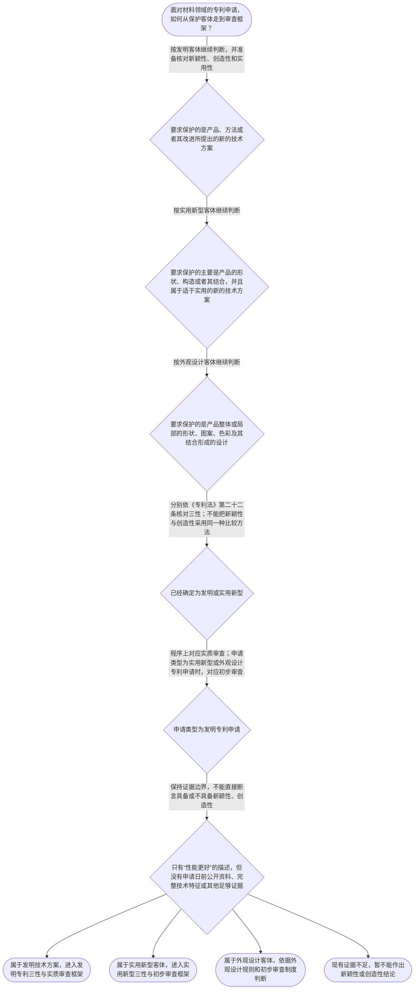

# 专家 A 教学草稿

> 专家：expert_a ｜ 风格：conservative

## 教学模块选择清单

- 当前教学节点：`patent-law-foundation`
- 板块预算：自适应 None/None，总计 9/9

| # | 模块 (block_type) | 类型 | 触发原因 (trigger) | 对应正文段 | 归属 |
|---:|---|:--:|---|---|:--:|
| 1 | `anchor_scenario` | 自适应 | perception=sensing(0.83) / cold_start | 材料研发团队的专利判断起点｜某材料研发团队开发出一种用于锂电池隔膜的复合涂层。团队负责人认为，只要材料性能优于现有产品，… | [A] |
| 2 | `legal_anchor` | 必选 | mandatory | 法条锚定：从保护客体到授权制度｜《专利法》第二条 | [A] |
| 3 | `worked_example` | 自适应 | cold_start(low_confidence) | 材料技术方案的制度层级判断｜某材料企业提出一种用于电池隔膜的复合涂层方案，申请文件主张涂层组成、制备步骤以及由此产生的性… | [A] |
| 4 | `decision_flow` | 自适应 | input=visual(0.74) | 专利申请基础判断流程｜面对材料领域的专利申请，如何从保护客体走到审查框架？ | [A] |
| 5 | `mnemonic` | 自适应 | understanding=sequential(0.70) | 专利制度基础四格核对表｜四格核对表：客体看“是什么”；三性看“能否授权”；程序看“怎么审”；期限看“保护多久”。三性… | [A] |
| 6 | `predict_activate` | 自适应 | processing=active(0.62) | 先判断客体还是先判断创造性｜先预测：对于“新型复合材料的制备方法及其改进”这一技术内容，审查时应先判断其属于哪类保护客体… | [A] |
| 7 | `assessment` | 必选 | mandatory | 本节三类测评｜复习专利保护客体与三性基本概念。 | [A] |
| 8 | `knowledge_synthesis` | 必选 | mandatory | 专利法律制度基础知识网络｜专利权的基本特征：专利制度中的权利具有独占性、时间性和地域性；本检索上下文未提供直接法条原文… | [A] |
| 9 | `summary_card` | 自适应 | len(knowledge_sub_nodes)=3>=3 | 专利制度基础速查卡｜先定保护客体，再分辨授权三性，随后对应审查制度并核对时间边界。 | [A] |

## 教学正文

## I — 法律问题

材料领域的专利申请，首先要解决三个层次的问题：要求保护的内容属于哪一种专利客体；发明或者实用新型是否满足新颖性、创造性和实用性；确定专利类型后适用初步审查还是实质审查。新颖性和创造性都与现有技术有关，但不能用同一个判断问题替代另一个判断问题。

## R — 适用规则

### 1. 保护客体

《专利法》第二条将发明创造分为发明、实用新型和外观设计。发明是对产品、方法或者其改进提出的新的技术方案；实用新型是对产品的形状、构造或者其结合提出的适于实用的新的技术方案；外观设计针对产品整体或者局部的形状、图案、色彩及其结合形成的富有美感并适于工业应用的新设计。〔RAG: 中华人民共和国专利法.txt — 第二条：发明、实用新型和外观设计的定义〕

因此，材料组成、材料配方、制备方法及其改进，通常应先从技术方案角度识别其保护客体；不能仅因为名称中出现“材料”二字，就直接确定为实用新型或发明。具体归类仍需结合权利要求的限定内容。

### 2. 发明和实用新型的授权三性

授予发明和实用新型专利权，应当具备新颖性、创造性和实用性。新颖性是指发明或者实用新型不属于现有技术；创造性是指与现有技术相比，发明具有突出的实质性特点和显著的进步，实用新型具有实质性特点和进步；实用性是指能够制造或者使用，并且能够产生积极效果。现有技术是申请日以前在国内外为公众所知的技术。〔RAG: 中华人民共和国专利法.txt — 第二十二条：新颖性、创造性、实用性及现有技术定义〕

这三个条件必须分开理解：新颖性解决“是否已经属于现有技术”的问题；创造性解决“相对于现有技术是否具有规定的实质性特点和进步”的问题；实用性解决“能否制造或者使用并产生积极效果”的问题。材料性能改善可以成为技术效果事实，但不能单独替代上述任何一项完整判断。

### 3. 审查制度与时间边界

发明专利申请经实质审查没有发现驳回理由的，由国务院专利行政部门作出授予发明专利权的决定；实用新型和外观设计专利申请经初步审查没有发现驳回理由的，作出相应授权决定。〔RAG: 中华人民共和国专利法.txt — 第三十九条：发明专利申请经实质审查授权；第四十条：实用新型和外观设计经初步审查授权〕

专利权期限也有明确的时间边界：发明为二十年，实用新型为十年，外观设计为十五年，均自申请日起计算。〔RAG: 中华人民共和国专利法.txt — 第四十二条：发明二十年、实用新型十年、外观设计十五年，均自申请日起计算〕

“申请日前的现有技术”是授权条件判断中的时间参照，“自申请日起计算的权利期限”是专利权存续时间，两者不能混同。关于独占性、时间性和地域性的制度概括，检索上下文未提供直接的完整法条依据，本节不据此扩展具体权利效力结论。

## A — 规则适用

以一种电池隔膜复合涂层为例：如果权利要求限定的是涂层组成、材料配比或制备步骤，第一步应识别为产品或方法技术方案，并依《专利法》第二条判断其保护客体。第二步，对于发明或实用新型，分别核对新颖性、创造性和实用性；不能仅因该涂层具有更好的耐热性，就跳过对技术公开状态和其他授权条件的分析。第三步，根据专利类型对应审查制度：发明申请对应实质审查，实用新型申请对应初步审查。

判断新颖性时，核心问题是申请日前是否已经存在公开的相同技术内容；判断创造性时，核心问题不是简单重复新颖性判断，而是评价相对于现有技术的实质性特点和进步。当前检索上下文没有提供该复合涂层的完整权利要求、申请日前对比文件、公开日期和技术效果证据，因此不能据此断言该具体方案具备或不具备新颖性、创造性。

中国专利制度的规范层次、制度作用以及早期公开、延迟审查等程序特点，当前材料仅提供概括性内容，具体审查操作应进一步核对现行专利法、实施细则和专利审查指南。后续进入新颖性和创造性专门节点时，应再分别学习现有技术的时间判断、单独对比原则以及创造性判断步骤。

## C — 结论

学习材料领域专利审查时，应固定为“先识别保护客体，再分别判断三性，最后对应审查制度和时间边界”。新颖性关注是否属于申请日前的现有技术，创造性关注相对于现有技术的实质性特点和进步；二者不能混用。对具体材料方案作出结论，必须以完整权利要求、申请日及公开事实和可核验的对比依据为基础。

> 常见误区 / 易混淆点
>
> - 把材料性能更好直接等同于具备新颖性或创造性；正确做法是分别核对适用条件和证据。
> - 把发明、实用新型和外观设计混为一谈；正确做法是先看权利要求保护的技术内容或产品外观。
> - 把发明的实质审查与实用新型、外观设计的初步审查混同；这是专利类型对应的程序区别。
> - 把权利期限的起算日与现有技术的申请日前时间标准混同；二者解决的是不同问题。
>
> 本节设有测评，请到【习题】区作答。

### 材料研发团队的专利判断起点（anchor_scenario）

> 某材料研发团队开发出一种用于锂电池隔膜的复合涂层。团队负责人认为，只要材料性能优于现有产品，就可以申请专利；专利代理师则要求先区分该方案属于发明、实用新型还是外观设计，再核对申请日前是否已经公开，以及后续应经过哪类审查。团队还发现，发明专利与实用新型、外观设计的审查和授权程序并不相同，因此需要建立一套从保护客体到授权条件、再到审查程序的判断框架。

**锚定**：该情境锚定保护客体、专利授权三性以及发明与实用新型、外观设计审查制度的边界。

**先想一想**：面对这个材料技术方案，第一步应先判断它属于哪一种专利保护客体，还是直接检索相同技术？

### 法条锚定：从保护客体到授权制度（legal_anchor）

- **《专利法》第二条**：专利法把发明创造分为发明、实用新型和外观设计；发明可以针对产品、方法或其改进，实用新型主要针对产品的形状、构造或其结合，外观设计针对产品的形状、图案、色彩等外观设计。
- **《专利法》第二十二条**：发明和实用新型获得专利权，应当具备新颖性、创造性和实用性；现有技术是申请日前在国内外为公众所知的技术。该条同时规定了新颖性和创造性的基本定义。
- **《专利法》第三十九条、第四十条**：发明专利申请经实质审查没有发现驳回理由后作出授权决定；实用新型和外观设计专利申请经初步审查没有发现驳回理由后作出相应授权决定。
- **《专利法》第四十二条**：发明专利权期限为二十年，实用新型为十年，外观设计为十五年，均自申请日起计算。

**为何重要**：本节点的核心是建立专利制度基础。必须先准确区分保护客体、授权实质条件、审查类型和权利期限，后续学习新颖性、创造性及申请程序时才能避免把不同层次的问题混在一起。

### 材料技术方案的制度层级判断（worked_example）

**案情/例题**：某材料企业提出一种用于电池隔膜的复合涂层方案，申请文件主张涂层组成、制备步骤以及由此产生的性能改善。现要求说明审查时应如何确定判断顺序，以及哪些结论不能仅凭“性能更好”直接得出。
**适用规则**：《专利法》第二条、第二十二条、第三十九条和第四十条。检索上下文未提供足以完成具体材料案件新颖性或创造性比对的完整对比文件，因此本例只演示制度层级的判断链。
**分步推演**：
1. 先观察权利要求所要求保护的技术内容：组成和制备步骤属于产品或方法技术方案，而不是单纯的产品外观。根据《专利法》第二条，应先确定保护客体。 → *第一步是识别保护客体，不能以性能优劣替代客体判断。*
2. 确定属于发明技术方案后，再依据《专利法》第二十二条核对新颖性、创造性和实用性。新颖性关注是否属于现有技术，创造性关注相对于现有技术是否具有规定的实质性特点和进步，实用性关注能否制造或者使用并产生积极效果。 → *第二步是分别核对三性，三者标准不同，不能互相替代。*
3. 若该申请属于发明专利申请，审查程序上适用实质审查；若另有申请仅保护产品形状、构造或其结合，可能属于实用新型，其授权程序适用初步审查。 → *第三步是把保护客体与相应审查制度对应起来。*
4. 现有材料只说明性能改善，没有给出申请日前公开内容、对比文件或完整技术特征，不能据此断言已经具备新颖性或创造性。 → *第四步是识别证据边界，性能更好本身不是完整授权结论。*
**结论**：该复合涂层若以产品或制备方法的技术方案提出，原则上应从发明客体角度审查；若仅涉及产品形状、构造或其结合，才进入实用新型客体范围。确定客体后，还要分别判断新颖性、创造性和实用性；不同专利类型对应的审查制度也不同。
**本题要点**：材料案件应按“先识别客体、再分解三性、最后对应审查制度”的顺序建立判断链。

### 专利申请基础判断流程（decision_flow）

**决策问题**：面对材料领域的专利申请，如何从保护客体走到审查框架？



### 专利制度基础四格核对表（mnemonic）

**记忆锚**：四格核对表：客体看“是什么”；三性看“能否授权”；程序看“怎么审”；期限看“保护多久”。三性栏再拆为“新=现有技术之外”“创=相对现有技术有实质性特点和进步”“实=能够制造或使用并产生积极效果”。
**映射**：
- 客体
- 三性
- 程序
- 期限
**何时用**：阅读权利要求、分析审查意见或复习专利制度基础时，依次使用“客体—三性—程序—期限”四格表；遇到新颖性与创造性问题时只先调用三性栏，不把两者的判断方法混用。

### 先判断客体还是先判断创造性（predict_activate）

**预测/激活**：先预测：对于“新型复合材料的制备方法及其改进”这一技术内容，审查时应先判断其属于哪类保护客体，还是先判断创造性？

**激活旧知**：已知的专利保护客体、申请日前公开和专利授权条件概念。

**揭晓方向**：先定位权利要求所保护的是技术方案还是产品外观，再把客体判断与三性判断分层处理；不要因为材料性能改善就跳过客体识别。

### 专利法律制度基础知识网络（knowledge_synthesis）

**知识框架**：
- 专利权的基本特征：专利制度中的权利具有独占性、时间性和地域性；本检索上下文未提供直接法条原文支持该三项概括，具体期限可依据《专利法》第四十二条核验。
- 中国专利制度体系：专利法提供基本规范，专利法实施细则补充程序和实施要求，专利审查指南用于具体审查操作；本检索上下文未提供三者完整体系条文，具体审查事项应以相应现行规范文本核验。
- 专利保护客体：发明、实用新型和外观设计是《专利法》第二条列明的三类发明创造。
- 专利制度作用：通过授予法定期限内的专利权并以技术公开为制度基础，服务于发明创造激励、技术公开和技术应用；本检索上下文未提供该作用的直接法条表述。
- 审查制度与发展特点：检索材料记载我国发明专利采用早期公开、延迟审查的实质审查制，实用新型和外观设计采用初步审查制；该程序概括应以现行法律、实施细则和审查指南的完整文本复核。
**概念关系**：先由保护客体区分发明、实用新型和外观设计，再确定适用的授权条件和审查程序。；发明和实用新型的三性判断属于授权实质条件；发明申请的实质审查与实用新型、外观设计申请的初步审查属于程序层面的区分。；权利期限是专利制度的时间边界，不能与申请日前现有技术的时间判断混同。；新颖性与创造性均以现有技术为参照，但本节点只建立二者概念边界，具体单独对比和三步法应在相应后续节点展开。
**必记**：《专利法》第二条区分发明、实用新型和外观设计，材料组成或制备方法通常应先从技术方案角度识别保护客体。；《专利法》第二十二条规定发明和实用新型应具备新颖性、创造性和实用性；现有技术是申请日前在国内外为公众所知的技术。；发明专利申请适用实质审查；实用新型和外观设计专利申请适用初步审查。；不能把“性能更好”直接等同于具备新颖性或创造性，必须分别依对应规则和证据判断。

### 专利制度基础速查卡（summary_card）

**要点卡**：
- **专利保护客体**：发明保护产品、方法或其改进的技术方案；实用新型主要保护产品形状、构造或其结合；外观设计保护产品外观设计。
- **授权三性**：发明和实用新型应具备新颖性、创造性和实用性，三者判断标准不能互换。
- **审查制度**：发明专利申请经实质审查，实用新型和外观设计专利申请经初步审查。
- **专利权期限**：发明二十年、实用新型十年、外观设计十五年，均自申请日起计算。
- **证据边界**：仅有技术效果描述不足以直接作出新颖性或创造性结论，仍需结合适用规则和事实依据。
**必背**：《专利法》第二条规定三类发明创造及其客体范围。；《专利法》第二十二条规定发明和实用新型的三性及现有技术定义。；发明适用实质审查，实用新型和外观设计适用初步审查。；新颖性、创造性、实用性是不同判断问题，不能用性能改善一句话替代完整分析。
**一句话总结**：先定保护客体，再分辨授权三性，随后对应审查制度并核对时间边界。

### 本节三类测评（assessment）

**三类覆盖**：backward_review、forward_probe、weakness_probe
**题目**：
- q-foundation-review-1：复习专利保护客体与三性基本概念。
- q-application-probe-1：探测申请程序中发明专利与其他专利类型的审查衔接。
- q-foundation-weakness-1：辨析新颖性与创造性的比较对象和判断方法边界。


## 结构化字段

## knowledge_points

```json
[
  {
    "node_id": "patent-law-foundation",
    "kc_name": "专利制度的基本概念与特征：独占性、时间性、地域性"
  },
  {
    "node_id": "patent-law-foundation",
    "kc_name": "中国专利制度体系：专利法、专利法实施细则、专利审查指南"
  },
  {
    "node_id": "patent-law-foundation",
    "kc_name": "专利保护的三种客体：发明、实用新型、外观设计"
  },
  {
    "node_id": "patent-law-foundation",
    "kc_name": "专利制度的作用：激励发明创造、促进技术公开、推动技术应用和经济发展"
  },
  {
    "node_id": "patent-law-foundation",
    "kc_name": "中国专利制度发展历程与特点：早期公开延迟审查、初步审查制与实质审查制并存"
  }
]
```

## legal_basis

```json
[
  {
    "article": "《专利法》第二条：发明、实用新型和外观设计的定义",
    "source": "中华人民共和国专利法.txt"
  },
  {
    "article": "《专利法》第二十二条：新颖性、创造性、实用性及现有技术",
    "source": "中华人民共和国专利法.txt"
  },
  {
    "article": "《专利法》第三十九条：发明专利申请的实质审查授权",
    "source": "中华人民共和国专利法.txt"
  },
  {
    "article": "《专利法》第四十条：实用新型和外观设计专利申请的初步审查授权",
    "source": "中华人民共和国专利法.txt"
  },
  {
    "article": "《专利法》第四十二条：三类专利权期限",
    "source": "中华人民共和国专利法.txt"
  },
  {
    "article": "专利制度的独占性、时间性、地域性概括",
    "source": "检索上下文未提供直接依据"
  },
  {
    "article": "专利制度作用及中国专利制度体系的完整规范关系",
    "source": "检索上下文未提供直接依据"
  }
]
```

## risks

```json
[
  {
    "risk": "独占性、时间性、地域性属于本节知识点要求，但当前检索上下文未提供三项特征的直接完整依据；具体期限仅能依据《专利法》第四十二条核验，不能据此扩展出未检索到的权利效力规则。",
    "related_node_id": "patent-rights-nature"
  },
  {
    "risk": "当前检索上下文没有提供专利法实施细则与专利审查指南的完整体系性条文；涉及具体审查操作时应补充检索并以现行文本为准。",
    "related_node_id": "patent-law-framework"
  },
  {
    "risk": "早期公开、延迟审查及初步审查与实质审查并存的概括来自专题讲座材料，具体程序细节和历史表述不应替代现行法条及审查指南。",
    "related_node_id": "patent-system-overview"
  },
  {
    "risk": "不能把材料性能改善直接等同于新颖性或创造性，也不能在缺少申请日前公开事实和完整技术特征时作出具体授权结论。",
    "related_node_id": "patent-law-foundation"
  }
]
```

## draft_stage

```json
"debate"
```

## irac

```json
{
  "issue": "材料领域专利申请的基础审查应先判断什么保护客体、适用哪些授权条件，以及不同专利类型对应何种审查制度？",
  "rule": "《专利法》第二条规定发明、实用新型和外观设计及其基本客体范围。《专利法》第二十二条规定，授予发明和实用新型专利权应具备新颖性、创造性和实用性，并定义现有技术为申请日前在国内外为公众所知的技术。《专利法》第三十九条规定发明专利申请经实质审查没有发现驳回理由后授权；第四十条规定实用新型和外观设计专利申请经初步审查没有发现驳回理由后授权。《专利法》第四十二条规定三类专利权的法定期限。",
  "application": "对于材料领域申请，应先根据权利要求所保护的内容识别客体：组成、制备方法及其改进属于技术方案层面的分析；若主要涉及产品形状、构造或其结合，再考虑实用新型客体。确定客体后，发明和实用新型分别核对新颖性、创造性和实用性，并根据申请类型对应实质审查或初步审查。仅凭“性能更好”而没有完整的申请日前公开事实、技术特征和对比依据，不能直接推出新颖性或创造性结论。",
  "conclusion": "本节点的稳妥判断顺序是先识别保护客体，再分别核对授权三性，最后联系相应审查制度和权利期限。关于具体材料方案是否具备新颖性或创造性，必须留待有完整事实和对比文件时依专门判断规则分析。"
}
```

## interactive_questions

```json
[
  {
    "qid": "q-foundation-review-1",
    "category": "remember",
    "difficulty": "L1",
    "source_tag": "backward_review",
    "kc_node_id": "patent-law-foundation",
    "question": "根据《专利法》第二条，下列关于专利保护客体的表述正确的是？",
    "answer": "B",
    "options": [
      "A. 专利保护客体只有发明和实用新型",
      "B. 发明创造包括发明、实用新型和外观设计",
      "C. 外观设计只能保护产品内部结构",
      "D. 实用新型可以保护任何方法本身"
    ]
  },
  {
    "qid": "q-application-probe-1",
    "category": "remember",
    "difficulty": "L1",
    "source_tag": "forward_probe",
    "kc_node_id": "patent-application-process",
    "question": "根据检索材料，关于不同专利类型审查制度的表述正确的是？",
    "answer": "A",
    "options": [
      "A. 发明专利申请经实质审查没有发现驳回理由后作出授权决定",
      "B. 所有专利申请均只经过实质审查",
      "C. 外观设计专利申请必须经过发明专利实质审查",
      "D. 实用新型专利申请只能在授权后进行初步审查"
    ]
  },
  {
    "qid": "q-foundation-weakness-1",
    "category": "analyze",
    "difficulty": "L3",
    "source_tag": "weakness_probe",
    "kc_node_id": "patent-law-foundation",
    "question": "某材料申请仅说明性能优于已知产品，但未提供完整对比事实。下列判断最符合本节规则边界的是？",
    "answer": "C",
    "options": [
      "A. 只要材料性能优于已知产品，就当然具备新颖性和创造性",
      "B. 判断新颖性时可以把两份现有技术文件组合后作为一份文件使用",
      "C. 新颖性、创造性和实用性是不同授权条件，不能仅凭性能改善或单一概念替代分别判断",
      "D. 只要申请属于发明，就不需要先识别其保护客体"
    ]
  }
]
```

## knowledge_synthesis

```json
{
  "node": "patent-law-foundation",
  "coverage": [
    {
      "node_id": "patent-law-foundation"
    },
    {
      "node_id": "patent-rights-nature"
    },
    {
      "node_id": "patent-law-framework"
    },
    {
      "node_id": "patent-system-overview"
    }
  ],
  "confusable_pairs": []
}
```
