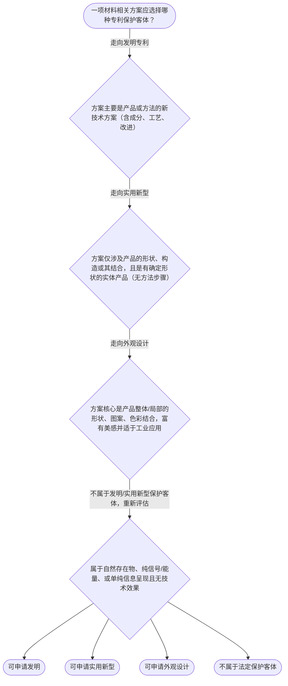

# 专家 B 教学草稿

> 专家：expert_b ｜ 风格：accessible

## 教学模块选择清单

- 当前教学节点：`patent-law-foundation`
- 板块预算：自适应 6/6，总计 9/9

| # | 模块 (block_type) | 类型 | 触发原因 (trigger) | 对应正文段 | 归属 |
|---:|---|:--:|---|---|:--:|
| 1 | `anchor_scenario` | 自适应 | perception=sensing(0.83) / cold_start | 材料实验室的专利十字路口｜材料研发团队刚做出新型自修复纳米涂层：成分新、结构有改进、表面纹理也更好看。项目经理问专利代… | [B] |
| 2 | `legal_anchor` | 必选 | mandatory | 法条锚定：专利法第2条与制度框架｜《专利法》第二条 | [B] |
| 3 | `worked_example` | 自适应 | cold_start(low_confidence) | 案例演示：自修复涂层如何选客体｜团队提交的技术方案包括：（1）特定纳米粒子与树脂配比的涂层组合物；（2）该组合物的制备加热步… | [B] |
| 4 | `decision_flow` | 自适应 | input=visual(0.74) | 决策流：如何判断保护客体类型｜一项材料相关方案应选择哪种专利保护客体？ | [B] |
| 5 | `mnemonic` | 自适应 | understanding=sequential(0.70) | 记忆口诀：独时地 + 三客体｜口诀表：独-时-地｜发-实-外｜法-细则-指南 | [B] |
| 6 | `predict_activate` | 自适应 | processing=active(0.62) | 预测激活：方法能不能报实用新型？｜你的材料涂层制备方法（有配比、有加热步骤）能不能直接作为实用新型申请？先凭直觉猜一下，并说出… | [B] |
| 7 | `assessment` | 必选 | mandatory | 三类测评入口｜回忆发明定义（向后复习L1） | [B] |
| 8 | `knowledge_synthesis` | 必选 | mandatory | 知识综合：基础框架一张网｜专利三特征：独占性（排他实施）、时间性（法定期限）、地域性（授权地域有效） | [B] |
| 9 | `summary_card` | 自适应 | len(knowledge_sub_nodes)=3>=3 | 速查卡：专利法律制度基础｜先认清三特征、三客体、三层楼，材料方案才知道该进哪个保护盒子。 | [B] |

## 教学正文

## 1. 场景导入
材料研发实验室里，小李团队刚做出一种新型纳米涂层：既能防腐蚀，又能自修复微裂纹。同事们七嘴八舌：有人说“赶紧写成发明专利”，有人说“形状也改了，报实用新型更快”，还有人提议“外观好看就报外观设计”。老板追问：“专利到底保护什么？三种类型差在哪里？申请了能管多久、管多远？”你作为理工背景的研发人员，正站在这个十字路口——先看清专利法律制度的底座，才能正确选择保护路径。

## 2. 人话解释
专利制度最核心的三句话：
- **独占性**：授权后别人未经许可不能实施你的技术，像给你的成果上了一把“法定锁”。
- **时间性**：锁不是永久的，发明通常20年、实用新型10年、外观设计15年，到期进入公有领域。
- **地域性**：这把锁只在中国（或你指定的国家）有效，出了国境要另申请。

中国专利制度像三层楼：
1. 《专利法》是地基（原则与授权条件）；
2. 《专利法实施细则》是楼层框架（程序细节）；
3. 《专利审查指南》是操作手册（审查员怎么判）。

保护客体只有三种：发明（产品或方法的新技术方案）、实用新型（产品的形状/构造技术方案）、外观设计（富有美感的新设计）。材料领域最常见的是发明（成分、制备方法）和实用新型（涂层结构、器件外形）。〔RAG: 中华人民共和国专利法.txt — 第二条：发明，是指对产品、方法或者其改进所提出的新的技术方案。实用新型，是指对产品的形状、构造或者其结合所提出的适于实用的新的技术方案。外观设计，是指对产品的整体或者局部的形状、图案或者其结合以及色彩与形状、图案的结合所作出的富有美感并适于工业应用的新设计。〕

制度作用很直接：激励你公开技术换取独占期，公开后别人可站在你肩膀上继续创新，最终推动经济发展。中国特色是“早期公开、延迟审查”加“初步审查与实质审查并存”——发明走实质审查，实用新型/外观设计主要走初步审查。

## 3. 法条回扣
一切判断必须回到《专利法》第二条。发明看“技术方案”（技术手段+技术问题+自然规律效果）；实用新型严格限定“产品+形状/构造”，方法一律排除；外观设计看“美感+工业应用”。〔RAG: 专利法专题讲座.txt — 发明，是指对产品、方法或者其改进所提出的新的技术方案。……实用新型专利只保护产品，所述产品应当是经过产业方法制造的，有确定形状、构造且占据一定空间的实体……一切方法均不属于实用新型的保护客体〕实质审查前先过客体关，再谈新颖性、创造性。

## 4. 类比 / 口诀
把三种客体想成“材料实验室的三种包装盒”：
- 发明盒：能装“配方+工艺+产品”，最大最全；
- 实用新型盒：只装“有形状的实物结构”，方法装不进去；
- 外观设计盒：只看外表美不美、能不能工业量产。
边界提醒：类比仅帮助记忆客体范围，不能替代新颖性/创造性判断；材料成分本身通常走发明，单纯颜色变化可能只够外观设计。

口诀：**独时地，三客体；法细则指南，三层楼**。

## 5. 应试提示
题干关键词：
- 看到“方法/工艺/制备”→优先想发明，排除实用新型；
- 看到“形状、构造、结合”→实用新型候选；
- 看到“美感、图案、色彩”→外观设计。
判断步骤：①先问是否属于法定三种客体 → ②再看是否违反公序良俗等排除条款 → ③才进入三性审查。常见陷阱：把“自然存在的材料”或“单纯信息呈现”当成发明；把“方法步骤”塞进实用新型权利要求。

## 6. 互动提问
本节设有测评（覆盖向后复习/向前探测/薄弱点），请到【习题】区作答。学完后对照速查卡，确认你能一眼分清材料方案该进哪个“包装盒”。

### 材料实验室的专利十字路口（anchor_scenario）

> 材料研发团队刚做出新型自修复纳米涂层：成分新、结构有改进、表面纹理也更好看。项目经理问专利代理人：“我们是报发明、实用新型还是外观设计？专利保护到底有多长、管多远？公开后别人能不能随便用？”团队既想快速拿证，又怕选错类型导致后续审查全盘被动。这个场景把抽象的制度特征、三种客体和审查体系一下子推到眼前。

**锚定**：用材料真实研发冲突同时锚定独占性/时间性/地域性、三种保护客体和中国专利制度三层体系。

**先想一想**：如果你是团队专利负责人，听到“制备方法+有形状涂层+好看纹理”，第一反应会优先选哪种专利类型？为什么？

### 法条锚定：专利法第2条与制度框架（legal_anchor）

- **《专利法》第二条**：第二条用一句话说清三种可保护的“东西”：发明=产品或方法的新技术方案；实用新型=产品形状/构造的技术方案；外观设计=富有美感且能工业应用的新设计。
- **《专利法》第三条**：第三条明确国务院专利行政部门统一受理审查并授权，地方管理部门负责本区域专利管理。

**为何重要**：本节点是后续新颖性、创造性、申请程序的地基。客体判断错了，后面三性再漂亮也无法授权；制度三层楼（法—细则—指南）决定审查员怎么操作。

### 案例演示：自修复涂层如何选客体（worked_example）

**案情/例题**：团队提交的技术方案包括：（1）特定纳米粒子与树脂配比的涂层组合物；（2）该组合物的制备加热步骤；（3）固化后涂层具有微孔阵列结构；（4）表面呈现特定纹理图案。问：哪些内容适合发明？哪些可能适合实用新型或外观设计？为什么方法不能进实用新型？
**适用规则**：《专利法》第二条及审查实践对发明/实用新型/外观设计保护客体的区分
**分步推演**：
1. 组合物成分与制备方法采用技术手段、解决防腐蚀与自修复技术问题、产生符合自然规律的技术效果，属于“产品、方法或其改进的新技术方案”。 → *成分+方法 → 发明客体*
2. 固化后的微孔阵列属于产品的形状/构造，且是经过产业方法制造的有确定形状的实体，可考虑实用新型；但制备步骤本身是方法，不能写入实用新型权利要求。 → *有形状结构 → 实用新型候选；方法排除*
3. 表面纹理图案若以富有美感为主且适于工业应用，可另报外观设计；若纹理同时承担技术功能，则更宜放在发明/实用新型中作为技术特征。 → *美感为主 → 外观设计；功能为主 → 发明/实用新型*
4. 一件申请须符合单一性；方法与产品可按总发明构思合并在发明申请中，实用新型单独聚焦结构。 → *策略上可发明主保护+结构分案*
**结论**：核心成分与制备方法走发明；有确定形状的微孔结构可另报实用新型；纯美感纹理可报外观设计。方法绝不能作为实用新型保护客体。
**本题要点**：先按第二条拆“方案性质”，再决定进哪个盒子；材料方法永远优先想发明。

### 决策流：如何判断保护客体类型（decision_flow）

**决策问题**：一项材料相关方案应选择哪种专利保护客体？



### 记忆口诀：独时地 + 三客体（mnemonic）

**记忆锚**：口诀表：独-时-地｜发-实-外｜法-细则-指南
**映射**：
- 独
- 时
- 地
- 发
- 实
- 外
- 法-细则-指南
**何时用**：看到“专利是什么”“能保护多久/多远”“三种类型怎么选”或材料方案分类题时立刻默念此表。

### 预测激活：方法能不能报实用新型？（predict_activate）

**预测/激活**：你的材料涂层制备方法（有配比、有加热步骤）能不能直接作为实用新型申请？先凭直觉猜一下，并说出理由。

**激活旧知**：已有的“产品vs方法”常识以及专利保护客体的初步印象

**揭晓方向**：回想实用新型定义里有没有“方法”两个字；再想“有确定形状的实体产品”这个硬条件。

### 知识综合：基础框架一张网（knowledge_synthesis）

**知识框架**：
- 专利三特征：独占性（排他实施）、时间性（法定期限）、地域性（授权地域有效）
- 制度三层楼：专利法（原则）→实施细则（程序）→审查指南（操作）
- 保护三客体：发明（产品/方法技术方案）、实用新型（形状构造产品）、外观设计（美感工业设计）
- 制度作用：激励创造、促进公开、推动应用与经济发展
- 中国特点：早期公开延迟审查；发明实质审查与实用新型/外观设计初步审查并存
**概念关系**：先立客体与制度框架，再进入申请程序与三性审查；实用新型是发明的“缩小版产品结构”，外观设计侧重美感而非技术效果；早期公开为后续现有技术检索与抵触申请判断提供时间基准
**必记**：客体判断先于新颖性、创造性；方法不能进实用新型；三特征缺一不可理解专利权边界；中国专利不自动全球有效；材料领域成分与工艺优先考虑发明

### 速查卡：专利法律制度基础（summary_card）

**要点卡**：
- **三特征**：独占性、时间性、地域性——专利权的边界三坐标
- **三客体**：发明管方案（含方法），实用新型只管有形状产品，外观设计管美感设计
- **三层体系**：专利法定原则，细则定程序，指南定怎么审
- **中国特点**：早期公开+延迟审查；发明走实审，实用新型/外观设计主走初审
**必背**：《专利法》第二条三种发明创造的定义原文要点；实用新型不保护方法；专利权具有独占性、时间性、地域性
**一句话总结**：先认清三特征、三客体、三层楼，材料方案才知道该进哪个保护盒子。

### 三类测评入口（assessment）

**三类覆盖**：backward_review、forward_probe、weakness_probe
**题目**：
- q1：回忆发明定义（向后复习L1）
- q2：识别专利申请基本文件（向前探测L1）
- q3：材料制备方法的客体选择辨析（薄弱点L3）


## 结构化字段

## knowledge_points

```json
[
  {
    "node_id": "patent-law-foundation",
    "kc_name": "专利制度的基本概念与特征：独占性、时间性、地域性"
  },
  {
    "node_id": "patent-law-foundation",
    "kc_name": "中国专利制度体系：专利法、专利法实施细则、专利审查指南"
  },
  {
    "node_id": "patent-law-foundation",
    "kc_name": "专利保护的三种客体：发明、实用新型、外观设计（专利法第2条）"
  },
  {
    "node_id": "patent-law-foundation",
    "kc_name": "专利制度的作用：激励发明创造、促进技术公开、推动技术应用和经济发展"
  },
  {
    "node_id": "patent-law-foundation",
    "kc_name": "中国专利制度发展历程与特点：早期公开延迟审查、初步审查制与实质审查制并存"
  }
]
```

## legal_basis

```json
[
  {
    "article": "《专利法》第二条：本法所称的发明创造是指发明、实用新型和外观设计。发明，是指对产品、方法或者其改进所提出的新的技术方案。实用新型，是指对产品的形状、构造或者其结合所提出的适于实用的新的技术方案。外观设计，是指对产品的整体或者局部的形状、图案或者其结合以及色彩与形状、图案的结合所作出的富有美感并适于工业应用的新设计。",
    "source": "中华人民共和国专利法.txt"
  },
  {
    "article": "《专利法》第三条：国务院专利行政部门负责管理全国的专利工作；统一受理和审查专利申请，依法授予专利权。",
    "source": "中华人民共和国专利法.txt"
  },
  {
    "article": "发明专利保护对象：采用技术手段、解决技术问题、获得符合自然规律的技术效果的技术方案；实用新型只保护有确定形状、构造的产品，一切方法不属于实用新型。",
    "source": "专利法专题讲座.txt"
  }
]
```

## risks

```json
[
  {
    "risk": "把实用新型误当成也能保护方法或材料成分本身，导致客体判断错误",
    "related_node_id": "patent-law-foundation"
  },
  {
    "risk": "混淆独占性与地域性，以为中国专利自动覆盖全球",
    "related_node_id": "patent-rights-nature"
  },
  {
    "risk": "过早跳入新颖性/创造性细节而跳过客体与制度框架，导致后续审查逻辑断层",
    "related_node_id": "patent-law-foundation"
  }
]
```

## draft_stage

```json
"debate"
```

## irac

```json
{
  "issue": "材料领域一项同时涉及新成分、新结构和新外观的技术方案，应如何确定专利保护客体类型？",
  "rule": "《专利法》第二条分别定义发明、实用新型、外观设计的保护对象；实用新型仅限产品形状/构造，方法不属于实用新型。",
  "application": "新成分与制备方法属于技术方案，落入发明；有确定形状的结构可另报实用新型；富有美感的外观可报外观设计。三者可策略性组合，但每件申请须符合单一性与客体要求。",
  "conclusion": "优先以发明保护核心成分与方法，结构与外观可另行或分案申请，避免把方法塞进实用新型。"
}
```

## interactive_questions

```json
[
  {
    "qid": "q1",
    "category": "remember",
    "difficulty": "L1",
    "source_tag": "backward_review",
    "kc_node_id": "patent-law-foundation",
    "question": "根据《专利法》第二条，下列哪一项正确描述了发明的定义？",
    "answer": "B",
    "options": [
      "A. 发明是指对产品的形状、构造或者其结合所提出的适于实用的新的技术方案",
      "B. 发明是指对产品、方法或者其改进所提出的新的技术方案",
      "C. 发明是指对产品的整体或者局部的形状、图案所作出的富有美感的新设计",
      "D. 发明仅保护具有确定形状的实体产品，不包括方法"
    ]
  },
  {
    "qid": "q2",
    "category": "understand",
    "difficulty": "L1",
    "source_tag": "forward_probe",
    "kc_node_id": "patent-application-process",
    "question": "关于专利申请文件，下列哪项属于提出发明专利申请时通常需要提交的基本文件之一？",
    "answer": "C",
    "options": [
      "A. 仅需提交产品实物样品即可",
      "B. 只需口头向审查员描述技术方案",
      "C. 请求书、说明书及其摘要、权利要求书等",
      "D. 只需提交外观设计图片，无需文字说明"
    ]
  },
  {
    "qid": "q3",
    "category": "analyze",
    "difficulty": "L3",
    "source_tag": "weakness_probe",
    "kc_node_id": "patent-law-foundation",
    "question": "某材料团队开发了“一种自修复纳米涂层的制备方法，包括特定原料配比与加热步骤，所得涂层具有微裂纹自愈合功能”。现要选择专利类型，下列判断哪项最准确？",
    "answer": "A",
    "options": [
      "A. 该方法属于技术方案，应主要考虑申请发明专利；不宜作为实用新型",
      "B. 因为最终得到有形状的涂层产品，可以直接全部作为实用新型申请",
      "C. 制备方法属于外观设计，因为涂层好看",
      "D. 方法本身不受专利保护，只能公开技术秘密"
    ]
  }
]
```

## knowledge_synthesis

```json
{
  "node": "patent-law-foundation",
  "coverage": [
    {
      "node_id": "patent-rights-nature"
    },
    {
      "node_id": "patent-law-framework"
    },
    {
      "node_id": "patent-law-foundation"
    },
    {
      "node_id": "patent-system-overview"
    }
  ],
  "confusable_pairs": [
    {
      "pair": "发明 vs 实用新型：发明可含方法，实用新型仅限有形状构造的产品"
    },
    {
      "pair": "独占性 vs 地域性：独占不等于全球有效，出了国境要另申请"
    }
  ]
}
```

## exercises

```json
[
  {
    "question": "根据《专利法》第二条，下列哪一项正确描述了发明的定义？",
    "answer": "B",
    "options": [
      "A. 发明是指对产品的形状、构造或者其结合所提出的适于实用的新的技术方案",
      "B. 发明是指对产品、方法或者其改进所提出的新的技术方案",
      "C. 发明是指对产品的整体或者局部的形状、图案所作出的富有美感的新设计",
      "D. 发明仅保护具有确定形状的实体产品，不包括方法"
    ]
  },
  {
    "question": "某材料团队开发了“一种自修复纳米涂层的制备方法，包括特定原料配比与加热步骤”。关于专利类型选择，哪项最准确？",
    "answer": "A",
    "options": [
      "A. 该方法属于技术方案，应主要考虑申请发明专利；不宜作为实用新型",
      "B. 因为最终得到有形状的涂层产品，可以直接全部作为实用新型申请",
      "C. 制备方法属于外观设计，因为涂层好看",
      "D. 方法本身不受专利保护，只能公开技术秘密"
    ]
  }
]
```
