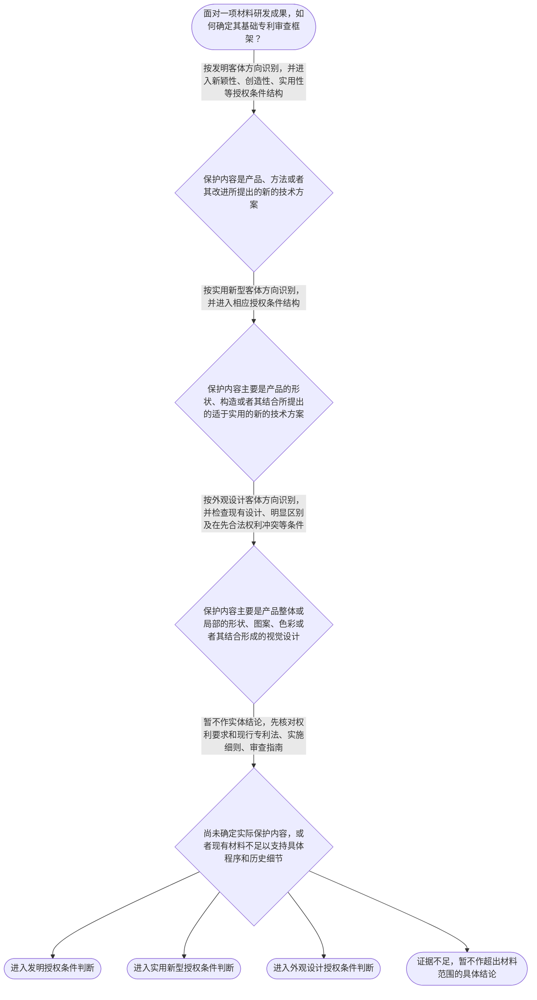

# 整合后的课程完整内容与习题

## 教学模块选择清单

- 当前教学节点：`patent-law-foundation`
- 板块预算：自适应 5/6，总计 9/9

| # | 模块 (block_type) | 类型 | 触发原因 (trigger) | 对应正文段 | 归属 |
|---:|---|:--:|---|---|:--:|
| 1 | `anchor_scenario` | 自适应 | perception=sensing(0.84) / cold_start | 材料研发成果进入专利审查的第一道分流｜某材料研发团队制备出一种耐高温复合涂层，同时形成了新的涂层配方、制备工艺以及产品外表面的特殊… | [A+B融合] |
| 2 | `legal_anchor` | 必选 | mandatory | 法条锚定：客体分类与制度入口｜《专利法》第二条 | [A+B融合] |
| 3 | `worked_example` | 自适应 | cold_start(low_confidence) | 材料复合涂层的客体归类与授权入口｜某公司研发出一种耐腐蚀复合涂层。申请文件甲记载涂层的化学组成和制备方法；申请文件乙只记载涂覆… | [A+B融合] |
| 4 | `decision_flow` | 自适应 | input=visual(0.75) | 专利审查基础分流流程｜面对一项材料研发成果，如何确定其基础专利审查框架？ | [A+B融合] |
| 5 | `mnemonic` | 自适应 | understanding=sequential(0.72) | 客体、权利特征与规范层级速查｜三组并列核对表：第一组“发—实—外”核对保护客体；第二组“独—时—地”核对专利权基本特征；第… | [A+B融合] |
| 6 | `predict_activate` | 自适应 | processing=active(0.64) | 先判断客体，再进入授权条件｜同一种复合材料同时有新的配方、制备工艺和外部图案。审查人员拿到申请后，最先需要完成哪一步基础… | [A+B融合] |
| 7 | `assessment` | 必选 | mandatory | 三类测评：基础回顾、前向探测与薄弱辨析｜识别《专利法》第二条规定的三类发明创造。 | [A+B融合] |
| 8 | `knowledge_synthesis` | 必选 | mandatory | 专利法律制度基础知识网｜保护客体：先区分发明、实用新型和外观设计，再确定适用的审查规则。 | [A+B融合] |
| 9 | `summary_card` | 自适应 | len(knowledge_sub_nodes)=3>=3 | 节点速查卡：从客体到授权条件｜先按保护内容识别客体，再按法—细—指定位规则，最后进入新颖性和创造性的具体判断。 | [A+B融合] |

## 教学正文

## I — 本节点要解决什么问题

材料领域的专利学习，不能一上来就比较文献、讨论新颖性或创造性。第一步应先建立制度基础：专利保护什么、由哪些规范组成、专利权具有什么基本特征，以及专利制度为什么要求技术公开。只有先完成这层定位，后续学习新颖性和创造性时，才不会把不同类型的专利客体、不同层级的规范和不同的法律判断混在一起。

需要特别划清边界：新颖性、创造性和实用性是发明、实用新型的法定授权条件；本节点只说明它们在制度中的位置，不展开“单独对比”“组合对比”、现有技术范围或创造性三步法。〔RAG: 中华人民共和国专利法.txt — 第二十二条：授予专利权的发明和实用新型，应当具备新颖性、创造性和实用性〕

## R — 适用规则

### 1. 专利保护的三类客体

《专利法》第二条首先规定，本法所称的发明创造包括发明、实用新型和外观设计。〔RAG: 中华人民共和国专利法.txt — 第二条：本法所称的发明创造是指发明、实用新型和外观设计〕

- **发明**：对产品、方法或者其改进所提出的新的技术方案。材料领域中的新材料组成、材料制备方法、处理工艺及其改进，通常应先从发明客体方向理解，但最终仍应以申请文件和权利要求的实际限定为准。
- **实用新型**：对产品的形状、构造或者其结合所提出的适于实用的新的技术方案。它原则上保护具有确定形状、构造并占据一定空间的产品，不保护纯粹的方法步骤。〔RAG: 中华人民共和国专利法.txt — 第二条：实用新型是对产品的形状、构造或者其结合所提出的适于实用的新的技术方案〕〔RAG: 专利法专题讲座.txt — 实用新型专利只保护产品；产品的制造方法、使用方法、处理方法等不属于实用新型的保护客体〕
- **外观设计**：对产品整体或者局部的形状、图案或者其结合，以及色彩与形状、图案的结合所作出的富有美感并适于工业应用的新设计。〔RAG: 中华人民共和国专利法.txt — 第二条：外观设计是对产品的整体或者局部的形状、图案或者其结合以及色彩与形状、图案的结合所作出的富有美感并适于工业应用的新设计〕

判断材料成果属于哪类客体时，应看其实际保护内容，而不能只看“新合金”“复合涂层”或“智能材料”等技术名称。配方、组成、制备方法主要表现为技术方案；产品形状、构造及其结合可能涉及实用新型；外部图案、色彩和视觉效果则应考虑外观设计。客体识别只是进入相应审查框架的第一步，不等于已经满足授权条件。

### 2. 中国专利制度的规范体系

中国专利制度可以按“法—细则—指南”建立基础框架：

1. **《专利法》**：规定专利保护客体、基本制度、主要权利义务和授权条件等基础内容；国务院专利行政部门负责管理全国专利工作，统一受理和审查专利申请，依法授予专利权。〔RAG: 中华人民共和国专利法.txt — 第三条：国务院专利行政部门负责管理全国的专利工作；统一受理和审查专利申请，依法授予专利权〕
2. **《专利法实施细则》**：对专利法中的申请、审查、文件、期限等制度作进一步具体化。
3. **《专利审查指南》**：在现行法律、行政法规框架下，为审查实践提供更细化的判断标准和操作指引。

“法—细则—指南”是学习和查证规则的路径，不意味着三者法律效力完全相同。遇到具体案件，应先确定适用的现行法律条文，再结合实施细则和审查指南核对操作标准。

### 3. 专利权的基本特征

从制度概念上，可以用三个维度理解专利权：

- **独占性**：专利权人在法定范围内享有排他性法律利益，他人未经许可不得实施受专利权保护的技术方案或设计，但法律另有规定的例外除外。
- **时间性**：专利保护不是永久性的，只在法定保护期限内存在；期限届满后，相关技术或设计进入可以由社会利用的公共领域。
- **地域性**：专利权的效力原则上受授予权利的国家或地区法域限制；在其他法域寻求保护，通常需要依照相应法域的制度提出申请或采取相应程序。

这三个词描述的是专利权的权利形态，不是“新颖性、创造性、实用性”三个授权条件。当前检索上下文未提供专利权期限、地域效力和具体例外的完整法条原文，因此这里只作基础概念说明，不补写具体期限或未经核验的条文号。

### 4. 专利制度的作用

专利制度的核心制度逻辑，可以概括为“以一定期限和范围内的排他性保护，换取技术方案向社会公开”。其主要作用包括：激励发明创造，促进技术公开，推动技术应用和经济发展。对材料企业而言，申请专利不仅是争取排他性保护，也会使技术信息按照法律要求进入公开和传播体系，从而促进后续技术利用。

### 5. 中国专利制度的发展特点与审查安排

学习材料中所概括的制度特点包括早期公开、延迟审查，以及初步审查制与实质审查制并存。可以先形成程序上的总体印象：不同类型的专利申请和不同审查阶段，审查深度与审查事项存在分工，不能把所有申请都理解为完全相同的审查流程。

但“早期公开”“延迟审查”以及发明、实用新型、外观设计在审查深度上的具体程序差异，需要继续以现行《专利法》《专利法实施细则》和《专利审查指南》核验。当前检索上下文未提供该部分完整直接原文，因此本节点不写具体期限、阶段顺序或历史年份。

## A — 材料领域的基础适用顺序

### 第一步：看保护内容

如果权利要求围绕材料组成、组分比例、制备方法、处理工艺或其改进展开，先从发明的产品或方法技术方案理解。如果围绕具有形状和构造的产品结构展开，考虑实用新型客体。如果保护重点是产品整体或局部的形状、图案、色彩及其结合形成的视觉设计，考虑外观设计客体。

### 第二步：看适用的规范入口

确定客体后，再选择相应的法律框架。发明和实用新型主要进入《专利法》第二十二条所规定的新颖性、创造性和实用性授权条件结构；外观设计则进入《专利法》第二十三条规定的现有设计、明显区别及在先合法权利冲突等判断框架。〔RAG: 中华人民共和国专利法.txt — 第二十三条：外观设计不得属于现有设计；与现有设计或者现有设计特征的组合相比，应当具有明显区别，且不得与他人在先取得的合法权利相冲突〕

### 第三步：再进入后续实体审查

本节点完成的是“客体—规范—授权条件”的定位。后续学习新颖性时，重点会转向申请日以前公众可知的技术以及同样发明创造的在先申请；学习创造性时，才进一步讨论与现有技术相比是否具有突出的实质性特点和显著进步，或实用新型是否具有实质性特点和进步。〔RAG: 中华人民共和国专利法.txt — 第二十二条：现有技术是申请日以前在国内外为公众所知的技术；创造性分别规定发明的突出实质性特点和显著进步、实用新型的实质性特点和进步〕本节点不据此训练具体比对方法。

## C — 结论

材料领域专利审查的基础主线是：**先按实际保护内容识别发明、实用新型或外观设计，再按“专利法—实施细则—审查指南”确定规范入口，最后进入相应授权条件的具体判断。**独占性、时间性、地域性描述专利权的基本权利特征；新颖性、创造性、实用性则是发明和实用新型的授权条件名称，二者不能混淆。

本节设有测评，请到【习题】区作答。

### 材料研发成果进入专利审查的第一道分流（anchor_scenario）

> 某材料研发团队制备出一种耐高温复合涂层，同时形成了新的涂层配方、制备工艺以及产品外表面的特殊图案设计。团队准备提交专利申请，但成员意见不一致：有人认为只要技术先进就应统一申请发明专利，有人认为外部图案应单独处理，还有人尚未区分专利客体就直接开始比较已有文献。此时首先要解决的冲突不是哪份文献更接近，而是每项成果究竟保护什么、应进入哪一种专利制度框架。

**锚定**：用同一材料产品中的配方、工艺和外观图案，锚定三类专利客体、规范体系及授权条件之间的先后关系。

**先想一想**：面对同一材料产品的配方、制备工艺和外部图案，你会先比较现有技术，还是先区分三类专利客体？

### 法条锚定：客体分类与制度入口（legal_anchor）

- **《专利法》第二条**：第二条先划分发明、实用新型和外观设计，并分别说明三类保护客体的法律含义。
- **《专利法》第三条**：第三条说明国务院专利行政部门负责全国专利工作，统一受理和审查专利申请并依法授予专利权。
- **《专利法》第二十二条**：第二十二条规定发明和实用新型的授权条件包括新颖性、创造性和实用性。
- **《专利法》第二十三条**：第二十三条针对外观设计规定现有设计、明显区别以及在先合法权利冲突等要求。

**为何重要**：客体分类决定后续适用哪组审查规则；规范体系定位和授权条件入口，是继续学习专利申请程序、新颖性和创造性的必要基础。

### 材料复合涂层的客体归类与授权入口（worked_example）

**案情/例题**：某公司研发出一种耐腐蚀复合涂层。申请文件甲记载涂层的化学组成和制备方法；申请文件乙只记载涂覆后产品外表面的图案、色彩组合及视觉效果。现需确定两份申请进入哪类专利审查框架，以及新颖性、创造性等授权条件在其中处于什么位置。该例只演示制度定位，不判断具体方案能否授权。
**适用规则**：《专利法》第二条、第二十二条和第二十三条：分别规定发明、实用新型、外观设计的客体，以及发明和实用新型的三性、外观设计的现有设计和明显区别要求。
**分步推演**：
1. 先读取申请文件和权利要求实际限定的保护内容。文件甲围绕材料组成和制备方法形成产品或方法技术方案；文件乙的限定重点是产品外部图案、色彩及其视觉效果。 → *先按实际保护内容识别客体，不能仅按产品名称归类。*
2. 文件甲对应发明定义中的产品或方法技术方案，应进入发明授权条件判断；文件乙应按照外观设计定义判断其客体属性。 → *两份申请的客体不同，适用的授权规则也不同。*
3. 对文件甲，法定授权条件包括新颖性、创造性和实用性；对文件乙，重点进入现有设计、明显区别及在先合法权利冲突等外观设计条件判断。 → *确定客体后，才能选择正确的审查门槛。*
4. 本例没有给出申请日、公开内容或对比文件，因此不能进一步判断新颖性或创造性。具体的单独对比、组合对比和创造性分析留待后续节点。 → *制度定位不等于实体结论，缺少比对事实时不能越界下结论。*
**结论**：文件甲应按发明的产品或方法技术方案进入相应授权条件判断，文件乙应按外观设计客体及其审查条件处理；不能因为二者都与同一材料产品有关，就适用完全相同的审查框架。
**本题要点**：材料案件先看实际保护内容，再定专利客体和适用规则；不要在客体尚未确定时直接判断新颖性或创造性。

### 专利审查基础分流流程（decision_flow）

**决策问题**：面对一项材料研发成果，如何确定其基础专利审查框架？



### 客体、权利特征与规范层级速查（mnemonic）

**记忆锚**：三组并列核对表：第一组“发—实—外”核对保护客体；第二组“独—时—地”核对专利权基本特征；第三组“法—细—指”核对规范层级。注意：第二组不是授权三性，授权三性另记为“新—创—实”。
**映射**：
- 发
- 实
- 外
- 独
- 时
- 地
- 法
- 细
- 指
- 新—创—实
**何时用**：遇到材料技术成果分类、专利制度特点或授权条件入口问题时，先按“发—实—外”识别客体，再按“独—时—地”识别权利特征，最后按“法—细—指”定位规范层级，并与“新—创—实”分开。

### 先判断客体，再进入授权条件（predict_activate）

**预测/激活**：同一种复合材料同时有新的配方、制备工艺和外部图案。审查人员拿到申请后，最先需要完成哪一步基础判断？

**激活旧知**：已学的产品、方法、产品形状构造与外观设计定义，以及独占性、时间性、地域性的基础概念。

**揭晓方向**：先观察申请文件实际限定的保护内容，再决定应从发明、实用新型还是外观设计的法条入口理解；不要先根据“技术先进”判断能否授权。

### 专利法律制度基础知识网（knowledge_synthesis）

**知识框架**：
- 保护客体：先区分发明、实用新型和外观设计，再确定适用的审查规则。
- 规范体系：专利法提供制度和授权条件基础，实施细则具体化程序、文件和期限，审查指南提供审查实践中的操作指引。
- 权利特征：独占性、时间性、地域性描述专利权的基本权利形态；具体期限和例外须以现行法条核验。
- 制度作用：通过一定期限和范围内的排他性保护换取技术公开，从而激励发明创造、促进技术公开和技术应用。
- 制度发展与审查安排：学习材料概括了早期公开、延迟审查以及初步审查制与实质审查制并存的特点；具体程序细节尚需继续核验。
- 授权条件入口：发明和实用新型进入新颖性、创造性、实用性框架，外观设计进入现有设计、明显区别和在先权利冲突等框架。
**概念关系**：先看实际保护内容，再在发明、实用新型和外观设计之间进行客体定位。；客体定位决定适用的授权条件框架；发明和实用新型适用第二十二条的三性结构，外观设计适用第二十三条的相关要求。；专利法、实施细则和审查指南构成从基础规则到具体操作的学习路径，但不应混同其规范层级。；本节点的制度入口先于后续新颖性和创造性节点，不能以基础概念直接替代具体对比判断。
**必记**：《专利法》第二条是识别发明、实用新型和外观设计三类客体的入口条文。；材料配方、组成、制备方法和工艺改进通常先从发明的产品或方法技术方案方向识别；实用新型原则上针对产品的形状、构造或者其结合。；独占性、时间性、地域性是专利权的基本特征；新颖性、创造性、实用性是发明和实用新型的授权条件，二者不能混淆。；客体识别和规范定位完成后，才能进入后续新颖性、创造性的具体审查学习。

### 节点速查卡：从客体到授权条件（summary_card）

**要点卡**：
- **三类保护客体**：发明、实用新型、外观设计分别对应不同的保护内容和审查入口。
- **专利权三特征**：独占性、时间性、地域性描述专利权的基本权利形态。
- **规范体系**：专利法定基础，实施细则作具体化，审查指南提供操作指引。
- **制度作用**：以一定范围和期限的排他性保护换取技术公开，促进创造和应用。
- **授权条件入口**：发明和实用新型进入新颖性、创造性、实用性框架，外观设计适用现有设计和明显区别等要求。
- **学习顺序**：先按实际保护内容识别客体，再定位规范，最后学习具体授权判断。
**必背**：《专利法》第二条规定发明、实用新型和外观设计三类客体。；独占性、时间性、地域性是专利权基本特征。；发明和实用新型应当具备新颖性、创造性和实用性。；实用新型原则上针对产品的形状、构造或者其结合，不保护纯粹方法。；客体、权利特征与授权三性是三组不同概念。
**一句话总结**：先按保护内容识别客体，再按法—细—指定位规则，最后进入新颖性和创造性的具体判断。

### 三类测评：基础回顾、前向探测与薄弱辨析（assessment）

**三类覆盖**：backward_review、forward_probe、weakness_probe
**题目**：
- q_foundation_backward_1：识别《专利法》第二条规定的三类发明创造。
- q_application_forward_1：探测申请程序中要求优先权的书面声明和文件副本要求。
- q_foundation_weakness_1：在材料产品配方、工艺与外观图案并存时区分专利客体和适用审查条件。


## 结构化数据

## expert

```json
"A+B融合"
```

## style

```json
"fused"
```

## knowledge_points

```json
[
  {
    "node_id": "patent-law-foundation",
    "kc_name": "专利制度的基本概念与特征：独占性、时间性、地域性"
  },
  {
    "node_id": "patent-law-foundation",
    "kc_name": "中国专利制度体系：专利法、专利法实施细则、专利审查指南"
  },
  {
    "node_id": "patent-law-foundation",
    "kc_name": "专利保护的三种客体：发明、实用新型、外观设计（专利法第2条）"
  },
  {
    "node_id": "patent-law-foundation",
    "kc_name": "专利制度的作用：激励发明创造、促进技术公开、推动技术应用和经济发展"
  },
  {
    "node_id": "patent-law-foundation",
    "kc_name": "中国专利制度发展历程与特点：早期公开延迟审查、初步审查制与实质审查制并存"
  }
]
```

## legal_basis

```json
[
  {
    "article": "《专利法》第二条",
    "source": "中华人民共和国专利法.txt"
  },
  {
    "article": "《专利法》第三条",
    "source": "中华人民共和国专利法.txt"
  },
  {
    "article": "《专利法》第二十二条",
    "source": "中华人民共和国专利法.txt"
  },
  {
    "article": "《专利法》第二十三条",
    "source": "中华人民共和国专利法.txt"
  },
  {
    "article": "《专利法》第五条、第二十五条",
    "source": "专利法专题讲座.txt"
  },
  {
    "article": "《专利法》第二十条第一款、第二十二条第四款",
    "source": "专利法专题讲座.txt"
  },
  {
    "article": "中国专利制度的早期公开、延迟审查及初步审查与实质审查并存",
    "source": "检索上下文未提供直接依据"
  }
]
```

## risks

```json
[
  {
    "risk": "将独占性、时间性、地域性误认为新颖性、创造性、实用性，前者是专利权的基本权利特征，后者是发明和实用新型的授权条件。",
    "related_node_id": "patent-law-foundation"
  },
  {
    "risk": "仅凭“新材料”“涂层”或其他技术名称确定专利客体，而不查看申请文件和权利要求的实际保护内容。",
    "related_node_id": "patent-law-foundation"
  },
  {
    "risk": "把实用新型理解为可以保护任意方法；实用新型原则上针对产品的形状、构造或者其结合，纯粹方法不属于该客体。",
    "related_node_id": "patent-law-foundation"
  },
  {
    "risk": "把专利法、实施细则和审查指南视为同一层级，或以审查指南替代对现行法条的核验。",
    "related_node_id": "patent-law-framework"
  },
  {
    "risk": "把早期公开、延迟审查以及初步审查与实质审查并存的概括性特点，误当成已经掌握具体程序期限和全部审查步骤。",
    "related_node_id": "patent-system-overview"
  },
  {
    "risk": "在尚未完成客体识别时直接进行新颖性或创造性比对；本节点只建立制度入口，具体判断属于后续节点。",
    "related_node_id": "patentability-substantive"
  }
]
```

## draft_stage

```json
"integration"
```

## irac

```json
{
  "issue": "材料领域技术成果进入专利学习和审查时，应如何识别保护客体、定位中国专利规范体系，并理解新颖性和创造性在授权制度中的位置？",
  "rule": "《专利法》第二条规定发明、实用新型和外观设计的保护客体；《专利法》第三条规定国务院专利行政部门统一受理和审查专利申请并依法授予专利权；《专利法》第二十二条规定发明和实用新型应具备新颖性、创造性和实用性；《专利法》第二十三条规定外观设计的现有设计、明显区别及在先权利冲突要求。",
  "application": "材料组成、配方、制备方法和工艺改进通常先从发明的产品或方法技术方案方向识别；产品形状、构造或者其结合形成的技术方案，考虑实用新型；产品整体或局部的形状、图案、色彩及其结合形成的视觉设计，考虑外观设计。确定客体后，再适用相应的授权条件框架。独占性、时间性、地域性属于专利权基本特征；新颖性、创造性、实用性属于发明和实用新型授权条件，不能混同。",
  "conclusion": "材料领域专利审查应遵循先识别客体、再定位规范体系、后进入授权条件判断的顺序。本节点只建立专利法律制度基础和新颖性、创造性的制度入口，不对具体案件作新颖性或创造性结论。"
}
```

## interactive_questions

```json
[
  {
    "qid": "q_foundation_backward_1",
    "category": "remember",
    "difficulty": "L1",
    "source_tag": "backward_review",
    "kc_node_id": "patent-law-foundation",
    "question": "根据《专利法》第二条，下列哪一项完整列出了专利法所称的三类发明创造？",
    "answer": "C",
    "options": [
      "A. 发明、技术秘密、外观设计",
      "B. 发明、实用新型、技术标准",
      "C. 发明、实用新型、外观设计",
      "D. 产品、方法、技术秘密"
    ]
  },
  {
    "qid": "q_application_forward_1",
    "category": "remember",
    "difficulty": "L1",
    "source_tag": "forward_probe",
    "kc_node_id": "patent-application-process",
    "question": "根据检索到的《专利法》第三十条，申请人要求发明或者实用新型专利优先权时，原则上应当采取下列哪项做法？",
    "answer": "B",
    "options": [
      "A. 仅在授权后提出口头声明",
      "B. 在申请时提出书面声明，并在规定期限内提交第一次申请文件副本",
      "C. 只提交第一次申请文件副本，不提出书面声明",
      "D. 在申请日前任意时间向国务院专利行政部门备案即可"
    ]
  },
  {
    "qid": "q_foundation_weakness_1",
    "category": "analyze",
    "difficulty": "L3",
    "source_tag": "weakness_probe",
    "kc_node_id": "patent-law-foundation",
    "question": "某材料企业提交两项申请：申请甲保护一种新型聚合物及其制备方法；申请乙仅保护同一产品的特殊外部图案和色彩组合。按照《专利法》第二条、第二十二条和第二十三条的客体区分，下列判断最准确的是：",
    "answer": "D",
    "options": [
      "A. 两项申请都只能按实用新型的三性进行审查",
      "B. 申请甲和申请乙都适用完全相同的新颖性、创造性、实用性判断",
      "C. 申请甲属于外观设计，申请乙属于发明，二者均只需判断新颖性",
      "D. 申请甲应先按发明的产品或方法技术方案识别并适用相应授权条件，申请乙应按外观设计客体及其审查条件识别"
    ]
  }
]
```

## knowledge_synthesis

```json
{
  "node": "patent-law-foundation",
  "coverage": [
    {
      "node_id": "patent-rights-nature"
    },
    {
      "node_id": "patent-law-framework"
    },
    {
      "node_id": "patent-system-overview"
    },
    {
      "node_id": "patent-law-foundation"
    },
    {
      "node_id": "patentability-substantive"
    }
  ],
  "confusable_pairs": [
    {
      "pair": "权利特征与授权三性：独占性、时间性、地域性描述专利权形态；新颖性、创造性、实用性是发明和实用新型的授权条件。"
    },
    {
      "pair": "发明与实用新型：发明可针对产品、方法或者其改进；实用新型原则上针对产品的形状、构造或者其结合，不保护纯粹方法。"
    },
    {
      "pair": "实用新型与外观设计：实用新型保护产品形状、构造的技术方案；外观设计保护产品整体或局部的形状、图案、色彩及其结合形成的设计。"
    },
    {
      "pair": "专利法、实施细则与审查指南：三者分别承担基础制度、程序具体化和审查操作指引功能，不是同一层级概念。"
    },
    {
      "pair": "本节点与后续实体审查节点：本节点确认新颖性、创造性的制度位置，不处理具体的单独对比、组合对比或创造性三步法。"
    }
  ]
}
```
