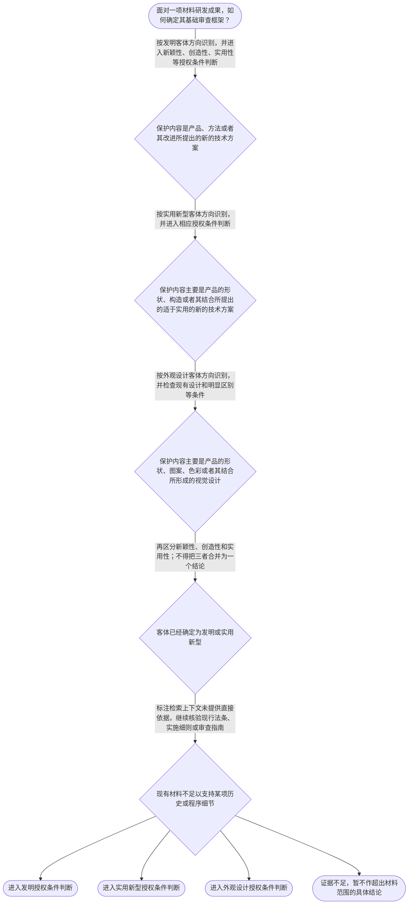

# 专家 A 教学草稿

> 专家：expert_a ｜ 风格：conservative

## 教学模块选择清单

- 当前教学节点：`patent-law-foundation`
- 板块预算：自适应 6/6，总计 9/9

| # | 模块 (block_type) | 类型 | 触发原因 (trigger) | 对应正文段 | 归属 |
|---:|---|:--:|---|---|:--:|
| 1 | `anchor_scenario` | 自适应 | perception=sensing(0.84) / cold_start | 材料研发成果进入专利审查的第一道分流｜某材料研发团队制备出一种耐高温复合涂层，并同时完成了新的涂层配方、制备工艺以及产品外表面的特… | [A] |
| 2 | `legal_anchor` | 必选 | mandatory | 法条锚定：客体分类与授权三性｜《专利法》第二条 | [A] |
| 3 | `worked_example` | 自适应 | cold_start(low_confidence) | 材料复合涂层的客体归类与授权入口｜某公司研发出一种耐腐蚀复合涂层。申请文件甲记载涂层的化学组成和制备方法；申请文件乙只记载涂覆… | [A] |
| 4 | `decision_flow` | 自适应 | input=visual(0.75) | 专利审查基础分流流程｜面对一项材料研发成果，如何确定其基础审查框架？ | [A] |
| 5 | `mnemonic` | 自适应 | understanding=sequential(0.72) | 客体与三性速查表｜两层核对表：第一层“发—实—外”核客体；第二层“新—创—实”核发明和实用新型授权条件。发=产… | [A] |
| 6 | `predict_activate` | 自适应 | processing=active(0.64) | 先判断客体，再进入三性｜同一种复合材料同时有新的配方、制备工艺和外部图案。审查人员拿到申请后，最先需要完成哪一步基础… | [A] |
| 7 | `assessment` | 必选 | mandatory | 三类测评：基础回顾、前向探测与薄弱辨析｜识别《专利法》第二条规定的三类发明创造。 | [A] |
| 8 | `knowledge_synthesis` | 必选 | mandatory | 专利法律制度基础知识网｜保护客体：先区分发明、实用新型和外观设计，再确定适用的审查规则。 | [A] |
| 9 | `summary_card` | 自适应 | len(knowledge_sub_nodes)=3>=3 | 节点速查卡：从客体到授权条件｜先按保护内容识别客体，再按对应法条判断授权条件。 | [A] |

## 教学正文

## I — 法律问题

本节点需要先解决三个基础问题：第一，专利制度保护的对象是什么；第二，中国专利审查规则由哪些规范层级组成；第三，专利权及授权条件具有什么基本结构。新颖性和创造性属于后续实质审查节点，本节只建立其制度入口，不展开具体比对方法。

## R — 适用规则

### 1. 专利保护客体

《专利法》第二条将发明创造分为发明、实用新型和外观设计。发明针对产品、方法或者其改进提出新的技术方案；实用新型针对产品的形状、构造或者其结合提出适于实用的新的技术方案；外观设计针对产品的形状、图案、色彩或者其结合提出富有美感并适于工业应用的新设计。〔RAG: 中华人民共和国专利法.txt — 第二条：发明创造是指发明、实用新型和外观设计；分别规定三类客体的定义〕

因此，材料领域的技术成果不能仅因具有技术含量就直接归入同一类专利客体。应先看权利要求所保护的是产品或方法的技术方案、产品的形状和构造，还是产品外观的设计表达，再确定适用的审查框架。

### 2. 中国专利制度的规范体系

本节将中国专利审查规则理解为由专利法、专利法实施细则和专利审查指南共同构成的规范体系：专利法提供基本制度和授权条件，实施细则具体化程序与文件要求，审查指南进一步说明审查中的操作标准。对于具体案件，应优先核对现行法条和适用的审查规范；检索上下文未提供这三类规范的完整体系条文，因此本稿不对具体条文层级、修订时间或历史沿革作超出材料范围的断言。

### 3. 授权的基本条件

发明和实用新型获得专利权，应当具备新颖性、创造性和实用性；新颖性关注是否属于现有技术以及是否存在特定的在先申请文件记载情形，创造性关注相对于现有技术的实质性特点和进步，实用性关注能否制造或者使用并产生积极效果。〔RAG: 中华人民共和国专利法.txt — 第二十二条：发明和实用新型应当具备新颖性、创造性和实用性，并分别规定三者含义〕

外观设计适用不同的授权条件，包括不属于现有设计、与现有设计或现有设计特征的组合相比具有明显区别等要求。〔RAG: 中华人民共和国专利法.txt — 第二十三条：外观设计不得属于现有设计，并应当具有明显区别〕

## A — 规则适用

### 步骤一：识别保护客体

先从技术成果的法律表达出发，而不是从研发人员对成果的技术名称出发。若材料成果体现为新材料配方、制备方法、工艺参数及其改进，通常应围绕发明的产品或方法技术方案识别；若申请内容仅集中于产品形状、构造或其结合，则需要考虑实用新型客体；若争点集中于产品外部形状、图案、色彩及其结合的视觉效果，则进入外观设计客体判断。具体归类仍须结合申请文件和权利要求的实际内容。

### 步骤二：确定适用的审查门槛

识别客体后，再确定适用的授权条件。发明和实用新型需要同时通过新颖性、创造性和实用性三项要求；外观设计不能机械套用发明和实用新型的三性表述，而应依据其现有设计和明显区别规则进行判断。

### 步骤三：区分新颖性与创造性的制度位置

新颖性和创造性都以现有技术为参照，但判断任务不同：新颖性是基础性的单独披露问题，重点是现有技术是否已经公开同一技术方案；创造性是进一步的非显而易见性问题，重点是相对于现有技术是否具有法定的实质性特点和进步。本节点只确立这一概念边界，具体的单独对比、组合判断和三步法属于后续知识节点。

### 步骤四：把制度目的与审查结果联系起来

专利制度以授予一定期限和地域范围内的排他性法律保护为制度工具，换取技术方案向社会公开并促进技术应用。关于专利权独占性、时间性、地域性及中国制度发展历程的具体法律依据，当前检索上下文未提供直接材料；因此本节仅将其作为知识图要求掌握的制度特征，并明确证据边界，不虚构具体历史年份或程序条文。

## C — 结论

学习材料领域专利审查规则时，应遵循“先识别客体，再确定适用规范，后进入授权条件判断”的顺序。发明和实用新型的授权条件包括新颖性、创造性和实用性；新颖性主要解决是否已有同一方案被公开，创造性进一步解决相对于现有技术是否显而易见。具体的新颖性、创造性比对方法不在本节点展开。

> 常见误区 / 易混淆点

1. 把“技术先进”直接等同于“具有新颖性或创造性”。法律判断必须回到具体保护客体、现有技术和法定要件。
2. 把发明、实用新型和外观设计混用。三类客体的定义和审查重点不同。
3. 把新颖性与创造性当成同一个问题。前者侧重同一技术方案是否被单独公开，后者侧重相对于现有技术是否显而易见。
4. 把制度目的或历史概况当作具体法条结论。缺少检索依据时，应明确标注证据边界。

### 材料研发成果进入专利审查的第一道分流（anchor_scenario）

> 某材料研发团队制备出一种耐高温复合涂层，并同时完成了新的涂层配方、制备工艺以及产品外表面的特殊图案设计。团队准备提交专利申请，但成员意见不一致：有人认为只要技术先进就应统一申请发明专利，有人认为外部图案应单独处理，还有人直接开始比较已有文献，却没有先确定每项成果属于哪类专利客体。审查前必须先解决客体归类和适用规则的冲突。

**锚定**：该情境锚定专利保护客体分类、规范体系和授权条件之间的先后关系。

**先想一想**：面对同一材料产品的配方、工艺和外观图案，你会先比较现有技术，还是先区分三类专利客体？

### 法条锚定：客体分类与授权三性（legal_anchor）

- **《专利法》第二条**：第二条先划分发明、实用新型和外观设计，并分别说明三类保护客体的法律含义。
- **《专利法》第二十二条**：第二十二条规定发明和实用新型必须同时满足新颖性、创造性和实用性，并分别说明三项条件。
- **《专利法》第二十三条**：第二十三条针对外观设计规定现有设计、明显区别以及不得冲突的基本要求。

**为何重要**：客体分类决定后续适用哪组审查规则；第二十二条和第二十三条则分别构成发明、实用新型与外观设计的基本授权门槛。

### 材料复合涂层的客体归类与授权入口（worked_example）

**案情/例题**：某公司研发出一种耐腐蚀复合涂层。申请文件甲记载涂层的化学组成和制备方法；申请文件乙只记载涂覆后产品外表面的图案、色彩组合及视觉效果。现需确定两份申请进入哪类专利审查框架，以及新颖性和创造性在其中处于什么位置。
**适用规则**：《专利法》第二条、第二十二条和第二十三条：分别规定发明、实用新型、外观设计的客体，以及发明和实用新型的三性、外观设计的现有设计和明显区别要求。
**分步推演**：
1. 先读取申请文件所限定的保护内容。文件甲围绕材料组成和制备方法形成产品或方法技术方案；文件乙的限定重点是产品外部图案、色彩及其视觉效果。 → *先按权利要求和申请文件识别保护客体，不能仅按产品名称归类。*
2. 文件甲对应发明定义中的产品或方法技术方案，应进入发明授权条件判断；文件乙应按照外观设计定义判断其是否属于外观设计客体。 → *两份申请的客体不同，适用的授权规则也不同。*
3. 对文件甲，授权入口包括新颖性、创造性和实用性；对文件乙，重点进入现有设计和明显区别等外观设计条件判断。 → *客体确定后，才能选择正确的审查门槛。*
4. 新颖性与创造性均属于发明和实用新型授权条件，但其具体对比方法需要进入后续节点，当前只确定二者不是同一法律问题。 → *本节点建立制度位置，不提前替代后续新颖性和创造性教学。*
**结论**：文件甲应按发明的产品或方法技术方案进入相应授权条件判断，文件乙应按外观设计客体及其审查条件处理；不能因为二者都与同一材料产品有关，就适用完全相同的审查框架。
**本题要点**：材料案件先看保护内容再定专利客体，客体决定后续审查规则。

### 专利审查基础分流流程（decision_flow）

**决策问题**：面对一项材料研发成果，如何确定其基础审查框架？



### 客体与三性速查表（mnemonic）

**记忆锚**：两层核对表：第一层“发—实—外”核客体；第二层“新—创—实”核发明和实用新型授权条件。发=产品、方法或其改进；实=产品形状、构造或其结合；外=形状、图案、色彩及其结合；新=不属于现有技术；创=具有法定实质性特点和进步；实=能够制造或使用并产生积极效果。
**映射**：
- 发
- 实
- 外
- 新
- 创
- 实用
**何时用**：看到材料产品、工艺或外观设计的专利审查问题时，先用“发—实—外”确定客体，再用“新—创—实”核对发明和实用新型的授权条件。

### 先判断客体，再进入三性（predict_activate）

**预测/激活**：同一种复合材料同时有新的配方、制备工艺和外部图案。审查人员拿到申请后，最先需要完成哪一步基础判断？

**激活旧知**：已学的材料技术事实识别能力，以及对产品、方法、形状构造和外观设计的区分。

**揭晓方向**：先观察申请文件实际限定的保护内容，再决定适用第二条、第二十二条还是第二十三条的判断框架。

### 专利法律制度基础知识网（knowledge_synthesis）

**知识框架**：
- 保护客体：先区分发明、实用新型和外观设计，再确定适用的审查规则。
- 规范体系：专利法提供基本制度和授权条件，实施细则与审查指南承担具体化和操作化作用；具体条文须以现行文本核验。
- 授权条件：发明和实用新型需同时满足新颖性、创造性和实用性，外观设计适用现有设计和明显区别等要求。
- 制度特征：专利制度通常从独占性、时间性和地域性理解专利权的基本属性；当前检索上下文未提供其直接原文。
- 制度作用与发展：制度目的涉及激励创造、促进公开和技术应用；关于中国制度具体历史沿革，当前检索上下文未提供直接依据。
**概念关系**：先识别保护客体，再确定适用的授权条件和审查规则。；发明和实用新型进入新颖性、创造性、实用性判断；外观设计进入现有设计和明显区别判断。；新颖性是后续创造性分析的基础概念之一，但本节点不展开具体单独对比和组合判断。；专利法是制度和授权条件的基础，实施细则及审查指南用于具体程序和审查操作；具体内容需继续检索核验。
**必记**：《专利法》第二条是三类专利保护客体的入口条文。；发明和实用新型的授权条件包括新颖性、创造性和实用性，三项不能相互替代。；新颖性与创造性都以现有技术为参照，但新颖性和创造性的法律问题不同。；缺少直接检索依据时，不得补写具体历史年份、未经核验的条文号或审查结论。

### 节点速查卡：从客体到授权条件（summary_card）

**要点卡**：
- **三类保护客体**：发明、实用新型、外观设计分别对应不同的保护内容和审查入口。
- **发明与实用新型三性**：新颖性、创造性、实用性是发明和实用新型的基本授权条件。
- **外观设计条件**：外观设计重点核对现有设计、明显区别及权利冲突等要求。
- **审查顺序**：先识别客体，再选择法条和审查框架，最后进入具体授权条件判断。
- **证据边界**：没有检索到直接依据时，明确说明不足，不编造条文、年份或案例。
**必背**：《专利法》第二条规定发明、实用新型和外观设计三类客体。；发明和实用新型应当具备新颖性、创造性和实用性。；新颖性与创造性不是同一判断：前者侧重同一方案是否被公开，后者侧重相对于现有技术是否显而易见。；客体不同，适用的授权条件和审查重点不同。
**一句话总结**：先按保护内容识别客体，再按对应法条判断授权条件。

### 三类测评：基础回顾、前向探测与薄弱辨析（assessment）

**三类覆盖**：backward_review、forward_probe、weakness_probe
**题目**：
- q_foundation_backward_1：识别《专利法》第二条规定的三类发明创造。
- q_application_forward_1：探测申请程序中要求优先权的声明和文件副本要求。
- q_foundation_weakness_1：在材料产品配方、工艺与外观图案并存时区分专利客体和适用审查条件。


## 结构化字段

## knowledge_points

```json
[
  {
    "node_id": "patent-law-foundation",
    "kc_name": "专利制度的基本概念与特征：独占性、时间性、地域性"
  },
  {
    "node_id": "patent-law-foundation",
    "kc_name": "中国专利制度体系：专利法、专利法实施细则、专利审查指南"
  },
  {
    "node_id": "patent-law-foundation",
    "kc_name": "专利制度的作用及中国专利制度发展特点"
  },
  {
    "node_id": "patent-law-foundation",
    "kc_name": "专利保护客体与专利授权基本条件"
  },
  {
    "node_id": "patent-law-foundation",
    "kc_name": "专利授权实质条件的制度位置"
  }
]
```

## legal_basis

```json
[
  {
    "article": "《专利法》第二条",
    "source": "中华人民共和国专利法.txt"
  },
  {
    "article": "《专利法》第二十二条",
    "source": "中华人民共和国专利法.txt"
  },
  {
    "article": "《专利法》第三条",
    "source": "中华人民共和国专利法.txt"
  }
]
```

## risks

```json
[
  {
    "risk": "当前检索上下文未提供专利制度独占性、时间性、地域性及具体历史沿革的直接原文，相关内容只能作有限的制度概括，不能据此补写具体年份或条文号。",
    "related_node_id": "patent-rights-nature"
  },
  {
    "risk": "当前检索上下文未提供专利法实施细则和专利审查指南的具体条文，关于规范体系的说明不应替代对现行具体条文的核验。",
    "related_node_id": "patent-law-framework"
  },
  {
    "risk": "新颖性与创造性的具体比对方法属于后续节点，本节仅说明制度位置和概念边界，不能据此判断具体材料方案是否具备新颖性或创造性。",
    "related_node_id": "novelty"
  },
  {
    "risk": "材料领域的技术名称不能单独决定专利客体，必须结合申请文件和权利要求记载的技术内容进行归类。",
    "related_node_id": "patent-law-foundation"
  }
]
```

## draft_stage

```json
"debate"
```

## irac

```json
{
  "issue": "材料领域的一项技术成果在进入新颖性和创造性判断前，应如何识别其专利保护客体、适用的中国专利规范体系及授权条件的基本结构？",
  "rule": "《专利法》第二条规定发明、实用新型和外观设计的定义；《专利法》第二十二条规定发明和实用新型应具备新颖性、创造性和实用性，并分别规定三者含义；《专利法》第二十三条规定外观设计的现有设计和明显区别要求。",
  "application": "对材料配方、制备方法或其改进，应先按产品或方法技术方案识别发明客体；对产品形状、构造或其结合，应审查是否属于实用新型客体；对产品外部形状、图案、色彩及其结合的视觉表达，应考虑外观设计客体。确定客体后，发明和实用新型进入新颖性、创造性、实用性三项条件判断，外观设计适用现有设计和明显区别规则。新颖性与创造性的具体比对方法属于后续节点。",
  "conclusion": "材料领域专利审查应遵循先识别客体、再确定适用规则、后判断授权条件的顺序；新颖性与创造性虽均以现有技术为参照，但分别对应同一方案公开与非显而易见性问题。"
}
```

## interactive_questions

```json
[
  {
    "qid": "q_foundation_backward_1",
    "category": "remember",
    "difficulty": "L1",
    "source_tag": "backward_review",
    "kc_node_id": "patent-law-foundation",
    "question": "根据《专利法》第二条，下列哪一项完整列出了专利法所称的三类发明创造？",
    "answer": "C",
    "options": [
      "A. 发明、技术秘密、外观设计",
      "B. 发明、实用新型、技术标准",
      "C. 发明、实用新型、外观设计",
      "D. 产品、方法、技术秘密"
    ]
  },
  {
    "qid": "q_application_forward_1",
    "category": "remember",
    "difficulty": "L1",
    "source_tag": "forward_probe",
    "kc_node_id": "patent-application-process",
    "question": "根据检索到的《专利法》第三十条，申请人要求发明或者实用新型专利优先权时，原则上应当采取下列哪项做法？",
    "answer": "B",
    "options": [
      "A. 仅在授权后提出口头声明",
      "B. 在申请时提出书面声明，并在规定期限内提交第一次申请文件副本",
      "C. 只提交第一次申请文件副本，不提出书面声明",
      "D. 在申请日前任意时间向国务院专利行政部门备案即可"
    ]
  },
  {
    "qid": "q_foundation_weakness_1",
    "category": "analyze",
    "difficulty": "L3",
    "source_tag": "weakness_probe",
    "kc_node_id": "patent-law-foundation",
    "question": "某材料企业提交两项申请：申请甲保护一种新型聚合物及其制备方法；申请乙仅保护同一产品的特殊外部图案和色彩组合。按照《专利法》第二条和第二十二条、第二十三条的客体区分，下列判断最准确的是：",
    "answer": "D",
    "options": [
      "A. 两项申请都只能按实用新型的三性进行审查",
      "B. 申请甲和申请乙都适用完全相同的新颖性、创造性、实用性判断",
      "C. 申请甲属于外观设计，申请乙属于发明，二者均只需判断新颖性",
      "D. 申请甲应先按发明的产品或方法技术方案识别并适用相应授权条件，申请乙应按外观设计客体及其审查条件识别"
    ]
  }
]
```

## knowledge_synthesis

```json
{
  "node": "patent-law-foundation",
  "coverage": [
    {
      "node_id": "patent-rights-nature"
    },
    {
      "node_id": "patent-law-framework"
    },
    {
      "node_id": "patent-system-overview"
    },
    {
      "node_id": "patent-law-foundation"
    },
    {
      "node_id": "patentability-substantive"
    }
  ],
  "confusable_pairs": [
    {
      "pair": "新颖性与创造性：新颖性主要关注同一技术方案是否被现有技术单独公开，创造性进一步关注相对于现有技术是否具有法定的实质性特点和进步。"
    },
    {
      "pair": "发明与实用新型：发明可针对产品、方法或者其改进，实用新型针对产品的形状、构造或者其结合。"
    },
    {
      "pair": "实用新型与外观设计：实用新型保护产品形状、构造的技术方案，外观设计保护产品形状、图案、色彩及其结合形成的设计。"
    }
  ]
}
```
