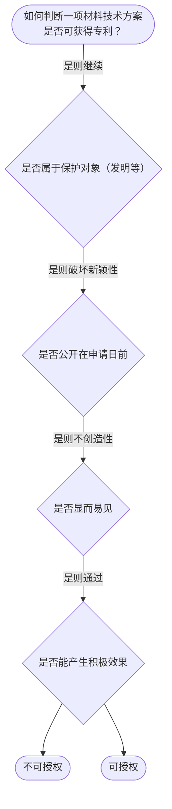

# 专家 B 教学草稿

> 专家：expert_b ｜ 风格：accessible

## 教学模块选择清单

- 当前教学节点：`patent-law-foundation`
- 板块预算：自适应 5/9，总计 9/9

| # | 模块 (block_type) | 类型 | 触发原因 (trigger) | 对应正文段 | 归属 |
|---:|---|:--:|---|---|:--:|
| 1 | `anchor_scenario` | 自适应 | perception=sensing(0.84) / cold_start | 场景锚定｜在材料科学领域，一家企业研发了一种新型高强度合金，用于高温高压环境。团队计划申请发明专利，但… | [B] |
| 2 | `legal_anchor` | 必选 | mandatory | 法条锚定｜《专利法》第二条 | [B] |
| 3 | `worked_example` | 自适应 | cold_start(low_confidence) | 案例演示｜某公司研发新型高强度合金，2024年1月在技术大会上演示，2024年6月提出发明专利申请。问… | [B] |
| 4 | `decision_flow` | 自适应 | input=visual(0.75) | 决策流程｜如何判断一项材料技术方案是否可获得专利？ | [B] |
| 5 | `mnemonic` | 自适应 | understanding=sequential(0.72) | 记忆口诀｜三性记忆表：新-没公开 / 创-非显见 / 实-能用有效 | [B] |
| 6 | `predict_activate` | 自适应 | processing=active(0.64) | 预测激活｜在材料研发的上述新型合金场景中，你预测该申请能否获得专利授权？先猜一个答案。 | [B] |
| 7 | `assessment` | 必选 | mandatory | 测评｜专利保护对象的判断 | [B] |
| 8 | `knowledge_synthesis` | 必选 | mandatory | 知识综合｜保护对象：发明、实用新型、外观设计 | [B] |
| 9 | `summary_card` | 自适应 | len(knowledge_sub_nodes)=3>=3 | 速查卡｜专利基础是保护对象与三性的结合 | [B] |

## 教学正文

## 1. 场景导入

在材料科学领域，一家企业研发了一种新型高强度合金，用于高温高压环境。团队计划申请发明专利，但担心在技术大会上演示该合金是否会破坏新颖性，或者该材料本身是否属于专利保护客体。试想：这种具体技术方案能否通过审查？它是否符合基础概念？如何判断新颖性和创造性？这是一个材料专利审查的真实情境，让我们先从具体场景切入，理解专利制度的基础框架。

## 2. 人话解释

专利制度的核心是赋予发明创造者独占权，以激励发明创造。专利具有时间性（有限期限）、地域性（一国范围内有效）和独占性。专利保护的对象分为三种：发明（对产品、方法或其改进提出的新的技术方案）、实用新型（对产品的形状、构造或其结合提出的适于实用的新技术方案）和外观设计。中国的专利制度体系包括专利法、专利法实施细则和专利审查指南。专利制度的作用在于激励发明创造、促进技术公开、推动技术应用和经济发展。中国专利制度发展特点是采用早期公开、初步审查与实质审查并存的方式。

## 3. 法条回扣

《专利法》第二条规定发明、实用新型和外观设计的保护对象。《专利法》第二十二条规定发明和实用新型专利的授予条件，包括新颖性、创造性和实用性。《专利法》第五条规定了不能获得专利授权的主题。《审查指南》第二部分第九章和第十一章规定了涉及计算机程序和中药的专利客体判断。

## 4. 类比 / 口诀

类比：专利审查就像通过三道安检关卡，只有通过所有检查才能获得独占通行证。新颖性对应‘没被公开’，创造性对应‘非显而易见’，实用性对应‘能产生积极效果’。口诀：新-创-实。三性缺一不可。适用边界：宽限期仅适用于特定公开（如政府主办国际展览），且仅在申请日前6个月内，超出则不豁免。

## 5. 应试提示

题干关键词包括‘申请日前公开’、‘显而易见’、‘实用效果’。常见陷阱是忽略宽限期适用范围，或将自然物质误当作发明。判断时先确认保护对象，再按新颖性→创造性→实用性的顺序逐一核查。

## 6. 互动提问

在材料研发的上述场景中，请先思考该新型合金是否可能获得专利授权？结合保护对象和新颖性、创造性判断，分析可能遇到的风险或条件。

### 场景锚定（anchor_scenario）

> 在材料科学领域，一家企业研发了一种新型高强度合金，用于高温高压环境。团队计划申请发明专利，但担心在技术大会上演示该合金是否会破坏新颖性，或者该材料本身是否属于专利保护客体。试想：这种具体技术方案能否通过审查？它是否符合基础概念？如何判断新颖性和创造性？这是一个材料专利审查的真实情境，让我们先从具体场景切入，理解专利制度的基础框架。

**锚定**：用材料研发的具体情境锚定专利制度的基本概念与特征

**先想一想**：如果你是专利审查员，看到这种新型合金申请，你第一反应是什么风险或条件？为什么？

### 法条锚定（legal_anchor）

- **《专利法》第二条**：专利保护对象：发明是对产品、方法或改进的新技术方案
- **《专利法》第二十二条**：新颖性：未在申请日前公开
- **《专利法》第二十三条**：创造性：对本领域技术人员非显而易见
- **《专利法》第五条**：不能授权主题：违反社会公德等

**为何重要**：这些是专利授权的基础条件，特别是新颖性和创造性判断在材料专利审查中是核心

### 案例演示（worked_example）

**案情/例题**：某公司研发新型高强度合金，2024年1月在技术大会上演示，2024年6月提出发明专利申请。问：能否获得专利？
**适用规则**：《专利法》第二十二条、第二十三条
**分步推演**：
1. 演示是公开行为，需判断是否在申请日前且属于宽限期情形 → *若属宽限期则不破坏新颖性*
2. 创造性判断看本领域技术人员是否显而易见 → *若难以想到则符合*
3. 实用性看能否制造并产生积极效果 → *合金性能符合则通过*
**结论**：若演示在申请日前且在6个月宽限期内，且创造性成立，则可授权
**本题要点**：公开日期与宽限期是关键，先判范围再算日期

### 决策流程（decision_flow）

**决策问题**：如何判断一项材料技术方案是否可获得专利？



### 记忆口诀（mnemonic）

**记忆锚**：三性记忆表：新-没公开 / 创-非显见 / 实-能用有效
**映射**：
- 新
- 创
- 实
**何时用**：审查材料专利时看到新颖性或创造性问题

### 预测激活（predict_activate）

**预测/激活**：在材料研发的上述新型合金场景中，你预测该申请能否获得专利授权？先猜一个答案。

**激活旧知**：已学到的专利保护对象和三性概念

**揭晓方向**：先看公开日期，再判断显而易见，最后看实用效果

### 知识综合（knowledge_synthesis）

**知识框架**：
- 保护对象：发明、实用新型、外观设计
- 制度体系：专利法、实施细则、审查指南
- 作用与发展：激励创新、早期公开与审查并存
**概念关系**：保护对象是基础，三性是实质判断顺序
**必记**：三性缺一不可；材料专利需具体技术方案

### 速查卡（summary_card）

**要点卡**：
- **保护对象**：发明、实用新型、外观设计
- **新颖性**：未公开或宽限期内
- **创造性**：非显而易见
- **实用性**：能用且有效果
**必背**：三性缺一不可
**一句话总结**：专利基础是保护对象与三性的结合

### 测评（assessment）

**三类覆盖**：backward_review、forward_probe、weakness_probe
**题目**：
- q1：专利保护对象的判断
- q2：新颖性判断
- q3：创造性判断


## 结构化字段

## knowledge_points

```json
[
  {
    "node_id": "patent-law-foundation",
    "kc_name": "专利制度的基本概念与特征：独占性、时间性、地域性（详见子节点 patent-rights-nature）"
  },
  {
    "node_id": "patent-law-foundation",
    "kc_name": "中国专利制度体系：专利法、专利法实施细则、专利审查指南（详见子节点 patent-law-framework）"
  },
  {
    "node_id": "patent-law-foundation",
    "kc_name": "专利保护的三种客体：发明、实用新型、外观设计（专利法第2条）"
  },
  {
    "node_id": "patent-law-foundation",
    "kc_name": "专利制度的作用：激励发明创造、促进技术公开、推动技术应用和经济发展（详见子节点 patent-system-overview）"
  },
  {
    "node_id": "patent-law-foundation",
    "kc_name": "中国专利制度发展历程与特点：早期公开延迟审查、初步审查制与实质审查制并存（详见子节点 patent-system-overview）"
  }
]
```

## legal_basis

```json
[
  {
    "article": "《专利法》第二条",
    "source": "专利法专题讲座.txt"
  },
  {
    "article": "《专利法》第二十二条",
    "source": "专利法专题讲座.txt"
  },
  {
    "article": "《专利法》第二十三条",
    "source": "专利法专题讲座.txt"
  },
  {
    "article": "《专利法》第五条",
    "source": "专利法专题讲座.txt"
  }
]
```

## draft_stage

```json
"debate"
```

## interactive_questions

```json
[
  {
    "qid": "q1",
    "category": "remember",
    "difficulty": "L1",
    "source_tag": "backward_review",
    "kc_node_id": "patent-law-foundation",
    "question": "专利保护的三种客体包括以下哪项？",
    "answer": "D",
    "options": [
      "A. 发明",
      "B. 实用新型",
      "C. 外观设计",
      "D. 以上都是"
    ]
  },
  {
    "qid": "q2",
    "category": "understand",
    "difficulty": "L2",
    "source_tag": "forward_probe",
    "kc_node_id": "patent-application-process",
    "question": "专利法律制度基础学习后，接下来将学习什么类型的节点？",
    "answer": "B",
    "options": [
      "A. 专利审查指南",
      "B. 专利申请程序",
      "C. 专利无效宣告",
      "D. 专利复审"
    ]
  },
  {
    "qid": "q3",
    "category": "apply",
    "difficulty": "L3",
    "source_tag": "weakness_probe",
    "kc_node_id": "patent-law-foundation",
    "question": "下列哪项不属于发明专利的保护客体？",
    "answer": "B",
    "options": [
      "A. 一种新型陶瓷复合材料",
      "B. 自然存在的雨花石",
      "C. 改进的制造方法",
      "D. 抗干扰电波信号发生装置"
    ]
  }
]
```
