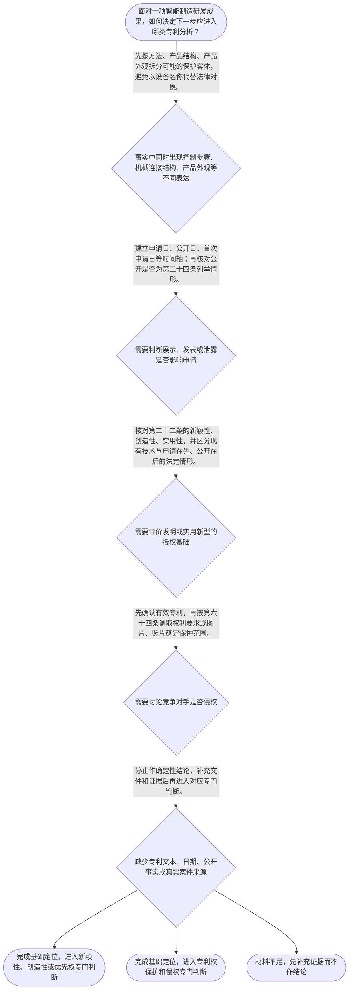

# 整合后的课程完整内容与习题

## 教学模块选择清单

- 当前教学节点：`patent-law-foundation`
- 板块预算：自适应 5/6，总计 9/9

| # | 模块 (block_type) | 类型 | 触发原因 (trigger) | 对应正文段 | 归属 |
|---:|---|:--:|---|---|:--:|
| 1 | `anchor_scenario` | 自适应 | perception=sensing(0.87) / P(L)=0.15<0.3 / cold_start | 柔性分拣单元的专利困惑｜某智能制造企业的柔性分拣单元包括视觉识别与机器人轨迹控制、导轨夹具和传感器连接结构，以及具有… | [A+B融合] |
| 2 | `legal_anchor` | 必选 | mandatory | 专利制度基础的法条锚定｜《专利法》第一条 | [A] |
| 3 | `worked_example` | 自适应 | cold_start(low_confidence) | 客户开放日前的分拣单元布局｜林工的团队计划在2026年4月1日向客户演示分拣单元，并在2026年8月20日提交申请。方案… | [A+B融合] |
| 4 | `decision_flow` | 自适应 | input=visual(0.81) | 专利基础定位流程｜面对一项智能制造研发成果，如何决定下一步应进入哪类专利分析？ | [A+B融合] |
| 5 | `mnemonic` | 自适应 | understanding=sequential(0.76) | 对象依据范围时间表｜四格核对表：对象—依据—范围—时间；三性辅助记忆：新—创—实。 | [B] |
| 6 | `predict_activate` | 自适应 | processing=active(0.72) | 先猜展示风险的判断顺序｜研发团队准备在申请前展示设备时，第一反应应当直接计算是否相隔六个月，还是先核实展示性质和关键… | [B] |
| 7 | `assessment` | 必选 | mandatory | 本节基础测评｜检验智能制造复合方案的客体与文件定位。 | [A+B融合] |
| 8 | `knowledge_synthesis` | 必选 | mandatory | 专利法律制度基础关系网｜制度目的：专利法以保护合法权益、鼓励创造和推动应用为制度目标，具体权利主张仍需具体规则和文件… | [A+B融合] |
| 9 | `summary_card` | 自适应 | len(knowledge_sub_nodes)=3>=3 | 专利基础速查卡｜先分对象，再查依据；先画时间轴，再定范围，最后进入新颖性或侵权的专门判断；真实案例必须核验来… | [A+B融合] |

## 教学正文

## 从智能制造方案看专利制度的入口

[A+B融合] 某智能制造团队开发柔性分拣单元：视觉系统识别零件位置，控制器据此生成机器人抓取路径；设备还包含特定导轨、夹具和传感器连接结构，并设计了具有独特线条、图案和配色的外壳。团队既担心在客户开放日展示会影响后续申请，又希望在竞争对手仿制时主张“侵权”。这里的分拣单元是教学假设，并非本轮检索到的真实案件。当前检索上下文未提供可核验的具体智能制造专利案件或公开专利文献，因此不能虚构案件名称、案号或裁判结论；真实材料部分以下述法条和制度沿革资料为依据。

先稳住主线：本节只建立**专利法律制度基础**，即识别保护对象、制度目的、制度文件和时间轴入口；新颖性、创造性、优先权与侵权的完整判定，分别属于后续专门学习内容。把同一设备中的方法、结构和外观混成一个对象，是初学者最常见的起点错误。

## 制度目的与制度边界

[A] 《专利法》第一条将保护专利权人的合法权益、鼓励发明创造、推动发明创造应用、提高创新能力，以及促进科学技术进步和经济社会发展并列为立法目的。〔RAG: 中华人民共和国专利法.txt — 第一条：为了保护专利权人的合法权益，鼓励发明创造，推动发明创造的应用，提高创新能力，促进科学技术进步和经济社会发展，制定本法〕

[B] 可以把专利制度理解为“公开换取法定保护”的制度安排：研发者不能只停留在“我有一个好点子”，而要把保护对象和申请文件说清楚；使用者也不能只因产品效果相近，就直接断言侵权。这个类比只帮助理解制度功能，不能替代具体法条、有效专利文件和技术比对。

[A+B融合] 专利权具有独占性、时间性和地域性等基本特征，但本轮材料没有提供这些特征的完整直接法条表述及所有细节。学习时应记住：权利效力必须受法定对象、有效期限、适用地域和保护范围约束，不能理解为申请后当然取得永久、无限范围的排他权。

## 三类保护客体：先把技术事实拆开

[A] 《专利法》第二条规定，发明创造包括发明、实用新型和外观设计；发明是对产品、方法或者其改进提出的新的技术方案，实用新型是对产品的形状、构造或者其结合提出的适于实用的新的技术方案，外观设计是对产品整体或者局部的形状、图案及其结合，或者色彩与形状、图案结合所作的富有美感并适于工业应用的新设计。〔RAG: 中华人民共和国专利法.txt — 第二条：本法所称的发明创造是指发明、实用新型和外观设计〕

[A+B融合] 放回分拣单元：机器人根据图像调整轨迹的步骤，先按“方法性技术方案”定位；导轨、夹具和传感器的连接关系，先按“产品形状、构造或其结合”定位；外壳的线条、图案和色彩组合，先按“产品外观设计”定位。它们可以服务于同一台设备，却不当然具有相同的保护对象、申请文件或保护范围。

[A] 还要注意“属于三类客体”不等于当然能授权。发明和实用新型还须具备新颖性、创造性和实用性；外观设计则适用现有设计、明显区别和在先合法权利冲突等法定条件。〔RAG: 中华人民共和国专利法.txt — 第二十二条：授予专利权的发明和实用新型，应当具备新颖性、创造性和实用性；第二十三条：授予专利权的外观设计，应当不属于现有设计，并应当具有明显区别〕

## 新颖性、创造性与时间轴：先建立边界，不抢跑结论

[A+B融合] 对发明、实用新型而言，新颖性关注申请日以前是否已有相关技术为公众所知，以及是否存在“申请在先、公开在后”的同样发明或实用新型申请文件；创造性则是相对现有技术评价技术改进是否达到法定程度。〔RAG: 中华人民共和国专利法.txt — 第二十二条：新颖性，是指该发明或者实用新型不属于现有技术；也没有任何单位或者个人就同样的发明或者实用新型在申请日以前提出过申请，并记载在申请日以后公布的专利申请文件或者公告的专利文件中〕

[A] 因而，公开在申请日前的材料，可能作为现有技术进入新颖性或创造性分析；“申请在先、公开在后”的同样申请文件，是新颖性规则明确规定的另一类障碍。后者不能被简单搬去代替创造性评价的现有技术材料。这是“抵触申请”与现有技术边界的基础认识，完整比较规则留待后续节点展开。

[B] 记忆时不要把“新”和“创”混成一句话：新颖性问“有没有单一的在先公开或法定申请障碍把它完整挡住”；创造性问“面对现有技术，这个改进是否仍然足够不容易想到”。口诀只是答题起步工具，具体判断仍须回到法定定义和证据。

[A+B融合] 日期必须画在同一条时间轴上：申请日通常以国务院专利行政部门收到申请文件之日为准；涉及优先权时，还要核对首次申请地点、相同主题、法定期限与书面声明、副本提交等条件。〔RAG: 中华人民共和国专利法.txt — 第二十八条：国务院专利行政部门收到专利申请文件之日为申请日；第二十九条：发明、实用新型十二个月，外观设计六个月；第三十条：申请时书面声明及副本提交期限〕

[A] 客户开放日或展会展示不能一概视为安全。申请日前六个月内，只有国家紧急状态或非常情况下为公共利益首次公开、中国政府主办或承认的国际展览会首次展出、规定学术或技术会议首次发表、他人未经同意泄露等法定情形，才可能不丧失新颖性。〔RAG: 中华人民共和国专利法.txt — 第二十四条：申请日前六个月内具有列明情形的，不丧失新颖性〕这项规则是特定公开的时间例外，不是对全部公开、全部授权条件的通行证。

## 中国专利制度的发展与审查制度特点

[A+B融合] 制度沿革要依可核验材料说明，不能用一句未经核实的历史概括替代史实。检索到的《专利法律知识详细解读.txt》记载：1992年9月4日通过的第一次修改自1993年1月1日起施行，内容包括将发明专利权期限由15年延长至20年、将实用新型和外观设计专利权期限调整为10年，并修改发明专利审查程序。〔RAG: 专利法律知识详细解读.txt — “中国专利法的第一次修改”：1992年通过，1993年施行；延长专利权保护期限；修改发明专利审查程序〕

[A+B融合] 同一资料还记载，2000年8月25日通过的第二次修改自2001年7月1日起施行，增加了未经许可“许诺销售”的侵权方式，完善了实用新型、外观设计确权程序中的救济，并记载专利保护采用行政与司法并行的“双轨制”。〔RAG: 专利法律知识详细解读.txt — “中国专利法的第二次修改”：2000年通过，2001年施行；增加许诺销售；完善确权救济；“对专利权的保护采用‘双轨制’”〕

[A] 这些资料能够支持的结论是：中国专利制度并非静止不变，保护期限、审查程序、侵权方式和确权救济都曾随专利法修改而调整。至于学习路径所列“早期公开延迟审查、初步审查制与实质审查制并存”，本轮检索材料没有直接、完整说明其历史适用阶段和制度边界，因此不能把该概括进一步写成未经核验的确定史实；如需掌握具体历史阶段，应补充国家知识产权局或正式教材的直接史料。

## 文件体系、保护范围与侵权问题的正确入口

[A+B融合] 中国专利制度学习中，专利法提供基本制度规则；专利法实施细则与专利审查指南在程序和审查适用上承担细化功能。遇到申请、审查或授权问题，应定位到相应层级文件，不能只凭课程口诀下结论。本轮检索仅提供实施细则的部分条文，未提供审查指南的完整基础性原文，故不把文件层级扩展为未经核验的细节。

[A] 侵权判定的第一道门不是比较营销文案，而是确认有效专利及其保护范围。发明和实用新型以权利要求内容为准，说明书及附图可用于解释；外观设计以图片或照片所表示的产品外观设计为准，简要说明可用于解释。〔RAG: 中华人民共和国专利法.txt — 第六十四条：发明或者实用新型专利权的保护范围以其权利要求的内容为准；外观设计专利权的保护范围以表示在图片或者照片中的该产品的外观设计为准〕

[A+B融合] 因此，面对竞争对手的分拣设备，正确顺序是：先确认主张的是方法、产品结构还是外观；再调取相应权利要求或图片、照片；然后在后续侵权节点中比对具体实施行为与保护范围。未经专利权人许可实施其专利会引起侵权纠纷，当事人可协商，协商不成可以起诉或者请求管理专利工作的部门处理；但第六十五条本身不替代具体技术特征比对。〔RAG: 中华人民共和国专利法.txt — 第六十五条：未经专利权人许可，实施其专利，即侵犯其专利权；纠纷可协商、起诉或者请求管理专利工作的部门处理〕

本轮检索未提供可核验的智能制造真实专利案件，因而不以虚构案件支撑新颖性或侵权结论。若后续补充真实案件，应至少核对案件名称、案号或专利公开文献、争议客体及其具体事实，再将其作为案例材料；本节只使用上述真实法源和制度沿革资料作基础说明。

## 本节收束

[A+B融合] 用“对象—依据—范围—时间”四步收束本节：先拆分发明、实用新型与外观设计；再查专利法及对应文件；随后按权利要求或图片照片确定范围；最后把申请、公开和优先权相关日期放到时间轴上。制度历史则要区分已有史料支持的法律修改与尚缺直接依据的概括。这样才能稳妥进入后续的新颖性判断或侵权判定。

本节设有测评，请到【习题】区作答。

### 柔性分拣单元的专利困惑（anchor_scenario）

> 某智能制造企业的柔性分拣单元包括视觉识别与机器人轨迹控制、导轨夹具和传感器连接结构，以及具有独特线条和配色的外壳。该场景用于帮助理解三类专利客体、申请前公开和保护范围。需要特别说明：本轮检索上下文未提供可核验的具体智能制造专利案件或公开专利文献，因此不能把该分拣单元叙述为真实案件；真实材料部分以可核验的专利法及专利制度沿革资料为准。

**锚定**：同一智能制造事实承载客体拆分、时间轴和保护范围问题，同时明确假设场景与真实案件的证据边界。

**先想一想**：面对这套分拣单元，你会先区分控制方法、设备结构和外观设计，还是先判断能否授权？如果要引用真实案例，应先核对案件名称、案号或公开文献来源。

### 专利制度基础的法条锚定（legal_anchor）

- **《专利法》第一条**：第一条说明专利制度既保护合法权益，也鼓励创造、推动应用并促进科技和经济社会发展。
- **《专利法》第二条**：第二条把发明创造分为发明、实用新型和外观设计，并分别界定其保护对象。
- **《专利法》第二十二条**：第二十二条规定发明和实用新型须具备新颖性、创造性和实用性；现有技术是申请日以前在国内外为公众所知的技术。
- **《专利法》第二十四条**：第二十四条规定申请日前六个月内的特定首次公开可不丧失新颖性，但不是一般展示的当然豁免。
- **《专利法》第二十九条、第三十条**：第二十九条、第三十条要求优先权判断同时核对首次申请地点、相同主题、期限以及声明、副本提交程序。
- **《专利法》第六十四条、第六十五条**：第六十四条规定发明和实用新型看权利要求，外观设计看图片或照片；第六十五条提供未经许可实施专利引起纠纷的处理入口。

**为何重要**：这些条文把本节的对象、授权条件、时间轴和保护范围连成一条可核验的判断链。后续学习新颖性和侵权时，必须从这条链回到具体法条与专利文件。

### 客户开放日前的分拣单元布局（worked_example）

**案情/例题**：林工的团队计划在2026年4月1日向客户演示分拣单元，并在2026年8月20日提交申请。方案包括图像驱动的机器人轨迹控制步骤、导轨夹具传感器的连接结构和外壳图案配色。演示地点不是中国政府主办或者承认的国际展览会。团队还发现竞争对手销售了外形近似设备。应如何完成基础定位，而不仓促得出授权或侵权结论？本例是教学假设，不是检索到的真实案件。
**适用规则**：《专利法》第二条、第二十二条、第二十四条、第六十四条、第六十五条；制度沿革参见《专利法律知识详细解读.txt》相关历史修改资料。
**分步推演**：
1. 先按技术表达拆分事实：轨迹控制步骤属于可能的方法性技术方案；导轨、夹具和传感器连接关系属于可能的产品结构方案；外壳图案和配色属于可能的产品外观设计。 → *同一设备先拆分可能的保护客体。*
2. 再把客户演示日与拟申请日放在时间轴上。演示发生在申请日前，且题设未显示其属于第二十四条列举的法定情形，因此不能仅因间隔不足六个月就认定不丧失新颖性。 → *六个月不是所有公开都可适用的安全期。*
3. 对授权条件，只能进一步按第二十二条核对发明或实用新型的新颖性、创造性和实用性；本例尚缺在先技术检索和完整申请文件，不能直接断言能够授权。 → *客体定位不等于授权结论。*
4. 对竞争对手设备，先确认本方是否已有有效专利，并分别调取权利要求或外观设计图片、照片确定保护范围；仅凭“外形近似”或“功能相同”不足以完成侵权认定。 → *侵权分析先定有效权利与保护范围。*
5. 把本例与真实制度资料区分：检索到的《专利法律知识详细解读.txt》记载了1992年通过、1993年施行的第一次重要修改，以及2000年通过、2001年施行的第二次修改，涉及保护期限、审查程序、保护范围和侵权方式等变化；这些是可核验的制度沿革材料，但不是本分拣设备的案件事实。 → *真实来源可以说明制度背景，不能替代具体智能制造案件证据。*
**结论**：团队应优先完成客体拆分、展示事实核验、申请前保密控制和专利文件准备。题设中的普通客户演示不能当然适用新颖性例外；竞争对手是否侵权也须在确认有效权利和保护范围后再作专门比对。检索上下文没有提供该智能制造场景对应的真实案件材料，故不能把本例结论表述为司法裁判结论。
**本题要点**：用“客体拆分—时间轴—授权条件—保护范围”四步，把研发决策和维权判断放回正确顺序；引用真实案例时必须同时核验案件或公开文献来源。

### 专利基础定位流程（decision_flow）

**决策问题**：面对一项智能制造研发成果，如何决定下一步应进入哪类专利分析？



### 对象依据范围时间表（mnemonic）

**记忆锚**：四格核对表：对象—依据—范围—时间；三性辅助记忆：新—创—实。
**映射**：
- 对象
- 依据
- 范围
- 时间
- 新—创—实
**何时用**：看到“能否申请”“展示是否有风险”“竞争对手是否侵权”时，先走四格核对表；看到发明或实用新型授权条件时，再用“新—创—实”检查；看到“真实案例”时，再核对案件或公开文献来源。

### 先猜展示风险的判断顺序（predict_activate）

**预测/激活**：研发团队准备在申请前展示设备时，第一反应应当直接计算是否相隔六个月，还是先核实展示性质和关键日期？如果有人声称这是某个真实案件，你还应核实什么？

**激活旧知**：激活对申请日、公开行为、法定例外和证据来源需要共同核对的时间轴意识。

**揭晓方向**：先将公开日与申请日排入时间轴，再检查公开是否落入法律列举的特定情形；同时核对案件名称、案号或公开文献，不能把假设场景当成真实案例。

### 专利法律制度基础关系网（knowledge_synthesis）

**知识框架**：
- 制度目的：专利法以保护合法权益、鼓励创造和推动应用为制度目标，具体权利主张仍需具体规则和文件支撑。
- 制度特征：独占性、时间性、地域性提示专利权存在法定边界；本节不在缺少完整直接依据时扩展其细节。
- 制度文件：专利法提供基础规范，实施细则和审查指南对程序与审查适用作细化，具体问题须定位相应文件。
- 保护客体：发明可涉及产品、方法或改进；实用新型围绕产品形状、构造或其结合；外观设计围绕产品整体或局部的视觉设计。
- 授权与时间入口：发明、实用新型须满足新颖性、创造性、实用性；公开、申请和优先权问题先用时间轴核对。
- 保护与侵权入口：发明、实用新型以权利要求确定范围，外观设计以图片或照片确定范围；范围确定后才进入具体实施行为比对。
- 制度发展与审查特点：检索到的《专利法律知识详细解读.txt》记载，1992年通过、1993年施行的第一次修改延长了发明、实用新型和外观设计的保护期限，并调整了发明专利审查程序；2000年通过、2001年施行的第二次修改又增加了许诺销售等侵权方式、完善确权救济，并记载专利保护采用行政与司法并行的“双轨制”。〔RAG: 专利法律知识详细解读.txt — 1992年修改内容；2000年修改内容；对专利权的保护采用“双轨制”〕检索材料没有直接完整表述“早期公开延迟审查、初步审查制与实质审查制并存”这一概括，因此本节只能准确讲授上述已获来源支持的沿革和审查程序变化，不把未直接核验的概括写成确定史实。
- must_know大纲不可用? no Chinese string list required.
**概念关系**：制度目的说明为什么保护创新；保护客体决定应准备何种申请与比对文件。；申请日、公开日和优先权相关日期共同决定新颖性与优先权问题的分析入口。；授权条件判断在前，保护范围确认是进入具体侵权分析的前提。；制度沿革资料可以说明法律规则和审查、救济制度的变化，但不能替代具体智能制造案件的案号或公开文献。
**必记**：同一智能制造设备中的方法、结构和外观应分别识别，不能自动视作同一专利对象。；发明、实用新型的新颖性、创造性、实用性是不同条件；抵触申请与现有技术不能混用。；展示风险和优先权必须先建立时间轴，再逐项核对法定条件。；侵权分析先确认有效专利和保护范围，不能只看功能相似或外形相近。；中国专利制度曾通过多次专利法修改调整保护期限、审查程序、侵权方式和确权救济；关于早期公开延迟审查及两种审查制度并存的更具体历史概括，须另取直接史料核验。

### 专利基础速查卡（summary_card）

**要点卡**：
- **制度目的**：保护合法权益、鼓励创造、推动应用，是制度价值；具体主张仍要回到具体法条。
- **三类客体**：方法性方案、产品结构方案、产品外观设计要先分别定位。
- **三性**：发明和实用新型需具备新颖性、创造性、实用性，三者不能混为一项。
- **时间轴**：申请日、公开日、首次申请日及优先权相关日期必须同轴核对。
- **保护范围**：发明和实用新型看权利要求，外观设计看图片或照片。
- **制度发展**：检索资料支持中国专利法通过多次修改调整保护期限、审查程序、侵权方式和确权救济；更具体的早期审查制度概括须有直接史料。
- **真实案例**：当前检索未提供可核验的智能制造专利案件或公开文献，不能把假设场景冒充真实案件。
**必背**：《专利法》第二条的三类发明创造及其基本对象。；发明和实用新型的三性：新颖性、创造性、实用性。；新颖性分析须区分现有技术与申请在先、公开在后的法定情形。；优先权须核对地点、相同主题、期限和程序。；侵权判断先定有效权利和保护范围。；制度沿革的历史结论须对应可核验来源；本轮没有具体智能制造真实案件来源。
**一句话总结**：先分对象，再查依据；先画时间轴，再定范围，最后进入新颖性或侵权的专门判断；真实案例必须核验来源。

### 本节基础测评（assessment）

**三类覆盖**：backward_review、forward_probe、weakness_probe
**题目**：
- q-foundation-01：检验智能制造复合方案的客体与文件定位。
- q-probe-01：探测下一节点中发明或实用新型保护范围的基本文件依据。
- q-weak-01：辨析申请在先、公开在后的情形与新颖性评价的关系。


## 结构化数据

## expert

```json
"A+B融合"
```

## style

```json
"fused"
```

## knowledge_points

```json
[
  {
    "node_id": "patent-law-foundation",
    "kc_name": "专利制度的基本概念与特征：独占性、时间性、地域性"
  },
  {
    "node_id": "patent-law-foundation",
    "kc_name": "中国专利制度体系：专利法、专利法实施细则、专利审查指南"
  },
  {
    "node_id": "patent-law-foundation",
    "kc_name": "专利保护的三种客体：发明、实用新型、外观设计"
  },
  {
    "node_id": "patent-law-foundation",
    "kc_name": "专利制度的作用：激励发明创造、促进技术公开、推动技术应用和经济发展"
  },
  {
    "node_id": "patent-law-foundation",
    "kc_name": "中国专利制度发展历程与特点：早期公开延迟审查、初步审查制与实质审查制并存"
  }
]
```

## legal_basis

```json
[
  {
    "article": "《专利法》第一条",
    "source": "中华人民共和国专利法.txt：第一条"
  },
  {
    "article": "《专利法》第二条",
    "source": "中华人民共和国专利法.txt：第二条"
  },
  {
    "article": "《专利法》第二十二条",
    "source": "中华人民共和国专利法.txt：第二十二条"
  },
  {
    "article": "《专利法》第二十三条",
    "source": "中华人民共和国专利法.txt：第二十三条"
  },
  {
    "article": "《专利法》第二十四条",
    "source": "中华人民共和国专利法.txt：第二十四条"
  },
  {
    "article": "《专利法》第二十九条",
    "source": "中华人民共和国专利法.txt：第二十九条"
  },
  {
    "article": "《专利法》第三十条",
    "source": "中华人民共和国专利法.txt：第三十条"
  },
  {
    "article": "《专利法》第六十四条",
    "source": "中华人民共和国专利法.txt：第六十四条"
  },
  {
    "article": "《专利法》第六十五条",
    "source": "中华人民共和国专利法.txt：第六十五条"
  },
  {
    "article": "1992年专利法第一次修改及1993年施行",
    "source": "专利法律知识详细解读.txt：第一次修改"
  },
  {
    "article": "2000年专利法第二次修改及2001年施行",
    "source": "专利法律知识详细解读.txt：第二次修改；专利保护采用行政与司法并行的“双轨制”"
  }
]
```

## risks

```json
[
  {
    "risk": "不得把“申请在先、公开在后”的同样申请文件简单当作创造性评价中的现有技术；其与新颖性规则的关系须按《专利法》第二十二条及后续专门规则区分。",
    "related_node_id": "patent-law-foundation"
  },
  {
    "risk": "优先权判断不能只记十二个月或六个月，还须同步核对首次申请地点、相同主题、书面声明和副本提交等要求。",
    "related_node_id": "patent-law-foundation"
  },
  {
    "risk": "申请日、公开日、首次申请日和优先权日可能不同；未先制作时间轴，不得对新颖性或优先权直接下结论。",
    "related_node_id": "patent-law-foundation"
  },
  {
    "risk": "同一智能制造设备含有方法、产品结构和外观，不意味着这些内容自动形成同一专利权或相同保护范围。",
    "related_node_id": "patent-law-foundation"
  },
  {
    "risk": "检索材料支持1992年、2000年等专利法修改及其部分制度变化，但没有直接完整支持“早期公开延迟审查、初步审查制与实质审查制并存”的全部历史概括，不能补写未核验细节。",
    "related_node_id": "patent-system-overview"
  },
  {
    "risk": "当前检索上下文未提供可核验的智能制造具体专利案件、案号或公开专利文献；柔性分拣单元仅为教学假设，不得表述为真实案件。",
    "related_node_id": "patent-law-foundation"
  }
]
```

## draft_stage

```json
"integration"
```

## irac

```json
{
  "issue": "智能制造方案同时包含控制方法、设备结构和产品外观，并涉及展示、申请及仿制担忧时，如何在进入新颖性和侵权专门判断前完成专利法律制度基础定位？",
  "rule": "《专利法》第一条规定制度目的；第二条规定发明创造包括发明、实用新型和外观设计，并界定三者；第二十二条规定发明和实用新型的新颖性、创造性、实用性要求及现有技术定义；第二十四条规定特定公开不丧失新颖性的六个月规则；第二十九条、第三十条规定优先权的期限和程序要求；第六十四条规定保护范围的文件依据；第六十五条规定未经许可实施专利的纠纷处理入口。检索到的《专利法律知识详细解读.txt》还记载了1992年、2000年等专利法修改对保护期限、审查程序、侵权方式和确权救济的调整，但没有提供具体智能制造案件材料。",
  "application": "控制轨迹生成步骤、机械连接结构和外壳视觉设计应分别识别为可能的方法、产品结构和外观对象。展示风险应以申请日为基准建立时间轴，并核对是否属于第二十四条列举情形；优先权应另行核对首次申请地点、相同主题、期限与程序。若担心仿制，应先确认有效专利，再按权利要求或图片、照片确定保护范围，不能仅凭设备功能或宣传语判断。制度沿革只能依据已检索的历史修改资料说明，当前没有可核验的智能制造具体案件，故不作案件事实结论。",
  "conclusion": "本节点的结论不是直接宣告能否授权或是否侵权，而是完成“客体—文件—范围—时间”的基础定位；在此基础上，才能进入新颖性、创造性、优先权和侵权的专门判定。"
}
```

## interactive_questions

```json
[
  {
    "qid": "q-foundation-01",
    "category": "understand",
    "difficulty": "L1",
    "source_tag": "backward_review",
    "kc_node_id": "patent-law-foundation",
    "question": "关于智能制造方案的专利基础定位，下列说法正确的是？",
    "answer": "C",
    "options": [
      "A. 同一设备中的控制方法、机械结构和外壳外观必然属于同一专利客体",
      "B. 只要提交专利申请，就当然取得永久且不限地域的专利权",
      "C. 应先区分方法、产品结构和产品外观，再核对相应法律文件与保护范围",
      "D. 只要产品具有商业价值，就当然满足专利授权条件"
    ]
  },
  {
    "qid": "q-probe-01",
    "category": "remember",
    "difficulty": "L1",
    "source_tag": "forward_probe",
    "kc_node_id": "patent-rights-protection",
    "question": "确定发明或者实用新型专利权保护范围时，最直接应当核对的是？",
    "answer": "A",
    "options": [
      "A. 权利要求的内容",
      "B. 产品宣传册中的性能介绍",
      "C. 销售人员对产品优势的说明",
      "D. 竞争对手对产品功能的评价"
    ]
  },
  {
    "qid": "q-weak-01",
    "category": "analyze",
    "difficulty": "L2",
    "source_tag": "weakness_probe",
    "kc_node_id": "patent-law-foundation",
    "question": "甲公司在申请日前已经向国务院专利行政部门提交同样的发明申请，该申请在本申请日以后才公布。评价乙公司同样发明的新颖性时，最稳妥的理解是？",
    "answer": "B",
    "options": [
      "A. 该在先申请因为申请日后才公布，所以与新颖性完全无关",
      "B. 该情形属于新颖性规则明示需要审查的“申请在先、公开在后”障碍，不应简单当作创造性评价材料",
      "C. 该在先申请只能用于证明外观设计不具明显区别",
      "D. 只要乙公司的技术效果更好，该在先申请就不需要考虑"
    ]
  }
]
```

## knowledge_synthesis

```json
{
  "node": "patent-law-foundation",
  "coverage": [
    {
      "node_id": "patent-law-foundation"
    },
    {
      "node_id": "patent-rights-nature"
    },
    {
      "node_id": "patent-law-framework"
    },
    {
      "node_id": "patent-system-overview"
    }
  ],
  "confusable_pairs": [
    {
      "pair": "现有技术与申请在先、公开在后的同样申请：前者可进入新颖性和创造性相关评价，后者是新颖性规则明示的法定障碍，不应简单用于创造性评价。"
    },
    {
      "pair": "发明与实用新型：发明可涉及产品、方法或改进；实用新型聚焦产品形状、构造或其结合。"
    },
    {
      "pair": "申请专利与取得专利权：申请只是程序起点，不能直接等同于已取得可主张的专利权。"
    },
    {
      "pair": "制度沿革概括与直接史料：学习路径中的“早期公开延迟审查、初步审查制与实质审查制并存”须有直接历史材料支持；本轮检索材料直接支持的是多次法律修改及审查程序、保护期限、侵权方式和确权救济的变化。"
    }
  ]
}
```
