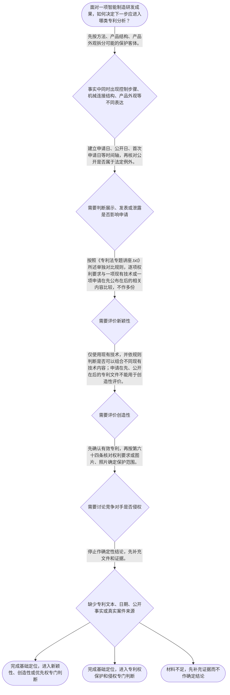

# 整合后的课程完整内容与习题

## 教学模块选择清单

- 当前教学节点：`patent-law-foundation`
- 板块预算：自适应 5/6，总计 9/9

| # | 模块 (block_type) | 类型 | 触发原因 (trigger) | 对应正文段 | 归属 |
|---:|---|:--:|---|---|:--:|
| 1 | `anchor_scenario` | 自适应 | perception=sensing(0.87) / P(L)=0.15<0.3 / cold_start | 柔性分拣单元的专利困惑｜真实材料锚定：本轮检索返回的《专利法专题讲座.txt》包含中国专利新颖性判断、单独对比、申请… | [A+B融合] |
| 2 | `legal_anchor` | 必选 | mandatory | 专利制度基础的法条锚定｜《专利法》第一条 | [A] |
| 3 | `worked_example` | 自适应 | cold_start(low_confidence) | 客户开放日前的分拣单元布局｜某智能制造团队计划在申请日前向客户演示柔性分拣单元，方案包括图像驱动的机器人轨迹控制步骤、导… | [A+B融合] |
| 4 | `decision_flow` | 自适应 | input=visual(0.81) | 专利基础定位流程｜面对一项智能制造研发成果，如何决定下一步应进入哪类专利分析？ | [A+B融合] |
| 5 | `mnemonic` | 自适应 | understanding=sequential(0.76) | 对象依据范围时间比较表｜四格核对表：对象—依据—范围—时间；比较方法再加一格：新颖性单独比，创造性才讨论现有技术组合… | [B] |
| 6 | `predict_activate` | 自适应 | processing=active(0.72) | 先猜展示风险的判断顺序｜研发团队准备在申请前展示设备时，第一反应应当直接计算是否相隔六个月，还是先核实展示性质和关键… | [B] |
| 7 | `assessment` | 必选 | mandatory | 本节基础测评｜检验智能制造复合方案的客体与文件定位。 | [A+B融合] |
| 8 | `knowledge_synthesis` | 必选 | mandatory | 专利法律制度基础关系网｜制度目的：专利法保护合法权益、鼓励创造、推动应用并促进科技和经济社会发展。 | [A+B融合] |
| 9 | `summary_card` | 自适应 | len(knowledge_sub_nodes)=3>=3 | 专利基础速查卡｜先分对象，再查依据；先画时间轴，再选单独或组合比较方法，最后进入新颖性或侵权的专门判断；真实… | [A+B融合] |

## 教学正文

## 从智能制造方案看专利制度的入口

[A+B融合] 本节以柔性分拣单元作教学假设：视觉系统识别零件位置并生成机器人抓取路径，设备还包含导轨、夹具和传感器连接结构，外壳具有特定线条、图案和配色。需要先说明证据边界：本轮检索返回了《专利法专题讲座.txt》等真实法律教学材料，但未返回可核验的智能制造案件名称、案号或专利公开号，因此不能把该分拣单元冒充真实案件。真实材料用于说明法律规则，场景仅用于把规则放入智能制造语境。

先稳住主线：本节只建立专利法律制度基础，即识别保护对象、制度目的、制度文件和时间轴入口；新颖性、创造性、优先权与侵权的完整判定属于后续专门内容。把同一设备中的方法、结构和外观混成一个对象，是初学者常见的起点错误。

## 制度目的与制度边界

[A] 《专利法》第一条将保护专利权人的合法权益、鼓励发明创造、推动发明创造应用、提高创新能力以及促进科学技术进步和经济社会发展并列为立法目的。〔RAG: 中华人民共和国专利法.txt — 第一条：为了保护专利权人的合法权益，鼓励发明创造，推动发明创造的应用，提高创新能力，促进科学技术进步和经济社会发展，制定本法〕

[B] 可以把专利制度理解为“公开换取法定保护”的制度安排。这个类比只帮助理解制度功能，不能替代具体法条、有效专利文件和技术比对。

[A+B融合] 专利权具有独占性、时间性和地域性等基本特征，权利效力受法定对象、期限、地域和保护范围约束，不能理解为申请后当然取得永久、无限范围的排他权。

## 三类保护客体：先把技术事实拆开

[A] 《专利法》第二条规定，发明创造包括发明、实用新型和外观设计；发明是对产品、方法或者其改进提出的新的技术方案，实用新型是对产品的形状、构造或者其结合提出的适于实用的新的技术方案，外观设计是对产品整体或者局部的形状、图案及其结合，或者色彩与形状、图案结合所作的富有美感并适于工业应用的新设计。〔RAG: 中华人民共和国专利法.txt — 第二条：本法所称的发明创造是指发明、实用新型和外观设计；发明、实用新型及外观设计的定义〕

[A+B融合] 放回分拣单元，机器人根据图像调整轨迹的步骤先按可能的方法性技术方案定位；导轨、夹具和传感器的连接关系先按可能的产品结构方案定位；外壳的线条、图案和色彩组合先按可能的产品外观设计定位。三类内容可以服务于同一台设备，却不当然具有相同的保护对象、申请文件或保护范围。

[A] “属于三类客体”不等于当然能授权。发明和实用新型还须具备新颖性、创造性和实用性；外观设计适用现有设计、明显区别和在先合法权利冲突等条件。〔RAG: 中华人民共和国专利法.txt — 第二十二条：授予专利权的发明和实用新型，应当具备新颖性、创造性和实用性；第二十三条：授予专利权的外观设计，应当不属于现有设计并具有明显区别〕

## 新颖性、创造性与时间轴：先建立边界

[A+B融合] 新颖性关注申请日以前已有的现有技术，以及申请日以前提出、申请日以后公布或公告的同样发明或者实用新型申请文件。判断新颖性时，要将各项权利要求分别与一项现有技术或一项申请在先公布在后的相关内容比较，不得把多项文件或多个技术方案组合。〔RAG: 中华人民共和国专利法.txt — 第二十二条：现有技术是申请日以前在国内外为公众所知的技术，并规定申请在先、公开在后的同样申请文件；RAG: 专利法专题讲座.txt — 四、新颖性的判断原则：“单独地进行比较”，不得与几项技术内容组合〕

[A] 创造性评价使用现有技术，可以将一份或者多份现有技术中的不同技术内容组合；检索材料明确指出，申请在先、公开在后的专利文件不能用于评价创造性。〔RAG: 专利法专题讲座.txt — “只有现有技术才能用于评价创造性，申请在先公开在后的专利文件不能用于评价创造性”〕因此，抵触申请不能被简单搬去代替创造性评价的现有技术材料。

[A+B融合] 日期必须画在同一条时间轴上：申请日、公开日、首次申请日和优先权日可能不同。涉及优先权时，还要核对首次申请地点、相同主题、法定期限以及书面声明和副本提交等条件。〔RAG: 中华人民共和国专利法.txt — 第二十九条、第三十条：优先权期限及声明、副本提交要求〕

[A] 申请日前六个月内，只有法定特定情形才可能不丧失新颖性；普通客户演示不能仅因距离申请日不足六个月就获得豁免。〔RAG: 中华人民共和国专利法.txt — 第二十四条：申请日前六个月内列明情形的，不丧失新颖性〕

## 中国专利制度的发展与审查制度特点

[A+B融合] 中国专利制度的历史特点，不能只靠一句口诀概括。现有检索材料直接记载，1992年通过、1993年施行的第一次修改，延长了专利权保护期限，并将发明专利公布后、授权前的异议程序修改为授权后的撤销程序，同时修改了发明专利审查程序。〔RAG: 专利法律知识详细解读.txt — “中国专利法的第一次修改”：1992年通过、1993年施行；“修改了发明专利审查程序”；“将发明专利公布后、授权前的异议程序修改为授权后的撤销程序”〕

[A+B融合] 这组材料可以具体说明：制度沿革涉及公开、审查、授权及授权后救济的阶段安排，且不同历史时期的程序机制可能不同。学习路径所列“早期公开、延迟审查、初步审查制与实质审查制并存”，在本轮返回的材料中没有同时提供其历史起点、各专利类型的适用对象和阶段边界，因此本节不把它扩写为未经核验的确定史实；目前能够据直接来源确认的是发明专利审查程序曾被法律修改，不能据此推导所有专利类型均适用相同审查程序。要进一步掌握该历史特点，应补充国家知识产权局正式史料或正式教材，并逐项核对“公开”“延迟审查”“初步审查”“实质审查”的适用范围。〔RAG: 专利法律知识详细解读.txt — 1992年修改及发明专利审查程序调整〕

## 文件体系、保护范围与侵权问题的正确入口

[A+B融合] 中国专利制度学习中，专利法提供基本制度规则；专利法实施细则与专利审查指南对程序和审查适用进行细化。遇到申请、审查或授权问题，应定位到相应层级文件，不能只凭课程口诀下结论。

[A] 侵权判定的第一道门不是比较营销文案，而是确认有效专利及其保护范围。发明和实用新型以权利要求内容为准，说明书及附图可以用于解释；外观设计以图片或照片所表示的产品外观设计为准，简要说明可以用于解释。〔RAG: 中华人民共和国专利法.txt — 第六十四条：发明或者实用新型专利权的保护范围以权利要求的内容为准；外观设计专利权的保护范围以图片或者照片中的产品外观设计为准〕

[A+B融合] 因此，面对竞争对手的分拣设备，应先确认主张的是方法、产品结构还是外观，再调取相应权利要求或图片、照片，随后在后续侵权节点中比对具体实施行为与保护范围。未经许可实施专利可能引起侵权纠纷，当事人可协商、起诉或者请求管理专利工作的部门处理。〔RAG: 中华人民共和国专利法.txt — 第六十五条：未经专利权人许可实施其专利属于侵权，纠纷可协商、起诉或者请求管理专利工作的部门处理〕

本轮检索未提供可核验的智能制造真实专利案件、案号或公开专利文献，因而不虚构案件名称、事实或裁判结论。已检索到的《专利法专题讲座.txt》是真实法律教学材料，但不是智能制造案件；如需将真实智能制造案例纳入本节，应继续补充国家知识产权局公开专利文献或法院裁判文书，并核对其争议客体与具体事实。

## 本节收束

[A+B融合] 用“对象—依据—范围—时间—比较方法”收束本节：先拆分发明、实用新型与外观设计；再查专利法及对应文件；随后按权利要求或图片照片确定范围；把申请、公开和优先权日期放到时间轴上；最后区分新颖性的单独对比与创造性可能采用的现有技术组合。制度历史则应区分直接史料支持的审查程序调整与仍需补充史料的具体阶段概括。

本节设有测评，请到【习题】区作答。

### 柔性分拣单元的专利困惑（anchor_scenario）

> 真实材料锚定：本轮检索返回的《专利法专题讲座.txt》包含中国专利新颖性判断、单独对比、申请在先公布在后及公开例外的教学材料，但未返回具体智能制造案件名称、案号或智能制造专利公开号。因此，以下柔性分拣单元仍是教学假设，不冒充真实案件；真实材料仅用于说明可核验的法律规则。某智能制造企业的柔性分拣单元包括视觉识别与机器人轨迹控制、导轨夹具和传感器连接结构，以及具有独特线条和配色的外壳。

**锚定**：以智能制造设备承载客体拆分、时间轴和保护范围问题；同时把已检索的真实法律教学材料与尚未检索到的具体智能制造案件明确区分。

**先想一想**：面对这套分拣单元，你会先区分控制方法、设备结构和外观设计，还是先判断能否授权？如果要结合真实案例，应先核对案件名称、案号或专利公开文献，并确认其争议客体。

### 专利制度基础的法条锚定（legal_anchor）

- **《专利法》第一条**：第一条说明专利制度保护合法权益、鼓励发明创造、推动发明创造应用，并促进科技进步和经济社会发展。
- **《专利法》第二条**：第二条将发明创造分为发明、实用新型和外观设计，并分别界定其对象。
- **《专利法》第二十二条**：第二十二条规定发明和实用新型的​​新颖性、创造性和实用性；现有技术是申请日以前在国内外为公众所知的技术。
- **《专利法》第二十四条**：第二十四条规定申请日前六个月内特定首次公开不丧失新颖性，但不构成一般公开的当然豁免。
- **《专利法》第二十九条、第三十条**：第二十九条、第三十条要求优先权判断核对首次申请地点、相同主题、期限以及声明和副本提交程序。
- **《专利法》第六十四条、第六十五条**：第六十四条规定发明和实用新型以权利要求确定保护范围，外观设计以图片或照片确定保护范围；第六十五条规定侵权纠纷的处理入口。

**为何重要**：这些条文把本节的制度目的、保护对象、授权条件、时间轴和侵权分析入口连接起来；具体新颖性和侵权结论仍须回到法条与专利文件。

### 客户开放日前的分拣单元布局（worked_example）

**案情/例题**：某智能制造团队计划在申请日前向客户演示柔性分拣单元，方案包括图像驱动的机器人轨迹控制步骤、导轨夹具传感器连接结构和外壳图案配色；竞争对手销售了外形近似设备。如何完成基础定位？
**适用规则**：《专利法》第二条、第二十二条、第二十四条、第六十四条、第六十五条；新颖性单独对比和申请在先公布在后的规则见《专利法专题讲座.txt》。本例为教学假设，不是检索到的真实案件。
**分步推演**：
1. 先按技术表达拆分事实：轨迹控制步骤属于可能的方法性技术方案；导轨、夹具和传感器连接关系属于可能的产品结构方案；外壳图案和配色属于可能的产品外观设计。 → *同一设备先拆分可能的保护客体。*
2. 再把公开日、申请日和可能的首次申请日放入时间轴。题设未显示公开属于法定例外，因此不能只因间隔不足六个月就认定不丧失新颖性。 → *六个月不是所有公开都可适用的安全期。*
3. 《专利法专题讲座.txt》说明新颖性采取单独对比：各项权利要求分别与一项现有技术或一项申请在先公布在后的相关内容比较，不得组合多份材料；创造性才可能对多份现有技术的不同技术内容作组合评价。 → *新颖性单独对比，创造性与申请在先公布在后不能混用。*
4. 对竞争对手设备，先确认本方是否有有效专利，再分别调取权利要求或外观设计图片、照片确定保护范围；仅凭外形近似不足以完成侵权认定。 → *侵权分析先确定有效权利与保护范围。*
5. 本轮检索没有返回案件名称、案号或智能制造专利公开号，不能把本例包装成真实案例；如需真实案例，应补充国家知识产权局公开文献或法院裁判文书后再分析。 → *真实案例必须有可核验来源。*
**结论**：团队应先拆分方法、产品结构和外观设计，建立申请日与公开日时间轴，再分别核对授权条件和保护范围。普通客户演示不能当然适用新颖性例外；竞争对手是否侵权也不能仅凭功能或外形相似确定。本轮检索未返回可核验的智能制造具体案件或公开专利文献，故不作案件裁判结论。
**本题要点**：用“客体拆分—时间轴—单独对比—保护范围”四步建立基础定位；引用真实智能制造案例时必须核验案件或公开文献来源。

### 专利基础定位流程（decision_flow）

**决策问题**：面对一项智能制造研发成果，如何决定下一步应进入哪类专利分析？



### 对象依据范围时间比较表（mnemonic）

**记忆锚**：四格核对表：对象—依据—范围—时间；比较方法再加一格：新颖性单独比，创造性才讨论现有技术组合。
**映射**：
- 对象
- 依据
- 范围
- 时间
- 比较
- 新—创—实
**何时用**：看到“能否申请”“展示是否有风险”“竞争对手是否侵权”时，依次走对象、依据、范围、时间和比较五格；看到真实案例时，再核对案件或公开文献来源。

### 先猜展示风险的判断顺序（predict_activate）

**预测/激活**：研发团队准备在申请前展示设备时，第一反应应当直接计算是否相隔六个月，还是先核实展示性质和关键日期？若有人声称这是某个真实智能制造案件，还应核实什么？

**激活旧知**：激活对申请日、公开行为、法定例外、单独对比和证据来源共同核对的意识。

**揭晓方向**：先将公开日、申请日和首次申请日排入时间轴，再检查公开是否属于法定列举情形；评价新颖性时坚持单独对比，评价创造性时才讨论现有技术组合；同时核对案件名称、案号或专利公开号。

### 专利法律制度基础关系网（knowledge_synthesis）

**知识框架**：
- 制度目的：专利法保护合法权益、鼓励创造、推动应用并促进科技和经济社会发展。
- 制度特征：独占性、时间性、地域性提示专利权具有法定边界，不能理解为永久、无限地域的排他权。
- 制度文件：专利法提供基础规则，实施细则和审查指南对程序及审查适用作细化。
- 保护客体：发明可涉及产品、方法或改进；实用新型围绕产品形状、构造或其结合；外观设计围绕产品整体或局部的形状、图案、色彩及其结合。
- 授权与时间入口：发明、实用新型须满足新颖性、创造性、实用性；公开、申请和优先权问题先用时间轴核对。
- 新颖性与创造性边界：新颖性采取单独对比；创造性评价可以组合一份或多份现有技术中的不同技术内容；申请在先、公开在后的专利文件不能用于创造性评价。〔RAG: 专利法专题讲座.txt — “判断新颖性时……单独地进行比较，不得将其与几项现有技术……组合”；“只有现有技术才能用于评价创造性”〕
- 保护与侵权入口：发明、实用新型以权利要求确定范围，外观设计以图片或照片确定范围，之后才进入具体实施行为比对。
- 制度发展与审查特点：现有检索材料直接记载，1992年专利法修改将发明专利公布后、授权前的异议程序修改为授权后的撤销程序，并调整保护期限和发明专利审查程序。〔RAG: 专利法律知识详细解读.txt — “1992年专利法第一次修改”：将发明专利公布后、授权前的异议程序修改为授权后的撤销程序；修改发明专利审查程序〕这说明中国专利制度经历了公开、审查和授权救济机制的阶段性调整。就学习路径所称“早期公开、延迟审查、初步审查制与实质审查制并存”，本轮返回材料没有同时提供其历史起点、适用对象和阶段边界的直接原文，因此本节不把该概括扩写为未经核验的历史事实；准确可确认的范围是：检索材料支持发明审查程序曾被修改，且不能据此推导所有专利类型均适用同一审查程序。若需掌握该历史概括，应继续核验国家知识产权局正式史料或正式教材。
**概念关系**：制度目的说明为什么保护创新；保护客体决定申请与比对文件的类型。；申请日、公开日和优先权相关日期共同决定新颖性与优先权分析入口。；新颖性单独对比，创造性才可能组合现有技术；两种比较方法不能混用。；授权条件判断在前，保护范围确认是进入具体侵权分析的前提。；制度沿革只能以直接史料确定适用范围；本轮没有返回可核验的具体智能制造案件或专利公开号。
**必记**：同一智能制造设备中的方法、结构和外观应分别识别，不能自动视作同一专利对象。；发明、实用新型的新颖性、创造性、实用性是不同条件；新颖性单独对比，申请在先、公开在后的文件不能用于创造性评价。；展示风险和优先权必须先建立时间轴，再逐项核对法定条件。；侵权分析先确认有效专利和保护范围，不能只看功能相似或外形相近。；中国专利制度的审查和授权救济机制曾随法律修改调整；关于早期公开、延迟审查及两种审查制并存的更具体历史结论，须以直接史料限定。

### 专利基础速查卡（summary_card）

**要点卡**：
- **制度目的**：保护合法权益、鼓励创造、推动应用，是制度价值；具体主张仍要回到法条。
- **三类客体**：方法性方案、产品结构方案、产品外观设计要先分别定位。
- **三性**：发明和实用新型需具备新颖性、创造性、实用性。
- **时间轴**：申请日、公开日、首次申请日及优先权相关日期必须同轴核对。
- **比较方法**：新颖性单独对比；创造性才可能组合现有技术，申请在先公开在后不能用于创造性评价。
- **审查制度沿革**：检索资料直接支持1992年修改审查程序并将授权前异议改为授权后撤销；早期公开、延迟审查及两种审查制并存的具体历史范围仍须直接史料核验。
- **真实案例**：本轮检索返回真实法律教学材料，但未返回可核验的智能制造案件或专利公开号，不能把假设场景冒充真实案件。
**必背**：《专利法》第二条的三类发明创造及其基本对象。；发明和实用新型的三性：新颖性、创造性、实用性。；新颖性采用单独对比，申请在先、公开在后的文件不能用于创造性评价。；优先权须核对地点、相同主题、期限和程序。；侵权判断先确定有效权利和保护范围。；1992年修改对发明专利审查及授权前异议、授权后撤销机制的调整；更具体历史结论须对应直接来源。
**一句话总结**：先分对象，再查依据；先画时间轴，再选单独或组合比较方法，最后进入新颖性或侵权的专门判断；真实案例必须核验来源。

### 本节基础测评（assessment）

**三类覆盖**：backward_review、forward_probe、weakness_probe
**题目**：
- q-foundation-01：检验智能制造复合方案的客体与文件定位。
- q-probe-01：探测下一节点中发明或实用新型保护范围的基本文件依据。
- q-weak-01：辨析申请在先、公开在后的情形与新颖性单独对比规则。


## 结构化数据

## expert

```json
"A+B融合"
```

## style

```json
"fused"
```

## knowledge_points

```json
[
  {
    "node_id": "patent-law-foundation",
    "kc_name": "专利制度的基本概念与特征：独占性、时间性、地域性"
  },
  {
    "node_id": "patent-law-foundation",
    "kc_name": "中国专利制度体系：专利法、专利法实施细则、专利审查指南"
  },
  {
    "node_id": "patent-law-foundation",
    "kc_name": "专利保护的三种客体：发明、实用新型、外观设计"
  },
  {
    "node_id": "patent-law-foundation",
    "kc_name": "专利制度的作用：激励发明创造、促进技术公开、推动技术应用和经济发展"
  },
  {
    "node_id": "patent-law-foundation",
    "kc_name": "中国专利制度发展历程与特点：早期公开延迟审查、初步审查制与实质审查制并存"
  }
]
```

## legal_basis

```json
[
  {
    "article": "《专利法》第一条",
    "source": "中华人民共和国专利法.txt：第一条"
  },
  {
    "article": "《专利法》第二条",
    "source": "中华人民共和国专利法.txt：第二条"
  },
  {
    "article": "《专利法》第二十二条",
    "source": "中华人民共和国专利法.txt：第二十二条"
  },
  {
    "article": "《专利法》第二十四条",
    "source": "中华人民共和国专利法.txt：第二十四条；专利法专题讲座.txt：四、新颖性的判断原则"
  },
  {
    "article": "《专利法》第二十九条、第三十条",
    "source": "中华人民共和国专利法.txt：第二十九条、第三十条"
  },
  {
    "article": "《专利法》第六十四条、第六十五条",
    "source": "中华人民共和国专利法.txt：第六十四条、第六十五条"
  },
  {
    "article": "1992年专利法第一次修改",
    "source": "专利法律知识详细解读.txt：1992年专利法第一次修改"
  },
  {
    "article": "新颖性单独对比及创造性不得使用申请在先公开在后的专利文件",
    "source": "专利法专题讲座.txt：四、新颖性的判断原则"
  }
]
```

## risks

```json
[
  {
    "risk": "不得把申请在先、公开在后的同样申请文件简单用于创造性评价；检索材料明确只有现有技术才能用于评价创造性。",
    "related_node_id": "patent-law-foundation"
  },
  {
    "risk": "优先权判断不能只记期限，还须核对首次申请地点、相同主题、声明和副本提交程序。",
    "related_node_id": "patent-law-foundation"
  },
  {
    "risk": "申请日、公开日、首次申请日和优先权日可能不同；未先制作时间轴，不得直接下结论。",
    "related_node_id": "patent-law-foundation"
  },
  {
    "risk": "同一智能制造设备含有方法、产品结构和外观，不意味着这些内容自动形成同一专利权或相同保护范围。",
    "related_node_id": "patent-law-foundation"
  },
  {
    "risk": "检索资料支持1992年专利法修改及其审查程序调整，但未直接完整支持早期公开、延迟审查及初步审查制与实质审查制并存的历史阶段，不能补写未经核验的细节。",
    "related_node_id": "patent-system-overview"
  },
  {
    "risk": "本轮检索返回了真实的专利法律教学材料，但未返回可核验的智能制造具体案件、案号或专利公开号；柔性分拣单元仅为教学假设，不得表述为真实案件。",
    "related_node_id": "patent-law-foundation"
  }
]
```

## draft_stage

```json
"integration"
```

## irac

```json
{
  "issue": "智能制造方案同时包含控制方法、设备结构和产品外观，并涉及展示、申请及仿制担忧时，如何在进入新颖性和侵权专门判断前完成专利法律制度基础定位？",
  "rule": "《专利法》第一条规定制度目的；第二条规定发明创造包括发明、实用新型和外观设计；第二十二条规定发明和实用新型的新颖性、创造性和实用性要求及现有技术定义；第二十四条规定特定公开不丧失新颖性的六个月规则；第二十九条、第三十条规定优先权期限和程序要求；第六十四条规定保护范围的文件依据；第六十五条规定未经许可实施专利的纠纷处理入口。《专利法专题讲座.txt》说明新颖性采用单独对比，只有现有技术才能用于创造性评价。检索到的《专利法律知识详细解读.txt》记载1992年修改调整了发明专利审查程序，并将授权前异议程序修改为授权后的撤销程序。",
  "application": "控制轨迹生成步骤、机械连接结构和外壳视觉设计应分别识别为可能的方法、产品结构和外观对象。展示风险应以申请日为基准建立时间轴，并核对是否属于第二十四条列举情形。新颖性分析采用单独对比，不能把申请在先、公开在后的文件当作创造性评价材料。若担心仿制，应先确认有效专利，再按权利要求或图片、照片确定保护范围。检索到的制度沿革资料支持1992年审查程序调整，但没有返回可核验的具体智能制造案件，故不作案件事实结论。",
  "conclusion": "本节点完成“客体—文件—范围—时间—比较方法”的基础定位；在此基础上，才能进入新颖性、创造性、优先权和侵权的专门判定。"
}
```

## interactive_questions

```json
[
  {
    "qid": "q-foundation-01",
    "category": "understand",
    "difficulty": "L1",
    "source_tag": "backward_review",
    "kc_node_id": "patent-law-foundation",
    "question": "关于智能制造方案的专利基础定位，下列说法正确的是？",
    "answer": "C",
    "options": [
      "A. 同一设备中的控制方法、机械结构和外壳外观必然属于同一专利客体",
      "B. 只要提交专利申请，就当然取得永久且不限地域的专利权",
      "C. 应先区分方法、产品结构和产品外观，再核对相应法律文件与保护范围",
      "D. 只要产品具有商业价值，就当然满足专利授权条件"
    ]
  },
  {
    "qid": "q-probe-01",
    "category": "remember",
    "difficulty": "L1",
    "source_tag": "forward_probe",
    "kc_node_id": "patent-rights-protection",
    "question": "确定发明或者实用新型专利权保护范围时，最直接应当核对的是？",
    "answer": "A",
    "options": [
      "A. 权利要求的内容",
      "B. 产品宣传册中的性能介绍",
      "C. 销售人员对产品优势的说明",
      "D. 竞争对手对产品功能的评价"
    ]
  },
  {
    "qid": "q-weak-01",
    "category": "analyze",
    "difficulty": "L2",
    "source_tag": "weakness_probe",
    "kc_node_id": "patent-law-foundation",
    "question": "甲公司在申请日前已经向国务院专利行政部门提交同样的发明申请，该申请在本申请日以后才公布。评价乙公司同样发明的新颖性时，最稳妥的理解是？",
    "answer": "B",
    "options": [
      "A. 该在先申请因为申请日后才公布，所以与新颖性完全无关",
      "B. 该情形属于新颖性规则明示需要审查的“申请在先、公开在后”障碍，不应简单当作创造性评价材料",
      "C. 该在先申请只能用于证明外观设计不具明显区别",
      "D. 只要乙公司的技术效果更好，该在先申请就不需要考虑"
    ]
  }
]
```

## knowledge_synthesis

```json
{
  "node": "patent-law-foundation",
  "coverage": [
    {
      "node_id": "patent-law-foundation"
    },
    {
      "node_id": "patent-rights-nature"
    },
    {
      "node_id": "patent-law-framework"
    },
    {
      "node_id": "patent-system-overview"
    }
  ],
  "confusable_pairs": [
    {
      "pair": "发明与实用新型：发明可涉及产品、方法或改进；实用新型聚焦产品形状、构造或其结合。"
    },
    {
      "pair": "现有技术与申请在先、公开在后的同样申请：新颖性采用单独对比，只有现有技术才能用于创造性评价。"
    },
    {
      "pair": "制度发展概括与直接史料：检索资料直接支持1992年发明专利审查程序及异议、撤销机制的调整；早期公开、延迟审查及两种审查制并存的具体历史范围仍须直接史料核验。"
    }
  ]
}
```
