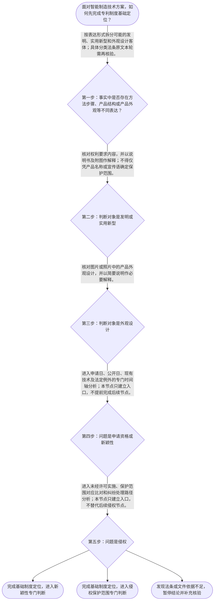

# 专家 A 教学草稿

> 专家：expert_a ｜ 风格：conservative

## 教学模块选择清单

- 当前教学节点：`patent-law-foundation`
- 板块预算：自适应 7/7，总计 9/9

| # | 模块 (block_type) | 类型 | 触发原因 (trigger) | 对应正文段 | 归属 |
|---:|---|:--:|---|---|:--:|
| 1 | `anchor_scenario` | 自适应 | perception=sensing(0.87) / P(L)=0.15<0.3 / cold_start | 从智能制造研发场景识别专利制度边界｜某智能制造企业研发了一条用于柔性装配的生产线：视觉相机识别零件位置，机器人控制器根据识别结果… | [A] |
| 2 | `legal_anchor` | 必选 | mandatory | 专利制度基础的法条锚定｜《专利法》第一条 | [A] |
| 3 | `worked_example` | 自适应 | cold_start(low_confidence) | 智能分拣单元的专利客体与保护范围识别｜某智能制造企业开发自动分拣单元，方案包括：一套根据相机图像调整机器人抓取路径的控制方法；一种… | [A] |
| 4 | `decision_flow` | 自适应 | input=visual(0.81) | 专利基础定位决策流程｜面对智能制造技术方案，如何先完成专利制度基础定位？ | [A] |
| 5 | `mnemonic` | 自适应 | understanding=sequential(0.76) | 专利基础四问核对表｜基础四问核对表：对象、依据、范围、时间。对象问“保护什么”；依据问“哪份申请文件和哪条规则”… | [A] |
| 6 | `predict_activate` | 自适应 | processing=active(0.72) | 先定位对象，再进入法律判断｜在自动分拣设备同时包含控制算法、机械结构和外壳外观时，进行专利分析的第一步应当是直接比较竞争… | [A] |
| 7 | `assessment` | 必选 | mandatory | 本节基础知识测评｜识别专利法律制度基础的正确表述。 | [A] |
| 8 | `knowledge_synthesis` | 必选 | mandatory | 专利法律制度基础关系网｜专利制度基本概念与特征：专利制度以法律保护为基础，权利效力不能脱离法定对象、范围、时间和地域… | [A] |
| 9 | `summary_card` | 自适应 | len(knowledge_sub_nodes)=3>=3 | 专利基础速查卡｜先定对象和依据，再定范围与时间，最后进入新颖性或侵权的专门判断。 | [A] |

## 教学正文

## I — 法律问题

本节只处理“专利法律制度基础”这一主节点：面对智能制造中的控制方法、机械结构和设备外观，如何识别专利保护客体、理解制度目的，并为后续新颖性和侵权判定建立对象、文件与时间轴边界。本节不提前完成新颖性、创造性或具体侵权成立判断。

## R — 适用规则

《专利法》第一条明确，制定专利法的目的包括保护专利权人的合法权益、鼓励发明创造、推动发明创造的应用、提高创新能力以及促进科学技术进步和经济社会发展。〔RAG: 中华人民共和国专利法.txt — 第一条：为了保护专利权人的合法权益，鼓励发明创造，推动发明创造的应用，提高创新能力，促进科学技术进步和经济社会发展〕

本节教学上下文将《专利法》第二条作为三类专利客体的定位依据，即发明、实用新型和外观设计。但本轮检索上下文没有提供第二条原文，因此这里只作分类入口，具体法条文字须另行核验。

《专利法》第六十四条规定，发明或者实用新型专利权的保护范围以权利要求的内容为准，说明书及附图可以用于解释权利要求的内容；外观设计专利权的保护范围以图片或者照片中的该产品的外观设计为准，简要说明可以用于解释图片或者照片所表示的产品的外观设计。〔RAG: 中华人民共和国专利法.txt — 第六十四条：发明或者实用新型专利权的保护范围以其权利要求的内容为准；外观设计专利权的保护范围以表示在图片或者照片中的该产品的外观设计为准〕

《专利法》第二十四条规定，申请专利的发明创造在申请日前六个月内，因国家出现紧急状态或者非常情况时为公共利益目的首次公开，或在中国政府主办或者承认的国际展览会上首次展出、在规定的学术会议或者技术会议上首次发表、或者被他人未经申请人同意泄露的，不丧失新颖性。〔RAG: 中华人民共和国专利法.txt — 第二十四条：申请专利的发明创造在申请日以前六个月内，有法定情形之一的，不丧失新颖性〕

## A — 规则适用

第一步是拆分技术事实。智能制造方案中的“相机采集图像后调整机器人轨迹”属于方法性技术内容；导轨、夹具、传感器之间的连接关系属于产品结构内容；设备外壳的线条、形状和色彩组合属于外观内容。三者可能共同服务于一台设备，但法律分析对象并不因此自动合并。

第二步是核对对应文件。针对发明或者实用新型，不能只看产品名称、宣传材料或研发人员口头描述，而应核对权利要求的具体内容，并在必要时使用说明书及附图解释。针对外观设计，应核对图片或照片所表示的产品外观，并结合简要说明作必要解释。〔RAG: 中华人民共和国专利法.txt — 第六十四条：说明书及附图可以用于解释权利要求；简要说明可以用于解释图片或者照片所表示的产品外观设计〕

第三步是区分后续问题。若问题是新颖性，应把相关公开行为放在申请日之前或之后的时间轴上，并进一步核对是否属于第二十四条规定的特定公开例外。申请日前六个月并不自动意味着安全，仍须先核对公开类型、首次公开条件及其他法定要求。若问题是侵权，应先确定有效专利的保护范围，再分析是否存在未经许可的实施行为；第六十五条提供的是纠纷解决入口，并不替代对具体技术特征的对应比对。〔RAG: 中华人民共和国专利法.txt — 第六十五条：未经专利权人许可，实施其专利，即侵犯其专利权；纠纷可协商、起诉或请求管理专利工作的部门处理〕

第四步是处理制度层级。专利法提供基本规范，专利法实施细则负责程序性细化，专利审查指南用于审查实践中的具体适用。具体申请、审查、授权、保护和无效问题，必须分别查找相应条文或指南依据。本轮检索片段不足以支持中国专利制度完整发展历程及各审查模式的历史细节，因此不在本节扩展为确定性结论。

## C — 结论

专利基础分析应固定遵循“先识别客体，再核对依据和对应文件，随后确定保护范围，最后进入新颖性或侵权的专门判断”。对于智能制造复合方案，控制方法、机械结构和产品外观应分别定位，不能把同一设备中的全部技术内容视为一个自动产生、范围相同的专利权。

本节设有测评，请到【习题】区作答。

> 常见误区 / 易混淆点

- “写进专利申请文件”不等于“已经获得专利权”，申请、审查、授权和保护是不同阶段。
- “技术效果相同”不等于“保护范围相同”；发明和实用新型首先看权利要求，外观设计首先看图片或照片中的外观设计。
- “申请日前六个月内公开”不等于当然不丧失新颖性，必须核对第二十四条列明的公开类型和条件。
- 新颖性和侵权是不同问题：前者重点涉及申请日前的公开与比较，后者重点涉及有效权利的保护范围与未经许可实施。

### 从智能制造研发场景识别专利制度边界（anchor_scenario）

> 某智能制造企业研发了一条用于柔性装配的生产线：视觉相机识别零件位置，机器人控制器根据识别结果调整抓取轨迹，末端执行器完成装配。研发负责人希望把控制方法、设备结构和设备外观都纳入专利布局，但团队成员把“申请了专利”直接理解成“已经获得全国范围、永久有效的独占权”。现在企业准备向一家竞争对手发出侵权警告，却尚未区分专利客体、权利范围、有效期限和地域范围。

**锚定**：用智能制造研发与维权场景锚定专利客体、权利效力、保护范围和制度边界。

**先想一想**：在评价这项专利布局或侵权警告前，应先核对哪些基础要素：保护的对象、权利范围、时间期限，还是其他事项？

### 专利制度基础的法条锚定（legal_anchor）

- **《专利法》第一条**：第一条说明专利法的制度目的，包括保护专利权人的合法权益、鼓励发明创造、推动发明创造应用、提高创新能力以及促进科技进步和经济社会发展。
- **《专利法》第二条**：第二条是本节识别保护客体的入口：专利保护对象分为发明、实用新型和外观设计；本轮未检索到原文，具体表述应以现行法条核验。
- **《专利法》第二十四条**：第二十四条规定，申请日前六个月内发生的特定首次公开、首次展出、首次发表或未经同意泄露，在满足法定条件时不丧失新颖性。
- **《专利法》第六十四条**：第六十四条区分保护范围的判断对象：发明和实用新型看权利要求内容，外观设计看图片或照片中的产品外观设计，说明书、附图或简要说明用于相应解释。
- **《专利法》第六十五条**：第六十五条规定，未经许可实施专利引起纠纷时，可以协商；协商不成的，专利权人或利害关系人可以起诉，也可以请求管理专利工作的部门处理。

**为何重要**：本节点先建立专利制度的对象、目的和边界。后续学习新颖性时要回到申请日、公开行为和法定例外，学习侵权判定时要回到权利要求或外观设计图片确定保护范围；本轮对第二条仅作证据边界明确的定位，不把未检索原文当作已核验材料。

### 智能分拣单元的专利客体与保护范围识别（worked_example）

**案情/例题**：某智能制造企业开发自动分拣单元，方案包括：一套根据相机图像调整机器人抓取路径的控制方法；一种具有特定导轨、夹具和传感器连接关系的设备结构；以及设备外壳的特定线条、形状和色彩组合。企业准备进行专利布局，并希望据此判断竞争对手是否已经落入保护范围。应如何建立基础判断链？
**适用规则**：《专利法》第一条用于理解制度目的；《专利法》第二条用于区分发明、实用新型和外观设计，但本轮检索未提供第二条原文；《专利法》第六十四条用于区分发明、实用新型与外观设计的保护范围判断对象。
**分步推演**：
1. 先把事实按技术表达方式拆分：控制步骤体现方法性技术方案，导轨、夹具和传感器的连接关系体现产品结构，外壳的线条、形状和色彩组合体现产品外观。此处只做客体识别，不直接作授权或侵权结论。 → *先按事实识别可能的专利客体。*
2. 再核对申请文件和权利要求的实际记载。对于发明或实用新型，保护范围的核心判断对象是权利要求内容；不能只根据宣传材料、产品名称或说明书中的技术效果推定范围。 → *发明和实用新型先看权利要求。*
3. 如果主张的是外观设计，则应核对图片或照片中表示的产品外观设计，并结合简要说明作必要解释。外观视觉要素与设备内部控制逻辑属于不同判断对象。 → *外观设计先看图片或照片所表示的外观。*
4. 最后分别核对制度目的、申请文件、权利范围和纠纷处理路径。若进一步判断新颖性，还必须建立申请日与公开日的时间轴；若进一步判断侵权，还必须进行权利要求或外观设计层面的对应比对。 → *基础分类完成后，才能进入新颖性或侵权的专门判断。*
**结论**：该企业应先按技术内容拆分可能的保护客体，再分别审查申请文件和权利范围。不能因为一份申请同时描述了控制算法、机械结构和设备外观，就当然认为三者具有相同的保护范围或已经产生相同的专利权效力。
**本题要点**：智能制造复合方案应先拆分客体，再按相应保护范围规则核对文件，不能把技术、外观和权利效力混为一谈。

### 专利基础定位决策流程（decision_flow）

**决策问题**：面对智能制造技术方案，如何先完成专利制度基础定位？



### 专利基础四问核对表（mnemonic）

**记忆锚**：基础四问核对表：对象、依据、范围、时间。对象问“保护什么”；依据问“哪份申请文件和哪条规则”；范围问“权利要求还是图片照片”；时间问“申请日、公开日和期限如何排列”。
**映射**：
- 对象
- 依据
- 范围
- 时间
**何时用**：面对智能制造方案、专利申请评估或侵权预警时，先按“对象—依据—范围—时间”逐项核对，再进入新颖性、创造性或侵权的专门分析。

### 先定位对象，再进入法律判断（predict_activate）

**预测/激活**：在自动分拣设备同时包含控制算法、机械结构和外壳外观时，进行专利分析的第一步应当是直接比较竞争对手产品，还是先确定每项技术内容对应的保护客体和判断文件？

**激活旧知**：激活对技术方案、产品结构、设备外观和申请文件之间区别的已有直觉。

**揭晓方向**：先看争议对象属于方法、产品结构还是产品外观，再看相应权利要求或图片照片；结论必须能回到具体依据。

### 专利法律制度基础关系网（knowledge_synthesis）

**知识框架**：
- 专利制度基本概念与特征：专利制度以法律保护为基础，权利效力不能脱离法定对象、范围、时间和地域边界。独占性、时间性、地域性是本节用于建立边界意识的核心特征；本轮检索未提供其直接法条原文。
- 中国专利制度体系：专利法提供基本制度框架，专利法实施细则规定程序性细节，专利审查指南用于审查实践中的具体适用；本轮检索上下文未提供后两者的具体条文或指南原文。
- 三类专利客体：发明、实用新型和外观设计构成专利保护客体的基础分类；本轮依据教学上下文定位《专利法》第二条，但未将未检索原文当作直接证据。
- 专利制度作用：专利法第一条明确保护专利权人合法权益、鼓励发明创造、推动发明创造应用、提高创新能力并促进科技进步和经济社会发展。
- 制度发展与审查特点：现行制度包含申请、审查、授权、保护及无效等不同环节；本轮检索片段显示专利申请复审与专利权保护分别处于不同制度环节，具体历史沿革和审查模式需另行检索核验。
**概念关系**：先识别保护客体，再确定适用的申请文件和保护范围。；法条提供规范依据，实施细则和审查指南承担程序及审查适用的细化功能。；申请日、公开日和法定例外构成后续新颖性时间轴；权利要求或图片照片构成后续侵权保护范围判断入口。；专利制度目的解释制度价值，但具体权利主张仍须由具体法条和有效专利文件支撑。
**必记**：专利分析不能只看技术名称，必须先确认保护客体和对应法律文件。；发明、实用新型的保护范围以权利要求内容为准；外观设计的保护范围以图片或照片中的产品外观设计为准。；新颖性后续判断必须核对申请日、公开日及法定例外；本节点只建立时间轴意识，不替代新颖性专门学习。；专利权保护和侵权救济是不同问题：前者要确定保护范围，后者还要核对未经许可实施及适用的纠纷处理路径。

### 专利基础速查卡（summary_card）

**要点卡**：
- **制度边界**：专利权不是无期限、无地域、无对象限制的抽象独占权。
- **保护客体**：基础分类是发明、实用新型和外观设计，具体法条原文需按现行法核验。
- **保护范围**：发明和实用新型看权利要求，外观设计看图片或照片中的产品外观设计。
- **新颖性入口**：后续分析必须把申请日、公开日和法定例外放在同一时间轴上。
- **制度目的**：专利法通过保护权利和推动公开应用来促进创新与社会发展。
**必背**：《专利法》第一条的制度目的；发明和实用新型以权利要求内容确定保护范围；外观设计以图片或照片中的产品外观设计确定保护范围；新颖性分析先核对申请日、公开日和法定例外；本轮未提供的法条原文不得当作已核验依据
**一句话总结**：先定对象和依据，再定范围与时间，最后进入新颖性或侵权的专门判断。

### 本节基础知识测评（assessment）

**三类覆盖**：backward_review、forward_probe、weakness_probe
**题目**：
- q-foundation-01：识别专利法律制度基础的正确表述。
- q-probe-01：探测对发明或实用新型保护范围判断对象的理解。
- q-weak-01：辨析智能制造复合方案中的专利客体分类。


## 结构化字段

## knowledge_points

```json
[
  {
    "node_id": "patent-law-foundation",
    "kc_name": "专利制度的基本概念与特征：独占性、时间性、地域性"
  },
  {
    "node_id": "patent-law-foundation",
    "kc_name": "中国专利制度体系：专利法、专利法实施细则、专利审查指南"
  },
  {
    "node_id": "patent-law-foundation",
    "kc_name": "专利保护的三种客体：发明、实用新型、外观设计"
  },
  {
    "node_id": "patent-law-foundation",
    "kc_name": "专利制度的作用：激励发明创造、促进技术公开、推动技术应用和经济发展"
  },
  {
    "node_id": "patent-law-foundation",
    "kc_name": "中国专利制度发展历程与特点：早期公开延迟审查、初步审查制与实质审查制并存"
  }
]
```

## legal_basis

```json
[
  {
    "article": "《专利法》第一条",
    "source": "中华人民共和国专利法.txt：检索片段包含第一条原文"
  },
  {
    "article": "《专利法》第二条",
    "source": "教学上下文列出三类专利客体，但本轮检索上下文未提供原文"
  },
  {
    "article": "《专利法》第二十四条",
    "source": "中华人民共和国专利法.txt：检索片段包含申请日前六个月特定公开不丧失新颖性的规定"
  },
  {
    "article": "《专利法》第六十四条",
    "source": "中华人民共和国专利法.txt：检索片段包含发明、实用新型及外观设计保护范围规定"
  },
  {
    "article": "《专利法》第六十五条",
    "source": "中华人民共和国专利法.txt：检索片段包含未经许可实施专利及纠纷处理路径规定"
  }
]
```

## risks

```json
[
  {
    "risk": "本轮检索未提供《专利法》第二条原文，三类专利客体的具体法条表述必须在正式法律分析前核验。",
    "related_node_id": "patent-law-foundation"
  },
  {
    "risk": "本轮检索未提供独占性、时间性、地域性的直接法条依据，不能据此编造具体期限、地域规则或权利效力结论。",
    "related_node_id": "patent-rights-nature"
  },
  {
    "risk": "本轮未检索到专利法实施细则和专利审查指南的具体条文或段落，制度层级关系仅作框架定位。",
    "related_node_id": "patent-law-framework"
  },
  {
    "risk": "本轮检索片段不足以支持中国专利制度完整发展历程及早期公开、延迟审查、初步审查与实质审查并存的具体历史论断。",
    "related_node_id": "patent-system-overview"
  },
  {
    "risk": "第六十四条和第六十五条可支持保护范围及纠纷处理入口，但不足以单独完成具体侵权成立、抗辩或赔偿结论。",
    "related_node_id": "patent-rights-protection"
  }
]
```

## draft_stage

```json
"debate"
```

## irac

```json
{
  "issue": "智能制造研发方案同时包含控制方法、机械结构和产品外观时，如何在进入新颖性或侵权判定前完成专利制度基础定位？",
  "rule": "《专利法》第一条确立保护专利权、鼓励发明创造、推动发明创造应用等制度目的〔RAG: 中华人民共和国专利法.txt — 第一条：为了保护专利权人的合法权益，鼓励发明创造，推动发明创造的应用，提高创新能力，促进科学技术进步和经济社会发展〕。《专利法》第二条在本节教学上下文中被列为三类专利客体的依据，但本轮检索未提供原文，需核验。《专利法》第六十四条规定，发明或者实用新型的保护范围以权利要求内容为准，说明书及附图可以用于解释；外观设计的保护范围以图片或者照片中的产品外观设计为准，简要说明可以用于解释〔RAG: 中华人民共和国专利法.txt — 第六十四条：发明或者实用新型专利权的保护范围以其权利要求的内容为准；外观设计专利权的保护范围以表示在图片或者照片中的该产品的外观设计为准〕。",
  "application": "在智能制造方案中，控制算法对应方法性技术事实，机械连接关系对应产品结构事实，外壳线条、形状和色彩组合对应外观事实。依据不同判断对象，应分别核对申请文件、权利要求或图片照片，不能由同一份研发说明直接推定全部保护范围。若问题转入新颖性，还要继续核对申请日与公开日；若问题转入侵权，还要继续进行保护范围对应比对。本轮检索上下文未提供《专利法》第二条原文及专利权独占性、时间性、地域性的直接法条依据，因此这些部分仅作制度定位，不作超出证据的具体结论。",
  "conclusion": "专利法律制度基础的核心方法是先识别保护客体，再核对法律依据和相应保护范围，随后才进入新颖性、创造性或侵权判定。智能制造复合方案不能因为技术内容共同服务于一台设备，就被视为同一保护对象。"
}
```

## interactive_questions

```json
[
  {
    "qid": "q-foundation-01",
    "category": "understand",
    "difficulty": "L1",
    "source_tag": "backward_review",
    "kc_node_id": "patent-law-foundation",
    "question": "关于专利法律制度基础，下列哪项表述正确？",
    "answer": "B",
    "options": [
      "A. 专利权一经申请即自动产生，且不受时间和地域限制",
      "B. 专利制度通过保护专利权、鼓励发明创造并推动其应用促进科技进步和经济社会发展",
      "C. 只要技术方案具有商业价值，就必然属于可以授予专利权的客体",
      "D. 专利制度的唯一目的就是禁止竞争对手使用技术"
    ]
  },
  {
    "qid": "q-probe-01",
    "category": "remember",
    "difficulty": "L1",
    "source_tag": "forward_probe",
    "kc_node_id": "patent-rights-protection",
    "question": "根据专利权保护的基本结构，下列哪项最直接涉及发明或者实用新型专利权保护范围的确定？",
    "answer": "A",
    "options": [
      "A. 发明或者实用新型的权利要求内容",
      "B. 企业宣传册中对产品功能的概括",
      "C. 产品销售合同中的全部技术描述",
      "D. 竞争对手对产品的主观评价"
    ]
  },
  {
    "qid": "q-weak-01",
    "category": "analyze",
    "difficulty": "L2",
    "source_tag": "weakness_probe",
    "kc_node_id": "patent-law-foundation",
    "question": "某智能制造企业将一套机器人控制算法、配套机械结构和设备外观一并提交申请。按照专利制度基础的分类方法，最稳妥的判断是哪项？",
    "answer": "C",
    "options": [
      "A. 控制算法、机械结构和外观只能作为同一个外观设计客体处理",
      "B. 只要三类内容写在同一份材料中，就当然具有完全相同的保护范围",
      "C. 应先按方法、产品结构和产品外观拆分可能的保护客体，再分别核对适用文件和规则",
      "D. 只要设备已经销售，所有相关技术内容就当然取得专利权"
    ]
  }
]
```

## knowledge_synthesis

```json
{
  "node": "patent-law-foundation",
  "coverage": [
    {
      "node_id": "patent-rights-nature"
    },
    {
      "node_id": "patent-law-framework"
    },
    {
      "node_id": "patent-law-foundation"
    },
    {
      "node_id": "patent-system-overview"
    }
  ],
  "confusable_pairs": [
    {
      "pair": null
    }
  ]
}
```
