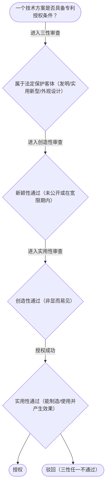

# 专家 B 教学草稿

> 专家：expert_b ｜ 风格：accessible

## 教学模块选择清单

- 当前教学节点：`patent-law-foundation`
- 板块预算：自适应 5/5，总计 9/10

| # | 模块 (block_type) | 类型 | 触发原因 (trigger) | 对应正文段 | 归属 |
|---:|---|:--:|---|---|:--:|
| 1 | `anchor_scenario` | 自适应 | perception=sensing(0.87) / P(L)=0.15<0.3 / cold_start | 研发场景锚定｜某智能制造公司研发出一款基于AI的柔性生产线控制系统，他们希望申请专利以保护核心技术，但担心… | [A] |
| 2 | `legal_anchor` | 必选 | mandatory | 法条锚定｜《专利法》第二条 | [A] |
| 3 | `worked_example` | 自适应 | cold_start(low_confidence) | 真实案例演示｜某智能制造公司2024年5月1日在政府主办的国际智能制造展会上展示了其AI柔性生产线系统，2… | [A] |
| 4 | `decision_flow` | 自适应 | input=visual(0.81) | 判定决策流程｜一个技术方案是否具备专利授权条件？ | [A] |
| 5 | `mnemonic` | 自适应 | understanding=sequential(0.76) | 三性记忆口诀｜三性三字诀：新（未公开）、创（非显而易见）、实（能制造有用） | [A] |
| 6 | `predict_activate` | 自适应 | processing=active(0.72) | 预测激活｜展会展示了你的发明，你觉得专利还能不能申请？先猜一个。 | [A] |
| 7 | `assessment` | 必选 | mandatory | 测评模块｜专利保护的三种客体 | [A] |
| 8 | `knowledge_synthesis` | 必选 | mandatory | 知识框架｜专利制度基本概念：独占性、时间性、地域性 | [A] |
| 9 | `summary_card` | 自适应 | len(knowledge_sub_nodes)=3>=3 | 速查卡｜先过保护客体之门，再过三性安检。 | [A] |

## 教学正文

## 1. 场景导入
某智能制造公司研发出一款基于AI的柔性生产线控制系统，他们希望申请专利以保护核心技术，但担心在公司年会上展示该系统是否会影响新颖性。同时，他们需要了解专利保护的客体范围和制度体系，以决定是否申请以及如何保护。在这个研发场景中，核心问题是：如何从研发披露到专利授权，结合时间轴判断和三性审查，确保技术成果得到法律保护。
## 2. 人话解释
专利制度是为鼓励发明创造、促进技术公开和应用而建立的法律框架。它包括保护客体（发明、实用新型、外观设计）、授权条件（三性：新颖性、创造性、实用性）和中国专利制度的具体特点。中国专利制度体系由《专利法》《专利法实施细则》和《专利审查指南》构成，保护范围以权利要求为准。专利制度的作用在于激励企业研发，推动技术进步和经济发展。在智能制造领域，掌握这些基础有助于研发人员在申请专利时规避风险，避免侵权纠纷。
## 3. 法条回扣
根据《专利法》第二条，本法所称的发明创造是指发明、实用新型和外观设计。发明是对产品、方法或其改进提出的新的技术方案；实用新型是对产品的形状、构造或结合提出的适于实用的新的技术方案；外观设计是对产品的整体或局部的形状、图案或结合以及色彩与形状、图案的结合所作出的富有美感并适于工业应用的新设计。授予专利权的发明和实用新型应当具备新颖性、创造性和实用性（《专利法》第二十二条）。授予专利权的外观设计应当不属于现有设计，与现有设计相比具有明显区别，且不得与他人在先取得的合法权利相冲突（《专利法》第二十三条）。申请人要求发明、实用新型专利优先权的，应当在申请时提出书面声明，并在首次提出申请之日起十六个月内提交副本（《专利法》第三十条）。
## 4. 类比 / 口诀
可以将专利三性比作入关考试：新颖性如同‘没有重复被查过’，创造性如同‘有新意但不是一眼就能看出’，实用性如同‘能用且有用’。口诀记忆：新（未公开）、创（非显而易见）、实（能制造有用）。适用边界：新颖性只看单独对比，创造性允许组合对比；优先权需核对首次申请地、主题相同、期限符合。
## 5. 应试提示
题干关键词包括‘申请日以前’、‘现有技术’、‘三性’和‘保护客体’。判断步骤：先看是否属于法定保护范围，再判断是否公开，若公开需看是否在宽限期内。常见陷阱是混淆新颖性与创造性，或忽略优先权期限。建议用时间轴流程图辅助判断。
## 6. 互动提问
本节设有测评，请到【习题】区作答以验证掌握。

### 研发场景锚定（anchor_scenario）

> 某智能制造公司研发出一款基于AI的柔性生产线控制系统，他们希望申请专利以保护核心技术，但担心在公司年会上展示该系统是否会影响新颖性。同时，他们需要了解专利保护的客体范围和制度体系，以决定是否申请以及如何保护。在这个研发场景中，核心问题是：如何从研发披露到专利授权，结合时间轴判断和三性审查，确保技术成果得到法律保护。

**锚定**：用同一技术事实同时引出‘保护客体’与‘授权三性’两个抽象模块。

**先想一想**：如果你是专利代理人，看到‘展会展示’这个动作，第一反应是风险还是安全？为什么？

### 法条锚定（legal_anchor）

- **《专利法》第二条**：专利法第二条明确保护客体为发明、实用新型和外观设计。
- **《专利法》第二十二条**：专利法第二十二条规定发明和实用新型的三性条件：新颖性、创造性和实用性。
- **《专利法》第二十三条**：专利法第二十三条规定外观设计的授权条件。
- **《专利法》第三十条**：专利法第三十条规定优先权要求和期限。

**为何重要**：本节点讲授权实质条件，三性是贯穿全章的判定主线，必须先立住条文。掌握法条可避免专利授权失败。

### 真实案例演示（worked_example）

**案情/例题**：某智能制造公司2024年5月1日在政府主办的国际智能制造展会上展示了其AI柔性生产线系统，2024年11月1日提出专利申请。问：展出是否破坏新颖性？
**适用规则**：《专利法》第二十二条、第二十四条（不丧失新颖性宽限期6个月）
**分步推演**：
1. 展出日在申请日前，且属‘政府主办国际展会’法定情形 → *落入宽限期适用范围*
2. 申请日2024-11-01距展出日2024-05-01约6个月=6个月，符合期限 → *在宽限期内*
3. 宽限期仅豁免该公开，不改变三性实质审查 → *仍需过创造性/实用性*
**结论**：展出不破坏新颖性，但仅豁免该次公开，实体三性仍须满足。
**本题要点**：宽限期是‘时间豁免’不是‘免死金牌’，先判范围再算日期。

### 判定决策流程（decision_flow）

**决策问题**：一个技术方案是否具备专利授权条件？



### 三性记忆口诀（mnemonic）

**记忆锚**：三性三字诀：新（未公开）、创（非显而易见）、实（能制造有用）
**映射**：
- 新
- 创
- 实
**何时用**：看到‘授权条件’或‘为什么不给专利’时先过三性表。

### 预测激活（predict_activate）

**预测/激活**：展会展示了你的发明，你觉得专利还能不能申请？先猜一个。

**激活旧知**：已学的‘现有技术’概念

**揭晓方向**：先看展出日与申请日谁在前，再看有没有‘官方展会’这个例外口袋。

### 知识框架（knowledge_synthesis）

**知识框架**：
- 专利制度基本概念：独占性、时间性、地域性
- 中国专利制度体系：专利法、细则、审查指南
- 保护客体：发明、实用新型、外观设计（专利法第2条）
- 制度作用：激励发明、促进公开、推动应用
- 发展特点：早期公开延迟审查，初步+实质审查并存
**概念关系**：三性依次审查，先新再创最后实；客体决定审查重点
**必记**：三性缺一不可；保护客体需明确范围；优先权需按期限提交副本

### 速查卡（summary_card）

**要点卡**：
- **保护客体**：发明、实用新型、外观设计
- **三性**：新颖性、创造性、实用性
- **宽限期**：政府主办国际展会6个月缓冲
- **优先权**：首次申请16个月/3个月内提交副本
**必背**：三性缺一不可；宽限期仅豁免特定公开且限6个月
**一句话总结**：先过保护客体之门，再过三性安检。

### 测评模块（assessment）

**三类覆盖**：backward_review、forward_probe、weakness_probe
**题目**：
- q1：专利保护的三种客体
- q2：三性条件
- q3：新颖性宽限期
- q4：创造性判断


## 结构化字段

## knowledge_points

```json
[
  {
    "node_id": "patent-law-foundation",
    "kc_name": "专利制度的基本概念与特征"
  },
  {
    "node_id": "patent-law-foundation",
    "kc_name": "中国专利制度体系"
  },
  {
    "node_id": "patent-law-foundation",
    "kc_name": "专利保护的三种客体"
  },
  {
    "node_id": "patent-law-foundation",
    "kc_name": "专利制度的作用"
  },
  {
    "node_id": "patent-law-foundation",
    "kc_name": "中国专利制度发展历程与特点"
  }
]
```

## legal_basis

```json
[
  {
    "article": "《专利法》第二条",
    "source": "中华人民共和国专利法.txt"
  },
  {
    "article": "《专利法》第二十二条",
    "source": "中华人民共和国专利法.txt"
  },
  {
    "article": "《专利法》第二十三条",
    "source": "中华人民共和国专利法.txt"
  },
  {
    "article": "《专利法》第三十条",
    "source": "中华人民共和国专利法.txt"
  }
]
```

## risks

```json
[
  {
    "risk": "将抵触申请错误用于创造性评价",
    "related_node_id": "patent-law-foundation"
  },
  {
    "risk": "混淆外国优先权与本国优先权",
    "related_node_id": "patent-law-foundation"
  },
  {
    "risk": "忽略申请日/公开日的时间轴判断",
    "related_node_id": "patent-law-foundation"
  }
]
```

## draft_stage

```json
"debate"
```

## interactive_questions

```json
[
  {
    "qid": "q1",
    "category": "remember",
    "difficulty": "L1",
    "source_tag": "backward_review",
    "kc_node_id": "patent-law-foundation",
    "question": "专利保护的三种客体分别是？",
    "answer": "D",
    "options": [
      "A. 发明",
      "B. 实用新型",
      "C. 外观设计",
      "D. 以上三种"
    ]
  },
  {
    "qid": "q2",
    "category": "understand",
    "difficulty": "L1",
    "source_tag": "backward_review",
    "kc_node_id": "patent-law-foundation",
    "question": "《专利法》第二十二条规定的授予专利权的发明和实用新型需具备哪三性？",
    "answer": "C",
    "options": [
      "A. 新颖性、独占性、地域性",
      "B. 创造性、实用性、时间性",
      "C. 新颖性、创造性、实用性",
      "D. 保护性、时间性、地域性"
    ]
  },
  {
    "qid": "q3",
    "category": "apply",
    "difficulty": "L2",
    "source_tag": "forward_probe",
    "kc_node_id": "patent-rights-protection",
    "question": "某公司2024年1月1日申请专利，2023年7月在国内展会展示技术，展出是否影响新颖性？",
    "answer": "A",
    "options": [
      "A. 不影响，适用宽限期",
      "B. 影响，属于现有技术",
      "C. 需看创造性是否通过",
      "D. 必须提交优先权声明"
    ]
  },
  {
    "qid": "q4",
    "category": "analyze",
    "difficulty": "L3",
    "source_tag": "weakness_probe",
    "kc_node_id": "patent-law-foundation",
    "question": "如果发明与现有技术相比有实质性特点但不显著进步，这是否具备创造性？",
    "answer": "B",
    "options": [
      "A. 具备创造性",
      "B. 不具备创造性",
      "C. 需看实用性",
      "D. 属于现有技术"
    ]
  }
]
```

## knowledge_synthesis

```json
{
  "node": "patent-law-foundation",
  "coverage": [
    {
      "node_id": "patent-law-foundation"
    }
  ],
  "confusable_pairs": [
    {
      "pair": "新颖性与创造性的区分"
    },
    {
      "pair": "外国优先权与本国优先权"
    }
  ]
}
```
