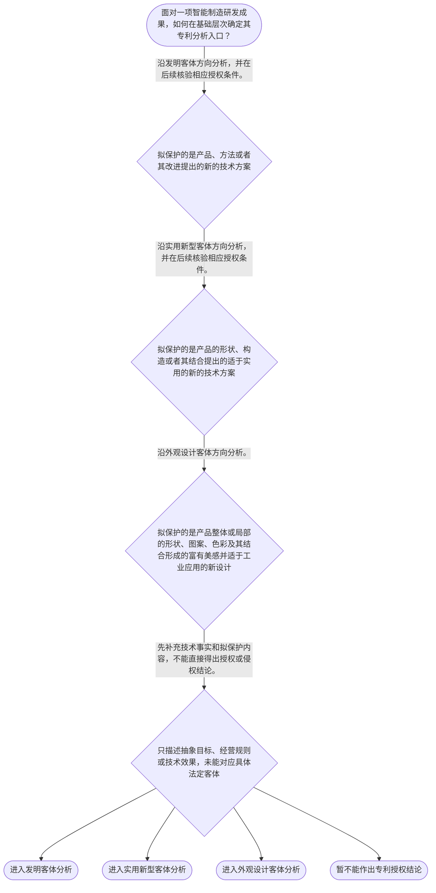

# 整合后的课程完整内容与习题

## 教学模块选择清单

- 当前教学节点：`patent-law-foundation`
- 板块预算：自适应 5/6，总计 9/9

| # | 模块 (block_type) | 类型 | 触发原因 (trigger) | 对应正文段 | 归属 |
|---:|---|:--:|---|---|:--:|
| 1 | `anchor_scenario` | 自适应 | perception=sensing(0.87) / cold_start | 智能装配单元的专利入口｜某智能制造企业的研发工程师完成了一套自动化装配单元：视觉传感器定位零件，机械臂依据控制程序调… | [A+B融合] |
| 2 | `legal_anchor` | 必选 | mandatory | 专利法律基础法条锚点｜《专利法》第二条 | [A] |
| 3 | `worked_example` | 自适应 | cold_start(low_confidence) | 自动分拣系统的基础判定链｜以下为教学示例，非真实案件。某企业研发自动分拣系统，由传送机构、视觉识别模块和路径调整控制方… | [A+B融合] |
| 4 | `decision_flow` | 自适应 | input=visual(0.81) | 智能制造成果的专利入口流程｜面对一项智能制造研发成果，如何在基础层次确定其专利分析入口？ | [A+B融合] |
| 5 | `mnemonic` | 自适应 | understanding=sequential(0.77) | 客体—门槛—时间—边界四层表｜四层核对表：客体—门槛—时间—边界。客体看“发明、实用新型、外观设计”；门槛看“新颖性、创造… | [A+B融合] |
| 6 | `predict_activate` | 自适应 | processing=active(0.72) | 先区分技术效果与法律结论｜某机器视觉分拣方案显著提高产线效率。揭晓规则前，先预测：这一事实能否单独推出已经取得专利权？ | [B] |
| 7 | `assessment` | 必选 | mandatory | 本节基础测评｜回顾专利法规定的三种保护客体。 | [A] |
| 8 | `knowledge_synthesis` | 必选 | mandatory | 专利法律制度基础框架｜专利权基本特征：独占性是法定范围内的排他效力；时间性表明权利受法定期限及终止规则限制；地域性… | [A+B融合] |
| 9 | `summary_card` | 自适应 | len(knowledge_sub_nodes)=3>=3 | 专利基础速查卡｜专利基础先解决保护什么、授予要过什么门槛、时间如何定位以及权利边界如何理解。 | [A+B融合] |

## 教学正文

## 智能制造研发的专利入口

某工厂研发团队完成一套智能装配单元：视觉传感器识别零件位置，机械臂按控制程序调整抓取路径，传送机构同步供料。团队发现系统运行稳定、效率提高，便准备申请专利，并担心同行随后仿制。此时必须把三个层次分开：技术方案是否落入法定保护客体，是否还要经过授权条件判断，以及授权后才可能进入的权利保护与侵权问题。用户关心的新颖性和侵权判定都建立在这些基础之上；本节不替代后续节点对它们的具体判断。

学习者要求结合真实智能制造案例，但本轮检索上下文未提供可核验的智能制造专利案件、专利号，或同时包含技术方案、申请日、公开信息及新颖性结论的公开材料。因此，不能将自动分拣系统虚构为真实案件，也不能编造其申请日、公开日或新颖性结论。后续取得可核验的专利公报或裁判文书后，应按“技术方案—申请日或优先权日—公开信息—单独对比的新颖性结论”补入真实案例；本节先用明确标识的教学示例演示可复用的分析框架。

## 法条锚点与制度位置

《专利法》第二条将发明创造分为发明、实用新型和外观设计。发明是对产品、方法或者其改进提出的新的技术方案；实用新型是对产品形状、构造或者其结合提出的适于实用的新的技术方案；外观设计是对产品整体或者局部的形状、图案或者其结合，以及色彩与形状、图案结合所作出的富有美感并适于工业应用的新设计。〔RAG: 中华人民共和国专利法.txt — 第二条：本法所称的发明创造是指发明、实用新型和外观设计〕

对智能装配单元而言，拟保护控制方法、设备协同方式或其技术改进时，首先沿发明客体方向分析；拟保护的是产品的形状、构造或者其结合时，才沿实用新型方向分析；拟保护的是产品外观的新设计时，才沿外观设计方向分析。行业标签和“技术有用”的事实，不能代替对具体保护内容的识别。

中国专利制度可按规范功能理解：专利法提供基本法律规则，专利法实施细则细化程序要求，专利审查指南提供审查中的具体判断规范。例如，检索材料显示，实用新型专利权评价报告会涉及客体、实用性、新颖性、创造性、充分公开和权利要求清楚简要等事项。〔RAG: 专利法律知识详细解读.txt — 实用新型专利权评价报告包括是否具备新颖性、创造性、实用性及权利要求是否清楚、简要地限定保护范围〕这说明三类规范在制度运行中功能不同；但检索上下文未提供实施细则和审查指南的完整对应原文，不能据此扩张为未检索到的具体程序结论。

专利制度通过在法定边界内授予权利，激励发明创造；申请文件公开的技术信息又有助于后续技术应用和经济发展。专利权的独占性，是指权利人可在法定保护范围内排除未经许可的实施，具体禁止行为和侵权构成须在后续专利权保护节点结合权利要求或外观设计图片、照片判断。时间性意味着专利权不是永久权利，权利效力受法定期限及终止规则约束；本轮检索上下文未提供保护期限和终止的直接法条原文，故不在此填写具体年限。地域性意味着专利权效力受授予国或地区法律边界限制，不能把一国授权当然推及全球。三特征共同表明：专利制度是在限定范围、限定期间和限定地域内，以权利激励公开与创新，而非对技术思想给予无限制控制。

## 授权门槛与时间基准

《专利法》第二十二条规定，发明和实用新型获得专利权应当具备新颖性、创造性和实用性。实用性是能够制造或者使用并产生积极效果；现有技术是申请日以前在国内外为公众所知的技术。〔RAG: 中华人民共和国专利法.txt — 第二十二条：授予专利权的发明和实用新型，应当具备新颖性、创造性和实用性；现有技术是申请日以前在国内外为公众所知的技术〕

新颖性首先问“是否已有同样内容处于法律规定的在先状态”。现有技术以申请日以前、国内外、为公众所知为边界；享有优先权时，时间界限相应为优先权日，且申请日或优先权日当天公开的技术不属于该申请的现有技术。〔RAG: 专利法律知识详细解读.txt — 现有技术的时间界限是申请日以前；有优先权的指优先权日；不包括申请日当天公开的技术内容〕此外，申请在先、公布或公告在后的同样发明或实用新型，作为抵触申请，只在新颖性判断中发挥作用。〔RAG: 中华人民共和国专利法.txt — 第二十二条：同样的发明或者实用新型在申请日以前提出申请，并记载在申请日以后公布的专利申请文件或者公告的专利文件中〕

新颖性采用单独对比：每项权利要求分别同一项现有技术或一件抵触申请的相关内容比较，不能把多项资料拼接后否定新颖性。〔RAG: 专利法专题讲座.txt — 判断新颖性时应单独比较，不得与几项现有技术或多项技术方案的组合进行对比〕创造性则是另一道授权门槛，涉及与现有技术相比是否具有法定的实质性特点和进步，不能误将创造性问题做成单篇文献的新颖性判断。本节只建立二者的用途边界，不替代后续创造性节点的组合判断。

这意味着，装配单元能够连续运行、提高效率，至多是进一步考察实用性的事实基础，不能单独证明已具备新颖性和创造性，更不能直接推出已经授权。申请日是后续时间判断的起点。国务院专利行政部门收到专利申请文件之日为申请日；邮寄申请以寄出邮戳日为申请日。〔RAG: 中华人民共和国专利法.txt — 第二十八条：收到专利申请文件之日为申请日；邮寄的，以寄出的邮戳日为申请日〕优先权也有法定期限：发明或实用新型在外国或中国首次申请后十二个月内，外观设计在外国或中国首次申请后六个月内，就相同主题在中国提出申请时，可以在法定条件下享有优先权。〔RAG: 中华人民共和国专利法.txt — 第二十九条：发明或者实用新型为十二个月，外观设计为六个月〕申请日、公开日和优先权日的具体法律效果不同，不能互相替代。

## 示例：自动分拣系统

以下自动分拣系统是教学示例，不是检索确认的真实案例。某企业拟保护视觉识别后的路径调整方法及其与设备协同形成的技术方案，同时也考虑保护一项送料机构的结构改进。先从拟保护内容出发：控制方法及其技术改进可沿发明客体方向分析；若申请人仅主张送料机构的形状、构造或其结合，则应转入实用新型客体方向。〔RAG: 中华人民共和国专利法.txt — 第二条：发明针对产品、方法或者其改进；实用新型针对产品的形状、构造或者其结合〕

其次，将客体识别和授权判断分开。系统稳定运行、提高分拣效率，并不等于完成三性审查。发明或实用新型仍须分别核验新颖性、创造性和实用性；新颖性核验时，应先固定该申请的申请日或可主张的优先权日，再将每项权利要求与单一在先资料逐项对比。若发现的是申请在先、公布在后的同样发明或实用新型，则应将其作为抵触申请处理，而不把它误称为现有技术。

因此，本例的教学结论是：该系统可以作为技术方案进入相应专利客体分析，但尚不能仅凭运行效果得出“当然授权”或“他人已经侵权”的结论。基础判断顺序应固定为：先客体、再门槛、后时间轴；侵权则须在专利授权、权利有效和保护范围明确后另行判断。

## 流程、记忆与收束

面对智能制造成果，先看主张内容是否是产品、方法或其改进形成的技术方案；是则进入发明方向。若主张内容限于产品形状、构造或其结合，则进入实用新型方向。若核心是产品整体或局部外观的新设计，则进入外观设计方向。若只有经营目标、效果描述或抽象规则而没有可识别的法定客体，应先补足技术事实，不能直接作出授权或侵权结论。

可用“客体—门槛—时间—边界”四层表复盘：客体对应三类发明创造，门槛对应发明和实用新型的三性，时间对应申请日和优先权等时间基准，边界对应独占性、时间性和地域性。该表只是帮助排序，不能代替法条要件和具体审查。

中国制度沿革材料显示，制度运行具有早期公开、延迟审查以及初步审查制与实质审查制并存等特点。〔RAG: 专利法律知识详细解读.txt — 检索上下文提供中国专利制度发展与审查制度的概括性说明〕本节只建立制度全貌；具体公开、审查程序、新颖性判断和侵权构成将在后续节点展开。

本节设有测评，请到【习题】区作答。

### 智能装配单元的专利入口（anchor_scenario）

> 某智能制造企业的研发工程师完成了一套自动化装配单元：视觉传感器定位零件，机械臂依据控制程序调整抓取路径，传送机构同步供料。团队准备申请专利，同时担心同行复制系统。内部有人认为“能稳定运行就能拿到专利”，也有人想直接讨论侵权；研发负责人要求先厘清要保护的是方法、设备构造还是产品外观，以及这些问题与授权、权利保护分别是什么关系。该情境为教学示例，不是经检索核验的真实案件。

**锚定**：同一智能制造技术事实可锚定保护客体、授权门槛、时间基准与后续权利保护四个不同层次。

**先想一想**：面对这套装配技术，分析顺序应先识别拟保护内容，还是先从技术效果或侵权结论出发？

### 专利法律基础法条锚点（legal_anchor）

- **《专利法》第二条**：发明创造包括发明、实用新型和外观设计；三类客体按拟保护的技术方案、产品构造或产品外观分别识别。
- **《专利法》第二十二条**：发明和实用新型应具备新颖性、创造性和实用性；新颖性还排除申请在先、公布或公告在后的同样发明或实用新型。
- **《专利法》第二十八条**：申请日通常以国务院专利行政部门收到申请文件之日确定；邮寄申请以邮戳日确定。
- **《专利法》第二十九条**：外国或中国首次申请后，就相同主题在法定期限内向中国提出申请时，可以在法定条件下要求优先权；发明和实用新型期限为十二个月，外观设计为六个月。

**为何重要**：第二条解决“保护什么”，第二十二条提示“授权还要过哪些门槛”，第二十八条和第二十九条建立后续分析的时间基准。独占性、时间性和地域性是理解这些规则适用边界的制度前提。

### 自动分拣系统的基础判定链（worked_example）

**案情/例题**：以下为教学示例，非真实案件。某企业研发自动分拣系统，由传送机构、视觉识别模块和路径调整控制方法组成。系统能够连续运行并提高分拣效率。企业拟申请专利，并询问该成果是否当然已经获得专利保护，以及新颖性应如何开始核验。
**适用规则**：《专利法》第二条、第二十二条、第二十八条；新颖性单独对比规则。
**分步推演**：
1. 先确认拟保护内容。视觉识别后调整机械臂路径的控制方法及其改进，属于对方法提出技术方案的分析方向；传送机构本身的形状、构造或其结合，才可能进入实用新型方向。 → *先按具体主张识别客体，不能只按行业或技术效果分类。*
2. 再把客体与授权条件分开。即使控制方法可沿发明客体方向分析，也不等于已通过授权审查。 → *属于法定客体只是进入下一步的入口。*
3. 稳定运行和效率提升可作为进一步考察实用性的相关事实，但发明和实用新型仍须分别核验新颖性、创造性和实用性。 → *技术有效不等于已满足全部三性。*
4. 新颖性核验时先固定申请日或可享有的优先权日，再将每项权利要求分别同单一现有技术或抵触申请的相关内容比较，不得把多份资料拼接。 → *新颖性是时间定位后的单独对比，不是组合对比。*
5. 最后记录申请日及可能的优先权信息，为后续公开资料的先后关系判断准备时间轴。 → *时间基准应在具体新颖性判断之前先固定。*
**结论**：该系统可以进入相应专利客体分析，但仅凭稳定运行和效率提升，不能得出当然授权，更不能直接得出侵权结论。
**本题要点**：用“客体识别—三性门槛—时间轴—单独对比”的顺序，将技术事实转换为可继续核验的专利问题。

### 智能制造成果的专利入口流程（decision_flow）

**决策问题**：面对一项智能制造研发成果，如何在基础层次确定其专利分析入口？



### 客体—门槛—时间—边界四层表（mnemonic）

**记忆锚**：四层核对表：客体—门槛—时间—边界。客体看“发明、实用新型、外观设计”；门槛看“新颖性、创造性、实用性”；时间看“申请日、公开日、优先权日”；边界看“独占性、时间性、地域性”。
**映射**：
- 客体
- 门槛
- 时间
- 边界
**何时用**：看到“这项智能制造技术能否申请”“系统有效是否必然授权”或需要梳理申请时间线、权利边界时，按四层表依次核对。

### 先区分技术效果与法律结论（predict_activate）

**预测/激活**：某机器视觉分拣方案显著提高产线效率。揭晓规则前，先预测：这一事实能否单独推出已经取得专利权？

**激活旧知**：技术方案、专利保护客体、技术效果与授权三性的既有区分。

**揭晓方向**：先分别定位“技术效果”“法定客体”“授权三性”和“权利边界”，再判断它们是否具有相同的法律功能。

### 专利法律制度基础框架（knowledge_synthesis）

**知识框架**：
- 专利权基本特征：独占性是法定范围内的排他效力；时间性表明权利受法定期限及终止规则限制；地域性表明权利效力不当然跨越授予国或地区边界。
- 中国专利制度体系：专利法规定基本规则，实施细则细化程序，审查指南提供审查判断规范；检索材料显示评价报告可涉及客体、三性、充分公开和权利要求范围等事项。
- 三类保护客体：发明对应产品、方法或其改进的技术方案；实用新型对应产品形状、构造或其结合；外观设计对应产品外观的新设计。
- 制度作用：通过有边界的权利激励发明创造，并以技术公开促进技术应用和经济发展。
- 制度发展与审查特点：检索材料概括显示早期公开、延迟审查以及初步审查制与实质审查制并存；具体程序规则留待后续学习。
**概念关系**：三类客体回答“保护什么”；授权门槛回答“能否授予”；权利保护节点才回答“授权后能否主张侵权”。；申请日和优先权构成后续新颖性与相关时间判断的基础，但不等同于公开日。；新颖性以在先状态为前提并采用单独对比；抵触申请只在新颖性判断中起作用，不应混同于现有技术。；制度功能解释为什么鼓励公开与创新，独占性、时间性和地域性则界定该激励机制的权利边界。
**必记**：先识别保护客体，再核验授权门槛，最后建立时间轴。；发明和实用新型的三性为新颖性、创造性和实用性；技术有用不等于当然授权。；新颖性看单一对比资料；创造性不能误作单篇文献的新颖性判断。；专利权具有独占性、时间性和地域性，具体期限、保护范围与侵权规则须回到后续节点的直接法源。；专利法、实施细则和审查指南功能不同，具体结论应回到相应法源。

### 专利基础速查卡（summary_card）

**要点卡**：
- **三类保护客体**：发明看产品、方法或其改进的技术方案；实用新型看产品形状、构造或其结合；外观设计看产品外观新设计。
- **专利权三特征**：独占性限定法定排他效力，时间性限制权利存续，地域性限制权利适用的国家或地区边界。
- **制度规范层次**：专利法定基本规则，实施细则细化程序，审查指南提供具体审查规范。
- **三性门槛**：发明和实用新型应核验新颖性、创造性和实用性，技术效果不能替代三性。
- **新颖性对比**：先固定申请日或优先权日，再把每项权利要求与单一资料比较；不得组合资料。
- **时间基准**：申请日是后续判断起点，优先权和公开日各有不同法律作用。
- **制度功能与审查特点**：制度以权利激励创造、以公开促进应用；学习材料概括其早期公开、延迟审查和两类审查并存特点。
**必背**：《专利法》第二条规定发明、实用新型和外观设计三类发明创造。；《专利法》第二十二条规定发明和实用新型应具备新颖性、创造性和实用性。；专利权具有独占性、时间性和地域性。；新颖性采用单独对比，不能用多份资料组合否定新颖性。；复盘顺序为“先客体、再门槛、后时间轴、明权利边界”。
**一句话总结**：专利基础先解决保护什么、授予要过什么门槛、时间如何定位以及权利边界如何理解。

### 本节基础测评（assessment）

**三类覆盖**：backward_review、forward_probe、weakness_probe
**题目**：
- q-foundation-1：回顾专利法规定的三种保护客体。
- q-forward-1：探测对后续专利权时间性和地域性边界的基础理解。
- q-weakness-1：辨析技术效果、授权条件与侵权结论的层次。


## 结构化数据

## expert

```json
"A+B融合"
```

## style

```json
"fused"
```

## knowledge_points

```json
[
  {
    "node_id": "patent-law-foundation",
    "kc_name": "专利制度的基本概念与特征：独占性、时间性、地域性（详见子节点 patent-rights-nature）"
  },
  {
    "node_id": "patent-law-foundation",
    "kc_name": "中国专利制度体系：专利法、专利法实施细则、专利审查指南（详见子节点 patent-law-framework）"
  },
  {
    "node_id": "patent-law-foundation",
    "kc_name": "专利保护的三种客体：发明、实用新型、外观设计（专利法第2条）"
  },
  {
    "node_id": "patent-law-foundation",
    "kc_name": "专利制度的作用：激励发明创造、促进技术公开、推动技术应用和经济发展（详见子节点 patent-system-overview）"
  },
  {
    "node_id": "patent-law-foundation",
    "kc_name": "中国专利制度发展历程与特点：早期公开延迟审查、初步审查制与实质审查制并存（详见子节点 patent-system-overview）"
  }
]
```

## legal_basis

```json
[
  {
    "article": "《专利法》第二条",
    "source": "中华人民共和国专利法.txt：第二条规定发明创造包括发明、实用新型和外观设计，并分别界定三类客体。"
  },
  {
    "article": "《专利法》第二十二条",
    "source": "中华人民共和国专利法.txt：第二十二条规定发明和实用新型应具备新颖性、创造性和实用性，且界定现有技术与抵触申请。"
  },
  {
    "article": "《专利法》第二十八条",
    "source": "中华人民共和国专利法.txt：第二十八条规定国务院专利行政部门收到申请文件之日为申请日，邮寄申请以邮戳日为申请日。"
  },
  {
    "article": "《专利法》第二十九条",
    "source": "中华人民共和国专利法.txt：第二十九条规定外国优先权与本国优先权的期限基础。"
  },
  {
    "article": "新颖性单独对比规则",
    "source": "专利法专题讲座.txt：判断新颖性时，各项权利要求应分别与每一项现有技术或申请在先、公布在后的相关内容单独比较，不得组合对比。"
  },
  {
    "article": "中国专利制度沿革学习材料",
    "source": "专利法律知识详细解读.txt：检索上下文提供制度发展、早期公开延迟审查及审查制度的概括性讲解，未提供完整历史时间表。"
  }
]
```

## risks

```json
[
  {
    "risk": "本轮检索上下文未提供可核验的智能制造真实专利案件、专利号、申请日、公开信息及新颖性结论；不得将教学示例冒充真实案例。",
    "related_node_id": "patent-law-foundation"
  },
  {
    "risk": "专利权独占性、时间性和地域性在本节作制度基础说明；具体保护期限、终止、保护范围和侵权规则仍应在后续节点依据直接法条核验。",
    "related_node_id": "patent-rights-nature"
  },
  {
    "risk": "检索上下文未提供《专利法实施细则》和《专利审查指南》的完整对应原文，制度体系部分不能替代具体程序或审查规则的法源核验。",
    "related_node_id": "patent-law-framework"
  },
  {
    "risk": "新颖性、抵触申请、优先权效力和创造性组合判断属于后续细化节点；本节仅说明其在授权与时间框架中的位置。",
    "related_node_id": "novelty"
  },
  {
    "risk": "制度沿革材料未提供完整历史法源和年份，早期公开、延迟审查及两类审查并存的表述仅作概括性学习定位。",
    "related_node_id": "patent-system-overview"
  }
]
```

## draft_stage

```json
"integration"
```

## irac

```json
{
  "issue": "智能制造研发成果进入专利分析时，如何区分法定保护客体、授权条件、时间基准及专利权的基础边界？",
  "rule": "《专利法》第二条规定发明创造包括发明、实用新型和外观设计并界定其客体；第二十二条规定发明和实用新型应具备新颖性、创造性和实用性；第二十八条规定申请日的确定方式；第二十九条规定外国优先权和本国优先权的期限基础。新颖性判断遵循单独对比规则。",
  "application": "对自动分拣系统，应依拟保护内容识别客体：控制方法及设备协同方案可沿发明方向分析，产品形状和构造才对应实用新型，产品外观新设计对应外观设计。稳定运行和提高效率不能单独证明已满足全部三性，也不能直接证明授权或侵权。新颖性分析须固定申请日或优先权日，并将权利要求与单一在先资料比较；申请在先、公布在后的同样方案应按抵触申请处理。",
  "conclusion": "本节点的基础顺序是“先客体、再门槛、后时间轴”，并在独占性、时间性和地域性的边界内理解专利制度；新颖性具体判断与侵权构成应进入后续节点。"
}
```

## interactive_questions

```json
[
  {
    "qid": "q-foundation-1",
    "category": "remember",
    "difficulty": "L1",
    "source_tag": "backward_review",
    "kc_node_id": "patent-law-foundation",
    "question": "根据《专利法》第二条，下列哪一项完整列出发明创造的三种客体？",
    "answer": "B",
    "options": [
      "A. 发明、商标和商业秘密",
      "B. 发明、实用新型和外观设计",
      "C. 产品、方法和著作权",
      "D. 实用新型、集成电路布图设计和外观设计"
    ]
  },
  {
    "qid": "q-forward-1",
    "category": "understand",
    "difficulty": "L1",
    "source_tag": "forward_probe",
    "kc_node_id": "patent-rights-protection",
    "question": "关于已经授权的中国专利权，下列哪项表述最符合专利权基础特征？",
    "answer": "C",
    "options": [
      "A. 一经授权即在全球永久有效",
      "B. 只要技术有用即不受权利边界限制",
      "C. 其效力受时间和地域边界约束，具体保护内容还需结合授权文件判断",
      "D. 是否有效只取决于专利权人是否继续生产产品"
    ]
  },
  {
    "qid": "q-weakness-1",
    "category": "analyze",
    "difficulty": "L3",
    "source_tag": "weakness_probe",
    "kc_node_id": "patent-law-foundation",
    "question": "某企业的自动分拣控制方案能够稳定运行并提高效率。仅依据该事实，下列结论哪项最严谨？",
    "answer": "D",
    "options": [
      "A. 已经当然具备新颖性、创造性和实用性",
      "B. 已经当然属于实用新型并应授权",
      "C. 已可直接认定仿制者构成专利侵权",
      "D. 可作为进一步考察技术方案和实用性的事实基础，但不能单独证明已满足全部授权条件"
    ]
  }
]
```

## knowledge_synthesis

```json
{
  "node": "patent-law-foundation",
  "coverage": [
    {
      "node_id": "patent-rights-nature"
    },
    {
      "node_id": "patent-law-framework"
    },
    {
      "node_id": "patent-law-foundation"
    },
    {
      "node_id": "patent-system-overview"
    }
  ],
  "confusable_pairs": [
    {
      "pair": "技术效果与授权条件：能够运行或提高效率是相关技术事实，不等于当然具备新颖性、创造性和实用性。"
    },
    {
      "pair": "法定保护客体与授权结论：识别为发明、实用新型或外观设计只是分析入口，不等于必然授权。"
    },
    {
      "pair": "独占性、时间性与地域性：排他效力、法定存续限制和国家或地区效力边界分别回答不同问题，不能混为“永久全球垄断”。"
    },
    {
      "pair": "专利法、实施细则与审查指南：三者共同服务制度运行，但规范层次和功能不同。"
    },
    {
      "pair": "申请日、公开日与优先权日：均与时间轴相关，但在后续法律判断中不能相互替代。"
    },
    {
      "pair": "现有技术与抵触申请：前者是申请日前为公众所知的技术，后者是申请在先、公布或公告在后的同样方案，后者只用于新颖性判断。"
    },
    {
      "pair": "新颖性与创造性：新颖性看单一资料的同样技术内容，创造性涉及与现有技术相比的法定进步判断。"
    }
  ]
}
```
