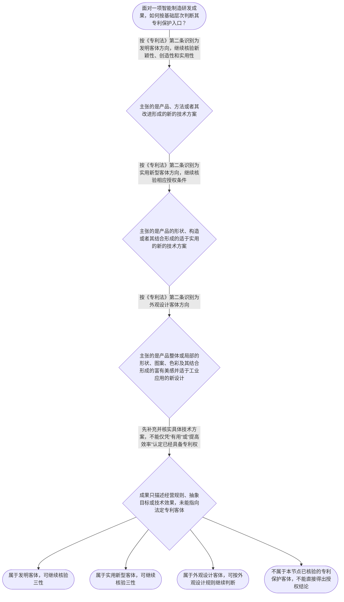

# 专家 A 教学草稿

> 专家：expert_a ｜ 风格：conservative

## 教学模块选择清单

- 当前教学节点：`patent-law-foundation`
- 板块预算：自适应 None/None，总计 None/None

| # | 模块 (block_type) | 类型 | 触发原因 (trigger) | 对应正文段 | 归属 |
|---:|---|:--:|---|---|:--:|
| 1 | `anchor_scenario` | 自适应 | perception=sensing(0.87) / cold_start | 智能装配单元的专利入口｜某智能制造企业的研发工程师完成了一套自动化装配单元：机械臂负责抓取，视觉传感器负责定位，控制… | [A] |
| 2 | `legal_anchor` | 必选 | mandatory | 专利法条文锚点｜《专利法》第二条 | [A] |
| 3 | `worked_example` | 自适应 | cold_start(low_confidence) | 自动分拣系统的授权入口｜某智能制造企业研发了一套自动分拣系统，包括传送机构、视觉识别模块和控制方法。视觉模块识别工件… | [A] |
| 4 | `decision_flow` | 自适应 | input=visual(0.81) | 专利保护客体判断流程｜面对一项智能制造研发成果，如何按基础层次判断其专利保护入口？ | [A] |
| 5 | `mnemonic` | 自适应 | understanding=sequential(0.77) | 专利基础三层核对表｜专利基础三层表：先看“客体”，再看“门槛”，后看“时间”。客体=发明/实用新型/外观设计；门… | [A] |
| 6 | `predict_activate` | 自适应 | processing=active(0.72) | 先分清技术效果与授权条件｜一套机器视觉分拣算法能明显提高生产线效率。正式分析前，请先预测：提高效率这一事实能否单独证明… | [A] |
| 7 | `assessment` | 必选 | mandatory | 本节基础测评｜识别专利保护的三种客体 | [A] |
| 8 | `knowledge_synthesis` | 必选 | mandatory | 专利法律制度基础框架｜专利制度基本概念与特征：专利权是依法授予的排他性权利，具有独占性、时间性和地域性；本节仅建立… | [A] |
| 9 | `summary_card` | 自适应 | len(knowledge_sub_nodes)=3>=3 | 专利基础速查卡｜先识别保护客体，再核验授权门槛，并以法定时间和地域边界理解专利权。 | [A] |

## 教学正文

## I — 法律问题

在智能制造研发成果进入专利分析时，首先要回答的不是“技术是否先进”或“是否已经侵权”，而是三个基础问题：该成果属于哪一种专利保护客体；获得专利权需要满足哪些授权条件；专利权的效力受到哪些时间和地域边界限制。本节以专利法律制度基础为唯一主教学节点，不展开新颖性、抵触申请或侵权判定的具体规则。

## R — 适用规则

### 1. 专利保护客体

《专利法》第二条规定，发明创造包括发明、实用新型和外观设计。发明是对产品、方法或者其改进提出的新的技术方案；实用新型是对产品的形状、构造或者其结合提出的适于实用的新的技术方案；外观设计是对产品外观作出的富有美感并适于工业应用的新设计。〔RAG: 中华人民共和国专利法.txt — 第二条：发明创造包括发明、实用新型和外观设计，并分别规定三类客体〕

因此，智能制造领域中的控制方法、设备协同方案或算法与具体技术手段结合形成的技术方案，应先围绕发明客体分析；如果主张的是产品的形状、构造或其结合，才进入实用新型客体的对应分析；如果主张的是产品整体或局部的形状、图案、色彩及其结合形成的外观，则应围绕外观设计客体分析。客体识别必须以拟保护的具体内容为准，不能仅凭“属于智能制造行业”作结论。

### 2. 发明和实用新型的授权门槛

《专利法》第二十二条规定，授予专利权的发明和实用新型应当具备新颖性、创造性和实用性；该条还规定，新颖性是指不属于现有技术，且不存在在申请日以前提出、在申请日以后公布或公告并记载同样发明或实用新型的相关申请；创造性和实用性分别有其法定判断内容。〔RAG: 中华人民共和国专利法.txt — 第二十二条：发明和实用新型应当具备新颖性、创造性和实用性，并规定现有技术定义〕

《专利法》第二十二条同时规定，现有技术是申请日以前在国内外为公众所知的技术。〔RAG: 中华人民共和国专利法.txt — 第二十二条：现有技术是申请日以前在国内外为公众所知的技术〕本节只建立三性和现有技术的基础位置；单独对比、抵触申请、优先权和创造性组合判断属于后续节点，不能在基础节点中混同处理。

### 3. 申请日与优先权的基础位置

《专利法》第二十八条规定，国务院专利行政部门收到专利申请文件之日为申请日；申请文件邮寄的，以寄出的邮戳日为申请日。〔RAG: 中华人民共和国专利法.txt — 第二十八条：收到申请文件之日为申请日，邮寄申请以寄出邮戳日为申请日〕

《专利法》第二十九条规定，发明或者实用新型在外国首次提出申请后十二个月内、外观设计在外国首次提出申请后六个月内，在符合法定条件时可以要求外国优先权；在中国首次提出申请后，发明或者实用新型的相应期限为十二个月，外观设计为六个月。〔RAG: 中华人民共和国专利法.txt — 第二十九条：外国优先权和本国优先权的期限规定〕本节仅确认这些时间概念是后续判断的基础，不在此处展开外国优先权与本国优先权的法律后果。

### 4. 中国专利制度的规范层次与功能

本节将中国专利制度的规范来源分为三个学习层次：专利法提供基本法律规则，专利法实施细则细化程序和操作要求，专利审查指南提供审查中的具体判断规范。当前检索上下文未提供实施细则和审查指南的完整对应原文，因此这里只作制度结构说明，不对未检索到的具体条文作断言。

专利制度的基本功能，是通过法定条件和有边界的专利权激励发明创造，并以技术公开促进技术应用和经济发展。该功能不意味着所有有用技术都会自动获得专利权，也不意味着专利权可以脱离授权内容、期限和地域而无限延伸。

## A — 规则适用

以智能制造中的自动分拣系统为例，研发团队提出了由传送机构、视觉识别模块和控制方法组成的技术方案。第一步，应按照拟保护内容识别客体：如果重点是视觉识别后调整机械臂路径的方法及其改进，应围绕发明客体分析；如果重点是设备的形状、构造或其结合，应分析实用新型客体；如果重点是产品外观，则应分析外观设计客体。

第二步，应把“属于客体”和“满足授权条件”分开。系统能够连续运行并提高效率，可能为实用性分析提供事实基础，但不能单独证明新颖性和创造性，也不能跳过其他授权条件。发明和实用新型仍须分别核验三性，且具体结论需要结合申请文件、现有技术和审查规则。

第三步，应建立时间基准。申请日原则上依第二十八条确定；涉及优先权时，还要核对首次申请的国家或地区、相同主题、法定期限及其他适用条件。申请日、公开日和优先权日的功能不能相互替代。

第四步，应确认制度边界。专利权是具有独占性、时间性和地域性的法定权利。取得中国专利授权，不等于在所有国家自动取得权利，也不等于权利永久存在；具体权利内容还应回到授权文件和后续适用规则。

## C — 结论

学习专利新颖性判断和侵权判定之前，应先固定基础判断顺序：先识别发明、实用新型或外观设计客体；再区分新颖性、创造性和实用性等授权门槛；随后建立申请日和优先权等时间基准，并理解专利权的时间性和地域性。对智能制造研发成果而言，“能够运行并产生效果”是技术事实，不是已经获得专利权的充分法律结论。

> 常见误区 / 易混淆点
>
> - 把“技术有用”直接等同于“已经具备全部授权条件”。实用性只是授权条件之一，不能替代新颖性和创造性判断。
> - 把“属于发明客体”直接等同于“必然授权”。客体识别只是进入授权分析的第一步。
> - 把专利法、实施细则和审查指南视为同一层次的文字。三者在制度运行中相互衔接，但具体规范功能不同。
> - 把申请日、公开日和优先权日混为同一时间点。它们在后续新颖性和优先权分析中承担不同作用。
>
> 本节设有测评，请到【习题】区作答。

### 智能装配单元的专利入口（anchor_scenario）

> 某智能制造企业的研发工程师完成了一套自动化装配单元：机械臂负责抓取，视觉传感器负责定位，控制程序根据定位结果调整抓取路径。团队准备申请专利，但内部讨论出现分歧：有人认为只要技术方案能稳定运行就应当获得专利；有人认为还要先确认它属于哪一种可保护的发明创造，并明确中国专利制度由哪些法律规范共同构成。此时，团队还需要区分“技术确实有用”“属于专利保护客体”和“最终能够获得授权”这三个不同问题。

**锚定**：用智能制造研发场景锚定专利保护客体、专利授权条件与专利制度体系之间的层次区别。

**先想一想**：面对这套智能装配技术，判断其能否获得专利保护时，应当先确认技术效果、保护客体，还是直接讨论是否侵权？

### 专利法条文锚点（legal_anchor）

- **《专利法》第二条**：专利法把发明创造分为发明、实用新型和外观设计；其中发明可以是产品、方法或者其改进提出的新的技术方案，实用新型限于产品的形状、构造或者其结合，外观设计针对产品外观的新设计。
- **《专利法》第二十二条**：发明和实用新型获得专利权须具备新颖性、创造性和实用性；现有技术是申请日前在国内外为公众所知的技术。
- **《专利法》第二十八条**：国务院专利行政部门收到专利申请文件之日为申请日；邮寄申请以寄出日的邮戳日为申请日。
- **《专利法》第二十九条**：在符合法定条件时，发明或者实用新型可以基于外国首次申请在十二个月内要求优先权，外观设计期限为六个月；在中国首次申请后，也可在相应期限内就相同主题要求本国优先权。

**为何重要**：第二条先确定“保护什么”，第二十二条再确定发明和实用新型的授权门槛，第二十八条和第二十九条确定时间轴中的申请日与优先权基础。掌握这组条文，才能避免把技术有用、能够申请和能够授权混为一谈。

### 自动分拣系统的授权入口（worked_example）

**案情/例题**：某智能制造企业研发了一套自动分拣系统，包括传送机构、视觉识别模块和控制方法。视觉模块识别工件位置后，控制方法调整机械臂的抓取路径，系统能够连续运行并提高分拣效率。企业希望判断：这项成果是否已经当然获得专利保护？
**适用规则**：适用《专利法》第二条和第二十二条。第二条用于识别保护客体，第二十二条用于确认发明和实用新型的授权条件。条文原文及来源见《中华人民共和国专利法.txt》。
**分步推演**：
1. 先看技术内容是否落入《专利法》第二条所列客体。该方案不是单纯的经营规则或抽象目标，而是由设备、识别模块和控制方法构成的技术方案；其中发明可以针对产品、方法或者其改进提出新的技术方案。〔RAG: 中华人民共和国专利法.txt — 第二条：发明，是指对产品、方法或者其改进所提出的新的技术方案〕 → *第一步是识别专利保护客体，不能从技术效果直接跳到授权结论。*
2. 再区分可能的申请类型。若保护系统控制方法及其改进，通常应围绕发明客体分析；若主张产品的形状、构造或者其结合，则才进入实用新型客体的对应范围。〔RAG: 中华人民共和国专利法.txt — 第二条：实用新型，是指对产品的形状、构造或者其结合所提出的适于实用的新的技术方案〕 → *第二步是根据权利要求拟保护的内容区分发明与实用新型。*
3. 最后检查授权门槛。发明和实用新型须同时具备新颖性、创造性和实用性；系统可以稳定运行并提高效率，至多说明需要进一步审查其可制造或可使用及积极效果，不能替代对新颖性和创造性的审查。〔RAG: 中华人民共和国专利法.txt — 第二十二条：发明和实用新型应当具备新颖性、创造性和实用性；实用性是能够制造或者使用并产生积极效果〕 → *第三步是分别核验三性，不能把实用性等同于全部授权条件。*
**结论**：该方案初步属于可被讨论的发明专利客体，因为它包含控制方法和设备协同形成的技术方案；但“能够稳定运行并提高效率”只能支持实用性方向的初步判断，不能单独推出已经具备新颖性、创造性并当然获得授权。
**本题要点**：处理专利基础问题时，按“客体识别—申请类型—三性核验”顺序推进，避免由技术效果直接推导授权。

### 专利保护客体判断流程（decision_flow）

**决策问题**：面对一项智能制造研发成果，如何按基础层次判断其专利保护入口？



### 专利基础三层核对表（mnemonic）

**记忆锚**：专利基础三层表：先看“客体”，再看“门槛”，后看“时间”。客体=发明/实用新型/外观设计；门槛=新颖性/创造性/实用性；时间=申请日/公开日/优先权日。
**映射**：
- 客体
- 门槛
- 时间
**何时用**：分析智能制造成果能否进入专利审查、或需要建立申请时间轴时，按“客体—门槛—时间”依次核对。

### 先分清技术效果与授权条件（predict_activate）

**预测/激活**：一套机器视觉分拣算法能明显提高生产线效率。正式分析前，请先预测：提高效率这一事实能否单独证明该成果已经满足专利授权条件？

**激活旧知**：已有的技术方案、专利客体和技术效果概念。

**揭晓方向**：先把“技术效果”“专利保护客体”和“新颖性、创造性、实用性”分别放在三个位置，再检查它们是否具有相同法律功能。

### 专利法律制度基础框架（knowledge_synthesis）

**知识框架**：
- 专利制度基本概念与特征：专利权是依法授予的排他性权利，具有独占性、时间性和地域性；本节仅建立基础认识，具体权利效力和保护范围留待后续节点。
- 中国专利制度体系：专利法提供基本法律规则，专利法实施细则细化程序和操作要求，专利审查指南提供审查中的具体判断规范。
- 专利保护的三种客体：发明针对产品、方法或者其改进提出的新的技术方案；实用新型针对产品的形状、构造或者其结合；外观设计针对产品外观的新设计。
- 专利制度的作用：通过授予一定期限和地域范围内的排他性权利激励发明创造，同时以技术公开促进技术应用和经济发展。
- 中国专利制度的发展与审查特点：检索材料显示中国制度具有早期公开、延迟审查以及初步审查制与实质审查制并存等特点；具体程序衔接不在本节点展开。
**概念关系**：先由专利制度的基本特征确定专利权是有边界的法定权利，再由制度体系说明规则来源。；先识别发明、实用新型或外观设计客体，再根据相应规则判断授权条件；“属于客体”不等于“已经授权”。；技术公开与专利制度功能相联系，但技术效果、客体识别和授权三性属于不同判断层次。
**必记**：专利保护具有独占性、时间性和地域性，不能理解为永久且全球有效的权利。；中国专利制度的主要规范层次包括专利法、专利法实施细则和专利审查指南。；专利法第二条规定发明、实用新型和外观设计三类保护客体。；发明和实用新型的授权至少要进入新颖性、创造性和实用性三项条件的核验，技术有用不等于当然授权。

### 专利基础速查卡（summary_card）

**要点卡**：
- **三类保护客体**：发明看产品、方法或其改进；实用新型看产品形状和构造；外观设计看产品外观新设计。
- **三项授权条件**：发明和实用新型需要分别核验新颖性、创造性和实用性。
- **专利权三特征**：专利权具有独占性、时间性和地域性，权利边界由法律和授权内容限定。
- **制度规范层次**：专利法定基本规则，实施细则细化程序，审查指南提供审查操作规范。
- **申请时间基准**：申请日原则上以国务院专利行政部门收到申请文件之日确定，优先权另有法定期限和条件。
**必背**：《专利法》第二条：发明、实用新型和外观设计是三类发明创造。；《专利法》第二十二条：发明和实用新型应具备新颖性、创造性和实用性。；专利权的基本特征是独占性、时间性和地域性。；技术效果、专利保护客体和授权条件是三个不同判断层次。
**一句话总结**：先识别保护客体，再核验授权门槛，并以法定时间和地域边界理解专利权。

### 本节基础测评（assessment）

**三类覆盖**：backward_review、forward_probe、weakness_probe
**题目**：
- q-foundation-1：识别专利保护的三种客体
- q-forward-1：初步探测专利权效力的地域性和时间性
- q-weakness-1：区分技术效果、保护客体与授权条件


## 结构化字段

## knowledge_points

```json
[
  {
    "node_id": "patent-law-foundation",
    "kc_name": "专利制度的基本概念与特征：独占性、时间性、地域性（详见子节点 patent-rights-nature）"
  },
  {
    "node_id": "patent-law-foundation",
    "kc_name": "中国专利制度体系：专利法、专利法实施细则、专利审查指南（详见子节点 patent-law-framework）"
  },
  {
    "node_id": "patent-law-foundation",
    "kc_name": "专利保护的三种客体：发明、实用新型、外观设计（专利法第2条）"
  },
  {
    "node_id": "patent-law-foundation",
    "kc_name": "专利制度的作用：激励发明创造、促进技术公开、推动技术应用和经济发展（详见子节点 patent-system-overview）"
  },
  {
    "node_id": "patent-law-foundation",
    "kc_name": "中国专利制度发展历程与特点：早期公开延迟审查、初步审查制与实质审查制并存（详见子节点 patent-system-overview）"
  }
]
```

## legal_basis

```json
[
  {
    "article": "《专利法》第二条",
    "source": "中华人民共和国专利法.txt：第二条规定发明、实用新型和外观设计及其定义。"
  },
  {
    "article": "《专利法》第二十二条",
    "source": "中华人民共和国专利法.txt：第二十二条规定发明和实用新型的三性及现有技术定义。"
  },
  {
    "article": "《专利法》第二十八条",
    "source": "中华人民共和国专利法.txt：第二十八条规定申请日的确定方式。"
  },
  {
    "article": "《专利法》第二十九条",
    "source": "中华人民共和国专利法.txt：第二十九条规定外国优先权和本国优先权的期限基础。"
  },
  {
    "article": "检索材料中的制度沿革说明",
    "source": "专利法律知识详细解读.txt：检索上下文提供了早期公开、延迟审查及初步审查制与实质审查制并存等制度沿革信息。"
  }
]
```

## risks

```json
[
  {
    "risk": "本节对专利权独占性、时间性和地域性作基础性概括，未展开不同专利类型的具体期限、终止和权利效力规则。",
    "related_node_id": "patent-rights-nature"
  },
  {
    "risk": "检索上下文未提供《专利法实施细则》和《专利审查指南》的完整对应条文，本节只能作规范层次概括，不能替代具体程序审查依据。",
    "related_node_id": "patent-law-framework"
  },
  {
    "risk": "检索上下文仅提供制度沿革的讲解材料，未提供完整历史法源或官方时间表，相关沿革表述不应作为具体年份或程序结论的唯一依据。",
    "related_node_id": "patent-system-overview"
  },
  {
    "risk": "检索上下文提供了第二十二条关于新颖性和现有技术的定义，但本节未展开单独对比、抵触申请和优先权效力，避免越出当前主节点。",
    "related_node_id": "novelty"
  },
  {
    "risk": "用户要求结合真实智能制造案例，但当前检索上下文未提供可核验的真实裁判案例；本稿使用明确标注的教学示例，不将其表述为真实案件。",
    "related_node_id": "patent-rights-protection"
  }
]
```

## draft_stage

```json
"debate"
```

## irac

```json
{
  "issue": "智能制造研发成果在进入专利分析时，如何区分专利保护客体、授权条件以及专利制度的基本边界？",
  "rule": "《专利法》第二条规定发明创造包括发明、实用新型和外观设计，并分别界定其客体；《专利法》第二十二条规定发明和实用新型应具备新颖性、创造性和实用性，并界定现有技术；《专利法》第二十八条规定申请日的确定方式；《专利法》第二十九条规定外国优先权和本国优先权的期限基础。",
  "application": "在智能制造研发场景中，首先根据成果所要求保护的内容识别客体：控制方法、设备及其改进应围绕发明客体分析，产品形状和构造才对应实用新型，产品外观的新设计对应外观设计。其次，不能因为系统能够稳定运行或提高效率，就直接认定已满足全部授权条件；发明和实用新型仍须分别核验新颖性、创造性和实用性。最后，申请日和优先权日构成后续时间判断的基础，但本节点不展开新颖性、抵触申请或优先权效力的具体判定。",
  "conclusion": "专利法律制度基础的核心顺序是“识别保护客体—理解制度规范层次—核验授权门槛—确认时间和地域边界”。智能制造成果能够运行并产生积极效果，只能作为进一步分析的事实基础，不能单独推出已经取得或必然取得专利权。"
}
```

## interactive_questions

```json
[
  {
    "qid": "q-foundation-1",
    "category": "remember",
    "difficulty": "L1",
    "source_tag": "backward_review",
    "kc_node_id": "patent-law-foundation",
    "question": "根据《专利法》第二条，下列哪一组完整列出了专利保护的三种客体？",
    "answer": "B",
    "options": [
      "A. 专利法、合同法和刑法",
      "B. 发明、实用新型和外观设计",
      "C. 产品、商标和商业秘密",
      "D. 方法、著作权和集成电路布图设计"
    ]
  },
  {
    "qid": "q-forward-1",
    "category": "understand",
    "difficulty": "L1",
    "source_tag": "forward_probe",
    "kc_node_id": "patent-rights-protection",
    "question": "某智能制造企业取得中国发明专利后，关于该专利权效力的表述，哪一项最准确？",
    "answer": "C",
    "options": [
      "A. 中国发明专利一经授权就在全球永久有效",
      "B. 中国发明专利只要技术有用就自动产生",
      "C. 中国发明专利的效力受法定时间和地域边界约束，具体权利内容还需结合授权文件判断",
      "D. 中国发明专利的效力只取决于研发企业是否仍在生产该产品"
    ]
  },
  {
    "qid": "q-weakness-1",
    "category": "analyze",
    "difficulty": "L3",
    "source_tag": "weakness_probe",
    "kc_node_id": "patent-law-foundation",
    "question": "某研发团队开发出一套用于自动分拣线的控制方法，能够稳定运行并提高效率。仅据此判断，下列结论哪一项最严谨？",
    "answer": "D",
    "options": [
      "A. 能够提高效率，所以已经同时具备新颖性、创造性和实用性",
      "B. 只要属于智能制造领域，就当然属于发明专利客体并应当授权",
      "C. 只要提交申请文件，就不需要再区分保护客体和授权条件",
      "D. 该事实可支持进一步分析技术方案及实用性，但不能单独证明已经满足全部授权条件"
    ]
  }
]
```

## knowledge_synthesis

```json
{
  "node": "patent-law-foundation",
  "coverage": [
    {
      "node_id": "patent-rights-nature"
    },
    {
      "node_id": "patent-law-framework"
    },
    {
      "node_id": "patent-system-overview"
    },
    {
      "node_id": "patent-law-foundation"
    }
  ],
  "confusable_pairs": [
    {
      "pair": "技术效果与授权条件：能够运行、提高效率可以成为事实依据，但不等于当然具备新颖性、创造性和实用性。"
    },
    {
      "pair": "属于保护客体与获得专利权：成果先要落入法定客体，还要满足相应授权条件并经过法定程序。"
    },
    {
      "pair": "专利法、实施细则与审查指南：三者均服务于专利制度运行，但规范层次和具体功能不同。"
    }
  ]
}
```
