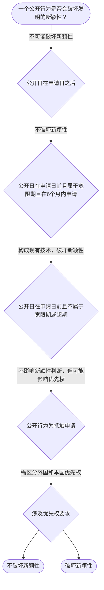

# 专家 B 教学草稿

> 专家：expert_b ｜ 风格：accessible

## 教学模块选择清单

- 当前教学节点：`patent-law-foundation`
- 板块预算：自适应 7/9，总计 9/10

| # | 模块 (block_type) | 类型 | 触发原因 (trigger) | 对应正文段 | 归属 |
|---:|---|:--:|---|---|:--:|
| 1 | `anchor_scenario` | 自适应 | perception=sensing(0.87) / cold_start | 智能制造专利场景导入｜在智能制造领域，一家企业研发了基于机器学习的柔性生产控制系统。该系统能实时优化装配流程，却面… | [A] |
| 2 | `legal_anchor` | 必选 | mandatory | 法条锚定授权条件｜《专利法》第二条 | [A] |
| 3 | `worked_example` | 自适应 | cold_start(low_confidence) | 智能制造案例演示｜某智能制造企业2023年5月在行业展会展示了其新型AI驱动生产线系统，2023年10月提交专… | [A] |
| 4 | `decision_flow` | 自适应 | input=visual(0.81) | 新颖性判定决策流程｜一个公开行为是否会破坏发明的新颖性？ | [A] |
| 5 | `mnemonic` | 自适应 | understanding=sequential(0.77) | 新颖性判断口诀｜时间轴口诀：申请日（新）前（公开）后（不新）；优先权：16个月外国，3个月外观 | [A] |
| 6 | `predict_activate` | 自适应 | processing=active(0.72) | 预测激活｜假设你在智能制造研发中，专利申请前有一次公开展示，你预测专利能否获得授权？ | [A] |
| 7 | `assessment` | 必选 | mandatory | 测评模块｜基础概念记忆 | [A] |
| 8 | `knowledge_synthesis` | 必选 | mandatory | 知识框架综合｜保护客体：发明、实用新型和外观设计 | [A] |
| 9 | `summary_card` | 自适应 | len(knowledge_sub_nodes)=3>=3 | 速查卡｜基础制度奠定新颖性判断与侵权判定框架 | [A] |

## 教学正文

## 1. 场景导入

在智能制造领域，一家企业研发了基于机器学习的柔性生产控制系统。该系统能实时优化装配流程，却面临专利申请与侵权风险：若专利申请前有公开展示，是否影响新颖性？授权后他人模仿时，如何判定直接或间接侵权？本场景将结合研发流程，引入专利基础知识，帮助理解新颖性判断（不属于现有技术）与侵权判定（基于权利要求范围）的逻辑，为后续学习奠定框架。

## 2. 人话解释

专利法律制度基础包括专利制度的基本概念、体系结构、保护对象和作用。中国专利保护发明、实用新型和外观设计三种客体，发明是新的技术方案，实用新型是适于实用的新方案，外观设计是新设计。三者共同激励发明创造、促进技术公开，推动技术应用和经济发展。中国专利制度发展历程中采用早期公开延迟审查制度，初步审查与实质审查并存。这些基础知识为判断新颖性（申请日前无公开或宽限期例外）、创造性和实用性，以及后续侵权判定（如未经许可生产经营）提供了核心框架。

## 3. 法条回扣

专利法第二条规定本法所称的发明创造是指发明、实用新型和外观设计。专利法第二十二条规定授予专利权的发明和实用新型应当具备新颖性、创造性和实用性。新颖性是指不属于现有技术，也没有相同申请在先。专利法第二十三条规定外观设计授予条件。专利法第三十条规定申请人要求优先权的期限和提交要求。这些条文是授权和保护的基础，直接关联新颖性判断与侵权判定。

## 4. 类比 / 口诀

用时间轴类比：申请日是起点，公开日是‘现有技术’标志，优先权是‘时间缓冲’。口诀记忆‘新在先、创非显、实能用’。适用边界：新颖性只看单独公开（无宽限期例外），创造性允许组合对比；抵触申请不评创造性，只影响在先申请效力；适用于研发场景对比验证，但不能用于自由论述。

## 5. 应试提示

题干关键词：现有技术、公开日、优先权类型。判断步骤：1. 确定基准日（申请日）；2. 查是否有在先相同申请或公开；3. 侵权时看权利要求是否被覆盖。常见陷阱：混淆外国优先权（3个月）和本国优先权（16个月，本国会使在先申请视为撤回）；把抵触申请当作现有技术；忽略宽限期例外。

## 6. 互动提问

在智能制造专利申请中，如果研发过程中有公开展示，是否会影响新颖性判断？请结合时间轴和优先权概念思考。


### 智能制造专利场景导入（anchor_scenario）

> 在智能制造领域，一家企业研发了基于机器学习的柔性生产控制系统。该系统能实时优化装配流程，却面临专利申请与侵权风险：若专利申请前有公开展示，是否影响新颖性？授权后他人模仿时，如何判定直接或间接侵权？本场景将结合研发流程，引入专利基础知识，帮助理解新颖性判断（不属于现有技术）与侵权判定（基于权利要求范围）的逻辑，为后续学习奠定框架。

**锚定**：用智能制造研发场景锚定专利制度基础，包括保护客体和三性概念。

**先想一想**：作为研发人员，你认为专利申请前展示是否会影响新颖性？为什么？

### 法条锚定授权条件（legal_anchor）

- **《专利法》第二条**：发明创造是指发明、实用新型和外观设计。
- **《专利法》第二十二条**：授予专利权的发明和实用新型应当具备新颖性、创造性和实用性。
- **《专利法》第二十三条**：授予专利权的外观设计应当不属于现有设计；也没有任何单位或者个人就同样的外观设计在申请日以前向国务院专利行政部门提出过申请，并记载在申请日以后公告的专利文件中。
- **《专利法》第三十条**：申请人要求发明、实用新型专利优先权的，应当在申请的时候提出书面声明，并且在第一次提出申请之日起十六个月内，提交第一次提出的专利申请文件的副本。

**为何重要**：这些是专利授权的核心条件，关系到新颖性判断和后续侵权判定的合法性基础。

### 智能制造案例演示（worked_example）

**案情/例题**：某智能制造企业2023年5月在行业展会展示了其新型AI驱动生产线系统，2023年10月提交专利申请。问：展会展示是否破坏新颖性？并说明如何结合侵权判定。
**适用规则**：《专利法》第二十二条、第二十四条（宽限期）
**分步推演**：
1. 展会属于法定公开情形，在申请日前。 → *需判断是否在宽限期内*
2. 假设宽限期6个月，申请日在宽限期内。 → *不破坏新颖性*
3. 侵权时，需看权利要求范围是否被侵权。 → *新颖性通过，侵权判定基于保护范围*
**结论**：展会展示不破坏新颖性，专利可申请；侵权判定需以授权后的权利要求为准。
**本题要点**：结合场景，先判时间轴，再分析侵权范围。

### 新颖性判定决策流程（decision_flow）

**决策问题**：一个公开行为是否会破坏发明的新颖性？



### 新颖性判断口诀（mnemonic）

**记忆锚**：时间轴口诀：申请日（新）前（公开）后（不新）；优先权：16个月外国，3个月外观
**映射**：
- 申请日
- 公开日
- 优先权
- 抵触申请
**何时用**：新颖性判断或优先权类型区分时

### 预测激活（predict_activate）

**预测/激活**：假设你在智能制造研发中，专利申请前有一次公开展示，你预测专利能否获得授权？

**激活旧知**：已学的时间轴与现有技术概念

**揭晓方向**：先分析展示日与申请日关系，再看是否有宽限期例外。

### 知识框架综合（knowledge_synthesis）

**知识框架**：
- 保护客体：发明、实用新型和外观设计
- 新颖性：申请日前不属于现有技术，无在先相同申请
- 创造性：与现有技术相比具有突出的实质性特点和显著的进步
- 实用性：能够制造或者使用并产生积极效果
- 优先权：申请日优先，外国优先权期限16个月
- 侵权判定：基于授权后的权利要求范围
**概念关系**：三性依次审查，先新颖性再创造性最后实用性；优先权影响在先申请效力；侵权基于保护范围
**必记**：三性缺一不可即不授权；新颖性判断先看时间轴；侵权判定需结合权利要求

### 速查卡（summary_card）

**要点卡**：
- **保护客体**：发明、实用新型和外观设计
- **三性**：新颖性、创造性、实用性
- **优先权**：外国16个月，本国影响在先申请
- **新颖性**：申请日前无公开，含宽限期
- **侵权**：未经许可实施授权专利
**必背**：三性缺一不可；优先权区分外国与本国；新颖性看现有技术
**一句话总结**：基础制度奠定新颖性判断与侵权判定框架

### 测评模块（assessment）

**三类覆盖**：backward_review、forward_probe、weakness_probe
**题目**：
- q1：基础概念记忆
- q2：新颖性理解
- q3：场景应用
- q4：优先权区分


## 结构化字段

## knowledge_points

```json
[
  {
    "node_id": "patent-law-foundation",
    "kc_name": "专利制度的基本概念与特征：独占性、时间性、地域性（详见子节点 patent-rights-nature）"
  },
  {
    "node_id": "patent-law-foundation",
    "kc_name": "中国专利制度体系：专利法、专利法实施细则、专利审查指南（详见子节点 patent-law-framework）"
  },
  {
    "node_id": "patent-law-foundation",
    "kc_name": "专利保护的三种客体：发明、实用新型、外观设计（专利法第2条）"
  },
  {
    "node_id": "patent-law-foundation",
    "kc_name": "专利制度的作用：激励发明创造、促进技术公开、推动技术应用和经济发展（详见子节点 patent-system-overview）"
  },
  {
    "node_id": "patent-law-foundation",
    "kc_name": "中国专利制度发展历程与特点：早期公开延迟审查、初步审查制与实质审查制并存（详见子节点 patent-system-overview）"
  }
]
```

## legal_basis

```json
[
  {
    "article": "《专利法》第二条",
    "source": "中华人民共和国专利法.txt"
  },
  {
    "article": "《专利法》第二十二条",
    "source": "中华人民共和国专利法.txt"
  },
  {
    "article": "《专利法》第二十三条",
    "source": "中华人民共和国专利法.txt"
  },
  {
    "article": "《专利法》第三十条",
    "source": "中华人民共和国专利法.txt"
  }
]
```

## risks

```json
[
  {
    "risk": "概念混淆，如将抵触申请误当作现有技术",
    "related_node_id": "patent-law-foundation"
  },
  {
    "risk": "时间轴关系错误，忽视优先权类型区分",
    "related_node_id": "patent-law-foundation"
  }
]
```

## draft_stage

```json
"debate"
```

## interactive_questions

```json
[
  {
    "qid": "q1",
    "category": "remember",
    "difficulty": "L1",
    "source_tag": "backward_review",
    "kc_node_id": "patent-law-foundation",
    "question": "专利法第二条规定的发明创造包括哪些客体？",
    "answer": "A",
    "options": [
      "A. 发明、实用新型和外观设计",
      "B. 仅发明和实用新型",
      "C. 仅外观设计",
      "D. 发明、实用新型、外观设计和商业秘密"
    ]
  },
  {
    "qid": "q2",
    "category": "understand",
    "difficulty": "L1",
    "source_tag": "backward_review",
    "kc_node_id": "patent-law-foundation",
    "question": "新颖性是指什么？",
    "answer": "A",
    "options": [
      "A. 该发明或者实用新型不属于现有技术，也没有在先相同申请",
      "B. 具有突出的实质性特点和显著进步",
      "C. 能够制造或者使用并产生积极效果",
      "D. 与现有设计或者现有设计特征的组合相比具有明显区别"
    ]
  },
  {
    "qid": "q3",
    "category": "apply",
    "difficulty": "L2",
    "source_tag": "weakness_probe",
    "kc_node_id": "patent-law-foundation",
    "question": "某智能制造企业2023年5月在行业展会展示了其新型AI驱动生产线系统，2023年10月提交专利申请。假设展会属于法定公开情形且在宽限期内，问展会展示是否破坏新颖性？",
    "answer": "A",
    "options": [
      "A. 不破坏，因为在6个月宽限期内",
      "B. 破坏，因为属于现有技术",
      "C. 需判断创造性是否通过",
      "D. 优先权要求可使之不影响"
    ]
  },
  {
    "qid": "q4",
    "category": "analyze",
    "difficulty": "L3",
    "source_tag": "forward_probe",
    "kc_node_id": "patent-rights-protection",
    "question": "申请人要求发明专利优先权，第一次申请在外国，提交时间限制是多久？",
    "answer": "A",
    "options": [
      "A. 三个月内提交第一次申请文件副本",
      "B. 十六个月内提交第一次申请文件副本",
      "C. 一年内提交第一次申请文件副本",
      "D. 无需提交副本"
    ]
  }
]
```

## knowledge_synthesis

```json
{
  "node": "patent-law-foundation",
  "coverage": [
    {
      "node_id": "patent-law-foundation"
    }
  ],
  "confusable_pairs": [
    {
      "pair": "抵触申请 vs 现有技术"
    },
    {
      "pair": "外国优先权 vs 本国优先权"
    }
  ]
}
```
