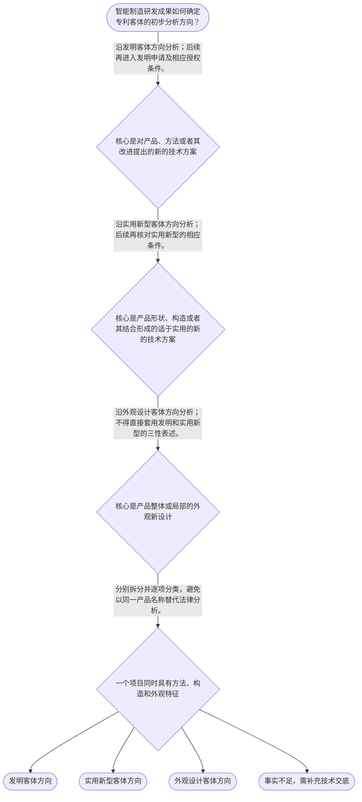

# 整合后的课程完整内容与习题

## 教学模块选择清单

- 当前教学节点：`patent-law-foundation`
- 板块预算：自适应 5/6，总计 9/9

| # | 模块 (block_type) | 类型 | 触发原因 (trigger) | 对应正文段 | 归属 |
|---:|---|:--:|---|---|:--:|
| 1 | `anchor_scenario` | 自适应 | perception=sensing(0.87) / cold_start | 智能制造研发的专利分类起点｜教学拟制场景：协作机器人抓取单元包含视觉引导轨迹控制方法、快换夹具锁止结构和夹具局部外观。研… | [A+B融合] |
| 2 | `legal_anchor` | 必选 | mandatory | 专利制度的法条坐标｜《中华人民共和国专利法》第一条 | [A] |
| 3 | `worked_example` | 自适应 | cold_start(low_confidence) | 机器人抓取单元的分类演示｜教学拟制情境：企业拟为轨迹校正方法、夹具锁止构造及夹具局部纹理分别申请专利。应怎样进行第一步… | [A+B融合] |
| 4 | `decision_flow` | 自适应 | input=visual(0.82) | 研发成果的初步分类流程｜智能制造研发成果如何确定专利客体的初步分析方向？ | [A+B融合] |
| 5 | `mnemonic` | 自适应 | understanding=sequential(0.78) | 方法、构造、外观的分类口诀｜“方看发，构看实，观归外”：先看成果表达对象，再核对法定定义。 | [B] |
| 6 | `predict_activate` | 自适应 | processing=active(0.72) | 先作分类预测｜看到视觉引导机械臂项目时，先预测轨迹控制、夹具锁止和面板图案各自应进入哪个客体方向。 | [B] |
| 7 | `assessment` | 必选 | mandatory | 本节测评索引｜复习专利法规定的三类发明创造。 | [A] |
| 8 | `knowledge_synthesis` | 必选 | mandatory | 专利法律制度基础框架｜制度目的：保护合法权益，同时鼓励创造、推动应用并促进科技和经济社会发展。 | [A+B融合] |
| 9 | `summary_card` | 自适应 | len(knowledge_sub_nodes)=3>=3 | 制度基础速查卡｜专利基础分析遵循“制度目的和规范体系在前，客体拆分与程序识别在后”的顺序。 | [B] |

## 教学正文

## 场景锚定

智能制造企业常把一套产线改造方案笼统称作“一项专利”。例如，视觉引导机械臂项目可能同时包含：根据相机坐标修正轨迹的控制方法、快速更换夹具的锁止结构，以及夹具面板的局部图案。它们服务于同一设备，却未必是同一种专利客体。

学习者希望进一步学习新颖性判断和侵权判定，但本节的唯一主节点是“专利法律制度基础”。因此，本节先建立后续判断所需的制度坐标，不直接对某项技术是否具有新颖性或某项实施行为是否构成侵权作实体结论。检索上下文未提供可直接核验的智能制造真实案例材料，以下场景均为教学拟制，不冒充真实案件。

## 法条坐标

专利制度不是单纯的“技术垄断工具”。《专利法》第一条将保护专利权人合法权益、鼓励发明创造、推动发明创造应用、提高创新能力以及促进科学技术进步和经济社会发展列为立法目的。〔RAG: 中华人民共和国专利法.txt — 第一条“保护专利权人的合法权益，鼓励发明创造，推动发明创造的应用，提高创新能力，促进科学技术进步和经济社会发展”〕

制度的基本规范体系可按三层理解：专利法提供基本法律规则；专利法实施细则承接申请和程序等具体规则；专利审查指南进一步细化审查操作。三者功能不同，不能把审查指南当作与法律条文同一层级的规范。

专利权通常具有三个基础特征：独占性是指权利人在法定边界内享有排他性利益；时间性是指保护受法定期限限制；地域性是指保护效力依授权国家或地区的法律范围而定。这是制度特征的概括，不替代后续关于权利范围、期限和侵权的具体规则。

## 三类保护客体

《专利法》第二条规定，发明创造包括发明、实用新型和外观设计。发明是对产品、方法或者其改进所提出的新的技术方案；实用新型是对产品的形状、构造或者其结合所提出的适于实用的新的技术方案；外观设计是对产品整体或者局部的形状、图案或者其结合，以及色彩与形状、图案结合所作出的富有美感并适于工业应用的新设计。〔RAG: 中华人民共和国专利法.txt — 第二条“发明创造是指发明、实用新型和外观设计”及三类客体定义〕

分类时先看成果的核心表达对象，而不是先看产品所属行业：轨迹控制方案以方法技术方案为中心，应沿发明方向识别；夹具锁止机构以产品形状、构造及其结合为中心，应沿实用新型方向识别；夹具局部轮廓、图案或色彩组合以产品外观为中心，应沿外观设计方向识别。同一智能制造项目可以拆出多个客体方向，但能否授权仍须分别满足相应法定条件。

## 制度作用与审查路径

专利制度可用“以公开换保护”理解：申请人公开技术信息，制度在法定条件满足时给予一定期间、一定地域内的保护；公开也使公众能够在已有技术信息基础上继续创新。〔RAG: 专利法律知识详细解读.txt — “专利权的取得的本质是‘以公开换保护’”〕这与第一条所列鼓励创造和推动应用的目的相互衔接。

中国制度在审查路径上呈现早期公开、延迟审查以及初步审查与实质审查并存的特点。已检索材料表明，发明专利申请经初步审查符合要求后，自申请日或优先权日起满十八个月公布；实质审查通常以申请人提出请求为前提。〔RAG: 专利法专题讲座.txt — “自申请日（有优先权的，指优先权日）起满18个月，即行公布”及“实质审查程序只有在申请人提出实质审查请求的前提下才能启动”〕实质审查制度包括对新颖性、创造性和实用性等内容的审查。〔RAG: 专利法律知识详细解读.txt — “实质审查阶段对于专利申请的新颖性、创造性和实用性进行审查”〕

这里应严格区分授权条件的适用对象：第二十二条规定发明和实用新型应具备新颖性、创造性和实用性；第二十三条对外观设计规定现有设计、明显区别和在先合法权利等要求。〔RAG: 中华人民共和国专利法.txt — 第二十二条“授予专利权的发明和实用新型，应当具备新颖性、创造性和实用性”；第二十三条关于外观设计条件〕因此，“三性”不能无差别套用于外观设计。

## 后续主题的入口

后续学习新颖性时，要先固定判断对象和时间基准。第二十二条所称现有技术，是申请日以前在国内外为公众所知的技术；对发明和实用新型，新颖性还涉及申请日前提出、申请日以后公布或公告的同样发明或实用新型。〔RAG: 中华人民共和国专利法.txt — 第二十二条关于现有技术及申请在先、公布在后的规定〕教学材料进一步提示：新颖性判断中，各项权利要求应分别与每一项现有技术或相关在先申请内容单独比较，不得将数项内容组合比较。〔RAG: 专利法专题讲座.txt — “单独地进行比较，不得将其与几项现有技术……的组合进行对比”〕创造性则是与现有技术相比是否具有法定进步的另一判断，不应混为一谈。

侵权判定同样不能只看“产品相似”或“都用了机器人”。它以后续的有效专利权、保护范围和具体实施行为为前提。本节的实际用途，是使你在接触新颖性或侵权问题时，能先问三个基础问题：成果属于什么客体，适用什么规范层级，当前处于申请审查还是授权保护阶段。

本节设有测评，请到【习题】区作答。

### 智能制造研发的专利分类起点（anchor_scenario）

> 教学拟制场景：协作机器人抓取单元包含视觉引导轨迹控制方法、快换夹具锁止结构和夹具局部外观。研发团队希望同时布局专利，却不确定应如何分类。该场景不是已检索到的真实案件。

**锚定**：同一设备中的方法、结构和外观并置，便于直观看到专利客体不能按行业名称一概而论。

**先想一想**：先不讨论新颖性或侵权：这三项成果分别主要是在表达方法、产品构造还是产品外观？

### 专利制度的法条坐标（legal_anchor）

- **《中华人民共和国专利法》第一条**：第一条说明制度同时服务于权利保护、创新激励和技术应用。
- **《中华人民共和国专利法》第二条**：第二条将保护客体区分为发明、实用新型和外观设计，并分别给出定义。
- **《中华人民共和国专利法》第二十二条、第二十三条**：第二十二条的三性适用于发明和实用新型；外观设计适用第二十三条的不同条件。

**为何重要**：后续新颖性和侵权问题都必须先确定客体与规则来源；不能把不同专利类型的条件混用。

### 机器人抓取单元的分类演示（worked_example）

**案情/例题**：教学拟制情境：企业拟为轨迹校正方法、夹具锁止构造及夹具局部纹理分别申请专利。应怎样进行第一步分类？
**适用规则**：《中华人民共和国专利法》第二条；第二十二条、第二十三条关于不同类型授权条件的区分。
**分步推演**：
1. 识别每项成果的核心表达对象：轨迹校正聚焦方法，锁止结构聚焦产品构造，纹理聚焦产品局部外观。 → *先按技术表达对象拆分，而不是按设备名称分类。*
2. 将方法与发明定义、产品构造与实用新型定义、局部外观与外观设计定义逐一对照。 → *同一产品可以产生不同客体方向。*
3. 分类仅确定后续分析入口；发明和实用新型的三性以及外观设计的法定条件，仍需分别审查。 → *分类不等于授权，更不等于侵权结论。*
**结论**：轨迹校正方法可沿发明方向识别，锁止构造可沿实用新型方向识别，局部纹理可沿外观设计方向识别。
**本题要点**：先拆分方法、构造和外观，再进入各类型的授权与保护规则。

### 研发成果的初步分类流程（decision_flow）

**决策问题**：智能制造研发成果如何确定专利客体的初步分析方向？



### 方法、构造、外观的分类口诀（mnemonic）

**记忆锚**：“方看发，构看实，观归外”：先看成果表达对象，再核对法定定义。
**映射**：
- 方看发
- 构看实
- 观归外
**何时用**：阅读研发交底书或选择申请布局方向时使用。该口诀只帮助分类，不能替代授权条件、权利范围或侵权判断。

### 先作分类预测（predict_activate）

**预测/激活**：看到视觉引导机械臂项目时，先预测轨迹控制、夹具锁止和面板图案各自应进入哪个客体方向。

**激活旧知**：将研发成果分为技术方法、产品构造和产品外观的已有经验。

**揭晓方向**：不要按“机器人”这个产品名称判断；逐项看其核心表达对象。

### 专利法律制度基础框架（knowledge_synthesis）

**知识框架**：
- 制度目的：保护合法权益，同时鼓励创造、推动应用并促进科技和经济社会发展。
- 规范体系：专利法定基本规则，实施细则和审查指南承接具体程序与审查要求。
- 保护客体：发明对应产品、方法或其改进的技术方案；实用新型对应产品构造；外观设计对应产品整体或局部外观。
- 制度作用：以公开换取法定保护，推动技术信息传播和后续创新。
- 制度特点：发明申请存在公布和实质审查路径；初步审查与实质审查并存。
**概念关系**：专利法、实施细则与审查指南处于不同规范层次。；客体分类在前，审查路径和授权条件分析在后。；新颖性与侵权属于后续专题，均不能仅以产品名称或技术领域直接下结论。
**必记**：先定客体，再谈授权条件、新颖性或侵权。；发明和实用新型适用第二十二条的三性；外观设计适用第二十三条的不同条件。；专利权具有独占性、时间性和地域性的基本制度特征。

### 制度基础速查卡（summary_card）

**要点卡**：
- **制度目的**：保护合法权益，也通过鼓励创造和推动应用服务科技与经济社会发展。
- **规范体系**：专利法定基本规则，实施细则和审查指南承接细化规则。
- **三类客体**：发明看方法或技术方案，实用新型看产品构造，外观设计看产品外观。
- **三性边界**：新颖性、创造性、实用性适用于发明和实用新型，不能直接套用于外观设计。
- **制度特点**：发明申请存在公布与实质审查路径，初步审查与实质审查并存。
**必背**：先定客体，再谈条件。；方法、构造、外观应分别识别。；本节不直接作新颖性或侵权实体结论。
**一句话总结**：专利基础分析遵循“制度目的和规范体系在前，客体拆分与程序识别在后”的顺序。

### 本节测评索引（assessment）

**三类覆盖**：backward_review、forward_probe、weakness_probe
**题目**：
- q-foundation-review-1：复习专利法规定的三类发明创造。
- q-rights-forward-1：前探侵权分析所需的有效权利与保护范围前提。
- q-foundation-weakness-1：在智能制造情境中辨析方法、构造与外观的客体方向。


## 结构化数据

## expert

```json
"A+B融合"
```

## style

```json
"fused"
```

## knowledge_points

```json
[
  {
    "node_id": "patent-law-foundation",
    "kc_name": "专利制度的基本概念与特征：独占性、时间性、地域性"
  },
  {
    "node_id": "patent-law-foundation",
    "kc_name": "中国专利制度体系：专利法、专利法实施细则、专利审查指南"
  },
  {
    "node_id": "patent-law-foundation",
    "kc_name": "专利保护的三种客体：发明、实用新型、外观设计"
  },
  {
    "node_id": "patent-law-foundation",
    "kc_name": "专利制度的作用：激励发明创造、促进技术公开、推动技术应用和经济发展"
  },
  {
    "node_id": "patent-law-foundation",
    "kc_name": "中国专利制度发展历程与特点：早期公开延迟审查、初步审查制与实质审查制并存"
  }
]
```

## legal_basis

```json
[
  {
    "article": "《中华人民共和国专利法》第一条",
    "source": "中华人民共和国专利法.txt：第一条规定保护专利权人的合法权益，鼓励发明创造，推动发明创造的应用，提高创新能力，促进科学技术进步和经济社会发展。"
  },
  {
    "article": "《中华人民共和国专利法》第二条",
    "source": "中华人民共和国专利法.txt：第二条界定发明、实用新型和外观设计。"
  },
  {
    "article": "《中华人民共和国专利法》第二十二条",
    "source": "中华人民共和国专利法.txt：第二十二条规定发明和实用新型应具备新颖性、创造性和实用性，并定义现有技术。"
  },
  {
    "article": "《中华人民共和国专利法》第二十三条",
    "source": "中华人民共和国专利法.txt：第二十三条规定外观设计与现有设计相比应具有明显区别等条件。"
  },
  {
    "article": "发明专利公布与实质审查规则",
    "source": "专利法专题讲座.txt：发明专利申请经初步审查符合要求后，自申请日或优先权日起满十八个月公布；实质审查通常以申请人请求为前提。"
  },
  {
    "article": "专利制度作用与实质审查制说明",
    "source": "专利法律知识详细解读.txt：专利权取得体现以公开换保护；实质审查包括对新颖性、创造性和实用性的审查。"
  }
]
```

## risks

```json
[
  {
    "risk": "将同一智能制造产品中的方法、产品结构和产品外观混为单一专利客体，导致分类和申请路径判断错误。",
    "related_node_id": "patent-law-foundation"
  },
  {
    "risk": "将发明、实用新型的“三性”无差别套用于外观设计，忽略第二十三条的不同法定条件。",
    "related_node_id": "patent-law-foundation"
  },
  {
    "risk": "把新颖性的单独对比与创造性的显而易见性判断混同，或把抵触申请直接等同于现有技术。",
    "related_node_id": "patent-law-foundation"
  },
  {
    "risk": "在未核对有效权利、保护范围和实施行为前，直接以产品相似认定专利侵权。",
    "related_node_id": "patent-rights-protection"
  }
]
```

## draft_stage

```json
"integration"
```

## irac

```json
{
  "issue": "智能制造研发成果进入专利布局时，如何在不提前作出新颖性或侵权实体结论的前提下，识别其专利客体、制度依据与基础审查路径？",
  "rule": "《专利法》第一条规定立法目的；第二条界定发明、实用新型和外观设计。第二十二条规定发明和实用新型的三性条件，第二十三条规定外观设计的相应条件。检索材料表明，发明申请存在初步审查、公布和实质审查的制度路径。",
  "application": "对视觉引导机械臂项目，应把轨迹控制方法、夹具锁止结构和夹具局部外观分别与第二条的法定定义对照，而不能按“机器人设备”这一行业名称作单一分类。完成分类后，才分别识别申请与审查路径；新颖性和侵权的具体事实判断留待后续节点。",
  "conclusion": "本节点应先掌握制度目的、规范体系、三类客体、制度作用和审查制度特点；对智能制造成果遵循“先拆分、再分类、后识别程序”的顺序。"
}
```

## interactive_questions

```json
[
  {
    "qid": "q-foundation-review-1",
    "category": "remember",
    "difficulty": "L1",
    "source_tag": "backward_review",
    "kc_node_id": "patent-law-foundation",
    "question": "依据《专利法》第二条，以下哪一项属于专利法所称的发明创造？",
    "answer": "A",
    "options": [
      "A. 发明、实用新型和外观设计",
      "B. 发明和商标",
      "C. 实用新型和著作权",
      "D. 所有商业经营方案"
    ]
  },
  {
    "qid": "q-rights-forward-1",
    "category": "understand",
    "difficulty": "L1",
    "source_tag": "forward_probe",
    "kc_node_id": "patent-rights-protection",
    "question": "为判断某智能制造设备的销售行为是否可能进入专利侵权分析，以下哪项是后续首先需要核对的基础？",
    "answer": "B",
    "options": [
      "A. 设备是否采用人工智能技术",
      "B. 是否存在有效专利权以及其保护范围",
      "C. 设备是否在展会上展示过",
      "D. 研发团队是否为大型企业"
    ]
  },
  {
    "qid": "q-foundation-weakness-1",
    "category": "analyze",
    "difficulty": "L3",
    "source_tag": "weakness_probe",
    "kc_node_id": "patent-law-foundation",
    "question": "某企业的柔性产线项目包括视觉坐标校正方法、可更换夹具的锁止构造和夹具面板局部图案。关于客体分类与后续判断边界，以下哪项最准确？",
    "answer": "C",
    "options": [
      "A. 三项成果均属实用新型，因为都安装在生产设备上",
      "B. 三项成果均属发明，因为都涉及制造技术",
      "C. 方法可沿发明方向识别，锁止构造可沿实用新型方向识别，局部图案可沿外观设计方向识别；是否授权仍须分别适用相应条件",
      "D. 只要项目未公开，三项成果当然获得专利权"
    ]
  }
]
```

## knowledge_synthesis

```json
{
  "node": "patent-law-foundation",
  "coverage": [
    {
      "node_id": "patent-law-foundation"
    }
  ],
  "confusable_pairs": [
    {
      "pair": "发明与实用新型：发明可包括产品、方法或者其改进；实用新型限于产品形状、构造或者其结合。"
    },
    {
      "pair": "实用新型与外观设计：前者是产品构造的技术方案，后者是产品整体或局部的外观新设计。"
    },
    {
      "pair": "新颖性与创造性：新颖性强调与单项对比内容的判断，创造性是与现有技术相比是否具有法定进步的不同判断。"
    },
    {
      "pair": "发明和实用新型的三性与外观设计条件：前者适用第二十二条，后者适用第二十三条，不能混用。"
    }
  ]
}
```
