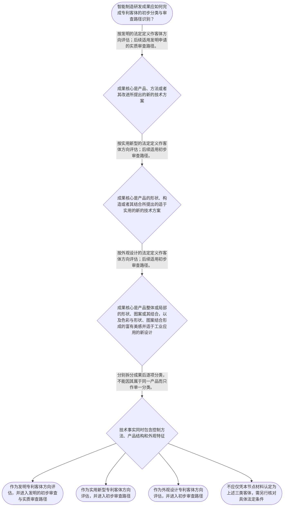

# 专家 A 教学草稿

> 专家：expert_a ｜ 风格：conservative

## 教学模块选择清单

- 当前教学节点：`patent-law-foundation`
- 板块预算：自适应 6/6，总计 9/9

| # | 模块 (block_type) | 类型 | 触发原因 (trigger) | 对应正文段 | 归属 |
|---:|---|:--:|---|---|:--:|
| 1 | `anchor_scenario` | 自适应 | perception=sensing(0.87) / cold_start | 智能制造研发团队的专利布局起点｜某智能制造团队为协作机器人开发了视觉引导的抓取单元：相机识别零件位置，控制器据此调整机械臂轨… | [A] |
| 2 | `legal_anchor` | 必选 | mandatory | 专利制度的法条坐标｜《中华人民共和国专利法》第一条 | [A] |
| 3 | `worked_example` | 自适应 | cold_start(low_confidence) | 机器人抓取单元的客体分类演示｜以下为教学演示情境，并非对具体真实案件的法律结论。某智能制造企业完成三项成果：一是根据相机坐… | [A] |
| 4 | `decision_flow` | 自适应 | input=visual(0.82) | 从研发成果到申请路径的判断流程｜智能制造研发成果应如何完成专利客体的初步分类与审查路径识别？ | [A] |
| 5 | `mnemonic` | 自适应 | understanding=sequential(0.78) | 三类客体与审查路径对照表｜“方、构、观；发、实、外”对照表：先看成果表达对象，再对应专利类型与审查路径。 | [A] |
| 6 | `predict_activate` | 自适应 | processing=active(0.72) | 先按技术表达对象作预测分类｜在阅读法条定义前，先将机器人抓取单元中的轨迹控制方法、锁止夹具结构和夹具局部纹理分别暂定为哪… | [A] |
| 7 | `assessment` | 必选 | mandatory | 本节测评索引｜复习三类专利客体的法定定义 | [A] |
| 8 | `knowledge_synthesis` | 必选 | mandatory | 专利法律制度基础框架｜专利制度基本特征：专利权以法定制度配置权利，其效力具有独占性、时间性和地域性的基本特征；具体… | [A] |
| 9 | `summary_card` | 自适应 | len(knowledge_sub_nodes)=3>=3 | 专利法律制度基础速查卡｜专利基础判断遵循“先识别制度目的与规范依据，再按方法、构造、外观分类，并对应审查路径”的顺序… | [A] |

## 教学正文

## I — 法律问题

本节的唯一主节点是“专利法律制度基础”。面对智能制造研发成果，首先需要解决的是：我国专利制度为何设置保护、适用哪些基本规范、何种成果分别可能落入发明、实用新型或外观设计，以及不同类型申请在审查制度上有何基础差异。

应先明确边界：新颖性判断与侵权判定是后续专题。本节不对某项技术是否具备新颖性、也不对某一实施行为是否构成侵权作出实体结论；本节只建立进行这些判断所必需的制度坐标。

## R — 适用规则

### 1. 制度目的与规范体系

《专利法》第一条规定，立法目的包括保护专利权人的合法权益、鼓励发明创造、推动发明创造的应用、提高创新能力，以及促进科学技术进步和经济社会发展。〔RAG: 中华人民共和国专利法.txt — 第一条“保护专利权人的合法权益，鼓励发明创造，推动发明创造的应用，提高创新能力，促进科学技术进步和经济社会发展”〕

中国专利制度以专利法为基本法律依据；专利法实施细则与专利审查指南承接申请、审查等具体规则。本节需先知道三者的层次，而不应把审查指南等同于专利法条文本。

### 2. 三类保护客体

发明，是指对产品、方法或者其改进所提出的新的技术方案。〔RAG: 专利法律知识详细解读.txt — 《专利法》第二条第二款“发明，是指对产品、方法或者其改进所提出的新的技术方案”〕

实用新型，是指对产品的形状、构造或者其结合所提出的适于实用的新的技术方案。〔RAG: 专利法律知识详细解读.txt — 《专利法》第二条第三款“实用新型，是指对产品的形状、构造或者其结合所提出的适于实用的新的技术方案”〕

外观设计，是指对产品的整体或者局部的形状、图案或者其结合，以及色彩与形状、图案的结合所作出的富有美感并适于工业应用的新设计。〔RAG: 专利法律知识详细解读.txt — 《专利法》第二条第四款“外观设计，是指对产品的整体或者局部的形状、图案或者其结合”〕

由此形成基础分类顺序：先看成果主要表达的是技术方法、产品结构，还是产品外观；再进入相应专利类型的具体条件分析。行业名称不是分类标准，不能因为成果属于“机器人”或“智能产线”就直接确定申请类型。

### 3. 审查制度的基础差异

已检索材料表明，发明专利申请采取早期公开、延迟审查的实质审查制度；发明申请初步审查合格后，自申请日或者优先权日起满十八个月首次公开，申请人需在相应期间内提出实质审查请求。〔RAG: 专利法专题讲座.txt — “发明专利申请，我国采取的审查制度是早期公开、延迟审查的‘实质审查制’”〕

发明专利申请经实质审查没有发现驳回理由的，实用新型和外观设计专利申请经初步审查没有发现驳回理由的，由国务院专利行政部门作出授予专利权的决定；专利权自公告之日起生效。〔RAG: 专利法专题讲座.txt — 《专利法》第39条、第40条的授权程序归纳〕

审查程序中，申请人收到补正通知书或者审查意见通知书后，应在指定期限内补正或者陈述意见；对申请文件的修改应针对指出的缺陷，且不得超出申请日提交的说明书和权利要求书记载的范围。〔RAG: 专利法专题讲座.txt — 《专利审查指南》第一部分第一章第3.4节〕

## A — 规则适用

以协作机器人抓取单元为例，应把研发交底书拆为三个对象，而非把整个项目笼统称为“一项机器人专利”。

第一，若核心是根据视觉坐标实时修正机械臂轨迹的控制方法，应先沿“方法技术方案”方向核对发明的法定定义。第二，若核心是可更换夹具的锁止位置、连接关系和结构配合，应先沿“产品形状、构造或者其结合”方向核对实用新型的法定定义。第三，若核心是夹具局部轮廓、图案或色彩组合形成的产品外观，应先沿外观设计的法定定义核对。

完成客体分类后，才识别程序路径：发明申请存在实质审查这一关键环节；实用新型和外观设计则以初步审查为相应授权路径。该差异解释了为何研发团队在立项、保密、申请文件准备和时间安排上需要分别管理不同成果。

专利制度的功能也在这一过程显现：制度并非只为排除竞争者而设置，而是在保护合法权益的同时，鼓励发明创造和技术应用。〔RAG: 中华人民共和国专利法.txt — 第一条关于鼓励发明创造、推动应用和促进科技进步的规定〕

## C — 结论

本节点的结论是：专利分析的第一步不是直接讨论新颖性或侵权，而是建立“制度目的—规范依据—客体分类—审查路径”的线性框架。对智能制造成果，应先区分方法、产品结构与产品外观，再分别进入相应的申请与审查分析。

> 常见误区 / 易混淆点
>
> 1. 将“同一产品”误作“同一专利客体”。一个机器人部件可以同时包含方法、结构和外观层面的不同成果，需分别识别。
> 2. 将实用新型误解为所有实用技术的统称。其法定定义聚焦于产品的形状、构造或者其结合。
> 3. 将外观设计误解为技术结构改进。外观设计的判断对象是产品整体或局部的外观新设计。
> 4. 将初步审查和实质审查混同。已检索材料明确区分发明的实质审查路径与实用新型、外观设计的初步审查路径。
> 5. 过早把本节用于回答新颖性或侵权结论。二者需要后续节点中的专门规则、时间事实和权利要求等材料，本节只能提供前提性框架。

本节设有测评，请到【习题】区作答。

### 智能制造研发团队的专利布局起点（anchor_scenario）

> 某智能制造团队为协作机器人开发了视觉引导的抓取单元：相机识别零件位置，控制器据此调整机械臂轨迹；团队还为该单元设计了可快速更换的末端夹具外形。研发负责人准备把算法、夹具结构和产品外观分别纳入专利布局，但不确定三类技术成果是否都属于同一种专利客体，也不确定提交申请后会经历怎样的审查路径。

团队同时希望日后阻止竞争者复制关键技术。当前首先要解决的不是直接判断是否侵权或是否具备新颖性，而是建立专利制度的基础坐标：专利保护哪些对象、制度依据是什么、不同专利类型适用何种审查路径，以及制度为何要求以公开换取法定期限内的权利。

**锚定**：该研发场景锚定专利客体分类、制度功能与审查制度的基础框架。

**先想一想**：面对同一套机器人抓取单元，技术方案、夹具结构与外观设计应当怎样分别识别其可能对应的专利客体？

### 专利制度的法条坐标（legal_anchor）

- **《中华人民共和国专利法》第一条**：专利制度通过保护专利权人合法权益，同时鼓励发明创造、推动应用、提高创新能力并促进科技和经济社会发展。
- **《中华人民共和国专利法》第二条第二款至第四款**：发明覆盖产品、方法或者其改进的新的技术方案；实用新型限定于产品形状、构造或者其结合的适于实用的新的技术方案；外观设计保护产品整体或局部的外观新设计。
- **《中华人民共和国专利法》第三十九条、第四十条**：发明申请经实质审查没有驳回理由后授权；实用新型和外观设计申请经初步审查没有驳回理由后授权，专利权自公告之日起生效。

**为何重要**：判断新颖性和侵权前，必须先确认技术成果属于何种专利客体，并理解不同类型申请所处的法定审查制度。否则会把算法方法、产品结构和产品外观混为同一判断对象。

### 机器人抓取单元的客体分类演示（worked_example）

**案情/例题**：以下为教学演示情境，并非对具体真实案件的法律结论。某智能制造企业完成三项成果：一是根据相机坐标实时修正机械臂抓取轨迹的控制方法；二是带有锁止结构的可更换金属夹具；三是该夹具局部表面形成的辨识性纹理与轮廓。企业拟分别申请专利。应如何先作保护客体分类，并识别其后续审查路径？
**适用规则**：《中华人民共和国专利法》第二条第二款至第四款；《中华人民共和国专利法》第三十九条、第四十条。
**分步推演**：
1. 先区分成果解决的是技术方法、产品结构还是产品外观。控制方法属于对方法提出的技术方案这一候选范围；锁止夹具聚焦产品形状、构造及其结合；纹理与轮廓聚焦产品局部外观。 → *分类以成果的技术表达对象为起点，而非以“机器人”这一行业标签为起点。*
2. 依《专利法》第二条第二款至第四款，方法技术方案对应发明的法定定义；产品形状、构造或者其结合的适于实用的新的技术方案对应实用新型；产品整体或局部形状、图案等形成的富有美感并适于工业应用的新设计对应外观设计。 → *三种客体有不同的法定定义，不能互相替代。*
3. 再按《专利法》第三十九条、第四十条识别审查制度：发明须经实质审查没有发现驳回理由；实用新型和外观设计经初步审查没有发现驳回理由，方可作出授予专利权的决定。 → *客体分类决定后续申请和审查路径的基本分流。*
**结论**：机器人轨迹调整方法可作为发明专利客体方向评估；夹具的产品结构可作为实用新型客体方向评估；夹具可见外观的新设计可作为外观设计客体方向评估。三者是否最终授权，仍须分别经过相应法定审查。
**本题要点**：研发成果先按“方法、产品结构、产品外观”作客体拆分，再进入授权条件和权利保护的后续分析。

### 从研发成果到申请路径的判断流程（decision_flow）

**决策问题**：智能制造研发成果应如何完成专利客体的初步分类与审查路径识别？



### 三类客体与审查路径对照表（mnemonic）

**记忆锚**：“方、构、观；发、实、外”对照表：先看成果表达对象，再对应专利类型与审查路径。
**映射**：
- 方—发
- 构—实
- 观—外
**何时用**：看到研发交底书、准备确定申请类型或需要解释不同审查制度时，先用该表完成分类。

### 先按技术表达对象作预测分类（predict_activate）

**预测/激活**：在阅读法条定义前，先将机器人抓取单元中的轨迹控制方法、锁止夹具结构和夹具局部纹理分别暂定为哪一种专利客体方向。

**激活旧知**：已有的研发成果拆分经验，以及“技术方法、产品结构、产品外观”三种表达对象的初步区分。

**揭晓方向**：不要按产品名称判断；依次观察成果是否以方法、产品构造或产品外观为核心表达对象。

### 专利法律制度基础框架（knowledge_synthesis）

**知识框架**：
- 专利制度基本特征：专利权以法定制度配置权利，其效力具有独占性、时间性和地域性的基本特征；具体权利范围与期限规则留待后续节点展开。
- 制度依据体系：专利法提供基本法律规则，专利法实施细则和专利审查指南共同承接申请、审查等具体规则。
- 三类保护客体：发明保护产品、方法或者其改进的新的技术方案；实用新型保护产品形状、构造或者其结合的适于实用的新的技术方案；外观设计保护产品整体或局部外观的新设计。
- 制度作用：通过保护合法权益、鼓励发明创造和推动应用，服务创新能力、科技进步与经济社会发展。
- 审查制度特点：发明采取早期公开、延迟审查的实质审查制；实用新型和外观设计经初步审查后进入相应授权决定路径。
**概念关系**：制度目的解释为何设置专利保护与技术公开的制度安排。；技术成果的客体分类在前，申请文件和审查路径识别在后。；发明、实用新型、外观设计均须先有法定客体基础，但发明与另外两类在审查制度上存在核心差异。；新颖性判断和侵权判定属于后续节点：本节点只建立其所依赖的客体分类和制度框架。
**必记**：判断任何智能制造成果前，先区分其核心表达对象是方法、产品结构还是产品外观。；发明、实用新型和外观设计的法定定义不同，不能以同一产品名称替代客体分析。；发明经实质审查没有驳回理由后授予；实用新型和外观设计经初步审查没有驳回理由后授予。

### 专利法律制度基础速查卡（summary_card）

**要点卡**：
- **基本特征**：专利权具有独占性、时间性和地域性的制度属性，具体规则需按法定边界判断。
- **法律规范体系**：专利法定基本规则，实施细则和专利审查指南承接程序与审查细化。
- **发明**：产品、方法或者其改进所提出的新的技术方案。
- **实用新型**：产品形状、构造或者其结合所提出的适于实用的新的技术方案。
- **外观设计**：产品整体或局部外观形成的富有美感并适于工业应用的新设计。
- **审查路径**：发明以实质审查为关键路径；实用新型和外观设计以初步审查为关键路径。
**必背**：《专利法》第一条的制度目的包括保护合法权益、鼓励发明创造、推动应用、提高创新能力并促进科技和经济社会发展。；《专利法》第二条第二款至第四款分别规定发明、实用新型和外观设计的法定定义。；发明专利申请与实用新型、外观设计专利申请在法定审查制度上存在差异。
**一句话总结**：专利基础判断遵循“先识别制度目的与规范依据，再按方法、构造、外观分类，并对应审查路径”的顺序。

### 本节测评索引（assessment）

**三类覆盖**：backward_review、forward_probe、weakness_probe
**题目**：
- q-foundation-review-1：复习三类专利客体的法定定义
- q-rights-forward-1：探测发明专利权生效时点
- q-foundation-weakness-1：综合辨析同一智能制造产品中的多类成果与审查路径


## 结构化字段

## knowledge_points

```json
[
  {
    "node_id": "patent-law-foundation",
    "kc_name": "专利制度的基本概念与特征：独占性、时间性、地域性"
  },
  {
    "node_id": "patent-law-foundation",
    "kc_name": "中国专利制度体系：专利法、专利法实施细则、专利审查指南"
  },
  {
    "node_id": "patent-law-foundation",
    "kc_name": "专利保护的三种客体：发明、实用新型、外观设计"
  },
  {
    "node_id": "patent-law-foundation",
    "kc_name": "专利制度的作用：激励发明创造、促进技术公开、推动技术应用和经济发展"
  },
  {
    "node_id": "patent-law-foundation",
    "kc_name": "中国专利制度发展历程与特点：早期公开延迟审查、初步审查制与实质审查制并存"
  }
]
```

## legal_basis

```json
[
  {
    "article": "《中华人民共和国专利法》第一条",
    "source": "中华人民共和国专利法.txt：第一条“为了保护专利权人的合法权益，鼓励发明创造，推动发明创造的应用，提高创新能力，促进科学技术进步和经济社会发展，制定本法。”"
  },
  {
    "article": "《中华人民共和国专利法》第二条第二款至第四款",
    "source": "专利法律知识详细解读.txt：第二条第二款至第四款分别载明发明、实用新型、外观设计的定义。"
  },
  {
    "article": "《中华人民共和国专利法》第三十九条、第四十条",
    "source": "专利法专题讲座.txt：发明经实质审查没有发现驳回理由、实用新型和外观设计经初步审查没有发现驳回理由的，由国务院专利行政部门作出授予专利权的决定；专利权自公告之日起生效。"
  },
  {
    "article": "《专利审查指南》第一部分第一章第3.4节及相关审查规则",
    "source": "专利法专题讲座.txt：申请人收到补正通知书或者审查意见通知书后，应在指定期限内补正或者陈述意见；修改不得超出申请日提交的说明书和权利要求书记载范围。"
  }
]
```

## risks

```json
[
  {
    "risk": "将同一智能制造产品上的方法、产品结构和产品外观误认为只能对应一种专利类型，导致客体分类错误。",
    "related_node_id": "patent-law-foundation"
  },
  {
    "risk": "把发明的实质审查与实用新型、外观设计的初步审查混同，误解三类申请的法定程序差异。",
    "related_node_id": "patent-law-foundation"
  },
  {
    "risk": "学习者目标涉及新颖性，但当前活动窗口仅为专利法律制度基础；本稿不对新颖性作实体判断，避免越界讲授。",
    "related_node_id": "novelty"
  },
  {
    "risk": "学习者目标涉及侵权判定，但侵权构成与保护范围属于后续节点；本稿仅提供其前提性的制度与客体框架。",
    "related_node_id": "infringement-types"
  }
]
```

## draft_stage

```json
"debate"
```

## irac

```json
{
  "issue": "智能制造研发成果进入专利布局时，如何在不提前混入新颖性或侵权实体判断的前提下，识别中国专利制度的基本依据、保护客体及相应审查制度？",
  "rule": "《专利法》第一条规定本法旨在保护专利权人合法权益，鼓励发明创造，推动发明创造的应用，提高创新能力，促进科学技术进步和经济社会发展。《专利法》第二条第二款至第四款分别界定发明、实用新型和外观设计。《专利法》第三十九条、第四十条所示程序规则表明，发明经实质审查没有发现驳回理由后授予，实用新型和外观设计经初步审查没有发现驳回理由后授予。",
  "application": "对智能制造中的机器人抓取单元，不能仅因成果均服务于同一设备便作单一分类。应先将轨迹控制方法、夹具结构和夹具局部外观分别与《专利法》第二条的法定定义对照；完成分类后，再依《专利法》第三十九条、第四十条识别发明与实用新型、外观设计的审查制度差异。新颖性判断和侵权判定尚未进入本节主教学范围，只能以本节建立的客体和程序基础为前提。",
  "conclusion": "本节应掌握专利制度目的、法律规范体系、三类保护客体、制度作用及发明与实用新型、外观设计的审查制度差异。对智能制造成果，先分类、后识别程序；新颖性和侵权的具体判定留待后续节点。"
}
```

## interactive_questions

```json
[
  {
    "qid": "q-foundation-review-1",
    "category": "understand",
    "difficulty": "L1",
    "source_tag": "backward_review",
    "kc_node_id": "patent-law-foundation",
    "question": "根据《专利法》第二条，以下哪项最符合“发明”的法定定义？",
    "answer": "A",
    "options": [
      "A. 对产品、方法或者其改进所提出的新的技术方案",
      "B. 仅对产品外观所作出的美术设计",
      "C. 仅对产品形状和构造所作出的任何改进",
      "D. 对商业经营规则所作出的安排"
    ]
  },
  {
    "qid": "q-rights-forward-1",
    "category": "remember",
    "difficulty": "L1",
    "source_tag": "forward_probe",
    "kc_node_id": "patent-rights-protection",
    "question": "依据已检索材料中《专利法》第三十九条的表述，发明专利权自何时生效？",
    "answer": "C",
    "options": [
      "A. 发明专利申请递交之日",
      "B. 发明专利申请初步审查合格之日",
      "C. 国务院专利行政部门作出授予决定并登记公告之日",
      "D. 发明人完成技术方案之日"
    ]
  },
  {
    "qid": "q-foundation-weakness-1",
    "category": "analyze",
    "difficulty": "L3",
    "source_tag": "weakness_probe",
    "kc_node_id": "patent-law-foundation",
    "question": "某企业的协作机器人项目同时包含轨迹控制方法、可更换夹具的锁止结构和夹具局部纹理。就本节点的客体分类与审查制度而言，以下判断最准确的是？",
    "answer": "D",
    "options": [
      "A. 同一机器人产品只能选择一种专利类型，因此三项成果必须统一按发明申请",
      "B. 轨迹控制方法、锁止夹具结构和夹具局部纹理均当然属于实用新型，因为都安装在产品上",
      "C. 轨迹控制方法、锁止夹具结构和夹具局部纹理均当然属于外观设计，因为最终呈现在机器人上",
      "D. 应分别按方法技术方案、产品形状构造、产品局部外观识别客体方向；发明以实质审查为关键路径，实用新型和外观设计以初步审查为关键路径"
    ]
  }
]
```

## knowledge_synthesis

```json
{
  "node": "patent-law-foundation",
  "coverage": [
    {
      "node_id": "patent-law-foundation"
    }
  ],
  "confusable_pairs": [
    {
      "pair": "发明与实用新型：前者可涵盖产品、方法或者其改进；后者限定于产品形状、构造或者其结合。"
    },
    {
      "pair": "实用新型与外观设计：前者保护产品结构技术方案，后者保护产品整体或局部外观的新设计。"
    },
    {
      "pair": "初步审查与实质审查：已检索材料表明发明的授权以实质审查没有发现驳回理由为前提，实用新型和外观设计以初步审查没有发现驳回理由为前提。"
    }
  ]
}
```
