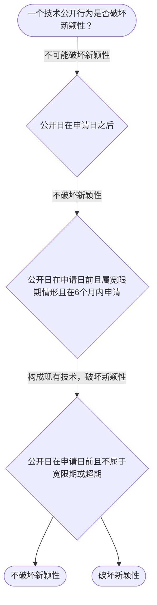

# 专家 B 教学草稿

> 专家：expert_b ｜ 风格：accessible

## 教学模块选择清单

- 当前教学节点：`patent-law-foundation`
- 板块预算：自适应 4/5，总计 5/5

| # | 模块 (block_type) | 类型 | 触发原因 (trigger) | 对应正文段 | 归属 |
|---:|---|:--:|---|---|:--:|
| 1 | `anchor_scenario` | 自适应 | perception=sensing(0.87) / cold_start | 场景导入｜智能制造公司研发新型AI关节模组，在国内展会展示后提交专利申请，担心展会公开是否影响授权。既… | [A] |
| 2 | `legal_anchor` | 必选 | mandatory | 法条锚定｜《专利法》第二条 | [B] |
| 3 | `worked_example` | 自适应 | cold_start(low_confidence) | 案例演示｜智能制造公司2024年5月在政府主办展会上展示AI机器人技术，2024年10月提交发明专利申… | [A] |
| 4 | `decision_flow` | 自适应 | input=visual(0.82) | 决策流程｜一个技术公开行为是否破坏新颖性？ | [B] |
| 5 | `mnemonic` | 自适应 | understanding=sequential(0.78) | 记忆口诀｜三性记忆表：新（没公开过）/创（不显而易见）/实（能用且有用） | [A] |
| 6 | `predict_activate` | 自适应 | processing=active(0.72) | 预测激活｜如果你是发明人，展会展示了你的AI机器人技术，专利还能不能申请？先猜一个答案。 | [B] |
| 7 | `knowledge_synthesis` | 必选 | mandatory | 知识综合｜保护客体：发明、实用新型、外观设计 | [A] |
| 8 | `summary_card` | 自适应 | len(knowledge_sub_nodes)=3>=3 | 速查卡｜先过保护客体之门，再过三性安检。 | [B] |

## 教学正文

## 1. 场景导入
想象一下：一家智能制造公司研发了一款基于AI的柔性机器人关节模组，他们在国内某大型展会上展示了这项技术，之后在专利局提交了发明专利申请。展会展示是否会影响新颖性？申请日如何确定？这些问题在智能制造领域非常常见。今天我们就从这个真实研发场景切入，了解专利法律制度基础。

## 2. 人话解释
专利制度是保护发明创造的法律框架，它让发明人能在一定时间内独占自己的技术，激励大家去创新。核心是授权的三种条件：新颖性、创造性和实用性。专利保护的对象包括发明、实用新型和外观设计三种。中国专利制度有自己的特点：先申请制，审查分初步和实质两步。掌握这些基础，才能在智能制造研发中正确判断是否能申请专利。

## 3. 法条回扣
《专利法》第二条：本法所称的发明创造是指发明、实用新型和外观设计。发明，是指对产品、方法或者其改进所提出的新的技术方案。
《专利法》第一条：为了保护专利权人的合法权益，鼓励发明创造，推动发明创造的应用，提高创新能力，促进科学技术进步和经济社会发展，制定本法。
《专利法》第八十二条：本法自1985年4月1日起施行。

## 4. 类比 / 口诀
把专利制度比作‘技术护照’：发明像护照上的照片，专利授权就是给照片盖章，保护期就是护照有效期。记忆口诀是“三性三关”：新（没公开过）、创（不显而易见）、实（能用且有用）。适用边界：新颖性看单独公开，创造性看组合是否显而易见，实用性看能不能实际应用。边界线是必须在申请日前公开，否则可能破坏权利。

## 5. 应试提示
题干中常出现“展会展示”“同日申请”“不公开使用”。判断步骤：先看公开日期，再看是否属宽限期或抵触申请，最后看是否显而易见。常见陷阱是把抵触申请当成现有技术，或忽略实用性需‘积极效果’。

## 6. 互动提问
你认为在智能制造中，公开使用技术是否能申请专利？为什么？

### 场景导入（anchor_scenario）

> 智能制造公司研发新型AI关节模组，在国内展会展示后提交专利申请，担心展会公开是否影响授权。既有研发场景又有时间界限问题。

**锚定**：用智能制造真实研发场景锚定专利制度基础概念

**先想一想**：如果你是专利代理人，看到展会展示动作，第一反应是风险还是安全？为什么？

### 法条锚定（legal_anchor）

- **《专利法》第二条**：发明创造指发明、实用新型、外观设计，三种保护客体
- **《专利法》第一条**：立法宗旨是保护权益、鼓励发明、促进科技进步

**为何重要**：本节点是整个专利法律制度的基础，三性审查和保护客体判断必须先立住条文

### 案例演示（worked_example）

**案情/例题**：智能制造公司2024年5月在政府主办展会上展示AI机器人技术，2024年10月提交发明专利申请，问：展会公开是否破坏新颖性？
**适用规则**：《专利法》第二十四条（不丧失新颖性宽限期）
**分步推演**：
1. 展会是政府主办国际展会，属法定宽限期情形 → *落入公开豁免范围*
2. 申请日距展会约5个月，在6个月宽限期内 → *时间符合要求*
3. 宽限期仅豁免该公开，不改变三性实质 → *仍需判断创造性和实用性*
**结论**：展会公开不破坏新颖性，但实体三性仍须满足。
**本题要点**：先判公开范围，再算日期，宽限期是缓冲但非免死金牌。

### 决策流程（decision_flow）

**决策问题**：一个技术公开行为是否破坏新颖性？



### 记忆口诀（mnemonic）

**记忆锚**：三性记忆表：新（没公开过）/创（不显而易见）/实（能用且有用）
**映射**：
- 新
- 创
- 实
**何时用**：看到‘授权条件’或‘为什么不给专利’时先过三性表

### 预测激活（predict_activate）

**预测/激活**：如果你是发明人，展会展示了你的AI机器人技术，专利还能不能申请？先猜一个答案。

**激活旧知**：已学的现有技术概念

**揭晓方向**：先看展出日与申请日谁在前，再看有没有‘官方展会’这个例外口袋。

### 知识综合（knowledge_synthesis）

**知识框架**：
- 保护客体：发明、实用新型、外观设计
- 制度体系：专利法、细则、审查指南
- 制度特点：早期公开、初步与实质审查并存
**概念关系**：先过保护客体之门，再过三性安检，最后看制度特点
**必记**：三性缺一不可，否则不授权；新颖性看单独对比，创造性看组合显而易见

### 速查卡（summary_card）

**要点卡**：
- **保护客体**：能申请专利的‘东西’范围
- **三性**：新颖性/创造性/实用性三关
- **制度特点**：早期公开、初步与实质审查并存
**必背**：三性缺一不可；新颖性看单独公开，创造性看组合显而易见
**一句话总结**：先过保护客体之门，再过三性安检。


## 结构化字段

## knowledge_points

```json
[
  {
    "node_id": "patent-law-foundation",
    "kc_name": "专利制度的基本概念与特征：独占性、时间性、地域性"
  },
  {
    "node_id": "patent-law-foundation",
    "kc_name": "中国专利制度体系：专利法、专利法实施细则、专利审查指南"
  },
  {
    "node_id": "patent-law-foundation",
    "kc_name": "专利保护的三种客体：发明、实用新型、外观设计（专利法第2条）"
  },
  {
    "node_id": "patent-law-foundation",
    "kc_name": "专利制度的作用：激励发明创造、促进技术公开、推动技术应用和经济发展"
  },
  {
    "node_id": "patent-law-foundation",
    "kc_name": "中国专利制度发展历程与特点：早期公开延迟审查、初步审查制与实质审查制并存"
  }
]
```

## legal_basis

```json
[
  {
    "article": "《专利法》第二条",
    "source": "中华人民共和国专利法.txt"
  },
  {
    "article": "《专利法》第一条",
    "source": "中华人民共和国专利法.txt"
  },
  {
    "article": "《专利法》第八十二条",
    "source": "专利法律知识详细解读.txt"
  }
]
```

## risks

```json
[
  {
    "risk": "新颖性与创造性混淆，导致判断错误",
    "related_node_id": "patent-law-foundation"
  }
]
```

## draft_stage

```json
"debate"
```

## interactive_questions

```json
[
  {
    "qid": "q1",
    "category": "remember",
    "difficulty": "L1",
    "source_tag": "backward_review",
    "kc_node_id": "patent-law-foundation",
    "question": "专利法第二条规定的发明创造包括哪些客体？",
    "answer": "A",
    "options": [
      "A. 发明、实用新型、外观设计",
      "B. 仅发明和实用新型",
      "C. 仅外观设计",
      "D. 所有技术方案"
    ]
  },
  {
    "qid": "q2",
    "category": "understand",
    "difficulty": "L1",
    "source_tag": "forward_probe",
    "kc_node_id": "patent-rights-protection",
    "question": "中国专利制度的特点是先申请制还是先使用制？",
    "answer": "A",
    "options": [
      "A. 先申请制",
      "B. 先使用制",
      "C. 同时申请",
      "D. 优先权"
    ]
  },
  {
    "qid": "q3",
    "category": "apply",
    "difficulty": "L2",
    "source_tag": "weakness_probe",
    "kc_node_id": "patent-law-foundation",
    "question": "如果发明人在申请日前在政府主办展会公开了技术，6个月内申请，是否破坏新颖性？",
    "answer": "A",
    "options": [
      "A. 不破坏，因为在宽限期内",
      "B. 破坏，因为公开了",
      "C. 需看创造性",
      "D. 仅影响实用性"
    ]
  },
  {
    "qid": "q4",
    "category": "analyze",
    "difficulty": "L3",
    "source_tag": "weakness_probe",
    "kc_node_id": "patent-law-foundation",
    "question": "在智能制造研发中，某团队展示AI机器人后又修改了技术方案，提交申请，最可能的问题是？",
    "answer": "A",
    "options": [
      "A. 新颖性被破坏",
      "B. 创造性被否定",
      "C. 实用性未审查",
      "D. 申请无效"
    ]
  }
]
```

## knowledge_synthesis

```json
{
  "node": "patent-law-foundation",
  "coverage": [
    {
      "node_id": "patent-law-foundation"
    }
  ],
  "confusable_pairs": [
    {
      "pair": "新颖性 vs 创造性"
    },
    {
      "pair": "抵触申请 vs 现有技术"
    }
  ]
}
```
